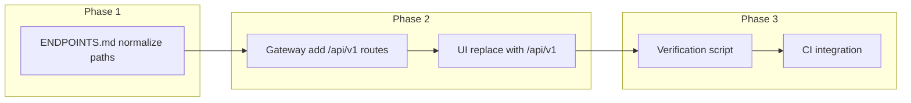

# Plan: Check All Endpoints and Enforce API Rules

**Status:** Phase 1 (ENDPOINTS.md) done. Phase 2 (Gateway + UI) done: gateway has /api/v1/* routes; UI uses /api/v1/... only. Phase 3 done: `scripts/check-api-rules.mjs` runs in CI (`.github/workflows/quality.yml` job `api-rules`); `documentation/endpoints/README.md` documents `pnpm run check:api-rules`.

## Goal

Enforce the single convention **client path = gateway path = `/api/v1/<service-path>`** for every endpoint in [ENDPOINTS.md](documentation/endpoints/ENDPOINTS.md), across Gateway, UI, and the doc itself, per [API_RULES.md](documentation/endpoints/API_RULES.md).

## Scope

- **Gateway:** [containers/api-gateway/src/routes/index.ts](containers/api-gateway/src/routes/index.ts) — route table only (no backend code).
- **UI:** All `apiFetch(...)` and backend `fetch(...)` in `ui/src` (paths only).
- **ENDPOINTS.md:** Path column in every section; section headers that mention pathRewrite/prefix.

Enforcement is by **path prefix** (e.g. `/api/v1/auth`, `/api/v1/users`) so each logical API area is checked once; individual method+path rows are covered by that prefix.

---

## 1. ENDPOINTS.md — Normalize to client path = `/api/v1/...`

**Rule (API_RULES §4):** Path column = client path = gateway path = `/api/v1/...`.

**Actions:**

- **Section 1 (Auth):** Paths are already `/api/v1/auth/...`. Update section header from "`/api/auth` → pathRewrite `/api/v1/auth`" to "Client path: `/api/v1/auth`" (or similar) so the doc describes client path, not gateway internals.
- **Section 2 (User Management):** Paths are already `/api/v1/...`. Normalize **service-relative** rows: change `GET | /health` and `GET | /ready` to either `GET | /api/v1/users/health` (if that is the client path when calling via gateway) or add a Note: "Service-relative; not used as client path."
- **Section 16 (Secret Management):** Today paths are `/api/secrets/...`. Change every row to **client path** `/api/v1/secrets/...` (e.g. `GET | /api/v1/secrets`, `GET | /api/v1/secrets/:id`). Add Note on section: "Gateway pathRewrite to backend `/api/secrets` if backend keeps that prefix."
- **Section 17 (Notification Manager):** Today paths are `/notifications`, `/preferences`, `/templates`. Change to **client path** `/api/v1/notifications`, `/api/v1/preferences`, `/api/v1/templates` (e.g. `GET | /api/v1/notifications`, `PUT | /api/v1/notifications/:id/read`, etc.). Align with notification-manager backend prefix `/api/v1/notifications` etc. (see [containers/notification-manager/src/server.ts](containers/notification-manager/src/server.ts)).
- **All other sections:** Where Path is already `/api/v1/...`, no change. Where Path is **only** `/health`, `/ready`, or `/metrics` (service-relative), either use the service’s health path under `/api/v1/...` if exposed via gateway, or add a short Note that these are service-relative and not the client path.
- **Section 18 (Services not in Gateway):** Already documents client path as "e.g. /api/v1/reasoning when configured". Leave as-is or tighten wording to "Client path: /api/v1/..." for consistency.

**Output:** ENDPOINTS.md has no client-facing path that is not `/api/v1/...` (except documented service-relative /health, /ready, /metrics).

---

## 2. Gateway — Register `/api/v1/...` and use pathRewrite only when backend differs

**Rule (API_RULES §2):** Register routes by backend path; no rewrite when backend uses `/api/v1/...`; pathRewrite only when backend uses a different prefix.

**Current gaps / mismatches:**

| Current gateway path | Issue | Action |
|----------------------|--------|--------|
| `/api/auth` (pathRewrite) | Client should call `/api/v1/auth`. | Add route **path: `/api/v1/auth`** → auth, **no pathRewrite** (backend already uses `/api/v1/auth`). Remove or keep `/api/auth` only for backward compatibility during migration; then remove. |
| `/api/users` (pathRewrite) | Same. | Add **path: `/api/v1/users`** → user_management, no pathRewrite. Optionally keep `/api/users` temporarily. |
| `/api/notifications` (stripPrefix) | Backend uses `/api/v1/notifications`. | Add **path: `/api/v1/notifications`** → notification, no rewrite. Fix stripPrefix so backend receives full path. |
| `/api/dashboard` (stripPrefix) | UI calls `/api/v1/dashboards/...`. | Add **path: `/api/v1/dashboards`** → dashboard, no rewrite. |
| `/api/conversations` (pathRewrite) | Client should use `/api/v1/conversations`. | Add **path: `/api/v1/conversations`** → ai_conversation, no pathRewrite. |
| `/api/invitations` (pathRewrite) | Client should use `/api/v1/invitations`. | Add **path: `/api/v1/invitations`** → user_management, no pathRewrite (if backend has `/api/v1/invitations`). |
| `/api/secrets` (stripPrefix) | Backend may use `/api/secrets`. | Add **path: `/api/v1/secrets`** → secret_management, **pathRewrite** so backend receives `/api/secrets/...` (only exception where pathRewrite is needed). |
| Missing | User Management: `/api/v1/teams`, `/api/v1/users` not registered. | Register **`/api/v1/users`** and **`/api/v1/teams`** → user_management, stripPrefix: false. |

**Implementation steps:**

1. In [containers/api-gateway/src/routes/index.ts](containers/api-gateway/src/routes/index.ts), add new route entries **before** the catch-all `/api/v1` (risk_analytics):
   - `/api/v1/auth` → auth (no pathRewrite if auth service serves at `/api/v1/auth`).
   - `/api/v1/users` → user_management.
   - `/api/v1/teams` → user_management.
   - `/api/v1/notifications` → notification (no stripPrefix; backend uses `/api/v1/notifications`).
   - `/api/v1/preferences` → notification.
   - `/api/v1/templates` → notification (if notification-manager serves templates under that path).
   - `/api/v1/dashboards` → dashboard.
   - `/api/v1/conversations` → ai_conversation.
   - `/api/v1/invitations` → user_management.
   - `/api/v1/secrets` → secret_management with pathRewrite so backend gets `/api/secrets/...` (confirm secret service’s actual prefix first).
2. For backends that already use `/api/v1/...`, use **stripPrefix: false** and **no pathRewrite**.
3. Optionally remove legacy entries (`/api/auth`, `/api/users`, `/api/notifications`, `/api/dashboard`, `/api/conversations`, `/api/invitations`) in a follow-up after UI is migrated, or keep them as pathRewrite to `/api/v1/...` and document as deprecated.
4. Update gateway unit/integration tests that rely on legacy paths and add tests for new `/api/v1/...` paths.

**Output:** Every path prefix used in ENDPOINTS.md (as client path) has a gateway route with path `/api/v1/<prefix>`; pathRewrite only for secrets (and any other service that does not use `/api/v1/...`).

---

## 3. UI — Call only `/api/v1/...`

**Rule (API_RULES §3):** Always call `/api/v1/...`; no `/api/auth`, `/api/users`, etc.

**Known violations (from grep):**

- [ui/src/app/login/page.tsx](ui/src/app/login/page.tsx): `/api/auth/login`, `/api/auth/login/complete-mfa` → `/api/v1/auth/login`, `/api/v1/auth/login/complete-mfa`.
- [ui/src/app/register/page.tsx](ui/src/app/register/page.tsx): `/api/auth/register` → `/api/v1/auth/register`.
- [ui/src/app/forgot-password/page.tsx](ui/src/app/forgot-password/page.tsx): `/api/auth/forgot-password` → `/api/v1/auth/forgot-password`.
- [ui/src/app/reset-password/page.tsx](ui/src/app/reset-password/page.tsx): `/api/auth/reset-password` → `/api/v1/auth/reset-password`.
- [ui/src/app/logout/page.tsx](ui/src/app/logout/page.tsx): `/api/auth/logout` → `/api/v1/auth/logout`.
- [ui/src/app/settings/mfa/enroll/page.tsx](ui/src/app/settings/mfa/enroll/page.tsx): `/api/auth/mfa/enroll`, `/api/auth/mfa/verify` → `/api/v1/auth/mfa/enroll`, `/api/v1/auth/mfa/verify`.
- [ui/src/app/settings/security/page.tsx](ui/src/app/settings/security/page.tsx): `/api/users/me/*`, `/api/auth/mfa/*`, `/api/auth/api-keys` → `/api/v1/users/me/*`, `/api/v1/auth/mfa/*`, `/api/v1/auth/api-keys`.
- [ui/src/app/settings/profile/page.tsx](ui/src/app/settings/profile/page.tsx): `/api/users/me` → `/api/v1/users/me`.
- [ui/src/components/AppSidebar.tsx](ui/src/components/AppSidebar.tsx): `/api/users/me` → `/api/v1/users/me`.
- [ui/src/app/conversations/page.tsx](ui/src/app/conversations/page.tsx): `/api/conversations` → `/api/v1/conversations`.
- [ui/src/app/dashboard/page.tsx](ui/src/app/dashboard/page.tsx): `/api/dashboard/api/v1/dashboards/manager/prioritized` → `/api/v1/dashboards/manager/prioritized` (fix double path).
- [ui/src/app/admin/security/audit/page.tsx](ui/src/app/admin/security/audit/page.tsx): `/api/logging/api/v1/export` → use correct client path from ENDPOINTS (e.g. `/api/v1/logs/export` per Logging section).

**Actions:**

1. Grep entire `ui/src` for `apiFetch('/api/` and `fetch(` that build URLs with `/api/` and list every path that does not start with `/api/v1/`.
2. Replace each violation with the corresponding `/api/v1/...` path from ENDPOINTS.md.
3. Fix malformed paths (e.g. `/api/dashboard/api/v1/...` → `/api/v1/dashboards/...`, `/api/logging/api/v1/...` → `/api/v1/logs/...` or whatever is documented).

**Output:** No UI code calls a path starting with `/api/` that is not `/api/v1/`.

---

## 4. Verification — Script and CI to enforce rules

**Purpose:** Ensure every endpoint (by prefix) is registered in the gateway and that the UI never introduces non‑v1 paths.

**Deliverables:**

1. **Script (e.g. `scripts/check-api-rules.ts` or in `documentation/endpoints/`):**
   - **Input:** Parse [ENDPOINTS.md](documentation/endpoints/ENDPOINTS.md) to extract path prefixes (e.g. `/api/v1/auth`, `/api/v1/users`, `/api/v1/secrets`, `/api/v1/notifications`, …). Ignore service-relative `/health`, `/ready`, `/metrics` or treat them per-service under `/api/v1/<service>/...` if documented.
   - **Gateway check:** Read [containers/api-gateway/src/routes/index.ts](containers/api-gateway/src/routes/index.ts) (or a small JSON/list of registered prefixes) and verify that for each required prefix there exists a route whose `path` equals or is a prefix of that path (longest-match is handled by ProxyService). Report missing or redundant legacy prefixes.
   - **UI check:** Grep `ui/src` for patterns like `apiFetch('/api/` and `'${base}/api/` and similar; list any path that does not start with `/api/v1/`. Exit non-zero if any violation.
   - **ENDPOINTS check:** Optional: scan Path column in ENDPOINTS.md and report any row whose Path does not start with `/api/v1/` and is not documented as service-relative.

2. **CI:** Run the script in a pipeline step (e.g. `pnpm run check:api-rules` or in existing lint step). Fail the build if the script exits non-zero.

3. **Docs:** In [documentation/endpoints/README.md](documentation/endpoints/README.md) or [API_RULES.md](documentation/endpoints/API_RULES.md), add one line describing how to run the check and that CI enforces it.

**Output:** Single command and CI step that enforce “client path = /api/v1/...”, gateway has required prefixes, UI has no non‑v1 API paths.

---

## 5. Order of work

1. **Phase 1:** Update ENDPOINTS.md (Section 1 header, Section 16 secrets, Section 17 notifications, service-relative /health, /ready).
2. **Phase 2:** Add gateway routes for `/api/v1/auth`, `/api/v1/users`, `/api/v1/teams`, `/api/v1/notifications`, `/api/v1/preferences`, `/api/v1/templates`, `/api/v1/dashboards`, `/api/v1/conversations`, `/api/v1/invitations`, `/api/v1/secrets` (with pathRewrite only for secrets if needed). Then update all UI call sites to use `/api/v1/...` and fix double-path bugs.
3. **Phase 3:** Add `scripts/check-api-rules.ts` (or equivalent), wire into CI, and document in README/API_RULES.

---

## 6. Summary

| Layer | What to do |
|-------|------------|
| **ENDPOINTS.md** | Path column = `/api/v1/...` only; fix Section 16 (secrets), 17 (notifications), section headers, and service-relative /health, /ready. |
| **Gateway** | Add routes for `/api/v1/auth`, `/api/v1/users`, `/api/v1/teams`, `/api/v1/notifications`, `/api/v1/preferences`, `/api/v1/templates`, `/api/v1/dashboards`, `/api/v1/conversations`, `/api/v1/invitations`, `/api/v1/secrets`; use pathRewrite only for secrets (if backend uses `/api/secrets`). |
| **UI** | Replace every `/api/auth`, `/api/users`, `/api/conversations`, `/api/dashboard`, `/api/logging` path with `/api/v1/...`; fix double-path URLs. |
| **Enforcement** | Script to check ENDPOINTS path prefixes vs gateway and UI; run in CI. |

No backend service code changes are in scope except confirming backend path prefixes (e.g. auth, user_management, notification-manager) so gateway pathRewrite is correct.
