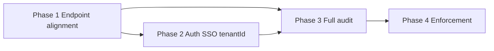

# Apply MASTER_RULES System-Wide and Align Endpoints

## Goals

- **Single source:** MASTER_RULES.md is the canonical reference; all docs and .cursorrules point to it; no conflicting path or tenant rules.
- **Endpoint alignment:** UI, API Gateway, and every container use and document the same client path convention (`/api/v1/...`). Docs that still say `/api/auth`, `/api/users`, `/api/ai`, etc. are updated.
- **Auth SSO:** Migrate auth SSO from `organizations/:orgId` to `tenants/:tenantId` only; deprecate organization SSO paths per MASTER_RULES §11.
- **Full audit:** For each MASTER_RULES section (1–11), audit containers and UI and fix gaps.

## No feature loss

- **Principle:** Every change must preserve existing behavior and capabilities. Align contracts and implementation to MASTER_RULES by **refactoring and documenting**, not by removing features.
- **Phase 1:** Documentation and comments only; no removal or change of working gateway or UI paths.
- **Phase 2:** Implement **full SSO feature parity** under tenant paths (config, test, disable, credentials, certificate/rotate) before deprecating organization paths. Organization SSO routes **remain functional** until the scheduled removal version (deprecation 2 versions before removal). After migration, run a quick SSO smoke check (tenant path flows) to confirm no regression.
- **Phase 3:** Remediate violations by refactoring (e.g. move code, add tenantId, fix config); do not delete or disable capabilities. Document exceptions where compliance is deferred; plan follow-up instead of breaking behavior.
- **Compatibility:** No external clients use legacy paths or organization SSO; alignment to `/api/v1` and tenantId-only does not require a compatibility layer.

## Production readiness (how this plan helps)

- **Single API contract:** One path convention and one tenant model reduce integration bugs and ease front-end and partner integration.
- **Config-only URLs/ports:** No hardcoded values so the system can be deployed in any environment (staging, prod, multi-region).
- **Tenant isolation verified:** Audit and fixes for partition keys, X-Tenant-ID, and cross-tenant prevention improve security and multi-tenant safety for production.
- **Observability and health:** Aligning with MASTER_RULES §9 (/health, /ready, logging, metrics) supports deployment, monitoring, and incident response.
- **Predictable evolution:** Deprecation policy and documented exceptions give a clear path to production and future changes without breaking existing usage.

---

## Phase 1: Endpoint alignment (UI ↔ Gateway ↔ containers)

**Current state:** Gateway already registers `/api/v1/*` for auth, users, notifications, dashboards, logs, secrets (with pathRewrite), etc. UI uses `apiFetch` and `/api/v1/...` only. Containers (auth, user-management, logging, etc.) serve at `/api/v1/...`. `pnpm run check:api-rules` validates ENDPOINTS.md, gateway coverage, and UI paths.

**Gaps to fix:**

1. **Documentation**
   - [documentation/ui/requirements.md](documentation/ui/requirements.md) line 14: Change "e.g. `/api/auth/*`, `/api/users/*`" and "gateway rewrites to service paths" to: client path = `/api/v1/...` only; see ENDPOINTS.md.
   - [documentation/containers/api-gateway.md](documentation/containers/api-gateway.md), [documentation/global/Infrastructure.md](documentation/global/Infrastructure.md): Update route tables to show client path `/api/v1/auth`, `/api/v1/users`, etc. (not `/api/auth`, `/api/users`).
   - [documentation/containers/auth.md](documentation/containers/auth.md), [documentation/containers/notification-manager.md](documentation/containers/notification-manager.md), [documentation/containers/logging.md](documentation/containers/logging.md), [documentation/containers/ai-service.md](documentation/containers/ai-service.md), [documentation/CONTAINER_PURPOSE_AND_INTEGRATION.md](documentation/CONTAINER_PURPOSE_AND_INTEGRATION.md): Replace `/api/auth/*`, `/api/notifications/*`, `/api/logging/*`, `/api/ai/*`, `/api/dashboard/*` with `/api/v1/...` client paths.
   - [documentation/ui/endpoints.md](documentation/ui/endpoints.md): Fix incorrect path `/api/dashboard/api/v1/dashboards/...` to `/api/v1/dashboards/...`.
   - [documentation/endpoints/ENDPOINTS.md](documentation/endpoints/ENDPOINTS.md): Normalize any remaining rows that document legacy `/api/ai` style (e.g. ai-service table around 751–756) to client path `/api/v1/...` and note pathRewrite/stripPrefix only where backend differs.
   - [documentation/FEATURE_IMPLEMENTATION_STATUS.md](documentation/FEATURE_IMPLEMENTATION_STATUS.md), [documentation/gaps/ui-pages-inventory.md](documentation/gaps/ui-pages-inventory.md), [documentation/gap-analysis-ui-auth-usermgmt-gateway.md](documentation/gap-analysis-ui-auth-usermgmt-gateway.md): Use `/api/v1/auth/...`, `/api/v1/users/...` in examples and tables.

2. **Gateway**
   - Confirm no route is registered without `/api/v1` prefix. Today [containers/api-gateway/src/routes/index.ts](containers/api-gateway/src/routes/index.ts) is already `/api/v1/*`; add a comment or small checklist in code that route paths must be `/api/v1/...` per API_RULES.

3. **UI**
   - No code changes needed for paths (already `/api/v1/...`). Ensure any remaining `base + '/api/...'` patterns (e.g. in api-keys page) use `/api/v1/...` and pass check-api-rules.

4. **Single source**
   - In [.cursorrules](.cursorrules): Add one line that cross-cutting path and tenant rules are defined in [documentation/rules/MASTER_RULES.md](documentation/rules/MASTER_RULES.md) and [documentation/endpoints/API_RULES.md](documentation/endpoints/API_RULES.md).
   - In [documentation/rules/README.md](documentation/rules/README.md): Already points to MASTER_RULES; ensure "Detailed documentation" table includes API_RULES and ENDPOINTS for path convention.

**Deliverable:** All docs and gateway/UI consistent on client path = `/api/v1/...`; check:api-rules passes; MASTER_RULES and API_RULES clearly the source.

---

## Phase 2: Auth SSO — tenantId only (no organizationId)

**Current state:** Auth service exposes:
- `/api/v1/auth/tenants/:tenantId/sso/config` (tenant-scoped; in ENDPOINTS.md).
- `/api/v1/auth/organizations/:orgId/sso/*` (config, test, disable, credentials, certificate/rotate) — contradicts MASTER_RULES §11 (tenantId only).

**Tasks:**

1. **Auth container**
   - **Feature parity first:** Add or complete tenant-scoped SSO routes so **all** SSO operations available today under organization paths are available under `/api/v1/auth/tenants/:tenantId/sso/*` (config GET/PUT, test, disable, credentials, certificate/rotate). Reuse logic from organization handlers but keyed by tenantId; permission scope = tenant. Do not remove or reduce any SSO capability.
   - **Then deprecate:** Mark organization SSO routes as deprecated only after tenant paths are implemented and tested: add deprecation notice in OpenAPI and response header (e.g. `Deprecation: true` or `Sunset`), log warning when called. Document in auth CHANGELOG (deprecation 2 versions before removal per MASTER_RULES §1). Organization routes **stay working** until the scheduled removal version.
   - Update RBAC: add tenant-scoped permission (e.g. `tenants.sso.manage` with tenantId); keep org permission working during deprecation period if needed, then remove when org routes are removed.

2. **Gateway**
   - No path change needed if gateway already forwards `/api/v1/auth` to auth; ensure no route specifically binds `/api/v1/auth/organizations` that would block deprecation.

3. **UI**
   - Any admin SSO UI that calls `/api/v1/auth/organizations/:orgId/sso/*` must be updated to call `/api/v1/auth/tenants/:tenantId/sso/*` (tenantId from context).

4. **Docs**
   - ENDPOINTS.md: List tenant SSO paths as primary; note organization SSO as deprecated and removal version.
   - Auth openapi.yaml and README: Document tenant SSO; deprecate organization paths.

**Checkpoint:** After Phase 2, verify SSO flows work end-to-end via tenant paths (e.g. get config, test, certificate rotate) so no feature regression.

**Deliverable:** All SSO usage can use tenantId-only paths with full feature parity; organization SSO deprecated and scheduled for removal; no capability removed.

---

## Phase 3: Full audit by MASTER_RULES section

Audit each section across containers and UI; fix critical gaps and document exceptions.

| Section | What to audit | Where |
|--------|----------------|-------|
| **§1 Architecture & Code** | Folder layout (routes, services, events, config, types), naming (kebab-case files, PascalCase classes), strict mode, ESLint/Prettier, JSDoc, immutability, IO in services only, feature flags, deprecation 2 versions | Each container under `containers/`; UI `ui/src/` |
| **§2 API & Contracts** | REST only; `/api/v1/...`; HTTP methods; status codes; response shape; pagination (continuationToken vs offset+limit); OpenAPI in sync; idempotency/correlation/rate limit/timeout/retry | Gateway + each service routes and openapi.yaml; ENDPOINTS.md |
| **§3 UI** | apiFetch only; gateway only; shadcn + Tailwind; loading/empty/skeleton; a11y; breakpoints; form UX (Zod + RHF); no hardcoded base URL | UI: api.ts, all pages/components, next.config rewrites |
| **§4 Data & Database** | Partition key tenantId; container naming; soft/hard delete; pagination; migrations; indexing; audit fields; retention | Cosmos adapters, shard-manager config, COSMOS_DB_CONTAINERS_REFERENCE |
| **§5 Events** | RabbitMQ only; DomainEvent + tenantId; naming `{domain}.{entity}.{action}` | All event publishers/consumers |
| **§6 Messaging** | Schema versioning; idempotent consumers; retry; DLQ; message size | Event consumers, job workers |
| **§7 Configuration** | YAML + schema; env for secrets; service URLs from config only | config/default.yaml, config/schema.json, no hardcoded URLs/ports |
| **§8 Dependencies** | @coder/shared only; no cross-container imports; Node/pnpm/TS aligned; root overrides | package.json in each container and root |
| **§9 Error & Observability** | AppError; no stack to client; log levels; structured log; tracing; metrics; /health, /ready at root | Services error handling, logger, health/ready routes |
| **§10 Security** | JWT; RBAC; secrets in env; PII redaction; CORS; rate limit; audit | Auth middleware, gateway, route handlers |
| **§11 Multi-Tenancy** | tenantId only; cross-tenant prevention; tenant-aware cache; deletion/migration/export | All queries, cache keys, X-Tenant-ID validation |

**Approach:**
- Run systematic checks (e.g. grep for hardcoded ports/URLs, `organizationId`/`orgId` in APIs, missing tenantId in Cosmos queries).
- For each section, produce a short checklist or script where useful (e.g. validate-container-compliance skill already exists).
- **Remediate without removing features:** Fix violations by refactoring (align paths, add tenantId, move config, fix errors). Do not delete or disable capabilities; if something is non-compliant but required, document as exception and plan follow-up.
- Document "exceptions" or "follow-up" in a single MASTER_RULES_COMPLIANCE.md or in existing docs (e.g. ENDPOINTS.md notes, container READMEs).
- Reference [.cursor/skills/validate-container-compliance/SKILL.md](.cursor/skills/validate-container-compliance/SKILL.md) and [.cursor/skills/validate-tenant-isolation/SKILL.md](.cursor/skills/validate-tenant-isolation/SKILL.md) for container checks.

**Deliverable:** Per-section audit results; list of fixes applied; list of documented exceptions or follow-up tasks.

---

## Phase 4: Enforcement and CI

- **Existing:** `pnpm run check:api-rules` (ENDPOINTS.md paths, gateway coverage, UI paths) in [.github/workflows/quality.yml](.github/workflows/quality.yml) job `api-rules`.
- **Optional extensions (future):**
  - Lint or script: UI must not use paths without `/api/v1` (already in check-api-rules).
  - DB/query check: tenantId in partition key (e.g. validate-tenant-isolation or a small script run in CI for critical containers).
- **Docs:** MASTER_RULES "Enforcement" and documentation/rules/README already mention check:api-rules; add one line that full compliance is audited per MASTER_RULES_COMPLIANCE or per-section checklists.

**Deliverable:** CI unchanged or minimally extended; enforcement and audit process documented.

---

## Dependency order

- Phase 1 first so all path references and docs are consistent.
- Phase 2 can start after Phase 1 (docs updated so SSO docs point to tenant paths).
- Phase 3 (full audit) uses stable paths and tenant model; can run in parallel to Phase 2 for non-auth sections.
- Phase 4 after Phase 3 to capture any new checks from the audit.

---

## Key files

| Purpose | Files |
|--------|--------|
| Rules source | [documentation/rules/MASTER_RULES.md](documentation/rules/MASTER_RULES.md), [documentation/endpoints/API_RULES.md](documentation/endpoints/API_RULES.md) |
| Path alignment | [containers/api-gateway/src/routes/index.ts](containers/api-gateway/src/routes/index.ts), [documentation/endpoints/ENDPOINTS.md](documentation/endpoints/ENDPOINTS.md), [ui/src/lib/api.ts](ui/src/lib/api.ts) |
| Auth SSO | [containers/auth/src/routes/auth.ts](containers/auth/src/routes/auth.ts) (organizations vs tenants), auth openapi.yaml, RBAC |
| Validation | [scripts/check-api-rules.mjs](scripts/check-api-rules.mjs), [.github/workflows/quality.yml](.github/workflows/quality.yml) |
| Compliance | [.cursor/skills/validate-container-compliance/SKILL.md](.cursor/skills/validate-container-compliance/SKILL.md), [.cursor/skills/validate-tenant-isolation/SKILL.md](.cursor/skills/validate-tenant-isolation/SKILL.md) |

---

## Summary

1. **Align endpoints:** Update all docs and comments to client path `/api/v1/...`; keep gateway and UI as-is (already correct); fix ENDPOINTS.md and container/docs references.
2. **Auth SSO:** Add/complete tenant SSO routes; deprecate organization SSO; switch UI and docs to tenantId-only.
3. **Full audit:** For MASTER_RULES §1–§11, audit containers and UI; fix critical violations; document exceptions.
4. **Enforcement:** Keep check:api-rules in CI; document audit and optional future checks (e.g. tenant-in-query).
