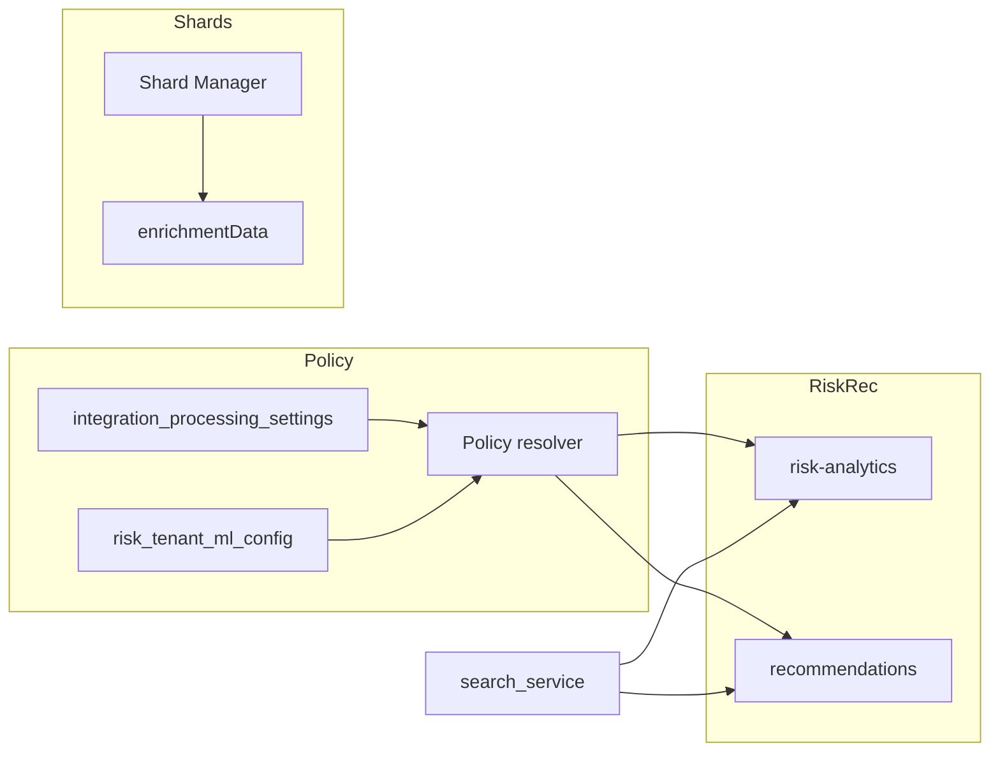

# Dataflow implementation plan (Cursor Agent)

Implement [documentation/dataflow/dataflow.md](documentation/dataflow/dataflow.md) end-to-end. Scope: **all four phases**. Choices: **top-level enrichmentData** (migrate from metadata.enrichment); **web-search** creates **c_search** shards.

**Implementation complete (core):** Phases 1–4.1 and 4.3 are implemented and verified. Phase 2.3: recommendations consumer for `opportunity.outcome.recorded`. Phase 3: reasoning-engine sync POST /reason; risk-analytics and recommendations wired; GET risk-explainability returns reasoningSteps/conclusion; ExplainabilityCard and RecommendationsCard render them. Phase 4.2 (external search API) optional. **Optional remaining:** none. c_search integration test: `containers/web-search/tests/integration/c-search-flow.test.ts` runs when RUN_C_SEARCH_E2E=1 and SHARD_MANAGER_URL is set; verifies search() completes. For full E2E without mocks (real Shard Manager + vector search), run with real services and no ServiceClient mock.

**Phase 1 status:** Implemented. Shard has top-level `enrichmentData`; data-enrichment writes to it; PolicyResolver and `shardTypeAnalysisPolicy` exist; risk-analytics calls vector search and `detectRisksFromRelatedShards`; bootstrap includes c_usage and c_search.

**Phase 2.1 status:** Implemented. `UsageIngestionConsumer` in integration-processors subscribes to `usage.ingested`, creates c_usage shards via Shard Manager with idempotency (tenantId:accountId:date); queue `usage_ingestion` in ensureQueues.

**Phase 2.2 status:** Implemented. RecommendationsService calls `getShardTypeAnalysisPolicy`, then `POST /api/v1/search/vector` with `shardTypeIds` where `useForRecommendationGeneration === true`; `getRelatedShardsForRecommendations` returns enrichmentData/structuredData; `mergeAndScoreRecommendations` uses related-shard context (actionItems, objections) to influence ranking.

**Phase 2.3 status (outcome linkage):** (1) Accepted recommendations per opportunity: FeedbackService stores records in recommendation_feedback with tenantId, recommendationId, action, opportunity in metadata. (2) Adaptive-learning: recommendations call record-outcome on each feedback; OutcomeEventConsumer and CaisLearningService update weights. (3) Opportunity closed: risk-analytics publishes opportunity.outcome.recorded and syncs risk evaluation to adaptive-learning. (4) Implemented: recommendations consumes opportunity.outcome.recorded; FeedbackService.getAcceptedFeedbackByOpportunity(tenantId, opportunityId); RecommendationsService.recordOutcomeForOpportunityClose calls adaptive-learning record-outcome (won=1, lost=0) for each accepted recommendation; rabbitmq bindings include opportunity.outcome.recorded.

**Phase 3.1 status:** Implemented. WebSearchService.search() creates c_search shard via Shard Manager when config.services.shard_manager.url is set: POST /api/v1/shards with shardTypeId 'c_search', structuredData (tenantId, query, searchType: 'web', userId, opportunityId, accountId, createdAt, resultCount), unstructuredData (rawQuery, snippets); ServiceClient and generateServiceToken; config has shard_manager.url; metrics cSearchShardsCreatedTotal.

**Phase 3.2 status:** Implemented. search-service proxies web search to web-search when config.services.web_search.url is set: SearchService.webSearch() calls web-search POST /api/v1/web-search (service token, X-Tenant-ID); web-search performs search and creates c_search shard. Config: web_search.url (env WEB_SEARCH_URL, default localhost:3056). When not set, search-service keeps existing AI/mock fallback.

**Phase 3.3 status (reasoning-engine wiring):** reasoning-engine has task API and sync POST /api/v1/reasoning/reason. risk-analytics and recommendations wired (reasoningSteps + conclusion when url set). ai-conversation: when services.reasoning_engine.url is set and the user message matches an explain-style pattern (e.g. "why", "explain", "how come"), ConversationService calls POST /reason and injects conclusion/reasoning as a context source for the AI reply; failure is non-blocking.

**Phase 3.4 status (UI consistency):** Risk: ExplainabilityCard accepts and renders optional reasoningSteps and conclusion (dataflow §11). GET risk-explainability returns reasoningSteps/conclusion when reasoning_engine is set. Recommendations: RecommendationsCard consumes batch reasoningSteps and conclusion. Chat: ai-conversation injects reasoning (POST /reason) as context for explain-style user messages when reasoning_engine.url is set.

**Phase 3.5 status (tests):** Unit test added in web-search: WebSearchService.test.ts "should create c_search shard via Shard Manager when shard_manager.url is set (dataflow Phase 3.1)" — mocks loadConfig with shard_manager.url, asserts POST /api/v1/shards with shardTypeId 'c_search', structuredData (tenantId, query, searchType: 'web', resultCount), unstructuredData (rawQuery). Full integration test (web-search → Shard Manager → vector search returning c_search) optional when test env has Shard Manager and search-service.

**Phase 4.1 status (recurring web search):** Implemented. web-search: ScheduleService with Cosmos container web_search_schedules (partitionKey tenantId); WebSearchSchedule (tenantId, userId, query, cronExpression, scope, role); CRUD API GET/POST/PUT/DELETE /api/v1/schedules; in-process scheduler (setInterval 5 min) calls getDue(), runs WebSearchService.search() per schedule, setNextRun(). Full UI with role-based visibility (Super Admin / Tenant admin / User) is optional follow-up.

**Phase 4.2 status (external search API):** Optional. web-search currently uses AI/mock search. To add a real provider (e.g. Bing Web Search API, Google Custom Search): add provider URL and API key to config (env); implement provider client in WebSearchService; keep cache and c_search shard creation unchanged.

**Phase 4.3 status (observability and runbooks):** Implemented. Metrics: web-search emits `c_search_shards_created_total` (Prometheus). Runbooks: [containers/web-search/README.md](containers/web-search/README.md) § Runbooks (dataflow Phase 4.3) — DLQ inspection, replay with idempotency, verify policy (integration_processing_settings, risk_tenant_ml_config shardTypeAnalysisPolicy). Additional metrics (detection run count, policy cache hit, vector search latency, reasoning call count) can be added per service as needed.

---

## Architecture (high level)

---

## Phase 1: Policy, enrichment path, risk related-shards

### 1.1 Shard Manager: top-level enrichmentData

- **Files:** [containers/shard-manager/src/types/shard.types.ts](containers/shard-manager/src/types/shard.types.ts), [containers/shard-manager/src/services/ShardService.ts](containers/shard-manager/src/services/ShardService.ts).
- **Changes:**
  - Add `enrichmentData?: Record<string, unknown>` to `Shard` (sibling to `structuredData`, `unstructuredData`, `metadata`). Keep existing `enrichment` for backward compatibility during migration; doc contract is `enrichmentData`.
  - Add `enrichmentData` to `CreateShardInput` and `UpdateShardInput`.
  - In `ShardService.create`, set `shard.enrichmentData = input.enrichmentData` when provided.
  - In `ShardService.update`, if `input.enrichmentData !== undefined`, set `updated.enrichmentData = input.enrichmentData` (so enrichment-only updates can send only `{ enrichmentData, userId }`). Ensure update route accepts partial body (it currently merges; add enrichmentData to the merge).
- **Optional:** Add `PATCH /api/v1/shards/:id` that accepts only `{ enrichmentData }` and calls a partial update (read shard, set enrichmentData, replace). Otherwise full PUT with enrichmentData is sufficient.

### 1.2 data-enrichment: write to enrichmentData

- **File:** [containers/data-enrichment/src/services/EnrichmentService.ts](containers/data-enrichment/src/services/EnrichmentService.ts).
- **Change:** In `updateShardEnrichment`, set `shard.enrichmentData = results` (and stop setting `shard.metadata.enrichment`). Send `enrichmentData` in the PUT body to Shard Manager. If Shard Manager only supports full replace, continue to read full shard, set `shard.enrichmentData = results`, then PUT.

### 1.3 Policy resolver (shared)

- **Location:** Add under [containers/shared/src](containers/shared/src) (e.g. `policy/` or `services/PolicyResolver.ts`). Export from shared so integration-processors, data-enrichment, risk-analytics, and recommendations can use it.
- **Contract:**
  - `getActivationFlags(tenantId: string, shardTypeId: string): Promise<Record<string, boolean>>` — reads container `integration_processing_settings` (doc per tenant, structure per shard type); returns object keyed by detection flag (sentimentAnalysis, competitorDetection, …).
  - `getShardTypeAnalysisPolicy(tenantId: string): Promise<Record<string, { useForRiskAnalysis: boolean; useForRecommendationGeneration: boolean }>>` — reads container `risk_tenant_ml_config`, document id = tenantId, top-level field `shardTypeAnalysisPolicy`; returns empty object or policy. Missing shard type → treat as false (document in resolver).
- **Implementation:** Use `getContainer` from `@coder/shared/database` for both containers. Container names must come from config or env (align with risk-analytics and integration-processors config). Add unit tests with mocked Cosmos.

### 1.4 risk_tenant_ml_config: add shardTypeAnalysisPolicy

- **Files:** [containers/risk-analytics/src/types/tenant-ml-config.types.ts](containers/risk-analytics/src/types/tenant-ml-config.types.ts), [containers/risk-analytics/src/services/TenantMLConfigService.ts](containers/risk-analytics/src/services/TenantMLConfigService.ts).
- **Changes:** Add `shardTypeAnalysisPolicy?: Record<string, { useForRiskAnalysis: boolean; useForRecommendationGeneration: boolean }>` to `TenantMLConfiguration` and document type. Upsert and read already key by tenantId; no API change except response shape. Ensure UI/config flows can set this (admin or API).

### 1.5 integration-processors and data-enrichment: use policy resolver

- **integration-processors:** [containers/integration-processors/src/routes/processing.routes.ts](containers/integration-processors/src/routes/processing.routes.ts) already reads `integration_processing_settings`. Replace direct container read with call to policy resolver `getActivationFlags(tenantId, shardTypeId)` where detection decisions are made (or keep read but ensure same shape as resolver). If detection runs inside consumers, add resolver usage there per shard type.
- **data-enrichment:** [containers/data-enrichment/src/services/EnrichmentService.ts](containers/data-enrichment/src/services/EnrichmentService.ts) (and any job processor): before running a detection, call policy resolver `getActivationFlags(tenantId, shardTypeId)`; skip detection if flag is false. Ensure data-enrichment has access to shardTypeId for the shard being enriched.

### 1.6 Risk-analytics: vector search for related shards and use enrichmentData

- **File:** [containers/risk-analytics/src/services/RiskEvaluationService.ts](containers/risk-analytics/src/services/RiskEvaluationService.ts).
- **Changes:**
  - After loading opportunity shard and catalog, load `shardTypeAnalysisPolicy` for the tenant (via TenantMLConfigService or shared policy resolver). Build list of `shardTypeIds` where `useForRiskAnalysis === true` (e.g. Email, Meeting, Document, c_usage, c_search).
  - If list non-empty and search_service configured, call `POST /api/v1/search/vector` with `tenantId`, `opportunityId` (or query derived from opportunity), `shardTypeIds`, `limit`, `includeShard: true`. Use tenantId from request (already in headers for auth). Request body must include tenantId if the API expects it (search-service currently gets tenantId from auth).
  - Pass returned related shards (with `enrichmentData` or `metadata.enrichment` for backward compat) into risk detection: e.g. new helper `detectRisksFromRelatedShards(relatedShards, catalog)` or merge enrichment into existing detectRisks inputs. Ensure at least one risk driver can be derived from related-shard enrichment when policy allows (e.g. sentiment, competitorMentions).
- **Backward compatibility:** Read both `shard.enrichmentData` and `shard.metadata?.enrichment` when present so old shards still contribute until migrated.

### 1.7 Shard types c_usage and c_search

- **File:** [containers/shard-manager/src/startup/bootstrapShardTypes.ts](containers/shard-manager/src/startup/bootstrapShardTypes.ts). Add to `SYSTEM_SHARD_TYPES`: `c_usage` (name, description, minimal schema: tenantId, accountId/opportunityId, level, features, lastActive, etc.), `c_search` (name, description, minimal schema: tenantId, query, searchType, userId, optional opportunityId, accountId, createdAt, resultCount). Ensure bootstrap is run on startup or migration so both types exist.

### 1.8 Tests (Phase 1)

- Policy resolver: unit tests with mocked getContainer; integration test that risk skips a shard type when useForRiskAnalysis is false (mock policy with one type false).
- Enrichment: integration test that data-enrichment writes to shard.enrichmentData and risk can read it (or E2E with mock shard).
- Risk: integration test that evaluateRisk calls search_service with shardTypeIds from policy and that returned related shards influence detectedRisks when enrichmentData is present.

---

## Phase 2: c_usage, recommendations vector search, outcome linkage

### 2.1 c_usage shard creation

- **Event:** Define `usage.ingested` (or use existing `integration.data.raw` with entity type usage). Payload: tenantId, accountId?, opportunityId?, level?, features?, trends?, lastActive?, adoptionScore?, etc.
- **Consumer:** Add consumer in integration-processors (or dedicated usage service) that subscribes to the event and calls Shard Manager to create a shard with `shardTypeId: 'c_usage'`, partitionKey tenantId, structuredData per doc §4.4.2. Ensure c_usage is in shard-type registry (Phase 1).
- **Idempotency:** Use a deterministic id or idempotency key (e.g. tenantId + accountId + date) to avoid duplicates on replay.

### 2.2 Recommendations: vector search for related shards

- **File:** [containers/recommendations/src/services/RecommendationsService.ts](containers/recommendations/src/services/RecommendationsService.ts). Add (or extend) method that builds context for recommendations: call policy resolver for `shardTypeAnalysisPolicy`, then call search_service `POST /api/v1/search/vector` with `shardTypeIds` where `useForRecommendationGeneration === true`, tenantId, opportunityId. Use returned shards’ enrichmentData (and structuredData for c_usage) to influence ranking or content (e.g. action items, commitments, objections). Integrate into existing flow that aggregates recommendations (e.g. before ranking).

### 2.3 Outcome linkage

- **Doc:** §8.4 recommendation → outcome. Ensure recommendation feedback (accept/ignore) is already stored and that when an opportunity closes (won/lost), we can correlate accepted recommendations with outcome. Implement or verify: (1) storage of which recommendations were accepted per opportunity; (2) adaptive-learning or recommendations service reading outcome and updating weights. May already exist; verify and document.

### 2.4 Tests (Phase 2)

- c_usage: integration test that publishing usage.ingested (or equivalent) results in one c_usage shard created.
- Recommendations: integration test that recommendations service calls vector search with shardTypeIds from policy and that related-shard data influences output when present.

---

## Phase 3: c_search creation, reasoning-engine, UI consistency

### 3.1 web-search: create c_search shard after each search

- **File:** [containers/web-search/src/services/WebSearchService.ts](containers/web-search/src/services/WebSearchService.ts). After building `result` (and optionally caching), call Shard Manager to create a shard: shardTypeId `c_search`, tenantId, structuredData (tenantId, query, searchType: 'web', userId from request if available, resultCount, optional opportunityId/accountId from request context), unstructuredData (raw query, optional result snippets). Use config for shard_manager URL; use ServiceClient and service-to-service auth (generateServiceToken). Add shard_manager to web-search config if not present.
- **Event:** Optionally publish `search.executed` with payload per doc §2.3 (tenantId, query, searchType, userId, resultCount, opportunityId?, accountId?, correlationId?). Consumer can be the same service (no separate consumer needed if shard is created synchronously in search()).
- **Idempotency:** Optionally use (tenantId, query, timestamp bucket) or search id as idempotency key to avoid duplicate c_search shards on retry.

### 3.2 search_service: proxy to web-search for web search (optional)

- If search-service currently implements web search itself, change it to call web-search service for the actual search so that only web-search creates c_search shards. Alternatively, keep search-service as proxy that calls web-search and does not create shards (web-search creates the shard when it performs the search).

### 3.3 Reasoning-engine wiring

- **Verify:** risk-analytics calls reasoning-engine for explainability; recommendations calls it for “why recommended”; ai-conversation calls it for explain intents. Confirm endpoints and request/response shapes match doc §10. Add or fix call sites and document in READMEs.

### 3.4 UI consistency

- Ensure risk explainability and recommendation explanation use the same API payload (reasoningSteps, conclusion). Ensure chat “Why is this deal at risk?” and “Why did you recommend X?” call the same risk/recommendations explainability APIs and display the same content. No duplicate logic in frontend.

### 3.5 Tests (Phase 3)

- c_search: integration test that a call to web-search search() results in one c_search shard in Shard Manager for the tenant; vector search with shardTypeIds including c_search returns it (after search_service indexes it).

---

## Phase 4: Recurring web search, external API, observability

### 4.1 Recurring web search: data model and scheduler

- **Data model:** Store recurring search config (tenantId, userId, query or topics, scope, cron expression, role: super_admin | tenant_admin | user). Cosmos container e.g. `web_search_schedules`, partition key tenantId.
- **Scheduler:** In workflow-orchestrator (or web-search), add cron that publishes `search.scheduled` (or `search.executed` with scheduledSearchId) per schedule; web-search consumer runs search and creates c_search shard. Or web-search polls schedules and runs searches.
- **API and UI (full):** CRUD API for schedules; full UI with role-based visibility: Super Admin (platform-wide schedules), Tenant admin (tenant-level schedules), User (personal recurring searches). Implement list + create/edit pages per scope (or one set of pages with role-based filtering and visibility).

### 4.2 External search API

- **web-search:** Replace or supplement AI/mock search with real provider (e.g. Bing Web Search API, Google Custom Search). Config: API key in env, base URL in config. Keep cache and c_search creation unchanged.

### 4.3 Observability and runbooks

- **Metrics:** Emit detection run count per type, policy cache hit (if resolver caches), vector search latency, reasoning call count, c_search shards created (per tenant or global). Use existing patterns (e.g. Prometheus in risk-analytics).
- **Runbooks:** Document in docs or README: how to inspect DLQ for failed enrichment/search; how to replay with idempotency; how to verify policy (integration_processing_settings, shardTypeAnalysisPolicy).

---

## Implementation order (task list)

Execute in this order to respect dependencies:

1. Shard Manager: add enrichmentData to types and ShardService create/update.
2. Shard types: add c_usage and c_search to bootstrapShardTypes.
3. Policy resolver: implement in shared, add tests.
4. risk_tenant_ml_config: add shardTypeAnalysisPolicy to types and service.
5. data-enrichment: write to enrichmentData and use policy resolver for activation.
6. integration-processors: use policy resolver for activation (where detection is decided).
7. risk-analytics: load shardTypeAnalysisPolicy, call vector search for related shards, use enrichmentData in detectRisks.
8. Phase 2: c_usage consumer and recommendations vector search for related shards; outcome linkage verification.
9. Phase 3: web-search creates c_search shard; reasoning-engine and UI consistency verification.
10. Phase 4: recurring web search (data model, scheduler, UI), external API, observability and runbooks.

---

## Key files reference

| Area | File(s) |
|------|--------|
| Shard shape | [containers/shard-manager/src/types/shard.types.ts](containers/shard-manager/src/types/shard.types.ts), [containers/shard-manager/src/services/ShardService.ts](containers/shard-manager/src/services/ShardService.ts) |
| Enrichment write | [containers/data-enrichment/src/services/EnrichmentService.ts](containers/data-enrichment/src/services/EnrichmentService.ts) (updateShardEnrichment) |
| Policy resolver | New: containers/shared/src/policy/ or services/PolicyResolver.ts |
| Tenant ML config | [containers/risk-analytics/src/types/tenant-ml-config.types.ts](containers/risk-analytics/src/types/tenant-ml-config.types.ts), [containers/risk-analytics/src/services/TenantMLConfigService.ts](containers/risk-analytics/src/services/TenantMLConfigService.ts) |
| Risk vector search | [containers/risk-analytics/src/services/RiskEvaluationService.ts](containers/risk-analytics/src/services/RiskEvaluationService.ts) (evaluateRisk, detectRisks*) |
| Recommendations | [containers/recommendations/src/services/RecommendationsService.ts](containers/recommendations/src/services/RecommendationsService.ts) |
| Search service vector API | [containers/search-service/src/routes/index.ts](containers/search-service/src/routes/index.ts) (POST /api/v1/search/vector), SearchService.vectorSearch |
| web-search c_search | [containers/web-search/src/services/WebSearchService.ts](containers/web-search/src/services/WebSearchService.ts) |
| Shard types bootstrap | [containers/shard-manager/src/startup/bootstrapShardTypes.ts](containers/shard-manager/src/startup/bootstrapShardTypes.ts) |

---

## Acceptance criteria (from doc §16.4)

- Policy: Risk and recommendations skip a shard type when the corresponding use flag is false; integration-processors and data-enrichment run only enabled detections per tenant/shard type.
- Risk: Evaluation response includes at least one risk driver derived from a related shard’s enrichmentData when such a shard exists and shardTypeAnalysisPolicy allows.
- c_search: Each search execution results in exactly one c_search shard created for the tenant; risk/recommendations can retrieve c_search via vector search when policy allows.
- Vector search: All requests include tenantId filter; optional opportunityId/scope for relevance.
