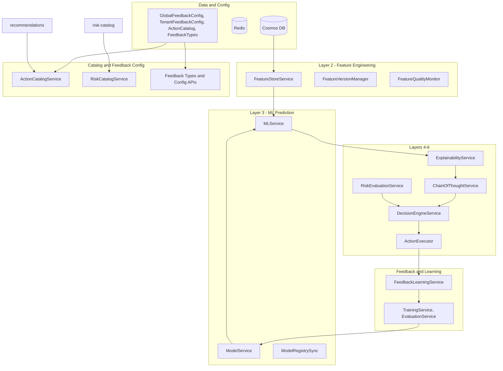

**Implementer:** The agent (Cursor) will perform the implementation. The user may need to provide decisions on open questions and perform external steps (e.g. Azure ML workspace provisioning, deployment) where required.

**Decisions (pre-implementation):**

- **Feedback storage:** New Cosmos containers for feedback data (e.g. recommendation_feedback, feedback_aggregation). **GlobalFeedbackConfig / TenantFeedbackConfig:** Reuse existing config/tenant containers (not new dedicated containers).
- **Feedback types:** Seed the 25+ predefined types at first deploy; Super Admin can edit/add later.
- **Risk catalog → Action Catalog:** One-time migration; existing risk catalog data can be lost (destructive migration acceptable). Document breaking changes for clients.
- **Global config:** Use partitionKey = `"global"` and no tenantId field for global docs (Feedback Types, global Action Catalog entries).
- **Azure ML strategy:** Proceed with mocks in Week 3-4; integrate real Azure ML when ready (no blocking).
- **Service locations:** ExplainabilityService → extend `risk-analytics`; ChainOfThoughtService → new `llm-service` container; DecisionEngineService → extend `risk-analytics`; FeedbackLearningService → new `learning-service` container; TrainingService → extend `ml-service`.
- **Super Admin UI:** Section inside existing `containers/ui` at `/admin/*`; extend existing admin section (see Q10/Q11 findings). Same auth as main app (credentials/session; role check on backend for Super Admin).
- **Feedback Parquet schema:** Align with existing Data Lake schema (e.g. risk_evaluations: tenantId, opportunityId, camelCase columns, JSON strings for nested objects).
- **Action Catalog storage:** New shard type (e.g. `action_catalog`), not same shardTypeId with extended schema.
- **Sales Methodology:** Multiple methodologies from day one (MEDDIC, MEDDPICC, Challenger, Sandler, SPIN).
- **Terraform/infra:** Review existing Terraform and update: current Terraform only has integration infra (Blob, Cognitive Services). Add or document modules for Cosmos DB, Redis, RabbitMQ, Data Lake, Azure ML as needed for full stack; update README.

# Feedbacks and Recommendations – Full Requirements Plan

This plan consolidates every requirement from [documentation/specifications/feedbacks and recommendations/](documentation/specifications/feedbacks%20and%20recommendations/). It is organized by theme, then by implementation phase, with clear dependencies and deliverables.

---

## 1. Requirement Sources (What’s In Scope)

| Document | Scope |

|----------|--------|

| [RECOMMENDATION_FEEDBACK_COMPLETE_REQUIREMENTS.md](documentation/specifications/feedbacks%20and%20recommendations/RECOMMENDATION_FEEDBACK_COMPLETE_REQUIREMENTS.md) | Feedback collection (FR-1.x), 25+ feedback types, tenant config, metadata (FeedbackMetadata), per-rec-type feedback, Recommendation schema, **Unified Action Catalog** (ActionCatalogEntry), DB schemas (FeedbackType, GlobalFeedbackConfig, TenantFeedbackConfig, RecommendationFeedback, FeedbackAggregation), ActionCatalogService, APIs, UI, CAIS integration, Data Lake, analytics |

| [ALL_LAYERS_DETAILED_REQUIREMENTS.md](documentation/specifications/feedbacks%20and%20recommendations/ALL_LAYERS_DETAILED_REQUIREMENTS.md) | **Layer 3** (ML Prediction): 120+ FRs, ModelService/MLService/ModelRegistrySync, MLModel/Prediction/ModelMetrics, 8 APIs, 5 UI components, 2 pages, 5 RabbitMQ events. **Layer 4** (Explanation): SHAP, ExplainabilityService, RiskExplainabilityService, 4 APIs, 4 UI components, 3 events. **Layers 5–8** structure (LLM Reasoning, Decision Engine, Feedback Loop, Learning Loop). Cross-layer data/event flow, 6-phase implementation checklist |

| [COMPREHENSIVE_LAYER_REQUIREMENTS_SUMMARY.md](documentation/specifications/feedbacks%20and%20recommendations/COMPREHENSIVE_LAYER_REQUIREMENTS_SUMMARY.md) | **Layer 2** (Feature Engineering): 150+ FRs, FeatureStoreService/FeatureVersionManager/FeatureQualityMonitor, FeatureSnapshot/FeatureMetadata, 5 APIs, 4 events. Full summary of Layers 2–8 (services, UI, APIs, DB, events), performance/scalability/security, phase plan, effort (19–27 weeks) |

| [LAYER_2_FEATURE_ENGINEERING_REQUIREMENTS.md](documentation/specifications/feedbacks%20and%20recommendations/LAYER_2_FEATURE_ENGINEERING_REQUIREMENTS.md) | Detailed Layer 2: extraction (opportunity, risk, historical, relationship, temporal, behavioral), transformation, versioning, storage, quality monitoring |

| [LAYER_3_ML_PREDICTION_REQUIREMENTS.md](documentation/specifications/feedbacks%20and%20recommendations/LAYER_3_ML_PREDICTION_REQUIREMENTS.md) | Layer 3 detailed requirements (referenced in ALL_LAYERS) |

| [REQUIREMENTS_GAP_ANALYSIS.md](documentation/specifications/feedbacks%20and%20recommendations/REQUIREMENTS_GAP_ANALYSIS.md) | **Gap 1:** Risk Catalog integration (tenant categories, RiskCatalogService, Layer 2/3/6). **Gap 2:** Sales Methodology (SalesMethodology schema, methodology-aware features and decisions). **Gap 3:** Opportunity Reactivation (dormant features, reactivation model, LLM strategy, triggers, UI, APIs, events). **Gap 4:** TenantMLConfiguration. Priority: Critical gaps 4–6 weeks, High 3–5 weeks, Customization 1–2 weeks |

| [SUPER_ADMIN_CONFIGURATION_REQUIREMENTS.md](documentation/specifications/feedbacks%20and%20recommendations/SUPER_ADMIN_CONFIGURATION_REQUIREMENTS.md) | **10 config areas:** Feedback System, Action Catalog, Sales Methodology, ML Models, Feature Engineering, Decision Rules, Tenant Management, System, Analytics, Security. 100+ screens, 50+ admin APIs, navigation, UI patterns, 14-week UI timeline |

| [IMPLEMENTATION_QUESTIONS.md](documentation/specifications/feedbacks%20and%20recommendations/IMPLEMENTATION_QUESTIONS.md) | Current-state Q&A: extend Risk Catalog for Action Catalog, comprehensive feedback enhancement, Azure ML not configured, use existing DataLakeCollector pattern for feedback |

| [ALL_IMPLEMENTATION_QUESTIONS_ANSWERED.md](documentation/specifications/feedbacks%20and%20recommendations/ALL_IMPLEMENTATION_QUESTIONS_ANSWERED.md) | Resolved answers to implementation questions (reference when implementing) |

All of the above are in scope. Also covered: IMPLEMENTATION_QUESTIONS_COMPLETE_ANSWERS (same answer set), RECOMMENDATION_FEEDBACK_REQUIREMENTS (superseded by RECOMMENDATION_FEEDBACK_COMPLETE_REQUIREMENTS), and duplicate "(1)" files. Nothing in the folder is excluded.

---

## 2. Leverage Current Implementation

The plan **extends existing containers** and reuses their infrastructure. Use [ALL_IMPLEMENTATION_QUESTIONS_ANSWERED.md](documentation/specifications/feedbacks%20and%20recommendations/ALL_IMPLEMENTATION_QUESTIONS_ANSWERED.md) for decisions (extend vs new, patterns, timelines).

| Container | Reuse / extend | Add / change |

|-----------|----------------|--------------|

| **risk-catalog** | Shard-manager (risk_catalog), CRUD, events risk.catalog.*, REST API, tenant/industry/global scope. | Add type risk \| recommendation \| risk_with_recommendation; recommendation fields (ActionCatalogEntry); relationship APIs; template rendering; backward-compatible schema. |

| **recommendations** | RecommendationsService, multi-factor engine, recordFeedback(), events recommendation.generation.*, recommendation.feedback.received, DB containers. | 25+ feedback types; FeedbackType/GlobalFeedbackConfig/TenantFeedbackConfig; rich metadata (FeedbackMetadata); per-rec-type config; FeedbackAggregation; Data Lake sync; extend recordFeedback. |

| **ml-service** | FeatureService (e.g. buildVectorForOpportunity), AzureMLClient, PredictionService, MLModelService, Cosmos containers. | Layer 2: FeatureVersionManager, FeatureQualityMonitor, versioning/cache/quality, FeatureSnapshot/FeatureMetadata, methodology/catalog features. Layer 3: real Azure ML, prediction cache, circuit breaker, retry, A/B, model selection, health. |

| **logging** | DataLakeCollector pattern: subscribe, build row, Parquet, path layout. Already handles risk.evaluated, ml.prediction.completed. | FeedbackDataLakeCollector: subscribe to recommendation.feedback.received, write to /feedback/year=.../month=.../day=.../; same Parquet/config pattern. |

| **risk-analytics** | Risk evaluation flow, events, APIs. | Consume Action Catalog and Layer 3; emit decisions compatible with Layer 6; no duplicate catalog. |

| **ui** | API gateway, auth, tenant context. | Super Admin section: config-driven admin API; 10 areas per SUPER_ADMIN_CONFIGURATION_REQUIREMENTS. |

New layer services (ExplainabilityService, ChainOfThoughtService, DecisionEngineService, etc.) are added inside existing or new modules and call risk-catalog, recommendations, ml-service via config-driven URLs and events.

### Current state summary

- **risk-catalog:** ActionCatalogService with action_catalog shard type; getApplicableCatalogEntries, getRecommendationsForRisk, getRisksMitigatedByRecommendation, renderRecommendation; CRUD and list entries. RiskCatalogService getTenantCatalog for tenant catalog view. W7 risk-catalog integration (Layer 2/6) in place.
- **recommendations:** 25+ feedback types seeded on first GET feedback-types; GlobalFeedbackConfig/TenantFeedbackConfig; recordFeedback with full metadata; publishes `recommendation.feedback.received`; FeedbackAggregation (get/upsert); recommendation_feedback and recommendation_feedback_aggregation containers. GET /api/v1/admin/tenants (list stub). Data Lake path consumed by logging.
- **ml-service:** FeatureStoreService, FeatureVersionManager, FeatureQualityMonitor; feature versions/schema/statistics/export APIs; methodology, risk-catalog, reactivation features; model health; prediction and reactivation APIs. Layer 2 and Layer 3 (mocks) in place; W7–W10 integrations.
- **logging:** DataLakeCollector subscribes to `risk.evaluated`, `ml.prediction.completed`, `recommendation.feedback.received`; writes Parquet to path prefixes including `/feedback/year=.../month=.../day=.../` per RECOMMENDATION_FEEDBACK_COMPLETE_REQUIREMENTS.
- **risk-analytics:** DecisionEngineService (rules, catalog rules, methodology decisions); SalesMethodologyService; TenantMLConfigService; ReactivationService; GET/PUT sales-methodology, tenant-ml-config; POST decisions/methodology, apply-catalog-rules, reactivation/evaluate. W7–W10 in place.
- **llm-service:** ChainOfThoughtService; reactivation strategy (W9). Explainability in risk-analytics.
- **Super Admin UI (W11):** All 10 areas have landing pages and navigation. Full pages: Feedback System (types, global config, tenant aggregation), Tenant ML Config, Sales Methodology, Risk Catalog, Decision Rules, Action Catalog, ML Models, Feature Engineering, Tenant Management (list + tenant detail with full feedback config: activeLimit, requireFeedback, allowComments, commentRequired, allowMultipleSelection, patternDetection, activeTypes add/remove; templates placeholder). Security (§10): roles list + create role + role detail (view, edit name/description/permissions, delete); users (orgId + member-count/limit + members table); api-keys placeholder; audit (list + filters + export). Landings with placeholders: System Configuration (§8), Analytics (§9). Config-driven API base URL; no hardcoded ports. user-management: GET /organizations/:orgId/permissions, GET/PUT/DELETE roles, GET /organizations/:orgId/members. Remaining: placeholder sub-pages (builders, config forms), tenant templates backend+UI, 100+ screens per spec as needed.

---

## 3. Architecture Overview

---

## 4. Workstreams and Dependencies

| ID | Workstream | Main docs | Depends on |

|----|------------|-----------|------------|

| W1 | Recommendation Feedback System (types, config, metadata, storage, Data Lake, aggregation) | RECOMMENDATION_FEEDBACK_COMPLETE_REQUIREMENTS | — |

| W2 | Unified Action Catalog (extend risk-catalog, risks + recommendations, relationships, templates) | RECOMMENDATION_FEEDBACK_COMPLETE_REQUIREMENTS, IMPLEMENTATION_QUESTIONS | risk-catalog |

| W3 | Layer 2 Feature Engineering (versioning, cache, quality, schema, APIs, events) | COMPREHENSIVE_LAYER_REQUIREMENTS_SUMMARY, LAYER_2_FEATURE_ENGINEERING_REQUIREMENTS | ml-service |

| W4 | Layer 3 ML Prediction (Azure ML, caching, circuit breaker, A/B, health, APIs, events) | ALL_LAYERS_DETAILED_REQUIREMENTS, COMPREHENSIVE_LAYER_REQUIREMENTS_SUMMARY | W3 |

| W5 | Layers 4–6 (Explanation, LLM Reasoning, Decision Engine) | ALL_LAYERS_DETAILED_REQUIREMENTS, COMPREHENSIVE_LAYER_REQUIREMENTS_SUMMARY | W4 |

| W6 | Layers 7–8 (Feedback Loop, Learning Loop) | Same | W1, W5 |

| W7 | Gap: Risk Catalog integration (tenant categories, Layer 2/3/6) | REQUIREMENTS_GAP_ANALYSIS | W2, W3, W5 |

| W8 | Gap: Sales Methodology (schema, features, decisions) | REQUIREMENTS_GAP_ANALYSIS | W3, W5 |

| W9 | Gap: Opportunity Reactivation (features, model, LLM strategy, triggers, UI/APIs/events) | REQUIREMENTS_GAP_ANALYSIS | W3, W4, W5 |

| W10 | Gap: Tenant ML Configuration | REQUIREMENTS_GAP_ANALYSIS | W4, W5 |

| W11 | Super Admin Configuration UI (all 10 areas) | SUPER_ADMIN_CONFIGURATION_REQUIREMENTS | W1, W2, W4, W5 |

---

## 5. Implementation Phases

### Phase 1: Foundation (Feedback + Catalog + Data Lake)

- **W1 – Recommendation Feedback System**
  - DB: FeedbackType, GlobalFeedbackConfig, TenantFeedbackConfig, RecommendationFeedback, FeedbackAggregation (Cosmos; partitionKey = tenantId where specified).
  - Services: CRUD for feedback types and configs; submit feedback with full metadata (RECOMMENDATION_FEEDBACK_COMPLETE_REQUIREMENTS FR-1.4); aggregation (weighted + temporal).
  - APIs: Manage feedback types (admin), get tenant config, submit feedback, get aggregation (by tenant/rec-type/period).
  - Events: Publish `recommendation.feedback.received` (and optionally `feedback.aggregation.updated`) with tenantId.
  - Data Lake: In logging, add consumer for feedback events; write Parquet under `/feedback/year=.../month=.../day=.../` (same pattern as existing DataLakeCollector).
- **W2 – Unified Action Catalog**
  - Extend risk-catalog: ActionCatalogEntry (type: risk | recommendation), categories, riskDetails/recommendationDetails, decisionRules, usage. ActionCatalogService: CRUD, getApplicableCatalogEntries, getRecommendationsForRisk/getRisksMitigatedByRecommendation, renderRecommendation, updateCatalogUsageStats.
  - Cosmos (or shard-manager): ActionCatalog container/type; ensure tenantId in partition key for tenant-scoped entries.
- **Deliverables:** Feedback types and configs manageable; feedback stored with metadata; feedback in Data Lake; Action Catalog with risks + recommendations and relationships.

### Phase 2: ML Foundation (Layers 2 and 3)

- **W3 – Layer 2 Feature Engineering**
  - In ml-service (or dedicated container): FeatureStoreService (extract, transform, cache, export), FeatureVersionManager (pin/resolve/deprecate), FeatureQualityMonitor (missing, outliers, drift). FeatureSnapshot, FeatureMetadata in Cosmos; Redis cache; APIs per COMPREHENSIVE_LAYER_REQUIREMENTS_SUMMARY (e.g. GET/POST features, schema, statistics, export). RabbitMQ: feature.extraction.requested/completed, feature.cache.invalidated, feature.quality.alert.
- **W4 – Layer 3 ML Prediction**
  - ModelService (predict, predictBatch, selectModel, cache, callEndpoint, health), MLService (evaluateRisk, forecastRevenue, generateRecommendations, runMLPipeline), ModelRegistrySync. Cosmos: MLModel, Prediction, ModelMetrics. Redis: prediction cache; invalidation on opportunity.updated. Circuit breaker, retry, A/B routing. APIs: POST predict/risk, predict/win-probability, predict/forecast, predict/recommendations; GET models, model health/metrics. Events: ml.prediction.requested/completed/failed, ml.model.deployed, ml.model.health.degraded.
- **Deliverables:** Feature pipeline with versioning and quality; ML prediction with caching and fallback; model registry and health.

### Phase 3: Explanation, Reasoning, and Decision (Layers 4–6)

- **W5 – Layers 4–6**
  - **Layer 4:** ExplainabilityService (SHAP, factors, waterfall/bar data), RiskExplainabilityService; cache explanations; Cosmos Explanation/GlobalFeatureImportance; APIs explain/prediction, feature-importance, factors, batch; events ml.explanation.requested/completed/failed.
  - **Layer 5:** ChainOfThoughtService (explain, recommendations, scenarios), IntentAnalyzerService; LLMOutput storage; APIs llm/explain, recommendations, scenarios, summary, playbook; events llm.reasoning.requested/completed/failed.
  - **Layer 6:** DecisionEngineService (evaluate rules, combine ML+rules, resolve conflicts), RiskEvaluationService, ActionExecutor (CRM, notifications, tasks, email drafts); Cosmos Decision, Rule; APIs decisions/evaluate, execute, rules CRUD, rule test; events decision.evaluation.requested/completed, action.execution.requested/completed/failed, action.rolled_back.
- **Deliverables:** Explanations for predictions; LLM recommendations and scenarios; decision engine and action execution.

### Phase 4: Feedback Loop and Learning Loop (Layers 7–8)

- **W6 – Layers 7–8**
  - **Layer 7:** FeedbackLearningService: recordFeedback, recordOutcome, linkFeedbackToPrediction, aggregateFeedback, satisfaction, feedback reports. UserFeedback, Outcome in Cosmos. APIs feedback, outcomes, summary, trends. Events feedback.recorded, outcome.recorded, feedback.trend.alert.
  - **Layer 8:** TrainingService (train, schedule, trigger, deploy, rollback), EvaluationService (evaluate, drift detection), ContinuousLearningService (suggestions). TrainingJob, DriftMetrics, ImprovementOpportunity. APIs training, evaluation/drift, learning/suggestions. Events ml.training.started/completed/failed, ml.drift.detected, ml.improvement.suggested.
- **Deliverables:** Feedback and outcome tracking; model retraining and drift-based triggers; improvement suggestions.

### Phase 5: Gap Analysis Items

- **W7 – Risk Catalog integration**
  - Layer 2: extractRiskCatalogFeatures(tenantId, industry, stage) → RiskCatalogFeatures. Layer 3: tenant-aware category scores, catalog mappings, template matching. Layer 6: applyRiskCatalogRules, mapRisksToCatalog, getRulesForCatalogRisks. RiskCatalog schema and RiskCatalogService (getTenantCatalog, getRiskTemplates, matchTemplates, getDecisionRules, findSimilarRisks). See REQUIREMENTS_GAP_ANALYSIS Gap 1.
- **W8 – Sales Methodology**
  - SalesMethodology schema (stages, requirements, exit criteria, methodology-specific risks, MEDDIC mapping). Layer 2: extractMethodologyFeatures (stage compliance, duration anomaly, methodology fields, MEDDIC). Layer 3: methodologyRisks, stageTransitionRisk, methodologyCompliance in prediction. Layer 6: makeMethodologyDecisions (stage requirements, duration anomaly, MEDDIC score). See REQUIREMENTS_GAP_ANALYSIS Gap 2.
- **W9 – Opportunity Reactivation**
  - Layer 2: DormantOpportunityFeatures. Layer 3: ReactivationPrediction model (probability, optimal window, recommended approach). Layer 5: generateReactivationStrategy (LLM). Layer 6: evaluateReactivationOpportunities, dailyReactivationCheck. UI: ReactivationDashboard, ReactivationStrategyCard, Reactivation Opportunities page. APIs: reactivation/opportunities, strategy, initiate, dismiss, analytics. Events: reactivation.opportunity.identified, reactivation.strategy.generated, reactivation.initiated, reactivation.outcome.recorded. See REQUIREMENTS_GAP_ANALYSIS Gap 3.
- **W10 – Tenant ML Configuration**
  - TenantMLConfiguration: riskTolerance, decisionPreferences, modelPreferences, customFeatures. Consumed by Layer 3 (model selection, thresholds) and Layer 6 (auto-mark hot, auto-create tasks, approval). See REQUIREMENTS_GAP_ANALYSIS Gap 4.

### Phase 6: Super Admin Configuration UI

- **W11 – Super Admin**
  - Implement the 10 areas from SUPER_ADMIN_CONFIGURATION_REQUIREMENTS with config-driven URLs and no hardcoded ports/URLs: (1) Feedback System (types, global settings, tenant feedback), (2) Action Catalog (entries, categories, relationships, import/export), (3) Sales Methodology (methodologies, stages, MEDDIC mapper, tenant assignment), (4) ML Models (models, endpoints, features, monitoring, A/B, rollback), (5) Feature Engineering (features, versioning, quality), (6) Decision Rules (rules, templates, conflicts), (7) Tenant Management (tenants, limits, custom config), (8) System (performance, Data Lake, logging, security), (9) Analytics (dashboards, reports, export), (10) Security (roles, users, API keys, audit). Use existing API gateway and auth; call backend admin APIs; 100+ screens as specified, 14-week UI timeline in parallel to backend.

---

## 6. Cross-Cutting Requirements

- **Tenant isolation:** All DB partition keys and APIs must enforce tenantId (and X-Tenant-ID from gateway). See .cursorrules and validate-tenant-isolation skill.
- **Config:** No hardcoded ports or service URLs; YAML config and env overrides. See .cursorrules and setup-container-config skill.
- **Events:** RabbitMQ only; event payloads include id, type, version, timestamp, tenantId, source, data. See create-event-handlers skill and rabbitmq-tenantid rule.
- **Observability:** Metrics (e.g. http_requests_total, http_request_duration_seconds, risk_evaluations_total, ml_predictions_total), logs with correlationId/tenantId, deployment/monitoring/README and runbooks.
- **Testing:** Per-module tests; aim 80% coverage; Vitest; mock external deps (Azure ML, Redis, Cosmos).

---

## 7. Suggested Implementation Order (High Level)

1. **Phase 1** (W1, W2): Feedback system + Action Catalog + Data Lake feedback path.
2. **Phase 2** (W3, W4): Layer 2 then Layer 3 in ml-service (or split containers if needed).
3. **Phase 3** (W5): Layers 4, 5, 6 (explanation, LLM, decision engine).
4. **Phase 4** (W6): Layers 7 and 8 (feedback learning, training/drift/learning loop).
5. **Phase 5** (W7–W10): Gaps (risk catalog, methodology, reactivation, tenant ML config).
6. **Phase 6** (W11): Super Admin UI in parallel from Phase 2 onward, integrating as backend APIs become available.

---

## 8. Key File and Container References

- **Specs:** All under `documentation/specifications/feedbacks and recommendations/`.
- **Decisions (extend vs new, patterns, timelines):** [ALL_IMPLEMENTATION_QUESTIONS_ANSWERED.md](documentation/specifications/feedbacks%20and%20recommendations/ALL_IMPLEMENTATION_QUESTIONS_ANSWERED.md) (and IMPLEMENTATION_QUESTIONS_COMPLETE_ANSWERS.md).
- **Existing code:** `containers/risk-catalog/`, `containers/recommendations/`, `containers/ml-service/`, `containers/logging/` (DataLakeCollector), `containers/risk-analytics/`.
- **Standards:** `.cursorrules`, ModuleImplementationGuide.md; skills: create-event-handlers, setup-container-config, validate-tenant-isolation, add-datalake-consumer, transform-service-communication.

---

## 9. Open Questions (clarify before or during implementation)

### Scope and timeline

1. Confirm **full 22-week implementation** (no MVP) per ALL_IMPLEMENTATION_QUESTIONS_ANSWERED, or is a phased MVP acceptable?
2. If timeline is constrained, which phases are **non-negotiable** vs deferrable (e.g. Super Admin in Phase 6 vs later)?

### Azure ML and Layer 3

3. **Azure ML:** Who owns workspace setup (ML engineer, DevOps)? Is subscription/workspace already provisioned?  

✅ **Decision:** Proceed with mocks in Week 3-4; integrate real Azure ML when ready.

4. ~~Should Layer 3 implementation **proceed with mocks** until Azure ML is ready, or block on real endpoints?~~  

✅ **Decision:** Proceed with mocks (no blocking).

### Where new layer services live

5. **ExplainabilityService (Layer 4):** ✅ **Decision:** Extend `risk-analytics` (already has RiskExplainabilityService).
6. **ChainOfThoughtService / LLM reasoning (Layer 5):** ✅ **Decision:** New `llm-service` container (distinct scaling needs).
7. **DecisionEngineService, ActionExecutor (Layer 6):** ✅ **Decision:** Extend `risk-analytics` (related to risk evaluation).
8. **FeedbackLearningService (Layer 7), TrainingService / EvaluationService (Layer 8):** ✅ **Decision:** FeedbackLearningService → new `learning-service` container; TrainingService → extend `ml-service`.

### Super Admin UI

9. Super Admin: ✅ **Decision:** Section inside existing `containers/ui` at `/admin/*` routes.
10. Same **auth** as main app (e.g. role “Super Admin”) or separate admin auth?  

✅ **Decision:** Same auth as main app. **Current implementation:** Admin pages use `credentials: 'include'` (same session/JWT); role check for Super Admin expected on backend for `/admin/*` and `/api/v1/admin/*`.

11. Is there an **existing admin section** to extend?  

✅ **Yes.** `containers/ui/src/app/admin/` exists: `/admin` (Super Admin dashboard), `/admin/integrations/catalog`, `/admin/shard-types`, `/admin/settings`, `/admin/monitoring`. Extend with Feedback, Action Catalog, Methodologies, ML, Rules, Tenants, System, Analytics, Security per SUPER_ADMIN_CONFIGURATION_REQUIREMENTS.

### Data and config

12. **Feedback Parquet schema:** ✅ **Decision:** Align with existing Data Lake schema (e.g. risk_evaluations: tenantId, opportunityId, camelCase columns, JSON strings for nested objects; see `containers/logging` DataLakeCollector).
13. **Global config (Feedback Types, Action Catalog global):** ✅ **Decision:** partitionKey = `"global"`, no tenantId; Super Admin APIs don't require X-Tenant-ID for global access.
14. **Feedback types:** ✅ **Decision:** Seed 25+ at first deploy; Super Admin can edit/add via UI.
15. **GlobalFeedbackConfig / TenantFeedbackConfig:** ✅ **Decision:** Reuse existing config/tenant containers (not new dedicated Cosmos containers). New containers only for feedback data (recommendation_feedback, feedback_aggregation).

### Risk catalog and recommendations

16. **Risk catalog backward compatibility:** ✅ **Decision:** One-time migration; existing risk catalog data can be lost (destructive migration acceptable). Document breaking changes for clients.
17. **Shard-manager:** ✅ **Decision:** New shard type (e.g. `action_catalog`) for Action Catalog; do not extend same shardTypeId.

### Gaps and priority

18. **Reactivation (Gap 3):** Keep in Phase 5 with other gaps, or prioritize earlier (e.g. after Layer 6) for business value?  

⚠️ **Open** – can decide during implementation.

19. **Sales Methodology (Gap 2):** ✅ **Decision:** Multiple methodologies from day one (MEDDIC, MEDDPICC, Challenger, Sandler, SPIN).

### Operations

20. **Performance targets** (<500ms features, <2s ML, <100ms decisions p95): Contractual SLOs with alerting, or guidelines only?  

⚠️ **Open** – can start as guidelines; formalize SLOs if needed.

21. **Azure / deployment:** ✅ **Decision:** Review Terraform and update. **Current state:** `infrastructure/terraform/` only has integration infra (Blob Storage, Cognitive Services, Key Vault). Cosmos DB, Redis, RabbitMQ, Data Lake, Azure ML are not in Terraform. **Action:** Review Terraform; add or document modules for Cosmos DB, Redis, RabbitMQ, Data Lake, Azure ML as needed; update `infrastructure/terraform/README.md` with full-stack options or “assume from config” guidance.

---

This plan includes every requirement from the feedbacks and recommendations folder and sequences them into a single, dependency-ordered implementation path.

---

## 10. Plan Review Recommendations (Incorporated)

Based on [IMPLEMENTATION_PLAN_REVIEW_AND_RECOMMENDATIONS.md](documentation/specifications/feedbacks%20and%20recommendations/IMPLEMENTATION_PLAN_REVIEW_AND_RECOMMENDATIONS.md), the following enhancements have been incorporated:

### 10.1 Acceptance Criteria Per Phase

**Phase 1 Acceptance Criteria:**

- ✅ All 25+ feedback types seeded
- ✅ Tenant can configure up to 5 active types
- ✅ Feedback recorded with all metadata fields (FeedbackMetadata)
- ✅ Data Lake sync working (Parquet to `/feedback/year=.../month=.../day=.../`)
- ✅ Action Catalog supports risks + recommendations
- ✅ Template rendering working
- ✅ All APIs documented (Swagger/OpenAPI)
- ✅ Tests passing (>80% coverage)
- ✅ Performance: Feedback recording <100ms (p95), Catalog query <200ms (p95)
- ✅ Quality: No critical bugs, security audit passed, tenant isolation verified

**Phase 2 Acceptance Criteria:**

- ✅ Feature extraction <500ms (p95)
- ✅ ML prediction <2000ms (p95) (with mocks if Azure ML not ready)
- ✅ Feature caching >80% hit rate
- ✅ Model selection working (global vs industry-specific)
- ✅ Circuit breaker and retry logic implemented
- ✅ Tests passing (>80% coverage)

**Phase 3-4 Acceptance Criteria:**

- ✅ Explanation <1000ms (p95)
- ✅ LLM reasoning <3000ms (p95)
- ✅ Decision <100ms (p95)
- ✅ End-to-end <5000ms (p95)
- ✅ Full CAIS loop functional (Feature → ML → Explanation → LLM → Decision → Feedback → Learning)

**Phase 5-6 Acceptance Criteria:**

- ✅ All gap items implemented (Risk Catalog integration, Sales Methodology, Reactivation, Tenant Customization)
- ✅ Super Admin UI complete (100+ screens, 10 areas)
- ✅ All acceptance criteria from previous phases still met

### 10.2 Critical Path Analysis

**Longest Dependency Chain:**

Phase 1 → Phase 2 (Layer 2) → Phase 2 (Layer 3) → Phase 3 (Layers 4-6) → Phase 4 (Layers 7-8)

**Total Critical Path: 8 weeks** (W1-W2 + W3-W4 + W5 + W6)

**Parallel Tracks:**

- Gap items (Phase 5) can start after Phase 3
- Super Admin UI (Phase 6) can start after Phase 1

**Critical Dependencies:**

1. Azure ML workspace (must be ready by W4, but proceed with mocks if not)
2. Data Lake access (must be ready by W2)
3. Redis cluster (must be ready by W3)

### 10.3 Risk Mitigation Strategies

**Phase 1 Risks:**

| Risk | Probability | Impact | Mitigation |

|------|-------------|--------|------------|

| Schema migration breaks existing clients | Medium | High | Additive changes only, versioning, backward compatibility tests |

| Data Lake not accessible | Low | High | Test access in Week 0, have fallback to Cosmos |

| Performance targets not met | Medium | Medium | Load testing in W2, optimize early |

**Phase 2 Risks:**

| Risk | Probability | Impact | Mitigation |

|------|-------------|--------|------------|

| Azure ML not ready | High | Critical | Proceed with mocks, plan 2-week delay if needed |

| Feature extraction too slow | Medium | High | Cache aggressively, optimize queries |

| Redis memory issues | Low | Medium | Monitor usage, scale up if needed |

**Phase 3-4 Risks:**

| Risk | Probability | Impact | Mitigation |

|------|-------------|--------|------------|

| LLM API rate limits | Medium | High | Implement caching, rate limiting, fallback responses |

| End-to-end latency too high | Medium | High | Profile bottlenecks, optimize critical path |

| Explanation calculation slow | Low | Medium | Cache SHAP values, optimize batch processing |

### 10.4 Rollback Strategy

**Phase 1 Rollback:**

- Revert database migrations (rollback scripts)
- Revert code deployment (blue-green)
- Data: Feedback in Data Lake is append-only (no rollback needed)

**Phase 2 Rollback:**

- Revert to placeholder predictions (if Azure ML broken)
- Feature cache can be flushed (rebuilds)
- ML models: Rollback to previous version via A/B test traffic = 0%

**Phase 3-6 Rollback:**

- Feature flags to disable new layers
- Gradual rollout (10% → 50% → 100%)
- Instant disable if error rate >10%

**Rollback Triggers:**

- Error rate >10% for 5 minutes
- Latency p95 >2x target for 10 minutes
- User complaints >10 in 1 hour
- Data corruption detected

### 10.5 Performance Testing Checkpoints

**After Phase 1:**

- ✅ Feedback recording <100ms (p95)
- ✅ Catalog query <200ms (p95)
- ✅ Cache hit rate >80%

**After Phase 2:**

- ✅ Feature extraction <500ms (p95)
- ✅ ML prediction <2000ms (p95)
- ✅ Combined <2500ms (p95)

**After Phase 3:**

- ✅ Explanation <1000ms (p95)
- ✅ LLM reasoning <3000ms (p95)
- ✅ Decision <100ms (p95)
- ✅ End-to-end <5000ms (p95)

**Load Testing:**

- 50 predictions/second sustained for 1 hour
- 100 concurrent users
- 10,000 opportunities in system

**If targets not met:**

- Identify bottleneck (profiling)
- Optimize (caching, indexing, parallel processing)
- Re-test
- If still not met, escalate to architecture review

### 10.6 Testing Strategy

**Phase 1 Testing:**

- Unit tests: FeedbackService, ActionCatalogService (>80% coverage)
- Integration tests: Feedback recording → Data Lake sync
- E2E tests: User provides feedback → appears in analytics
- Performance tests: Feedback recording <100ms (p95)
- Load tests: 100 concurrent feedback submissions

**Phase 2 Testing:**

- Unit tests: FeatureService, MLService (>80% coverage)
- Integration tests: Feature extraction → ML prediction
- Mock Azure ML for tests (don't call real endpoint)
- Performance tests: Feature extraction <500ms, ML <2s (p95)
- Load tests: 50 predictions/second

**Phase 3-4 Testing:**

- Integration tests: Full CAIS loop (Feature → ML → Explanation → LLM → Decision → Feedback → Learning)
- E2E tests: End-to-end recommendation flow
- Performance tests: End-to-end <5s (p95)

**Phase 5 Testing:**

- Methodology compliance tests
- Reactivation model accuracy tests
- Gap integration tests

**Phase 6 Testing:**

- UI component tests (React Testing Library)
- UI E2E tests (Playwright)
- Accessibility tests (WCAG 2.1 AA)
- Cross-browser tests (Chrome, Firefox, Safari, Edge)

### 10.7 Migration Strategy

**Phase 1 Migrations:**

- Create `recommendation_feedback` (new container) and `feedback_aggregation` (new container) for feedback data
- Store **GlobalFeedbackConfig** and **TenantFeedbackConfig** in existing config/tenant containers (reuse; no new dedicated config containers)
- Seed 25+ feedback types (in global config or dedicated store per implementation)
- **Action Catalog:** New shard type (e.g. `action_catalog`), not extend same risk_catalog shardTypeId
- **Risk catalog:** One-time migration to new schema; existing data can be lost (destructive migration acceptable)

**Migration Scripts:**

- `migrations/001_create_feedback_containers.ts` - Create recommendation_feedback, feedback_aggregation
- `migrations/002_seed_feedback_types.ts` - Seed 25+ types
- `migrations/003_register_action_catalog_shard_type.ts` - Register new shard type action_catalog
- `migrations/004_risk_catalog_migration.ts` - One-time migration (destructive; document breaking changes)

**Rollback Scripts:**

- Each migration has corresponding rollback
- Test rollback before production

**Index Strategy:**

- `recommendation_feedback`: Include `recommendationId`, `userId`, `feedbackType`, `recordedAt`
- `feedback_aggregation`: Composite index on `(aggregationType, aggregationKey, period)`

### 10.8 Success Criteria (Definition of Done)

**Functional:**

- ✅ All 780+ requirements implemented
- ✅ All APIs documented (Swagger/OpenAPI)
- ✅ All UI screens implemented (100+ Super Admin screens)

**Performance:**

- ✅ All latency targets met (p95)
- ✅ Cache hit rates >70%
- ✅ **Recommendation accuracy >85%** (PRIMARY SUCCESS CRITERION)

**Quality:**

- ✅ Test coverage >80%
- ✅ Zero critical bugs
- ✅ Security audit passed
- ✅ Accessibility audit passed (WCAG 2.1 AA)

**Operational:**

- ✅ Monitoring dashboards live
- ✅ Alerts configured
- ✅ Runbooks documented
- ✅ Disaster recovery tested

**Business:**

- ✅ User adoption >70%
- ✅ Action rate >60%
- ✅ System reliability 99.9%

**Documentation:**

- ✅ API docs complete
- ✅ User guides written
- ✅ Admin guides written
- ✅ Developer docs complete
- ✅ Runbooks for ops