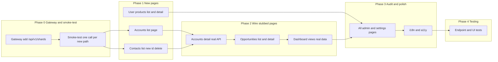

# Full UI Pages Implementation Plan

## Scope

- **Gateway:** Add route for shard-manager so UI can call accounts/contacts via `/api/v1/shards` (shardTypeName `c_account` / `c_contact`). Confirm all other UI-used paths are registered (per [endpoints.md](.cursor/commands/endpoints.md)).
- **New pages:** Accounts list; Contacts (list, new, `[id]`, delete); User-facing Products (list, `[id]`).
- **Existing pages:** Replace any stub/mock with real API calls; ensure data tables, loading/empty states, Actions (Edit/Delete + confirm), first-column link to detail, and `apiFetch`/config-only base URL everywhere.

**Status:** Phase 0–2 done (gateway, new pages, wired pages). Phase 3: 8 admin pages audited and in [documentation/ui/endpoints.md](documentation/ui/endpoints.md) checklist; contacts i18n; risk-catalog and prompts switched to apiFetch. Phase 4: test/typecheck/build run green.

---

## 1. API Gateway

- **Add shard-manager route** (before the broad `/api/v1` so it matches first):
  - Path: `/api/v1/shards` (and `/api/v1/shards/*` via prefix).
  - Service: `shard_manager`; `serviceUrl` from config (e.g. `config.services.shard_manager.url`).
  - File: [containers/api-gateway/src/routes/index.ts](containers/api-gateway/src/routes/index.ts). Register inside the existing `if (config.services.shard_manager?.url)` block with a **more specific** path than `/api/v1` (e.g. `/api/v1/shards` so requests to `/api/v1/shards`, `/api/v1/shards/:id` go to shard_manager; risk_analytics keeps the rest of `/api/v1`).
- **Verify** routes used by UI (auth, users, invitations, logging, recommendations, feedback, tenants, integrations, processing, entity-linking, ml, action-catalog, risk-catalog, decisions, system, dashboard, conversations, prompts, multimodal, web-search, search, adaptive-learning) are present and correctly mapped (no code changes if already correct).

---

## 2. Backend assumptions (no backend work in this plan)

- **Accounts:** List via `GET /api/v1/shards?shardTypeName=c_account` (tenant from header). Detail: existing `GET /api/v1/accounts/:id/health` (risk_analytics); base account fields can come from `GET /api/v1/shards/:id` (shard-manager) if needed.
- **Contacts:** Full CRUD via shard-manager: list `GET /api/v1/shards?shardTypeName=c_contact`, create `POST /api/v1/shards`, get `GET /api/v1/shards/:id`, update `PUT /api/v1/shards/:id`, delete `DELETE /api/v1/shards/:id` (body/params include tenant; shard type resolved by name or id for c_contact).
- **User products:** List `GET /api/v1/products`, detail `GET /api/v1/products/:id` (risk_analytics already under `/api/v1`). If backend does not support tenant-scoped list, add or document in implementation.
- **Request/response contracts:** Request and response shapes for shards (and products) are defined in each service’s `openapi.yaml` or route `schema.body` / `schema.response`. UI validation and request bodies **must match** these contracts so the UI never sends payloads the API will reject for schema reasons.

---

## 3. New pages (full implementation)

### 3.1 Accounts list

- **Route:** `/accounts` (page at [ui/src/app/accounts/page.tsx](ui/src/app/accounts/page.tsx)).
- **Behavior:** Data table (shadcn pattern): sort, filter, pagination, search. Columns: primary identifier (e.g. name from `structuredData`) clickable → `/accounts/[id]`; Actions (View, optional Edit). Use `apiFetch(getApiBaseUrl() + '/api/v1/shards?shardTypeName=c_account' + query)` with `X-Tenant-ID` from context/header. Loading skeleton; empty state when no accounts. Metadata (title). No mock data.

### 3.2 Contacts

- **Routes:**  
  - `ui/src/app/contacts/page.tsx` — list (data table: first column clickable → `/contacts/[id]`, Actions: Edit, Delete with AlertDialog + toast).  
  - `ui/src/app/contacts/new/page.tsx` — create form (React Hook Form + Joi); submit `POST /api/v1/shards` with shard type for c_contact.  
  - `ui/src/app/contacts/[id]/page.tsx` — view/edit (load `GET /api/v1/shards/:id`; form for edit; optional delete with confirm).
- **Delete:** In-list or on detail: confirmation dialog then `DELETE /api/v1/shards/:id`; success/error via Sonner.  
- **Conventions:** Labels/ids for a11y; required indicators; loading and empty states; i18n keys.

### 3.3 User-facing products

- **Routes:**  
  - `ui/src/app/products/page.tsx` — list (data table, first column → `/products/[id]`, Actions: View; call `GET /api/v1/products` or equivalent tenant-scoped endpoint).  
  - `ui/src/app/products/[id]/page.tsx` — view (read-only or minimal edit if API supports it; `GET /api/v1/products/:id`).
- Same standards: loading/empty, apiFetch, no hardcoded URLs, metadata.

---

## 4. Wire existing pages (remove stubs/mocks)

- **Account detail** [ui/src/app/accounts/[id]/page.tsx](ui/src/app/accounts/[id]/page.tsx): Remove `sampleHealth`. Fetch `GET /api/v1/accounts/:id/health` (risk_analytics) and optionally `GET /api/v1/shards/:id` for base fields. Loading and error states.
- **Opportunities** [ui/src/app/opportunities/page.tsx](ui/src/app/opportunities/page.tsx): Implement full list: data table with data from pipeline/risk APIs (per endpoints audit); first column → `/opportunities/[id]`; Actions (Edit, Delete if applicable). Loading/empty.
- **Opportunity detail/risk/remediation/recommendations:** Ensure they use real endpoints (e.g. risk-explainability, win-probability, remediation-workflows) via apiFetch; no mock data.
- **Dashboard** [ui/src/app/dashboard/page.tsx](ui/src/app/dashboard/page.tsx) and dashboard/board, executive, manager: Fetch from dashboard/analytics APIs where available; show real metrics or clear “no data” state; keep navigation links.
- **All other list/detail pages** under admin, settings, analytics, recommendations, conversations, etc.: Audit once: each list uses data table + real API; each detail loads by id; delete uses confirm + toast; 401 handled via apiFetch (redirect to /logout).

---

## 5. Cross-cutting requirements

- **API usage:** Every backend call: `apiFetch` or fetch with `credentials: 'include'`; base URL from `getApiBaseUrl()` / `NEXT_PUBLIC_API_BASE_URL` only (no hardcoded URLs/ports). Direct browser calls to gateway; gateway must allow CORS.
- **Endpoint alignment:** Every page that calls the backend must be listed in the **UI → Gateway → Service** table (see §5.1) with correct method and path; no double path (e.g. `/api/users/api/v1/...`); gateway mapping and backend path confirmed. Use this table as the single source of truth and audit checklist.
- **Form validation:** For every create/update form, validation rules (required fields, types, lengths, enums) **must match** the backend request body schema for that endpoint. Prefer a shared schema layer (e.g. `lib/schemas/<entity>.ts`) used by the form and request building; derive client rules from the service’s OpenAPI or route schema. Choose one approach (e.g. Joi or Zod) and use it consistently across the UI.
- **Data tables:** First column (name/title/id) clickable → detail; last column Actions (Edit, Delete or View); Delete = AlertDialog then API then toast; sorting, filtering, pagination, search where applicable (shadcn data table pattern).
- **Loading/empty/errors:** Every list/detail page must implement: loading skeleton, explicit empty state when no data, and user-facing error via `GENERIC_ERROR_MESSAGE` ([ui/src/lib/api.ts](ui/src/lib/api.ts)); never expose raw `e.message` or stack.
- **i18n:** All user-visible strings behind i18n keys; language switcher in sidebar/header (per [documentation/ui/requirements.md](documentation/ui/requirements.md)).
- **Metadata:** Title (and description where useful) for major pages; global not-found with links (Home, Dashboard, Login).
- **Forms:** React Hook Form + chosen validator (Joi or Zod); labels and ids; required indicators; no `any` types.

### 5.1 Page → endpoint table (single source of truth)

Maintain a **UI → Gateway → Service** table (in [endpoints.md](.cursor/commands/endpoints.md) or a dedicated `documentation/ui/endpoints.md`) that lists for each page/flow:

| Column                | Purpose                                  |
| --------------------- | ---------------------------------------- |
| Page/route            | e.g. `contacts/new`, `accounts/page`     |
| Method                | GET, POST, PUT, DELETE                   |
| Gateway path          | e.g. `POST /api/v1/shards`               |
| Gateway mapping       | path → service (from api-gateway routes) |
| Backend path + method | What the service actually receives       |

- **New pages (accounts, contacts, products):** Add rows in Phase 1 so wiring is correct from day one.
- **Phase 3 audit:** For every listed page, verify the row exists and is correct.

### 5.2 Consistency checklist (per list page)

Every list page must satisfy:

- Data table: first column clickable → detail; last column Actions (Edit/Delete or View).
- Delete: AlertDialog then API call then toast (success/error).
- Loading: skeleton while fetching.
- Empty: explicit empty state when list is empty.
- API: single gateway path from config; no hardcoded URL/port.
- 401: handled via apiFetch (redirect to /logout) or skip401Redirect for auth flows.

### 5.3 Done criteria (per page)

A page is **fully functioning** when:

1. Uses real API (no stubs/mocks).
2. Appears in the page → endpoint table with correct method and path.
3. Any create/update form uses validation that matches the backend request schema.
4. Loading, empty, and error states are implemented.
5. Actions (View/Edit/Delete) work and show toast/redirect as specified.
6. Covered by tests (see §8).

---

## 6. Implementation order (recommended)

- **Phase 0:** Add the gateway route for `/api/v1/shards`; then **smoke-test** at least one call per new path (e.g. `GET /api/v1/shards?shardTypeName=c_account`) through the gateway so new pages are not built on a missing or wrong route. Update the page → endpoint table for shards and products before building UI.
- **Phase 1:** Implement accounts list, contacts (full CRUD), and user products (list + detail). Add each new page to the page → endpoint table. Ensures new pages are fully implemented and linked to gateway.
- **Phase 2:** Replace stubs on account detail, opportunities (list + subpages), and dashboard views with real API calls and data tables.
- **Phase 3:** Audit all remaining pages (admin, settings, analytics, recommendations, conversations, etc.) using the consistency checklist (§5.2) and done criteria (§5.3): real API usage, data table pattern, loading/empty, delete confirm, endpoint table; complete i18n and a11y.
  - **Audit progress:** Aligned to apiFetch/getApiBaseUrl + 401: admin/risk-catalog, admin/products, admin/prompts, admin/security/users, admin/tenants/list, admin/feedback, admin/decision-rules, admin/ml-models. Contacts list i18n (pageTitle, noContacts, searchAriaLabel). Table in [documentation/ui/endpoints.md](documentation/ui/endpoints.md) § Phase 3 checklist audit. Remaining admin/settings list pages to be audited same way.
- **Phase 4:** Run full endpoint and UI test suites; fix any failures (see §8).

---

## 7. Files to touch (summary)

| Area          | Files                                                                                                                                                                                                                    |
| ------------- | ------------------------------------------------------------------------------------------------------------------------------------------------------------------------------------------------------------------------ |
| Gateway       | [containers/api-gateway/src/routes/index.ts](containers/api-gateway/src/routes/index.ts) — add `/api/v1/shards` → shard_manager                                                                                          |
| New pages     | `ui/src/app/accounts/page.tsx`, `contacts/page.tsx`, `contacts/new/page.tsx`, `contacts/[id]/page.tsx`, `products/page.tsx`, `products/[id]/page.tsx`                                                                    |
| Wire existing | `ui/src/app/accounts/[id]/page.tsx`, `opportunities/page.tsx`, opportunity subpages, dashboard pages                                                                                                                     |
| Shared        | [ui/src/lib/api.ts](ui/src/lib/api.ts); reusable data table / delete-dialog patterns if not present; optional `lib/schemas/` for form validation aligned to backend                                                      |
| Audit         | All list/detail pages under `app/admin`, `app/settings`, `app/analytics`, `app/recommendations`, `app/conversations` to ensure they follow data table + API + error/loading conventions and consistency checklist (§5.2) |
| Documentation | Update [.cursor/commands/endpoints.md](.cursor/commands/endpoints.md) or add `documentation/ui/endpoints.md` with the page → endpoint table for accounts, contacts, products, and any corrected paths from the audit     |
| Tests         | API gateway and service route tests; UI unit/integration tests for new and wired pages (see §8)                                                                                                                          |

---

## 8. Testing (endpoints and UI fully tested)

Endpoints and UI **must be fully tested** before the implementation is considered complete.

- **Gateway and endpoints:**
  - Verify gateway route for `/api/v1/shards` forwards to shard_manager with correct path and auth.
  - For each path used by new or wired pages: confirm method and backend path exist on the target service (unit or integration tests as appropriate).
  - Reuse or add tests that hit the gateway (or service) for critical flows: list shards (c_account, c_contact), get/update/delete shard by id, list/get products.
- **UI:**
  - New pages (accounts list, contacts CRUD, products list/detail): unit tests for components and integration tests (or E2E) for key user flows (load list, open detail, create contact, edit, delete with confirm).
  - Wired pages (account detail, opportunities, dashboard): tests that assert real API is called (no mocks/stubs for production code paths where plan requires real API), and that loading/empty/error states are present.
  - Forms: tests that validation rules match expected backend constraints (e.g. required fields, max length); optional: shared schema tests that compare client schema to OpenAPI request body.
- **Phase 4:** Run the full test suite (Vitest for UI, plus any gateway/service tests); fix failures; ensure no regressions. Document test coverage expectations (e.g. critical paths and new pages covered).

---

## 9. Out of scope (for this plan)

- Backend implementation of new endpoints (shard-manager and risk_analytics are assumed to expose the APIs above).
- Tenant Admin vs Super Admin URL structure (keep current `/admin` with role-based visibility unless you decide otherwise).
- New backend services; only gateway route addition and UI work.

