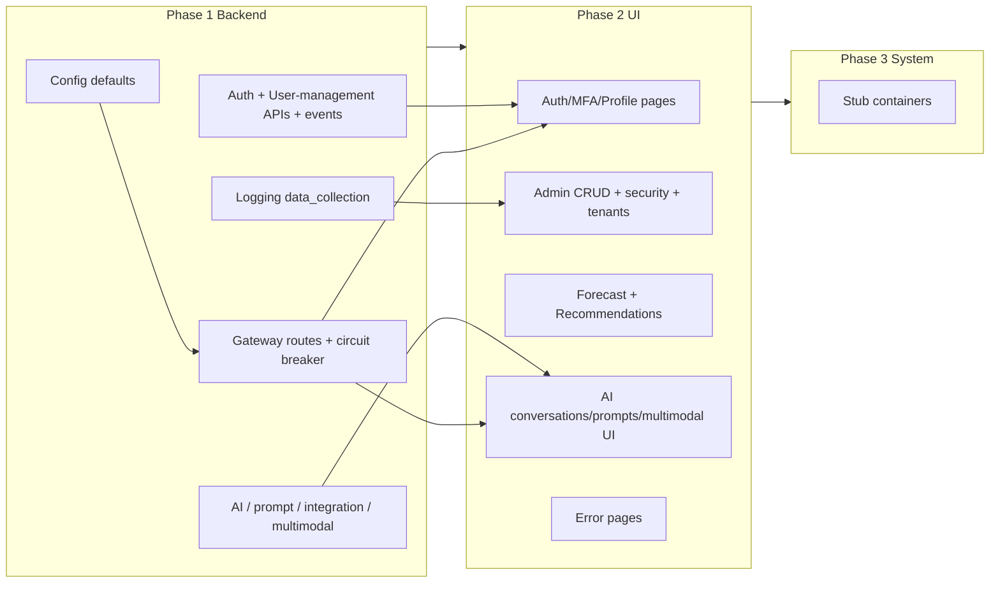

# Implement All Documentation Gaps

This plan consolidates the six gap documents under [documentation/gaps](documentation/gaps) into an ordered, actionable implementation. Work is grouped by domain and priority (P1 then P2 then P3).

**Plan status:** Phases 1–3 are complete. Phase 1 (config, gateway, auth/user-management, AI/prompt/integration/multimodal, logging data_collection), Phase 2 (UI page inventory — 138 routes Done), and Phase 3 (stub container decision, p3-gap-coverage) are implemented and documented. P2 (MFA) complete: TOTP + backup codes, enroll/verify/disable UI, post-login 202 + complete-mfa and login page MFA step. CORS and Redis rate limit in gateway done. Optional follow-ups: P3 API keys and general rate limiting are implemented (API key create + validate; per-IP rate limit on auth routes).

---

## Phase 1: Backend — Config, Gateway, and Service Fixes

### 1.1 Config default ports/URLs (system-wide + AI)

**Sources:** [system-wide-gaps.md](documentation/gaps/system-wide-gaps.md), [ai-integrations-multimodal-prompt-gaps.md](documentation/gaps/ai-integrations-multimodal-prompt-gaps.md)

- **User-management URL (3022):** In [containers/secret-management](containers/secret-management) and [containers/logging](containers/logging) config, change `USER_MANAGEMENT_URL` default from `localhost:3000` to `localhost:3022`.
- **Integration-manager URL (3026):** In workflow-orchestrator, signal-intelligence, integration-sync, integration-processors configs, change `INTEGRATION_MANAGER_URL` default from `localhost:3012` to `localhost:3026`.
- **Shard-manager URL (3023):** In security-scanning, risk-catalog, and [containers/ai-conversation](containers/ai-conversation) configs, change `SHARD_MANAGER_URL` default from `localhost:3002` to `localhost:3023`.

**Status:** Verified — all listed configs already use 3022/3026/3023 in config/default.yaml. [system-wide-gaps.md](documentation/gaps/system-wide-gaps.md) §1 and P1 updated to "Resolved".

### 1.2 API Gateway

**Source:** [api-gateway-gaps.md](documentation/gaps/api-gateway-gaps.md)

- **Docs vs config:** Align [containers/api-gateway/README.md](containers/api-gateway/README.md) and [containers/api-gateway/architecture.md](containers/api-gateway/architecture.md) with config: state default port **3002** (config uses `PORT:-3002`). **Done:** README and architecture already state 3002; [api-gateway-gaps.md](documentation/gaps/api-gateway-gaps.md) §1.1 updated to Resolved.
- **Circuit breaker:** In [containers/api-gateway/src/services/ProxyService.ts](containers/api-gateway/src/services/ProxyService.ts), perform the actual proxied HTTP request via **ServiceClient** (with circuit breaker) instead of raw `axios.request()`, and pass `circuit_breaker.threshold` and `circuit_breaker.timeout` from config into ProxyService/ServiceClient. **Done:** ProxyService already uses `ServiceClient.requestWithFullResponse()`; server passes `config.circuit_breaker` to ProxyService; config loader now parses both threshold and timeout to numbers. See [api-gateway-gaps.md](documentation/gaps/api-gateway-gaps.md) §2.
- **Optional (P2):** Redis-backed rate limit store when running multiple gateway instances. **Done:** Optional `redis.url` in config; when set, rate limit uses Redis (createRedisStore); else in-memory. **CORS:** Done — `cors.origin` in config and schema (see api-gateway-gaps §4.1).

### 1.3 Gateway route coverage

**Sources:** [ai-integrations-multimodal-prompt-gaps.md](documentation/gaps/ai-integrations-multimodal-prompt-gaps.md), [system-wide-gaps.md](documentation/gaps/system-wide-gaps.md)

**Pre-requisite:** Decide and document whether context-service and search-service are client-facing (before implementing routes or UI `/search`). If yes, add them in this step; if no, document as backend-only so Phase 2 search/integration assumptions are consistent.

- Add to [containers/api-gateway/config/default.yaml](containers/api-gateway/config/default.yaml): `ai_conversation`, `multi_modal_service`, `prompt_service` (URLs per [CURRENT_STATE.md](documentation/CURRENT_STATE.md): 3045, 3044, 3036).
- Add to [containers/api-gateway/config/schema.json](containers/api-gateway/config/schema.json): corresponding service entries.
- In [containers/api-gateway/src/routes/index.ts](containers/api-gateway/src/routes/index.ts), register routes **before** the catch-all. **Route registration order: most specific path first** (e.g. `/api/v1/prompts` before `/api/v1`) so the catch-all does not steal traffic. Examples: `/api/conversations` → ai_conversation, `/api/v1/multimodal` → multi_modal_service, `/api/v1/prompts` → prompt_service.
- If context-service and search-service are client-facing: add services and route mappings (e.g. `/api/context`, `/api/search`); otherwise document as backend-only.

**Status:** Done. default.yaml and schema include ai_conversation, multi_modal_service, prompt_service; routes registered in correct order. search-service at `/api/v1/search` when configured; context-service documented backend-only in [system-wide-gaps.md](documentation/gaps/system-wide-gaps.md) §2.1.

### 1.4 Auth and user-management

**Source:** [auth-user-management-gaps.md](documentation/gaps/auth-user-management-gaps.md)

- **User-management API:** In [containers/user-management/src/routes/users.ts](containers/user-management/src/routes/users.ts), add:
  - `GET /api/v1/users` (list users; tenant-scoped + RBAC).
  - `GET /api/v1/users/:id` (get profile by id; tenant + RBAC).
  - `PUT /api/v1/users/:id` (admin update; if required).
- **Auth event consumers (user-management):** Implement RabbitMQ consumers for `auth.login.success`, `auth.login.failed`, `user.registered` (last-login update, optional failed-login tracking, create profile on registration). Add under `events/consumers` and register on server startup.
- **Docs:** Align user-management README and OpenAPI with implemented routes.
- **MFA (P2):** Implement MFA routes and services (TOTP, backup codes) in [containers/auth](containers/auth), using `auth_mfa_secrets`; document in README/OpenAPI. **Status:** Auth README documents MFA as planned P2; config and container (`auth_mfa_secrets`) are in place; full implementation deferred.
- **P3:** API key / machine-auth; general rate-limiting middleware on auth routes.

**Status:** Done. user-management has GET/PUT /api/v1/users, /users/me, /users/:id; AuthEventConsumer in events/consumers; README and openapi.yaml aligned. MFA and P3 remain optional.

### 1.5 AI service, prompt-service, integration-processors, multi-modal

**Source:** [ai-integrations-multimodal-prompt-gaps.md](documentation/gaps/ai-integrations-multimodal-prompt-gaps.md)

- **ai-service:** Update README to describe Cosmos DB and config (not PostgreSQL/DATABASE_URL). Remove or restrict JWT fallback `'change-me'` to dev-only. Add tenantId scope to `getAgent(id)` if agents are tenant-scoped; implement or document `executeAgent` (remove TODO).
- **prompt-service:** Implement `GET /api/v1/prompts/analytics` in [containers/prompt-service/src/routes](containers/prompt-service/src/routes) (or remove from README).
- **integration-processors:** Add [containers/integration-processors/openapi.yaml](containers/integration-processors/openapi.yaml) and [containers/integration-processors/architecture.md](containers/integration-processors/architecture.md) per ModuleImplementationGuide.
- **multi-modal-service:** Add `code_generation` (or equivalent) to config if used; align README with config. Optionally implement or document actual multi-modal processing (image/diagram/audio/video) as future work.

**Status:** Done. prompt-service GET /api/v1/prompts/analytics implemented; integration-processors has openapi.yaml and architecture.md; ai-service README and multi-modal gaps documented in [ai-integrations-multimodal-prompt-gaps.md](documentation/gaps/ai-integrations-multimodal-prompt-gaps.md).

### 1.6 Logging — data collection config

**Source:** [logging-data-collection-config-gaps.md](documentation/gaps/logging-data-collection-config-gaps.md)

- Add `data_collection` section to [containers/logging/config/default.yaml](containers/logging/config/default.yaml): enable/disable by **event type** (with wildcards), **resource type**, **category**, **severity**. Default when not listed: collect; evaluation: **AND** of all dimensions; null resourceType uses `resource_type.default`.
- Extend [containers/logging/config/schema.json](containers/logging/config/schema.json) to validate `data_collection`.
- In [containers/logging/src/events/consumers/AuditEventConsumer.ts](containers/logging/src/events/consumers/AuditEventConsumer.ts): after `mapEventToLog`, before `ingestionService.ingest`, call `isCollectionEnabled(logInput, config.data_collection)`; if false, skip ingest.
- Implement `isCollectionEnabled` (AND of category, resource_type, event_type with wildcard matching, severity); add unit and integration tests. Document in README and schema.
- **API for admin UI:** Expose GET (and optional search) API for `data_collection` config in the logging service (or configuration service) so `/admin/system/logging/config` can display and search it. Edit of `data_collection` remains out of scope (config stays in YAML/env); UI is view-only + search.

**Status:** Done. data_collection in config and schema; isCollectionEnabled in dataCollectionFilter.ts; AuditEventConsumer skips ingest when disabled; GET /config/data-collection for admin UI; README updated.

---

## Phase 2: UI — Page Inventory (138 pages; complete)

**Source:** [ui-pages-inventory.md](documentation/gaps/ui-pages-inventory.md)

Implement in [ui](ui) (Next.js App Router) in the order below. All routes and CRUD are specified in the inventory; only groupings are listed here.

**UI–backend API surface (contract for Phase 2):**

| UI group                                | API paths the UI calls (via gateway)                                                                            |
| --------------------------------------- | --------------------------------------------------------------------------------------------------------------- |
| Auth & session                          | `/api/auth/*` (login, register, forgot-password, reset-password, verify-email, logout, accept-invitation)       |
| MFA & profile                           | `/api/auth/*` (MFA), `/api/users/me`, `PUT /api/users/me`                                                       |
| Settings & search                       | Integration manager, config service; `/api/search` or search-service route if client-facing                     |
| Forecast                                | Risk-analytics / forecasting service routes (e.g. `/api/v1/*` per gateway)                                      |
| Recommendations                         | `/api/v1/recommendations`, `/api/v1/feedback`                                                                   |
| AI (conversations, prompts, multimodal) | `/api/conversations`, `/api/v1/prompts`, `/api/v1/multimodal`                                                   |
| Admin security & tenants                | `/api/users`, `/api/v1/users/:id`, user-management admin routes; recommendations/admin/tenants                  |
| Admin CRUD                              | Risk-catalog, integration-manager, shard-manager, ml_service, recommendations, etc. per existing gateway routes |
| Logging config                          | Logging service GET (and search) API for `data_collection` config                                               |

### 2.1 Auth and session (unauthenticated)

- `/login`, `/register`, `/forgot-password`, `/reset-password`, `/verify-email`, `/logout`, `/accept-invitation`.

### 2.2 MFA and profile

- `/settings/security`, `/settings/mfa/enroll`, `/settings/mfa/verify`, `/settings/profile`.

### 2.3 Settings and search

- `/settings` (landing), `/settings/integrations/[id]` (single page: health + sync + field-mappings), `/search`.

### 2.4 Analytics — forecast

- `/analytics/forecast`, `/analytics/forecast/[period]`, `/analytics/forecast/team`, `/analytics/forecast/tenant`, `/analytics/forecast/accuracy`, `/analytics/forecast/record-actual`.

### 2.5 Recommendations

- `/recommendations`, `/opportunities/[id]/recommendations`, `/recommendations/[id]`.

### 2.6 AI in UI

- Conversations: `/conversations`, `/conversations/[id]`.
- Prompts: `/admin/prompts`, `/admin/prompts/[id]`, `/admin/prompts/analytics`.
- Multi-modal: `/admin/multimodal` or `/tools/multimodal`, and `/[id]` for job status/result.

### 2.7 Admin — security and tenants

- User detail: `/admin/security/users/[id]` (with Sessions view/revoke), `/admin/security/users/invite`, `/admin/security/invitations` (pending list, resend, cancel).
- Roles/API keys: `/admin/security/roles/new`, `/admin/security/api-keys/new`.
- Tenants: `/admin/tenants/new`.

### 2.8 Admin — CRUD (explicit /new and /[id])

**Implementation order:** Implement one full vertical first (e.g. action-catalog categories: list + `new` + `[id]`), extract a shared pattern (list page, form page, detail page), then replicate for the rest so all admin CRUD stays consistent.

- Action catalog: categories/entries/relationships — `new`, `[id]` (detail/edit).
- Decision rules: rules/templates — `new`, `[id]`.
- Feature engineering: features — `new`, `[id]`.
- ML models: models/endpoints — `new`, `[id]`.
- Feedback: types — `new`, `[id]`.
- Products: `new`, `[id]`.
- Risk catalog: `new`, `[id]`.
- Analytics: dashboards/reports — `new`, `[id]`.

### 2.9 Admin — system and context

- `/admin/system/logging/config` — Data collection config: **view-only + search** (no edit in UI; edits remain in YAML/env).
- `/admin/context` (Super Admin: platform; Tenant Admin: tenant context).

### 2.10 Error pages

- `not-found.tsx` (404), unauthorized (401) page or handler.

**Note:** UI work depends on Phase 1 for auth, user-management, gateway routes (conversations, prompts, multimodal), and logging config view.

**Phase 2 milestones (optional split for delivery):**

| Milestone | Scope                                                            | Definition of done                                                                                    |
| --------- | ---------------------------------------------------------------- | ----------------------------------------------------------------------------------------------------- |
| M1        | §2.1 Auth + §2.2 MFA/profile + §2.3 Settings & search            | All routes load without 404; auth flows call real APIs; settings landing and integration detail work. |
| M2        | §2.4 Forecast + §2.5 Recommendations                             | Forecast and recommendation pages call real APIs where available.                                     |
| M3        | §2.6 AI in UI                                                    | Conversations, prompts, multimodal pages call gateway routes.                                         |
| M4        | §2.7–§2.10 Admin CRUD, security, tenants, system/context, errors | All admin list/new/[id] pages and error pages in place; logging config view uses logging API.         |

**Status:** All routes in [ui-pages-inventory.md](documentation/gaps/ui-pages-inventory.md) §3 are marked Done (138 total). Summary counts in §4 updated to 138 Done, 0 Todo. Pages exist for auth, MFA, profile, settings, search, forecast, recommendations, AI (conversations, prompts, multimodal), admin security/tenants/CRUD/system/context, and error pages.

---

## Phase 3: System-Wide and Stub Containers

**Source:** [system-wide-gaps.md](documentation/gaps/system-wide-gaps.md)

### 3.1 Stub containers

- **compliance-service, security-service, migration-service:** Either complete per ModuleImplementationGuide (README, CHANGELOG, package.json, config/default.yaml, server.ts, routes) or mark deprecated and exclude from [documentation/CURRENT_STATE.md](documentation/CURRENT_STATE.md) and container list.
- **Deadline:** Decide for each stub (complete vs deprecate) by end of Phase 2 or a fixed milestone so they do not remain in limbo.

**Status:** Decision completed. **compliance-service** and **migration-service** are deprecated (README states status; CURRENT_STATE.md excludes them from active list; compliance covered by logging/secret-management/security-service; migration in configuration-service). **security-service** is retained as a stub for future completion (README and CURRENT_STATE.md document; port 3042 reserved; not run in default stack until completed).

### 3.2 Optional gap coverage (P3) — Done

- Add focused gap analyses for: logging (beyond data collection), secret-management, shard-manager, risk-analytics, recommendations, shared, as needed.
- **Implemented:** [documentation/gaps/p3-gap-coverage.md](documentation/gaps/p3-gap-coverage.md) covers each area with what to check and cross-references.

---

## Dependency overview

---

## Suggested implementation order

1. **Phase 1.1** — Config defaults (quick, unblocks local dev).
2. **Phase 1.2–1.3** — Gateway docs, circuit breaker, new routes (unblocks UI calling new services).
3. **Phase 1.4** — User-management endpoints + event consumers (required for admin user detail and invitations).
4. **Phase 1.5** — AI/prompt/processors/multimodal fixes (enables AI and admin prompt/multimodal UI).
5. **Phase 1.6** — Logging data_collection (enables logging config view in admin).
6. **Phase 2** — UI pages in the order of §2.1–§2.10 (auth first, then settings/search, forecast/recommendations, AI, admin CRUD, system/context, errors).
7. **Phase 3** — Stub container decision (by Phase 2 end or fixed milestone) and optional gap analyses.

**After Phase 1 — smoke test checklist:**

- Gateway proxies to ai_conversation, prompt_service, multi_modal_service (and context/search if added).
- User-management `GET /api/v1/users` and `GET /api/v1/users/:id` return tenant-scoped data.
- Auth event consumers (user-management) run on startup and handle `auth.login.success`, `auth.login.failed`, `user.registered`.
- Logging consumer skips ingest when `data_collection` disables an event; logging service exposes GET (and optional search) for data_collection config.

**Post-implementation verification (when Node/pnpm available):**

- Run `pnpm test` (or `pnpm test:unit`) in `containers/api-gateway` to confirm rate limit and integration tests pass.
- Run tests in `containers/user-management`, `containers/logging` as needed for changed areas.

---

## Key files

| Area            | Key files                                                                                                                                                                                                                                                                                      |
| --------------- | ---------------------------------------------------------------------------------------------------------------------------------------------------------------------------------------------------------------------------------------------------------------------------------------------- |
| Gateway         | [containers/api-gateway/config/default.yaml](containers/api-gateway/config/default.yaml), [containers/api-gateway/src/routes/index.ts](containers/api-gateway/src/routes/index.ts), [containers/api-gateway/src/services/ProxyService.ts](containers/api-gateway/src/services/ProxyService.ts) |
| User-management | [containers/user-management/src/routes/users.ts](containers/user-management/src/routes/users.ts), new `events/consumers`                                                                                                                                                                       |
| Logging         | [containers/logging/config/default.yaml](containers/logging/config/default.yaml), [containers/logging/src/events/consumers/AuditEventConsumer.ts](containers/logging/src/events/consumers/AuditEventConsumer.ts)                                                                               |
| UI              | [ui/src/app](ui/src/app) (new routes per inventory)                                                                                                                                                                                                                      |

All gap sources are in [documentation/gaps](documentation/gaps); refer to them for exact tables, config examples, and priority labels (P1/P2/P3).