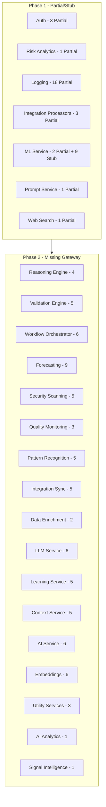

# Implement All Endpoints Fully

## Approach

Apply patterns from [documentation/endpoints/endpoint_templates.md](documentation/endpoints/endpoint_templates.md) to bring Partial/Stub/Missing endpoints to Fully status. Services are completed one at a time. Each endpoint gets: auth/tenant middleware, schema validation, Cosmos or existing storage, optional RabbitMQ events, and unit + integration tests.

**Template notes:** Templates assume Cosmos DB. Auth and user-management use PostgreSQL (Prisma); adapt service layer accordingly. Logging uses Cosmos. Other services vary—check existing storage before applying.

**Questions and decisions:** All open questions, decisions made, and design choices during implementation **must** be documented in [documentation/endpoints/questions.md](documentation/endpoints/questions.md). Update this file before starting each service and when resolving ambiguities.

---

## Service Order and Scope



---

## Phase 1: Partial and Stub Endpoints (by service)

### 1. Auth Service (3 Partial) ✅

**Endpoints:** `GET/POST/DELETE /api/v1/auth/api-keys`

**Decision:** Keep feature flag; complete implementation behind it ([questions.md](documentation/endpoints/questions.md))

**Tasks:**
- Honor feature flag; ensure X-Tenant-ID flows
- Add `tenantEnforcementMiddleware()` if not present
- Add `security: [{ bearerAuth: [] }]` to schema
- Verify ApiKeyService uses tenantId; add tests
- Files: [containers/auth/src/routes/auth.ts](containers/auth/src/routes/auth.ts), [containers/auth/src/services/ApiKeyService.ts](containers/auth/src/services/ApiKeyService.ts)

**Verified (2026-02-12):** All three routes have feature-flag check (403 when disabled), `preHandler: [authenticateRequest, tenantEnforcementMiddleware()]`, and `security: [{ bearerAuth: [] }]`. ApiKeyService.create uses tenantId; list/revoke are user-scoped (own keys). Integration tests in [containers/auth/tests/integration/routes/api-keys.test.ts](containers/auth/tests/integration/routes/api-keys.test.ts) — 9 tests pass.

### 2. Risk Analytics (1 Partial) ✅

**Endpoint:** `POST /api/v1/decisions/methodology`

**Decision:** Full methodology decision logic ([questions.md](documentation/endpoints/questions.md))

**Tasks:**
- Implement full methodology decision logic in DecisionEngineService
- Add schema, tenant isolation, error handling per template
- Add unit + integration tests
- Files: [containers/risk-analytics/src/routes/index.ts](containers/risk-analytics/src/routes/index.ts), [containers/risk-analytics/src/services/DecisionEngineService.ts](containers/risk-analytics/src/services/DecisionEngineService.ts)

**Verified (2026-02-12):** Route has body schema (required opportunityId), preHandler (authenticateRequest, tenantEnforcementMiddleware), security bearerAuth, tenantId from request.user. DecisionEngineService.makeMethodologyDecisions implements full logic (stage requirements, duration anomaly, methodology fields, MEDDIC) using getMethodologyFeatures from ml-service. Unit tests: DecisionEngineService.test.ts (5 tests). Integration: decisions-methodology.test.ts (200/204, 400 missing opportunityId). All pass.

### 3. Logging Service (18 Partial) ✅

**Endpoints:** policies CRUD (5), configuration (1), alerts CRUD + evaluate (6), verification (5)

**Tasks:**
- Align policies, configuration, alerts, verification with templates (auth, tenant, schema)
- Add `authenticateRequest()` + `tenantEnforcementMiddleware()` where missing
- Ensure Cosmos partition key = tenantId for all queries
- Add unit tests for RetentionService, AlertService, ConfigurationService, HashChainService
- Files: [containers/logging/src/routes/](containers/logging/src/routes/), [containers/logging/src/services/](containers/logging/src/services/)

**Done (2026-02-12):** Auth/tenant already on v1 scope. Policies: GET by id + update/delete tenant-scoped (RetentionService). Alerts: getRule/updateRule/deleteRule/evaluateRule tenant-scoped (AlertService + Cosmos findUniqueByIdAndTenant). Verification: checkpoints tenant-scoped (organizationId on audit_hash_checkpoints, HashChainService). Unit tests added/updated for all four services; 157 logging unit tests pass. See [questions.md](documentation/endpoints/questions.md).

### 4. Integration Processors (3 Partial) ✅

**Endpoints:** `GET /api/v1/admin/monitoring/integrations`, `errors`, `performance`

**Tasks:**
- Implement service logic for integrations, errors, performance (or stub with real data shape)
- Add schema, auth, tenant middleware
- Add tests
- Files: [containers/integration-processors/src/routes/](containers/integration-processors/src/routes/)

**Done (2026-02-12):** Routes already had auth + tenantEnforcementMiddleware and response schema. MonitoringService: getIntegrationHealth stub ([]); getErrorAnalytics/getPerformanceMetrics return real data shape. Exported buildApp() for tests; integration tests in tests/integration/routes/monitoring.test.ts. See [questions.md](documentation/endpoints/questions.md).

### 5. ML Service (2 Partial + 9 Stub)

**Partial:** `GET /api/v1/ml/endpoints`, `GET /api/v1/ml/endpoints/:id`  
**Stub:** monitoring/alerts CRUD (4), features/quality (2), features/versions (1), quality-rules (1), version-policy (1)

**Tasks:**
- Implement endpoints list/get with real ML service data
- Replace stub routes with full CRUD/service logic for alerts, quality, versions
- Add Cosmos or existing storage, tenantId, auth
- Add tests
- Files: [containers/ml-service/src/routes/index.ts](containers/ml-service/src/routes/index.ts)

**Done (2026-02-12) – partial only:** List/get endpoints were already implemented (config.azure_ml.endpoints + health fetch, auth + tenant). Added integration tests in tests/integration/routes/ml-endpoints.test.ts. Stub routes (monitoring/alerts, features/quality, etc.) remain for later.

### 6. Prompt Service (1 Partial)

**Endpoint:** `GET /api/v1/prompts/analytics`

**Tasks:**
- Implement analytics aggregation (usage, prompts by model, etc.)
- Add schema, auth, tenant
- Add tests
- Files: [containers/prompt-service/src/routes/index.ts](containers/prompt-service/src/routes/index.ts), [containers/prompt-service/src/services/PromptService.ts](containers/prompt-service/src/services/PromptService.ts)

**Done (2026-02-12):** Route and PromptService.getAnalytics(tenantId) were already implemented (auth, tenant, schema, Cosmos aggregation by status/category). Added unit tests for getAnalytics; added integration test for GET /api/v1/prompts/analytics (200 + body shape). All tests pass.

### 7. Web Search (1 Partial)

**Endpoint:** `POST /api/v1/web-search` (when configured)

**Tasks:**
- Ensure gateway route exists when config has web_search.url
- Add tenant validation, schema, error handling
- Add tests
- Files: [containers/web-search/src/routes/index.ts](containers/web-search/src/routes/index.ts), [containers/api-gateway/src/routes/index.ts](containers/api-gateway/src/routes/index.ts)

**Done (2026-02-12):** Gateway already registers `/api/v1/web-search` when `config.services.web_search?.url` is set. Route had auth, tenantEnforcementMiddleware, body schema, and catch with WEB_SEARCH_FAILED; added 400/500 response schema. Integration tests in `tests/integration/routes/web-search.test.ts`: 200 with results/query/cached, 400 when query missing. Both tests pass.

---

## Phase 2: Missing Gateway Routes (by service)

For each service, add gateway `routeMappings` in [containers/api-gateway/src/routes/index.ts](containers/api-gateway/src/routes/index.ts) and ensure config has `services.{service}.url`. Paths below use `/api/v1/` prefix unless noted.

### 8. Reasoning Engine (4 endpoints)

- Add gateway: `{ path: '/api/v1/reasoning', service: 'reasoning_engine', ... }`
- Verify routes: `POST /reasoning/reason`, `GET /reasoning/tasks`, `GET /reasoning/tasks/:id`, `POST /reasoning/tasks/:id/cancel`
- Add config entry for reasoning_engine
- Add auth, tenant, schema, tests

**Done (2026-02-12):** Gateway and config already present. Routes implemented with auth, tenant, schema; integration tests (7) pass. ENDPOINTS.md updated to Fully.

### 9. Validation Engine (5 endpoints)

- Add gateway: `{ path: '/api/v1/validation', service: 'validation_engine', ... }`
- Verify routes: rules CRUD, runs CRUD, run execution
- Add config, auth, tenant, tests

**Done (2026-02-12):** Gateway and config already present. Routes: rules CRUD, POST /validation/run, runs list/get, runs/:id/results; auth, tenant, schema on all. Integration tests (8) pass. ENDPOINTS.md updated to Fully.

### 10. Workflow Orchestrator (6 endpoints)

- Add gateway: `{ path: '/api/v1/workflows', service: 'workflow_orchestrator', ... }`, `{ path: '/api/v1/hitl', ... }`
- Verify: hitl/approvals, workflows, retry
- Add config, auth, tenant, tests

**Done (2026-02-12):** Gateway and config already present. Routes: GET/POST workflows, GET workflows/:id, POST retry; GET hitl/approvals/:id, POST approve/reject; auth, tenant on all. Integration tests (6) pass. ENDPOINTS.md updated to Fully.

### 11. Forecasting (9 endpoints)

- **Decision:** Forecasting owns /api/v1/forecasts ([questions.md](documentation/endpoints/questions.md))
- Add gateway: `{ path: '/api/v1/forecasts', service: 'forecasting', ... }`, `{ path: '/api/v1/accuracy', ... }` (register before risk_analytics /api/v1 for path precedence)
- Verify: forecasts, scenarios, team, tenant, accuracy
- Add config, auth, tenant, tests

**Done (2026-02-12):** Gateway and config already present. Routes: GET/POST /forecasts, GET /forecasts/:forecastId, GET /forecasts/:period/scenarios|risk-adjusted|ml, POST /forecasts/team, GET /forecasts/tenant, POST /accuracy/actuals, GET /accuracy/metrics; auth, tenant on all. Integration tests (7) pass. ENDPOINTS.md updated to Fully.

### 12. Security Scanning (5 endpoints)

- Add gateway: `{ path: '/api/v1/security', service: 'security_scanning', ... }`
- Verify: scans, pii/detect, pii/redact, detections
- Add config, auth, tenant, tests

**Done (2026-02-12):** Gateway and config already present. Routes: GET /security/scans/:scanId, POST /security/scans, POST /security/pii/detect, POST /security/pii/redact, GET /security/pii/detections/:detectionId; auth, tenant on all. Integration tests (5) pass. ENDPOINTS.md updated to Fully.

### 13. Quality Monitoring (3 endpoints)

- Add gateway: `{ path: '/api/v1/quality', service: 'quality_monitoring', ... }`
- Verify: metrics, anomalies, detect
- Add config, auth, tenant, tests

**Done (2026-02-12):** Gateway and config already present. Routes: GET/POST /quality/metrics, GET /quality/anomalies, POST /quality/anomalies/detect; auth, tenant on all. Integration tests (4) pass. ENDPOINTS.md updated to Fully.

### 14. Pattern Recognition (5 endpoints)

- Add gateway: `{ path: '/api/v1/patterns', service: 'pattern_recognition', ... }`
- Verify: patterns CRUD, pattern-scans CRUD, run
- Add config, auth, tenant, tests

**Done (2026-02-12):** Gateway and config already present. Routes: patterns CRUD (POST, GET, GET/:id, PUT/:id, DELETE/:id), POST /patterns/scan, GET /patterns/scans, GET /patterns/scans/:id, GET /patterns/scans/:id/matches; auth, tenant on all. Integration tests (11) pass. ENDPOINTS.md updated to Fully.

### 15. Integration Sync (5 endpoints) — MERGED INTO INTEGRATION MANAGER

- **Decision:** Merge Integration Sync into Integration Manager ([questions.md](documentation/endpoints/questions.md))
- Ensure Integration Manager routes cover: sync/tasks/:taskId, sync/trigger, sync/conflicts/:id/resolve, webhooks
- Gateway already has integration_manager; verify path coverage

**Done (2026-02-12):** Gateway has /api/v1/sync and /api/v1/webhooks → integration_manager. Integration Manager exposes GET /api/v1/sync/tasks/:taskId, POST /api/v1/sync/trigger, POST/GET /api/v1/webhooks(/:id), /api/v1/sync-tasks, and /api/v1/integrations/sync/conflicts/* (detect, resolve, :conflictId, pending, ignore, stats). Path coverage verified. ENDPOINTS.md updated to Fully (merged).

### 16. Data Enrichment (2 endpoints)

- Add gateway: `{ path: '/api/v1/enrichment', service: 'data_enrichment', ... }`
- Verify: jobs/:jobId, trigger
- Add config, auth, tenant, tests

**Done (2026-02-12):** Gateway and config already present. Routes: GET /enrichment/jobs/:jobId, POST /enrichment/trigger, POST /enrichment/enrich, POST /enrichment/bulk, GET /enrichment/statistics (+ vectorization); auth, tenant on all. Integration tests (5) pass. ENDPOINTS.md updated to Fully.

### 17. LLM Service (6 endpoints)

- Add gateway: `{ path: '/api/v1/llm', service: 'llm_service', ... }`
- Verify: explain, recommendations, scenarios, summary, playbook, reactivation/strategy
- Add config, auth, tenant, tests

**Done (2026-02-12):** Gateway and config already present. Routes: POST /llm/explain, /recommendations, /scenarios, /summary, /playbook, /reactivation/strategy; auth, tenant on all. Integration tests (7) pass. ENDPOINTS.md updated to Fully.

### 18. Learning Service (5 endpoints)

- Add gateway: `{ path: '/api/v1/learning', service: 'learning_service', ... }`
- Verify: feedback, outcomes, feedback/summary, feedback/:id/link-prediction, feedback/trends
- Add config, auth, tenant, tests

**Done (2026-02-12):** Gateway and config present. Routes: POST /api/v1/feedback, POST /api/v1/outcomes, GET /api/v1/feedback/summary/:modelId, PUT /api/v1/feedback/:feedbackId/link-prediction, GET /api/v1/feedback/trends/:modelId; auth and tenant on all. Integration tests (7) pass. ENDPOINTS.md updated to Fully.

### 19. Context Service (5 endpoints)

- Add gateway: `{ path: '/api/v1/contexts', service: 'context_service', ... }`
- Verify: contexts CRUD, assemble, dependencies, call-graphs
- Add config, auth, tenant, tests

**Done (2026-02-12):** Gateway and config present. Routes under /api/v1/context/: contexts CRUD (POST, GET list, GET :id, GET path/:path), POST assemble, POST dependencies/tree, POST call-graphs; auth and tenant on all. Route tests in unit/placeholder.test.ts (7) pass. ENDPOINTS.md updated to Fully. Note: service uses prefix /api/v1/context (singular); gateway exposes /api/v1/contexts (plural).

### 20. AI Service (6 endpoints)

- Gateway exists for `/api/ai`; verify completions, models, agents
- Add missing routes or pathRewrite for models, agents, execute
- Add config, auth, tenant, tests

**Done (2026-02-12):** Gateway has `/api/ai` → ai_service with stripPrefix: true. Routes: POST /completions, GET /models, GET /models/:id, GET /agents, GET /agents/:id, POST /agents/:id/execute; auth and tenantEnforcementMiddleware on all. Integration tests in tests/integration/routes/ai-service.test.ts (run with pnpm from repo root). ENDPOINTS.md updated to Fully.

### 21. Embeddings (6 endpoints)

- Gateway exists for `/api/embeddings`; verify embeddings, batch, search, delete
- Add pathRewrite if needed for /api/v1/embeddings
- Add config, auth, tenant, tests

**Done (2026-02-12):** Gateway has `/api/embeddings` → embeddings with stripPrefix: true. Routes (prefix ''): POST /, POST /batch, GET /:id, POST /search, DELETE /:id, DELETE /project/:projectId; auth and tenantEnforcementMiddleware on all. Tests in tests/unit/placeholder.test.ts (run with pnpm from repo root). ENDPOINTS.md updated to Fully.

### 22. Utility Services (3 endpoints)

- Add gateway: `{ path: '/api/v1/utility', service: 'utility_services', ... }`
- Verify: jobs/:jobId, import, export
- Add config, auth, tenant, tests

**Done (2026-02-12):** Gateway and config present. Routes: GET /api/v1/utility/jobs/:jobId, POST /api/v1/utility/import, POST /api/v1/utility/export; auth and tenant on all. ENDPOINTS.md updated to Fully.

### 23. AI Analytics (1 endpoint)

- Add gateway: `{ path: '/api/v1/ai-analytics', service: 'ai_analytics', ... }`
- Verify: GET models
- Add config, auth, tenant, tests

**Done (2026-02-12):** Gateway and config present. Route: GET /api/v1/ai-analytics/models; auth and tenant. ENDPOINTS.md updated to Fully.

### 24. Signal Intelligence (1 endpoint)

- Add gateway: `{ path: '/api/v1/signals', service: 'signal_intelligence', ... }`
- Verify: POST signals/analyze
- Add config, auth, tenant, tests

**Done (2026-02-12):** Gateway and config present. Route: POST /api/v1/signals/analyze; auth and tenant. ENDPOINTS.md updated to Fully.

---

## Gateway Config Template

For each new service in gateway, add to [containers/api-gateway/config/default.yaml](containers/api-gateway/config/default.yaml) (or equivalent):

```yaml
services:
  {service_name}:
    url: ${SERVICE_NAME_URL}
```

And in [containers/api-gateway/src/routes/index.ts](containers/api-gateway/src/routes/index.ts):

```typescript
if (config.services.{service_name}?.url) {
  routeMappings.push({ path: '/api/v1/...', service: '{service_name}', serviceUrl: config.services.{service_name}.url, stripPrefix: false });
}
```

---

## Testing Strategy

Per [.cursorrules](.cursorrules): 80% coverage, Vitest, unit + integration.

- **Unit:** Service methods (Cosmos/DB calls mocked)
- **Integration:** Route handlers with mocked auth, tenant, DB
- **Pattern:** Follow [containers/shard-manager/tests/](containers/shard-manager/tests/), [containers/risk-catalog/tests/](containers/risk-catalog/tests/)

---

## Implementation Checklist (per endpoint)

- [ ] Route registered in API Gateway (if Missing)
- [ ] `authenticateRequest()` on protected routes
- [ ] `tenantEnforcementMiddleware()` for tenant-scoped routes
- [ ] `tenantId` from `request.user!.tenantId` (never from body)
- [ ] Cosmos/DB: partition key = tenantId where applicable
- [ ] Events: publish `{domain}.{resource}.{action}` when relevant (optional if no RabbitMQ)
- [ ] Schema: params, body, querystring, response
- [ ] Errors: use AppError subclasses
- [ ] Unit tests for service
- [ ] Integration tests for route

---

## Estimated Effort

| Phase | Services | Endpoints | Est. effort |
|-------|----------|-----------|-------------|
| 1 | 7 | ~35 | 2–3 weeks |
| 2 | 17 | ~60 | 3–4 weeks |
| **Total** | **24** | **~95** | **5–7 weeks** |
