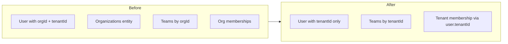

# Tenant-only: Remove organization from code and documentation

## Goal

- **Single scope:** All users and data are linked to a **tenant** (`tenantId`). This is the only isolation boundary.
- **No organization concept:** Remove the organization entity and all `organizationId` / "organization" references in code and docs.
- **Hard cutover:** No transition period; no acceptance of `organizationId` in JWT or APIs.

## High-level flow

---

## 1. Shared layer (source of truth)

**Files:** [containers/shared/src/types/user.types.ts](containers/shared/src/types/user.types.ts), [containers/shared/src/types/user.types.d.ts](containers/shared/src/types/user.types.d.ts), [containers/shared/src/middleware/auth.ts](containers/shared/src/middleware/auth.ts) (and `.js` / `.d.ts`).

- **User interface:** Remove `organizationId`. Keep only `tenantId`. Add JSDoc: *"Users and all platform data are scoped by tenantId."*
- **AuthUser:** Remove `organizationId`. In `mapPayloadToAuthUser`, set only `tenantId` from `payload.tenantId` (no `payload.organizationId` fallback).
- **tenantEnforcementMiddleware:** [containers/shared/src/middleware/tenantEnforcement.ts](containers/shared/src/middleware/tenantEnforcement.ts) already uses only `extractTenantId(request)` (X-Tenant-ID header). Ensure any route that builds tenant context uses only `user.tenantId` (no `user.organizationId` fallback) before or after the middleware.
- **Events:** [containers/shared/src/types/events.types.ts](containers/shared/src/types/events.types.ts) and [EventSchema.ts](containers/shared/src/events/EventSchema.ts) already use only `tenantId`; no change.

---

## 2. User-management: full collapse to tenant

**Containers / data model (see [containers/user-management/architecture.md](containers/user-management/architecture.md)):**

- **user_organizations:** Remove. Optionally introduce a minimal `user_tenant_settings` (partition `/tenantId`) later for display name/settings per tenant; out of scope for this plan unless you want one doc per tenant.
- **user_teams:** Partition key and all fields: `organizationId` → `tenantId`. (Cosmos: changing partition key requires a new container or migration; document "create new container with `/tenantId` and migrate documents.")
- **user_organization_memberships:** Remove. Membership = user belongs to a tenant via `user.tenantId` (and optionally a single `user_tenant_memberships` container keyed by `tenantId` if you need multiple tenants per user later; for full collapse, assume one tenant per user).
- **user_roles, user_tenant_invitations, user_tenant_join_requests:** Already tenant-scoped; ensure no `organizationId` in types or queries.

**Shard-manager / Cosmos bootstrap:**

- Update [containers/shard-manager/config/cosmos-containers.yaml](containers/shard-manager/config/cosmos-containers.yaml): remove `user_organizations` from the container list; ensure `user_teams` uses partition key `/tenantId` (and document migration if documents currently use organizationId). Align any bootstrap/ensure-containers script so it no longer creates org-specific containers.

**Code and routes:**

- **Remove:** [containers/user-management/src/routes/organizations.ts](containers/user-management/src/routes/organizations.ts), [containers/user-management/src/services/OrganizationService.ts](containers/user-management/src/services/OrganizationService.ts), [containers/user-management/src/services/OrganizationSettingsService.ts](containers/user-management/src/services/OrganizationSettingsService.ts) (or merge minimal "tenant settings" into a single service if needed).
- **Replace organizationId with tenantId:** [containers/user-management/src/routes/teams.ts](containers/user-management/src/routes/teams.ts), [containers/user-management/src/routes/roles.ts](containers/user-management/src/routes/roles.ts), [containers/user-management/src/routes/users.ts](containers/user-management/src/routes/users.ts), [containers/user-management/src/routes/invitations.ts](containers/user-management/src/routes/invitations.ts); [TeamService](containers/user-management/src/services/TeamService.ts), [RoleService](containers/user-management/src/services/RoleService.ts), [UserService](containers/user-management/src/services/UserService.ts), [InvitationService](containers/user-management/src/services/InvitationService.ts), [ApiKeyService](containers/user-management/src/services/ApiKeyService.ts); middleware (auth, rbac, tenantMatch); [seedService](containers/user-management/src/services/seedService.ts); event types and publishers.
- **Index / route registration:** Remove organizations from [containers/user-management/src/routes/index.ts](containers/user-management/src/routes/index.ts).
- **OpenAPI:** [containers/user-management/openapi.yaml](containers/user-management/openapi.yaml) — remove organization paths and any `organizationId` in schemas; use `tenantId` only.
- **Tests:** All user-management unit/integration tests that reference organizations or `organizationId`; update fixtures and mocks to tenantId-only.
- **Docs:** [containers/user-management/README.md](containers/user-management/README.md), [containers/user-management/architecture.md](containers/user-management/architecture.md), [containers/user-management/docs/logs-events.md](containers/user-management/docs/logs-events.md), [containers/user-management/docs/notifications-events.md](containers/user-management/docs/notifications-events.md) — remove organization, state that users/teams/roles/invitations are tenant-scoped.
- **Remove Prisma:** Remove `@prisma/client` and prisma scripts from [containers/user-management/package.json](containers/user-management/package.json); runtime is already Cosmos-only.

---

## 3. Auth container

- **Registration:** Registration is **invitation-only**. `tenantId` comes from the invitation (token or invitation record), not from the request body. Remove any registration path that does not require a valid invitation; remove `organizationId` from body and any "default organization" / org lookup logic.
- **Routes:** [containers/auth/src/routes/auth.ts](containers/auth/src/routes/auth.ts) — remove all use of `db.organization`, `db.organizationMembership`, and org-scoped defaults; all tenant context from invitation or session.
- **SAML / SSO:** [containers/auth/src/services/SAMLHandler.ts](containers/auth/src/services/SAMLHandler.ts) — invitation lookup by `tenantId` + email; assign `tenantId` from invitation; remove org-based user creation and `db.organizationMembership`.
- **Sessions / API keys / Cosmos adapter:** [containers/auth/src/services/SessionService.ts](containers/auth/src/services/SessionService.ts), [containers/auth/src/data/cosmosAuthAdapter.ts](containers/auth/src/data/cosmosAuthAdapter.ts) — store and use only `tenantId`; remove organization/membership from adapter or map to tenant. API key and auth middleware — tenantId only.
- **Auth events:** [containers/auth/src/events/publishers/AuthEventPublisher.ts](containers/auth/src/events/publishers/AuthEventPublisher.ts), [containers/auth/src/types/events.ts](containers/auth/src/types/events.ts) — no `organizationId` in payloads.
- **OpenAPI:** [containers/auth/openapi.yaml](containers/auth/openapi.yaml) — remove `organizationId` from request/response schemas.
- **Tests:** Update auth unit/integration tests and mocks to tenantId-only.
- **Remove Prisma:** Auth already uses Cosmos via [containers/auth/src/data/cosmosAuthAdapter.ts](containers/auth/src/data/cosmosAuthAdapter.ts). Remove Prisma from [containers/auth/package.json](containers/auth/package.json) (dependencies and scripts); remove any `prisma/` folder or schema; ready check already uses adapter `$queryRaw`.

---

## 4. API gateway

- [containers/api-gateway/src/middleware/tenantValidation.ts](containers/api-gateway/src/middleware/tenantValidation.ts): Use only `decoded.tenantId` (remove `decoded.organizationId` fallback). Require `tenantId` in token.
- Tests: [containers/api-gateway/tests/unit/middleware/tenantValidation.test.ts](containers/api-gateway/tests/unit/middleware/tenantValidation.test.ts) — drop organizationId cases.

---

## 5. Logging container (Cosmos only; remove Prisma)

- **Remove Prisma and Postgres entirely.** The only database is Cosmos DB. Remove [containers/logging/prisma/schema.prisma](containers/logging/prisma/schema.prisma) and the `prisma/` directory; remove `@prisma/client` and `prisma` from [containers/logging/package.json](containers/logging/package.json) and all `prisma:generate` / `prisma:migrate` / `prisma:push` scripts; remove [containers/logging/src/services/providers/storage/PostgresProvider.ts](containers/logging/src/services/providers/storage/PostgresProvider.ts) and any `postgres` storage provider option.
- **Use only Cosmos** for policies, alerts, checkpoints, configuration, exports, and audit log storage. Logging already has [containers/logging/src/data/cosmos/alert-rules.ts](containers/logging/src/data/cosmos/alert-rules.ts) and [configuration.ts](containers/logging/src/data/cosmos/configuration.ts). Implement or extend Cosmos repositories for retention policies, hash checkpoints, and exports; ensure audit logs use CosmosProvider only. Refactor [RetentionService](containers/logging/src/services/RetentionService.ts), [AlertService](containers/logging/src/services/AlertService.ts), [HashChainService](containers/logging/src/services/HashChainService.ts), [ConfigurationService](containers/logging/src/services/ConfigurationService.ts), [ExportService](containers/logging/src/services/ExportService.ts), [VerificationService](containers/logging/src/services/VerificationService.ts), and jobs ([AlertJob](containers/logging/src/jobs/AlertJob.ts), [RetentionJob](containers/logging/src/jobs/RetentionJob.ts), [ArchiveJob](containers/logging/src/jobs/ArchiveJob.ts)) to take Cosmos repos only (no `PrismaClient`). [PartitionJob](containers/logging/src/jobs/PartitionJob.ts) is Postgres-specific (physical table partitioning); remove it or replace with a Cosmos-only alternative (e.g. TTL or logical partitioning) if needed.
- **Server:** [containers/logging/src/server.ts](containers/logging/src/server.ts) — remove `PrismaClient` import and instantiation; wire services with Cosmos repos only; remove `(fastify as any).prisma`.
- **Field names:** All partition and document fields: `organizationId` → `tenantId` in Cosmos repos and types.
- **Config:** [containers/logging/config/default.yaml](containers/logging/config/default.yaml) and types — remove organizationId; storage provider must be Cosmos (no postgres option).
- **Tests:** Remove mocks for `.prisma/logging-client`; update all logging tests to use Cosmos mocks and tenantId.

---

## 5a. Remove Prisma everywhere (Cosmos DB only)

No part of the system uses Prisma; **Cosmos DB is the only database.**

- **Auth:** See Section 3 — already uses Cosmos via cosmosAuthAdapter; remove Prisma from package.json and any prisma scripts/schema.
- **Logging:** See Section 5 — remove Prisma, PostgresProvider, and all PrismaClient usage; use only Cosmos repos and CosmosProvider for logs.
- **User-management:** [containers/user-management/package.json](containers/user-management/package.json) still lists `@prisma/client` and prisma scripts; remove them. User-management runtime uses Cosmos (getContainer); no Prisma code paths — remove deps and scripts only.
- **Documentation:** Remove Prisma/schema.prisma references (e.g. [documentation/modules/core/notification/SPECIFICATION.md](documentation/modules/core/notification/SPECIFICATION.md), any other docs that mention Prisma or Postgres as a database option). State that the platform uses Cosmos DB only.

---

## 6. Other containers (replace organizationId with tenantId)

- **Notification-manager, utility-services:** Request context, event mappers, preference/resolver services, delivery/template/notification services — use `user.tenantId` or event `tenantId` only; remove organizationId from types and OpenAPI.
- **Secret-management:** Vault/secret types, audit, access control, request context, auth helpers — tenantId only; update tests and fixtures.
- **Dashboard, prompt-service, ai-service, template-service, configuration-service, integration-manager:** Types (e.g. fastify.d.ts), routes, and services that reference organizationId — switch to tenantId.
- **Logging/docs:** [containers/logging/openapi.yaml](containers/logging/openapi.yaml), [containers/logging/docs/](containers/logging/docs/) — remove organization; state tenant isolation.

For each container, grep for `organizationId` and `organization_id` and replace with `tenantId` / `tenant_id` in types, handlers, and tests; ensure JWT/context only expose tenantId.

---

## 7. UI

- Replace every reference to "organization" or `organizationId` with "tenant" / `tenantId` in:
  - [ui/src/app/accept-invitation/page.tsx](ui/src/app/accept-invitation/page.tsx), admin security (roles, users, invitations, api-keys), tenants/new, and any shared types or API client that send/receive organizationId.
- Copy and labels: use "tenant" only (e.g. "Invite user to tenant", "Tenant admin").

---

## 8. Documentation: state tenant-only and remove organization

**Central statement (add or update in one place, e.g. [documentation/global/Architecture.md](documentation/global/Architecture.md) or [documentation/global/ModuleImplementationGuide.md](documentation/global/ModuleImplementationGuide.md)):**

- *"All users and data are scoped by tenant. The partition key for isolation is tenantId. There is no separate organization concept."*

**Then remove or replace every mention of organization across:**

- **Global:** [documentation/global/Infrastructure.md](documentation/global/Infrastructure.md) (partition keys: use only tenantId), [documentation/global/ModuleImplementationGuide.md](documentation/global/ModuleImplementationGuide.md) (events, FKs, examples), [documentation/global/ModuleOverview.md](documentation/global/ModuleOverview.md), [documentation/global/SystemPurpose.md](documentation/global/SystemPurpose.md), [documentation/global/TechnologyStack.md](documentation/global/TechnologyStack.md).
- **Endpoints:** [documentation/endpoints/ENDPOINTS.md](documentation/endpoints/ENDPOINTS.md), [documentation/endpoints/endpoint_templates.md](documentation/endpoints/endpoint_templates.md), [documentation/endpoints/API_RULES.md](documentation/endpoints/API_RULES.md), [documentation/endpoints/questions.md](documentation/endpoints/questions.md).
- **Containers / database:** [documentation/containers/README.md](documentation/containers/README.md), [documentation/containers/user-management.md](documentation/containers/user-management.md), [documentation/containers/logging.md](documentation/containers/logging.md), [documentation/containers/dashboard.md](documentation/containers/dashboard.md), [documentation/database/COSMOS_DB_CONTAINERS_REFERENCE.md](documentation/database/COSMOS_DB_CONTAINERS_REFERENCE.md) — already tenantId in reference; ensure no org wording.
- **Gaps / reorg / other:** [documentation/gaps/](documentation/gaps/) (auth-user-management, ai-integrations, logging, system-wide, ui-pages-inventory), [documentation/reorg/](documentation/reorg/), [documentation/dataflow/dataflow.md](documentation/dataflow/dataflow.md), [documentation/gap-analysis-ui-auth-usermgmt-gateway.md](documentation/gap-analysis-ui-auth-usermgmt-gateway.md), [documentation/modules/core/notification/SPECIFICATION.md](documentation/modules/core/notification/SPECIFICATION.md), [documentation/modules/core/secret-management/SPECIFICATION.md](documentation/modules/core/secret-management/SPECIFICATION.md), [documentation/CURRENT_STATE.md](documentation/CURRENT_STATE.md), [documentation/README.md](documentation/README.md), [documentation/DOCUMENTATION_STATUS.md](documentation/DOCUMENTATION_STATUS.md), [documentation/CONTAINER_PURPOSE_AND_INTEGRATION.md](documentation/CONTAINER_PURPOSE_AND_INTEGRATION.md), [documentation/ui/access-levels.md](documentation/ui/access-levels.md).

Replace "organization" with "tenant" (or remove the sentence) and any `organizationId` with `tenantId` in examples and rules.

---

## 9. Cursor rules and skills

- [.cursorrules](.cursorrules): Already says "prefer tenantId over organizationId"; update to *"Use tenantId only; there is no organization. All users and data are scoped by tenant."*
- **Skills:** [.cursor/skills/](.cursor/skills/) — any skill that mentions organization or organizationId (e.g. validate-tenant-isolation, validate-container-compliance, write-tenant-isolated-queries, migrate-service-to-container, create-container-module): use only tenantId and remove organization references.

---

## 10. Database and config migration notes

- **Cosmos:** Containers that today use `organizationId` as partition key or field (e.g. user_teams, user_organization_memberships, logging policies/alerts/checkpoints/config) must be migrated. **Deliver a runnable migration script** (e.g. `scripts/migrate-organization-to-tenant.ts` or in a suitable container) that: reads affected Cosmos containers/documents, maps organizationId to tenantId (1:1 or via a configurable mapping), and writes to the target container or updates documents (new container with `/tenantId` partition key where required). user_organizations: drop or repurpose as tenant_settings (partition tenantId); script can skip or delete.
- **Env/config:** No `ORGANIZATION_ID` or similar; only `TENANT_ID` / X-Tenant-ID where needed. Check repo and container-level `env.example` / `.env.example` and remove any organization-related variables.
- **JWT:** Issuers must emit only `tenantId`; remove `organizationId` from token payloads (hard cutover).
- **Prisma:** No part of the system uses Prisma; Cosmos DB is the only database. Document Cosmos-only migration in a short migration note (no Prisma/Postgres).

---

## Order of work (suggested)

1. Shared types and auth middleware (single source of truth).
2. API gateway (tenantId only from token).
3. User-management: remove organizations route/service, collapse teams/memberships to tenantId; remove Prisma from package.json.
4. Auth: invitation-only registration; SAML, sessions, API keys, events tenantId only; remove Prisma from package.json and any schema.
5. Logging: remove Prisma and Postgres; Cosmos only; policies, alerts, checkpoints, config, exports — tenantId only.
6. Remaining containers (notification-manager, utility-services, secret-management, dashboard, etc.) — organizationId to tenantId.
7. UI: replace organization with tenant everywhere.
8. Documentation: central statement + sweep all docs; remove Prisma/Postgres mentions.
9. Cursor rules and skills.
10. **Runnable migration script** for existing Cosmos data (organizationId → tenantId); migration note (Cosmos-only, JWT tenantId only); CHANGELOG entries (auth, user-management, logging, api-gateway, shared).

---

## Out of scope (for this plan)

- Multi-tenant-per-user (e.g. `user_tenant_memberships`), optional `user_tenant_settings` container, and any tenant display-name/settings API.

---

## Verification

- Grep codebase for `organizationId`, `organization_id`, and "organization" (excluding unrelated English words) and fix any remaining hits.
- Grep for `prisma`, `Prisma`, `PrismaClient`, `.prisma/`, `prisma/schema` and remove or replace with Cosmos-only code/docs.
- Run full test suite; fix any failing tests that still expect organizationId, organization APIs, or Prisma.
- Confirm OpenAPI specs and docs mention only tenantId and "tenant"; confirm no Prisma/Postgres in docs.

