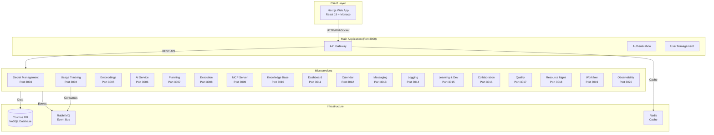

# Coder IDE - System Documentation

Comprehensive documentation for the Coder IDE application, an AI-powered Integrated Development Environment with advanced planning, execution, and project management capabilities.

## System Overview

Coder IDE is a three-tier application architecture:

1. **Next.js Web Application** - React 19 web application (UI container)
2. **Fastify API Server** - RESTful API with microservices architecture
3. **Cosmos DB NoSQL Database** - Shared database with containers per module

**UI Component Reuse**: The Next.js application reuses components and pages from `old_code/apps/web/` to maintain existing UI patterns and functionality.

The system has been refactored into a microservices architecture with 20+ independent services communicating via REST APIs and RabbitMQ event bus.

## Architecture Diagram



## Documentation Structure

### [Core Modules](./modules/core/)
Core modules that are always required for the system to function. Each module consolidates backend, frontend, and microservice documentation.

- [Authentication](./modules/core/authentication/) - User authentication, OAuth, and session management (Port 3021)
- [User Management](./modules/core/user-management/) - User profiles, organizations, teams, RBAC (Port 3022)
- [Logging](./modules/core/logging/) - Audit logging and compliance (Port 3014)
- [Notification](./modules/core/notification/) - Multi-channel notification delivery (Port 3001)
- [Secret Management](./modules/core/secret-management/) - Centralized secret storage (Port 3003)

### [Extension Modules](./modules/extensions/)
Optional extension modules that provide additional functionality. Each module consolidates backend, frontend, and microservice documentation.

- [AI Service](./modules/extensions/ai-service/) - LLM completions and model routing (Port 3006)
- [Embeddings](./modules/extensions/embeddings/) - Vector embeddings and semantic search (Port 3005)
- [Adaptive Learning](./modules/extensions/adaptive-learning/) - CAIS adaptive learning system (Port 3032)
- [ML Service](./modules/extensions/ml-service/) - Machine learning model management (Port 3033)
- [Shard Manager](./modules/extensions/shard-manager/) - Core data model management (Port 3023)
- [Document Manager](./modules/extensions/document-manager/) - Document and file management (Port 3024)
- [Pipeline Manager](./modules/extensions/pipeline-manager/) - Sales pipeline and opportunity management (Port 3025)
- [Integration Manager](./modules/extensions/integration-manager/) - Third-party integrations and webhooks (Port 3026)
- [AI Insights](./modules/extensions/ai-insights/) - AI-powered insights and recommendations (Port 3027)
- [Content Generation](./modules/extensions/content-generation/) - AI-powered content generation (Port 3028)
- [Search Service](./modules/extensions/search-service/) - Advanced search and vector search (Port 3029)
- [Analytics Service](./modules/extensions/analytics-service/) - Analytics and reporting (Port 3030)
- [Collaboration Service](./modules/extensions/collaboration-service/) - Real-time collaboration features (Port 3031)
- [Configuration Service](./modules/extensions/configuration-service/) - Centralized configuration management (Port 3034)
- [Cache Service](./modules/extensions/cache-service/) - Caching and cache management (Port 3035)
- [Prompt Service](./modules/extensions/prompt-service/) - Prompt management and A/B testing (Port 3036)
- [Template Service](./modules/extensions/template-service/) - Template management (Port 3037)
- [Planning](./modules/extensions/planning/) - Planning service with 13 sub-modules (Port 3007)
- [Execution Service](./modules/extensions/execution-service/) - Plan execution engine (Port 3008)
- [MCP Server](./modules/extensions/mcp-server/) - Model Context Protocol server (Port 3009)
- [Knowledge Base](./modules/extensions/knowledge-base/) - Documentation management (Port 3010)
- [Dashboard](./modules/extensions/dashboard/) - Dashboard configuration (Port 3011)
- [Calendar](./modules/extensions/calendar/) - Event management (Port 3012)
- [Messaging](./modules/extensions/messaging/) - Conversations and messaging (Port 3013)
- [Learning & Development](./modules/extensions/learning-development/) - Learning paths (Port 3015)
- [Collaboration](./modules/extensions/collaboration/) - Pairing and innovation (Port 3016)
- [Quality](./modules/extensions/quality/) - Experiments and compliance (Port 3017)
- [Resource Management](./modules/extensions/resource-management/) - Capacity planning (Port 3018)
- [Workflow](./modules/extensions/workflow/) - Workflow orchestration (Port 3019)
- [Observability](./modules/extensions/observability/) - Telemetry and tracing (Port 3020)
- [Prompt Management](./modules/extensions/prompt-management/) - Prompt templates (Port 3002)
- [Usage Tracking](./modules/extensions/usage-tracking/) - Usage metering (Port 3004)
- [Context Service](./modules/extensions/context-service/) - Context orchestration (Port 3034)
- [Agent Registry](./modules/extensions/agent-registry/) - Specialized AI agent management (Port 3035)
- [Validation Engine](./modules/extensions/validation-engine/) - Comprehensive validation pipeline (Port 3036)
- [Pattern Recognition](./modules/extensions/pattern-recognition/) - Pattern learning and enforcement (Port 3037)
- [Migration Service](./modules/extensions/migration-service/) - Code migration and refactoring (Port 3038)
- [Bug Detection](./modules/extensions/bug-detection/) - Proactive bug finding and fixing (Port 3039)
- [Code Generation](./modules/extensions/code-generation/) - Specialized code generation (Port 3040)
- [Performance Optimization](./modules/extensions/performance-optimization/) - Code performance optimization (Port 3041)
- [Security Service](./modules/extensions/security-service/) - Security analysis and protection (Port 3042)
- [Compliance Service](./modules/extensions/compliance-service/) - Regulatory compliance (Port 3043)
- [Multi-Modal Service](./modules/extensions/multi-modal-service/) - Multi-modal understanding (Port 3044)
- [Reasoning Engine](./modules/extensions/reasoning-engine/) - Advanced reasoning capabilities (Port 3045)
- [Developer Experience](./modules/extensions/developer-experience/) - Developer UX optimization (Port 3046)

### [Infrastructure](./global/Infrastructure.md)
Infrastructure components that support the application but are not business logic modules. These are documented in a single consolidated file.

- API Gateway - Single entry point for all API requests
- Database - Database access, migrations, and seed data
- Middleware - Request processing (auth, validation, RBAC, rate limiting)
- Queue System - Message queue infrastructure
- Background Jobs - Scheduled and asynchronous job processing
- Routes - API route definitions
- Services - Shared business logic services
- Utils - Utility functions
- Next.js Web Application - React UI with component reuse from old_code

## Technology Stack

### Frontend
- **Next.js 16**: Web application framework (App Router)
- **React 19**: UI framework
- **Shadcn UI**: Component library
- **TypeScript**: Type safety
- **TanStack Query**: State management and data fetching
- **React Hook Form + Zod**: Form handling and validation
- **Axios**: HTTP client for API communication
- **Component Reuse**: Components and pages from `old_code/apps/web/` are reused

### Backend
- **Fastify**: High-performance web framework
- **Cosmos DB NoSQL**: Document database
- **Azure Cosmos DB SDK**: Database client (@azure/cosmos)
- **Google OAuth 2.0**: Authentication
- **RabbitMQ**: Event-driven communication
- **Redis**: Caching and sessions

### Core Services
- **Planning System**: AI-assisted plan generation
- **Execution Engine**: Automated code execution
- **Context Aggregation**: Advanced code analysis
- **Issue Anticipation**: Proactive issue detection
- **Recommendation Engine**: Personalized suggestions

## Global Documentation

Comprehensive global documentation covering system architecture, purpose, and module overviews:

- [Global Architecture Documentation](./global/README.md) - Complete system overview
  - [Architecture](./global/Architecture.md) - System architecture
  - [Infrastructure](./global/Infrastructure.md) - Infrastructure components (API Gateway, Database, Middleware, etc.)
  - [System Purpose](./global/SystemPurpose.md) - System goals and vision
  - [Module Overview](./global/ModuleOverview.md) - High-level module purposes
  - [Module Implementation Guide](./global/ModuleImplementationGuide.md) - Module development standards
  - [Data Flow](./global/DataFlow.md) - Communication patterns
  - [Technology Stack](./global/TechnologyStack.md) - Technologies used
  - [Deployment](./global/Deployment.md) - Deployment architecture

## Guides

Setup and user guides for getting started with Coder IDE:

- [Setup Guide](./guides/setup-guide.md) - Complete setup instructions
- [Docker Setup Guide](./guides/docker-setup.md) - Containerized deployment
- [Google OAuth Setup](./guides/google-oauth-setup.md) - OAuth configuration
- [Getting Started](./guides/getting-started.md) - User management guide
- [Admin Guide](./guides/admin-guide.md) - Advanced administration
- [Permission Matrix](./guides/permission-matrix.md) - Permission reference

## Specifications

Feature specifications and design documents:

- [Authentication & User Management](./specifications/authentication-user-management.md) - Complete authentication and user management specification
- [SSO & Secrets Management](./specifications/sso-secrets-management-addition.md) - SSO and secrets management additions
- [Collaboration & Organization](./specifications/collaboration-organization.md) - Collaboration features and organization structure

## Planning

Planning documents, questions, and todo items:

- [Questions for Features](./planning/QUESTIONS_FOR_FEATURES.md) - Clarification questions about features
- [Answers](./planning/answers.md) - Answers to feature questions
- [Todo Lists](./planning/) - Active todo items and task tracking

## Archive

Historical documentation and implementation history:

- [Implementation History](./archive/implementation-history/) - Historical implementation reports, status files, and completion summaries
- [Root Status Files](./archive/root-status-files/) - Root-level status and completion reports
- [Architecture (Detailed)](./archive/Architecture-detailed.md) - Detailed architecture document with container specifications

**Note**: The archive contains historical documents preserved for reference. For current documentation, see the sections above.

## Quick Links

- [System Architecture Overview](./global/Architecture.md)
- [Infrastructure Components](./global/Infrastructure.md) - API Gateway, Database, Middleware, etc.
- [Module Overview](./global/ModuleOverview.md) - High-level module purposes and dependencies
- [Module Implementation Guide](./global/ModuleImplementationGuide.md) - Module development standards
- [Core Modules](./modules/core/) - Core module documentation
- [Extension Modules](./modules/extensions/) - Extension module documentation
- [Documentation Status](./DOCUMENTATION_STATUS.md)
- [Expansion Summary](./EXPANSION_SUMMARY.md)

## Documentation Status

All modules have been expanded with comprehensive documentation:

- ✅ **12 modules** with detailed documentation (architecture, API, examples)
- ✅ **73 modules** with expanded README files
- ✅ **85+ total modules** documented
- ✅ **10 modules** with detailed SPECIFICATION.md files
- ✅ **6 setup and user guides** in `guides/` folder
- ✅ **3 feature specifications** in `specifications/` folder
- ✅ **Planning documents** in `planning/` folder
- ✅ **Historical archive** with implementation history
- ✅ Architecture diagrams (Mermaid) for all modules
- ✅ Cross-references between related modules

See [EXPANSION_SUMMARY.md](./EXPANSION_SUMMARY.md) and [CONSOLIDATION_SUMMARY.md](./CONSOLIDATION_SUMMARY.md) for details.

## Documentation Organization

This documentation is organized as follows:

```
documentation/
├── README.md                    # This file - main index
├── modules/                     # Module documentation
│   ├── core/                    # Core modules (always required)
│   │   ├── authentication/     # Consolidated auth docs (backend + frontend + microservice)
│   │   ├── user-management/    # Consolidated user mgmt docs
│   │   ├── logging/            # Consolidated logging docs
│   │   ├── notification/      # Consolidated notification docs
│   │   └── secret-management/  # Consolidated secret mgmt docs
│   └── extensions/              # Extension modules (optional)
│       ├── ai-service/          # Consolidated AI service docs
│       ├── planning/            # Consolidated planning docs
│       └── [other extensions]   # Other extension modules
├── global/                      # Global architecture and system documentation
│   ├── Infrastructure.md       # Infrastructure components (consolidated)
│   ├── ModuleOverview.md        # High-level module overview
│   └── ModuleImplementationGuide.md  # Module development standards
├── guides/                      # Setup and user guides
├── specifications/              # Feature specifications and design documents
├── planning/                    # Planning documents, questions, and todos
├── archive/                     # Historical documentation
│   ├── implementation-history/  # Historical implementation reports
│   ├── root-status-files/       # Root-level status files
│   └── Architecture-detailed.md  # Detailed architecture document
└── [status files]               # Documentation status and summaries
```

**Single Source of Truth**: All active documentation is in the `documentation/` folder. Historical documents are preserved in `archive/` for reference.

## Contributing

This documentation is automatically generated and maintained. For questions or issues, please contact the maintainers.
