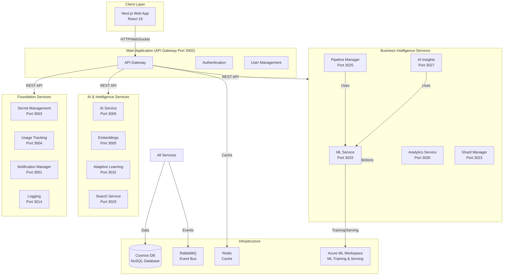

# Castiel - System Documentation

Comprehensive documentation for the Castiel platform, an AI-native business intelligence platform that unifies business data from multiple sources and provides intelligent, predictive insights to help businesses make better decisions.

## System Overview

Castiel is a three-tier application architecture:

1. **Next.js Web Application** - React 19 web application (UI container)
2. **Fastify API Server** - RESTful API with microservices architecture
3. **Cosmos DB NoSQL Database** - Shared database with containers per module

The system has been refactored into a microservices architecture with **~45–50** substantive service containers (under `containers/`; excludes minimal stubs) communicating via REST APIs and RabbitMQ event bus.

## Critical ML Enhancement

The platform is being enhanced with a **Machine Learning system** focused on three priority use cases that provide the highest business value:

1. **Risk Scoring** - ML-powered risk prediction to identify opportunities at risk
2. **Revenue Forecasting** - Predictive revenue forecasting across multiple levels
3. **Recommendations** - Intelligent next-best-action recommendations

This ML enhancement transforms the platform from reactive (analyzing what happened) to predictive (anticipating what will happen), enabling businesses to proactively identify risks, forecast revenue accurately, and make data-driven decisions.

The system uses a **Compound AI System (CAIS)** architecture that orchestrates ML models, LLMs, rules, memory, and feedback loops to deliver explainable, actionable intelligence.

## Architecture Diagram



## Documentation Structure

### [Containers](./containers/README.md) (source of truth for runtime services)

Single source of truth for all runtime containers: integration overview, container list with ports, purpose and integration by category, and **detailed full-spec docs per container** (reference, architecture, deployment, security, links).

- **[Containers index](./containers/README.md)** – Main file: every container described with purpose, dependencies, storage, events; links to per-container docs.
- **Per-container docs** – One file per service (e.g. [api-gateway](./containers/api-gateway.md), [auth](./containers/auth.md), [shard-manager](./containers/shard-manager.md), [risk-analytics](./containers/risk-analytics.md), [ui](./containers/ui.md), etc.) with full spec: config, API, events, Cosmos, deployment, tenant isolation.

See also: [UI Container Architecture](./UI_CONTAINER_ARCHITECTURE.md), [Documentation Status](./DOCUMENTATION_STATUS.md), [Platform services clarification](./clarification.md).

---

### [Infrastructure](./global/Infrastructure.md)
Infrastructure components that support the application but are not business logic modules. These are documented in a single consolidated file.

- API Gateway - Single entry point for all API requests
- Database - Database access, migrations, and seed data
- Middleware - Request processing (auth, validation, RBAC, rate limiting)
- Queue System - Message queue infrastructure
- Background Jobs - Scheduled and asynchronous job processing
- Routes - API route definitions
- Services - Shared business logic services
- Utils - Utility functions
- Next.js Web Application - React UI

## Technology Stack

### Frontend
- **Next.js 16**: Web application framework (App Router)
- **React 19**: UI framework
- **Shadcn UI**: Component library
- **TypeScript**: Type safety
- **TanStack Query**: State management and data fetching
- **React Hook Form + Zod**: Form handling and validation
- **Axios**: HTTP client for API communication

### Backend
- **Fastify**: High-performance web framework
- **Cosmos DB NoSQL**: Document database
- **Azure Cosmos DB SDK**: Database client (@azure/cosmos)
- **Google OAuth 2.0**: Authentication
- **RabbitMQ**: Event-driven communication
- **Redis**: Caching and sessions

### Machine Learning
- **Azure ML Workspace**: Managed ML training and model management
- **Azure ML Managed Endpoints**: Model serving infrastructure
- **AutoML**: Automated model selection and training
- **XGBoost/LightGBM**: ML models for predictions

### Core Capabilities
- **Compound AI System (CAIS)**: Orchestrates ML + LLM + Rules + Memory + Feedback
- **Risk Scoring**: ML-powered risk prediction for opportunities
- **Revenue Forecasting**: Predictive revenue forecasting at multiple levels
- **Recommendations**: Intelligent next-best-action recommendations
- **Data Unification**: Integrates data from Salesforce, Google Drive, Slack, Zoom, Gong, Microsoft 365, and more

## Global Documentation

Comprehensive global documentation covering system architecture, purpose, and module overviews:

- [Global Architecture Documentation](./global/README.md) - Complete system overview
  - [Architecture](./global/Architecture.md) - System architecture
  - [CAIS Overview](./global/CAIS_OVERVIEW.md) - Compound AI System architecture
  - [Infrastructure](./global/Infrastructure.md) - Infrastructure components (API Gateway, Database, Middleware, etc.)
  - [System Purpose](./global/SystemPurpose.md) - System goals and vision
  - [Module Overview](./global/ModuleOverview.md) - High-level module purposes
  - [Module Implementation Guide](./global/ModuleImplementationGuide.md) - Module development standards
  - [Data Flow](./global/DataFlow.md) - Communication patterns
  - [Technology Stack](./global/TechnologyStack.md) - Technologies used
  - [Deployment](./global/Deployment.md) - Deployment architecture

## Guides

Setup and user guides for getting started with Castiel:

- [Setup Guide](./guides/setup-guide.md) - Complete setup instructions
- [Docker Setup Guide](./guides/docker-setup.md) - Containerized deployment
- [Google OAuth Setup](./guides/google-oauth-setup.md) - OAuth configuration
- [Getting Started](./guides/getting-started.md) - User management guide
- [Admin Guide](./guides/admin-guide.md) - Advanced administration
- [Permission Matrix](./guides/permission-matrix.md) - Permission reference

## Quick Links

- **[Containers (all services)](./containers/README.md)** - Container index and per-container full-spec docs
- [System Architecture Overview](./global/Architecture.md)
- [CAIS Architecture](./global/CAIS_OVERVIEW.md) - Compound AI System overview
- [Infrastructure Components](./global/Infrastructure.md) - API Gateway, Database, Middleware, etc.
- [Module Overview](./global/ModuleOverview.md) - High-level module purposes and dependencies
- [Module Implementation Guide](./global/ModuleImplementationGuide.md) - Module development standards
- [Documentation Status](./DOCUMENTATION_STATUS.md)
- [UI Container Architecture](./UI_CONTAINER_ARCHITECTURE.md)
- [Archive (historical summaries)](./archive/) - Consolidation, expansion, reorganization summaries

## Documentation Status

- ✅ **Containers** – [containers/README.md](./containers/README.md) (index) and one full-spec file per container
- ✅ **Global** – Architecture, CAIS, ModuleImplementationGuide, DataFlow, Deployment, etc. in [global/](./global/)
- ✅ **Guides** – Setup, Docker, OAuth, admin, permissions in [guides/](./guides/)
- ✅ **Database** – [Cosmos DB reference](./database/COSMOS_DB_CONTAINERS_REFERENCE.md)
- ✅ **Business** – Plan, progress, status in [business/](./business/)

See [DOCUMENTATION_STATUS.md](./DOCUMENTATION_STATUS.md) for full structure. Historical summaries are in [archive/](./archive/).

## Documentation Organization

This documentation is organized as follows:

```
documentation/
├── README.md                    # This file - main index
├── containers/                  # Container documentation (source of truth for services)
│   ├── README.md                # Main file: all containers, categories, integration, ports
│   └── *.md                     # One full-spec file per container (e.g. api-gateway.md, auth.md)
├── global/                      # Global architecture and system documentation
│   ├── CAIS_OVERVIEW.md         # Compound AI System overview
│   ├── Architecture.md         # System architecture
│   ├── Infrastructure.md       # Infrastructure components
│   ├── ModuleOverview.md       # High-level module overview
│   └── ModuleImplementationGuide.md  # Module development standards
├── database/                    # Cosmos DB reference
├── guides/                      # Setup and user guides
├── integrations/                # Integration docs (e.g. secret-management usage)
├── business/                    # Business plan, progress, status, team
├── archive/                     # Historical summaries (consolidation, expansion, reorganization)
├── DOCUMENTATION_STATUS.md      # Current structure and maintenance
└── UI_CONTAINER_ARCHITECTURE.md # UI-specific architecture
```

**Single Source of Truth**: Container list and service details are in `documentation/containers/`. All active documentation is in the `documentation/` folder.

## Contributing

This documentation is automatically generated and maintained. For questions or issues, please contact the maintainers.
