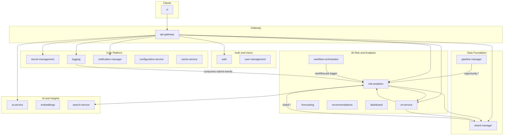

# Castiel Containers

Single source of truth for all runtime containers: purpose, integration, and links to detailed per-container docs.

---

## 1. Integration Overview

- **Entry point:** All client traffic goes through the **API Gateway** (default port 3002). The gateway validates JWT, enforces tenant (X-Tenant-ID), applies rate limiting, and routes requests to backend services using **config-driven URLs** (no hardcoded addresses).
- **Service-to-service:** Containers call each other via HTTP using **ServiceClient** from `@coder/shared`, with URLs from `config/default.yaml` or environment variables. Circuit breakers and retries are used where applicable.
- **Events:** **RabbitMQ** is the only message broker. Containers publish and consume domain events (e.g. `risk.evaluation.completed`, `shard.updated`, `workflow.job.trigger`). Event payloads include `tenantId`, `source`, and `data`.
- **Data:** Azure Cosmos DB (shared database `castiel`) with **tenantId** as partition key for tenant isolation. Redis is used for caching and sessions where configured.
- **Shared library:** All containers use **@coder/shared** for database client, events, auth, middleware, and types. The `containers/shared` package is this library (build-time only; not a runtime service).

---

## 2. Container List and Ports (from docker-compose)

| Container | Host Port | Path | Detailed doc |
|-----------|-----------|------|--------------|
| adaptive-learning | 3032 | `containers/adaptive-learning/` | [adaptive-learning.md](./adaptive-learning.md) |
| ai-analytics | 3057 | `containers/ai-analytics/` | [ai-analytics.md](./ai-analytics.md) |
| ai-conversation | 3045 | `containers/ai-conversation/` | [ai-conversation.md](./ai-conversation.md) |
| ai-insights | 3027 | `containers/ai-insights/` | [ai-insights.md](./ai-insights.md) |
| ai-service | 3006 | `containers/ai-service/` | [ai-service.md](./ai-service.md) |
| analytics-service | 3030 | `containers/analytics-service/` | [analytics-service.md](./analytics-service.md) |
| api-gateway | 3002 | `containers/api-gateway/` | [api-gateway.md](./api-gateway.md) |
| auth | 3021 | `containers/auth/` | [auth.md](./auth.md) |
| cache-service | 3035 | `containers/cache-service/` | [cache-service.md](./cache-service.md) |
| collaboration-service | 3031 | `containers/collaboration-service/` | [collaboration-service.md](./collaboration-service.md) |
| configuration-service | 3034 | `containers/configuration-service/` | [configuration-service.md](./configuration-service.md) |
| content-generation | 3028 | `containers/content-generation/` | [content-generation.md](./content-generation.md) |
| context-service | 3134 | `containers/context-service/` | [context-service.md](./context-service.md) |
| dashboard | 3011 | `containers/dashboard/` | [dashboard.md](./dashboard.md) |
| data-enrichment | 3046 | `containers/data-enrichment/` | [data-enrichment.md](./data-enrichment.md) |
| document-manager | 3024 | `containers/document-manager/` | [document-manager.md](./document-manager.md) |
| embeddings | 3005 | `containers/embeddings/` | [embeddings.md](./embeddings.md) |
| forecasting | 3050 | `containers/forecasting/` | [forecasting.md](./forecasting.md) |
| integration-manager | 3026 | `containers/integration-manager/` | [integration-manager.md](./integration-manager.md) |
| integration-processors | (light/heavy) | `containers/integration-processors/` | [integration-processors.md](./integration-processors.md) |
| integration-sync | 3052 | `containers/integration-sync/` | [integration-sync.md](./integration-sync.md) |
| learning-service | 3063 | `containers/learning-service/` | [learning-service.md](./learning-service.md) |
| llm-service | 3062 | `containers/llm-service/` | [llm-service.md](./llm-service.md) |
| logging | 3014 | `containers/logging/` | [logging.md](./logging.md) |
| ml-service | 3033 | `containers/ml-service/` | [ml-service.md](./ml-service.md) |
| multi-modal-service | 3044 | `containers/multi-modal-service/` | [multi-modal-service.md](./multi-modal-service.md) |
| notification-manager | 3015 | `containers/notification-manager/` | [notification-manager.md](./notification-manager.md) |
| pattern-recognition | 3137 | `containers/pattern-recognition/` | [pattern-recognition.md](./pattern-recognition.md) |
| pipeline-manager | 3025 | `containers/pipeline-manager/` | [pipeline-manager.md](./pipeline-manager.md) |
| prompt-service | 3036 | `containers/prompt-service/` | [prompt-service.md](./prompt-service.md) |
| quality-monitoring | 3060 | `containers/quality-monitoring/` | [quality-monitoring.md](./quality-monitoring.md) |
| reasoning-engine | 3145 | `containers/reasoning-engine/` | [reasoning-engine.md](./reasoning-engine.md) |
| recommendations | 3049 | `containers/recommendations/` | [recommendations.md](./recommendations.md) |
| risk-analytics | 3048 | `containers/risk-analytics/` | [risk-analytics.md](./risk-analytics.md) |
| risk-catalog | 3047 | `containers/risk-catalog/` | [risk-catalog.md](./risk-catalog.md) |
| search-service | 3029 | `containers/search-service/` | [search-service.md](./search-service.md) |
| secret-management | 3003 | `containers/secret-management/` | [secret-management.md](./secret-management.md) |
| security-scanning | 3054 | `containers/security-scanning/` | [security-scanning.md](./security-scanning.md) |
| shard-manager | 3023 | `containers/shard-manager/` | [shard-manager.md](./shard-manager.md) |
| signal-intelligence | 3059 | `containers/signal-intelligence/` | [signal-intelligence.md](./signal-intelligence.md) |
| template-service | 3037 | `containers/template-service/` | [template-service.md](./template-service.md) |
| user-management | 3022 | `containers/user-management/` | [user-management.md](./user-management.md) |
| utility-services | 3061 | `containers/utility-services/` | [utility-services.md](./utility-services.md) |
| validation-engine | 3136 | `containers/validation-engine/` | [validation-engine.md](./validation-engine.md) |
| web-search | 3056 | `containers/web-search/` | [web-search.md](./web-search.md) |
| workflow-orchestrator | 3051 | `containers/workflow-orchestrator/` | [workflow-orchestrator.md](./workflow-orchestrator.md) |
| ui | 3000 | `containers/ui/` | [ui.md](./ui.md) |

---

## 3. Containers by Category

### 3.1 Entry and Gateway

| Container | Purpose | Key dependencies | Storage | Events | Doc |
|-----------|---------|------------------|---------|--------|-----|
| **api-gateway** | Single entry point: JWT validation, tenant injection (X-Tenant-ID), rate limiting, route proxying to backend services. | Proxies to auth, user-management, secret-management, logging, notification-manager, ai-service, embeddings, dashboard, risk-analytics, risk-catalog, recommendations, integration-manager, integration-processors, ml-service, configuration-service, adaptive-learning. All URLs from config. | — | — | [api-gateway.md](./api-gateway.md) |
| **ui** | Next.js 16 web app (App Router, React 19): dashboards, admin, analytics, risk views, auth flows. | Calls API Gateway only (`NEXT_PUBLIC_API_BASE_URL`). | — | — | [ui.md](./ui.md) |

### 3.2 Authentication and User Management

| Container | Purpose | Key dependencies | Storage | Events | Doc |
|-----------|---------|------------------|---------|--------|-----|
| **auth** | User authentication: email/password, Google/GitHub OAuth, SAML/SSO, JWT issue/refresh, sessions, MFA, password reset. | user-management, notification-manager, secret-management | Cosmos DB (auth_*) | Publishes to RabbitMQ; notification-manager consumes (e.g. password reset, verification) | [auth.md](./auth.md) |
| **user-management** | User profiles, organizations, teams, RBAC, invitations, memberships, user analytics. | auth, logging, notification-manager, secret-management | Cosmos DB (user_*) | Publishes lifecycle events | [user-management.md](./user-management.md) |

### 3.3 Core Platform Services

| Container | Purpose | Key dependencies | Storage | Events | Doc |
|-----------|---------|------------------|---------|--------|-----|
| **secret-management** | Centralized secrets: encryption, RBAC, rotation, versioning, multi-backend (e.g. Azure Key Vault). | user-management, logging, notification-manager | Cosmos DB + backend vaults | Notifications via RabbitMQ; logging for audit | [secret-management.md](./secret-management.md) |
| **logging** | Audit logging: tamper-evident logs, retention, redaction, compliance. DataLakeCollector and MLAuditConsumer for BI Risk (Parquet + ML audit blobs). | (event consumer) | Cosmos DB (audit_*); optional Azure Data Lake | Consumes risk.evaluated, ml.prediction.completed, auth.#, user.#, etc. | [logging.md](./logging.md) |
| **notification-manager** | Multi-channel notifications: in-app, email (SendGrid/SMTP/SES). Event-driven from RabbitMQ. | user-management, secret-management, logging | Cosmos DB for notification state | Consumes auth emails, anomaly.detected, etc. | [notification-manager.md](./notification-manager.md) |
| **configuration-service** | Centralized configuration storage and retrieval (tenant-scoped). | logging, context-service, quality-monitoring | Cosmos DB (configuration_settings) | — | [configuration-service.md](./configuration-service.md) |
| **cache-service** | Cache administration: stats, clear, warm. Uses Redis. | logging, embeddings | Redis | — | [cache-service.md](./cache-service.md) |

### 3.4 BI Risk and Analytics

| Container | Purpose | Key dependencies | Storage | Events | Doc |
|-----------|---------|------------------|---------|--------|-----|
| **risk-analytics** | Risk evaluation, revenue-at-risk, quotas, early warning, benchmarking, simulations, data quality, explainability. BatchJobWorker runs risk-snapshot-backfill, outcome-sync, industry-benchmarks, risk-clustering, account-health, propagation, model-monitoring. | ml-service, search-service (optional), shard-manager | Cosmos DB (risk_*) | Publishes risk.evaluation.completed, revenue-at-risk.calculated, etc.; consumes opportunity.updated, shard.*, risk.catalog.*, workflow.job.trigger, integration.opportunity.updated, integration.sync.completed, opportunity.outcome.recorded | [risk-analytics.md](./risk-analytics.md) |
| **risk-catalog** | Global, industry, and tenant-specific risk catalog (risk types, definitions). | shard-manager | Cosmos DB | Publishes catalog updates; risk-analytics consumes | [risk-catalog.md](./risk-catalog.md) |
| **ml-service** | ML model management, feature store, training jobs, predictions: win probability, risk scoring, LSTM risk trajectory, anomaly, revenue forecasting, recommendations. Azure ML Managed Endpoints when configured. | shard-manager, risk-analytics, ai-service | Cosmos DB (ml_*) | Publishes ml.prediction.completed; logging consumes | [ml-service.md](./ml-service.md) |
| **forecasting** | Forecast decomposition, consensus, commitment, pipeline health. Risk-adjusted and ML forecasts (calls risk-analytics and ml-service). | risk-analytics, ml-service, pipeline-manager | Cosmos DB (forecast_*) | Publishes forecast.completed; recommendations consumes | [forecasting.md](./forecasting.md) |
| **recommendations** | Mitigation ranking, remediation workflows, next-best-action. | risk-analytics, ml-service, shard-manager, adaptive-learning | Cosmos DB (recommendations_data) | Consumes opportunity.updated, integration.opportunity.updated, risk.evaluation.completed, forecast.completed, shard.updated, workflow.recommendation.requested | [recommendations.md](./recommendations.md) |
| **dashboard** | Dashboard CRUD, widget management, organization-scoped dashboards; executive/manager/board views, prioritized opportunities, portfolio drill-down. | risk-analytics, forecasting, analytics-service, shard-manager, cache-service | Cosmos DB | — | [dashboard.md](./dashboard.md) |
| **workflow-orchestrator** | Batch job scheduler (node-cron): publishes workflow.job.trigger to queue bi_batch_jobs. HITL approvals, workflow execution. | risk-analytics (BatchJobWorker consumes) | Cosmos DB (workflow_*, hitl_approvals) | Publishes workflow.job.trigger (risk-snapshot-backfill, outcome-sync, industry-benchmarks, risk-clustering, account-health, propagation, model-monitoring); consumes shard.updated, integration.opportunity.updated | [workflow-orchestrator.md](./workflow-orchestrator.md) |

### 3.5 Data Foundation (Shards and Pipeline)

| Container | Purpose | Key dependencies | Storage | Events | Doc |
|-----------|---------|------------------|---------|--------|-----|
| **shard-manager** | Core data model: shards (e.g. c_opportunity, c_account, c_contact), shard types, relationships, edges, linking, versioning. | logging, user-management | Cosmos DB (shard_*) | Publishes shard.created, shard.updated; consumed by risk-analytics, data-enrichment, integration-processors, workflow-orchestrator, recommendations | [shard-manager.md](./shard-manager.md) |
| **pipeline-manager** | Sales pipeline and opportunity management: pipeline views, opportunity CRUD, pipeline analytics, opportunity auto-linking to shards. | shard-manager, logging, user-management | Cosmos DB (pipeline_opportunities, pipeline_views) | Publishes opportunity.created, opportunity.updated, opportunity.deleted | [pipeline-manager.md](./pipeline-manager.md) |

### 3.6 AI and Insights

| Container | Purpose | Key dependencies | Storage | Events | Doc |
|-----------|---------|------------------|---------|--------|-----|
| **ai-service** | Centralized LLM completions (OpenAI, Anthropic, Ollama), model routing, agents, completion tracking. | secret-management, logging, shard-manager, embeddings | Cosmos DB (insights, prompts) | Publishes for usage tracking | [ai-service.md](./ai-service.md) |
| **ai-insights** | AI-powered insights, proactive/collaborative insights, risk analysis (evaluate, catalog, revenue-at-risk, early warnings). | ai-service, shard-manager, embeddings, logging | Cosmos DB (ai_insights, ai_risk_analysis) | — | [ai-insights.md](./ai-insights.md) |
| **embeddings** | Vector embeddings store and semantic search. For shard embeddings see data-enrichment. | ai-service, logging | PostgreSQL pgvector / Cosmos per deployment | — | [embeddings.md](./embeddings.md) |
| **search-service** | Vector + keyword hybrid search, advanced search, search analytics. risk-analytics calls for similar-opportunity search when configured. | embeddings, shard-manager, logging | Cosmos DB (search_queries, search_analytics) | — | [search-service.md](./search-service.md) |
| **adaptive-learning** | CAIS adaptive learning: component weights, model selection, signal weighting, outcome collection, performance tracking, rollout. | ai-service, ml-service, logging | Cosmos DB (adaptive_*) | RabbitMQ | [adaptive-learning.md](./adaptive-learning.md) |
| **reasoning-engine** | Advanced reasoning: chain-of-thought, tree-of-thought, analogical, counterfactual, causal. | ai-service, prompt-service | Cosmos DB (reasoning_tasks) | — | [reasoning-engine.md](./reasoning-engine.md) |
| **llm-service** | LLM reasoning layer: explain, recommendations, scenarios, summary, playbook. | — | Cosmos DB (llm_outputs) | Publishes llm.reasoning.requested/completed/failed | [llm-service.md](./llm-service.md) |
| **learning-service** | Feedback loop: record feedback and outcomes, aggregate, satisfaction, trends. | — | Cosmos DB (user_feedback, outcome) | Publishes feedback.recorded, outcome.recorded, feedback.trend.alert | [learning-service.md](./learning-service.md) |
| **ai-conversation** | AI conversation and context: conversations, messages, context assembly, grounding, intent analysis, citation. | ai-service, context-service, shard-manager, embeddings, search-service | Cosmos DB (conversation_*) | RabbitMQ | [ai-conversation.md](./ai-conversation.md) |
| **ai-analytics** | AI usage analytics, chat catalog, AI config, model seeding, proactive insights, feedback learning. | ai-service, ai-insights, analytics-service | Cosmos DB | RabbitMQ | [ai-analytics.md](./ai-analytics.md) |

### 3.7 Integrations and Sync

| Container | Purpose | Key dependencies | Storage | Events | Doc |
|-----------|---------|------------------|---------|--------|-----|
| **integration-manager** | Third-party integrations and webhooks: CRUD, sync tasks, adapter catalog (e.g. NewsAPI, Alpha Vantage). | shard-manager, logging, user-management, secret-management | Cosmos DB (integration_*) | Publishes integration.*, webhook.*, sync.task.completed | [integration-manager.md](./integration-manager.md) |
| **integration-sync** | Sync task execution, bidirectional sync, conflict resolution, adapter orchestration. Publishes integration data to RabbitMQ. | integration-manager, secret-management, shard-manager | Cosmos DB | Publishes integration.opportunity.updated, integration.sync.completed; integration-processors and risk-analytics consume | [integration-sync.md](./integration-sync.md) |
| **integration-processors** | Multi-modal integration data processing: CRM mapping, documents, emails, messages, meetings, calendar. Consumes integration.data.raw, applies mappings, writes shards. | shard-manager, integration-manager | Writes to shard-manager (Cosmos); Azure Blob for files | Consumes integration.data.raw; CONSUMER_TYPE light/heavy | [integration-processors.md](./integration-processors.md) |

### 3.8 Content, Documents, and Collaboration

| Container | Purpose | Key dependencies | Storage | Events | Doc |
|-----------|---------|------------------|---------|--------|-----|
| **document-manager** | Document and file management: upload/download, Azure Blob Storage, collections, templates, versioning. | shard-manager, logging, user-management | Cosmos DB (document_*); Azure Blob | RabbitMQ | [document-manager.md](./document-manager.md) |
| **content-generation** | AI-powered content generation from templates. | ai-service, shard-manager, logging | Cosmos DB (content_generation_jobs) | — | [content-generation.md](./content-generation.md) |
| **template-service** | Template CRUD: context, email, document templates. | ai-service, logging | Cosmos DB (template_*) | — | [template-service.md](./template-service.md) |
| **collaboration-service** | Real-time collaboration: conversations, messages; collaboration insights. | shard-manager, logging, user-management, notification-manager, ai-insights | Cosmos DB (collaboration_*) | — | [collaboration-service.md](./collaboration-service.md) |
| **data-enrichment** | Enrichment and vectorization: entity extraction, classification, summarization, shard embeddings (ShardEmbeddingService). | shard-manager, embeddings, ai-service | Cosmos DB | Consumes shard.created, shard.updated; publishes enrichment.job.completed, vectorization.completed | [data-enrichment.md](./data-enrichment.md) |

### 3.9 Security, Quality, and Validation

| Container | Purpose | Key dependencies | Storage | Events | Doc |
|-----------|---------|------------------|---------|--------|-----|
| **security-scanning** | PII detection/redaction, field-level security, device tracking, password history, rate limiting. | secret-management, shard-manager | Cosmos DB (security_*) | RabbitMQ | [security-scanning.md](./security-scanning.md) |
| **quality-monitoring** | Anomaly detection, explanation quality, explainable AI, data quality validation. | ai-service, ml-service, analytics-service | Cosmos DB | RabbitMQ | [quality-monitoring.md](./quality-monitoring.md) |
| **validation-engine** | Validation: syntax, semantic, architecture, security, performance, consistency; rule management. | quality-monitoring, context-service | Cosmos DB (validation_engine_*) | — | [validation-engine.md](./validation-engine.md) |

### 3.10 Analytics, Signals, and Utilities

| Container | Purpose | Key dependencies | Storage | Events | Doc |
|-----------|---------|------------------|---------|--------|-----|
| **analytics-service** | Analytics and reporting: general metrics, project analytics, AI analytics, API performance. | shard-manager, logging, user-management, ai-service, ml-service, integration-manager | Cosmos DB (analytics_*) | Consumes usage/events | [analytics-service.md](./analytics-service.md) |
| **signal-intelligence** | Communication analysis, calendar intelligence, social signals, product usage, competitive intelligence, customer success. | ai-service, analytics-service, integration-manager | Cosmos DB (signal_*) | RabbitMQ | [signal-intelligence.md](./signal-intelligence.md) |
| **pattern-recognition** | Codebase pattern learning, style consistency, design/anti-pattern detection, pattern scanning. | context-service, embeddings, quality-monitoring | Cosmos DB (pattern_recognition_*) | — | [pattern-recognition.md](./pattern-recognition.md) |
| **utility-services** | Import/export, schema migrations, computed fields, field validation, user onboarding, project activity, service registry. | auth, user-management | Cosmos DB (utility_*) | Publishes utility.import.completed, utility.export.completed, utility.migration.completed | [utility-services.md](./utility-services.md) |
| **prompt-service** | Prompt CRUD, A/B testing, prompt analytics. | ai-service, logging | Cosmos DB (prompt_*) | — | [prompt-service.md](./prompt-service.md) |
| **context-service** | Context management: storage, AST, dependency trees, call graphs, context assembly, token budgeting. | embeddings, ai-service, shard-manager, search-service, cache-service | Cosmos DB (context_service_*) | — | [context-service.md](./context-service.md) |
| **web-search** | Web search integration, result caching, context for AI. | ai-service, context-service, embeddings | Cosmos DB (web_search_*) | RabbitMQ | [web-search.md](./web-search.md) |
| **multi-modal-service** | Multi-modal inputs: image/diagram/audio/video understanding, OCR, code generation from visuals. | ai-service, context-service | Cosmos DB (multimodal_jobs) | — | [multi-modal-service.md](./multi-modal-service.md) |

---

## 4. Summary Diagram

---

## 5. Related Documentation

- [Module Implementation Guide](../global/ModuleImplementationGuide.md) – Implementation standards
- [Architecture](../global/Architecture.md) – System architecture
- [Data Flow](../global/DataFlow.md) – Communication patterns
- [UI Container Architecture](../UI_CONTAINER_ARCHITECTURE.md) – UI-specific architecture
- [Cosmos DB Containers Reference](../database/COSMOS_DB_CONTAINERS_REFERENCE.md) – Database containers
- [Platform services clarification](../clarification.md) – Short overview of key services and migration

Per-container: see each container’s [README](../../containers/), [openapi.yaml](../../containers/), and [config/default.yaml](../../containers/) in the repo.
