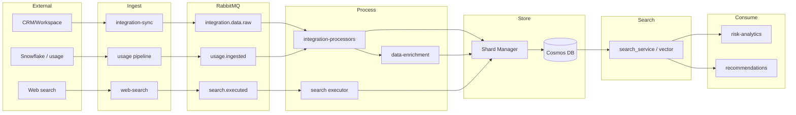

# Data Flow: Integrations, Detection, Risk Analysis & Recommendations

This document describes how integration data flows through the platform, how detection and enrichment are applied, where results are stored, and how risk analysis and recommendations consume that data.

---

## 1. Overview

- **Integrations** fetch raw data from external systems; data is published to RabbitMQ and processed into **shards** (Cosmos DB via Shard Manager).
- **Shard document shape:** Each shard has four top-level sections: **`structuredData`**, **`unstructuredData`**, **`enrichmentData`**, and **`metadata`**. Detection results are stored in **`enrichmentData`** (not inside unstructuredData).
- **Detection and enrichment** (sentiment, competitor, entity extraction, key phrases, classification, action items, deal signals, key moments, summarization, plus optional urgency, objections, commitments, stakeholders, intent, engagement, themes) run per shard when enabled by **tenant admin** and write results to **`shard.enrichmentData`**.
- **Usage data** (product/customer usage) is ingested mainly from **Snowflake or custom integrations** and stored in a dedicated shard type **`c_usage`**; risk and recommendations load **c_usage** shards (via relationship or vector search) when policy allows.
- **Search data:** All searches (web search, on-demand or recurring) must be **stored as shards**. A dedicated shard type **`c_search`** is used for this. Risk and recommendations use **c_search** shards via **vector search** when policy allows.
- **Policy** controls (1) which analyses run per shard type per tenant, and (2) which shard types may feed **risk analysis** and **recommendation generation**.
- **Security:** All flows enforce **tenantId**; **enrichmentData** and c_usage may contain PII—apply access control and audit logging.
- **Risk** and **recommendations** use **vector search** (e.g. search_service) to find related shards (including **c_usage** and **c_search**) and may also consume **web search**–sourced content (external content that is vectorized and retrieved via vector search). They read **`shard.enrichmentData`**, **c_usage**, and **c_search** shards per policy.
- **Win patterns** (similar won deals, outcome-linked activity, recommendation→outcome learning) drive “actions to increase probability to win.”

- **Chain-of-thought (reasoning)** is provided by **reasoning-engine** and used to improve risk explainability, recommendation justification, and AI chat answers; the same reasoning can be shown in the **UI** (risk/recommendation screens and chat).

---

## 2. Integration Data Flow

### 2.1 End-to-end

```
External systems
  • CRM / workspace: Salesforce, Google Workspace, etc.
  • Usage: Snowflake, custom integrations (product/customer usage)
  • Web search: external content (news, market/competitor info) for risk and recommendations
    → Integration adapter (integration-manager) or usage ingestion (Snowflake/custom) or web-search pipeline
    → integration-sync: POST /integrations/{id}/fetch → raw data (CRM/workspace)
    → usage sync / custom pipeline: usage events or batch load (Snowflake/custom) → c_usage shards
    → web search: fetch external content → vectorized and indexed for vector search
    → Publish to RabbitMQ
        (integration.data.raw | integration.data.raw.batch
         | integration.document.detected | integration.email.received
         | integration.message.received | integration.meeting.completed
         | integration.event.created
         | usage.ingested or equivalent for usage data)
    → integration-processors (and usage processors): create/update shards (including c_usage)
    → Search executor (web-search/search-service): after each search → writes c_search shard via Shard Manager
    → Shard Manager API → Cosmos DB (shards); c_usage shards for usage; c_search shards for searches
    → RabbitMQ: shard.created / shard.updated
    → data-enrichment (and integration-processors) run detection when enabled
    → detection results written to shard.enrichmentData (sibling to structuredData, unstructuredData, metadata)
    → Vector search (search_service) indexes shards (including c_search) and web-sourced content for retrieval
    → Risk analytics & recommendations use vector search to find related shards + web context; read enrichmentData + c_usage + c_search per policy
    → Win-pattern learning (outcomes, similar won deals) feeds “actions to win”
```



### 2.2 Key components

| Component | Role |
|-----------|------|
| **integration-manager** | Adapters; `POST /api/v1/integrations/{id}/fetch` returns raw records (CRM, workspace). Supports custom adapters for Snowflake or other usage sources. |
| **integration-sync** | Executes sync tasks (API, scheduler, webhooks); publishes raw events to RabbitMQ. |
| **integration-processors** | Consumes raw/typed events; applies field mappings; creates/updates shards via Shard Manager; runs document/email/meeting/message/event processing (and detection when enabled). Creates **c_usage** shards for usage data. |
| **Usage ingestion** | Snowflake or custom integrations: batch/sync of product/customer usage; writes **c_usage** shards (shard type `c_usage`) via Shard Manager. |
| **data-enrichment** | Consumes `shard.created` / `shard.updated`; runs AI enrichment when enabled; writes to **shard.enrichmentData**. |
| **web-search** | Fetches external content (news, market, competitor info); content is vectorized and indexed so risk and recommendations can retrieve it **through vector search**. Define scope (e.g. competitor/market news, product updates) and refresh cadence; apply guardrails (e.g. tenant-specific sources, rate limits, content filters) as needed. |
| **search_service (vector search)** | Indexes shards (and web-sourced content); risk and recommendations use vector search to find **related shards** and **web context** for an opportunity. |
| **shard-manager** | Persists shards (Cosmos DB); exposes REST API for create/update/read. Shard document has `structuredData`, `unstructuredData`, `enrichmentData`, `metadata`. |

### 2.3 Event types (integration → shards)

- **CRM-style:** `integration.data.raw`, `integration.data.raw.batch` → CRMDataMappingConsumer → shards (e.g. Opportunity, Account, Contact).
- **Multimodal:** `integration.document.detected`, `integration.email.received`, `integration.message.received`, `integration.meeting.completed`, `integration.event.created` → respective processors → Document, Email, Message, Meeting, CalendarEvent shards.
- **Usage:** Usage data from **Snowflake or custom integrations** is ingested via custom adapters or sync jobs; events (e.g. `usage.ingested` or `integration.data.raw` with entity type usage) are processed and written as **c_usage** shards (shard type `c_usage`), linked to account/opportunity.
- **Search:** After each search (on-demand or from a recurring job), the search executor publishes a **canonical** event **`search.executed`** (or `web_search.completed` if preferred; pick one). **Payload (minimal):** `tenantId`, `query`, `searchType` (e.g. `web`), `userId`, `scheduledSearchId?`, `resultCount`, `opportunityId?`, `accountId?`, `correlationId?`. **Publisher:** the service that performs the search (web-search or search-service). **Consumer:** the same service (or a dedicated consumer) creates a **c_search** shard via Shard Manager (shard type `c_search`).

---

## 3. Detection & Enrichment

### 3.1 Detection types

The following analyses can be enabled **per shard type, per tenant** (tenant admin). When enabled, results are written to the shard under **`enrichmentData`** (see Storage contract below). Enrichment is not part of `unstructuredData`; it is a separate top-level section.

| Detection | Description | Typical shard types | Used for risk | Used for recommendations |
|-----------|-------------|---------------------|---------------|---------------------------|
| **sentimentAnalysis** | Sentiment (positive/negative/neutral/mixed), score, confidence | Email, Meeting, Message, Document | Declining sentiment risk, context | Context, ranking |
| **competitorDetection** | Competitor mentions (name, count, sentiment) | Email, Meeting, Document, Message | Competitive intel, at-risk reasons | Playbooks, context |
| **entityExtraction** | Persons, organizations, locations, etc. | Document, Email, Meeting, Message | Evidence, entity linking | Context |
| **keyPhrases** | Key phrases/themes | Document, Email, Meeting, Message | Themes, at-risk reasons | Context, ranking |
| **classification** | Category, subcategories, tags | Document, Email, Meeting, Message | Category risk, evidence | Context |
| **actionItemExtraction** | Action items (text, assignee, due) | Email, Meeting | — | Next best action |
| **dealSignalDetection** | Deal-related signals | Meeting | Deal/risk signals | Context |
| **keyMomentDetection** | Meeting highlights/key moments | Meeting | Evidence | Context |
| **summarization** | Short/long summary | Document, Email, Meeting, Message | Context | Context |
| **urgencyDetection** | Urgency/priority (high/medium/low) | Email, Meeting, Message, Document | Prioritization | Ranking |
| **objectionDetection** | Objections or concerns expressed | Meeting, Email | Risk reasons, playbooks | Mitigation actions |
| **commitmentDetection** | Commitments (e.g. “will send by Friday”) | Meeting, Email | Tracking, next steps | Next best action |
| **stakeholderExtraction** | Roles (champion, economic buyer, blocker) | Meeting, Email, Document | Coverage, power map | Who to engage |
| **intentDetection** | Buying intent, next-step signals | Email, Meeting, Message | Deal health | Actions to close |
| **engagementLevel** | Engagement score from tone/response | Meeting, Email | Deal health | Prioritization |
| **themeClustering** | Thematic buckets (beyond key phrases) | Document, Email, Meeting | Risk themes | Similar-deal context |

### 3.2 Where detection runs

- **integration-processors:** Sentiment (email), competitor detection, action items (email, meeting), deal signals (meeting), key moments (meeting), objections, commitments, engagement metrics. Uses content already in the pipeline.
- **data-enrichment:** Sentiment, entity extraction, key phrases, classification, summarization, urgency, stakeholder extraction, intent, theme clustering. Triggered on `shard.created` / `shard.updated` for vectorizable shard types (Document, Email, Meeting, Message, CalendarEvent).

Both must respect **integration_processing_settings** (per tenant, per shard type): only run a detection if the corresponding flag is enabled for that shard type.

---

## 4. Storage Contract

### 4.0 Shard document shape

Each shard has **four top-level sections** (enrichment is not part of `unstructuredData`):

```ts
{
  structuredData: {},
  unstructuredData: {},
  enrichmentData: {},
  metadata: {}
}
```

- **structuredData:** Structured fields for the entity (e.g. opportunity fields, email metadata).
- **unstructuredData:** Raw or semi-structured content (e.g. body text, attachments).
- **enrichmentData:** Detection/enrichment results (see below). Written by integration-processors and data-enrichment.
- **metadata:** Timestamps, source, tenant, etc.

All detection/enrichment results for a shard are stored in **`shard.enrichmentData`**. Optionally include **`enrichmentDataVersion`** (or `schemaVersion`) so risk and recommendations can handle evolution and stay backward compatible as new keys are added. Risk and recommendations use **vector search** to find related shards, then read **`shard.enrichmentData`** (and **c_usage** shards for usage) per policy.

**Location:** `shard.enrichmentData`

### 4.1 Shape: `ShardEnrichment` (content of `enrichmentData`)

Only keys for **enabled** detections are present. Missing key = not run for this shard type (or not yet processed).

```ts
interface ShardEnrichment {
  /** When this enrichment was last run (ISO string). */
  updatedAt: string;

  sentiment?: {
    value: 'positive' | 'negative' | 'neutral' | 'mixed';
    score: number;      // -1 to 1
    confidence: number;
  };

  competitorMentions?: Array<{
    competitorId?: string;
    name: string;
    mentionCount?: number;
    sentiment?: number;
  }>;

  entities?: Array<{
    type: string;
    text: string;
    confidence: number;
  }>;

  keyPhrases?: string[];

  classification?: {
    category?: string;
    subcategories?: string[];
    tags?: string[];
    confidence?: number;
  };

  actionItems?: Array<{
    text: string;
    assignee?: string;
    due?: string;
    source?: string;
  }>;

  dealSignals?: Array<{
    type: string;
    description?: string;
    confidence?: number;
  }>;

  keyMoments?: Array<{
    timestamp?: string;
    description: string;
    type?: string;
  }>;

  summary?: {
    short?: string;
    long?: string;
  };

  /** Optional: urgency/priority when urgencyDetection enabled. */
  urgency?: { level: 'high' | 'medium' | 'low'; confidence?: number };

  /** Optional: objections when objectionDetection enabled (Meeting, Email). */
  objections?: Array<{ text: string; type?: string; confidence?: number }>;

  /** Optional: commitments when commitmentDetection enabled (Meeting, Email). */
  commitments?: Array<{ text: string; due?: string; owner?: string }>;

  /** Optional: stakeholders/roles when stakeholderExtraction enabled. */
  stakeholders?: Array<{ name?: string; role?: string; type?: string; confidence?: number }>;

  /** Optional: buying intent / next-step signals when intentDetection enabled. */
  intentSignals?: Array<{ type: string; description?: string; confidence?: number }>;

  /** Optional: engagement level when engagementLevel enabled. */
  engagement?: { level: string; score?: number; metrics?: Record<string, unknown> };

  /** Optional: thematic clusters when themeClustering enabled. */
  themes?: Array<{ name: string; weight?: number }>;
}
```

Usage data is **not** in enrichmentData; it is stored in **c_usage** shards (see Section 4.4).

### 4.2 Mapping: detection flag → enrichment key

| integration_processing_settings flag | enrichment key |
|--------------------------------------|----------------|
| sentimentAnalysis | enrichment.sentiment |
| competitorDetection | enrichment.competitorMentions |
| entityExtraction | enrichment.entities |
| keyPhrases | enrichment.keyPhrases |
| classification | enrichment.classification |
| actionItemExtraction | enrichment.actionItems |
| dealSignalDetection | enrichment.dealSignals |
| keyMomentDetection | enrichment.keyMoments |
| summarization | enrichment.summary |
| urgencyDetection | enrichment.urgency |
| objectionDetection | enrichment.objections |
| commitmentDetection | enrichment.commitments |
| stakeholderExtraction | enrichment.stakeholders |
| intentDetection | enrichment.intentSignals |
| engagementLevel | enrichment.engagement |
| themeClustering | enrichment.themes |

(Usage is stored in **c_usage** shards, not in enrichmentData.)

### 4.3 Aggregated stores (exceptions)

- **risk_sentiment_trends:** Time-series sentiment per opportunity (e.g. for “declining sentiment” risk). May be populated from on-shard `enrichmentData.sentiment` or by enrichment pipeline publishing `sentiment.trends.updated`.
- **risk_competitor_tracking:** Competitors per opportunity; can be fed from `enrichmentData.competitorMentions` plus manual tracking. Used for competitive intel and win/loss.

Primary source of truth for per-shard detection results is **`shard.enrichmentData`**.

**Implementation clarification:** The **target** contract is a top-level **`enrichmentData`** on the shard document (sibling to `structuredData`, `unstructuredData`, `metadata`). Shard Manager must support reading and updating this field (e.g. `PATCH /api/v1/shards/:id` with `{ enrichmentData: {...} }` or equivalent). If the current codebase uses `metadata.enrichment` or `enrichment.enrichmentData`, either migrate writes to top-level `enrichmentData` or document the chosen path and align the doc. **Shard type IDs** for usage and search are **`c_usage`** and **`c_search`**; they must exist in the shard-type registry (create if missing).

---

## 4.4 Usage Data (Snowflake & Custom Integrations) — Shard Type `c_usage`

Usage data (product/customer usage) will mostly come from **Snowflake or custom integrations**, not from CRM/workspace adapters alone. It is stored in a **dedicated shard type: `c_usage`**.

### 4.4.1 Sources and flow

- **Snowflake:** Batch or incremental sync of usage/telemetry (e.g. feature adoption, logins, usage level per account or opportunity). Ingested via a custom integration adapter or a dedicated sync job that reads from Snowflake and publishes events (e.g. `usage.ingested` or `integration.data.raw` with entity type “usage”).
- **Custom integrations:** Tenant-specific APIs or ETL that push usage into the platform (REST or events). Same event/shape as above so one pipeline can normalize and store.

### 4.4.2 Storage: `c_usage` shards

- Usage is stored as **shards of type `c_usage`**, not on account/opportunity shards. Each **c_usage** shard has the same document shape: `structuredData`, `unstructuredData`, `enrichmentData`, `metadata`.
- **structuredData** on a c_usage shard typically includes: `accountId`, `opportunityId` (optional), `tenantId`, `level`, `features`, `trends`, `lastActive`, `adoptionScore`, etc. **Minimal schema (implementation):** required `tenantId`; at least one of `accountId` or `opportunityId` for linking; optional `level`, `features`, `trends`, `lastActive`, `adoptionScore`, `createdAt`. **Linking to opportunity:** A c_usage shard is linked to an opportunity via a shard relationship (e.g. opportunity → c_usage) and/or by storing `opportunityId` (and `accountId`) in `structuredData`, so risk and recommendations can resolve "usage for this opportunity" by relationship lookup or by filtering vector search results.
- Risk and recommendations **find c_usage shards** via relationship (e.g. by opportunityId/accountId) or via **vector search** (e.g. search_service with shardTypeIds including `c_usage`), then read `structuredData` (and optionally `enrichmentData` if usage is enriched).

### 4.4.3 Use in risk and recommendations

- **Risk:** Low or declining usage → risk factor; improving usage → positive signal. Include **c_usage** in `shardTypeAnalysisPolicy` with `useForRiskAnalysis: true` when usage should feed risk.
- **Recommendations:** “Drive adoption” or “expand usage” when usage is low; “reference / expand” when usage is high. Include **c_usage** in `shardTypeAnalysisPolicy` with `useForRecommendationGeneration: true` when usage should feed recommendations.

---

### 4.5 Search data: `c_search` shards

- **Requirement:** All searches (web search, on-demand or recurring) must be **stored as shards**. A dedicated shard type **`c_search`** is used for this.
- **Shape:** Each **c_search** shard has the same document shape: `structuredData`, `unstructuredData`, `enrichmentData`, `metadata`.
  - **structuredData** typically includes: `tenantId`, `query`, `searchType` (e.g. `web`), `scope`, `userId`, `scheduledSearchId` (if recurring), timestamps, result count, optional **`opportunityId`** / **`accountId`** for linking.
  - **unstructuredData:** raw query string, optional original request payload (and/or result snippets if desired for vectorization).
  - **enrichmentData:** optional later enrichment (e.g. summarization, entities).
  - **metadata:** source, timestamps, correlation id.
- **Minimal schema (implementation):** `structuredData`: required `tenantId`, `query`, `searchType`; optional `scope`, `userId`, `scheduledSearchId`, `createdAt` (ISO), `resultCount`, `opportunityId`, `accountId`. `metadata`: optional `source`, `correlationId`.
- **Linking to opportunity:** A **c_search** shard is linked to an opportunity via **`structuredData.opportunityId`** and/or **`structuredData.accountId`**, and optionally via shard relationships (e.g. opportunity → c_search), so risk and recommendations can resolve "searches for this opportunity" when using vector search or relationship lookup.
- **Who writes:** A **single owner** performs the search and writes the **c_search** shard via Shard Manager. **Implementation:** Choose one: **(A)** web-search service performs the search and writes the c_search shard (search-service proxies to web-search), or **(B)** search-service performs the search and writes the c_search shard (web-search calls search-service). Document the choice; the other service must not create c_search shards. Partition key: `tenantId`. **integration_processing_settings** is read by **integration-processors** (today) and must also be read by **data-enrichment** (or both call the shared policy resolver) so activation flags are consistent.
- **Indexing:** **c_search** shards are indexed by **search_service** (vectorized like other shards) so risk and recommendations can retrieve them by semantic similarity; query and/or result content in `unstructuredData` is used for embedding.
- **Use in risk and recommendations:** Risk and recommendations **must** use **c_search** shards via **vector search** (e.g. search_service with shardTypeIds including `c_search`), then read `structuredData` (and optionally `enrichmentData`). Include **c_search** in `shardTypeAnalysisPolicy` with `useForRiskAnalysis` and/or `useForRecommendationGeneration` when search history should feed risk or recommendations (e.g. competitor/market searches as context).

---

## 5. Policy

### 5.1 Activation (tenant admin): integration_processing_settings

- **Store:** Cosmos DB, container e.g. `integration_processing_settings`, partition key `tenantId`.
- **Scope:** Per tenant; structure is **per shard type** (Document, Email, Meeting, Message, CalendarEvent, etc.).
- **Purpose:** Decides **which detections run** for each shard type.

Per–shard-type flags (booleans):

- sentimentAnalysis  
- competitorDetection  
- entityExtraction  
- keyPhrases  
- classification  
- actionItemExtraction (where applicable)  
- dealSignalDetection (e.g. Meeting)  
- keyMomentDetection (e.g. Meeting)  
- summarization (optional)  
- urgencyDetection  
- objectionDetection  
- commitmentDetection  
- stakeholderExtraction  
- intentDetection  
- engagementLevel  
- themeClustering  

Usage ingestion (Snowflake/custom) creates **c_usage** shards; include **c_usage** in `shardTypeAnalysisPolicy` when usage should feed risk and recommendations.

Processors (integration-processors and data-enrichment) **must** read these settings and only run (and write) the corresponding enrichment keys.

**Recommendation:** Use a **single policy resolver** (shared service or library) that, for `(tenantId, shardTypeId)`, returns activation flags and `useForRiskAnalysis` / `useForRecommendationGeneration`. Both integration-processors and data-enrichment should call it so behavior cannot drift. **Implementation:** Resolver can live in a **shared package** (e.g. `@coder/shared` or a small `policy-resolver` package) that reads from Cosmos: container `integration_processing_settings` (activation) and container `risk_tenant_ml_config` (document id = tenantId, top-level field `shardTypeAnalysisPolicy`). Alternatively a small policy service that exposes a single endpoint; same contract.

### 5.2 Use for risk and recommendations: risk_tenant_ml_config

- **Store:** Cosmos DB, container `risk_tenant_ml_config`, partition key `tenantId`.
- **New section:** `shardTypeAnalysisPolicy`

```ts
shardTypeAnalysisPolicy?: Record<string, {
  useForRiskAnalysis: boolean;
  useForRecommendationGeneration: boolean;
}>;
```

- **Key:** Shard type name (e.g. `"Email"`, `"Meeting"`, `"Document"`, `"c_usage"`, `"c_search"`).
- **Purpose:** Decides which shard types may be **used** as input to risk evaluation and recommendation generation. Include **c_usage** when usage data should feed risk or recommendations. Include **c_search** when stored search data should feed risk or recommendations (risk and recommendations consume **c_search** via vector search).
- **Default:** Missing shard type → treat as `false` (do not use for risk or recommendations).

**Document path (implementation):** Container `risk_tenant_ml_config`, partition key and document id = `tenantId`. Top-level field: `shardTypeAnalysisPolicy` (optional). Example document fragment: `{ "shardTypeAnalysisPolicy": { "Email": { "useForRiskAnalysis": true, "useForRecommendationGeneration": true }, "c_usage": { "useForRiskAnalysis": true, "useForRecommendationGeneration": true }, "c_search": { "useForRiskAnalysis": true, "useForRecommendationGeneration": true } } }`.

---

## 6. Risk Analysis

### 6.1 Inputs

- Opportunity shard (from Shard Manager).
- Risk catalog (risk-catalog service).
- Learned weights (adaptive-learning).
- **Related shards** (Email, Meeting, Document, Message, **c_usage**, **c_search**, etc.): found via **vector search** (e.g. search_service) or relationship lookup. **Web search**–sourced content is also retrieved via vector search and used as context. **c_search** shards are consumed via vector search for search-history context.

### 6.2 Use of enrichment and policy

1. Use **vector search** (and optionally relationship APIs) to find related shards and **web-sourced context** for the opportunity. **Vector search must always filter by `tenantId`** (and optionally `opportunityId` or scope) for tenant isolation and relevance. **API (implementation):** search_service exposes e.g. `POST /api/v1/search/vector` with body: `{ tenantId, opportunityId?, query?, vector?, shardTypeIds[], topK?, minScore? }`. Response: list of `{ shardId, score, shard? }` (and optionally snippet). Risk-analytics calls this from **RiskEvaluationService.evaluateRisk** (or a dedicated helper) after loading the opportunity shard, passing `shardTypeIds` from `shardTypeAnalysisPolicy` where `useForRiskAnalysis === true`.
2. For each related shard, check **risk_tenant_ml_config.shardTypeAnalysisPolicy[shardType].useForRiskAnalysis**.
3. If `true`, read **shard.enrichmentData** (for content shards) or **shard.structuredData** (for **c_usage** shards) and use only keys that are present:
   - **enrichmentData.sentiment** → e.g. declining sentiment risk (plus optional use of risk_sentiment_trends).
   - **enrichmentData.competitorMentions** → competitive intel, at-risk reasons (plus risk_competitor_tracking where applicable).
   - **enrichmentData.keyPhrases**, **classification**, **dealSignals**, **keyMoments** → evidence, at-risk reasons, explainability.
   - **enrichmentData.objections**, **urgency**, **engagement**, **intentSignals**, **stakeholders**, **themes** → evidence, prioritization, coverage.
   - **c_usage** shards (structuredData: level, features, trends, lastActive, etc.) → low/declining usage as risk; improving usage as positive signal.
   - **c_search** shards (structuredData: query, searchType, results summary, etc.) → context from stored searches (e.g. competitor/market searches); retrieved via vector search.
   - **Web search** results (retrieved via vector search) → external context (e.g. market, competitor news).
   - **enrichmentData.summary** → optional context.
4. Only use shard types and analysis types that are allowed by policy and that were enabled (activation policy).

### 6.3 Existing behavior

- Risk evaluation is triggered by opportunity updates, shard.updated (opportunity), risk catalog changes, workflows.
- Sentiment: `getSentimentTrends(opportunityId, tenantId)` from risk_sentiment_trends; feature flag `declining_sentiment_risk`.
- Competitors: CompetitiveIntelligenceService (risk_competitor_tracking, shard data).  
Risk reads **shard.enrichmentData** (e.g. competitorMentions, sentiment) from related shards when policy allows, and may use **vector search** and **web search** for additional context.

### 6.4 Additional risk features (enhancements)

- **Trend and velocity:** Use time series of risk score and activity (e.g. risk over last N days, slope, days since last meeting/email) so risk reflects direction of travel (“risk rising” vs “stabilizing”), not just current snapshot.
- **Benchmarks and peer comparison:** Compare opportunity/account to cohort (industry, segment, deal size) for win rate, time-to-close, risk level. Enables “this deal is riskier than similar deals” and industry/segment benchmarks.
- **Stakeholder coverage and engagement:** Use enrichment (stakeholders, roles, engagement) to score coverage (e.g. champion + economic buyer + technical) and engagement per role. Surface risk when key roles are missing or disengaged.
- **Competitive and win/loss context:** Use competitor mentions, win/loss reasons, and competitive intelligence to weight risk (e.g. “competitor X in play,” “lost to X last time”). Link to **c_search** when competitor/market searches are stored.
- **Data quality and staleness:** Score completeness and freshness of opportunity and related shards (e.g. last activity date, missing fields). Downweight or flag risk when key data is missing or stale; surface in assumptions (see §7 evaluation result).
- **Scenario and sensitivity:** Optional “what if” risk (e.g. if amount drops 20%, or stage slips) for prioritization and planning.
- **Explainability at factor level:** Beyond “why at risk,” surface **which factors** moved the score (e.g. “declining sentiment + no meeting in 14 days + competitor mention”). Ties into reasoning-engine and UI “Top drivers.”

---

## 7. Recommendations

### 7.1 Inputs

- Opportunity shard.
- Risk analytics (e.g. after risk.evaluation.completed).
- ML service (features, predictions).
- **Related shards** (when policy allows): found via **vector search** (e.g. search_service) or relationship lookup. **Web search**–sourced content is also retrieved via vector search. Read **shard.enrichmentData**, **c_usage**, and **c_search** shards (c_search via vector search).

### 7.2 Use of enrichment and policy

1. Use **vector search** (and optionally relationship APIs) to find related shards and **web-sourced context** for the opportunity. **Vector search must always filter by `tenantId`** (and optionally opportunity scope) for tenant isolation. **API (implementation):** Same as risk (e.g. `POST /api/v1/search/vector`); recommendations service calls it with `shardTypeIds` from `shardTypeAnalysisPolicy` where `useForRecommendationGeneration === true` (in the service method that builds recommendation context).
2. For each related shard, check **risk_tenant_ml_config.shardTypeAnalysisPolicy[shardType].useForRecommendationGeneration**.
3. If `true`, read **shard.enrichmentData** (for content shards) or **shard.structuredData** (for **c_usage** shards):
   - **enrichmentData.actionItems**, **commitments** → next best action, task-oriented recommendations.
   - **enrichmentData.sentiment**, **competitorMentions** → context, playbooks (e.g. competitor battlecard).
   - **enrichmentData.objections** → mitigation actions.
   - **enrichmentData.stakeholders**, **intentSignals**, **urgency**, **engagement** → who to engage, prioritization, ranking.
   - **enrichmentData.keyPhrases**, **classification**, **themes**, **summary** → context and ranking.
   - **c_usage** shards → drive adoption vs expand/reference when usage is available.
   - **c_search** shards (via vector search; structuredData: query, results summary) → context from stored searches for recommendations.
   - **Web search** results (via vector search) → external context for recommendations.
4. Only use shard types allowed by policy; only use analysis types that exist (enabled by tenant).

### 7.3 Events

Recommendations service consumes: `opportunity.updated`, `integration.opportunity.updated`, `risk.evaluation.completed`, `forecast.completed`, `shard.updated`, `workflow.recommendation.requested`.

### 7.4 Additional recommendation features (enhancements)

- **Next-best-action with timing:** Recommend not only *what* to do but **when** (e.g. “schedule exec meeting in next 7 days”) using deal stage, last activity, and similar-won timing. Use enrichment (action items, commitments) and outcome-linked activity.
- **Playbook and template linkage:** Map recommendations to playbooks (e.g. “Competitor battlecard,” “Objection handling”) and optional templates (email, call agenda). Use enrichment (objections, competitorMentions) and **c_search** when search context is available.
- **Confidence and expected impact:** Per recommendation: confidence score and optional “expected impact” (e.g. on risk score or win probability). Supports ranking and “why this first.”
- **Diversity and anti-repetition:** Avoid over-recommending the same action type (e.g. only “schedule call”). Balance action types and surface variety (e.g. “expand stakeholders,” “address objection,” “send summary”).
- **Feedback loop and outcome attribution:** Strengthen “recommendation → outcome”: which recommended actions were taken (or accepted) and whether the deal won/lost. Use for weighting and for “actions that correlate with win” (see §8).
- **Context-aware ranking:** Rank by user/role, deal stage, risk level, time of day/week, and tenant preferences (e.g. high-risk deals get mitigation actions first; late stage gets “close the loop” actions).
- **Collaboration and handoff:** Recommendations that involve multiple people (e.g. “CSM to run QBR,” “manager to join next call”). Uses stakeholder enrichment and optional org/role data.

---

## 8. Win Patterns and Actions to Increase Probability to Win

The system identifies patterns that correlate with wins and recommends **actions to increase probability to win** using the following mechanisms.

### 8.1 Outcome data

- **Won/lost** and close date/amount are recorded (e.g. `opportunity.outcome.recorded`; risk-analytics syncs to adaptive-learning `record-outcome`). Win/loss reasons (`winReason`, `lossReason`, `competitorId`) are stored in `risk_win_loss_reasons`.
- This gives a clear **outcome** (won vs lost) per opportunity for learning.

### 8.2 Similar won deals (“do what winners did”)

- For the **current** opportunity, find **similar opportunities that won** (vector or attribute similarity, e.g. via search_service or shard-manager).
- Use their **related shards** and **enrichment** (action items, deal signals, key moments, meetings count, sentiment, etc.) as “what winning deals had.”
- Recommend **actions that winning deals had** (e.g. “similar won deals had N meetings, these key moments”) so the rep can replicate winning behavior. Recommendations service can expose these as “actions to win” based on similar won deals.

### 8.3 Outcome-linked activity

- For closed opportunities (won/lost), link **which actions were taken** (tasks completed, meetings, emails, recommendations accepted). Store or derive this from shard relationships and enrichment.
- Correlate **action presence/sequences** with **outcome** (won vs lost).
- Mine “actions that correlate with win” (e.g. “meetings in last 14 days,” “executive sponsor meeting,” “competitor intel logged”) and feed into recommendation ranking or suggested next actions.

### 8.4 Recommendation → outcome learning

- Recommendation **feedback** (accept/ignore/irrelevant) is already sent to adaptive-learning and updates weights.
- **Outcome linkage:** For opportunities that later close, record which recommendations were accepted before close and whether the deal won or lost. Learn “recommendations that were accepted and deal won” vs “accepted and lost” or “ignored.”
- Use that to rank and suggest **actions that increase probability to win** (recommendations that historically correlate with wins).

### 8.5 Win-pattern models or rules

- Use outcome data (and optionally risk_clusters / association_rules) to build **win clusters** (segments of deals that won and their features/activity) or **association rules** such as “if [activity/enrichment pattern] then higher win rate.”
- Feed these into risk and recommendations so “actions to do to increase probability to win” are explicitly derived from historical wins and outcome-linked behavior.

All of the on-shard enrichment (action items, deal signals, key moments, sentiment, competitor, stakeholders, etc.) is the **input** for this: it describes “what was done” so the system can correlate it with “won” and suggest the same kind of actions on open deals.

### 8.6 Cross-cutting enhancements (risk + recommendations)

- **Unified deal health score:** Single score or dashboard combining risk, momentum, coverage, and recommendation uptake so reps see one view of “how healthy is this deal.”
- **Alerts and triggers:** When risk crosses a threshold or a key signal appears (e.g. competitor mention, exec disengagement), trigger alerts and auto-suggest a small set of recommendations or playbooks.
- **Pipeline and portfolio view:** Risk and recommendations at pipeline/portfolio level (e.g. “top 10 at-risk deals,” “recommended actions across my pipeline”) for managers.
- **Calibration and model monitoring:** Track accuracy of risk (e.g. predicted vs actual win/loss) and recommendation effectiveness (acceptance, outcome). Enables tuning and trust.
- **Tenant and role customization:** Let tenants (or segments) tune risk thresholds, which factors matter, and which recommendation types to emphasize. Aligns with **risk_tenant_ml_config** and **shardTypeAnalysisPolicy**.

---

## 9. End-to-End Summary

| Stage | Owner | What happens |
|-------|--------|----------------|
| **Integration** | integration-sync + integration-manager | Fetch from CRM/workspace (Salesforce, Google, etc.); **usage** from Snowflake or custom → **c_usage** shards; **web search** → **c_search** shards; publish raw/typed events to RabbitMQ. |
| **Shards** | integration-processors (+ usage ingestion, web-search/search-service) | Consume events; create/update shards via Shard Manager; run document/email/meeting/message/event processing; create **c_usage** and **c_search** shards (all searches stored as **c_search**); shard document has `structuredData`, `unstructuredData`, `enrichmentData`, `metadata`. |
| **Activation policy** | Tenant admin | integration_processing_settings: per shard type, which detections run (sentiment, competitor, entity, key phrases, classification, action items, deal signals, key moments, summarization, urgency, objections, commitments, stakeholders, intent, engagement, themes). |
| **Detection** | integration-processors + data-enrichment | Run only enabled detections; write results to **shard.enrichmentData** (sibling to structuredData, unstructuredData, metadata). |
| **Vector search** | search_service | Indexes shards and web-sourced content; risk and recommendations use vector search to find related shards and web context. |
| **Use policy** | risk_tenant_ml_config | shardTypeAnalysisPolicy: per shard type (including **c_usage**, **c_search**), useForRiskAnalysis, useForRecommendationGeneration. |
| **Risk** | risk-analytics | Use **vector search** to find related shards (including **c_usage**, **c_search**) + **web search** context; read **shard.enrichmentData**, **c_usage**, **c_search** per policy; use sentiment, competitor, key phrases, deal signals, objections, urgency, engagement, usage, search context, etc. |
| **Recommendations** | recommendations | Use **vector search** to find related shards (including **c_usage**, **c_search**) + **web search** context; read **shard.enrichmentData**, **c_usage**, **c_search** per policy; use action items, commitments, objections, stakeholders, intent, usage, search context, etc.; rank using feedback + outcome. |
| **Win patterns** | risk-analytics + recommendations + adaptive-learning | Outcomes (won/lost) recorded; similar won deals + their enrichmentData drive “do what winners did”; outcome-linked activity and recommendation→outcome learning feed “actions to increase probability to win.”  | 
| **Reasoning (CoT)** | reasoning-engine | Produces steps + conclusion for risk explainability, recommendation explanation, and AI chat; consumed by risk-analytics, recommendations, ai-conversation. |
| **UI** | Frontend (risk, recommendations, chat) | Shows risk score + explainability (with optional reasoning steps); recommendation cards with "Why recommended" and optional steps; chat with explain answers and optional "Show your work" (reasoning steps). Single source of truth: same APIs/payloads for risk screens, recommendation screens, and chat. |

All detection results live in **shard.enrichmentData**; usage lives in **c_usage** shards; all searches live in **c_search** shards. Risk and recommendations use **vector search** (including **c_usage** and **c_search**) and respect the two-layer policy (activation + use). Usage data is sourced mainly from **Snowflake or custom integrations**; search data is written by the search executor (web-search/search-service) as **c_search** shards.

---

## 10. Chain-of-Thought (Reasoning) Integration

The system uses **chain-of-thought (CoT)** and structured reasoning to improve risk explainability, recommendation justification, and AI chat. A shared **reasoning-engine** produces reasoning steps and conclusions that risk, recommendations, and chat can all consume.

### 10.1 Shared layer: reasoning-engine

- **Role:** Produces step-by-step reasoning (e.g. `ReasoningType.CHAIN_OF_THOUGHT`) and a final conclusion from a query and context. Used by risk-analytics, recommendations, and ai-conversation.
- **Contract:** Input: `query` (e.g. "Why is this opportunity at risk?"), `context` (text/snippets or resolved IDs). Output: `steps[]` (ordered reasoning steps), `conclusion`, optional `confidence`.
- **Implementation:** reasoning-engine calls ai-service (or LLM) with a CoT prompt, parses the response into `ReasoningStep[]` and `conclusion`, and optionally persists the task. Exposes async task API and a synchronous **reason** endpoint (e.g. `POST /api/v1/reasoning/reason`) for inline use.
- **Types:** ReasoningTask, ReasoningStep (observation, hypothesis, inference, validation, conclusion); supports CHAIN_OF_THOUGHT, TREE_OF_THOUGHT, and other types.

### 10.2 Risk explainability

- When **risk-analytics** generates explainability (e.g. after evaluation or on demand), it calls **reasoning-engine** with a risk-focused query and context (evaluation summary, top risks, opportunity summary, key enrichment).
- The returned **steps** and **conclusion** are stored in the explainability payload (e.g. `reasoningSteps`, `summary`). APIs such as `/api/v1/opportunities/:opportunityId/risk-explainability` can return this so the **UI** and **chat** show "how we got to this risk."

### 10.3 Recommendation explanation

- When **recommendations** generates or ranks recommendations, it can call **reasoning-engine** with a "why this action" query and context (opportunity, risk, recommendation, enrichment). The returned **steps** and **conclusion** are attached to each recommendation (e.g. `reasoningSteps`, `explanation`).
- The same explanation is then available to the recommendation API, **UI** (e.g. "Why recommended"), and **AI chat** when the user asks about a recommendation.

### 10.4 AI chat

- **Explain / why intents:** When the user asks "Why is this deal at risk?" or "Why did you recommend X?", ai-conversation (IntentAnalyzer) detects explain intent, fetches current risk evaluation and/or recommendations from risk-analytics and recommendations APIs, then calls **reasoning-engine** with the user’s question and that data as context. The reply uses the **conclusion** (and optionally **steps**). Users get the same CoT-backed explanation in chat as on risk/recommendation screens.
- **General chat:** Optionally, for non-trivial questions, ai-conversation can call reasoning-engine with the user message and assembled context (sources), then pass the reasoning (steps + conclusion) into the completion call so the final reply is grounded in that reasoning. Improves quality for risk- and recommendation-related questions.
- **"Show your work":** When the user enables an option such as "Include reasoning" or "Show step-by-step", the conversation service calls reasoning-engine and returns both the **reply** and the **reasoning steps** to the client. The **UI** can show the answer plus an expandable "How I got this" section with the steps.

---

## 11. UI Considerations

The UI should present risk, recommendations, reasoning, and AI chat in a consistent way so users can trust and act on the system’s output.

### 11.1 Risk and explainability

- **Risk cards / opportunity detail:** Show risk score, top risks, and a clear way to open **explainability** (e.g. "Why this risk?", "Top drivers"). When explainability includes **reasoning** (from reasoning-engine), show the **conclusion** prominently and optionally an expandable **reasoning steps** section (e.g. "Step 1: … Step 2: …") so users can see how the system reached its assessment.
- **Consistency:** The same explainability payload (including `reasoningSteps` and `summary`) should be used by the risk UI and by AI chat when the user asks "Why is this deal at risk?" so the message in chat matches what they see on the opportunity/risk screen.

### 11.2 Recommendations

- **Recommendation cards:** For each recommendation, show the action and, when available, an **explanation** or **"Why recommended"** (from reasoning-engine). Optionally allow expanding to **reasoning steps** so users can see the step-by-step justification.
- **Feedback:** Keep accept/ignore/irrelevant (and any other feedback) so the UI continues to support outcome learning. Optionally show a short "Based on similar won deals" or "Based on risk" cue when the explanation references those sources.

### 11.3 AI chat

- **Explain answers:** When the user asks why a deal is at risk or why a recommendation was made, the chat reply should be the same **conclusion** (and optionally steps) that risk/recommendation APIs expose. Avoid duplicating logic in the UI; chat should call the same reasoning/explainability path.
- **"Show your work" / reasoning toggle:** If the product offers "Include reasoning" or "Show step-by-step" in chat, the UI should (1) send a flag or intent so the backend calls reasoning-engine and returns steps, and (2) render the **steps** in an expandable or inline block (e.g. "How I got this") so users can leverage CoT when they want more transparency.
- **Linked context:** When the conversation is linked to an opportunity or shard, the UI can show a short "Context: Opportunity X, Risk score Y" or link to the opportunity so users understand what data the reasoning and reply are based on.

### 11.4 Consistency across surfaces

- **Single source of truth:** Risk explainability and recommendation explanation are produced by risk-analytics and recommendations (using reasoning-engine). The **UI** (risk screens, recommendation screens, chat) should consume these APIs and display the same **conclusion** and **reasoning steps** rather than regenerating explanations in the frontend. This keeps behavior consistent and reduces drift between chat and dedicated screens.

### 11.5 Loading, staleness, and empty states

- **Loading and staleness:** Show when explainability or recommendation explanation is "loading" or "stale" (e.g. using `enrichmentData.updatedAt` or a TTL). Offer "Refresh" or "Request explanation" when data may be outdated.
- **Empty states:** When no reasoning is available, show "Explanation not yet generated" with an optional "Request explanation" or "Run explainability" action so users can trigger generation.
- **Accessibility:** Reasoning steps and "Why recommended" should be accessible (e.g. expandable sections that work with screen readers and keyboard navigation).

---

## 12. Resilience and Operations

- **Idempotency:** Integration and enrichment events use idempotency keys (e.g. per record or per shard) so replay and retry are safe and do not duplicate work. For **search** replay, use an idempotency key (e.g. search id or `tenantId` + `query` + `timestamp`) so republishing does not create duplicate **c_search** shards.
- **DLQ and replay:** If enrichment or reasoning fails, events go to a dead-letter queue (DLQ). Document how to inspect, fix, and replay (e.g. republish with the same idempotency key) so the pipeline is recoverable.
- **Observability:** Emit key metrics (e.g. detection run count per type, policy cache hit, vector search latency, reasoning call count) so the pipeline is observable in production. For **c_search**: searches executed, c_search shards written, vector search hits for shardTypeIds including c_search.

---

## 13. Security and Compliance

- All flows must enforce **tenant isolation**: `tenantId` as partition key, `X-Tenant-ID` header, and `tenantId` in event payloads. **enrichmentData**, **c_usage**, and **c_search** may contain PII (queries, user ids, usage data); apply access control and audit logging to reads and exports.

---

## 14. Suggested Implementation Order

- **Phase 1:** Policy resolver + integration_processing_settings / risk_tenant_ml_config; on-shard **enrichmentData** for one or two detections (e.g. sentiment, competitor); risk and recommendations reading from shards and policy. Validates the full loop.
- **Phase 2:** Roll out remaining detections; add c_usage ingestion (Snowflake/custom) and vector search for related shards; add outcome linkage for recommendations.
- **Phase 3:** Reasoning-engine integration (risk explainability, recommendation explanation, chat); similar-won-deals and outcome-linked activity; UI consistency (explainability, "Why recommended", chat "Show your work").
- **Phase 4:** Web search + **c_search** shard writing (on-demand and recurring); real external search API; recurring schedule setup (Super Admin / Tenant / User); performance tuning (caching, materialized context); observability and runbooks.

**Scope note:** The additional risk/recommendation/cross-cutting enhancements in **§6.4, §7.4, §8.6** are out of scope for the initial implementation plan; implement after the core flow (policy, enrichment path, vector search for related shards, c_search/c_usage) is in place. See **§16** for detailed implementation plan and acceptance criteria.

---

## 15. Troubleshooting and Related Docs

### 15.1 Common issues

- **No enrichment on shard:** Check activation policy (integration_processing_settings) for that tenant and shard type; check processor logs (integration-processors, data-enrichment) for errors or skips.
- **Risk not using Email (or other shard type):** Check `shardTypeAnalysisPolicy` in risk_tenant_ml_config for that shard type and `useForRiskAnalysis: true`.
- **Risk/recommendations not using search context:** Check `shardTypeAnalysisPolicy.c_search` (useForRiskAnalysis / useForRecommendationGeneration); confirm **c_search** shards exist and are indexed (vector search with shardTypeIds including `c_search`).
- **Chat explain doesn’t match risk screen:** Ensure chat calls the same explainability API and payload (risk-analytics, reasoning-engine); avoid regenerating explanations in the frontend.

### 15.2 See also

- integration-sync README, integration-processors architecture.md
- web-search README, search-service README
- risk-analytics README, reasoning-engine README
- ModuleImplementationGuide.md (structure, config, events)
- documentation/containers/ (per-container specs)

### 15.3 Web search and c_search (design summary)

- **All searches must be stored as shards.** A dedicated shard type **c_search** is used. The search executor (e.g. web-search or search-service) writes a **c_search** shard after each search (on-demand or recurring). Shard shape: structuredData (query, searchType, scope, userId, timestamps, etc.), unstructuredData, enrichmentData, metadata; partition key tenantId.
- **Risk and recommendations** must consume **c_search** via **vector search** (search_service with shardTypeIds including `c_search`), and only when `shardTypeAnalysisPolicy.c_search` allows (`useForRiskAnalysis` / `useForRecommendationGeneration`).
- **Current gaps (implementation):** Web search is partially implemented (APIs exist; real external search API, recurring schedule setup by Super Admin/Tenant/User, and AI chat calling web search are not yet in place). When implementing: store every search as a **c_search** shard; add recurring web search (data model, scheduler, UI); optionally have AI chat inject web search results into context.

### 15.4 Glossary (key terms)

- **c_usage:** Shard type for product/customer usage data (Snowflake or custom); risk and recommendations use it via vector search or relationship when policy allows.
- **c_search:** Shard type for stored searches (web, on-demand or recurring); all searches must be written as **c_search** shards; risk and recommendations consume them via vector search when policy allows.
- **Shard Manager:** Service that persists shards to Cosmos DB; exposes create/update/read API; partition key `tenantId`.
- **shardTypeAnalysisPolicy:** Section in risk_tenant_ml_config that defines, per shard type, whether to use for risk analysis and/or recommendation generation (e.g. c_usage, c_search, Email, Meeting).
- **Vector search:** search_service indexes shards (and optionally web-sourced content) by embedding; risk and recommendations query by semantic similarity, always filtering by tenantId (and optionally opportunityId).

---

## 16. Implementation plan (for automation)

This section provides the clarifications needed to derive a step-by-step implementation plan (tasks, owners, acceptance criteria, tests).

### 16.1 Implementation status (current vs target)

| Piece | Status | Notes |
|-------|--------|--------|
| Enrichment storage path | **Partial** | Doc: top-level `enrichmentData`. Code: may use `metadata.enrichment` or `enrichment.enrichmentData`; align or migrate. |
| Shard Manager enrichment API | **Clarify** | Confirm PATCH or PUT for enrichment-only update; route and payload. |
| shardTypeAnalysisPolicy | **To build** | Not in risk_tenant_ml_config today; add field and read in risk/recommendations. |
| Risk: vector search for related shards | **To build** | Risk uses vector search for similar opportunities only; add call for Email/Meeting/c_usage/c_search per policy. |
| Recommendations: vector search for content/c_usage/c_search | **To build** | Today vector search is for similar opportunities; add related-shard retrieval per policy. |
| c_usage shard creation | **To build** | No c_usage creation in integration-processors or usage pipeline yet. |
| c_search shard creation | **To build** | Web-search/search-service do not write c_search shards yet. |
| integration_processing_settings read by data-enrichment | **Partial** | integration-processors reads it; data-enrichment uses own config; add shared resolver or data-enrichment read. |
| Policy resolver (single) | **To build** | Shared package or service returning activation + use flags for (tenantId, shardTypeId). |
| Reasoning-engine wiring (risk / recommendations / chat) | **Partial** | Verify and document endpoints and call sites. |

### 16.2 Storage and API contracts

- **Enrichment:** Stored at **top-level `shard.enrichmentData`** (target). Shard Manager must support update (e.g. `PATCH /api/v1/shards/:id` with `{ enrichmentData }`). Migrate existing `metadata.enrichment` writes if present.
- **Policy:** `risk_tenant_ml_config` document: id = tenantId; top-level `shardTypeAnalysisPolicy: Record<string, { useForRiskAnalysis, useForRecommendationGeneration }>`. Default for missing shard type: `false`.
- **Search event:** Canonical **`search.executed`**. Payload: tenantId, query, searchType, userId, optional scheduledSearchId, resultCount, opportunityId, accountId, correlationId. Publisher: search executor. Consumer: same service (or dedicated) → create c_search shard.
- **Vector search API:** `POST /api/v1/search/vector` (or equivalent). Request: tenantId, opportunityId?, query?, vector?, shardTypeIds[], topK?, minScore?. Response: list of { shardId, score, shard? }. Always filter by tenantId.

### 16.3 Phase deliverables and scope

- **Phase 1:** (1) Policy resolver implemented; integration-processors and data-enrichment use it for activation. (2) Enrichment written to agreed path (enrichmentData or documented alternative). (3) risk_tenant_ml_config extended with shardTypeAnalysisPolicy; risk and recommendations read it. (4) Risk evaluation calls search_service for related shards (shardTypeIds from policy where useForRiskAnalysis); uses enrichment from returned shards. (5) At least one detection (e.g. sentiment) end-to-end with policy.
- **Phase 2:** Remaining detections; c_usage ingestion and shard creation; recommendations call vector search for related shards (useForRecommendationGeneration); outcome linkage.
- **Phase 3:** Reasoning-engine integration; similar-won-deals; UI consistency; c_search creation on search execution.
- **Phase 4:** Web search + c_search (recurring); external search API; observability; runbooks.
- **Enhancements (§6.4, §7.4, §8.6):** Out of scope for the **initial** implementation plan; treat as later phases or separate backlog.

### 16.4 Acceptance criteria (summary)

- **Policy:** Risk and recommendations skip a shard type when the corresponding use flag is false; integration-processors and data-enrichment run only enabled detections per tenant/shard type.
- **Risk:** Evaluation response includes at least one risk driver derived from a related shard’s enrichmentData when such a shard exists and shardTypeAnalysisPolicy allows.
- **c_search:** Each search execution (on-demand or from scheduler) results in exactly one c_search shard created for the tenant; risk/recommendations can retrieve c_search via vector search when policy allows.
- **Vector search:** All vector search requests include tenantId filter; optional opportunityId/scope for relevance.

### 16.5 Test strategy

- **Policy:** Unit tests for policy resolver (mock Cosmos); integration test that risk skips a shard type when useForRiskAnalysis is false.
- **Enrichment:** Integration test that data-enrichment (or processor) writes to the agreed enrichment path and risk can read it from related shards.
- **c_search:** Integration test: trigger search → verify one c_search shard created; vector search with shardTypeIds including c_search returns it.
- **Risk/Recommendations:** Integration test that related-shard vector search is called with correct shardTypeIds from shardTypeAnalysisPolicy and results influence output.

### 16.6 Ownership (implementation)

- **c_search writer:** Single owner: either web-search or search-service (document choice); that service creates the shard via Shard Manager after each search.
- **integration_processing_settings:** Read by integration-processors (existing) and by data-enrichment (add) or via shared policy resolver.
- **risk_tenant_ml_config.shardTypeAnalysisPolicy:** Read by risk-analytics (RiskEvaluationService) and recommendations (recommendations service) when building context.
- **Vector search caller for related shards:** risk-analytics in evaluateRisk (or helper); recommendations in the method that builds recommendation context. Both use search_service with shardTypeIds from policy.

*Last updated: 2025-02. Changes: added c_search shard type, Mermaid diagram, event for search, linking/indexing/single-writer for c_search, PII and observability notes, Phase 4 and troubleshooting updates, glossary; added §16 Implementation plan (storage contract, policy shape, events, APIs, status table, phase deliverables, acceptance criteria, test strategy, ownership).*
