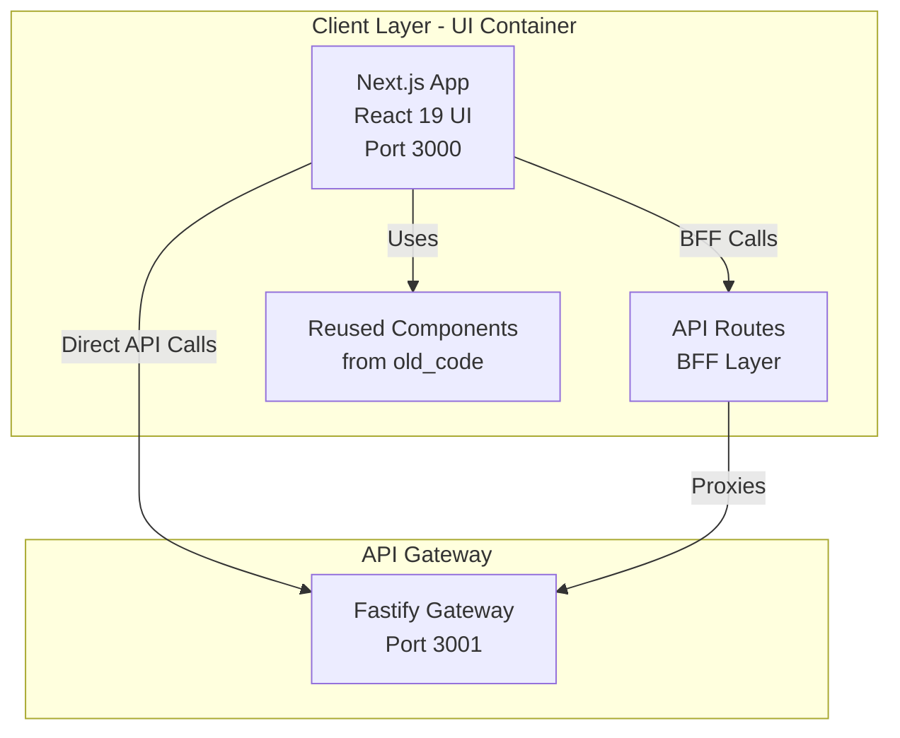
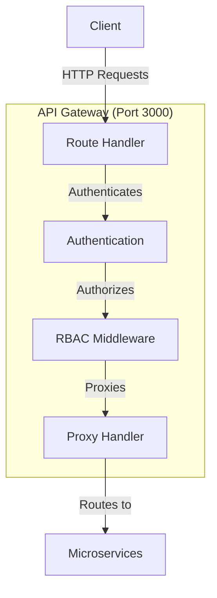
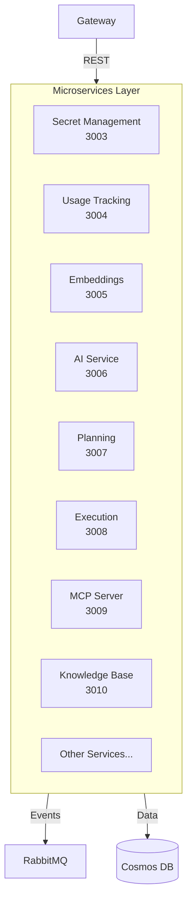
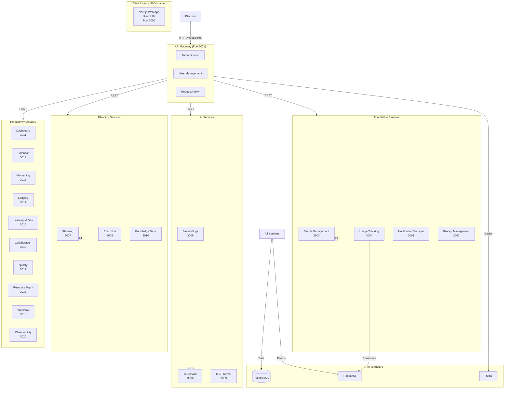

# Global Architecture

## Overview

Coder IDE follows a **three-tier microservices architecture** designed for scalability, maintainability, and separation of concerns. The system consists of a Next.js web application, an API gateway, and 20+ independent microservices.

## Architecture Layers

### 1. Client Layer

**Next.js Web Application (UI Container)**

- **Location**: `containers/ui/`
- **Technology**: Next.js 16 (App Router) + React 19
- **Components**:
  - React UI with Shadcn components
  - Next.js API Routes (BFF - Backend for Frontend)
  - Server-side rendering and static generation
- **Communication Pattern**: Hybrid approach
  - **Direct API calls**: Most operations call microservices directly via API Gateway
  - **BFF (API Routes)**: Used for authentication, token management, and sensitive operations
- **UI Reuse**: Components and pages from `old_code/apps/web/` are reused
- **Port**: 3000 (configurable via `PORT` environment variable)



### 2. API Gateway Layer

**Main Application (Port 3001)**

- **Technology**: Fastify
- **Port**: 3001 (configurable via `PORT` environment variable)
- **Responsibilities**:
  - Request routing to microservices
  - Authentication and authorization
  - User management
  - Session management
- **Communication**: REST API to microservices



### 3. Microservices Layer

**20+ Independent Services**

Each microservice:
- Runs on dedicated port (3001-3046)
- Has single responsibility
- Communicates via REST API
- Publishes/consumes events via RabbitMQ
- Uses Cosmos DB containers (one per module)



## Complete System Architecture



## Microservices Architecture

### Service Overview

| Service | Port | Purpose | Communication |
|---------|------|---------|---------------|
| **Main App** | 3000 | API Gateway, Auth, User Management | REST + WebSocket |
| **Notification Manager** | 3001 | Notification system | REST + RabbitMQ (consumer) |
| **Prompt Management** | 3002 | Prompt templates | REST + RabbitMQ (publisher) |
| **Secret Management** | 3003 | Centralized secrets | REST |
| **Usage Tracking** | 3004 | Usage metering | REST + RabbitMQ (consumer) |
| **Embeddings** | 3005 | Vector embeddings | REST + RabbitMQ (publisher) |
| **AI Service** | 3006 | LLM completions | REST + RabbitMQ (publisher) |
| **Planning** | 3007 | Planning & project management | REST + RabbitMQ (publisher) |
| **Execution** | 3008 | Plan execution engine | REST |
| **MCP Server** | 3009 | Model Context Protocol | REST + RabbitMQ (publisher) |
| **Knowledge Base** | 3010 | Documentation management | REST + RabbitMQ (publisher) |
| **Dashboard** | 3011 | Dashboard configuration | REST |
| **Calendar** | 3012 | Event management | REST |
| **Messaging** | 3013 | Conversations | REST + RabbitMQ |
| **Logging** | 3014 | Log ingestion | REST |
| **Learning & Development** | 3015 | Learning paths | REST |
| **Collaboration** | 3016 | Pairing & innovation | REST |
| **Quality** | 3017 | Experiments & compliance | REST |
| **Resource Management** | 3018 | Capacity planning | REST |
| **Workflow** | 3019 | Workflow orchestration | REST |
| **Observability** | 3020 | Telemetry & tracing | REST |

## Communication Patterns

### 1. Next.js to Backend Communication (Hybrid Pattern)

The Next.js application uses a **hybrid communication pattern**:

#### Direct API Calls (Primary Pattern)
- **Purpose**: Most CRUD operations, queries, data fetching
- **Implementation**: Axios client (`apiClient`) configured with base URL
- **Target**: API Gateway (Port 3001) or microservices directly
- **Authentication**: JWT tokens via Authorization header
- **Benefits**: 
  - Lower latency (no extra hop)
  - Simpler architecture
  - Direct error handling
- **Usage**: 90% of API calls use this pattern

#### Next.js API Routes (BFF - Backend for Frontend)
- **Purpose**: Authentication, token management, sensitive operations
- **Implementation**: Next.js API routes in `/app/api/`
- **Use Cases**:
  - Token refresh and management (httpOnly cookies)
  - CSRF token handling
  - Server-side data aggregation
  - Sensitive operations that shouldn't expose backend URLs
- **Benefits**:
  - Security (hides backend structure)
  - Server-side token management
  - Data aggregation before sending to client
- **Usage**: ~10% of operations (auth, tokens, sensitive data)

#### Example Pattern
```typescript
// Direct API call (most common)
const response = await apiClient.get('/api/v1/users');

// BFF pattern (for auth/tokens)
const response = await fetch('/api/auth/token');
```

### 2. REST API (Synchronous)

- **Purpose**: CRUD operations, queries, immediate responses
- **Protocol**: HTTP/HTTPS
- **Format**: JSON
- **Authentication**: JWT tokens
- **Routing**: Via API Gateway (Port 3001)

### 3. RabbitMQ (Asynchronous)

- **Purpose**: Event-driven communication, notifications, status updates
- **Pattern**: Pub/Sub
- **Exchanges**: Module-specific (e.g., `ai.events`, `planning.events`)
- **Consumers**: Usage Tracking, Notification Manager

### 3. Next.js API Routes (BFF)

- **Purpose**: Backend for Frontend - proxy and aggregate microservice calls
- **Protocol**: HTTP
- **Format**: JSON
- **Benefits**: Reduces client complexity, enables server-side data aggregation

### 4. WebSocket & Server-Sent Events (SSE)

- **Purpose**: Real-time updates, live collaboration, streaming responses
- **Protocol**: WebSocket over HTTP / Server-Sent Events
- **Authentication**: JWT tokens
- **Implementation**: 
  - WebSocket client for bidirectional communication
  - SSE client for server-to-client streaming
  - Used for real-time notifications, AI streaming responses, live collaboration

## Database Architecture

### Azure Cosmos DB NoSQL

All services use Azure Cosmos DB with container-based isolation:

- **Container Prefixing**: Module-specific containers (e.g., `ai_models`, `kb_articles`)
- **Partition Keys**: Typically `organizationId` or `userId` for multi-tenant isolation
- **Document Types**: Use `type` field within containers to differentiate document types
- **Vector Search**: Built-in vector search support for embeddings

### Database Structure

```
Azure Cosmos DB (coder_ide)
├── Core Containers
│   ├── users
│   ├── organizations
│   ├── teams
│   ├── projects
│   └── ...
│
├── Microservice Containers (prefixed)
│   ├── ai_* (AI Service)
│   ├── kb_* (Knowledge Base)
│   ├── mcp_* (MCP Server)
│   ├── emb_* (Embeddings)
│   └── ...
│
└── Features
    └── Vector search (for embeddings)
```

## Security Architecture

### Authentication

- **OAuth 2.0**: Google OAuth integration
- **JWT Tokens**: Stateless authentication
- **Session Management**: Multi-session support
- **Token Refresh**: Automatic token renewal

### Authorization

- **RBAC**: Role-Based Access Control
- **Permission System**: Fine-grained permissions
- **Project-Level Access**: Team-based access control
- **Organization Context**: Multi-tenant support

### Security Features

- **Input Validation**: All endpoints validate input
- **Input Sanitization**: XSS and injection prevention
- **Rate Limiting**: Per-user and per-organization limits
- **Audit Logging**: Comprehensive activity tracking
- **Secret Management**: Centralized secret storage

## Scalability Considerations

### Horizontal Scaling

- **Stateless Services**: All services are stateless
- **Load Balancing**: API Gateway can be load-balanced
- **Database Scaling**: Read replicas for read-heavy operations
- **Cache Layer**: Redis for caching and session storage

### Vertical Scaling

- **Resource Allocation**: Per-service resource limits
- **Database Optimization**: Indexing and query optimization
- **Connection Pooling**: Prisma connection pooling

### Performance Optimization

- **Caching**: Redis cache for frequently accessed data
- **CDN**: Static asset delivery (if web-based)
- **Database Indexing**: Strategic indexes on frequently queried columns
- **Query Optimization**: Efficient database queries

## Infrastructure Components

### Core Infrastructure

1. **Azure Cosmos DB NoSQL**
   - Primary database
   - Container-based isolation per module
   - Built-in vector search for embeddings
   - Partition key-based multi-tenant support

2. **RabbitMQ** (Ports 5672, 15672)
   - Message broker
   - Event-driven communication
   - Management UI on port 15672

3. **Redis** (Port 6379)
   - Caching layer
   - Session storage
   - Rate limiting storage

### Network Architecture

- **Docker Network**: `coder-network` for service communication
- **Service Discovery**: Via Docker Compose service names
- **Port Mapping**: External ports for client access

## Design Principles

1. **Single Responsibility**: Each service has one clear purpose
2. **Loose Coupling**: Services communicate via well-defined APIs
3. **High Cohesion**: Related functionality grouped together
4. **Fail Fast**: Early error detection and reporting
5. **Observability**: Comprehensive logging and monitoring
6. **Security First**: Authentication and authorization at every layer
7. **Scalability**: Designed for horizontal scaling
8. **Maintainability**: Clear separation of concerns

## Related Documentation

- [System Purpose](./SystemPurpose.md) - System goals and vision
- [Module Overview](./ModuleOverview.md) - Module purposes
- [Data Flow](./DataFlow.md) - Communication patterns
- [Technology Stack](./TechnologyStack.md) - Technologies used
- [Deployment](./Deployment.md) - Deployment architecture
