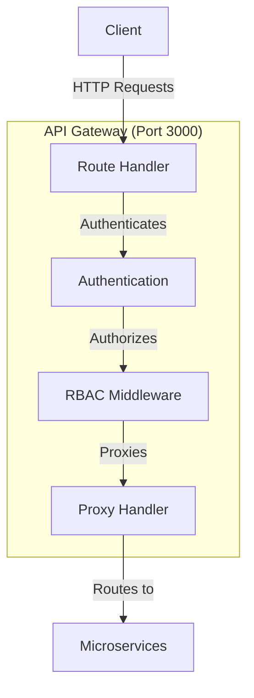
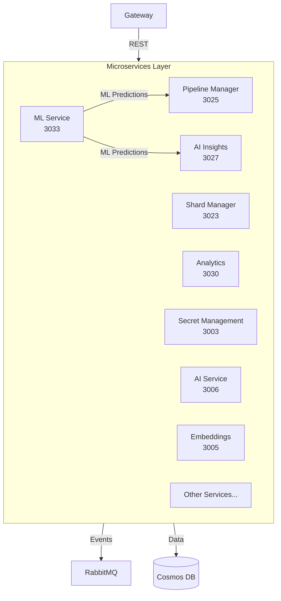
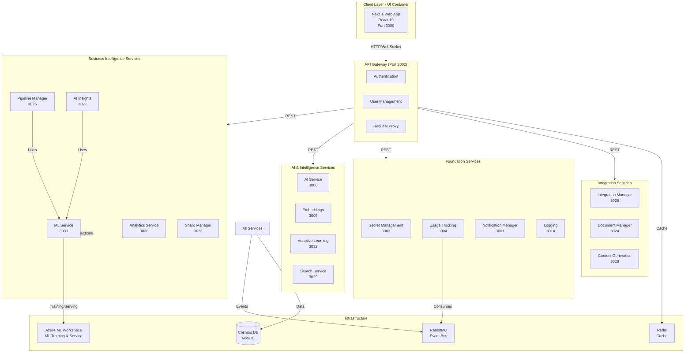

# Global Architecture

## Overview

Castiel follows a **three-tier microservices architecture** designed for scalability, maintainability, and separation of concerns. The system consists of a Next.js web application, an API gateway, and consolidated microservices that provide AI-native business intelligence capabilities. **Service consolidation** has merged llm-service and reasoning-engine into **ai-service**, ai-analytics into **analytics-service**, and moved shard-embedding generation into **embeddings** (data-enrichment handles enrichment only).

The platform is architected as a **Compound AI System (CAIS)** that orchestrates ML models, LLMs, rules, memory, and feedback loops to deliver predictive intelligence for business decision-making.

## Architecture Layers

### 1. Client Layer

**Next.js Web Application (UI Container)**

- **Location**: `containers/ui/`
- **Technology**: Next.js 16 (App Router) + React 19
- **Components**:
  - React UI with Shadcn components
  - Next.js API Routes (BFF - Backend for Frontend)
  - Server-side rendering and static generation
- **Communication Pattern**: Hybrid approach
  - **Direct API calls**: Most operations call microservices directly via API Gateway
  - **BFF (API Routes)**: Used for authentication, token management, and sensitive operations
- **UI Reuse**: Components and pages from the legacy web app are reused
- **Port**: 3000 (configurable via `PORT` environment variable)


### 2. API Gateway Layer

**Main Application (API Gateway Port 3002)**

- **Technology**: Fastify
- **Port**: 3002 (API Gateway; configurable via `PORT` environment variable)
- **Responsibilities**:
  - Request routing to microservices
  - Authentication and authorization
  - User management
  - Session management
- **Communication**: REST API to microservices



### 3. Microservices Layer

**20+ Independent Services**

Each microservice:
- Runs on dedicated port (3001-3046)
- Has single responsibility
- Communicates via REST API
- Publishes/consumes events via RabbitMQ
- Uses Cosmos DB containers (one per module)



## Complete System Architecture



## Compound AI System (CAIS) Architecture

Castiel uses a **Compound AI System (CAIS)** architecture that orchestrates multiple AI components working together in a decision loop. See [CAIS Overview](./CAIS_OVERVIEW.md) for detailed documentation.

### CAIS Components

- **ML Models** - Learn patterns from historical data and make predictions (Risk Scoring, Revenue Forecasting, Recommendations)
- **LLMs** - Explain predictions, generate natural language, provide reasoning
- **Rules/Heuristics** - Enforce business logic and constraints
- **Memory/Historical Data** - Past outcomes, patterns, context
- **Feedback Loops** - Continuously improve through user feedback and outcome tracking
- **Tools** - CRM integrations, email, calendar, analytics

### CAIS Decision Loop

**Prediction → Reasoning → Action → Feedback → Learning**

1. **ML Models** predict (risk scores, revenue forecasts)
2. **LLMs** explain (why the prediction, what to do next)
3. **Rules** constrain (business policies, guardrails)
4. **System** acts (recommendations, notifications)
5. **Users** provide feedback (approve actions, outcomes)
6. **System** learns (improves from outcomes)

## Microservices Architecture

### Service Overview

#### Business Intelligence Core Services

| Service | Port | Purpose | Communication |
|---------|------|---------|---------------|
| **Pipeline Manager** | 3025 | Sales pipeline and opportunity management | REST + RabbitMQ |
| **AI Insights** | 3027 | AI-powered insights and risk analysis | REST + RabbitMQ |
| **ML Service** | 3033 | Machine learning model management and predictions | REST + RabbitMQ |
| **Analytics Service** | 3030 | Analytics, reporting, **AI analytics** (models, events; merged from ai-analytics). Backward-compat path: `/api/v1/ai-analytics/models`. | REST |
| **Shard Manager** | 3023 | Core data model management | REST + RabbitMQ |

#### AI & Intelligence Services

| Service | Port | Purpose | Communication |
|---------|------|---------|---------------|
| **AI Service** | 3006 | LLM completions, model routing, **LLM reasoning** (CoT: explain, recommendations, scenarios, summary, playbook, reactivation strategy), **Reasoning tasks** (CRUD). Merged from llm-service and reasoning-engine. | REST + RabbitMQ (publisher) |
| **Embeddings** | 3005 | Vector store and **shard embedding generation** (templates, generate/batch/regenerate-type, statistics). | REST + RabbitMQ (publisher) |
| **Adaptive Learning** | 3032 | CAIS adaptive learning system | REST + RabbitMQ |
| **Search Service** | 3029 | Advanced search and vector search | REST |

#### Foundation Services

| Service | Port | Purpose | Communication |
|---------|------|---------|---------------|
| **API Gateway** | 3002 | Request routing, authentication, authorization | REST + WebSocket |
| **Notification Manager** | 3001 | Notification system | REST + RabbitMQ (consumer) |
| **Secret Management** | 3003 | Centralized secrets | REST |
| **Usage Tracking** | 3004 | Usage metering | REST + RabbitMQ (consumer) |
| **Logging** | 3014 | Audit logging and compliance | REST |
| **Authentication** | 3021 | User authentication, OAuth, sessions | REST |
| **User Management** | 3022 | User profiles, organizations, teams, RBAC | REST |

#### Integration Services

| Service | Port | Purpose | Communication |
|---------|------|---------|---------------|
| **Integration Manager** | 3026 | Third-party integrations and webhooks | REST + RabbitMQ |
| **Document Manager** | 3024 | Document and file management | REST |
| **Content Generation** | 3028 | AI-powered content generation | REST + RabbitMQ |

#### Platform Services

| Service | Port | Purpose | Communication |
|---------|------|---------|---------------|
| **Dashboard** | 3011 | Dashboard configuration | REST |
| **Collaboration Service** | 3031 | Real-time collaboration features | REST + RabbitMQ |
| **Configuration Service** | 3034 | Centralized configuration management | REST |
| **Cache Service** | 3035 | Caching and cache management | REST |
| **Prompt Service** | 3036 | Prompt management and A/B testing | REST + RabbitMQ |
| **Template Service** | 3037 | Template management | REST |

### Service consolidation

The following consolidations are in place:

- **ai-service** hosts all LLM and reasoning capabilities: completions, insights, prompts, **reasoning tasks** (from reasoning-engine), and **LLM CoT** (explain, recommendations, scenarios, summary, playbook, reactivation strategy from llm-service). Callers (e.g. risk-analytics) use `ai_service.url` for reactivation strategy.
- **analytics-service** is the single backend for analytics and **AI analytics** (models, events). The former ai-analytics container is deprecated; use `GET /api/v1/analytics/ai/models` or the alias `GET /api/v1/ai-analytics/models`.
- **embeddings** owns vector storage and **shard-embedding generation** (template-based; routes under `/api/v1/shard-embeddings/*`). **data-enrichment** runs enrichment only (entity extraction, classification, etc.) and then calls embeddings for shard embedding; it also runs the re-embedding scheduler, which calls embeddings for regenerate-type.

## Communication Patterns

### 1. Next.js to Backend Communication (Hybrid Pattern)

The Next.js application uses a **hybrid communication pattern**:

#### Direct API Calls (Primary Pattern)
- **Purpose**: Most CRUD operations, queries, data fetching
- **Implementation**: Axios client (`apiClient`) configured with base URL
- **Target**: API Gateway (Port 3002) or microservices directly
- **Authentication**: JWT tokens via Authorization header
- **Benefits**: 
  - Lower latency (no extra hop)
  - Simpler architecture
  - Direct error handling
- **Usage**: 90% of API calls use this pattern

#### Next.js API Routes (BFF - Backend for Frontend)
- **Purpose**: Authentication, token management, sensitive operations
- **Implementation**: Next.js API routes in `/app/api/`
- **Use Cases**:
  - Token refresh and management (httpOnly cookies)
  - CSRF token handling
  - Server-side data aggregation
  - Sensitive operations that shouldn't expose backend URLs
- **Benefits**:
  - Security (hides backend structure)
  - Server-side token management
  - Data aggregation before sending to client
- **Usage**: ~10% of operations (auth, tokens, sensitive data)

#### Example Pattern
```typescript
// Direct API call (most common)
const response = await apiClient.get('/api/v1/users');

// BFF pattern (for auth/tokens)
const response = await fetch('/api/auth/token');
```

### 2. REST API (Synchronous)

- **Purpose**: CRUD operations, queries, immediate responses
- **Protocol**: HTTP/HTTPS
- **Format**: JSON
- **Authentication**: JWT tokens
- **Routing**: Via API Gateway (Port 3002)

### 3. RabbitMQ (Asynchronous)

- **Purpose**: Event-driven communication, notifications, status updates
- **Pattern**: Pub/Sub
- **Exchanges**: Module-specific (e.g., `ai.events`, `planning.events`)
- **Consumers**: Usage Tracking, Notification Manager

### 3. Next.js API Routes (BFF)

- **Purpose**: Backend for Frontend - proxy and aggregate microservice calls
- **Protocol**: HTTP
- **Format**: JSON
- **Benefits**: Reduces client complexity, enables server-side data aggregation

### 4. WebSocket & Server-Sent Events (SSE)

- **Purpose**: Real-time updates, live collaboration, streaming responses
- **Protocol**: WebSocket over HTTP / Server-Sent Events
- **Authentication**: JWT tokens
- **Implementation**: 
  - WebSocket client for bidirectional communication
  - SSE client for server-to-client streaming
  - Used for real-time notifications, AI streaming responses, live collaboration

## Database Architecture

### Azure Cosmos DB NoSQL

All services use Azure Cosmos DB with container-based isolation:

- **Container Prefixing**: Module-specific containers (e.g., `ai_models`, `kb_articles`)
- **Partition Keys**: Typically `organizationId` or `userId` for multi-tenant isolation
- **Document Types**: Use `type` field within containers to differentiate document types
- **Vector Search**: Built-in vector search support for embeddings

### Database Structure

```
Azure Cosmos DB (castiel)
├── Core Containers
│   ├── users
│   ├── organizations
│   ├── teams
│   └── ...
│
├── Business Intelligence Containers
│   ├── pipeline_* (Pipeline Manager)
│   ├── ai_insights_* (AI Insights)
│   ├── ml_* (ML Service)
│   ├── analytics_* (Analytics)
│   └── shard_* (Shard Manager)
│
├── AI Service Containers (prefixed)
│   ├── ai_* (AI Service)
│   ├── emb_* (Embeddings)
│   ├── adaptive_* (Adaptive Learning)
│   └── ...
│
└── Features
    └── Vector search (for embeddings)
```

## Security Architecture

### Authentication

- **OAuth 2.0**: Google OAuth integration
- **JWT Tokens**: Stateless authentication
- **Session Management**: Multi-session support
- **Token Refresh**: Automatic token renewal

### Authorization

- **RBAC**: Role-Based Access Control
- **Permission System**: Fine-grained permissions
- **Project-Level Access**: Team-based access control
- **Organization Context**: Multi-tenant support

### Security Features

- **Input Validation**: All endpoints validate input
- **Input Sanitization**: XSS and injection prevention
- **Rate Limiting**: Per-user and per-organization limits
- **Audit Logging**: Comprehensive activity tracking
- **Secret Management**: Centralized secret storage

## Scalability Considerations

### Horizontal Scaling

- **Stateless Services**: All services are stateless
- **Load Balancing**: API Gateway can be load-balanced
- **Database Scaling**: Read replicas for read-heavy operations
- **Cache Layer**: Redis for caching and session storage

### Vertical Scaling

- **Resource Allocation**: Per-service resource limits
- **Database Optimization**: Indexing and query optimization
- **Connection Pooling**: Prisma connection pooling

### Performance Optimization

- **Caching**: Redis cache for frequently accessed data
- **CDN**: Static asset delivery (if web-based)
- **Database Indexing**: Strategic indexes on frequently queried columns
- **Query Optimization**: Efficient database queries

## Infrastructure Components

### Core Infrastructure

1. **Azure Cosmos DB NoSQL**
   - Primary database
   - Container-based isolation per module
   - Built-in vector search for embeddings
   - Partition key-based multi-tenant support

2. **RabbitMQ** (Ports 5672, 15672)
   - Message broker
   - Event-driven communication
   - Management UI on port 15672

3. **Redis** (Port 6379)
   - Caching layer
   - Session storage
   - Rate limiting storage

### Network Architecture

- **Docker Network**: `coder-network` for service communication
- **Service Discovery**: Via Docker Compose service names
- **Port Mapping**: External ports for client access

## Design Principles

1. **Single Responsibility**: Each service has one clear purpose
2. **Loose Coupling**: Services communicate via well-defined APIs
3. **High Cohesion**: Related functionality grouped together
4. **Fail Fast**: Early error detection and reporting
5. **Observability**: Comprehensive logging and monitoring
6. **Security First**: Authentication and authorization at every layer
7. **Scalability**: Designed for horizontal scaling
8. **Maintainability**: Clear separation of concerns

## ML Prediction Pipeline

The ML Service provides predictions that flow through the system:

1. **Data Collection**: Opportunities and historical data stored in Cosmos DB
2. **Feature Engineering**: Features extracted from signals (planned: FeatureStoreService)
3. **ML Prediction**: Azure ML Managed Endpoints provide predictions (Risk Scoring, Revenue Forecasting, Recommendations)
4. **Explanation**: SHAP values and feature importance explain predictions
5. **LLM Reasoning**: LLMs generate natural language explanations
6. **Decision & Action**: RiskEvaluationService and RecommendationsService combine rules + AI
7. **Feedback**: User feedback and outcomes collected for continuous learning

See [CAIS Overview](./CAIS_OVERVIEW.md) for detailed CAIS architecture documentation.

## Related Documentation

- [System Purpose](./SystemPurpose.md) - System goals and vision
- [CAIS Overview](./CAIS_OVERVIEW.md) - Compound AI System architecture
- [Module Overview](./ModuleOverview.md) - Module purposes
- [Data Flow](./DataFlow.md) - Communication patterns
- [Technology Stack](./TechnologyStack.md) - Technologies used
- [Deployment](./Deployment.md) - Deployment architecture
