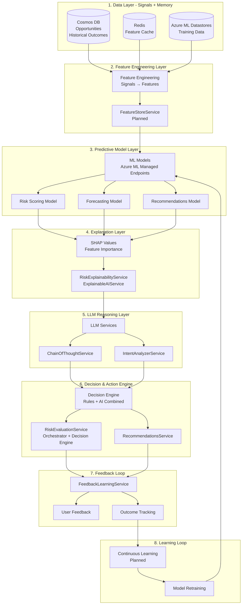
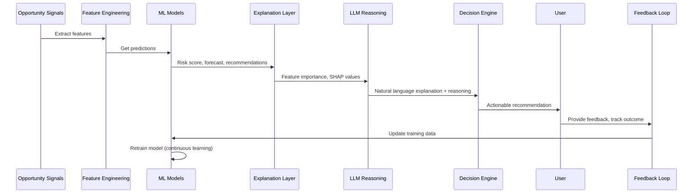

# Compound AI System (CAIS) Overview

## Executive Summary

Castiel is architected as a **Compound AI System (CAIS)**—a system composed of multiple AI components working together in a decision loop. Unlike a single ML model, CAIS orchestrates **predictive ML models**, **LLMs for reasoning**, **rules/heuristics**, **memory/historical data**, **feedback loops**, and **tools** to deliver explainable, actionable, continuously improving decisions for business intelligence.

**Key Distinction:**
- **ML Model**: Learns patterns from signals, makes numeric predictions (risk scores, revenue forecasts)
- **CAIS**: Orchestrates ML + LLM + Rules + Memory + Feedback to turn predictions into explainable, actionable decisions

## What is a Compound AI System (CAIS)?

A Compound AI System is **not a single model**. It is a system architecture that orchestrates multiple AI components:

1. **Predictive ML Models** - Learn patterns from historical data (risk scores, revenue forecasts, win probability)
2. **Rules / Heuristics** - Deterministic business logic and constraints
3. **LLMs** - Reasoning, explanation, natural language generation
4. **Memory / Historical Data** - Past outcomes, patterns, context
5. **Feedback Loops** - User feedback, outcome tracking, continuous improvement
6. **Tools** - CRM integrations, email, calendar, analytics

All working together in a **decision loop**: **Prediction → Reasoning → Action → Feedback → Learning**

## Why CAIS Fits Business Intelligence

Business intelligence is particularly well-suited for CAIS because it is:

- **Non-stationary**: Markets change, customer behavior evolves, competitive landscapes shift
- **Partially structured**: Mix of structured data (amount, stage) and unstructured data (emails, notes)
- **Human-in-the-loop**: Business users need to understand and act on recommendations
- **Action-oriented**: Not just prediction—the system must recommend actions and take actions

CAIS excels when:
- **ML predicts** (risk scores, revenue forecasts)
- **LLM explains** (why the prediction, what to do next)
- **Rules constrain** (business policies, guardrails)
- **Humans decide** (approve actions, provide feedback)
- **System learns** (improves from outcomes)

## CAIS Architecture Layers

The Castiel CAIS is organized into eight distinct layers, each with clear responsibilities:

### Layer 1: Data Layer (Signals + Memory)

**Purpose**: Store and retrieve business data and historical outcomes

**Components**:
- **Cosmos DB**: Opportunities, historical outcomes, business data
- **Redis**: Feature cache for performance
- **Azure ML Datastores**: Training data for ML models (planned)

**Current State**: ✅ Fully operational
- Cosmos DB stores all business data
- Redis provides caching layer
- Historical outcomes tracked for learning

### Layer 2: Feature Engineering Layer

**Purpose**: Transform raw signals into ML-ready features

**Components**:
- **Feature Engineering**: Extract features from signals
- **FeatureStoreService**: Centralized feature store (planned)

**Current State**: 📋 Partially implemented
- Feature extraction happens in services
- FeatureStoreService planned for centralized management

### Layer 3: Predictive Model Layer

**Purpose**: ML models make predictions from features

**Components**:
- **Azure ML Managed Endpoints**: Model serving infrastructure
- **Risk Scoring Model**: Predicts risk scores (0-1 scale)
- **Forecasting Model**: Predicts revenue forecasts
- **Recommendations Model**: Ranks recommendations

**Current State**: 📋 Planned
- Azure ML Workspace for training
- Azure ML Managed Endpoints for serving
- AutoML for model selection

### Layer 4: Explanation Layer

**Purpose**: Explain ML predictions with feature importance

**Components**:
- **SHAP Values**: Feature importance for predictions
- **RiskExplainabilityService**: Explains risk predictions
- **ExplainableAIService**: General explanation service

**Current State**: 📋 Partially implemented
- RiskExplainabilityService and ExplainableAIService exist
- SHAP integration planned

### Layer 5: LLM Reasoning Layer

**Purpose**: Generate natural language explanations and reasoning

**Components**:
- **LLM Services**: GPT-4, Claude, and other LLMs
- **ChainOfThoughtService**: Sequential reasoning
- **IntentAnalyzerService**: Intent analysis

**Current State**: ✅ Fully operational
- LLM services provide natural language explanations
- Chain-of-thought reasoning implemented

### Layer 6: Decision & Action Engine

**Purpose**: Combine rules + AI to make decisions and execute actions

**Components**:
- **RiskEvaluationService**: Orchestrates risk detection and evaluation
- **RecommendationsService**: Generates and ranks recommendations
- **Decision Engine**: Combines ML predictions with business rules

**Current State**: ✅ Fully operational
- RiskEvaluationService orchestrates risk detection
- RecommendationsService provides recommendations
- Business rules enforce constraints

### Layer 7: Feedback Loop

**Purpose**: Collect user feedback and track outcomes

**Components**:
- **FeedbackLearningService**: Collects user feedback
- **User Feedback**: Explicit user feedback on predictions
- **Outcome Tracking**: Tracks actual outcomes vs predictions

**Current State**: ✅ Fully operational
- FeedbackLearningService collects feedback
- Outcome tracking implemented

### Layer 8: Learning Loop

**Purpose**: Continuously improve models from feedback and outcomes

**Components**:
- **Continuous Learning**: Automated model improvement
- **Model Retraining**: Retrain models with new data

**Current State**: 📋 Planned
- Manual retraining currently
- Automated continuous learning planned

## CAIS Decision Loop

The complete CAIS decision loop:

### Step-by-Step Process

1. **Data Collection**: Opportunity signals collected from multiple sources (Salesforce, integrations, etc.)
2. **Feature Engineering**: Raw signals transformed into ML-ready features
3. **ML Prediction**: Models predict risk scores, revenue forecasts, and recommendations
4. **Explanation**: SHAP values and feature importance explain predictions
5. **LLM Reasoning**: LLMs generate natural language explanations and reasoning
6. **Decision**: Decision engine combines ML predictions with business rules
7. **Action**: Recommendations presented to users, actions executed
8. **Feedback**: User feedback and outcomes collected
9. **Learning**: Models retrained with new data (continuous learning)

## Priority ML Use Cases

The CAIS architecture supports three priority ML use cases:

### 1. Risk Scoring ⭐

**ML Model**: Regression (XGBoost/LightGBM via AutoML)
- Predicts risk scores (0-1 scale) for opportunities
- Category-specific risk scores (Commercial, Technical, Financial, etc.)
- Multi-level aggregation (opportunity → account → team → tenant)
- Confidence intervals and uncertainty quantification

**CAIS Integration**:
- ML model predicts risk score
- SHAP values explain which features drive risk
- LLM generates natural language explanation
- RiskEvaluationService combines ML prediction with rules
- User provides feedback on risk assessment accuracy

### 2. Revenue Forecasting ⭐

**ML Model**: Regression / Time Series (XGBoost/LightGBM via AutoML)
- Opportunity-level revenue forecasts with uncertainty
- Team-level pipeline and win rate forecasts
- Tenant-level total revenue and growth rate forecasts
- Scenario-based forecasting (best/base/worst case)

**CAIS Integration**:
- ML model predicts revenue forecasts
- Feature importance explains forecast drivers
- LLM explains forecast reasoning and scenarios
- Decision engine combines forecasts with business rules
- User feedback improves forecast accuracy

### 3. Recommendations ⭐

**ML Model**: Ranking (XGBoost Ranker via AutoML)
- Improved recommendation ranking and personalization
- Better user engagement and click-through rates
- Context-aware recommendations

**CAIS Integration**:
- ML model ranks recommendations
- Feature importance explains ranking
- LLM explains why each recommendation is relevant
- RecommendationsService combines ML ranking with rules
- User engagement feedback improves recommendations

## Current State vs. Target State

### Current State (Rule-based + LLM)

- ✅ Data Layer: Cosmos DB, Redis
- ✅ Feature Engineering: Feature extraction in services
- ✅ Predictive Model: Rule-based heuristics (stage-based probability)
- ✅ Explanation Layer: RiskExplainabilityService, ExplainableAIService
- ✅ LLM Reasoning: ChainOfThoughtService, IntentAnalyzerService
- ✅ Decision & Action: RiskEvaluationService, RecommendationsService
- ✅ Feedback Loop: FeedbackLearningService
- 📋 Learning Loop: Manual retraining (planned: automated)

### Target State (Full CAIS with ML)

- ✅ Data Layer: Cosmos DB, Redis, Azure ML Datastores
- 📋 Feature Engineering: FeatureStoreService (planned)
- 📋 Predictive Model: Azure ML Managed Endpoints (planned)
- 📋 Explanation Layer: SHAP integration (planned)
- ✅ LLM Reasoning: Enhanced with ML context (current + planned)
- ✅ Decision & Action: Enhanced with ML predictions (current + planned)
- ✅ Feedback Loop: Extended for ML feedback (current + planned)
- 📋 Learning Loop: Automated continuous learning (planned)

## Technical Implementation

### Azure ML Integration

- **Azure ML Workspace**: Managed training environment
- **Azure ML Managed Endpoints**: Model serving infrastructure
- **AutoML**: Automated model selection and training
- **Application Insights**: Unified monitoring

### Model Training

- **Training Data**: Historical opportunities and outcomes from Cosmos DB
- **Feature Extraction**: Features extracted from signals
- **Model Selection**: AutoML selects best model (XGBoost/LightGBM)
- **Model Deployment**: Deployed to Azure ML Managed Endpoints

### Model Serving

- **Prediction Endpoints**: REST API endpoints for predictions
- **Latency**: <100ms target for predictions
- **Caching**: Redis cache for frequently requested predictions
- **Monitoring**: Application Insights for performance and accuracy

## Benefits of CAIS Architecture

1. **Explainability**: ML predictions are explained by LLMs with feature importance
2. **Actionability**: Predictions combined with rules to generate actionable recommendations
3. **Continuous Improvement**: Feedback loops enable continuous learning
4. **Flexibility**: Rules can be updated without retraining models
5. **Human-in-the-loop**: Users understand and control AI decisions
6. **Robustness**: Multiple components provide redundancy and fallbacks

## Related Documentation

- [System Purpose](./SystemPurpose.md) - System goals and vision
- [Architecture](./Architecture.md) - System architecture
- [ML Service](../modules/extensions/ml-service/) - Detailed ML service documentation
- [AI Insights](../modules/extensions/ai-insights/) - AI insights and risk analysis
