# Data Flow and Communication Patterns

## Overview

This document describes the data flows and communication patterns used throughout the Coder IDE system. The system uses multiple communication mechanisms optimized for different use cases.

## Communication Mechanisms

### 1. REST API (Synchronous)

**Purpose**: Immediate request-response operations

**Flow**:
```
Client → API Gateway → Microservice → Database → Response
```

**Characteristics**:
- Synchronous communication
- Request-response pattern
- JSON payloads
- JWT authentication
- HTTP/HTTPS protocol

**Use Cases**:
- CRUD operations
- Data queries
- Immediate responses needed
- User-initiated actions

**Example Flow**:
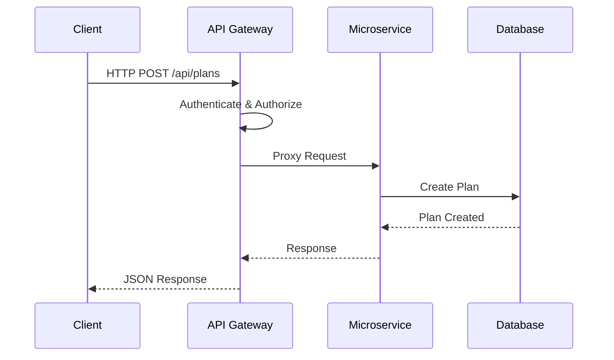
```mermaid
sequenceDiagram
    participant C as Client
    participant G as API Gateway
    participant M as Microservice
    participant D as Database
    
    C->>G: HTTP POST /api/plans
    G->>G: Authenticate & Authorize
    G->>M: Proxy Request
    M->>D: Create Plan
    D-->>M: Plan Created
    M-->>G: Response
    G-->>C: JSON Response
```

### 2. RabbitMQ (Asynchronous)

**Purpose**: Event-driven communication and notifications

**Flow**:
```
Publisher → RabbitMQ Exchange → Queue → Consumer
```

**Characteristics**:
- Asynchronous communication
- Pub/Sub pattern
- Event-driven
- Decoupled services
- Guaranteed delivery

**Use Cases**:
- Status updates
- Notifications
- Usage tracking
- Event logging
- Background processing

**Event Flow**:
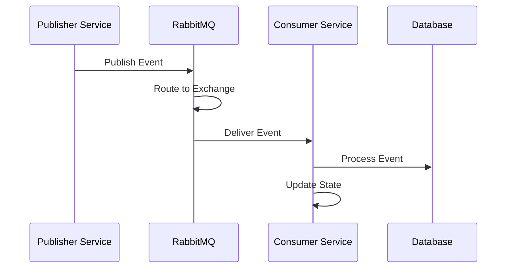
```mermaid
sequenceDiagram
    participant P as Publisher Service
    participant R as RabbitMQ
    participant C as Consumer Service
    participant D as Database
    
    P->>R: Publish Event
    R->>R: Route to Exchange
    R->>C: Deliver Event
    C->>D: Process Event
    C->>C: Update State
```

### 3. IPC (Inter-Process Communication)

**Purpose**: Electron renderer ↔ main process communication

**Flow**:
```
Renderer → Preload → Main Process → Backend API
```

**Characteristics**:
- Electron-specific
- Secure bridge via preload
- JSON payloads
- Synchronous and asynchronous
- Error handling

**Use Cases**:
- UI actions
- File operations
- System operations
- Backend API calls

**IPC Flow**:
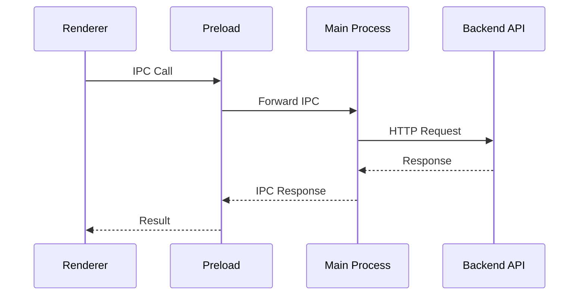
```mermaid
sequenceDiagram
    participant R as Renderer
    participant P as Preload
    participant M as Main Process
    participant B as Backend API
    
    R->>P: IPC Call
    P->>M: Forward IPC
    M->>B: HTTP Request
    B-->>M: Response
    M-->>P: IPC Response
    P-->>R: Result
```

### 4. WebSocket (Real-Time)

**Purpose**: Real-time bidirectional communication

**Flow**:
```
Client ↔ WebSocket Server ↔ Services
```

**Characteristics**:
- Bidirectional
- Real-time updates
- Persistent connection
- Low latency
- Event streaming

**Use Cases**:
- Live collaboration
- Real-time notifications
- Progress updates
- Live data streaming

## Data Flow Patterns

### Authentication Flow

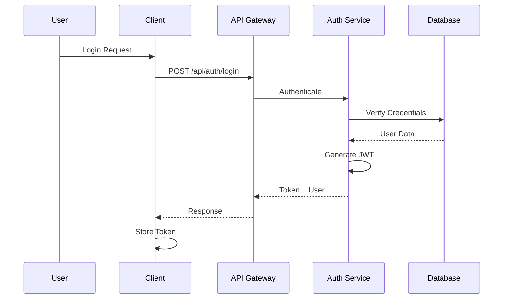
```mermaid
sequenceDiagram
    participant U as User
    participant C as Client
    participant G as API Gateway
    participant A as Auth Service
    participant D as Database
    
    U->>C: Login Request
    C->>G: POST /api/auth/login
    G->>A: Authenticate
    A->>D: Verify Credentials
    D-->>A: User Data
    A->>A: Generate JWT
    A-->>G: Token + User
    G-->>C: Response
    C->>C: Store Token
```

### Plan Generation Flow

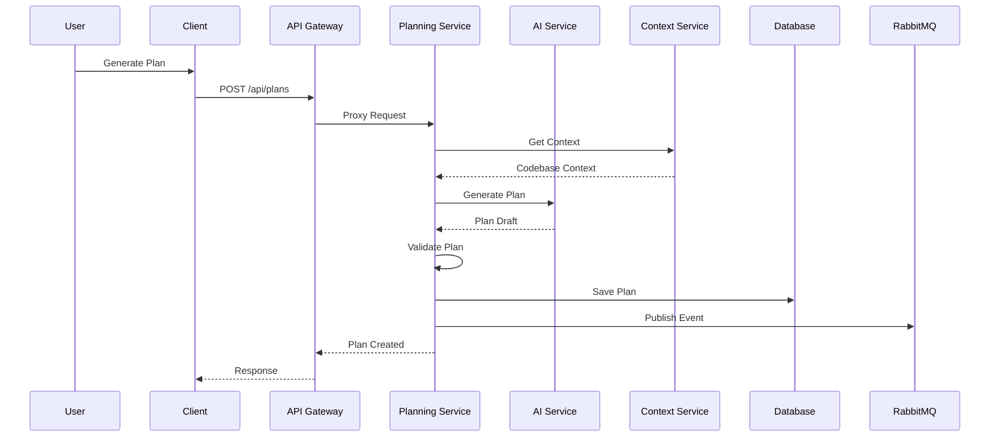
```mermaid
sequenceDiagram
    participant U as User
    participant C as Client
    participant G as API Gateway
    participant P as Planning Service
    participant AI as AI Service
    participant CTX as Context Service
    participant D as Database
    
    U->>C: Generate Plan
    C->>G: POST /api/plans
    G->>P: Proxy Request
    P->>CTX: Get Context
    CTX-->>P: Codebase Context
    P->>AI: Generate Plan
    AI-->>P: Plan Draft
    P->>P: Validate Plan
    P->>D: Save Plan
    P->>RabbitMQ: Publish Event
    P-->>G: Plan Created
    G-->>C: Response
```

### Event-Driven Flow

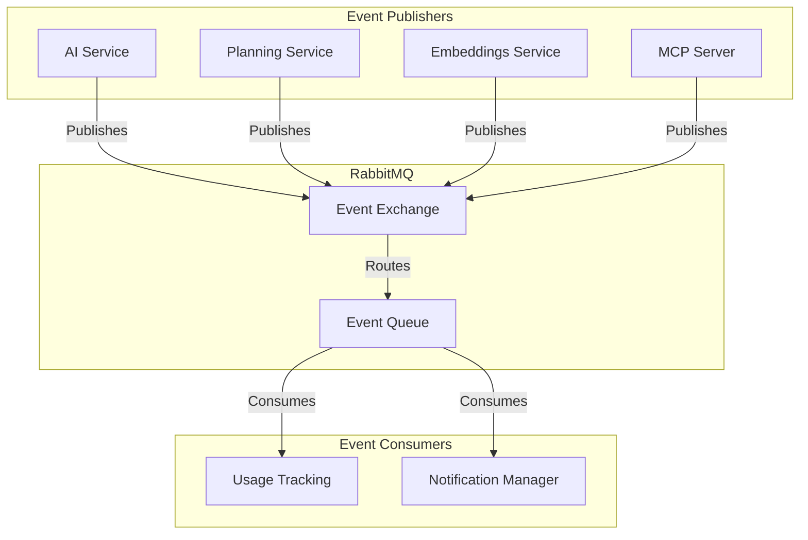
```mermaid
graph TB
    subgraph Publishers["Event Publishers"]
        AI[AI Service]
        Planning[Planning Service]
        Embeddings[Embeddings Service]
        MCP[MCP Server]
    end
    
    subgraph RabbitMQ["RabbitMQ"]
        Exchange[Event Exchange]
        Queue[Event Queue]
    end
    
    subgraph Consumers["Event Consumers"]
        Usage[Usage Tracking]
        Notif[Notification Manager]
    end
    
    AI -->|Publishes| Exchange
    Planning -->|Publishes| Exchange
    Embeddings -->|Publishes| Exchange
    MCP -->|Publishes| Exchange
    
    Exchange -->|Routes| Queue
    Queue -->|Consumes| Usage
    Queue -->|Consumes| Notif
```

## Database Access Patterns

### Direct Database Access

All services access the shared PostgreSQL database directly:

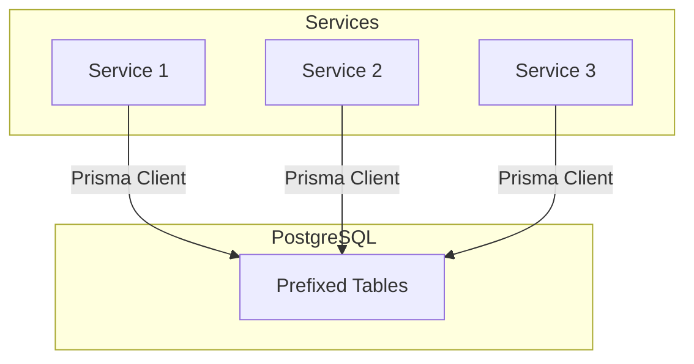
```mermaid
graph TB
    subgraph Services["Services"]
        S1[Service 1]
        S2[Service 2]
        S3[Service 3]
    end
    
    subgraph Database["PostgreSQL"]
        Tables[Prefixed Tables]
    end
    
    S1 -->|Prisma Client| Tables
    S2 -->|Prisma Client| Tables
    S3 -->|Prisma Client| Tables
```

### Database Transaction Flow

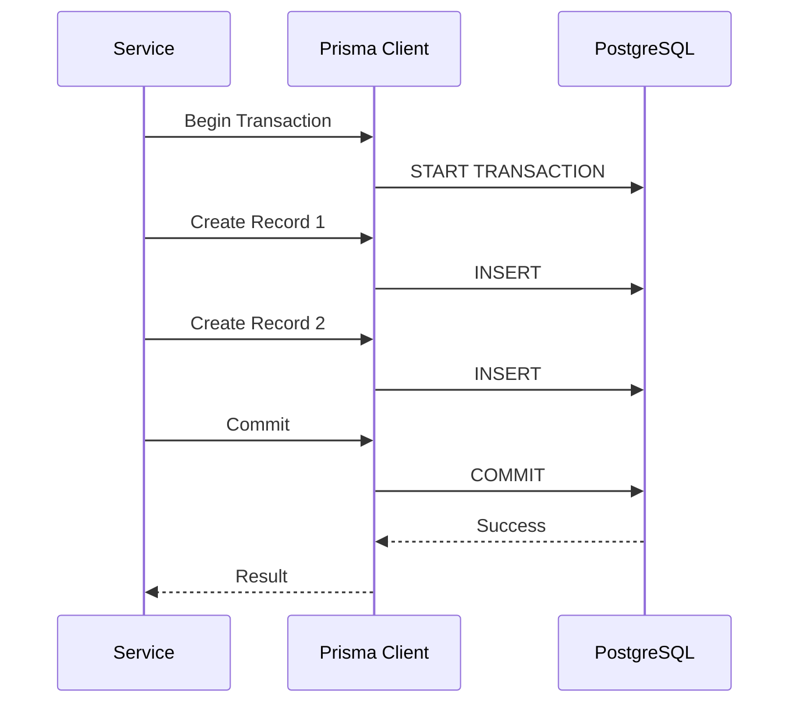
```mermaid
sequenceDiagram
    participant S as Service
    participant P as Prisma Client
    participant D as PostgreSQL
    
    S->>P: Begin Transaction
    P->>D: START TRANSACTION
    S->>P: Create Record 1
    P->>D: INSERT
    S->>P: Create Record 2
    P->>D: INSERT
    S->>P: Commit
    P->>D: COMMIT
    D-->>P: Success
    P-->>S: Result
```

## Cache Usage Patterns

### Redis Cache Flow

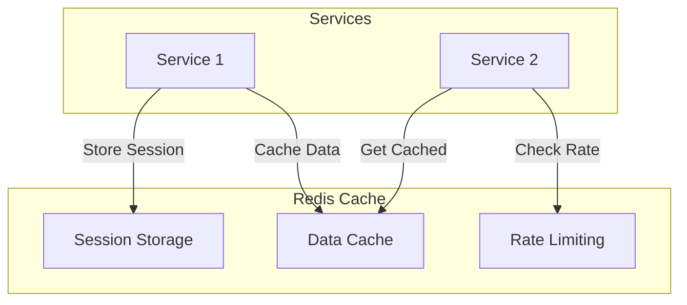
```mermaid
graph TB
    subgraph Services["Services"]
        S1[Service 1]
        S2[Service 2]
    end
    
    subgraph Cache["Redis Cache"]
        Session[Session Storage]
        Data[Data Cache]
        RateLimit[Rate Limiting]
    end
    
    S1 -->|Store Session| Session
    S1 -->|Cache Data| Data
    S2 -->|Check Rate| RateLimit
    S2 -->|Get Cached| Data
```

### Cache-Aside Pattern

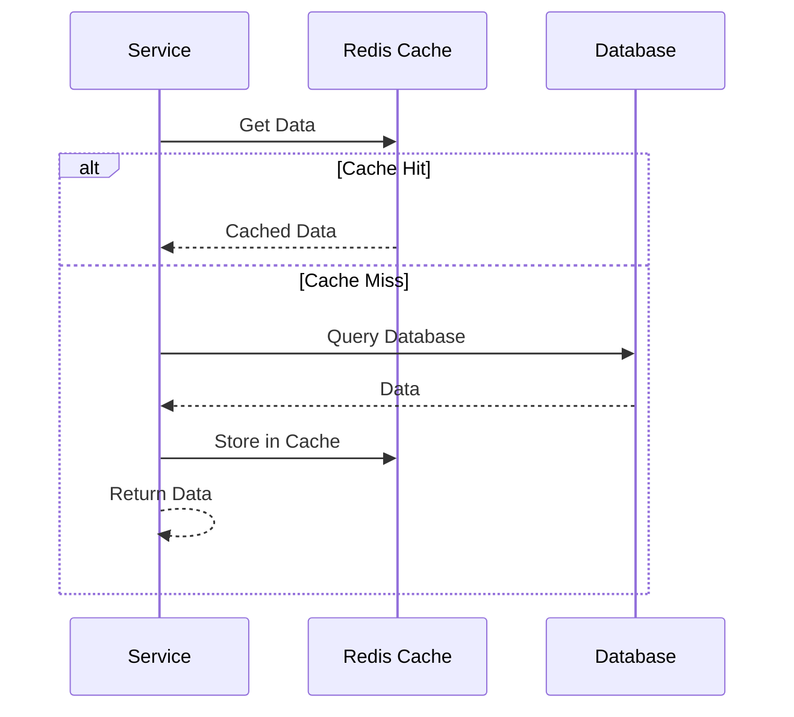
```mermaid
sequenceDiagram
    participant S as Service
    participant C as Redis Cache
    participant D as Database
    
    S->>C: Get Data
    alt Cache Hit
        C-->>S: Cached Data
    else Cache Miss
        S->>D: Query Database
        D-->>S: Data
        S->>C: Store in Cache
        S-->>S: Return Data
    end
```

## Inter-Service Communication

### Service-to-Service via API Gateway

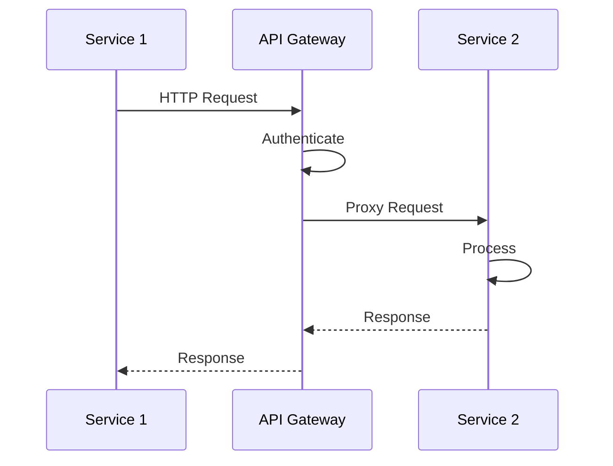
```mermaid
sequenceDiagram
    participant S1 as Service 1
    participant G as API Gateway
    participant S2 as Service 2
    
    S1->>G: HTTP Request
    G->>G: Authenticate
    G->>S2: Proxy Request
    S2->>S2: Process
    S2-->>G: Response
    G-->>S1: Response
```

### Direct Service-to-Service

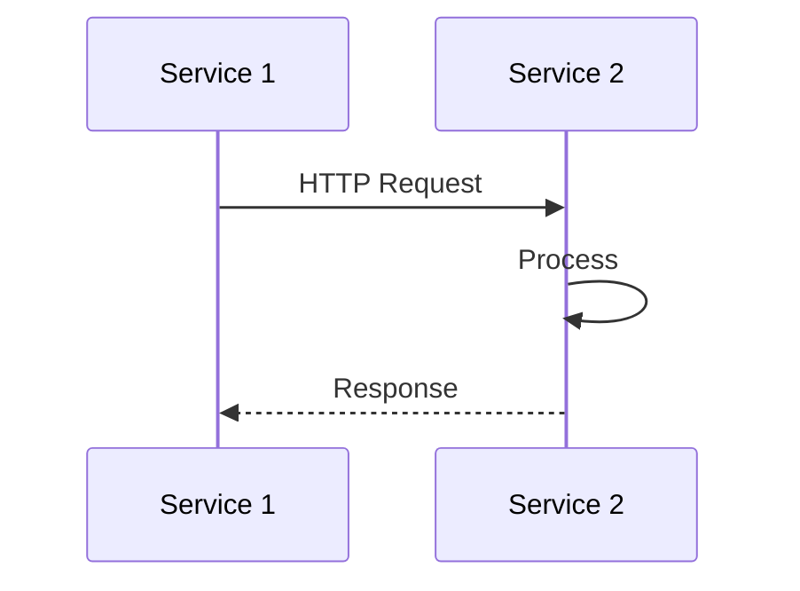
```mermaid
sequenceDiagram
    participant S1 as Service 1
    participant S2 as Service 2
    
    S1->>S2: HTTP Request
    S2->>S2: Process
    S2-->>S1: Response
```

## Data Synchronization

### Event-Driven Synchronization

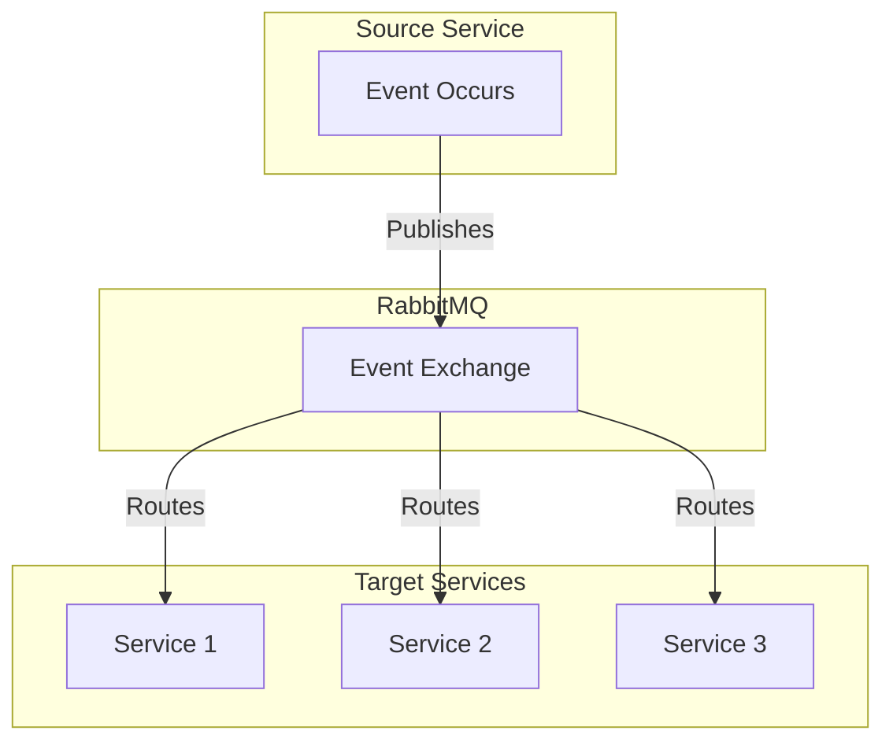
```mermaid
graph TB
    subgraph Source["Source Service"]
        Event[Event Occurs]
    end
    
    subgraph RabbitMQ["RabbitMQ"]
        Exchange[Event Exchange]
    end
    
    subgraph Targets["Target Services"]
        S1[Service 1]
        S2[Service 2]
        S3[Service 3]
    end
    
    Event -->|Publishes| Exchange
    Exchange -->|Routes| S1
    Exchange -->|Routes| S2
    Exchange -->|Routes| S3
```

### Database Synchronization

- **Shared Database**: All services share PostgreSQL
- **Foreign Keys**: Cross-module referential integrity
- **Transactions**: ACID guarantees
- **Consistency**: Immediate consistency

## Error Handling Flow

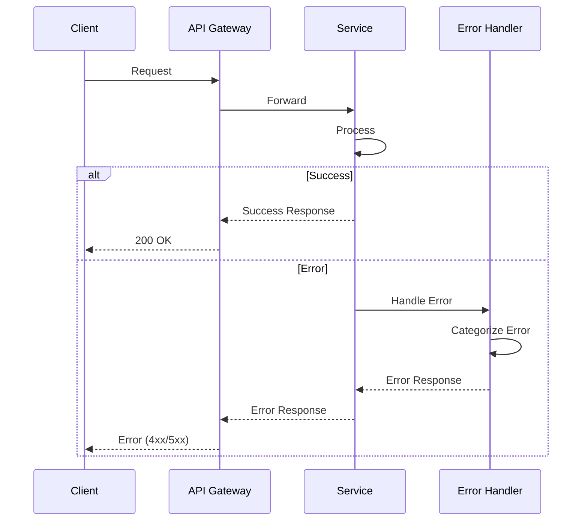
```mermaid
sequenceDiagram
    participant C as Client
    participant G as API Gateway
    participant S as Service
    participant E as Error Handler
    
    C->>G: Request
    G->>S: Forward
    S->>S: Process
    alt Success
        S-->>G: Success Response
        G-->>C: 200 OK
    else Error
        S->>E: Handle Error
        E->>E: Categorize Error
        E-->>S: Error Response
        S-->>G: Error Response
        G-->>C: Error (4xx/5xx)
    end
```

## Request Lifecycle

### Complete Request Flow

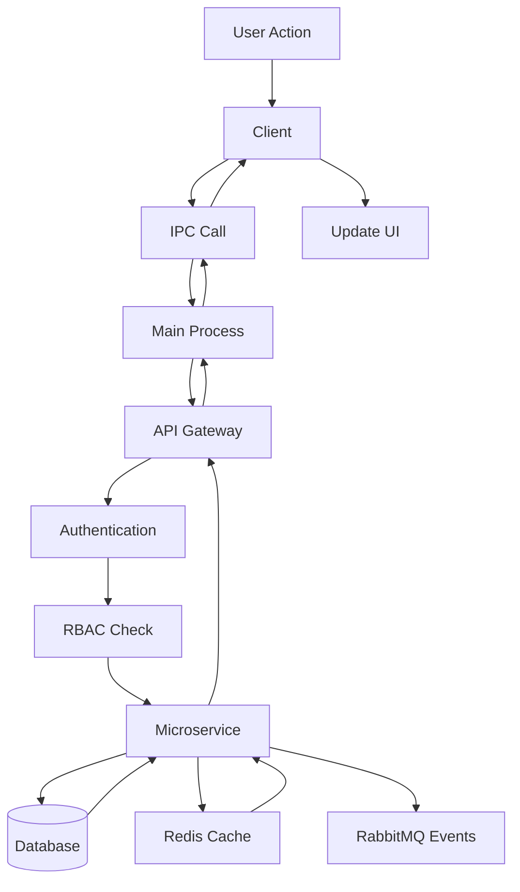
```mermaid
graph TB
    Start[User Action] --> Client[Client]
    Client --> IPC[IPC Call]
    IPC --> Main[Main Process]
    Main --> Gateway[API Gateway]
    Gateway --> Auth[Authentication]
    Auth --> RBAC[RBAC Check]
    RBAC --> Service[Microservice]
    Service --> DB[(Database)]
    Service --> Cache[Redis Cache]
    Service --> Events[RabbitMQ Events]
    DB --> Service
    Cache --> Service
    Service --> Gateway
    Gateway --> Main
    Main --> IPC
    IPC --> Client
    Client --> UI[Update UI]
```

## Performance Optimization

### Caching Strategy

- **Session Data**: Redis cache
- **Frequently Accessed Data**: Redis cache with TTL
- **Database Queries**: Query result caching
- **API Responses**: Response caching where appropriate

### Connection Pooling

- **Database**: Prisma connection pooling
- **HTTP**: HTTP client connection reuse
- **RabbitMQ**: Connection pooling

### Load Balancing

- **API Gateway**: Can be load-balanced
- **Microservices**: Stateless, can be scaled horizontally
- **Database**: Read replicas for read-heavy operations

## Security Flow

### Authentication Flow

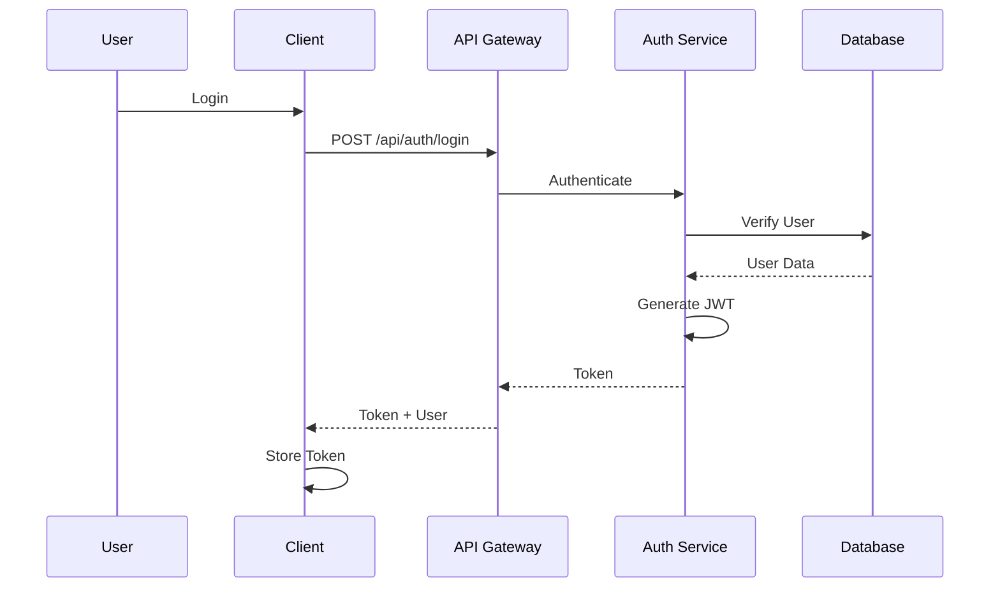
```mermaid
sequenceDiagram
    participant U as User
    participant C as Client
    participant G as API Gateway
    participant A as Auth Service
    participant D as Database
    
    U->>C: Login
    C->>G: POST /api/auth/login
    G->>A: Authenticate
    A->>D: Verify User
    D-->>A: User Data
    A->>A: Generate JWT
    A-->>G: Token
    G-->>C: Token + User
    C->>C: Store Token
```

### Authorization Flow

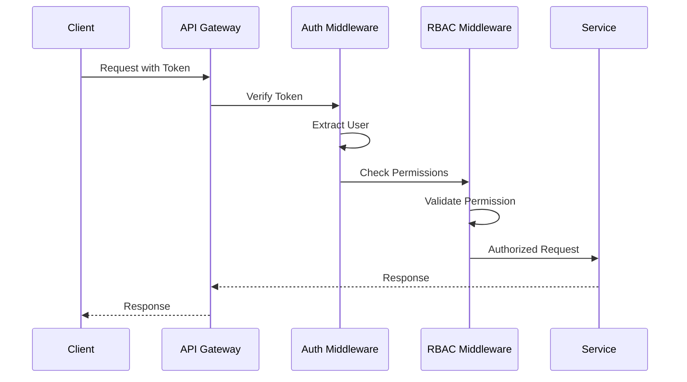
```mermaid
sequenceDiagram
    participant C as Client
    participant G as API Gateway
    participant A as Auth Middleware
    participant R as RBAC Middleware
    participant S as Service
    
    C->>G: Request with Token
    G->>A: Verify Token
    A->>A: Extract User
    A->>R: Check Permissions
    R->>R: Validate Permission
    R->>S: Authorized Request
    S-->>G: Response
    G-->>C: Response
```

## Related Documentation

- [Architecture](./Architecture.md) - System architecture
- [Module Overview](./ModuleOverview.md) - Module purposes
- [Technology Stack](./TechnologyStack.md) - Technologies used
