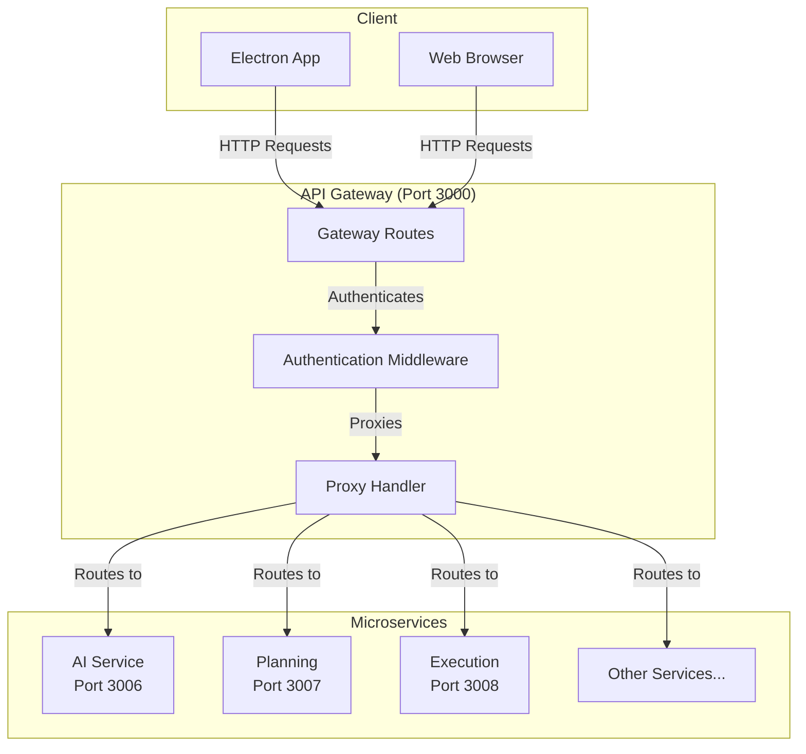
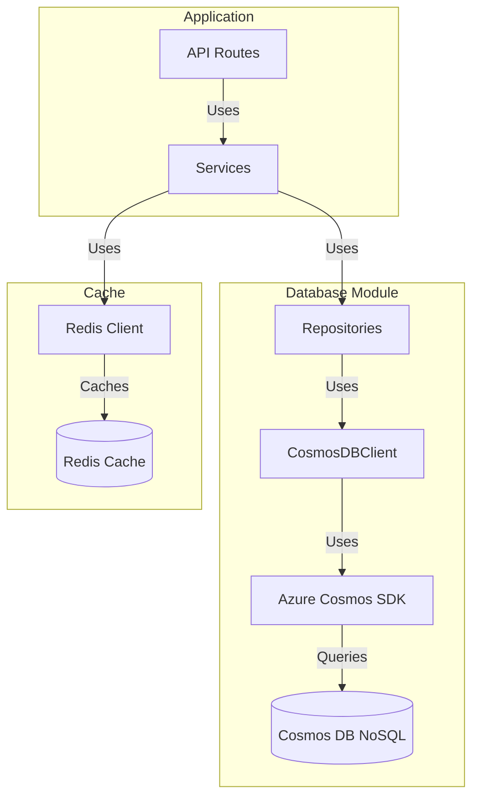
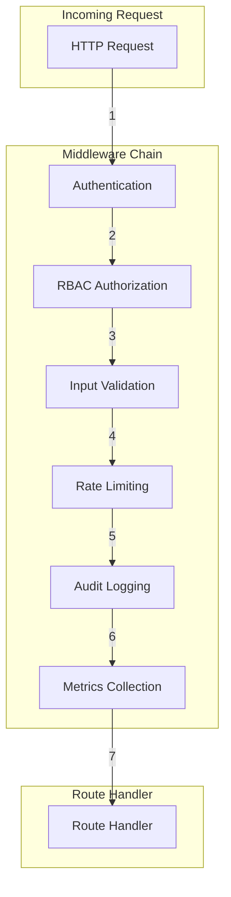
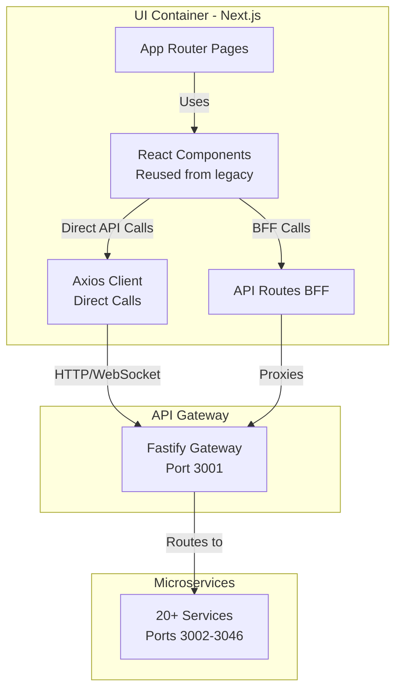

# Infrastructure Architecture

## Overview

This document consolidates all infrastructure-related modules and components that support the Coder IDE platform. These are foundational systems that enable the application to function but are not business logic modules.

## Table of Contents

1. [API Gateway](#1-api-gateway)
2. [Database](#2-database)
3. [Middleware](#3-middleware)
4. [Queue System](#4-queue-system)
5. [Background Jobs](#5-background-jobs)
6. [Routes](#6-routes)
7. [Services](#7-services)
8. [Utils](#8-utils)
9. [Main Process IPC](#9-main-process-ipc)
10. [Main Process Services](#10-main-process-services)
11. [Main Process Utils](#11-main-process-utils)

---

## 1. API Gateway

### Overview

The API Gateway acts as the single entry point for all client requests, routing them to appropriate microservices. It handles authentication, authorization, and request proxying to backend services.

### Location

- **Source**: `server/src/gateway/`
- **Port**: 3000
- **Main Files**:
  - `routes.ts` - Gateway route setup
  - `proxy.ts` - Proxy handler implementation

### Architecture



### Key Features

1. **Request Routing**
   - Route mapping to microservices
   - Path-based routing
   - Service discovery

2. **Authentication**
   - JWT token validation
   - User context extraction
   - Session management

3. **Request Proxying**
   - HTTP request forwarding
   - Header forwarding
   - User context injection

4. **Error Handling**
   - Service unavailable handling
   - Timeout management
   - Error response transformation

### Route Mappings

The gateway maps routes to microservices:

```typescript
const ROUTE_MAPPINGS = {
  '/api/ai': 'ai-service',
  '/api/planning': 'planning',
  '/api/execution': 'execution-service',
  '/api/mcp': 'mcp-server',
  '/api/knowledge': 'knowledge-base',
  '/api/dashboard': 'dashboard',
  '/api/calendar': 'calendar',
  '/api/messaging': 'messaging',
  '/api/logging': 'logging',
  '/api/learning': 'learning-development',
  '/api/collaboration': 'collaboration',
  '/api/quality': 'quality',
  '/api/resource': 'resource-management',
  '/api/workflow': 'workflow',
  '/api/observability': 'observability',
  '/api/notifications': 'notification-manager',
  '/api/prompts': 'prompt-management',
  '/api/secrets': 'secret-management',
  '/api/usage': 'usage-tracking',
  '/api/embeddings': 'embeddings'
};
```

---

## 2. Database

### Overview

The Database module provides database access, connection management, and seed data. It uses Azure Cosmos DB SDK (@azure/cosmos) for type-safe database operations and includes utilities for error handling and retries.

### Location

- **Source**: `containers/shared/src/database/`
- **Main Files**:
  - `CosmosDBClient.ts` - Cosmos DB client wrapper
  - `RedisClient.ts` - Redis client
  - `seed.ts` - Seed data
  - `repositories/` - Module-specific repositories

### Architecture



### Key Features

1. **Database Client**
   - Cosmos DB client initialization
   - Connection management
   - Container management
   - Health checks

2. **Repository Pattern**
   - Module-specific repositories
   - Type-safe operations
   - Query builders
   - Partition key management

3. **Error Handling**
   - Database error categorization
   - Retry logic
   - Error transformation
   - User-friendly error messages

4. **Data Access Layer**
   - Abstracted Cosmos DB operations
   - TypeScript interfaces for type safety
   - Document mapping
   - Query optimization

5. **Seed Data**
   - Initial data seeding
   - Container initialization
   - Development data
   - Index creation

6. **Redis Integration**
   - Redis client
   - Cache operations
   - Session storage
   - Pub/sub support

### Cosmos DB Structure

- **Containers**: One container per module (e.g., `usage`, `ai`, `secret`, `embeddings`)
- **Partition Keys**: Typically `organizationId` or `userId` for multi-tenant isolation
- **Document Types**: Use `type` field within containers to differentiate document types
- **Vector Search**: Built-in vector search support for embeddings

---

## 3. Middleware

### Overview

The Middleware module provides request processing middleware for authentication, authorization, validation, rate limiting, audit logging, and metrics collection.

### Location

- **Source**: `server/src/middleware/`
- **Main Files**:
  - `auth.ts` - Authentication middleware
  - `rbac.ts` - Role-based access control
  - `validation.ts` - Input validation
  - `rateLimiting.ts` - Rate limiting
  - `auditLogging.ts` - Audit logging
  - `metrics.ts` - Metrics collection
  - `apiKeyAuth.ts` - API key authentication

### Architecture



### Key Features

1. **Authentication Middleware**
   - JWT token verification
   - User extraction from token
   - Session validation
   - Token refresh handling

2. **RBAC Middleware**
   - Role-based access control
   - Permission checking
   - Organization/team context
   - Project-level permissions

3. **Validation Middleware**
   - Request body validation
   - Query parameter validation
   - Schema validation with Zod
   - Error formatting

4. **Rate Limiting**
   - Per-user rate limits
   - Per-organization limits
   - IP-based limiting
   - Token bucket algorithm

5. **Audit Logging**
   - Action logging
   - User activity tracking
   - Change tracking
   - Compliance logging

6. **Metrics Collection**
   - Request metrics
   - Response time tracking
   - Error rate monitoring
   - Prometheus integration

---

## 4. Queue System

### Overview

The Queue system provides message queue infrastructure for asynchronous processing and event-driven communication between services.

### Location

- **Source**: `server/src/queue/`
- **Technology**: RabbitMQ
- **Main Files**:
  - `queueClient.ts` - Queue client
  - `publisher.ts` - Event publisher
  - `consumer.ts` - Event consumer

### Key Features

- Event publishing
- Event consumption
- Message routing
- Dead letter queues
- Retry mechanisms

---

## 5. Background Jobs

### Overview

The Background Jobs system provides scheduled and asynchronous job processing.

### Location

- **Source**: `server/src/jobs/`
- **Main Files**:
  - `scheduler.ts` - Job scheduler
  - `jobRunner.ts` - Job execution

### Key Features

- Scheduled jobs
- One-time jobs
- Job retry logic
- Job status tracking

---

## 6. Routes

### Overview

The Routes module provides API route definitions and handlers for all backend endpoints.

### Location

- **Source**: `server/src/routes/`
- **Main Files**:
  - `index.ts` - Route registration
  - Feature-specific route files

### Key Features

- RESTful API routes
- Route organization
- Handler registration
- Middleware integration

---

## 7. Services

### Overview

The Services module provides business logic services that are shared across routes.

### Location

- **Source**: `server/src/services/`
- **Main Files**:
  - Service classes for business logic

### Key Features

- Business logic encapsulation
- Service layer pattern
- Reusable service methods

---

## 8. Utils

### Overview

The Utils module provides utility functions and helpers used throughout the backend.

### Location

- **Source**: `server/src/utils/`
- **Main Files**:
  - Utility functions

### Key Features

- Common utilities
- Helper functions
- Shared logic

---

## 9. UI Container (Next.js Web Application)

### Overview

The UI container provides the user interface for Coder IDE. It is a Next.js application that reuses components and pages from the legacy web app and communicates with microservices via a hybrid pattern (direct API calls + BFF).

### Location

- **Source**: `containers/ui/`
- **Port**: 3000 (configurable via `PORT` environment variable)
- **Technology**: Next.js 16 (App Router), React 19, TypeScript
- **UI Components**: Reused from the legacy web app
- **Pages**: Reused from the legacy web app

### Architecture



### Communication Pattern

**Hybrid Approach** (recommended):

1. **Direct API Calls (90% of operations)**
   - Axios client (`apiClient`) configured with base URL
   - Calls API Gateway (Port 3001) or microservices directly
   - JWT tokens via Authorization header
   - Used for: CRUD operations, data fetching, queries

2. **Next.js API Routes - BFF (10% of operations)**
   - Next.js API routes in `/app/api/`
   - Used for: Authentication, token management, CSRF handling
   - Benefits: Security, server-side token management, data aggregation

### Key Features

1. **Component Reuse**
   - Reuses components and pages from the legacy web app
   - Maintains existing UI patterns and structure
   - No need to rebuild UI components

2. **API Communication**
   - **Direct calls**: Axios client for most operations
   - **BFF pattern**: Next.js API routes for auth/sensitive operations
   - TanStack Query for data fetching and caching
   - WebSocket/SSE for real-time updates

3. **State Management**
   - TanStack Query for server state
   - Zustand for client state (if needed)
   - React Hook Form for form state
   - React Context for global state (auth, theme, i18n)

4. **UI Components**
   - Shadcn/ui component library
   - Tailwind CSS for styling
   - Responsive design patterns
   - Dark mode support

5. **Real-time Communication**
   - WebSocket client for bidirectional communication
   - Server-Sent Events (SSE) for streaming
   - Used for: Real-time notifications, AI streaming, live collaboration

### Project Structure

```
containers/ui/
├── src/
│   ├── app/                    # Next.js App Router
│   │   ├── (auth)/            # Authentication routes
│   │   ├── (protected)/       # Protected routes
│   │   ├── (public)/          # Public routes
│   │   └── api/               # API routes (BFF)
│   ├── components/           # React components (reused from legacy)
│   │   ├── ui/                # Shadcn UI components
│   │   ├── layout/            # Layout components
│   │   └── [features]/       # Feature-specific components
│   ├── hooks/                 # Custom React hooks
│   ├── lib/                   # Utilities and helpers
│   │   ├── api/              # API client configuration
│   │   └── realtime/         # WebSocket/SSE clients
│   ├── contexts/              # React contexts
│   ├── types/                 # TypeScript types
│   └── locales/              # i18n translations
├── public/                    # Static assets
├── Dockerfile                 # Container definition
├── package.json
└── next.config.ts
```

### Environment Configuration

```bash
# Port configuration
PORT=3000

# API Gateway URL
NEXT_PUBLIC_API_BASE_URL=http://localhost:3001

# Other environment variables
NEXT_PUBLIC_APP_NAME=Coder IDE
```

### Port Configuration Recommendation

- **UI Container**: Port 3000 (Next.js app)
- **API Gateway**: Port 3001 (Fastify)
- **Microservices**: Ports 3002-3046

This separation allows:
- Independent scaling of UI and backend
- Clear separation of concerns
- Easy development (different ports)
- Production deployment flexibility

---

## Related Documentation

- [Module Overview](./ModuleOverview.md) - System-wide module overview
- [Module Implementation Guide](./ModuleImplementationGuide.md) - Module development standards


