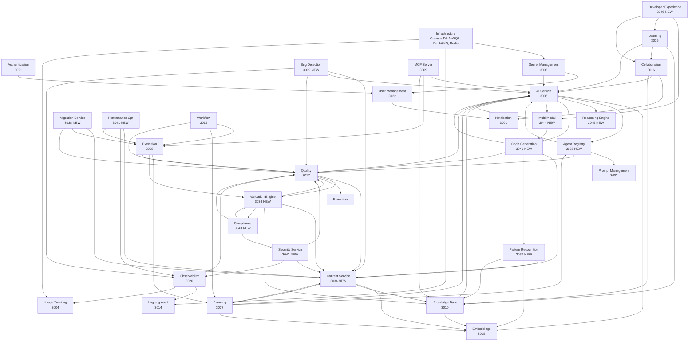

# Module Overview

## Overview

This document defines the module architecture, responsibilities, and implementation standards for the Coder IDE system. All modules are designed to be **reusable**, **configurable**, and **independently deployable**.

---

## Module Categories

### Core Modules (Always Required)

Core modules provide foundational functionality that all applications need. They must be present for the system to operate.

| Module | Port | Purpose |
|--------|------|---------|
| **Authentication** | 3021 | User authentication, session management, OAuth/SSO |
| **User Management** | 3022 | User profiles, organizations, teams, RBAC |
| **Secret Management** | 3003 | Secure credential storage, encryption, rotation |
| **Logging** | 3014 | Audit logs, compliance logging, action tracking |
| **Notification** | 3001 | Multi-channel notifications (email, push, in-app) |

### Extension Modules (Optional)

Extension modules add specialized functionality. Applications can enable/disable them based on needs.

| Module | Port | Purpose | Dependencies |
|--------|------|---------|--------------|
| **AI Service** | 3006 | LLM completions, model routing | Secret Management |
| **Embeddings** | 3005 | Vector embeddings, semantic search | AI Service |
| **Shard Manager** | 3023 | Core data model management, shard CRUD | Logging, User Management |
| **Document Manager** | 3024 | Document/file management and storage | Shard Manager, Logging, User Management |
| **Pipeline Manager** | 3025 | Sales pipeline and opportunity management | Shard Manager, Logging, User Management |
| **Integration Manager** | 3026 | Third-party integrations and webhooks | Shard Manager, Logging, User Management, Secret Management |
| **AI Insights** | 3027 | AI-powered insights and recommendations | AI Service, Shard Manager, Embeddings, Logging |
| **Content Generation** | 3028 | AI-powered content generation | AI Service, Shard Manager, Logging |
| **Search Service** | 3029 | Advanced search and vector search | Embeddings, Shard Manager, Logging |
| **Analytics Service** | 3030 | Analytics and reporting | Shard Manager, Logging, User Management |
| **Collaboration Service** | 3031 | Real-time collaboration features | Shard Manager, Logging, User Management |
| **Configuration Service** | 3034 | Centralized configuration management | Logging, Secret Management |
| **Cache Service** | 3035 | Caching and cache management | Logging |
| **Prompt Service** | 3036 | Prompt management and A/B testing | AI Service, Logging |
| **Template Service** | 3037 | Template management | Logging |
| **Adaptive Learning** | 3032 | CAIS adaptive learning system (22 services) | AI Service, Shard Manager, Logging |
| **ML Service** | 3033 | Machine learning model management | AI Service, Logging |


---

## Module Responsibilities

### Core Module Details

#### Authentication
**Responsibility**: Identity verification and session lifecycle

- User authentication (email/password, OAuth, SSO/SAML)
- Session creation, validation, and revocation
- Token management (JWT, refresh tokens)
- Multi-factor authentication
- Account lockout and security policies
- Password management (reset, change, history)
- Email verification
- OAuth provider linking/unlinking

**Service**: `containers/auth/`  
**Port**: 3021  
**API Base**: `/api/v1/auth`  
**Database**: Cosmos DB NoSQL (containers: `auth_sessions`, `auth_tokens`, `auth_providers`, etc.)  
**Does NOT include**: User profile management, authorization/permissions

#### User Management
**Responsibility**: User data and organizational structure

- User profiles and preferences
- User session management (list, revoke)
- User account lifecycle (deactivate, reactivate, delete)
- Organization and team management
- Role and permission definitions (RBAC)
- Organization membership
- User settings and configurations

**Service**: `containers/user-management/`  
**Port**: 3022  
**API Base**: `/api/v1/users`  
**Database**: Cosmos DB NoSQL (containers: `user_users`, `user_organizations`, `user_teams`, etc.)  
**Does NOT include**: Authentication logic, session creation (handled by auth service)

#### Secret Management
**Responsibility**: Secure storage of sensitive data

- Secret encryption (AES-256-GCM)
- Key management and rotation
- Vault backends (Local, Azure Key Vault, AWS Secrets Manager, HashiCorp Vault)
- Access control and audit logging
- Secret versioning and lifecycle

**Does NOT include**: Application configuration, feature flags

#### Logging (Audit)
**Responsibility**: Compliance and audit trail

- User action audit logs
- Security event logging
- Data access logging
- Compliance reporting
- Log retention and archival

**Service**: `containers/logging/`  
**Port**: 3014  
**API Base**: `/api/v1/logs`  
**Database**: Cosmos DB NoSQL (containers: `audit_logs`, `audit_retention_policies`, etc.)  
**Does NOT include**: Application performance logs, error tracking (see Observability)

#### Notification
**Responsibility**: Multi-channel message delivery

- Email notifications (transactional, bulk)
- Push notifications (web, mobile)
- In-app notifications
- SMS notifications
- Notification preferences and templates
- Delivery tracking and retry

**Does NOT include**: Real-time messaging (see Messaging)

### Extension Module Details

#### AI Service
**Responsibility**: LLM integration and routing

- Multi-provider support (OpenAI, Anthropic, local models)
- Model selection and routing
- Rate limiting and budget management
- Streaming completions
- Agent execution

**Enhanced Capabilities:**
- **Model Orchestration**: Multi-model strategy, cascading complexity, model voting, ensemble predictions, cost optimization
- **Agent Coordination**: Multi-agent debate system, consensus mechanisms, hierarchical coordination, adversarial validation
- **Self-Improvement**: Model fine-tuning on codebase, performance optimization, A/B testing, quality improvement tracking

**Service**: `containers/ai-service/`  
**Port**: 3006  
**API Base**: `/api/v1/ai`  
**Dependencies**: Secret Management, Prompt Management, Observability, Usage Tracking

#### Observability
**Responsibility**: Application monitoring and debugging

- Distributed tracing
- Performance metrics (APM)
- Error tracking and aggregation
- Log aggregation from services
- Health monitoring and alerts
- Custom dashboards

**Enhanced Capabilities:**
- **AI System Monitoring**: Generation quality metrics, model performance tracking, agent effectiveness, error tracking, cost tracking
- **Code Health Monitoring**: Technical debt tracking, code quality trends, test coverage trends, performance trends, security posture
- **Real-Time Feedback**: Live code analysis, instant validation, proactive warnings, performance hints

**Differs from Logging**: Observability tracks application behavior; Logging tracks user/audit actions.

**Service**: `containers/observability/`  
**Port**: 3020  
**API Base**: `/api/v1/observability`  
**Dependencies**: Logging, Quality, Usage Tracking, Dashboard

#### Planning
**Responsibility**: Project and task management

- Plan creation and validation
- Project management
- Task management and dependencies
- Roadmap and milestone tracking
- Issue tracking
- Architecture and technical debt

**Enhanced Capabilities:**
- **Intent Understanding**: Natural language requirement parsing, code intent extraction, ambiguity resolution, goal inference
- **Planning & Decomposition**: Task decomposition, dependency ordering, parallel execution planning, risk assessment, impact analysis
- **Predictive Capabilities**: Issue prediction, maintenance prediction, performance bottleneck prediction, code evolution prediction

**Service**: `containers/planning/`  
**Port**: 3007  
**API Base**: `/api/v1/planning`  
**Dependencies**: Embeddings, AI Service, Execution, Knowledge Base

#### Execution
**Responsibility**: Plan execution engine

- Step-by-step execution
- Checkpoint and rollback
- Execution history
- Progress tracking
- Error recovery

**Enhanced Capabilities:**
- **Safe Execution Environment**: Sandboxed execution, checkpoint & restore, rollback mechanisms, dry-run mode, diff preview
- **Continuous Verification**: Real-time type checking, incremental compilation, live testing, runtime monitoring, performance profiling
- **Self-Correction & Learning**: Error detection & recovery, iterative refinement, feedback loop integration, confidence scoring

**Service**: `containers/execution-service/`  
**Port**: 3008  
**API Base**: `/api/v1/execution`  
**Dependencies**: Planning, Quality, Observability, Workflow

#### Embeddings
**Responsibility**: Vector embeddings and semantic search

- Semantic code embeddings for files/functions
- Cross-module relationship mapping
- Historical context (git history embeddings)
- Business domain modeling

**Enhanced Capabilities:**
- **Multi-Level Context Analysis**: Semantic code embeddings, cross-module relationship mapping, historical context, business domain modeling
- **Knowledge Retrieval**: Semantic search across codebase, example-based search, similar code detection, question answering
- **Dynamic Context Assembly**: Smart context window management, relevance scoring, context compression, multi-hop reasoning

**Service**: `containers/embeddings/`  
**Port**: 3005  
**API Base**: `/api/v1/embeddings`  
**Database**: Cosmos DB NoSQL  
**Dependencies**: AI Service, Knowledge Base, Planning

#### MCP Server
**Responsibility**: Model Context Protocol and tool orchestration

- IDE integration (VSCode, IntelliJ)
- Git integration
- CI/CD integration
- Issue tracker integration

**Enhanced Capabilities:**
- **Tool Integration**: IDE integration, Git integration, CI/CD integration, issue tracker integration
- **Data Source Integration**: External APIs, database introspection, file system access, environment variables
- **Output Integration**: Pull request generation, issue creation, documentation updates, deployment automation

**Service**: `containers/mcp-server/`  
**Port**: 3009  
**API Base**: `/api/v1/mcp`  
**Dependencies**: AI Service, Execution, Knowledge Base

#### Knowledge Base
**Responsibility**: Documentation, wiki, and search

- Decision history (ADRs)
- Pattern library
- Lessons learned
- Team expertise mapping
- Code ownership tracking

**Enhanced Capabilities:**
- **Organizational Memory**: Decision history (ADRs), pattern library, lessons learned, team expertise mapping, code ownership tracking
- **Living Documentation**: Auto-generated documentation, architecture diagrams, API documentation, dependency graphs, changelog generation
- **External Knowledge Integration**: Framework-specific knowledge, library API documentation, best practices databases, bug pattern databases

**Service**: `containers/knowledge-base/`  
**Port**: 3010  
**API Base**: `/api/v1/knowledge`  
**Dependencies**: Embeddings, AI Service, Planning, Collaboration

#### Quality
**Responsibility**: Quality assurance and validation

- Syntax validation
- Semantic validation
- Security validation
- Performance validation
- Accessibility validation

**Enhanced Capabilities:**
- **Multi-Stage Validation Pipeline**: Syntax, semantic, security, performance, accessibility validation
- **Automated Testing at Scale**: Unit test generation, integration test generation, E2E test generation, mutation testing, property-based testing
- **Static Analysis at Depth**: Advanced linting, type safety verification, dead code detection, code complexity metrics, maintainability index
- **Post-Generation Validation**: Compiler verification, test suite execution, integration testing, security scanning, code review simulation

**Service**: `containers/quality/`  
**Port**: 3017  
**API Base**: `/api/v1/quality`  
**Dependencies**: AI Service, Execution, Observability, Validation Engine

#### Prompt Management
**Responsibility**: Prompt templates and versioning

- Prompt template management
- Version control
- A/B testing

**Enhanced Capabilities:**
- **Multi-Agent Specialization**: Agent-specific prompt templates, specialized prompts per task type, prompt versioning and A/B testing
- **Advanced Reasoning**: Chain-of-thought prompts, tree-of-thought templates, reasoning pattern library

**Service**: `containers/prompt-management/`  
**Port**: 3002  
**API Base**: `/api/v1/prompts`  
**Dependencies**: AI Service, Quality, Usage Tracking

#### Workflow
**Responsibility**: Workflow orchestration and automation

- Workflow definition and execution
- Task distribution
- Progress tracking

**Enhanced Capabilities:**
- **Governance & Control**: Approval workflows, policy enforcement, quality gates, audit trails
- **Team Coordination**: Work distribution, progress tracking, notification system

**Service**: `containers/workflow/`  
**Port**: 3019  
**API Base**: `/api/v1/workflow`  
**Dependencies**: Execution, Planning, Messaging, Quality

#### Collaboration
**Responsibility**: Pair programming and shared workspaces

- Shared workspace context
- Real-time collaboration
- Communication channels

**Enhanced Capabilities:**
- **Human-AI Collaboration**: Suggestion mode, explanation generation, interactive refinement, confidence indicators, alternative solutions
- **Explainability**: Change explanations, decision rationale, risk assessments, impact analysis

**Service**: `containers/collaboration/`  
**Port**: 3016  
**API Base**: `/api/v1/collaboration`  
**Dependencies**: Messaging, AI Service, Knowledge Base

#### Learning
**Responsibility**: Learning paths and skill tracking

- Learning path management
- Skill assessment
- Tutorial system

**Enhanced Capabilities:**
- **Learning & Onboarding**: Interactive tutorials, contextual help, example library, skill gap identification, personalized learning paths

**Service**: `containers/learning-development/`  
**Port**: 3015  
**API Base**: `/api/v1/learning`  
**Dependencies**: Knowledge Base, Collaboration, AI Service

#### Resource Management
**Responsibility**: Capacity planning and allocation

- Resource allocation optimization
- Workload balancing
- Capacity forecasting

**Enhanced Capabilities:**
- **Performance Optimization** (Partial): Resource allocation optimization, workload balancing

**Service**: `containers/resource-management/`  
**Port**: 3018  
**API Base**: `/api/v1/resources`  
**Dependencies**: - 

#### Usage Tracking
**Responsibility**: Metering, quotas, and billing

- Usage metering
- Quota management
- Billing integration

**Enhanced Capabilities:**
- **AI System Monitoring** (Cost aspect): API cost tracking, model usage tracking, budget management

**Service**: `containers/usage-tracking/`  
**Port**: 3004  
**API Base**: `/api/v1/usage`  
**Dependencies**: - 

### New Extension Module Details (From API Breakdown)

#### Shard Manager
**Responsibility**: Core data model management

- Shard CRUD operations
- ShardType management (schema definitions)
- Relationship graph management
- Bulk operations
- Versioning and revision history

**Service**: `containers/shard-manager/`  
**Port**: 3023  
**API Base**: `/api/v1/shards`  
**Database**: Cosmos DB NoSQL (containers: `shard_shards`, `shard_types`, `shard_revisions`, `shard_edges`, `shard_relationships`)  
**Dependencies**: Logging, User Management

#### Document Manager
**Responsibility**: Document and file management

- Document CRUD operations
- File upload/download (Azure Blob Storage)
- Chunked upload for large files
- Document collections
- Document templates

**Service**: `containers/document-manager/`  
**Port**: 3024  
**API Base**: `/api/v1/documents`  
**Database**: Cosmos DB NoSQL (containers: `document_documents`, `document_collections`, `document_templates`)  
**Storage**: Azure Blob Storage  
**Dependencies**: Shard Manager, Logging, User Management

#### Pipeline Manager
**Responsibility**: Sales pipeline and opportunity management

- Pipeline views and visualization
- Opportunity CRUD operations
- Pipeline analytics and forecasting
- Opportunity auto-linking

**Service**: `containers/pipeline-manager/`  
**Port**: 3025  
**API Base**: `/api/v1/pipelines`, `/api/v1/opportunities`  
**Database**: Cosmos DB NoSQL (containers: `pipeline_opportunities`, `pipeline_views`)  
**Dependencies**: Shard Manager, Logging, User Management

#### Integration Manager
**Responsibility**: Third-party integrations and webhooks

- Integration CRUD operations
- Webhook management and delivery
- Sync task management
- Integration catalog
- Custom integrations

**Service**: `containers/integration-manager/`  
**Port**: 3026  
**API Base**: `/api/v1/integrations`, `/api/v1/webhooks`, `/api/v1/sync-tasks`  
**Database**: Cosmos DB NoSQL (containers: `integration_providers`, `integration_integrations`, `integration_connections`, `integration_webhooks`, etc.)  
**Dependencies**: Shard Manager, Logging, User Management, Secret Management

#### AI Insights
**Responsibility**: AI-powered insights and recommendations

- AI insight generation
- Proactive insights
- Collaborative insights
- Risk analysis

**Service**: `containers/ai-insights/`  
**Port**: 3027  
**API Base**: `/api/v1/insights`  
**Database**: Cosmos DB NoSQL (containers: `ai_insights`, `ai_proactive_insights`, `ai_collaborative_insights`, `ai_risk_analysis`)  
**Dependencies**: AI Service, Shard Manager, Embeddings, Logging

#### Content Generation
**Responsibility**: AI-powered content generation

- Content generation using AI models
- Template-based generation

**Service**: `containers/content-generation/`  
**Port**: 3028  
**API Base**: `/api/v1/content`  
**Database**: Cosmos DB NoSQL (containers: `content_generation_jobs`)  
**Dependencies**: AI Service, Shard Manager, Logging

#### Search Service
**Responsibility**: Advanced search and vector search

- Vector search using embeddings
- Advanced full-text search
- Search analytics

**Service**: `containers/search-service/`  
**Port**: 3029  
**API Base**: `/api/v1/search`  
**Database**: Cosmos DB NoSQL (containers: `search_queries`, `search_analytics`)  
**Dependencies**: Embeddings, Shard Manager, Logging

#### Analytics Service
**Responsibility**: Analytics and reporting

- General analytics and metrics
- Project analytics
- AI analytics
- API performance metrics

**Service**: `containers/analytics-service/`  
**Port**: 3030  
**API Base**: `/api/v1/analytics`  
**Database**: Cosmos DB NoSQL (containers: `analytics_metrics`, `analytics_reports`)  
**Dependencies**: Shard Manager, Logging, User Management

#### Collaboration Service
**Responsibility**: Real-time collaboration features

- Real-time collaboration
- Conversation management

**Service**: `containers/collaboration-service/`  
**Port**: 3031  
**API Base**: `/api/v1/collaboration`  
**Database**: Cosmos DB NoSQL (containers: `collaboration_conversations`, `collaboration_messages`)  
**Dependencies**: Shard Manager, Logging, User Management

#### Configuration Service
**Responsibility**: Centralized configuration management

- Configuration storage and retrieval

**Service**: `containers/configuration-service/`  
**Port**: 3034  
**API Base**: `/api/v1/configuration`  
**Database**: Cosmos DB NoSQL (containers: `configuration_settings`)  
**Dependencies**: Logging, Secret Management

#### Cache Service
**Responsibility**: Caching and cache management

- Cache administration
- Cache optimization
- Cache warming

**Service**: `containers/cache-service/`  
**Port**: 3035  
**API Base**: `/api/v1/cache`  
**Storage**: Redis  
**Dependencies**: Logging

#### Prompt Service
**Responsibility**: Prompt management and A/B testing

- Prompt CRUD operations
- A/B testing
- Prompt analytics

**Service**: `containers/prompt-service/`  
**Port**: 3036  
**API Base**: `/api/v1/prompts`  
**Database**: Cosmos DB NoSQL (containers: `prompt_prompts`, `prompt_ab_tests`, `prompt_analytics`)  
**Dependencies**: AI Service, Logging

#### Template Service
**Responsibility**: Template management

- Template CRUD operations
- Context templates
- Email templates
- Document templates

**Service**: `containers/template-service/`  
**Port**: 3037  
**API Base**: `/api/v1/templates`  
**Database**: Cosmos DB NoSQL (containers: `template_templates`, `template_context_templates`, `template_email_templates`)  
**Dependencies**: Logging

#### Adaptive Learning Service
**Responsibility**: CAIS adaptive learning system

- Adaptive weight learning (learns optimal component weights)
- Adaptive model selection (selects best model automatically)
- Signal weighting (learns optimal signal weights)
- Feature engineering (context-aware feature engineering)
- Outcome collection (collects predictions and outcomes)
- Performance tracking (tracks component performance)
- Validation (validates learned parameters)
- Rollout management (manages gradual rollout)
- 22 CAIS services across 7 phases

**Service**: `containers/adaptive-learning/`  
**Port**: 3032  
**API Base**: `/api/v1/adaptive-learning`, `/api/v1/cais-services`  
**Database**: Cosmos DB NoSQL (containers: `adaptive_weights`, `adaptive_model_selections`, `adaptive_outcomes`, `adaptive_performance`, `adaptive_validations`, `adaptive_rollouts`)  
**Dependencies**: AI Service, Shard Manager, Logging

#### ML Service
**Responsibility**: Machine learning model management

- Feature store management
- Model versioning and deployment
- Training job management
- Model evaluation and metrics
- Model calibration
- Synthetic data generation
- Risk scoring predictions
- Revenue forecasting
- ML-based recommendations

**Service**: `containers/ml-service/`  
**Port**: 3033  
**API Base**: `/api/v1/ml`  
**Database**: Cosmos DB NoSQL (containers: `ml_models`, `ml_features`, `ml_training_jobs`, `ml_evaluations`, `ml_predictions`)  
**Dependencies**: AI Service, Logging

### New Extension Module Details

#### Context Service
**Responsibility**: Centralized context management and assembly

- Full codebase graph analysis
- AST extraction
- Dependency trees
- Call graphs
- Runtime behavior analysis

**Features Handled:**
- **Multi-Level Context Analysis**: Full codebase graph analysis, AST extraction, dependency trees, call graphs, runtime behavior analysis
- **Dynamic Context Assembly**: Smart context window management, just-in-time context loading, token budgeting, context compression

**Service**: `containers/context-service/`  
**Port**: 3034  
**API Base**: `/api/v1/context`  
**Dependencies**: Embeddings, Planning, Knowledge Base, AI Service

**Architecture Sub-Modules:**
- AST analyzer
- Graph builder
- Dependency tracker
- Context assembler
- Token budgeter
- Cache manager
- Relevance scorer

#### Agent Registry
**Responsibility**: Manage specialized AI agents

- Architecture agent
- Security agent
- Performance agent
- Testing agent
- Documentation agent
- 15+ specialized agents

**Features Handled:**
- **Multi-Agent Specialization**: Architecture, security, performance, testing, documentation, refactoring, database, API design, UI/UX, DevOps, code review, migration agents

**Service**: `containers/agent-registry/`  
**Port**: 3035  
**API Base**: `/api/v1/agents`  
**Dependencies**: AI Service, Prompt Management, Quality, Observability

**Architecture Sub-Modules:**
- Agent selector
- Agent loader
- Agent monitor
- Agent updater

#### Validation Engine
**Responsibility**: Comprehensive validation across all dimensions

- Syntax validation
- Semantic validation
- Architecture validation
- Security validation
- Performance validation
- Cross-module consistency checking

**Features Handled:**
- **Multi-Stage Validation Pipeline**: Syntax, semantic, architecture, security, performance validation
- **Standards & Conventions**: Coding standards enforcement
- **Cross-Module Consistency**: Consistency checking across modules

**Service**: `containers/validation-engine/`  
**Port**: 3036  
**API Base**: `/api/v1/validation`  
**Dependencies**: Quality, Context Service, Knowledge Base, Compliance Service

**Architecture Sub-Modules:**
- Syntax validator
- Semantic validator
- Architecture validator
- Security validator
- Performance validator
- Consistency checker
- Standards enforcer
- Policy validator
- Custom rules

#### Pattern Recognition
**Responsibility**: Learn and enforce codebase patterns

- Codebase pattern learning
- Style consistency
- Design pattern detection
- Anti-pattern detection

**Features Handled:**
- **Pattern Recognition & Enforcement**: Codebase pattern learning, style consistency, design pattern detection, anti-pattern detection

**Service**: `containers/pattern-recognition/`  
**Port**: 3037  
**API Base**: `/api/v1/patterns`  
**Dependencies**: Context Service, Embeddings, Knowledge Base, Quality

**Architecture Sub-Modules:**
- Pattern learner
- Pattern matcher
- Pattern enforcer
- Style analyzer
- Design detector
- Antipattern detector
- Pattern library
- Consistency scorer

#### Migration Service
**Responsibility**: Handle code migrations and refactoring

- Version upgrade automation
- Breaking change handling
- Large-scale refactoring
- Tech stack migration

**Features Handled:**
- **Code Migration & Refactoring**: Version upgrade automation, breaking change handling, large-scale refactoring, tech stack migration

**Service**: `containers/migration-service/`  
**Port**: 3038  
**API Base**: `/api/v1/migration`  
**Dependencies**: Context Service, Execution, Quality, Knowledge Base

**Architecture Sub-Modules:**
- Version upgrader
- Breaking change handler
- Refactoring engine
- Stack migrator
- Database migrator
- API migrator
- Migration validator

#### Bug Detection
**Responsibility**: Detect and fix bugs proactively

- Anomaly detection
- Bug prediction
- Root cause analysis
- Auto-fix suggestions

**Features Handled:**
- **Bug Detection & Fixing**: Anomaly detection, bug prediction, root cause analysis, auto-fix suggestions

**Service**: `containers/bug-detection/`  
**Port**: 3039  
**API Base**: `/api/v1/bugs`  
**Dependencies**: Context Service, Quality, Observability, AI Service

**Architecture Sub-Modules:**
- Anomaly detector
- Bug predictor
- Root cause analyzer
- Auto-fixer
- Regression detector
- Vulnerability patcher
- Performance fixer

#### Code Generation
**Responsibility**: Specialized code generation tasks

- UI component generation
- API endpoint generation
- Database schema generation
- Test data generation
- Configuration generation

**Features Handled:**
- **Code Generation Specialties**: UI component generation, API endpoint generation, database schema generation, test data generation, configuration generation

**Service**: `containers/code-generation/`  
**Port**: 3040  
**API Base**: `/api/v1/generate`  
**Dependencies**: AI Service, Context Service, Quality, Pattern Recognition

**Architecture Sub-Modules:**
- UI generator
- API generator
- Schema generator
- Test data generator
- Config generator
- Migration generator
- IaC generator
- Generation validator

#### Performance Optimization
**Responsibility**: Optimize code performance

- Code optimization
- Bundle size optimization
- Database query optimization
- Algorithm selection
- Memory optimization

**Features Handled:**
- **Performance Optimization**: Code optimization, bundle size optimization, database query optimization, algorithm selection, memory optimization

**Service**: `containers/performance-optimization/`  
**Port**: 3041  
**API Base**: `/api/v1/optimize`  
**Dependencies**: Context Service, Observability, Execution, Quality

**Architecture Sub-Modules:**
- Code optimizer
- Bundle optimizer
- Query optimizer
- Algorithm selector
- Memory optimizer
- Network optimizer
- Render optimizer
- Profiler

#### Security Service
**Responsibility**: Security analysis and protection

- Code obfuscation
- Secret scanning
- Vulnerability scanning
- PII detection
- SAST/DAST/SCA

**Features Handled:**
- **Security Features**: Code obfuscation, secret scanning, vulnerability scanning, PII detection, SAST/DAST/SCA
- **Privacy Protection**: PII detection, data encryption, privacy compliance

**Service**: `containers/security-service/`  
**Port**: 3042  
**API Base**: `/api/v1/security`  
**Dependencies**: Context Service, Quality, Observability, Workflow

**Architecture Sub-Modules:**
- Secret scanner
- Vulnerability scanner
- PII detector
- Obfuscator
- Compliance checker
- Encryption manager
- Audit logger
- Threat detector

#### Compliance Service
**Responsibility**: Ensure regulatory and policy compliance

- Industry standards (WCAG, OWASP, etc.)
- Regulatory compliance (GDPR, HIPAA, SOC2)
- Policy management

**Features Handled:**
- **Standards & Conventions** (Partial): Industry standards (WCAG, OWASP), regulatory compliance (GDPR, HIPAA, SOC2)

**Service**: `containers/compliance-service/`  
**Port**: 3043  
**API Base**: `/api/v1/compliance`  
**Dependencies**: Quality, Security Service, Validation Engine, Workflow

**Architecture Sub-Modules:**
- Standards checker
- Regulation enforcer
- Accessibility checker
- Security standards
- Privacy compliance
- Audit reporter
- Policy manager

#### Multi-Modal Service
**Responsibility**: Handle multi-modal inputs (images, diagrams, audio, video)

- Image understanding (designs → code)
- Diagram understanding (architecture → code)
- Audio understanding (voice commands)
- Video understanding (tutorials → implementation)

**Features Handled:**
- **Multi-Modal Understanding**: Image understanding, diagram understanding, audio understanding, video understanding

**Service**: `containers/multi-modal-service/`  
**Port**: 3044  
**API Base**: `/api/v1/multimodal`  
**Dependencies**: AI Service, Code Generation, Context Service

**Architecture Sub-Modules:**
- Image processor
- Diagram parser
- Audio transcriber
- Video analyzer
- Design-to-code
- Whiteboard parser
- Modal router

#### Reasoning Engine
**Responsibility**: Advanced reasoning capabilities

- Chain-of-thought reasoning
- Tree-of-thought exploration
- Analogical reasoning
- Counterfactual reasoning
- Causal reasoning

**Features Handled:**
- **Advanced Reasoning**: Chain-of-thought reasoning, tree-of-thought exploration, analogical reasoning, counterfactual reasoning, causal reasoning

**Service**: `containers/reasoning-engine/`  
**Port**: 3045  
**API Base**: `/api/v1/reasoning`  
**Dependencies**: AI Service, Prompt Management, Knowledge Base

**Architecture Sub-Modules:**
- Chain-of-thought
- Tree explorer
- Analogy finder
- Counterfactual
- Causal analyzer
- Probabilistic
- Meta-reasoner

#### Developer Experience
**Responsibility**: Optimize developer experience

- Natural language interface
- Visual interface
- Voice interface
- Instant feedback
- Progressive disclosure

**Features Handled:**
- **Developer Experience**: Natural language interface, visual interface, voice interface, instant feedback, progressive disclosure
- **Learning & Onboarding** (Shared with Learning): Interactive tutorials, contextual help

**Service**: `containers/developer-experience/`  
**Port**: 3046  
**API Base**: `/api/v1/devex`  
**Dependencies**: Multi-Modal Service, Learning, Collaboration, AI Service

**Architecture Sub-Modules:**
- NLP interface
- Visual builder
- Voice interface
- Feedback engine
- Customization
- Tutorial system
- Help system

---

## Implementation Rules

### 1. Module Independence

```
┌─────────────────────────────────────────────────────────────┐
│                        ALLOWED                               │
├─────────────────────────────────────────────────────────────┤
│ • Import shared types/interfaces from @coder/shared         │
│ • Communicate via REST API or events (RabbitMQ)             │
│ • Use shared utilities (validation, logging, auth)          │
│ • Reference other modules by service URL (config-driven)    │
└─────────────────────────────────────────────────────────────┘

┌─────────────────────────────────────────────────────────────┐
│                       FORBIDDEN                              │
├─────────────────────────────────────────────────────────────┤
│ • Direct imports from another module's internal code        │
│ • Hardcoded service URLs or ports                           │
│ • Direct database access to another module's tables         │
│ • Tight coupling to specific implementation details         │
└─────────────────────────────────────────────────────────────┘
```

### 2. Configuration Standards

Every module MUST be configurable via **JSON/YAML config files**.

```yaml
# config/module-name.config.yaml
module:
  name: notification
  version: 1.0.0
  enabled: true

server:
  port: ${PORT:-3001}
  host: ${HOST:-0.0.0.0}

database:
  url: ${DATABASE_URL}
  pool_size: 10

# Module-specific settings
notification:
  providers:
    email:
      enabled: true
      provider: sendgrid  # sendgrid | ses | smtp
    push:
      enabled: false
      provider: firebase
    sms:
      enabled: false
      provider: twilio

  defaults:
    retry_attempts: 3
    retry_delay_ms: 1000

# Feature flags
features:
  email_templates: true
  delivery_tracking: true
```

**Configuration Priority** (highest to lowest):
1. Environment variables (for secrets and deployment-specific)
2. Config files (for module behavior)
3. Database settings (for runtime-changeable settings)
4. Default values (hardcoded fallbacks)

### 3. Abstraction Layer Pattern

Every external integration MUST use an abstraction layer.

```typescript
// ✅ CORRECT: Abstraction with pluggable providers
// src/services/providers/IEmailProvider.ts
export interface IEmailProvider {
  send(options: EmailOptions): Promise<EmailResult>;
  sendBulk(options: BulkEmailOptions): Promise<BulkEmailResult>;
  getDeliveryStatus(id: string): Promise<DeliveryStatus>;
}

// src/services/providers/SendGridProvider.ts
export class SendGridProvider implements IEmailProvider {
  // SendGrid-specific implementation
}

// src/services/providers/SESProvider.ts
export class SESProvider implements IEmailProvider {
  // AWS SES-specific implementation
}

// src/services/providers/SMTPProvider.ts
export class SMTPProvider implements IEmailProvider {
  // Generic SMTP implementation
}

// src/services/providers/ProviderFactory.ts
export function createEmailProvider(config: EmailConfig): IEmailProvider {
  switch (config.provider) {
    case 'sendgrid': return new SendGridProvider(config);
    case 'ses': return new SESProvider(config);
    case 'smtp': return new SMTPProvider(config);
    default: throw new Error(`Unknown provider: ${config.provider}`);
  }
}
```

```typescript
// ❌ WRONG: Direct integration without abstraction
import sgMail from '@sendgrid/mail';

export class NotificationService {
  async sendEmail(to: string, subject: string, body: string) {
    await sgMail.send({ to, subject, html: body }); // Tightly coupled!
  }
}
```

### 4. API Contract Standards

Every module MUST define its API contract.

**OpenAPI Specification Required**:
```yaml
# openapi.yaml (in module root)
openapi: 3.0.3
info:
  title: Notification Service API
  version: 1.0.0
  description: Multi-channel notification delivery service

servers:
  - url: /api/v1
    description: API v1

paths:
  /notifications:
    post:
      summary: Send a notification
      operationId: sendNotification
      tags: [Notifications]
      # ... full spec
```

**API Versioning**:
- URL-based versioning: `/api/v1/`, `/api/v2/`
- Maintain backward compatibility within major versions
- Deprecation notice 2 versions before removal

### 5. Testing Requirements

| Test Type | Coverage | Mandatory |
|-----------|----------|-----------|
| Unit Tests | ≥ 80% | ✅ Yes |
| Integration Tests | Critical paths | ✅ Yes |
| API Contract Tests | All endpoints | ✅ Yes |
| E2E Tests | Happy paths | Optional |
| Performance Tests | Key operations | Optional |

```typescript
// Unit test example
describe('NotificationService', () => {
  it('should send email notification', async () => {
    const mockProvider = createMockEmailProvider();
    const service = new NotificationService(mockProvider);
    
    await service.send({ type: 'email', to: 'user@example.com', ... });
    
    expect(mockProvider.send).toHaveBeenCalledWith(expect.objectContaining({
      to: 'user@example.com'
    }));
  });
});

// Integration test example
describe('POST /api/v1/notifications', () => {
  it('should create and queue notification', async () => {
    const response = await request(app)
      .post('/api/v1/notifications')
      .send({ type: 'email', to: 'user@example.com', ... });
    
    expect(response.status).toBe(202);
    expect(response.body).toHaveProperty('id');
  });
});
```

### 6. Documentation Requirements

Every module MUST include:

```
module-name/
├── README.md              # Setup, configuration, usage
├── CHANGELOG.md           # Version history
├── docs/
│   ├── openapi.yaml       # API specification
│   ├── architecture.md    # Architecture decisions
│   └── examples/          # Usage examples
```

**README.md Template**:
```markdown
# Module Name

## Overview
Brief description of what this module does.

## Features
- Feature 1
- Feature 2

## Quick Start
\`\`\`bash
# Installation
npm install

# Configuration
cp config/default.yaml config/local.yaml
# Edit config/local.yaml

# Run
npm start
\`\`\`

## Configuration
| Key | Type | Default | Description |
|-----|------|---------|-------------|
| ... | ... | ... | ... |

## API Reference
See [OpenAPI Spec](./openapi.yaml)

## Events Published
| Event | Payload | Description |
|-------|---------|-------------|
| ... | ... | ... |

## Events Consumed
| Event | Handler | Description |
|-------|---------|-------------|
| ... | ... | ... |
```

---

## Module Structure Template

```
containers/module-name/
├── Dockerfile
├── package.json
├── tsconfig.json
├── README.md
├── CHANGELOG.md
├── config/
│   ├── default.yaml           # Default configuration
│   └── schema.json            # Config validation schema
├── docs/
│   ├── openapi.yaml           # API specification
│   └── architecture.md        # Architecture decisions
├── src/
│   ├── server.ts              # Entry point
│   ├── config/
│   │   └── index.ts           # Configuration loader
│   ├── routes/
│   │   ├── index.ts           # Route registration
│   │   └── [resource].ts      # Resource routes
│   ├── services/
│   │   ├── [Service].ts       # Business logic
│   │   └── providers/         # External integrations
│   │       ├── I[Provider].ts # Provider interface
│   │       ├── [Impl]Provider.ts
│   │       └── ProviderFactory.ts
│   ├── models/
│   │   └── [Model].ts         # Data models
│   ├── events/
│   │   ├── publisher.ts       # Event publishing
│   │   └── consumers/         # Event handlers
│   ├── middleware/
│   │   └── [middleware].ts    # Request middleware
│   ├── types/
│   │   └── index.ts           # Type definitions
│   └── utils/
│       └── [utility].ts       # Helper functions
└── tests/
    ├── unit/
    │   └── services/
    ├── integration/
    │   └── routes/
    └── fixtures/
```

---

## Naming Conventions

### Files and Folders

| Type | Convention | Example |
|------|------------|---------|
| Folders | kebab-case | `secret-management/` |
| Service files | PascalCase | `NotificationService.ts` |
| Route files | kebab-case | `notifications.ts` |
| Interface files | I + PascalCase | `IEmailProvider.ts` |
| Type files | PascalCase | `NotificationTypes.ts` |
| Test files | *.test.ts | `NotificationService.test.ts` |
| Config files | kebab-case.yaml | `notification.config.yaml` |

### Code

| Type | Convention | Example |
|------|------------|---------|
| Classes | PascalCase | `NotificationService` |
| Interfaces | I + PascalCase | `IEmailProvider` |
| Functions | camelCase | `sendNotification()` |
| Constants | UPPER_SNAKE_CASE | `MAX_RETRY_ATTEMPTS` |
| Environment vars | UPPER_SNAKE_CASE | `DATABASE_URL` |
| Database tables | module_tablename | `notification_notifications` |
| API routes | kebab-case | `/api/v1/notification-templates` |
| Events | domain.entity.action | `notification.email.sent` |

### Exports

```typescript
// ✅ CORRECT: Named exports for services
export { NotificationService } from './services/NotificationService';
export { IEmailProvider } from './services/providers/IEmailProvider';
export type { NotificationOptions } from './types';

// ✅ CORRECT: Barrel exports in index.ts
// src/services/index.ts
export * from './NotificationService';
export * from './providers';

// ❌ WRONG: Default exports (harder to refactor, less explicit)
export default class NotificationService { }
```

---

## Inter-Module Communication

### Synchronous (REST API)

```typescript
// Use service client with config-driven URLs
import { createServiceClient } from '@coder/shared';

const userService = createServiceClient({
  name: 'user-management',
  baseUrl: config.services.userManagement.url, // From config, not hardcoded
});

const user = await userService.get(`/users/${userId}`);
```

### Asynchronous (Events)

```typescript
// Publishing events
import { EventPublisher } from '@coder/shared';

const publisher = new EventPublisher();

await publisher.publish('notification.email.sent', {
  notificationId: notification.id,
  recipient: notification.to,
  sentAt: new Date().toISOString(),
});

// Consuming events
import { EventConsumer } from '@coder/shared';

const consumer = new EventConsumer();

consumer.subscribe('user.registered', async (event) => {
  await notificationService.sendWelcomeEmail(event.data.userId);
});
```

### Event Naming Convention

```
{domain}.{entity}.{action}

Examples:
- user.registered
- user.password_changed
- notification.email.sent
- notification.email.failed
- plan.created
- plan.step.completed
- secret.rotated
```

---

## Health and Readiness

Every module MUST expose health endpoints:

```typescript
// GET /health - Liveness probe
{
  "status": "healthy",
  "timestamp": "2025-01-22T10:00:00Z"
}

// GET /ready - Readiness probe
{
  "status": "ready",
  "checks": {
    "database": "ok",
    "redis": "ok",
    "rabbitmq": "ok"
  },
  "timestamp": "2025-01-22T10:00:00Z"
}
```

---

## Module Dependency Graph



---

## Implementation Roadmap

### Phase 1: Foundation (Months 1-3) - Core Infrastructure

**New Modules:**
1. Context Service (3034)
2. Agent Registry (3035)
3. Validation Engine (3036)

**Major Enhancements:**
- AI Service: Model orchestration, agent coordination
- Embeddings: Semantic indexing, context ranking
- Quality: Validation pipeline, static analysis
- Execution: Safe execution, continuous verification

**Deliverables:**
- Deep context understanding
- Multi-agent infrastructure
- Comprehensive validation
- Safe code execution

---

### Phase 2: Intelligence (Months 4-6) - AI Capabilities

**New Modules:**
1. Pattern Recognition (3037)
2. Reasoning Engine (3045)
3. Code Generation (3040)

**Major Enhancements:**
- Planning: Intent understanding, task decomposition
- Knowledge Base: Organizational memory, living docs
- Prompt Management: Advanced reasoning prompts
- AI Service: Self-improvement, model fine-tuning

**Deliverables:**
- Pattern learning and enforcement
- Advanced reasoning capabilities
- Specialized code generation
- Intelligent planning

---

### Phase 3: Autonomy (Months 7-9) - Autonomous Operation

**New Modules:**
1. Migration Service (3038)
2. Bug Detection (3039)
3. Performance Optimization (3041)

**Major Enhancements:**
- Execution: Self-correction, iterative refinement
- Quality: Automated testing at scale
- Observability: Real-time feedback
- Workflow: Governance and control

**Deliverables:**
- Autonomous code migration
- Proactive bug detection
- Performance optimization
- Self-correcting execution

---

### Phase 4: Excellence (Months 10-12) - Advanced Features

**New Modules:**
1. Security Service (3042)
2. Compliance Service (3043)
3. Multi-Modal Service (3044)
4. Developer Experience (3046)

**Major Enhancements:**
- Planning: Predictive capabilities
- Collaboration: Explainability, human-AI collaboration
- Learning: Personalized learning paths
- Observability: AI system monitoring

**Deliverables:**
- Comprehensive security
- Regulatory compliance
- Multi-modal understanding
- Exceptional developer experience

---

## Summary Statistics

### Module Breakdown

| Type | Count | Ports |
|------|-------|-------|
| **Core Modules** | 5 | 3001, 3003, 3014, 3021-3022 |
| **Existing Extension Modules** | 16 | 3002, 3004-3013, 3015-3020 |
| **New Extension Modules** | 13 | 3034-3046 |
| **Total Modules** | 34 | 3001-3046 |

### Feature Implementation

| Status | Count | Percentage |
|--------|-------|------------|
| **Existing (Core Function)** | 12 | 25% |
| **Enhance Existing** | 18 | 37.5% |
| **New Modules Required** | 18 | 37.5% |
| **Total Features** | 48 | 100% |

### Development Effort

| Phase | Duration | New Modules | Major Enhancements | Features Delivered |
|-------|----------|-------------|-------------------|-------------------|
| Phase 1 | 3 months | 3 | 4 | 12 |
| Phase 2 | 3 months | 3 | 4 | 12 |
| Phase 3 | 3 months | 3 | 4 | 12 |
| Phase 4 | 3 months | 4 | 4 | 12 |
| **Total** | **12 months** | **13** | **16** | **48** |

### Critical Success Factors

1. **Context Service (3034)** - Foundation for everything
2. **Agent Registry (3035)** - Enable multi-agent intelligence
3. **Validation Engine (3036)** - Ensure quality and consistency
4. **Pattern Recognition (3037)** - Learn and enforce patterns
5. **Code Generation (3040)** - Specialized generation capabilities

These 5 new modules plus enhancements to existing modules will enable all 48 feature categories.

---

## Checklist for New Modules

Before deploying a new module, verify:

- [ ] **Structure**: Follows module structure template
- [ ] **Configuration**: Uses YAML config with schema validation
- [ ] **Abstraction**: All external services use provider pattern
- [ ] **API**: OpenAPI spec defined and complete
- [ ] **Tests**: Unit (≥80%), Integration tests passing
- [ ] **Documentation**: README, API docs, changelog
- [ ] **Health**: /health and /ready endpoints implemented
- [ ] **Events**: Event publishing/consuming documented
- [ ] **Logging**: Audit logging for sensitive operations
- [ ] **Security**: Authentication middleware applied
- [ ] **No Hardcoding**: URLs, ports, secrets from config
- [ ] **Database**: Tables prefixed with module name

---

## Related Documentation

- [Architecture](./Architecture.md) - System architecture
- [Data Flow](./DataFlow.md) - Communication patterns
- [Module Documentation](../modules/) - Detailed module docs
- [API Standards](./APIStandards.md) - API design guidelines
- [Feature Module Mapping](../planning/feature_module_mapping.md) - Detailed feature-to-module mapping and implementation details
