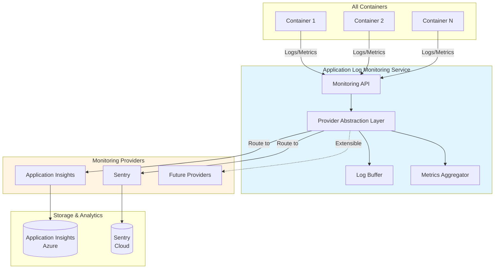

# Application Log Monitoring Module

## Overview

The Application Log Monitoring module provides a **unified abstraction layer** for application log monitoring and observability across all Castiel containers. It supports multiple monitoring providers (Application Insights, Sentry) through a consistent interface, enabling centralized log management, metrics collection, and error tracking.

## Purpose

- **Unified Logging Interface**: Single API for all containers to send logs, metrics, and traces
- **Provider Abstraction**: Support for Application Insights and Sentry with easy extensibility
- **Centralized Monitoring**: Aggregate logs and metrics from all containers in one place
- **Error Tracking**: Automatic error capture and alerting
- **Performance Monitoring**: Track request performance, dependencies, and custom metrics
- **Distributed Tracing**: Trace requests across multiple containers
- **Tenant-Aware Logging**: All logs include tenant context for multi-tenant isolation

## Location

- **Service**: `containers/application-log-monitoring/` (shared service)
- **Port**: 3015 (configurable)
- **API Base**: `/api/v1/monitoring`
- **Shared Package**: `@coder/shared/monitoring` (client library)

## Architecture



## Key Features

### 1. Provider Abstraction

- **Unified Interface**: Single API regardless of underlying provider
- **Multi-Provider Support**: Route logs to Application Insights, Sentry, or both
- **Provider Switching**: Change providers without code changes
- **Fallback Support**: Automatic fallback if primary provider fails

### 2. Log Management

- **Structured Logging**: JSON-formatted logs with consistent schema
- **Log Levels**: Trace, Debug, Info, Warn, Error, Fatal
- **Context Enrichment**: Automatic addition of tenantId, userId, correlationId
- **Log Filtering**: Filter by level, tenant, service, or custom tags
- **Log Retention**: Configurable retention policies per provider

### 3. Metrics Collection

- **Custom Metrics**: Track business metrics (e.g., API calls, processing time)
- **System Metrics**: CPU, memory, request rate, error rate
- **Performance Metrics**: Response times, throughput, latency
- **Aggregation**: Automatic aggregation and rollup

### 4. Error Tracking

- **Automatic Capture**: Unhandled exceptions automatically captured
- **Error Grouping**: Similar errors grouped for easier analysis
- **Stack Traces**: Full stack traces with source maps
- **Context**: User, tenant, and request context attached to errors

### 5. Distributed Tracing

- **Request Tracing**: Trace requests across container boundaries
- **Correlation IDs**: Automatic correlation ID generation and propagation
- **Span Tracking**: Track operations within a request
- **Dependency Mapping**: Map service dependencies

### 6. Tenant Isolation

- **Tenant Context**: All logs include tenantId
- **Tenant Filtering**: Query logs by tenant
- **Tenant Metrics**: Per-tenant metrics and dashboards
- **Data Isolation**: Ensure tenant data separation in storage

## API Endpoints

### Logging

- `POST /api/v1/monitoring/logs` - Send log entry
- `POST /api/v1/monitoring/logs/batch` - Send multiple log entries
- `GET /api/v1/monitoring/logs` - Query logs (with filters)

### Metrics

- `POST /api/v1/monitoring/metrics` - Record custom metric
- `POST /api/v1/monitoring/metrics/batch` - Record multiple metrics
- `GET /api/v1/monitoring/metrics` - Query metrics

### Errors

- `POST /api/v1/monitoring/errors` - Report error
- `GET /api/v1/monitoring/errors` - Query errors

### Traces

- `POST /api/v1/monitoring/traces` - Send trace span
- `GET /api/v1/monitoring/traces/{traceId}` - Get trace by ID

### Health

- `GET /api/v1/monitoring/health` - Service health check
- `GET /api/v1/monitoring/providers/status` - Provider status

See [API.md](./API.md) for complete API documentation.

## Configuration

### Service Configuration

```yaml
# config/default.yaml
module:
  name: application-log-monitoring
  version: 1.0.0

server:
  port: ${PORT:-3015}
  host: ${HOST:-0.0.0.0}

# Monitoring Provider Configuration
monitoring:
  # Primary provider (application-insights | sentry | both)
  provider: ${MONITORING_PROVIDER:-application-insights}
  
  # Application Insights Configuration
  application_insights:
    enabled: ${APPINSIGHTS_ENABLED:-true}
    connection_string: ${APPLICATIONINSIGHTS_CONNECTION_STRING}
    instrumentation_key: ${APPINSIGHTS_INSTRUMENTATION_KEY}
    sampling_rate: ${APPINSIGHTS_SAMPLING_RATE:-1.0}
    enable_live_metrics: ${APPINSIGHTS_LIVE_METRICS:-true}
  
  # Sentry Configuration
  sentry:
    enabled: ${SENTRY_ENABLED:-false}
    dsn: ${SENTRY_DSN}
    environment: ${SENTRY_ENVIRONMENT:-production}
    traces_sample_rate: ${SENTRY_TRACES_SAMPLE_RATE:-1.0}
    profiles_sample_rate: ${SENTRY_PROFILES_SAMPLE_RATE:-1.0}
  
  # Log Buffer Configuration
  buffer:
    max_size: ${LOG_BUFFER_MAX_SIZE:-1000}
    flush_interval: ${LOG_BUFFER_FLUSH_INTERVAL:-5000}  # ms
    batch_size: ${LOG_BUFFER_BATCH_SIZE:-100}
  
  # Retention Policies
  retention:
    application_insights:
      days: ${APPINSIGHTS_RETENTION_DAYS:-90}
    sentry:
      days: ${SENTRY_RETENTION_DAYS:-90}
```

### Environment Variables

```env
# Provider Selection
MONITORING_PROVIDER=application-insights  # or 'sentry' or 'both'

# Application Insights
APPLICATIONINSIGHTS_CONNECTION_STRING=InstrumentationKey=...
APPINSIGHTS_INSTRUMENTATION_KEY=...
APPINSIGHTS_SAMPLING_RATE=1.0
APPINSIGHTS_ENABLED=true
APPINSIGHTS_LIVE_METRICS=true

# Sentry
SENTRY_DSN=https://...@sentry.io/...
SENTRY_ENVIRONMENT=production
SENTRY_TRACES_SAMPLE_RATE=1.0
SENTRY_ENABLED=false

# Buffer Configuration
LOG_BUFFER_MAX_SIZE=1000
LOG_BUFFER_FLUSH_INTERVAL=5000
LOG_BUFFER_BATCH_SIZE=100
```

## Usage

### From Containers (Client Library)

```typescript
import { MonitoringClient } from '@coder/shared/monitoring';

// Initialize client (typically in server.ts)
const monitoring = MonitoringClient.initialize({
  serviceUrl: config.services.monitoring?.url || 'http://localhost:3015',
  serviceName: 'ai-insights',
  tenantId: request.headers['x-tenant-id'],
  userId: request.user?.id,
});

// Log messages
monitoring.log('info', 'Processing insight request', {
  insightType: 'risk-analysis',
  conversationId: 'conv-123',
});

// Record metrics
monitoring.trackMetric('insight_generation_time', 245, {
  insightType: 'risk-analysis',
  model: 'gpt-4',
});

// Track errors
try {
  // ... code
} catch (error) {
  monitoring.trackError(error, {
    context: 'insight-generation',
    conversationId: 'conv-123',
  });
}

// Track custom events
monitoring.trackEvent('insight_generated', {
  insightType: 'risk-analysis',
  tenantId: 'tenant-123',
  userId: 'user-456',
});
```

### Direct API Calls

```typescript
// POST /api/v1/monitoring/logs
{
  "level": "info",
  "message": "Processing insight request",
  "service": "ai-insights",
  "tenantId": "tenant-123",
  "userId": "user-456",
  "correlationId": "corr-789",
  "properties": {
    "insightType": "risk-analysis",
    "conversationId": "conv-123"
  },
  "timestamp": "2026-01-23T10:30:00Z"
}

// POST /api/v1/monitoring/metrics
{
  "name": "insight_generation_time",
  "value": 245,
  "unit": "milliseconds",
  "service": "ai-insights",
  "tenantId": "tenant-123",
  "properties": {
    "insightType": "risk-analysis",
    "model": "gpt-4"
  },
  "timestamp": "2026-01-23T10:30:00Z"
}
```

## Provider Implementation

### Application Insights Provider

```typescript
import * as appInsights from 'applicationinsights';

class ApplicationInsightsProvider implements MonitoringProvider {
  private client: appInsights.TelemetryClient;
  
  initialize(config: ApplicationInsightsConfig): void {
    appInsights
      .setup(config.connectionString || config.instrumentationKey)
      .setAutoCollectRequests(true)
      .setAutoCollectPerformance(true)
      .setAutoCollectExceptions(true)
      .setAutoCollectDependencies(true)
      .setUseDiskRetryCaching(true)
      .setSendLiveMetrics(true)
      .start();
    
    this.client = appInsights.defaultClient;
    
    // Set sampling rate
    if (config.samplingRate) {
      this.client.config.samplingPercentage = config.samplingRate * 100;
    }
  }
  
  log(entry: LogEntry): void {
    const severity = this.mapSeverityLevel(entry.level);
    this.client.trackTrace({
      message: entry.message,
      severity: severity,
      properties: {
        ...entry.properties,
        service: entry.service,
        tenantId: entry.tenantId,
        userId: entry.userId,
        correlationId: entry.correlationId,
      },
    });
  }
  
  trackMetric(metric: Metric): void {
    this.client.trackMetric({
      name: metric.name,
      value: metric.value,
      properties: {
        ...metric.properties,
        service: metric.service,
        tenantId: metric.tenantId,
      },
    });
  }
  
  trackError(error: Error, context?: Record<string, any>): void {
    this.client.trackException({
      exception: error,
      properties: context,
    });
  }
}
```

### Sentry Provider

```typescript
import * as Sentry from '@sentry/node';

class SentryProvider implements MonitoringProvider {
  initialize(config: SentryConfig): void {
    Sentry.init({
      dsn: config.dsn,
      environment: config.environment,
      tracesSampleRate: config.tracesSampleRate,
      profilesSampleRate: config.profilesSampleRate,
      beforeSend(event, hint) {
        // Add tenant context
        if (event.contexts) {
          event.contexts.tenant = { id: hint.tenantId };
        }
        return event;
      },
    });
  }
  
  log(entry: LogEntry): void {
    Sentry.captureMessage(entry.message, {
      level: this.mapSeverityLevel(entry.level),
      tags: {
        service: entry.service,
        tenantId: entry.tenantId,
        ...entry.properties,
      },
    });
  }
  
  trackMetric(metric: Metric): void {
    Sentry.metrics.increment(metric.name, metric.value, {
      tags: {
        service: metric.service,
        tenantId: metric.tenantId,
        ...metric.properties,
      },
    });
  }
  
  trackError(error: Error, context?: Record<string, any>): void {
    Sentry.captureException(error, {
      tags: context,
    });
  }
}
```

## Integration with Containers

### Container Configuration

Each container should include monitoring service in its config:

```yaml
# containers/ai-insights/config/default.yaml
services:
  monitoring:
    url: ${MONITORING_SERVICE_URL:-http://localhost:3015}
  # ... other services
```

### Container Initialization

```typescript
// containers/ai-insights/src/server.ts
import { MonitoringClient } from '@coder/shared/monitoring';
import { loadConfig } from './config';

const config = loadConfig();

// Initialize monitoring client
const monitoring = MonitoringClient.initialize({
  serviceUrl: config.services.monitoring?.url,
  serviceName: 'ai-insights',
});

// Use in route handlers
fastify.post('/api/v1/insights', async (request, reply) => {
  const correlationId = request.headers['x-correlation-id'] || randomUUID();
  
  monitoring.log('info', 'Received insight request', {
    correlationId,
    tenantId: request.headers['x-tenant-id'],
  });
  
  try {
    // ... process request
    monitoring.trackMetric('insight_requests_total', 1);
    return result;
  } catch (error) {
    monitoring.trackError(error, { correlationId });
    throw error;
  }
});
```

## Dependencies

- `applicationinsights` - Azure Application Insights SDK
- `@sentry/node` - Sentry Node.js SDK
- `@fastify/rate-limit` - Rate limiting for API
- `@coder/shared` - Shared types and utilities

## Security Features

1. **Authentication**: Service-to-service JWT authentication
2. **Tenant Isolation**: All logs tagged with tenantId for filtering
3. **Data Masking**: Sensitive data automatically masked in logs
4. **Rate Limiting**: Prevent log flooding attacks
5. **Access Control**: Only authorized services can send logs

## Performance Considerations

1. **Async Processing**: Logs processed asynchronously to avoid blocking
2. **Batching**: Multiple logs batched together for efficiency
3. **Buffering**: In-memory buffer to handle bursts
4. **Sampling**: Configurable sampling to reduce volume
5. **Retry Logic**: Automatic retry on provider failures

## Events

This module publishes events for monitoring operations. See:
- [Monitoring Events](./monitoring-events.md) - Events published by the monitoring service

## Related Documentation

- [API Documentation](./API.md) - Complete API reference
- [SPECIFICATION.md](./SPECIFICATION.md) - Detailed specification
- [CHANGELOG.md](./CHANGELOG.md) - Version history
- [Module Overview](../../global/ModuleOverview.md) - System-wide module overview

## See Also

- [Logging Module](../logging/) - Audit logging and compliance
- [Infrastructure Documentation](../../global/Infrastructure.md) - System infrastructure
