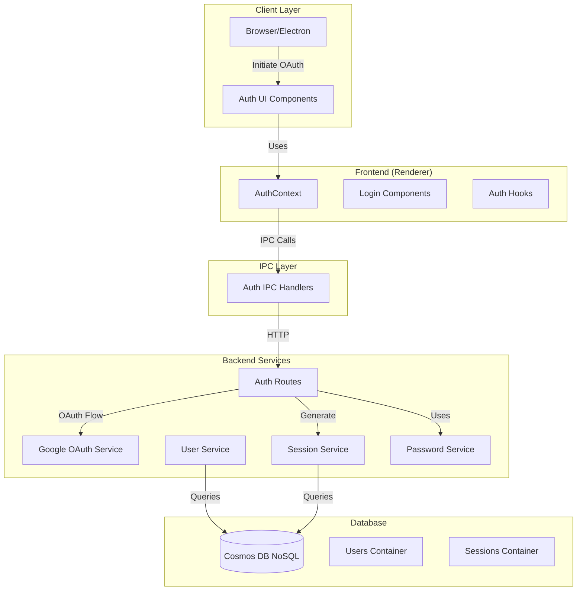

# Authentication Module

## Overview

The Authentication module provides user authentication, session management, and OAuth/SSO integration across the entire system. It includes both backend API services and frontend UI components for a complete authentication solution.

## Purpose

- User authentication (email/password, OAuth, SSO/SAML)
- Session creation, validation, and revocation
- Token management (JWT, refresh tokens)
- Multi-factor authentication
- Account lockout and security policies
- Password management (reset, change, history)
- Email verification
- OAuth provider linking/unlinking

## Location

- **Backend Source**: `server/src/auth/` and `server/src/routes/auth.ts`
- **Frontend Source**: `src/renderer/auth/`
- **Service**: `containers/auth/` (microservice)
- **Port**: 3021
- **API Base**: `/api/v1/auth`

## Architecture



## Key Features

### Backend Features

1. **Google OAuth 2.0**
   - OAuth flow initiation
   - Callback handling
   - User info retrieval
   - Account linking

2. **JWT Token Management**
   - Token generation
   - Token validation
   - Token refresh
   - Token expiration (7 days default)

3. **Password Authentication**
   - Password hashing (bcrypt)
   - Password validation
   - Password history tracking
   - Password reset flow

4. **Session Management**
   - Session creation
   - Session tracking
   - Session revocation
   - Multi-session support

5. **Account Security**
   - Login attempt tracking
   - Account locking
   - Password strength validation
   - Provider management

### Frontend Features

1. **OAuth Integration**
   - Google OAuth 2.0 authentication flow
   - Token management
   - Provider linking/unlinking

2. **Session Management**
   - JWT token storage
   - Session refresh
   - Multi-session support

3. **Authentication State**
   - Global auth context
   - User profile management
   - Organization switching

## API Endpoints

### Authentication

- `GET /api/auth/google` - Initiate Google OAuth flow
- `GET /api/auth/google/callback` - OAuth callback handler
- `POST /api/auth/login` - Email/password login
- `POST /api/auth/register` - User registration
- `POST /api/auth/logout` - Logout (revoke session)
- `GET /api/auth/me` - Get current user
- `POST /api/auth/refresh` - Refresh JWT token

### Password Management

- `POST /api/auth/change-password` - Change password
- `POST /api/auth/request-password-reset` - Request password reset
- `POST /api/auth/reset-password` - Reset password with token

### Provider Management

- `GET /api/auth/providers` - Get linked providers
- `POST /api/auth/link-google` - Link Google account
- `POST /api/auth/unlink-provider` - Unlink provider

See [API.md](./API.md) for complete API documentation.

## Implementation Details

### OAuth Flow

1. User initiates OAuth via `GET /api/auth/google`
2. Redirect to Google authorization page
3. Google redirects to callback with authorization code
4. Exchange code for access token
5. Retrieve user info from Google
6. Find or create user in database
7. Generate JWT token
8. Create session
9. Redirect to frontend with token

### JWT Token Structure

```typescript
{
  userId: string;
  email: string;
  exp: number; // Expiration timestamp
  iat: number; // Issued at timestamp
}
```

### Session Management

Sessions are stored in the database with:
- User ID
- Session ID
- Created timestamp
- Last activity timestamp
- IP address
- User agent

## Frontend Usage

```typescript
import { useAuth } from '@/renderer/auth';

function MyComponent() {
  const { user, isAuthenticated, login, logout } = useAuth();
  
  if (!isAuthenticated) {
    return <LoginPage />;
  }
  
  return <div>Welcome, {user?.name}</div>;
}
```

## Dependencies

- `@fastify/oauth2` - OAuth 2.0 plugin
- `@fastify/jwt` - JWT plugin
- `bcrypt` - Password hashing
- `jsonwebtoken` - JWT operations
- Database client for user/session storage
- React 19 (frontend)
- Electron IPC (frontend)

## Environment Variables

```env
GOOGLE_CLIENT_ID=your-google-client-id
GOOGLE_CLIENT_SECRET=your-google-client-secret
GOOGLE_REDIRECT_URI=http://localhost:3000/api/auth/google/callback
JWT_SECRET=your-jwt-secret-key
JWT_EXPIRATION=7d
FRONTEND_URL=http://localhost:3000
```

## Security Features

1. **Password Security**
   - Bcrypt hashing with salt rounds
   - Password history tracking
   - Password strength validation
   - Minimum password requirements

2. **Account Protection**
   - Login attempt tracking
   - Account locking after failed attempts
   - Session management
   - Token expiration

3. **OAuth Security**
   - Secure token exchange
   - State parameter validation
   - HTTPS enforcement in production
   - Secure cookie settings

## Events

This module publishes events that are logged and trigger notifications. See:
- [Audit Log Events](./logs-events.md) - Events captured by the logging service
- [Notification Events](./notifications-events.md) - Events that trigger notifications

## Related Documentation

- [API Documentation](./API.md) - Complete API reference
- [CHANGELOG](./CHANGELOG.md) - Version history
- [Module Overview](../../global/ModuleOverview.md) - System-wide module overview

## Does NOT Include

- User profile management (see User Management module)
- Authorization/permissions (see User Management module)


