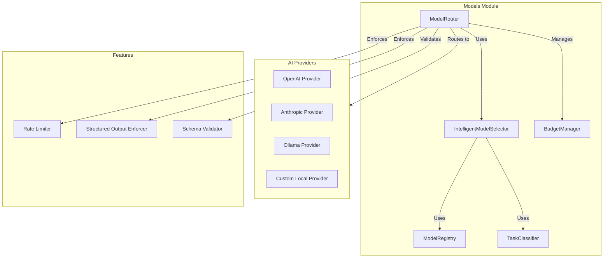

# Core Models Module

## Overview

The Core Models module provides AI model integration, routing, and management. It supports multiple AI providers (OpenAI, Anthropic, Ollama) with intelligent model selection, rate limiting, budget management, structured output enforcement, and fallback chains.

## Purpose

- AI model provider integration
- Intelligent model selection
- Model routing and fallback
- Rate limiting and quotas
- Budget management
- Structured output enforcement
- Task classification for model selection

## Location

- **Source**: `src/core/models/`
- **Main Files**:
  - `ModelRouter.ts` - Main model router
  - `OllamaProvider.ts` - Ollama provider
  - `OpenAIProvider.ts` - OpenAI provider
  - `AnthropicProvider.ts` - Anthropic provider
  - `CustomLocalProvider.ts` - Custom local provider
  - `IntelligentModelSelector.ts` - Intelligent model selection
  - `ModelRegistry.ts` - Model registry
  - `TaskClassifier.ts` - Task classification
  - `BudgetManager.ts` - Budget management
  - `StructuredOutputEnforcer.ts` - Structured output enforcement
  - `OutputSchemaValidator.ts` - Output schema validation

## Architecture



## Key Features

1. **Multi-Provider Support**
   - OpenAI integration
   - Anthropic integration
   - Ollama (local) integration
   - Custom local providers

2. **Intelligent Model Selection**
   - Task-based selection
   - Cost optimization
   - Performance optimization
   - Availability checking

3. **Rate Limiting**
   - Per-provider rate limits
   - Request queuing
   - Quota management
   - Block on exceed options

4. **Budget Management**
   - Budget tracking
   - Cost monitoring
   - Budget alerts
   - Spending limits

5. **Structured Output**
   - Output format enforcement
   - Schema validation
   - JSON schema support
   - Type safety

6. **Fallback Chains**
   - Automatic fallback
   - Provider failover
   - Error handling
   - Retry logic

## Components

### ModelRouter

Main orchestrator for model routing:

```typescript
class ModelRouter {
  async complete(request: ModelRequest): Promise<ModelResponse>;
  async stream(request: ModelRequest): AsyncGenerator<StreamingChunk>;
  selectModel(request: ModelRequest): ModelSelection;
}
```

### IntelligentModelSelector

Selects optimal model based on task:

- Task classification
- Cost analysis
- Performance metrics
- Availability checking

### ModelRegistry

Registers and manages models:

- Model metadata
- Capabilities tracking
- Performance metrics
- Cost information

### TaskClassifier

Classifies tasks for model selection:

- Task type detection
- Complexity assessment
- Requirements analysis

### BudgetManager

Manages AI usage budgets:

- Budget tracking
- Cost monitoring
- Alerts and limits

## Dependencies

- `ConfigManager` - Configuration
- `SecureStorageService` - API key storage
- `RateLimiter` - Rate limiting
- Provider-specific SDKs

## Related Modules

- [AI Service](./../../microservices/ai-service/) - AI service microservice
- [Planning Module](./../planning/) - Uses models for planning
- [Execution Module](./../execution/) - Uses models for execution
- [Agents Module](./../agents/) - Uses models for agents

## Usage

```typescript
import { ModelRouter } from '@/core/models/ModelRouter';
import { ConfigManager } from '@/core/config/ConfigManager';

const router = new ModelRouter(configManager);

// Complete request
const response = await router.complete({
  prompt: 'Generate a plan for...',
  model: 'gpt-4',
  temperature: 0.7
});

// Streaming request
for await (const chunk of router.stream(request)) {
  console.log(chunk.content);
}
```

## See Also

- [API Documentation](./API.md)
- [Architecture Details](./ARCHITECTURE.md)
- [Code Examples](./EXAMPLES.md)
