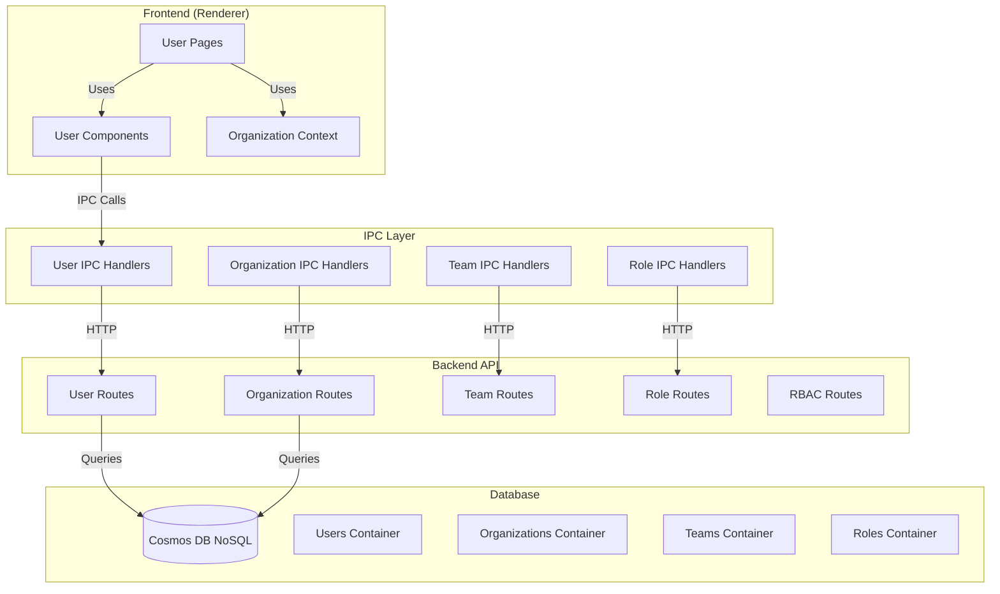

# User Management Module

## Overview

The User Management module provides comprehensive functionality for user profiles, organizations, teams, role-based access control (RBAC), and user invitations across the entire system. It includes both backend API services and frontend UI components.

## Purpose

- User profiles and preferences
- User session management (list, revoke)
- User account lifecycle (deactivate, reactivate, delete)
- Organization and team management
- Role and permission definitions (RBAC)
- Organization membership
- User settings and configurations

## Location

- **Backend Source**: `server/src/routes/users.ts`, `server/src/routes/organizations.ts`, etc.
- **Frontend Source**: `src/renderer/users/`
- **Service**: `containers/user-management/` (microservice)
- **Port**: 3022
- **API Base**: `/api/v1/users`

## Architecture



## Key Features

### User Profiles
- View and update profile information
- Manage competencies and skills
- Profile picture upload
- Account deletion

### Organizations
- Create and manage organizations
- Configure organization settings
- SSO configuration (Azure AD, Okta)
- Member management

### Teams
- Hierarchical team structure
- Team membership management
- Team-level permissions

### Roles & Permissions
- Custom role creation
- Permission assignment
- Role inheritance
- Default roles (Owner, Admin, Member)

### Invitations
- Email invitations
- Link-based invitations
- Invitation expiration
- Invitation revocation

## API Endpoints

### Users
- `GET /api/v1/users/me` - Get current user
- `PUT /api/v1/users/me` - Update current user
- `GET /api/v1/users/:id` - Get user by ID
- `DELETE /api/v1/users/:id` - Delete user account

### Organizations
- `POST /api/v1/organizations` - Create organization
- `GET /api/v1/organizations/:id` - Get organization
- `PUT /api/v1/organizations/:id` - Update organization
- `DELETE /api/v1/organizations/:id` - Delete organization

### Teams
- `POST /api/v1/organizations/:orgId/teams` - Create team
- `GET /api/v1/organizations/:orgId/teams` - List teams
- `PUT /api/v1/teams/:id` - Update team
- `DELETE /api/v1/teams/:id` - Delete team

### Roles
- `POST /api/v1/organizations/:orgId/roles` - Create role
- `GET /api/v1/organizations/:orgId/roles` - List roles
- `PUT /api/v1/roles/:id` - Update role
- `DELETE /api/v1/roles/:id` - Delete role

### Invitations
- `POST /api/v1/organizations/:orgId/invitations` - Create invitation
- `GET /api/v1/invitations/:token` - Get invitation by token
- `POST /api/v1/invitations/:token/accept` - Accept invitation
- `DELETE /api/v1/invitations/:id` - Revoke invitation

## Frontend Usage

```typescript
import { useOrganization } from '@/renderer/users/contexts/OrganizationContext';
import { UserManagementView } from '@/renderer/users/pages';

function App() {
  const { currentOrganization, switchOrganization } = useOrganization();
  
  return (
    <div>
      <OrganizationSwitcher />
      <UserManagementView />
    </div>
  );
}
```

## Events

This module publishes events that are logged and trigger notifications. See:
- [Audit Log Events](./logs-events.md) - Events captured by the logging service
- [Notification Events](./notifications-events.md) - Events that trigger notifications

## Security

- All endpoints require authentication
- RBAC permissions enforced
- Organization isolation
- Input validation using Fastify schemas

## Related Documentation

- [CHANGELOG](./CHANGELOG.md) - Version history
- [Module Overview](../../global/ModuleOverview.md) - System-wide module overview

## Does NOT Include

- Authentication logic, session creation (handled by auth service)


