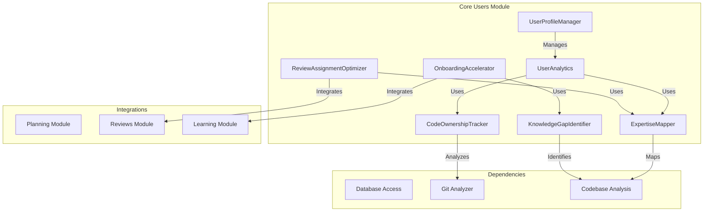

# Core Users Module

## Overview

The Core Users module provides business logic for user management, user profiles, user analytics, code ownership tracking, expertise mapping, knowledge gap identification, onboarding acceleration, and review assignment optimization.

## Purpose

- User profile management
- User analytics and insights
- Code ownership tracking
- Expertise mapping
- Knowledge gap identification
- Onboarding acceleration
- Review assignment optimization
- User competency tracking

## Location

- **Source**: `src/core/users/`
- **Main Files**:
  - `UserProfileManager.ts` - User profile management
  - `UserAnalytics.ts` - User analytics
  - `CodeOwnershipTracker.ts` - Code ownership tracking
  - `ExpertiseMapper.ts` - Expertise mapping
  - `KnowledgeGapIdentifier.ts` - Knowledge gap identification
  - `OnboardingAccelerator.ts` - Onboarding acceleration
  - `ReviewAssignmentOptimizer.ts` - Review assignment optimization
  - `IDEUserProfile.ts` - IDE user profile interface

## Architecture



## Key Features

1. **User Profile Management**
   - Profile creation and updates
   - Competency tracking
   - Work preferences
   - Role management

2. **User Analytics**
   - Activity tracking
   - Contribution metrics
   - Skill progression
   - Performance insights

3. **Code Ownership Tracking**
   - File ownership analysis
   - Module ownership
   - Contribution history
   - Ownership patterns

4. **Expertise Mapping**
   - Technology expertise
   - Domain expertise
   - Skill level assessment
   - Expertise visualization

5. **Knowledge Gap Identification**
   - Skill gap analysis
   - Learning recommendations
   - Competency gaps
   - Training needs

6. **Onboarding Acceleration**
   - Onboarding paths
   - Skill assessment
   - Learning recommendations
   - Progress tracking

7. **Review Assignment Optimization**
   - Reviewer matching
   - Expertise-based assignment
   - Workload balancing
   - Review quality optimization

## Components

### UserProfileManager

Manages user profiles with competencies and preferences:

```typescript
interface UserProfile {
  id: string;
  role: string;
  competencies: string[];
  workPreferences: WorkPreferences;
  expertise: ExpertiseMap;
}
```

### UserAnalytics

Provides user analytics and insights:

- Activity metrics
- Contribution statistics
- Skill progression
- Performance trends

### CodeOwnershipTracker

Tracks code ownership and contributions:

- File ownership
- Module ownership
- Contribution frequency
- Ownership patterns

### ExpertiseMapper

Maps user expertise across technologies and domains:

- Technology expertise levels
- Domain knowledge
- Skill assessments
- Expertise visualization

### KnowledgeGapIdentifier

Identifies knowledge gaps and learning needs:

- Skill gap analysis
- Competency gaps
- Learning recommendations
- Training needs assessment

### OnboardingAccelerator

Accelerates user onboarding:

- Onboarding path generation
- Skill assessment
- Learning recommendations
- Progress tracking

### ReviewAssignmentOptimizer

Optimizes code review assignments:

- Reviewer matching
- Expertise-based assignment
- Workload balancing
- Quality optimization

## Dependencies

- Database access for user data
- Git analyzer for contribution tracking
- Codebase analysis for expertise mapping
- Planning module for recommendations
- Reviews module for review optimization

## Related Modules

- [Frontend Users](./../../frontend/users/) - User management UI
- [Backend User Routes](./../../backend/routes/) - User API
- [Planning Module](./../planning/) - Planning integration
- [Reviews Module](./../reviews/) - Review integration
- [Learning Module](./../learning/) - Learning integration

## Usage

```typescript
import { UserProfileManager } from '@/core/users/UserProfileManager';
import { UserAnalytics } from '@/core/users/UserAnalytics';
import { CodeOwnershipTracker } from '@/core/users/CodeOwnershipTracker';

const profileManager = new UserProfileManager();
const analytics = new UserAnalytics();
const ownershipTracker = new CodeOwnershipTracker();

// Get user profile
const profile = await profileManager.getProfile(userId);

// Get user analytics
const stats = await analytics.getUserStats(userId);

// Get code ownership
const ownership = await ownershipTracker.getOwnership(userId);
```

## See Also

- [API Documentation](./API.md)
- [Architecture Details](./ARCHITECTURE.md)
- [Code Examples](./EXAMPLES.md)
