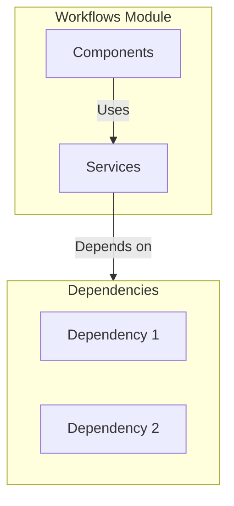

# Workflows Module

## Overview

Workflow orchestration logic

## Purpose

- Module-specific functionality
- Integration with other modules
- API endpoints (if applicable)

## Location

- **Source**: `src/core/workflows/`
- **Category**: Core

## Architecture



## Key Features

1. **Feature 1**
   - Description of feature 1

2. **Feature 2**
   - Description of feature 2

3. **Feature 3**
   - Description of feature 3

## Components

- Component 1 - Description
- Component 2 - Description
- Component 3 - Description

## Dependencies

- Dependency 1
- Dependency 2
- Dependency 3

## Related Modules

- Related module 1
- Related module 2

## Usage

```typescript
// Usage example
import { ModuleName } from '@/path/to/module';
```

## See Also

- [API Documentation](./API.md) - API endpoints and schemas
- [Architecture Details](./ARCHITECTURE.md) - Architecture and design
- [Code Examples](./EXAMPLES.md) - Usage examples
