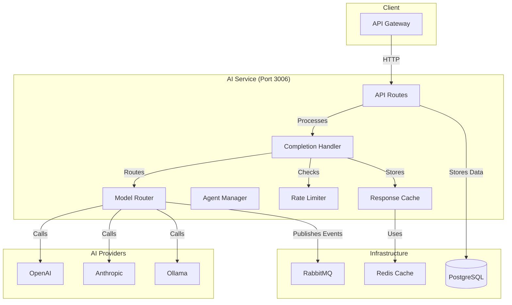

# AI Service Microservice

> **📋 Detailed Specification**: See [SPECIFICATION.md](./SPECIFICATION.md) for comprehensive module specification including architecture, data models, API endpoints, and implementation guidelines.

## Overview

The AI Service microservice provides LLM (Large Language Model) completions, model routing, fallback chains, and agent management. It integrates with multiple AI providers (OpenAI, Anthropic, Ollama) and handles model selection, rate limiting, and caching.

## Purpose

- LLM completion requests
- Model routing and selection
- Fallback chain management
- Agent management
- Rate limiting and quotas
- Response caching

## Location

- **Backend Source**: `containers/ai-service/src/`
- **Port**: 3006
- **API Base**: `/api/v1/ai`
- **Main Files**:
  - `server.ts` - Service entry point
  - `routes/completions.ts` - Completion endpoints
  - `routes/models.ts` - Model management endpoints
  - `routes/agents.ts` - Agent management endpoints

## Architecture



## Key Features

1. **Completion Service**
   - Text completion requests
   - Streaming support
   - Context management
   - Token counting

2. **Model Routing**
   - Intelligent model selection
   - Fallback chains
   - Provider health monitoring
   - Cost optimization

3. **Agent Management**
   - Agent registration
   - Agent execution
   - Agent state management

4. **Rate Limiting**
   - Per-organization quotas
   - Per-user limits
   - Token-based limits
   - Request throttling

5. **Caching**
   - Response caching
   - Cache invalidation
   - Cache warming

## API Endpoints

### Completions

- `POST /api/ai/completions` - Create completion
- `POST /api/ai/completions/stream` - Streaming completion
- `GET /api/ai/completions/:id` - Get completion status

### Models

- `GET /api/ai/models` - List available models
- `GET /api/ai/models/:id` - Get model details
- `POST /api/ai/models` - Register model
- `PUT /api/ai/models/:id` - Update model configuration

### Agents

- `GET /api/ai/agents` - List agents
- `GET /api/ai/agents/:id` - Get agent details
- `POST /api/ai/agents` - Create agent
- `PUT /api/ai/agents/:id` - Update agent
- `DELETE /api/ai/agents/:id` - Delete agent

## Dependencies

- **Shared Library**: `@coder/shared` - Common utilities
- **Database**: PostgreSQL (shared)
- **Message Queue**: RabbitMQ (events)
- **Cache**: Redis (optional)

## Environment Variables

```env
PORT=3006
COSMOS_DB_CONNECTION_STRING=AccountEndpoint=https://<account-name>.documents.azure.com:443/;AccountKey=<key>;
RABBITMQ_URL=amqp://...
REDIS_URL=redis://... (optional)
JWT_SECRET=...
SERVICE_NAME=ai-service
```

## Communication

### Incoming
- REST API requests from API Gateway
- Event subscriptions (if implemented)

### Outgoing
- RabbitMQ events (completion started, completed, failed, etc.)
- Database operations
- External AI provider APIs

## Events Published

```typescript
// Published to: ai.events exchange
type AIEvent =
  | { type: 'ai.completion.started'; requestId: string; model: string; organizationId: string }
  | { type: 'ai.completion.completed'; requestId: string; model: string; tokensUsed: number; durationMs: number }
  | { type: 'ai.completion.failed'; requestId: string; model: string; error: string }
  | { type: 'ai.completion.fallback'; requestId: string; fromModel: string; toModel: string; reason: string }
  | { type: 'ai.ratelimit.exceeded'; organizationId: string; userId: string; scope: string }
  | { type: 'ai.provider.health.changed'; providerId: string; status: string };
```

## Related Modules

- [Embeddings Service](./embeddings/) - Vector embeddings
- [Planning Service](./planning/) - Uses AI for planning
- [Usage Tracking](./usage-tracking/) - Consumes AI events
- [Prompt Management](./prompt-management/) - Prompt templates

## Health Check

- `GET /health` - Service health status
- `GET /health/ready` - Readiness check
- `GET /health/live` - Liveness check

## Related Documentation

- [Module Overview](../../global/ModuleOverview.md) - System-wide module overview
- [SPECIFICATION.md](./SPECIFICATION.md) - Complete module specification

## See Also

- [API Documentation](./API.md)
- [Architecture Details](./ARCHITECTURE.md)
- [Code Examples](./EXAMPLES.md)

