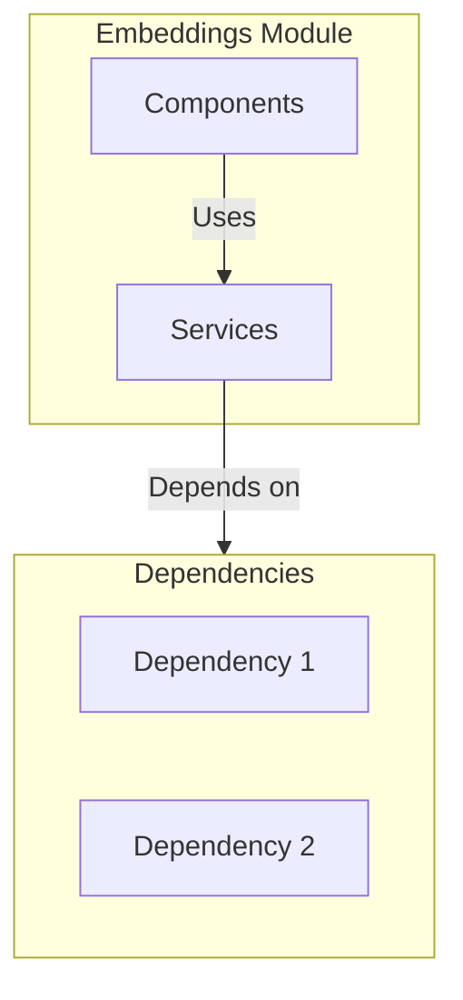

# Embeddings Module

> **📋 Detailed Specification**: See [SPECIFICATION.md](./SPECIFICATION.md) for comprehensive module specification including architecture, data models, API endpoints, and implementation guidelines.

## Overview

The Embeddings module provides vector embeddings and semantic search across the entire system. It includes both backend API services and frontend UI components.

## Purpose

- Semantic code embeddings for files/functions
- Cross-module relationship mapping
- Historical context (git history embeddings)
- Business domain modeling
- Semantic search across codebase
- Example-based search
- Similar code detection
- Question answering

## Location

- **Backend Source**: `containers/embeddings/src/`
- **Port**: 3005
- **API Base**: `/api/v1/embeddings`
- **Category**: Extension Module

## Architecture

## Key Features

1. **Feature 1**
   - Description of feature 1

2. **Feature 2**
   - Description of feature 2

3. **Feature 3**
   - Description of feature 3

## Components

- Component 1 - Description
- Component 2 - Description
- Component 3 - Description

## Dependencies

- Dependency 1
- Dependency 2
- Dependency 3

## Dependencies

- AI Service
- Knowledge Base
- Planning

## Related Documentation

- [Module Overview](../../global/ModuleOverview.md) - System-wide module overview
- [SPECIFICATION.md](./SPECIFICATION.md) - Complete module specification
