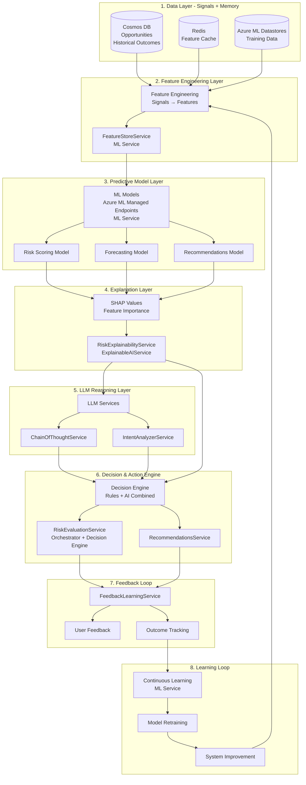
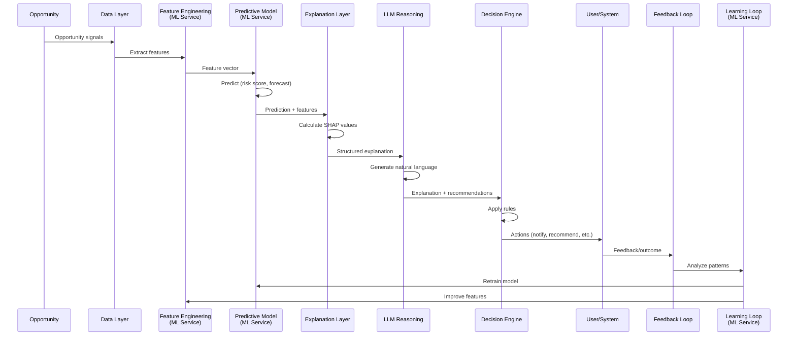

# CAIS Architecture - ML Service Integration

**Date:** January 2025  
**Status:** 📋 **TARGET ARCHITECTURE** - Documenting both current state and planned ML integration  
**Version:** 1.0

## Executive Summary

The Castiel ML Service is a component within the **Compound AI System (CAIS)** architecture. CAIS orchestrates multiple AI components working together in a decision loop to deliver explainable, actionable, continuously improving decisions for business intelligence.

**Key Distinction:**
- **ML Model**: Learns patterns from signals, makes numeric predictions (risk scores, revenue forecasts)
- **CAIS**: Orchestrates ML + LLM + Rules + Memory + Feedback to turn predictions into explainable, actionable decisions

## What is a Compound AI System (CAIS)?

A Compound AI System is **not a single model**. It is a system architecture that orchestrates multiple AI components:

1. **Predictive ML Models** - Learn patterns from historical data (risk scores, revenue forecasts)
2. **Rules / Heuristics** - Deterministic business logic and constraints
3. **LLMs** - Reasoning, explanation, natural language generation
4. **Memory / Historical Data** - Past outcomes, patterns, context
5. **Feedback Loops** - User feedback, outcome tracking, continuous improvement
6. **Tools** - CRM integrations, email, calendar, analytics

All working together in a **decision loop**: **Prediction → Reasoning → Action → Feedback → Learning**

## CAIS Architecture Layers

The Castiel CAIS is organized into eight distinct layers. The ML Service primarily operates in **Layer 3 (Predictive Model Layer)** but integrates with all layers:



## ML Service Role in CAIS

### Layer 2: Feature Engineering Layer

**ML Service Component**: `FeatureStoreService`

**Purpose**: Transform raw opportunity signals into machine-readable features

**Responsibilities**:
- Extract features from opportunities and related entities
- Perform feature engineering (encoding, normalization, temporal)
- Cache features in Redis for performance
- Store features in Cosmos DB for training
- Handle feature versioning

**Status**: 📋 Planned

### Layer 3: Predictive Model Layer

**ML Service Component**: `ModelService`

**Purpose**: ML models that learn patterns from signals and make predictions

**Responsibilities**:
- Manage model selection (global vs. industry-specific)
- Call Azure ML Managed Endpoints for predictions
- Cache predictions in Redis
- Sync model metadata from Azure ML Registry to Cosmos DB

**Models**:
1. **Risk Scoring Model** (XGBoost/LightGBM) - Predicts risk scores (0-1)
2. **Forecasting Model** (XGBoost/LightGBM) - Predicts revenue forecasts
3. **Recommendations Model** (XGBoost Ranker) - Ranks recommendations

**Status**: 📋 Planned

### Layer 8: Learning Loop

**ML Service Component**: `TrainingService`, `EvaluationService`

**Purpose**: Continuously improve models based on feedback and outcomes

**Responsibilities**:
- Orchestrate training via Azure ML Workspace
- Monitor training job status
- Track model performance and drift detection
- Trigger retraining when needed
- Register trained models to Azure ML Registry

**Status**: 📋 Planned

## CAIS Decision Loop

The complete CAIS decision loop flows through all layers:



## Integration with Existing Services

### RiskEvaluationService Integration

**Current State**: Rule-based + LLM risk detection  
**Target State**: Enhanced with ML predictions

```pseudocode
// Risk Detection Orchestration (Enhanced with ML)
async function detectRisks(opportunity, relatedShards, tenantId, userId) {
  detectedRisks = []
  
  // 1. Rule-based detection (fast, deterministic)
  ruleBasedRisks = await detectRisksByRules(opportunity, relatedShards)
  detectedRisks.push(...ruleBasedRisks)
  
  // 2. Historical pattern matching
  historicalRisks = await detectRisksByHistoricalPatterns(opportunity)
  detectedRisks.push(...historicalRisks)
  
  // 3. AI-powered detection (LLM)
  aiRisks = await detectRisksByAI(opportunity, relatedShards)
  detectedRisks.push(...aiRisks)
  
  // 4. ML prediction (NEW - from ML Service)
  mlRiskScore = await mlService.predictRiskScore(opportunity)  // Layer 3
  if (mlRiskScore > threshold) {
    mlRisks = await convertMLScoreToRisks(mlRiskScore, opportunity)
    detectedRisks.push(...mlRisks)
  }
  
  // 5. Merge and deduplicate risks
  mergedRisks = mergeRisks(detectedRisks)
  
  return mergedRisks
}
```

### RecommendationsService Integration

**Current State**: Vector search + collaborative filtering  
**Target State**: Enhanced with ML ranking

```pseudocode
// Recommendations (Enhanced with ML)
async function getRecommendations(userId, opportunityId, context) {
  // 1. Get candidate recommendations (existing methods)
  candidates = await getCandidates(userId, opportunityId, context)
  
  // 2. ML ranking (NEW - from ML Service)
  rankedCandidates = await mlService.rankRecommendations({
    userId: userId,
    candidates: candidates,
    context: context
  })
  
  // 3. Apply business rules
  filteredCandidates = applyBusinessRules(rankedCandidates)
  
  return filteredCandidates
}
```

### ForecastingService Integration

**Current State**: Probability-weighted estimates  
**Target State**: ML-powered forecasts with uncertainty

```pseudocode
// Revenue Forecasting (Enhanced with ML)
async function forecastRevenue(opportunityId, level) {
  // 1. Extract features
  features = await mlService.extractFeatures(opportunityId)
  
  // 2. ML forecast (NEW - from ML Service)
  mlForecast = await mlService.predictForecast({
    features: features,
    level: level  // opportunity, team, tenant
  })
  
  // 3. Apply business rules
  adjustedForecast = applyBusinessRules(mlForecast)
  
  return adjustedForecast
}
```

## Current State vs. Target State

### Current State (Rule-based + LLM)

- ✅ Data Layer: Cosmos DB, Redis
- ✅ Feature Engineering: Feature extraction in services
- ✅ Predictive Model: Rule-based heuristics (stage-based probability)
- ✅ Explanation Layer: RiskExplainabilityService, ExplainableAIService
- ✅ LLM Reasoning: ChainOfThoughtService, IntentAnalyzerService
- ✅ Decision & Action: RiskEvaluationService, RecommendationsService
- ✅ Feedback Loop: FeedbackLearningService
- 📋 Learning Loop: Manual retraining (planned: automated)

### Target State (Full CAIS with ML)

- ✅ Data Layer: Cosmos DB, Redis, Azure ML Datastores
- 📋 Feature Engineering: FeatureStoreService (planned)
- 📋 Predictive Model: Azure ML Managed Endpoints (planned)
- 📋 Explanation Layer: SHAP integration (planned)
- ✅ LLM Reasoning: Enhanced with ML context (current + planned)
- ✅ Decision & Action: Enhanced with ML predictions (current + planned)
- ✅ Feedback Loop: Extended for ML feedback (current + planned)
- 📋 Learning Loop: Automated continuous learning (planned)

## Component Responsibilities

### Clear Separation of Responsibilities

| Component | Responsibility | What It Does | What It Doesn't Do |
|-----------|---------------|--------------|-------------------|
| **ML Model** | Predicts | Learns patterns, makes numeric predictions | Explain decisions, take actions, reason in language |
| **LLM** | Explains & Reasons | Interprets ML outputs, generates explanations, suggests actions | Learn numeric patterns, replace ML models |
| **Rules** | Constrains | Enforces business logic, guardrails, deterministic decisions | Learn from data, adapt automatically |
| **Feature Engineering** | Transforms | Converts signals to features, handles versioning | Make predictions, explain decisions |
| **Decision Engine** | Orchestrates | Combines ML + LLM + Rules, executes actions | Learn patterns, generate explanations |
| **Feedback Loop** | Collects | Gathers user feedback and outcomes | Improve models directly |
| **Learning Loop** | Improves | Retrains models, updates features, adjusts rules | Make predictions, take actions |

## Related Documentation

- [Use Cases](./USE_CASES.md) - Detailed use case documentation
- [Implementation](./IMPLEMENTATION.md) - Implementation strategy
- [Orchestration](./ORCHESTRATION.md) - CAIS orchestration patterns
- [Global CAIS Overview](../../../global/CAIS_OVERVIEW.md) - High-level CAIS overview

---

**Document Status:** Complete  
**Last Updated:** January 2025  
**Next Review:** After Phase 1 implementation
