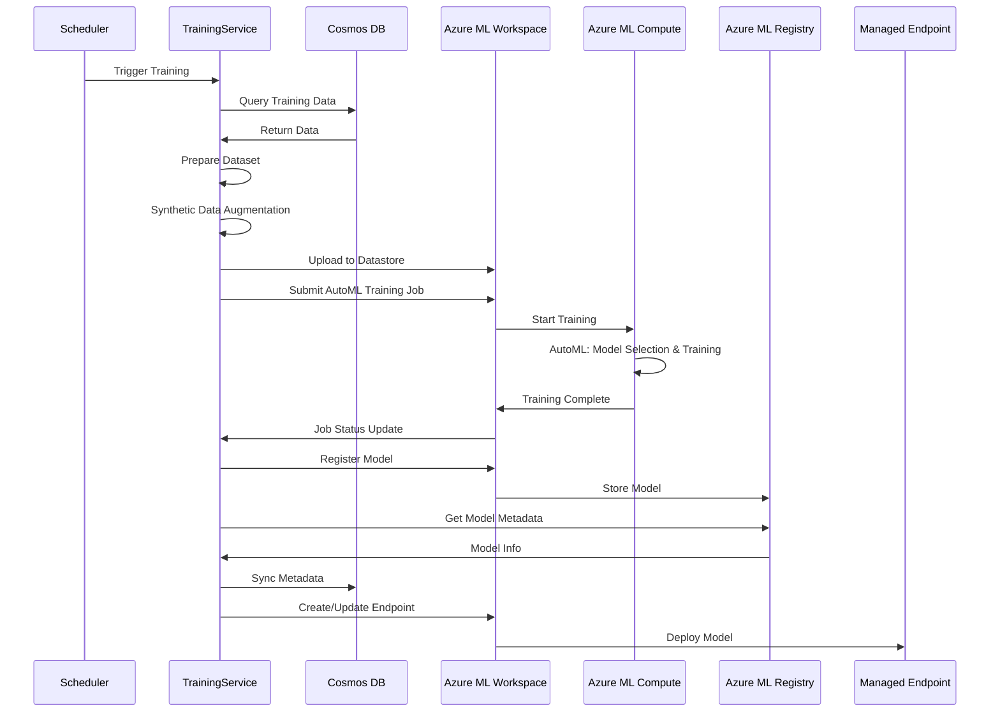
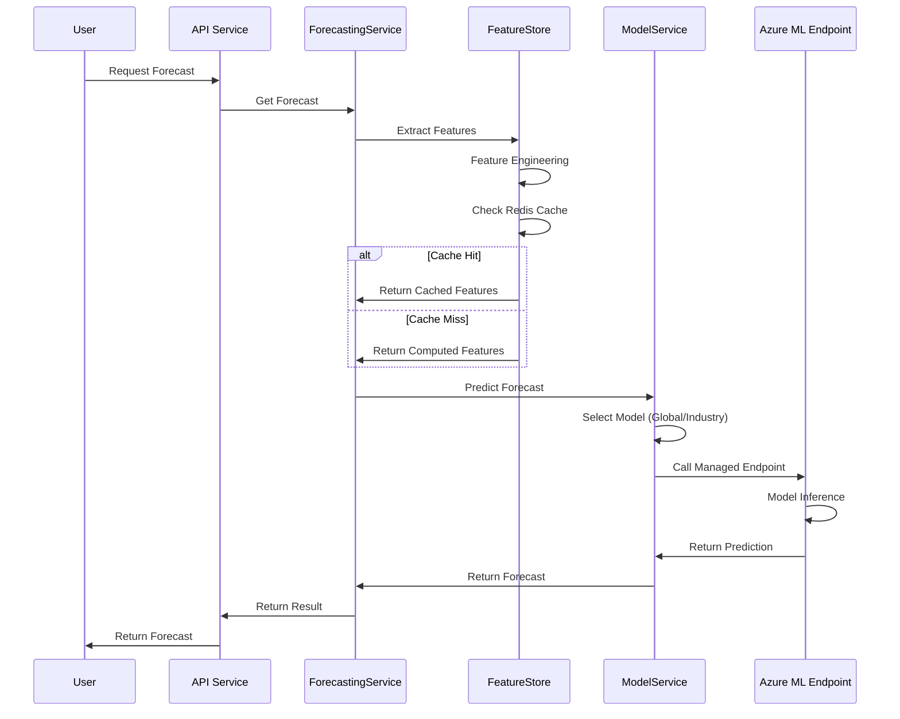

# ML Service Implementation

**Date:** January 2025  
**Status:** 📋 **PLANNED** - Ready for Implementation  
**Version:** 1.0

## Executive Summary

This document outlines the implementation strategy for the ML Service, focusing on Azure ML Workspace-based approach optimized for a small team. The implementation follows a phased approach, starting with three priority use cases: Risk Scoring, Revenue Forecasting, and Recommendations.

## Implementation Strategy

### Azure-First Approach

**Key Design Principles:**
- **Azure-First**: Maximize use of Azure managed services
- **Simple Maintenance**: Minimal custom infrastructure, managed services where possible
- **Small Team Friendly**: Easy deployment, monitoring, and operations
- **High Performance**: Optimized for accuracy and latency

### Azure ML Infrastructure

**Training Infrastructure:**
- **Azure ML Workspace**: Managed ML platform for training
  - Subscription: `main`
  - Resource Group: `castiel-ml-{environment}-rg` (e.g., `castiel-ml-dev-rg`)
  - Region: `eastus` (same as Cosmos DB/Redis for latency)
- **Azure ML Compute Clusters**: Managed, auto-scaling compute for training jobs
  - Small-team friendly (no infrastructure management)
  - Auto-scales based on workload
  - Pay-per-use pricing (scale to zero when idle)
- **Azure ML AutoML**: Full automated model selection, feature engineering, and hyperparameter tuning
  - Automated model selection (XGBoost, LightGBM, Random Forest, etc.)
  - Automated feature engineering and selection
  - Automated hyperparameter tuning
  - Best model selection based on cross-validation
- **Azure ML Pipelines**: Training orchestration
  - Scheduled retraining (weekly)
  - Data preparation → Synthetic Data Augmentation → Training → Evaluation → Deployment
  - Versioned pipeline runs
- **Azure ML Model Registry**: Model versioning and management
  - Semantic versioning
  - Model metadata
  - A/B testing configuration
  - Sync to Cosmos DB for application access
- **Azure ML Datastores**: Training data management
  - Versioned datasets
  - Linked to Cosmos DB and Blob Storage
  - Training data exports (with synthetic data augmentation)

**Inference Infrastructure:**
- **Azure ML Managed Endpoints**: Real-time inference
  - REST API endpoints
  - Public endpoints initially (can migrate to private VNet endpoints later)
  - Auto-scaling: 0-10 instances (configurable, min replicas = 0 for cost control)
  - High Availability: Automatic failover
  - Authentication: Managed Identity (system-assigned)
  - Versioning: Support for multiple model versions
  - A/B Testing: Traffic splitting between versions (canary deployments)

**Data & Storage:**
- **Cosmos DB**: Feature storage and model metadata sync
- **Redis**: Feature caching and prediction caching with event-based invalidation
- **Azure Blob Storage**: Model artifacts (managed by Azure ML)

**Monitoring:**
- **Application Insights**: Unified monitoring for all ML metrics
  - Custom dashboards for ML-specific metrics
  - Alerts configured in Application Insights
  - No separate ML monitoring needed

## Implementation Phases

### Phase 1: Priority Use Cases (Weeks 1-8) ⭐

**Goal:** Implement the three priority use cases with global models, starting with Risk Scoring

**Week 1-2: Foundation**

**Tasks:**
1. Set up Azure ML Workspace
   - Create workspace (Subscription: `main`, Resource Group: `castiel-ml-dev-rg`, Region: `eastus`)
   - Configure compute clusters (managed, auto-scaling)
   - Set up separate Key Vault for ML secrets
2. Implement FeatureStoreService
   - Feature extraction from opportunities
   - Feature engineering (encoding, normalization, temporal)
   - Feature caching in Redis
   - Feature storage in Cosmos DB
3. Set up synthetic data augmentation
   - SMOTE for imbalanced classes
   - Statistical sampling for initial training
   - Data augmentation pipeline

**Deliverables:**
- Azure ML Workspace operational
- FeatureStoreService implemented
- Synthetic data augmentation pipeline operational

**Week 3-4: Risk Scoring** ⭐ **START HERE**

**Tasks:**
1. Implement ModelService
   - Azure ML client integration
   - Model selection logic (global vs. industry)
   - Model metadata sync from Azure ML Registry
2. Implement TrainingService
   - Azure ML orchestration
   - Training job management
   - Model registration
3. Train Risk Scoring Model
   - Prepare training dataset
   - Run AutoML training job
   - Evaluate model performance
   - Deploy to Azure ML Managed Endpoint
4. Integrate with RiskEvaluationService
   - Add ML prediction to risk detection
   - Combine with rule-based and LLM detection
   - Implement weighted ensemble
5. Implement calibration
   - Calibrate risk scores for accuracy
   - Implement calibration service

**Deliverables:**
- Risk Scoring Model trained and deployed
- ML predictions integrated into RiskEvaluationService
- Calibration service operational

**Week 5-6: Revenue Forecasting**

**Tasks:**
1. Implement feature extraction for forecasting
   - Opportunity-level features
   - Team-level features
   - Tenant-level features
   - Industry seasonality features
2. Train Forecasting Model
   - Prepare training dataset
   - Run AutoML training job
   - Evaluate model performance
   - Deploy to Azure ML Managed Endpoint
3. Integrate with ForecastingService
   - Add ML forecasts to forecasting service
   - Implement multi-level forecasting
   - Add uncertainty quantification

**Deliverables:**
- Forecasting Model trained and deployed
- ML forecasts integrated into ForecastingService
- Multi-level forecasting operational

**Week 7-8: Recommendations**

**Tasks:**
1. Implement feature extraction for recommendations
   - User features
   - Opportunity features
   - Context features
   - Interaction history
2. Train Recommendations Model
   - Prepare training dataset
   - Run AutoML training job (XGBoost Ranker)
   - Evaluate model performance
   - Deploy to Azure ML Managed Endpoint
3. Integrate with RecommendationsService
   - Add ML ranking to recommendations
   - Combine with vector search and collaborative filtering
   - Implement personalization

**Deliverables:**
- Recommendations Model trained and deployed
- ML ranking integrated into RecommendationsService
- Personalization operational

### Phase 2: Industry Analysis & Fine-Tuning (Weeks 9-12)

**Goal:** Evaluate per-industry performance and add industry-specific models when justified

**Tasks:**
1. Industry performance analysis
   - Evaluate global model performance per industry
   - Identify industries with >5% improvement potential
   - Identify industries with >3000 examples
2. Train industry-specific models
   - Fine-tune from global models (transfer learning)
   - Evaluate performance improvement
   - Deploy industry models
3. Implement model selection logic
   - Select industry model when available and justified
   - Fall back to global model otherwise

**Deliverables:**
- Industry performance analysis complete
- Industry-specific models added (2-5 models expected)
- Model selection logic operational

### Phase 3: Continuous Learning (Weeks 13-16)

**Goal:** Implement feedback loops and continuous improvement

**Tasks:**
1. Implement feedback collection
   - User feedback on predictions
   - Outcome tracking
   - Feedback → training data pipeline
2. Implement drift detection
   - Feature distribution drift
   - Prediction distribution drift
   - Outcome drift (most critical)
3. Implement automated retraining
   - Scheduled retraining (weekly)
   - Triggered retraining (on drift detection)
   - Model evaluation and deployment

**Deliverables:**
- Feedback collection operational
- Drift detection operational
- Automated retraining pipeline operational

## Model Architecture Strategy

### Hybrid Approach: Global Models + Industry Fine-Tuning

**Phase 1: Global Models (Initial Implementation)**
- **3 global models** (one per priority use case):
  - Global Risk Scoring Model
  - Global Forecasting Model
  - Global Recommendations Model
- Each model trained on **all industries** with industry as a feature
- Industry-specific patterns captured through:
  - Industry as categorical/embedding feature
  - Industry-specific baselines (win rates, risk baselines)
  - Industry-specific features (seasonality, patterns)
- Works immediately for all industries, including new ones

**Phase 2: Industry-Specific Models (When Justified)**
- Add industry-specific models only when:
  - **Data Threshold**: >3000 examples with outcomes for that industry
  - **Performance Improvement**: >5% better than global model (validated)
  - **Business Value**: High-value industry or distinct patterns
- Industry models are **fine-tuned from global models** (transfer learning)
- Expected: 3-15 total models (vs. 48+ with pure industry approach)

### Model Selection Logic

```typescript
// Model Selection Pattern
async function selectModel(modelType: string, industryId?: string): Promise<Model> {
  // 1. Check for industry-specific model (if industry provided)
  if (industryId) {
    const industryModel = await getIndustryModel(modelType, industryId);
    if (industryModel && industryModel.performanceImprovement > 0.05) {
      return industryModel; // Use industry model
    }
  }
  
  // 2. Fall back to global model
  const globalModel = await getGlobalModel(modelType);
  return globalModel; // Use global model
}
```

## Key Components

### FeatureStoreService

**Purpose**: Extract and manage features for ML models

**Responsibilities**:
- Extract features from opportunities and related entities
- Perform feature engineering (encoding, normalization, temporal)
- Cache features in Redis for performance
- Store features in Cosmos DB for training
- Handle feature versioning

**Implementation**:
```typescript
class FeatureStoreService {
  async extractFeatures(opportunityId: string, tenantId: string): Promise<FeatureVector> {
    // 1. Check cache
    const cached = await this.redis.get(`features:${tenantId}:${opportunityId}`);
    if (cached) return JSON.parse(cached);
    
    // 2. Load opportunity and related shards
    const opportunity = await this.loadOpportunity(opportunityId, tenantId);
    const relatedShards = await this.loadRelatedShards(opportunityId, tenantId);
    
    // 3. Extract features
    const features = await this.engineerFeatures(opportunity, relatedShards);
    
    // 4. Cache features
    await this.redis.set(`features:${tenantId}:${opportunityId}`, JSON.stringify(features));
    
    return features;
  }
}
```

### ModelService

**Purpose**: Manage model selection and inference

**Responsibilities**:
- Manage model selection (global vs. industry-specific)
- Call Azure ML Managed Endpoints for predictions
- Cache predictions in Redis
- Sync model metadata from Azure ML Registry to Cosmos DB

**Implementation**:
```typescript
class ModelService {
  async predict(modelType: string, features: FeatureVector, industryId?: string): Promise<Prediction> {
    // 1. Select model
    const model = await this.selectModel(modelType, industryId);
    
    // 2. Check prediction cache
    const cacheKey = `prediction:${model.id}:${hashFeatures(features)}`;
    const cached = await this.redis.get(cacheKey);
    if (cached) return JSON.parse(cached);
    
    // 3. Call Azure ML Managed Endpoint
    const prediction = await this.azureMLEndpoint.predict({
      endpointUrl: model.endpointUrl,
      features: features,
      modelVersion: model.version
    });
    
    // 4. Cache prediction
    await this.redis.set(cacheKey, JSON.stringify(prediction));
    
    return prediction;
  }
}
```

### TrainingService

**Purpose**: Orchestrate model training via Azure ML

**Responsibilities**:
- Prepare training datasets
- Trigger Azure ML training jobs
- Monitor training job status
- Register trained models to Azure ML Registry
- Sync model metadata to Cosmos DB

**Implementation**:
```typescript
class TrainingService {
  async trainModel(modelType: string, options: TrainingOptions): Promise<TrainingJob> {
    // 1. Prepare training data
    const trainingData = await this.prepareTrainingData(modelType, options);
    
    // 2. Apply synthetic data augmentation (if needed)
    const augmentedData = await this.augmentData(trainingData, options);
    
    // 3. Upload to Azure ML Datastore
    const datastore = await this.azureML.uploadDataset(augmentedData);
    
    // 4. Submit AutoML training job
    const trainingJob = await this.azureML.submitAutoMLJob({
      modelType: modelType,
      data: datastore,
      targetMetric: this.getTargetMetric(modelType),
      computeTarget: "auto-scaling-cluster"
    });
    
    // 5. Monitor training
    await this.monitorTrainingJob(trainingJob.id);
    
    // 6. Register model
    const model = await this.azureML.registerModel(trainingJob.bestModel);
    await this.syncModelMetadata(model);
    
    return trainingJob;
  }
}
```

### EvaluationService

**Purpose**: Track model performance and detect drift

**Responsibilities**:
- Calculate model metrics
- Detect model drift (feature, prediction, outcome)
- Trigger retraining when needed
- Log metrics to Application Insights

**Implementation**:
```typescript
class EvaluationService {
  async evaluateModel(modelId: string, period: TimePeriod): Promise<Evaluation> {
    // 1. Get predictions and outcomes
    const predictions = await this.getPredictions(modelId, period);
    const outcomes = await this.getOutcomes(modelId, period);
    
    // 2. Calculate metrics
    const metrics = this.calculateMetrics(predictions, outcomes);
    
    // 3. Detect drift
    const drift = await this.detectDrift(modelId, period);
    
    // 4. Log to Application Insights
    await this.logMetrics(modelId, metrics, drift);
    
    // 5. Trigger retraining if needed
    if (drift.outcomeDrift || metrics.performanceDegraded) {
      await this.triggerRetraining(modelId);
    }
    
    return { metrics, drift };
  }
}
```

## Integration with Existing Services

### RiskEvaluationService Integration

**Current**: Rule-based + LLM risk detection  
**Enhanced**: Rule-based + LLM + ML risk detection

```typescript
// Enhanced Risk Detection
async function detectRisks(opportunity, relatedShards, tenantId, userId) {
  const detectedRisks = [];
  
  // 1. Rule-based detection
  const ruleBasedRisks = await detectRisksByRules(opportunity, relatedShards);
  detectedRisks.push(...ruleBasedRisks);
  
  // 2. Historical pattern matching
  const historicalRisks = await detectRisksByHistoricalPatterns(opportunity);
  detectedRisks.push(...historicalRisks);
  
  // 3. AI-powered detection (LLM)
  const aiRisks = await detectRisksByAI(opportunity, relatedShards);
  detectedRisks.push(...aiRisks);
  
  // 4. ML prediction (NEW)
  const mlRiskScore = await mlService.predictRiskScore(opportunity);
  if (mlRiskScore > threshold) {
    const mlRisks = await convertMLScoreToRisks(mlRiskScore, opportunity);
    detectedRisks.push(...mlRisks);
  }
  
  // 5. Merge and deduplicate
  return mergeRisks(detectedRisks);
}
```

## Data Flow

### Training Flow



### Inference Flow



## Success Criteria

### Technical Metrics

- **Model Accuracy**: Meet target metrics for each use case
- **Inference Latency**: <500ms per model
- **End-to-End Latency**: <5 seconds (including feature extraction)
- **System Availability**: >99.9%

### Business Metrics

- **Risk Scoring**: Risk score accuracy correlates with actual opportunity outcomes
- **Revenue Forecasting**: Forecast accuracy improves business planning
- **Recommendations**: Recommendations drive user value and engagement

## Related Documentation

- [Use Cases](./USE_CASES.md) - Detailed use case documentation
- [CAIS Architecture](./CAIS_ARCHITECTURE.md) - CAIS integration
- [Orchestration](./ORCHESTRATION.md) - Service integration patterns

---

**Document Status:** Complete  
**Last Updated:** January 2025  
**Next Review:** After Phase 1 implementation
