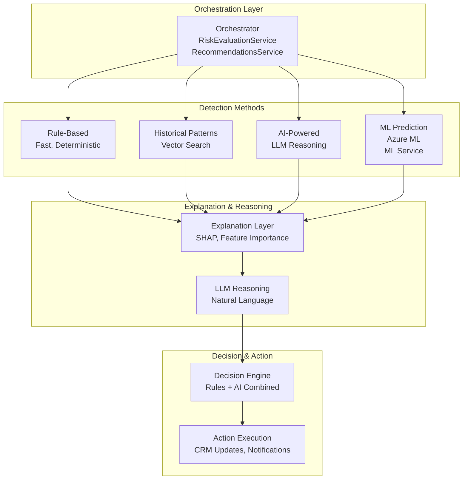

# CAIS Orchestration Patterns

**Date:** January 2025  
**Status:** 📋 **TARGET ARCHITECTURE** - Documenting both current state and planned ML integration  
**Version:** 1.0

## Overview

This document describes how the ML Service integrates with other components of the Compound AI System (CAIS) to deliver end-to-end intelligence. Orchestration is the coordination of ML models, LLMs, rules, and services to work together in a decision loop.

**Key Principle**: Each component has a clear responsibility, and orchestration combines them to create a system that is more than the sum of its parts.

## Orchestration Architecture

### High-Level Orchestration Flow



## Orchestration Patterns

### Pattern 1: Weighted Ensemble (Risk Detection)

**Current Implementation**: RiskEvaluationService orchestrates rule-based, historical, and AI detection methods.  
**Enhanced**: Adds ML predictions to the ensemble.

**Pattern**: Combine multiple detection methods with weighted confidence scores.

```typescript
// Weighted Ensemble Orchestration
async function orchestrateRiskDetection(
  opportunity: Opportunity,
  relatedShards: Shard[],
  tenantId: string,
  userId: string
): Promise<RiskDetectionResult> {
  const detectedRisks: Risk[] = [];
  const detectionMethods: string[] = [];
  
  // 1. Rule-based detection (fast, deterministic)
  const ruleBasedRisks = await detectRisksByRules(opportunity, relatedShards);
  // Weight: High confidence (0.8-1.0) for deterministic rules
  for (const risk of ruleBasedRisks) {
    risk.confidence = risk.confidence * 1.0; // Full weight for rules
    risk.detectionMethod = "rule";
  }
  detectedRisks.push(...ruleBasedRisks);
  detectionMethods.push("rule");
  
  // 2. Historical pattern matching (if enabled)
  if (options.includeHistorical) {
    const historicalRisks = await detectRisksByHistoricalPatterns(opportunity);
    // Weight: Medium-high confidence (0.7-0.9) for historical patterns
    for (const risk of historicalRisks) {
      risk.confidence = risk.confidence * 0.9; // Slight discount for historical
      risk.detectionMethod = "historical";
    }
    detectedRisks.push(...historicalRisks);
    detectionMethods.push("historical");
  }
  
  // 3. AI-powered detection (LLM reasoning)
  if (options.includeAI) {
    const aiRisks = await detectRisksByAI(opportunity, relatedShards);
    // Weight: Medium confidence (0.6-0.8) for AI (can be creative)
    for (const risk of aiRisks) {
      risk.confidence = risk.confidence * 0.8; // Discount for AI creativity
      risk.detectionMethod = "ai";
    }
    detectedRisks.push(...aiRisks);
    detectionMethods.push("ai");
  }
  
  // 4. ML prediction (NEW - from ML Service)
  if (options.includeML) {
    const mlRiskScore = await mlService.predictRiskScore(opportunity);
    // Weight: High confidence (0.8-0.95) for ML (learned patterns)
    if (mlRiskScore > threshold) {
      const mlRisks = await convertMLScoreToRisks(mlRiskScore, opportunity);
      for (const risk of mlRisks) {
        risk.confidence = risk.confidence * 0.9; // High weight for ML
        risk.detectionMethod = "ml";
      }
      detectedRisks.push(...mlRisks);
      detectionMethods.push("ml");
    }
  }
  
  // 5. Merge and deduplicate risks
  const mergedRisks = mergeRisks(detectedRisks, {
    // Merge strategy: Take highest confidence, combine explanations
    mergeStrategy: "max_confidence",
    deduplicationThreshold: 0.7 // Same risk if similarity > 0.7
  });
  
  // 6. Resolve conflicts
  const conflicts = detectConflicts(mergedRisks);
  const resolvedRisks = resolveConflicts(mergedRisks, conflicts, {
    // Conflict resolution: Prefer rule-based > ML > historical > AI
    priority: ["rule", "ml", "historical", "ai"]
  });
  
  return {
    risks: resolvedRisks,
    detectionMethods: detectionMethods,
    conflicts: conflicts
  };
}
```

### Pattern 2: Sequential Pipeline (Prediction → Explanation → Action)

**Pattern**: Chain components sequentially, where each layer builds on the previous.

```typescript
// Sequential Pipeline Orchestration
async function orchestrateOpportunityAnalysis(
  opportunityId: string,
  tenantId: string,
  userId: string
): Promise<AnalysisResult> {
  // Step 1: Extract features (Feature Engineering Layer - ML Service)
  const features = await mlService.extractFeatures(opportunityId, tenantId);
  
  // Step 2: ML prediction (Predictive Model Layer - ML Service)
  const mlPrediction = await mlService.predictRiskScore(features);
  
  // Step 3: Calculate explanations (Explanation Layer)
  const explanation = await calculateExplanation(mlPrediction, features);
  
  // Step 4: LLM reasoning (LLM Reasoning Layer)
  const llmOutput = await generateLLMExplanation(explanation, opportunityId);
  
  // Step 5: Decision & action (Decision & Action Engine)
  const decisions = await makeDecisions(mlPrediction, explanation, llmOutput);
  const actions = await executeActions(decisions, opportunityId);
  
  return {
    prediction: mlPrediction,
    explanation: explanation,
    reasoning: llmOutput,
    decisions: decisions,
    actions: actions
  };
}
```

### Pattern 3: Parallel Execution with Aggregation

**Pattern**: Execute multiple methods in parallel, then aggregate results.

```typescript
// Parallel Execution Orchestration
async function orchestrateParallelDetection(
  opportunity: Opportunity,
  relatedShards: Shard[],
  tenantId: string,
  userId: string
): Promise<RiskDetectionResult> {
  // Execute all detection methods in parallel
  const [ruleRisks, historicalRisks, aiRisks, mlRisks] = await Promise.all([
    detectRisksByRules(opportunity, relatedShards),
    detectRisksByHistoricalPatterns(opportunity),
    detectRisksByAI(opportunity, relatedShards),
    mlService.predictRiskScore(opportunity).then(score => 
      convertMLScoreToRisks(score, opportunity)
    )
  ]);
  
  // Aggregate results
  const allRisks = [
    ...ruleRisks.map(r => ({ ...r, method: "rule", weight: 1.0 })),
    ...historicalRisks.map(r => ({ ...r, method: "historical", weight: 0.9 })),
    ...aiRisks.map(r => ({ ...r, method: "ai", weight: 0.8 })),
    ...mlRisks.map(r => ({ ...r, method: "ml", weight: 0.9 }))
  ];
  
  // Weighted aggregation
  const aggregatedRisks = aggregateRisks(allRisks, {
    aggregationMethod: "weighted_average",
    weights: {
      rule: 1.0,
      historical: 0.9,
      ai: 0.8,
      ml: 0.9
    }
  });
  
  return aggregatedRisks;
}
```

### Pattern 4: Conditional Orchestration

**Pattern**: Choose orchestration path based on conditions (opportunity characteristics, data availability, etc.).

```typescript
// Conditional Orchestration
async function orchestrateConditional(
  opportunity: Opportunity,
  relatedShards: Shard[],
  tenantId: string,
  userId: string
): Promise<RiskDetectionResult> {
  // Determine orchestration strategy based on opportunity characteristics
  const strategy = determineStrategy(opportunity, {
    // High-value deals: Use all methods
    if (opportunity.amount > 1000000) {
      return "comprehensive"; // All methods
    }
    
    // Low-value deals: Use fast methods only
    if (opportunity.amount < 50000) {
      return "fast"; // Rule-based only
    }
    
    // Medium-value deals: Use rule-based + ML
    return "balanced"; // Rule-based + ML
  });
  
  // Execute based on strategy
  switch (strategy) {
    case "comprehensive":
      return await orchestrateComprehensive(opportunity, relatedShards, tenantId, userId);
    
    case "balanced":
      return await orchestrateBalanced(opportunity, relatedShards, tenantId, userId);
    
    case "fast":
      return await orchestrateFast(opportunity, relatedShards, tenantId, userId);
  }
}
```

## Service Integration Points

### RiskEvaluationService Integration

**Current**: Orchestrates rule-based, historical, and AI risk detection  
**Enhanced**: Adds ML predictions to orchestration

```typescript
class RiskEvaluationService {
  async evaluateOpportunity(
    opportunityId: string,
    tenantId: string,
    userId: string,
    options: EvaluationOptions
  ): Promise<RiskEvaluationResult> {
    // 1. Load opportunity and related shards
    const opportunity = await this.loadOpportunity(opportunityId, tenantId);
    const relatedShards = await this.loadRelatedShards(opportunityId, tenantId);
    
    // 2. Orchestrate risk detection (Pattern 1: Weighted Ensemble)
    const riskDetection = await this.orchestrateRiskDetection(
      opportunity,
      relatedShards,
      tenantId,
      userId,
      options
    );
    
    // 3. Calculate overall risk score
    const riskScore = await this.calculateRiskScore(riskDetection.risks);
    
    // 4. Generate explanations (Pattern 2: Sequential Pipeline)
    const explanation = await this.generateExplanation(
      riskDetection.risks,
      riskScore,
      opportunity
    );
    
    // 5. Make decisions (Decision Engine)
    const decisions = await this.makeDecisions(
      riskScore,
      riskDetection.risks,
      explanation,
      opportunity
    );
    
    // 6. Execute actions
    const actions = await this.executeActions(decisions, opportunityId, tenantId);
    
    return {
      riskScore: riskScore,
      risks: riskDetection.risks,
      explanation: explanation,
      decisions: decisions,
      actions: actions
    };
  }
}
```

### RecommendationsService Integration

**Current**: Vector search + collaborative filtering  
**Enhanced**: Adds ML ranking to recommendations

```typescript
class RecommendationsService {
  async getRecommendations(
    userId: string,
    opportunityId: string,
    context: RecommendationContext
  ): Promise<Recommendation[]> {
    // 1. Get candidate recommendations (existing methods)
    const candidates = await this.getCandidates(userId, opportunityId, context);
    
    // 2. ML ranking (NEW - from ML Service)
    const rankedCandidates = await mlService.rankRecommendations({
      userId: userId,
      candidates: candidates,
      context: context
    });
    
    // 3. Apply business rules
    const filteredCandidates = this.applyBusinessRules(rankedCandidates);
    
    return filteredCandidates;
  }
}
```

### ForecastingService Integration

**Current**: Probability-weighted estimates  
**Enhanced**: ML-powered forecasts with uncertainty

```typescript
class ForecastingService {
  async forecastRevenue(
    opportunityId: string,
    level: "opportunity" | "team" | "tenant"
  ): Promise<Forecast> {
    // 1. Extract features (ML Service)
    const features = await mlService.extractFeatures(opportunityId);
    
    // 2. ML forecast (NEW - from ML Service)
    const mlForecast = await mlService.predictForecast({
      features: features,
      level: level
    });
    
    // 3. Apply business rules
    const adjustedForecast = this.applyBusinessRules(mlForecast);
    
    return adjustedForecast;
  }
}
```

## Error Handling & Graceful Degradation

### Fallback Strategy

```typescript
// Graceful Degradation Pattern
async function evaluateOpportunity(opportunityId: string): Promise<EvaluationResult> {
  try {
    // Try ML prediction first
    const mlPrediction = await mlService.predictRiskScore(opportunityId);
    return mlPrediction;
  } catch (mlError) {
    // Fallback to rule-based
    const rulePrediction = await predictRuleBased(opportunityId);
    return rulePrediction;
  }
}

// LLM Fallback
async function generateExplanation(prediction: Prediction): Promise<Explanation> {
  try {
    // Try LLM explanation
    const llmExplanation = await llmService.explain(prediction);
    return llmExplanation;
  } catch (llmError) {
    // Fallback to template-based explanation
    const templateExplanation = generateTemplateExplanation(prediction);
    return templateExplanation;
  }
}
```

## Related Documentation

- [CAIS Architecture](./CAIS_ARCHITECTURE.md) - CAIS architecture details
- [Use Cases](./USE_CASES.md) - Use case documentation
- [Implementation](./IMPLEMENTATION.md) - Implementation strategy

---

**Document Status:** Complete  
**Last Updated:** January 2025  
**Next Review:** After Phase 1 implementation
