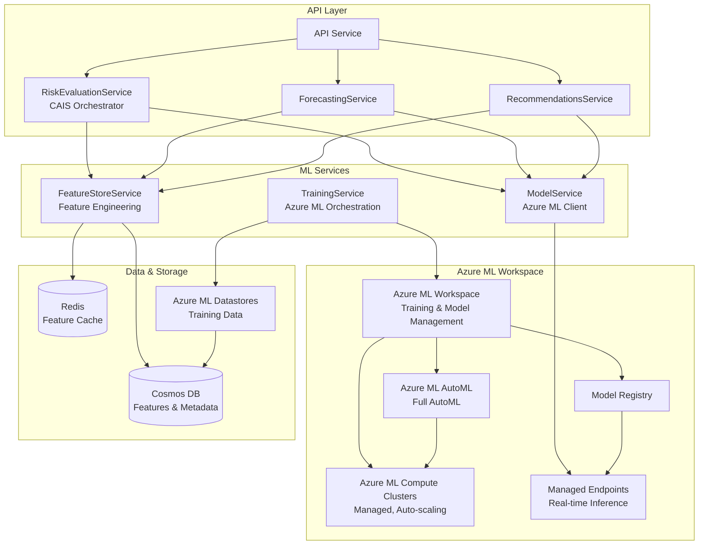

# ML Service Module

Machine learning model management and prediction service for Castiel's AI-native business intelligence platform.

**Service**: `containers/ml-service/`  
**Port**: 3033  
**API Base**: `/api/v1/ml`  
**Database**: Cosmos DB NoSQL (containers: `ml_models`, `ml_features`, `ml_training_jobs`, `ml_evaluations`, `ml_predictions`)

## Overview

The ML Service module provides machine learning model management, training, evaluation, and prediction capabilities. It is a critical component of Castiel's **Compound AI System (CAIS)** architecture, providing ML-powered predictions for three priority use cases: **Risk Scoring**, **Revenue Forecasting**, and **Recommendations**.

The service leverages **Azure ML Workspace** for managed training and **Azure ML Managed Endpoints** for serving, providing a simple, maintainable solution optimized for a small team while maximizing Azure services usage.

## Critical ML Enhancement Goal

The ML Service is the core of Castiel's critical ML enhancement, transforming the platform from **reactive** (analyzing what happened) to **predictive** (anticipating what will happen). This enables businesses to:

- **Proactively identify at-risk opportunities** before they're lost (Risk Scoring)
- **Predict future revenue** with confidence intervals, not just probability-weighted estimates (Revenue Forecasting)
- **Guide users to the most impactful actions** based on learned patterns (Recommendations)

## Features

### Core ML Capabilities

- **Feature Store**: Feature extraction and management
- **Model Management**: Model versioning and deployment via Azure ML
- **Training Service**: Model training and job management via Azure ML Workspace
- **Evaluation Service**: Model evaluation and metrics tracking
- **Calibration Service**: Model calibration for accurate predictions
- **Synthetic Data**: Synthetic data generation for initial training

### Priority Use Cases

1. **Risk Scoring** ⭐ - ML-powered risk score predictions (0-1 scale) for opportunities
2. **Revenue Forecasting** ⭐ - Predictive revenue forecasting at multiple levels (opportunity, team, tenant)
3. **Recommendations** ⭐ - ML-enhanced recommendation system for better personalization

### CAIS Integration

The ML Service is a component within Castiel's **Compound AI System (CAIS)** architecture:

- **ML Models** (Layer 3) - Learn patterns and make predictions
- **Feature Engineering** (Layer 2) - Transforms signals to features
- **Explanation Integration** (Layer 4) - SHAP values explain predictions
- **Feedback Loop** (Layer 7) - Collects feedback for continuous learning
- **Learning Loop** (Layer 8) - Continuous model improvement

See [CAIS Architecture](./CAIS_ARCHITECTURE.md) for detailed CAIS documentation.

## Architecture

### High-Level Architecture



### Key Components

1. **FeatureStoreService** - Extracts features from opportunities and related entities
2. **ModelService** - Manages model selection and calls Azure ML Managed Endpoints
3. **TrainingService** - Orchestrates training via Azure ML Workspace
4. **EvaluationService** - Tracks model performance and drift detection
5. **CalibrationService** - Calibrates models for accurate predictions

## Quick Start

### Prerequisites

- Node.js 20+
- Azure Cosmos DB NoSQL account
- Azure ML Workspace (Subscription: `main`, Resource Group: `castiel-ml-dev-rg`, Region: `eastus`)
- RabbitMQ 3.12+ (for event publishing)
- Redis (for feature and prediction caching)
- AI Service
- Logging Service

### Database Setup

The module uses Azure Cosmos DB NoSQL (shared database with prefixed containers):

- `ml_models` - ML models metadata (partition key: `/tenantId`)
- `ml_features` - Feature store (partition key: `/tenantId`)
- `ml_training_jobs` - Training jobs (partition key: `/tenantId`)
- `ml_evaluations` - Evaluation results (partition key: `/tenantId`)
- `ml_predictions` - Prediction history (partition key: `/tenantId`)

### Configuration

| Key | Type | Default | Description |
|-----|------|---------|-------------|
| server.port | number | 3033 | Server port |
| cosmos_db.endpoint | string | - | Cosmos DB endpoint URL (required) |
| cosmos_db.key | string | - | Cosmos DB key (required) |
| cosmos_db.database_id | string | castiel | Cosmos DB database ID |
| ai_service.url | string | - | AI Service URL (required) |
| azure_ml.workspace_name | string | - | Azure ML Workspace name (required) |
| azure_ml.resource_group | string | - | Azure ML Resource Group (required) |
| azure_ml.subscription_id | string | - | Azure ML Subscription ID (required) |
| redis.url | string | - | Redis connection URL (required) |

### Running

```bash
# Development
npm run dev

# Production
npm run build
npm start
```

## API Reference

### Key Endpoints

| Method | Endpoint | Description |
|--------|----------|-------------|
| POST | `/api/v1/ml/risk-scoring/predict` | Predict risk score for opportunity |
| POST | `/api/v1/ml/forecast/predict` | Predict revenue forecast |
| POST | `/api/v1/ml/recommendations` | Get ML-enhanced recommendations |
| GET | `/api/v1/ml/models` | List all models |
| POST | `/api/v1/ml/models` | Create/register model |
| GET | `/api/v1/ml/models/:id` | Get model details |
| POST | `/api/v1/ml/training/jobs` | Create training job |
| GET | `/api/v1/ml/training/jobs/:id` | Get training job status |
| POST | `/api/v1/ml/evaluation` | Evaluate model performance |
| POST | `/api/v1/ml/calibration` | Calibrate model |

### Example: Risk Scoring Prediction

```typescript
// Request
POST /api/v1/ml/risk-scoring/predict
{
  "opportunityId": "opp_123",
  "tenantId": "tenant_456",
  "includeExplanation": true
}

// Response
{
  "riskScore": 0.75,
  "categoryScores": {
    "commercial": 0.80,
    "technical": 0.65,
    "financial": 0.70
  },
  "confidence": 0.85,
  "explanation": {
    "shapValues": {...},
    "featureImportance": {...},
    "naturalLanguage": "The opportunity has a high risk score primarily due to..."
  }
}
```

## Events

### Published Events

- `ml.model.trained` - Model training completed
- `ml.model.deployed` - Model deployed to endpoint
- `ml.prediction.made` - Prediction made (for tracking)
- `ml.model.drift_detected` - Model drift detected

### Consumed Events

- `opportunity.updated` - Invalidates feature cache
- `opportunity.created` - Triggers feature extraction
- `outcome.recorded` - Updates training data

## Model Architecture Strategy

### Hybrid Approach: Global Models + Industry Fine-Tuning

**Phase 1: Global Models (Initial Implementation)**
- **3 global models** (one per priority use case):
  - Global Risk Scoring Model
  - Global Forecasting Model
  - Global Recommendations Model
- Each model trained on **all industries** with industry as a feature
- Works immediately for all industries, including new ones

**Phase 2: Industry-Specific Models (When Justified)**
- Add industry-specific models only when:
  - **Data Threshold**: >3000 examples with outcomes for that industry
  - **Performance Improvement**: >5% better than global model (validated)
  - **Business Value**: High-value industry or distinct patterns
- Industry models are **fine-tuned from global models** (transfer learning)
- Expected: 3-15 total models (vs. 48+ with pure industry approach)

### Model Types

- **Risk Scoring**: Regression (XGBoost/LightGBM via AutoML)
- **Revenue Forecasting**: Regression / Time Series (XGBoost/LightGBM via AutoML)
- **Recommendations**: Ranking (XGBoost Ranker via AutoML)

### Performance Targets

**Risk Scoring:**
- R² score: >85%
- Calibration Error: <0.05
- Brier Score: <0.15
- AUC: >0.80

**Revenue Forecasting:**
- MAPE: <15%
- Forecast Bias: <5%
- R²: >0.75

**Recommendations:**
- NDCG@10: >0.75
- CTR Uplift: >20%
- Precision@10: >0.50

## Azure ML Integration

### Training Infrastructure

- **Azure ML Workspace**: Managed training platform
- **Azure ML Compute Clusters**: Managed, auto-scaling compute
- **Azure ML AutoML**: Full automated model selection and training
- **Azure ML Pipelines**: Training orchestration
- **Azure ML Model Registry**: Model versioning

### Inference Infrastructure

- **Azure ML Managed Endpoints**: Real-time inference
- **Auto-scaling**: 0-10 instances (configurable)
- **High Availability**: Automatic failover
- **Authentication**: Managed Identity

### Monitoring

- **Application Insights**: Unified monitoring for all ML metrics
- **Custom Dashboards**: ML-specific metrics
- **Alerts**: Configured in Application Insights

## Dependencies

- **AI Service**: For LLM explanations and reasoning
- **Shard Manager**: For opportunity data access
- **Logging**: For audit logging
- **Redis**: For feature and prediction caching
- **Azure ML Workspace**: For model training and serving

## Documentation

For detailed documentation, see:

- [CAIS Architecture](./CAIS_ARCHITECTURE.md) - Compound AI System architecture
- [Use Cases](./USE_CASES.md) - Detailed use case documentation
- [Implementation](./IMPLEMENTATION.md) - Implementation strategy and roadmap
- [Orchestration](./ORCHESTRATION.md) - CAIS orchestration patterns

## Related Documentation

- [Global CAIS Overview](../../../global/CAIS_OVERVIEW.md) - High-level CAIS overview
- [AI Insights Module](../ai-insights/README.md) - AI insights and risk analysis
- [Pipeline Manager Module](../pipeline-manager/README.md) - Sales pipeline management

## License

Proprietary