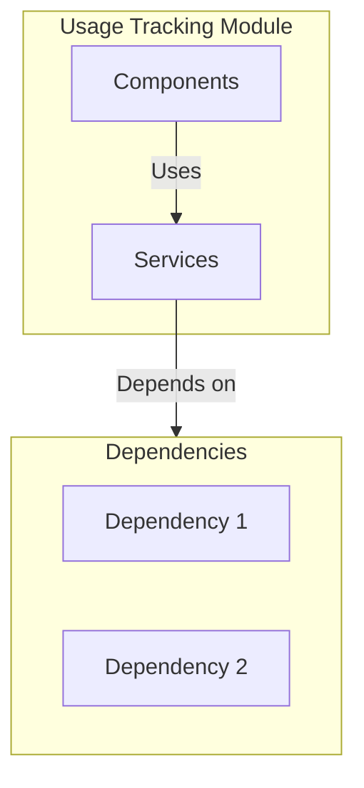

# Usage Tracking Module

> **📋 Detailed Specification**: See [SPECIFICATION.md](./SPECIFICATION.md) for comprehensive module specification including architecture, data models, API endpoints, and implementation guidelines.

## Overview

The Usage Tracking module provides metering, quotas, and billing across the entire system. It includes both backend API services and frontend UI components.

## Purpose

- Usage metering
- Quota management
- Billing integration
- API cost tracking
- Model usage tracking
- Budget management

## Location

- **Backend Source**: `containers/usage-tracking/src/`
- **Port**: 3004
- **API Base**: `/api/v1/usage`
- **Category**: Extension Module

## Architecture



## Key Features

1. **Feature 1**
   - Description of feature 1

2. **Feature 2**
   - Description of feature 2

3. **Feature 3**
   - Description of feature 3

## Components

- Component 1 - Description
- Component 2 - Description
- Component 3 - Description

## Dependencies

- Dependency 1
- Dependency 2
- Dependency 3

## Related Modules

- Related module 1
- Related module 2

## Usage

```typescript
// Usage example
import { ModuleName } from '@/path/to/module';
```

## Related Documentation

- [Module Overview](../../global/ModuleOverview.md) - System-wide module overview

## See Also

- [API Documentation](./API.md) - API endpoints and schemas
- [Architecture Details](./ARCHITECTURE.md) - Architecture and design
- [Code Examples](./EXAMPLES.md) - Usage examples
