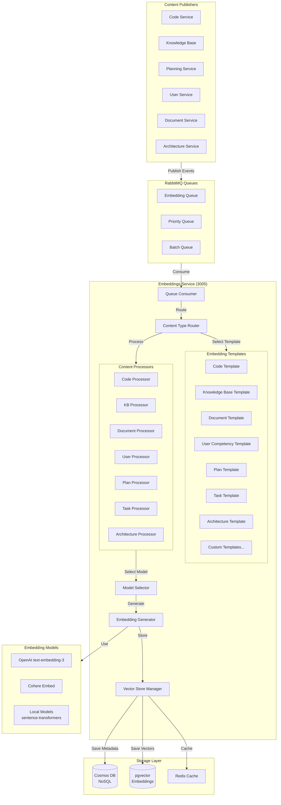

# Universal Embeddings Service Architecture

## Overview

The Embeddings Service should be a **universal semantic indexing system** capable of embedding any type of content in the system. This document outlines a flexible, extensible architecture using queue-based processing and pluggable content type handlers.

---

## Core Principles

1. **Content Type Agnostic** - Any content type can be embedded
2. **Pluggable Architecture** - Easy to add/remove content types
3. **Queue-Based Processing** - Asynchronous, scalable embedding generation
4. **Template-Based** - Each content type has customizable embedding templates
5. **Incremental Updates** - Only re-embed changed content
6. **Multi-Model Support** - Different embedding models for different content types
7. **Version Control** - Track embedding versions as models improve

---

## Architecture Diagram



---

## Content Type Registry

### Content Type Definition

Each content type is defined by a configuration object:

```typescript
interface ContentTypeDefinition {
  // Identification
  type: string;                    // e.g., 'code', 'knowledge_base', 'user_competency'
  version: string;                 // Template version
  enabled: boolean;                // Can be disabled without code changes
  
  // Processing
  processor: ContentProcessor;     // How to extract text for embedding
  template: EmbeddingTemplate;     // How to structure the embedding
  
  // Model Configuration
  model: {
    provider: 'openai' | 'cohere' | 'local' | 'custom';
    modelName: string;             // Specific model
    dimensions: number;            // Vector dimensions
    chunkSize?: number;            // For chunking large content
    chunkOverlap?: number;         // Overlap between chunks
  };
  
  // Queue Configuration
  queue: {
    priority: number;              // 1-10, higher = more important
    batchSize?: number;            // Batch processing size
    rateLimitPerMinute?: number;   // Rate limiting
  };
  
  // Metadata
  metadata: {
    description: string;
    fields: string[];              // What fields are embedded
    searchable: boolean;           // Can be searched
    ttl?: number;                  // Time to live (seconds)
  };
  
  // Lifecycle Hooks
  hooks?: {
    beforeEmbed?: (content: any) => any;
    afterEmbed?: (content: any, embedding: number[]) => void;
    onError?: (content: any, error: Error) => void;
  };
}
```

---

## Default Content Types

### 1. Code Embeddings

```typescript
const codeEmbedding: ContentTypeDefinition = {
  type: 'code',
  version: '1.0.0',
  enabled: true,
  
  processor: new CodeProcessor({
    includeComments: true,
    includeDocstrings: true,
    includeFunctionSignatures: true,
    includeImports: true,
  }),
  
  template: {
    structure: `
File: {{filePath}}
Language: {{language}}
Module: {{moduleName}}

{{#if description}}
Description: {{description}}
{{/if}}

{{#if functionSignature}}
Function: {{functionSignature}}
{{/if}}

{{#if dependencies}}
Dependencies: {{dependencies}}
{{/if}}

Code:
{{code}}

{{#if comments}}
Comments: {{comments}}
{{/if}}
    `,
    contextWindow: 8000,  // Max tokens for context
  },
  
  model: {
    provider: 'openai',
    modelName: 'text-embedding-3-large',
    dimensions: 3072,
    chunkSize: 2000,
    chunkOverlap: 200,
  },
  
  queue: {
    priority: 7,
    batchSize: 50,
    rateLimitPerMinute: 1000,
  },
  
  metadata: {
    description: 'Source code embeddings for semantic code search',
    fields: ['filePath', 'code', 'comments', 'language', 'moduleName'],
    searchable: true,
  },
};
```

### 2. Knowledge Base Embeddings

```typescript
const knowledgeBaseEmbedding: ContentTypeDefinition = {
  type: 'knowledge_base',
  version: '1.0.0',
  enabled: true,
  
  processor: new MarkdownProcessor({
    includeHeaders: true,
    includeCodeBlocks: true,
    includeTables: true,
    extractLinks: true,
  }),
  
  template: {
    structure: `
Title: {{title}}
Category: {{category}}
{{#if tags}}
Tags: {{tags}}
{{/if}}

{{#if author}}
Author: {{author}}
Last Updated: {{updatedAt}}
{{/if}}

Content:
{{content}}

{{#if relatedArticles}}
Related: {{relatedArticles}}
{{/if}}
    `,
    contextWindow: 8000,
  },
  
  model: {
    provider: 'openai',
    modelName: 'text-embedding-3-large',
    dimensions: 3072,
    chunkSize: 3000,
    chunkOverlap: 300,
  },
  
  queue: {
    priority: 6,
    batchSize: 20,
    rateLimitPerMinute: 500,
  },
  
  metadata: {
    description: 'Knowledge base articles for documentation search',
    fields: ['title', 'content', 'category', 'tags'],
    searchable: true,
  },
};
```

### 3. Document Embeddings

```typescript
const documentEmbedding: ContentTypeDefinition = {
  type: 'document',
  version: '1.0.0',
  enabled: true,
  
  processor: new DocumentProcessor({
    supportedFormats: ['pdf', 'docx', 'txt', 'md'],
    extractMetadata: true,
    ocrEnabled: true,  // For scanned PDFs
  }),
  
  template: {
    structure: `
Document: {{fileName}}
Type: {{fileType}}
{{#if metadata}}
Created: {{metadata.createdAt}}
Modified: {{metadata.modifiedAt}}
Author: {{metadata.author}}
{{/if}}

{{#if summary}}
Summary: {{summary}}
{{/if}}

Content:
{{content}}
    `,
    contextWindow: 8000,
  },
  
  model: {
    provider: 'openai',
    modelName: 'text-embedding-3-large',
    dimensions: 3072,
    chunkSize: 2500,
    chunkOverlap: 250,
  },
  
  queue: {
    priority: 5,
    batchSize: 10,
    rateLimitPerMinute: 300,
  },
  
  metadata: {
    description: 'Generic document embeddings',
    fields: ['fileName', 'content', 'fileType'],
    searchable: true,
  },
};
```

### 4. User Competency Embeddings

```typescript
const userCompetencyEmbedding: ContentTypeDefinition = {
  type: 'user_competency',
  version: '1.0.0',
  enabled: true,
  
  processor: new UserCompetencyProcessor({
    includeSkills: true,
    includeExperience: true,
    includeCodeOwnership: true,
  }),
  
  template: {
    structure: `
User: {{userName}}
Role: {{role}}

Skills and Competencies:
{{#each skills}}
- {{name}}: {{level}} ({{yearsExperience}} years)
  {{#if description}}{{description}}{{/if}}
{{/each}}

{{#if expertise}}
Areas of Expertise:
{{expertise}}
{{/if}}

{{#if codeOwnership}}
Code Ownership:
{{#each codeOwnership}}
- {{module}}: {{contributionPercentage}}%
{{/each}}
{{/if}}

{{#if recentWork}}
Recent Work:
{{recentWork}}
{{/if}}
    `,
    contextWindow: 4000,
  },
  
  model: {
    provider: 'openai',
    modelName: 'text-embedding-3-small',  // Smaller for efficiency
    dimensions: 1536,
  },
  
  queue: {
    priority: 4,
    batchSize: 100,
    rateLimitPerMinute: 200,
  },
  
  metadata: {
    description: 'User skills and competencies for team matching',
    fields: ['userName', 'skills', 'expertise', 'codeOwnership'],
    searchable: true,
  },
};
```

### 5. Project Plan Embeddings

```typescript
const projectPlanEmbedding: ContentTypeDefinition = {
  type: 'project_plan',
  version: '1.0.0',
  enabled: true,
  
  processor: new PlanProcessor({
    includeSteps: true,
    includeContext: true,
    includeValidation: true,
  }),
  
  template: {
    structure: `
Plan: {{planTitle}}
Type: {{planType}}
Status: {{status}}

Objective:
{{objective}}

{{#if context}}
Context:
{{context}}
{{/if}}

Implementation Steps:
{{#each steps}}
{{stepNumber}}. {{description}}
   Type: {{type}}
   {{#if dependencies}}Dependencies: {{dependencies}}{{/if}}
{{/each}}

{{#if technicalDetails}}
Technical Details:
{{technicalDetails}}
{{/if}}

{{#if risks}}
Risks:
{{risks}}
{{/if}}
    `,
    contextWindow: 10000,
  },
  
  model: {
    provider: 'openai',
    modelName: 'text-embedding-3-large',
    dimensions: 3072,
    chunkSize: 4000,
    chunkOverlap: 400,
  },
  
  queue: {
    priority: 8,  // High priority
    batchSize: 15,
    rateLimitPerMinute: 400,
  },
  
  metadata: {
    description: 'Project plans for similar plan search',
    fields: ['planTitle', 'objective', 'steps', 'technicalDetails'],
    searchable: true,
  },
};
```

### 6. Task Embeddings

```typescript
const taskEmbedding: ContentTypeDefinition = {
  type: 'task',
  version: '1.0.0',
  enabled: true,
  
  processor: new TaskProcessor({
    includeDescription: true,
    includeContext: true,
    includeAcceptanceCriteria: true,
  }),
  
  template: {
    structure: `
Task: {{title}}
Type: {{taskType}}
Priority: {{priority}}
Status: {{status}}

Description:
{{description}}

{{#if acceptanceCriteria}}
Acceptance Criteria:
{{acceptanceCriteria}}
{{/if}}

{{#if technicalNotes}}
Technical Notes:
{{technicalNotes}}
{{/if}}

{{#if relatedTasks}}
Related Tasks: {{relatedTasks}}
{{/if}}
    `,
    contextWindow: 3000,
  },
  
  model: {
    provider: 'openai',
    modelName: 'text-embedding-3-small',
    dimensions: 1536,
  },
  
  queue: {
    priority: 6,
    batchSize: 50,
    rateLimitPerMinute: 500,
  },
  
  metadata: {
    description: 'Tasks for similar task search and recommendations',
    fields: ['title', 'description', 'taskType'],
    searchable: true,
  },
};
```

### 7. Architecture Embeddings

```typescript
const architectureEmbedding: ContentTypeDefinition = {
  type: 'architecture',
  version: '1.0.0',
  enabled: true,
  
  processor: new ArchitectureProcessor({
    includeDecisions: true,
    includePatterns: true,
    includeDiagrams: true,  // Text description of diagrams
  }),
  
  template: {
    structure: `
Component: {{componentName}}
Type: {{componentType}}

Architecture Decision:
{{decision}}

{{#if patterns}}
Design Patterns Used:
{{patterns}}
{{/if}}

{{#if dependencies}}
Dependencies:
{{dependencies}}
{{/if}}

{{#if constraints}}
Constraints:
{{constraints}}
{{/if}}

{{#if rationale}}
Rationale:
{{rationale}}
{{/if}}

{{#if alternatives}}
Alternatives Considered:
{{alternatives}}
{{/if}}
    `,
    contextWindow: 6000,
  },
  
  model: {
    provider: 'openai',
    modelName: 'text-embedding-3-large',
    dimensions: 3072,
    chunkSize: 3000,
    chunkOverlap: 300,
  },
  
  queue: {
    priority: 7,
    batchSize: 20,
    rateLimitPerMinute: 400,
  },
  
  metadata: {
    description: 'Architecture decisions and patterns',
    fields: ['componentName', 'decision', 'patterns', 'rationale'],
    searchable: true,
  },
};
```

---

## Queue-Based Processing System

### Queue Structure

```typescript
// RabbitMQ Exchange and Queue Configuration
const embeddingQueues = {
  // Main embedding queue
  main: {
    exchange: 'embeddings.main',
    routingKey: 'embed.*',
    queue: 'embeddings.processing',
    options: {
      durable: true,
      deadLetterExchange: 'embeddings.dlx',
      messageTtl: 3600000, // 1 hour
    },
  },
  
  // Priority queue for urgent embeddings
  priority: {
    exchange: 'embeddings.priority',
    routingKey: 'embed.priority.*',
    queue: 'embeddings.priority',
    options: {
      durable: true,
      maxPriority: 10,
    },
  },
  
  // Batch queue for bulk operations
  batch: {
    exchange: 'embeddings.batch',
    routingKey: 'embed.batch.*',
    queue: 'embeddings.batch',
    options: {
      durable: true,
      prefetchCount: 1, // Process one batch at a time
    },
  },
  
  // Dead letter queue for failed embeddings
  deadLetter: {
    exchange: 'embeddings.dlx',
    queue: 'embeddings.failed',
    options: {
      durable: true,
    },
  },
};
```

### Queue Message Format

```typescript
interface EmbeddingQueueMessage {
  // Message Identification
  messageId: string;
  timestamp: number;
  
  // Content Information
  contentType: string;           // 'code', 'knowledge_base', etc.
  contentId: string;             // Unique ID of the content
  operation: 'create' | 'update' | 'delete';
  
  // Content Data
  content: {
    [key: string]: any;          // Flexible content structure
  };
  
  // Processing Options
  options?: {
    priority?: number;           // Override default priority
    forceRegenerate?: boolean;   // Regenerate even if exists
    model?: string;              // Override default model
    batchId?: string;            // For batch processing
  };
  
  // Retry Information
  retry?: {
    attempt: number;
    maxAttempts: number;
    lastError?: string;
  };
  
  // Metadata
  metadata?: {
    source: string;              // Which service published
    userId?: string;
    organizationId?: string;
    projectId?: string;
  };
}
```

### Publishing Events

```typescript
// Example: Publishing from Knowledge Base service
class KnowledgeBaseService {
  async createArticle(article: Article) {
    // 1. Save article to database
    const savedArticle = await this.db.article.create({ data: article });
    
    // 2. Publish embedding event
    await this.publishEmbeddingEvent({
      messageId: uuidv4(),
      timestamp: Date.now(),
      contentType: 'knowledge_base',
      contentId: savedArticle.id,
      operation: 'create',
      content: {
        title: savedArticle.title,
        content: savedArticle.content,
        category: savedArticle.category,
        tags: savedArticle.tags,
        author: savedArticle.author,
        updatedAt: savedArticle.updatedAt,
      },
      metadata: {
        source: 'knowledge-base-service',
        userId: savedArticle.authorId,
        organizationId: savedArticle.organizationId,
      },
    });
    
    return savedArticle;
  }
  
  private async publishEmbeddingEvent(message: EmbeddingQueueMessage) {
    const routingKey = `embed.${message.contentType}`;
    await this.rabbitmq.publish(
      'embeddings.main',
      routingKey,
      message,
      { priority: message.options?.priority || 5 }
    );
  }
}
```

### Batch Processing

```typescript
// Batch embedding for bulk operations
class BatchEmbeddingService {
  async embedBulkCodeFiles(files: CodeFile[]) {
    const batchId = uuidv4();
    
    // Create batch record
    await this.db.embeddingBatch.create({
      data: {
        id: batchId,
        contentType: 'code',
        totalItems: files.length,
        status: 'queued',
      },
    });
    
    // Publish batch message
    await this.rabbitmq.publish(
      'embeddings.batch',
      'embed.batch.code',
      {
        messageId: uuidv4(),
        timestamp: Date.now(),
        contentType: 'code',
        operation: 'create',
        content: {
          batchId,
          files: files.map(f => ({
            contentId: f.id,
            filePath: f.path,
            code: f.content,
            language: f.language,
          })),
        },
        options: {
          batchId,
        },
      }
    );
    
    return batchId;
  }
  
  async getBatchStatus(batchId: string) {
    return await this.db.embeddingBatch.findUnique({
      where: { id: batchId },
      include: {
        progress: true,
      },
    });
  }
}
```

---

## Embedding Service Implementation

### Queue Consumer

```typescript
class EmbeddingQueueConsumer {
  private contentTypeRegistry: Map<string, ContentTypeDefinition>;
  
  constructor(private config: EmbeddingServiceConfig) {
    this.contentTypeRegistry = this.loadContentTypes();
  }
  
  async start() {
    // Start consuming from all queues
    await this.consumeMainQueue();
    await this.consumePriorityQueue();
    await this.consumeBatchQueue();
  }
  
  private async consumeMainQueue() {
    await this.rabbitmq.consume(
      'embeddings.processing',
      async (message: EmbeddingQueueMessage) => {
        await this.processMessage(message);
      },
      {
        prefetchCount: 10, // Process 10 messages concurrently
      }
    );
  }
  
  private async consumePriorityQueue() {
    await this.rabbitmq.consume(
      'embeddings.priority',
      async (message: EmbeddingQueueMessage) => {
        await this.processMessage(message, { priority: true });
      },
      {
        prefetchCount: 5,
      }
    );
  }
  
  private async consumeBatchQueue() {
    await this.rabbitmq.consume(
      'embeddings.batch',
      async (message: EmbeddingQueueMessage) => {
        await this.processBatchMessage(message);
      },
      {
        prefetchCount: 1, // One batch at a time
      }
    );
  }
  
  private async processMessage(
    message: EmbeddingQueueMessage,
    options?: { priority?: boolean }
  ) {
    try {
      // 1. Get content type definition
      const contentTypeDef = this.contentTypeRegistry.get(message.contentType);
      if (!contentTypeDef || !contentTypeDef.enabled) {
        throw new Error(`Content type ${message.contentType} not found or disabled`);
      }
      
      // 2. Check if embedding already exists
      if (!message.options?.forceRegenerate) {
        const existing = await this.checkExistingEmbedding(
          message.contentType,
          message.contentId
        );
        if (existing) {
          console.log(`Embedding already exists for ${message.contentId}, skipping`);
          return;
        }
      }
      
      // 3. Execute before hook
      let content = message.content;
      if (contentTypeDef.hooks?.beforeEmbed) {
        content = await contentTypeDef.hooks.beforeEmbed(content);
      }
      
      // 4. Process content using processor
      const processedContent = await contentTypeDef.processor.process(content);
      
      // 5. Apply template
      const embeddingText = await this.applyTemplate(
        contentTypeDef.template,
        processedContent
      );
      
      // 6. Generate embedding
      const embedding = await this.generateEmbedding(
        embeddingText,
        contentTypeDef.model
      );
      
      // 7. Store embedding
      await this.storeEmbedding({
        contentType: message.contentType,
        contentId: message.contentId,
        embedding: embedding.vector,
        metadata: {
          ...processedContent.metadata,
          model: contentTypeDef.model.modelName,
          dimensions: contentTypeDef.model.dimensions,
          version: contentTypeDef.version,
          createdAt: new Date(),
        },
        text: embeddingText, // Store for debugging
      });
      
      // 8. Execute after hook
      if (contentTypeDef.hooks?.afterEmbed) {
        await contentTypeDef.hooks.afterEmbed(content, embedding.vector);
      }
      
      // 9. Publish success event
      await this.publishEmbeddingComplete(message);
      
    } catch (error) {
      console.error(`Error processing embedding for ${message.contentId}:`, error);
      
      // Execute error hook
      const contentTypeDef = this.contentTypeRegistry.get(message.contentType);
      if (contentTypeDef?.hooks?.onError) {
        await contentTypeDef.hooks.onError(message.content, error);
      }
      
      // Retry logic
      await this.handleError(message, error);
    }
  }
  
  private async processBatchMessage(message: EmbeddingQueueMessage) {
    const { batchId, files } = message.content;
    
    // Update batch status
    await this.db.embeddingBatch.update({
      where: { id: batchId },
      data: { status: 'processing' },
    });
    
    let processed = 0;
    let failed = 0;
    
    // Process in chunks to avoid overwhelming the API
    const chunkSize = 10;
    for (let i = 0; i < files.length; i += chunkSize) {
      const chunk = files.slice(i, i + chunkSize);
      
      await Promise.allSettled(
        chunk.map(async (file) => {
          try {
            await this.processMessage({
              ...message,
              contentId: file.contentId,
              content: file,
            });
            processed++;
          } catch (error) {
            failed++;
          }
          
          // Update progress
          await this.db.embeddingBatch.update({
            where: { id: batchId },
            data: {
              processed: processed + failed,
              succeeded: processed,
              failed: failed,
            },
          });
        })
      );
    }
    
    // Mark batch as complete
    await this.db.embeddingBatch.update({
      where: { id: batchId },
      data: { status: 'completed', completedAt: new Date() },
    });
  }
}
```

### Template Engine

```typescript
class EmbeddingTemplateEngine {
  private handlebars: typeof Handlebars;
  
  constructor() {
    this.handlebars = Handlebars.create();
    this.registerHelpers();
  }
  
  private registerHelpers() {
    // Register custom helpers
    this.handlebars.registerHelper('truncate', (str: string, len: number) => {
      return str.length > len ? str.substring(0, len) + '...' : str;
    });
    
    this.handlebars.registerHelper('join', (array: string[], separator: string) => {
      return array.join(separator);
    });
    
    this.handlebars.registerHelper('formatDate', (date: Date) => {
      return date.toISOString();
    });
  }
  
  async render(template: string, data: any): Promise<string> {
    const compiled = this.handlebars.compile(template);
    const rendered = compiled(data);
    
    // Clean up extra whitespace
    return rendered.replace(/\n{3,}/g, '\n\n').trim();
  }
}
```

### Content Processors

```typescript
// Base processor interface
interface ContentProcessor {
  process(content: any): Promise<ProcessedContent>;
}

interface ProcessedContent {
  text: string;
  metadata: Record<string, any>;
  chunks?: string[];  // For large content
}

// Code processor example
class CodeProcessor implements ContentProcessor {
  constructor(private options: CodeProcessorOptions) {}
  
  async process(content: any): Promise<ProcessedContent> {
    const { code, filePath, language } = content;
    
    // Parse AST
    const ast = await this.parseAST(code, language);
    
    // Extract comments
    const comments = this.extractComments(ast);
    
    // Extract function signatures
    const signatures = this.extractSignatures(ast);
    
    // Extract imports
    const imports = this.extractImports(ast);
    
    return {
      text: code,
      metadata: {
        filePath,
        language,
        comments: comments.join('\n'),
        functionSignatures: signatures,
        dependencies: imports,
        linesOfCode: code.split('\n').length,
      },
    };
  }
  
  private async parseAST(code: string, language: string) {
    // Use tree-sitter or TypeScript compiler API
    // Implementation depends on language
  }
  
  private extractComments(ast: any): string[] {
    // Extract all comments from AST
  }
  
  private extractSignatures(ast: any): string[] {
    // Extract function/class signatures
  }
  
  private extractImports(ast: any): string[] {
    // Extract import statements
  }
}
```

### Model Selector and Generator

```typescript
class EmbeddingModelSelector {
  private models: Map<string, EmbeddingModel>;
  
  constructor() {
    this.models = new Map([
      ['openai-large', new OpenAIEmbeddingModel('text-embedding-3-large')],
      ['openai-small', new OpenAIEmbeddingModel('text-embedding-3-small')],
      ['cohere-english', new CohereEmbeddingModel('embed-english-v3.0')],
      ['local-all-minilm', new LocalEmbeddingModel('all-MiniLM-L6-v2')],
    ]);
  }
  
  selectModel(config: ModelConfig): EmbeddingModel {
    const key = `${config.provider}-${config.modelName.split('-').pop()}`;
    return this.models.get(key) || this.models.get('openai-large')!;
  }
}

class EmbeddingGenerator {
  constructor(
    private modelSelector: EmbeddingModelSelector,
    private cache: Redis
  ) {}
  
  async generate(
    text: string,
    config: ModelConfig
  ): Promise<{ vector: number[]; model: string }> {
    // Check cache first
    const cacheKey = this.getCacheKey(text, config);
    const cached = await this.cache.get(cacheKey);
    if (cached) {
      return JSON.parse(cached);
    }
    
    // Select model
    const model = this.modelSelector.selectModel(config);
    
    // Handle chunking if text is too large
    if (text.length > (config.chunkSize || 8000)) {
      return await this.generateChunked(text, model, config);
    }
    
    // Generate embedding
    const vector = await model.embed(text);
    
    const result = {
      vector,
      model: config.modelName,
    };
    
    // Cache result
    await this.cache.setex(cacheKey, 3600, JSON.stringify(result));
    
    return result;
  }
  
  private async generateChunked(
    text: string,
    model: EmbeddingModel,
    config: ModelConfig
  ): Promise<{ vector: number[]; model: string }> {
    // Split into chunks
    const chunks = this.chunkText(text, config.chunkSize!, config.chunkOverlap!);
    
    // Generate embeddings for each chunk
    const embeddings = await Promise.all(
      chunks.map(chunk => model.embed(chunk))
    );
    
    // Average the embeddings (simple approach)
    // More sophisticated: weighted average, attention, etc.
    const avgEmbedding = this.averageEmbeddings(embeddings);
    
    return {
      vector: avgEmbedding,
      model: config.modelName,
    };
  }
  
  private chunkText(
    text: string,
    chunkSize: number,
    overlap: number
  ): string[] {
    const chunks: string[] = [];
    let start = 0;
    
    while (start < text.length) {
      const end = Math.min(start + chunkSize, text.length);
      chunks.push(text.substring(start, end));
      start += chunkSize - overlap;
    }
    
    return chunks;
  }
  
  private averageEmbeddings(embeddings: number[][]): number[] {
    const dim = embeddings[0].length;
    const avg = new Array(dim).fill(0);
    
    for (const emb of embeddings) {
      for (let i = 0; i < dim; i++) {
        avg[i] += emb[i];
      }
    }
    
    return avg.map(v => v / embeddings.length);
  }
  
  private getCacheKey(text: string, config: ModelConfig): string {
    const hash = crypto.createHash('sha256').update(text).digest('hex');
    return `embedding:${config.modelName}:${hash}`;
  }
}
```

---

## Database Schema

```sql
-- Embeddings table (metadata)
CREATE TABLE embeddings (
  id UUID PRIMARY KEY DEFAULT gen_random_uuid(),
  
  -- Content identification
  content_type VARCHAR(50) NOT NULL,
  content_id VARCHAR(255) NOT NULL,
  
  -- Embedding metadata
  model VARCHAR(100) NOT NULL,
  dimensions INTEGER NOT NULL,
  version VARCHAR(20) NOT NULL,
  
  -- Embedding vector (stored in pgvector)
  embedding vector(3072),  -- Adjust dimension as needed
  
  -- Original text (for debugging/reprocessing)
  embedding_text TEXT,
  
  -- Metadata JSON
  metadata JSONB,
  
  -- Timestamps
  created_at TIMESTAMP DEFAULT NOW(),
  updated_at TIMESTAMP DEFAULT NOW(),
  
  -- Unique constraint
  UNIQUE(content_type, content_id)
);

-- Indexes for efficient search
CREATE INDEX idx_embeddings_content ON embeddings(content_type, content_id);
CREATE INDEX idx_embeddings_created ON embeddings(created_at);

-- Vector similarity search index (HNSW algorithm)
CREATE INDEX idx_embeddings_vector ON embeddings 
USING hnsw (embedding vector_cosine_ops);

-- Content type configurations
CREATE TABLE embedding_content_types (
  type VARCHAR(50) PRIMARY KEY,
  version VARCHAR(20) NOT NULL,
  enabled BOOLEAN DEFAULT true,
  config JSONB NOT NULL,
  created_at TIMESTAMP DEFAULT NOW(),
  updated_at TIMESTAMP DEFAULT NOW()
);

-- Batch processing tracking
CREATE TABLE embedding_batches (
  id UUID PRIMARY KEY DEFAULT gen_random_uuid(),
  content_type VARCHAR(50) NOT NULL,
  total_items INTEGER NOT NULL,
  processed INTEGER DEFAULT 0,
  succeeded INTEGER DEFAULT 0,
  failed INTEGER DEFAULT 0,
  status VARCHAR(20) DEFAULT 'queued',
  created_at TIMESTAMP DEFAULT NOW(),
  completed_at TIMESTAMP
);

-- Failed embeddings (for retry)
CREATE TABLE embedding_failures (
  id UUID PRIMARY KEY DEFAULT gen_random_uuid(),
  content_type VARCHAR(50) NOT NULL,
  content_id VARCHAR(255) NOT NULL,
  error_message TEXT,
  retry_count INTEGER DEFAULT 0,
  last_retry TIMESTAMP,
  created_at TIMESTAMP DEFAULT NOW()
);
```

---

## API Endpoints

```typescript
// Embeddings Service API
class EmbeddingsAPI {
  
  // Search by vector similarity
  async searchSimilar(req: FastifyRequest, reply: FastifyReply) {
    const { query, contentType, limit = 10, threshold = 0.7 } = req.body;
    
    // Generate embedding for query
    const queryEmbedding = await this.embeddingService.generateEmbedding(query);
    
    // Search for similar embeddings
    const results = await this.db.$queryRaw`
      SELECT 
        content_type,
        content_id,
        metadata,
        1 - (embedding <=> ${queryEmbedding}::vector) as similarity
      FROM embeddings
      WHERE content_type = ${contentType}
        AND 1 - (embedding <=> ${queryEmbedding}::vector) > ${threshold}
      ORDER BY embedding <=> ${queryEmbedding}::vector
      LIMIT ${limit}
    `;
    
    return results;
  }
  
  // Trigger embedding for content
  async triggerEmbedding(req: FastifyRequest, reply: FastifyReply) {
    const { contentType, contentId, content, priority } = req.body;
    
    await this.embeddingService.publishEmbeddingEvent({
      messageId: uuidv4(),
      timestamp: Date.now(),
      contentType,
      contentId,
      operation: 'create',
      content,
      options: { priority },
    });
    
    return { status: 'queued', contentType, contentId };
  }
  
  // Batch embedding
  async batchEmbed(req: FastifyRequest, reply: FastifyReply) {
    const { contentType, items } = req.body;
    
    const batchId = await this.embeddingService.embedBulk(contentType, items);
    
    return { batchId, status: 'queued', totalItems: items.length };
  }
  
  // Get batch status
  async getBatchStatus(req: FastifyRequest, reply: FastifyReply) {
    const { batchId } = req.params;
    
    const batch = await this.db.embeddingBatch.findUnique({
      where: { id: batchId },
    });
    
    return batch;
  }
  
  // Register new content type
  async registerContentType(req: FastifyRequest, reply: FastifyReply) {
    const contentTypeDef: ContentTypeDefinition = req.body;
    
    await this.embeddingService.registerContentType(contentTypeDef);
    
    return { status: 'registered', type: contentTypeDef.type };
  }
  
  // List content types
  async listContentTypes(req: FastifyRequest, reply: FastifyReply) {
    const types = await this.db.embeddingContentType.findMany();
    return types;
  }
  
  // Enable/disable content type
  async toggleContentType(req: FastifyRequest, reply: FastifyReply) {
    const { type } = req.params;
    const { enabled } = req.body;
    
    await this.db.embeddingContentType.update({
      where: { type },
      data: { enabled },
    });
    
    return { type, enabled };
  }
  
  // Reprocess embeddings (e.g., after model upgrade)
  async reprocessEmbeddings(req: FastifyRequest, reply: FastifyReply) {
    const { contentType, fromDate } = req.body;
    
    const embeddings = await this.db.embedding.findMany({
      where: {
        content_type: contentType,
        created_at: { gte: fromDate },
      },
    });
    
    // Queue for reprocessing
    for (const emb of embeddings) {
      await this.embeddingService.publishEmbeddingEvent({
        messageId: uuidv4(),
        timestamp: Date.now(),
        contentType: emb.content_type,
        contentId: emb.content_id,
        operation: 'update',
        content: JSON.parse(emb.metadata as string),
        options: { forceRegenerate: true },
      });
    }
    
    return { status: 'queued', count: embeddings.length };
  }
}
```

---

## Adding New Content Types (Plugin System)

### Plugin Interface

```typescript
// Plugin definition
interface EmbeddingPlugin {
  name: string;
  version: string;
  
  // Provide content type definition
  getContentTypeDefinition(): ContentTypeDefinition;
  
  // Optional: Custom search logic
  search?(query: string, options: SearchOptions): Promise<SearchResult[]>;
  
  // Optional: Custom post-processing
  postProcess?(embedding: Embedding): Promise<void>;
}

// Example: Slack Messages Plugin
class SlackMessagesPlugin implements EmbeddingPlugin {
  name = 'slack-messages';
  version = '1.0.0';
  
  getContentTypeDefinition(): ContentTypeDefinition {
    return {
      type: 'slack_message',
      version: '1.0.0',
      enabled: true,
      
      processor: new SlackMessageProcessor(),
      
      template: {
        structure: `
Channel: {{channel}}
Author: {{author}}
Timestamp: {{timestamp}}

Message:
{{text}}

{{#if thread}}
Thread Context:
{{thread}}
{{/if}}

{{#if reactions}}
Reactions: {{reactions}}
{{/if}}
        `,
        contextWindow: 2000,
      },
      
      model: {
        provider: 'openai',
        modelName: 'text-embedding-3-small',
        dimensions: 1536,
      },
      
      queue: {
        priority: 5,
        batchSize: 100,
      },
      
      metadata: {
        description: 'Slack messages for team knowledge',
        fields: ['channel', 'author', 'text'],
        searchable: true,
      },
    };
  }
  
  async search(query: string, options: SearchOptions): Promise<SearchResult[]> {
    // Custom search logic for Slack messages
    // Could include channel filtering, date ranges, etc.
  }
}

// Plugin Registry
class EmbeddingPluginRegistry {
  private plugins: Map<string, EmbeddingPlugin> = new Map();
  
  register(plugin: EmbeddingPlugin) {
    const definition = plugin.getContentTypeDefinition();
    
    // Validate plugin
    this.validatePlugin(plugin);
    
    // Add to registry
    this.plugins.set(plugin.name, plugin);
    
    // Register content type in database
    this.db.embeddingContentType.upsert({
      where: { type: definition.type },
      create: {
        type: definition.type,
        version: definition.version,
        enabled: definition.enabled,
        config: definition as any,
      },
      update: {
        version: definition.version,
        config: definition as any,
      },
    });
    
    console.log(`Plugin ${plugin.name} registered successfully`);
  }
  
  unregister(pluginName: string) {
    const plugin = this.plugins.get(pluginName);
    if (!plugin) return;
    
    const definition = plugin.getContentTypeDefinition();
    
    // Disable in database (don't delete historical data)
    this.db.embeddingContentType.update({
      where: { type: definition.type },
      data: { enabled: false },
    });
    
    this.plugins.delete(pluginName);
    console.log(`Plugin ${pluginName} unregistered`);
  }
  
  private validatePlugin(plugin: EmbeddingPlugin) {
    const definition = plugin.getContentTypeDefinition();
    
    if (!definition.type || !definition.version) {
      throw new Error('Plugin must have type and version');
    }
    
    if (!definition.processor || !definition.template) {
      throw new Error('Plugin must have processor and template');
    }
  }
}
```

---

## Advanced Features

### 1. Incremental Updates

```typescript
class IncrementalEmbeddingService {
  async updateEmbedding(
    contentType: string,
    contentId: string,
    changes: any
  ) {
    // Get existing embedding
    const existing = await this.db.embedding.findUnique({
      where: {
        content_type_content_id: {
          content_type: contentType,
          content_id: contentId,
        },
      },
    });
    
    if (!existing) {
      // No existing embedding, create new
      return this.createEmbedding(contentType, contentId, changes);
    }
    
    // Check if changes are significant enough to re-embed
    const significanceScore = await this.calculateSignificance(
      existing.embedding_text,
      changes
    );
    
    if (significanceScore < 0.1) {
      // Changes too minor, skip re-embedding
      console.log(`Changes too minor for ${contentId}, skipping`);
      return;
    }
    
    // Re-embed with changes
    return this.createEmbedding(contentType, contentId, changes);
  }
  
  private async calculateSignificance(
    original: string,
    changes: any
  ): Promise<number> {
    // Use simple diff or ML-based significance detection
    // Return 0-1 score indicating how significant the changes are
  }
}
```

### 2. Multi-Model Ensemble

```typescript
class EnsembleEmbeddingService {
  async generateEnsembleEmbedding(
    text: string,
    models: ModelConfig[]
  ): Promise<number[]> {
    // Generate embeddings with multiple models
    const embeddings = await Promise.all(
      models.map(model => this.generate(text, model))
    );
    
    // Concatenate embeddings (simple approach)
    // More advanced: learned fusion, attention mechanism
    return this.concatenateEmbeddings(embeddings.map(e => e.vector));
    
    // Alternative: Average embeddings (align dimensions first)
    // return this.averageEmbeddings(embeddings.map(e => e.vector));
  }
}
```

### 3. Embedding Version Migration

```typescript
class EmbeddingVersionMigration {
  async migrateToNewModel(
    contentType: string,
    oldModel: string,
    newModel: string
  ) {
    console.log(`Migrating ${contentType} from ${oldModel} to ${newModel}`);
    
    // Get all embeddings with old model
    const oldEmbeddings = await this.db.embedding.findMany({
      where: {
        content_type: contentType,
        model: oldModel,
      },
    });
    
    console.log(`Found ${oldEmbeddings.length} embeddings to migrate`);
    
    // Create migration batch
    const batchId = uuidv4();
    await this.db.embeddingBatch.create({
      data: {
        id: batchId,
        content_type: contentType,
        total_items: oldEmbeddings.length,
        status: 'migrating',
      },
    });
    
    // Queue for reprocessing with new model
    for (const emb of oldEmbeddings) {
      await this.publishEmbeddingEvent({
        messageId: uuidv4(),
        timestamp: Date.now(),
        contentType: emb.content_type,
        contentId: emb.content_id,
        operation: 'update',
        content: JSON.parse(emb.metadata as string),
        options: {
          forceRegenerate: true,
          model: newModel,
        },
      });
    }
    
    return { batchId, totalItems: oldEmbeddings.length };
  }
}
```

### 4. Smart Caching Strategy

```typescript
class SmartEmbeddingCache {
  async get(text: string, model: string): Promise<number[] | null> {
    // Check exact match cache
    const exactKey = this.getExactCacheKey(text, model);
    const exact = await this.cache.get(exactKey);
    if (exact) {
      await this.cache.expire(exactKey, 3600); // Extend TTL
      return JSON.parse(exact);
    }
    
    // Check approximate match (for similar text)
    const approximate = await this.findApproximateMatch(text, model);
    if (approximate && approximate.similarity > 0.95) {
      return approximate.embedding;
    }
    
    return null;
  }
  
  private async findApproximateMatch(
    text: string,
    model: string
  ): Promise<{ embedding: number[]; similarity: number } | null> {
    // Use MinHash or SimHash for fast similarity detection
    const hash = this.simHash(text);
    
    // Check cache for similar hashes
    const similar = await this.cache.get(`simhash:${hash}:${model}`);
    if (similar) {
      return JSON.parse(similar);
    }
    
    return null;
  }
}
```

---

## Monitoring and Observability

```typescript
class EmbeddingMetrics {
  // Track metrics
  async recordEmbeddingGenerated(
    contentType: string,
    model: string,
    duration: number
  ) {
    await this.prometheus.histogram('embedding_generation_duration', {
      labels: { content_type: contentType, model },
      value: duration,
    });
    
    await this.prometheus.counter('embeddings_generated_total', {
      labels: { content_type: contentType, model },
    }).inc();
  }
  
  async recordEmbeddingError(contentType: string, error: string) {
    await this.prometheus.counter('embedding_errors_total', {
      labels: { content_type: contentType, error_type: error },
    }).inc();
  }
  
  async recordQueueDepth(queue: string, depth: number) {
    await this.prometheus.gauge('embedding_queue_depth', {
      labels: { queue },
      value: depth,
    });
  }
  
  async recordCacheHitRate(contentType: string, hitRate: number) {
    await this.prometheus.gauge('embedding_cache_hit_rate', {
      labels: { content_type: contentType },
      value: hitRate,
    });
  }
}
```

---

## Summary

This architecture provides:

✅ **Flexibility** - Easy to add/remove content types via plugin system
✅ **Scalability** - Queue-based processing handles high volume
✅ **Extensibility** - Template-based approach for custom content
✅ **Performance** - Caching, batching, and parallel processing
✅ **Reliability** - Retry logic, dead letter queues, error handling
✅ **Observability** - Comprehensive metrics and monitoring
✅ **Version Control** - Track embedding versions as models improve
✅ **Multi-Model** - Support for different models per content type

The system can embed:
- Code
- Knowledge Base articles
- Documents (PDF, DOCX, etc.)
- User competencies
- Project plans
- Tasks
- Architecture decisions
- And any new content type via plugins

All processing happens asynchronously through RabbitMQ queues, ensuring the system remains responsive and scalable.
