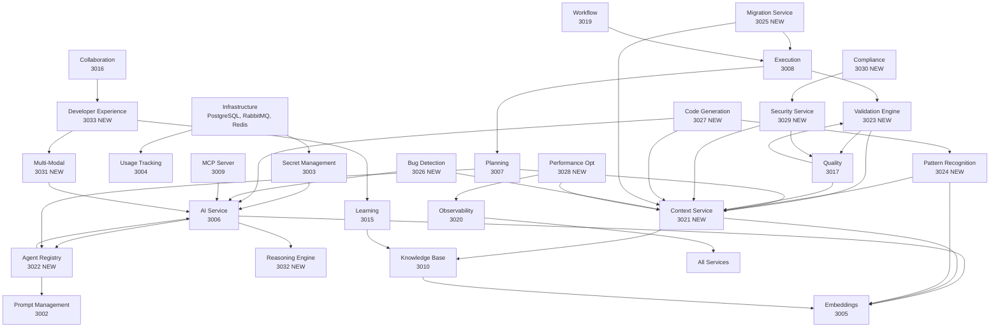

# Feature-to-Module Mapping: Advanced AI IDE Capabilities

## Overview

This document maps all 48 advanced feature categories to your existing microservices architecture, showing:
- Which existing modules handle which features
- Required enhancements to existing modules
- New modules needed
- Integration points and dependencies

---

## EXISTING MODULES: FEATURE MAPPING

### **AI Service (Port 3006)** - Core Intelligence Hub

**Current Purpose:** LLM completions, model routing

**Enhanced Capabilities:**

#### Features Handled:
- **#6: Model Orchestration** ✅ CORE FUNCTION
  - Multi-model strategy (GPT-4, Claude, Codex, local models)
  - Model selection per task type
  - Cascading complexity (simple → complex models)
  - Model voting and ensemble predictions
  - Cost optimization and routing

- **#5: Agent Coordination** ✅ MAJOR ENHANCEMENT
  - Multi-agent debate system
  - Consensus mechanisms
  - Hierarchical coordination
  - Adversarial validation
  - Agent specialization routing

- **#35: Self-Improvement** 🆕 NEW CAPABILITY
  - Model fine-tuning on codebase
  - Performance optimization
  - A/B testing of approaches
  - Quality improvement tracking

**New Sub-Modules:**
```
ai-service/
├── model-router/           # Intelligent model selection
├── agent-coordinator/      # Multi-agent orchestration
├── ensemble-predictor/     # Combine multiple outputs
├── model-performance/      # Track model effectiveness
├── fine-tuning/           # Custom model training
└── cost-optimizer/        # Minimize API costs
```

**Dependencies:**
- Secret Management (API keys)
- Prompt Management (templates)
- Observability (metrics)
- Usage Tracking (costs)

---

### **Embeddings (Port 3005)** - Semantic Intelligence

**Current Purpose:** Vector embeddings, semantic search

**Enhanced Capabilities:**

#### Features Handled:
- **#1: Multi-Level Context Analysis** ✅ CORE ENHANCEMENT
  - Semantic code embeddings for all files/functions
  - Cross-module relationship mapping
  - Historical context (git history embeddings)
  - Business domain modeling

- **#21: Knowledge Retrieval** ✅ CORE FUNCTION
  - Semantic search across codebase
  - Example-based search
  - Similar code detection
  - Question answering

- **#2: Dynamic Context Assembly** ✅ MAJOR ENHANCEMENT
  - Smart context window management
  - Relevance scoring
  - Context compression
  - Multi-hop reasoning

**New Sub-Modules:**
```
embeddings/
├── semantic-indexer/       # Index entire codebase
├── context-ranker/        # Score context relevance
├── relationship-mapper/    # Build semantic graphs
├── compression-engine/     # Compress less relevant context
├── similarity-search/      # Find similar patterns
└── embedding-cache/       # Cache frequent embeddings
```

**Dependencies:**
- AI Service (embedding models)
- Knowledge Base (documentation)
- Planning (project context)

---

### **Planning (Port 3007)** - Strategic Intelligence

**Current Purpose:** Plans, projects, tasks, roadmaps

**Enhanced Capabilities:**

#### Features Handled:
- **#13: Intent Understanding** ✅ MAJOR ENHANCEMENT
  - Natural language requirement parsing
  - Code intent extraction
  - Ambiguity resolution
  - Goal inference

- **#14: Planning & Decomposition** ✅ CORE FUNCTION
  - Task decomposition
  - Dependency ordering
  - Parallel execution planning
  - Risk assessment
  - Impact analysis

- **#34: Predictive Capabilities** 🆕 NEW CAPABILITY
  - Issue prediction
  - Maintenance prediction
  - Performance bottleneck prediction
  - Code evolution prediction

**New Sub-Modules:**
```
planning/
├── intent-parser/         # Parse natural language
├── task-decomposer/       # Break down complex tasks
├── dependency-analyzer/   # Analyze task dependencies
├── risk-assessor/         # Assess implementation risks
├── impact-analyzer/       # Analyze change impact
├── predictor/            # Predict future issues
└── plan-validator/       # Validate plan quality
```

**Dependencies:**
- Embeddings (context understanding)
- AI Service (intent parsing)
- Execution (execution feedback)
- Knowledge Base (historical plans)

---

### **Execution (Port 3008)** - Action Engine

**Current Purpose:** Plan execution, rollback

**Enhanced Capabilities:**

#### Features Handled:
- **#16: Safe Execution Environment** ✅ CORE FUNCTION
  - Sandboxed execution
  - Checkpoint & restore
  - Rollback mechanisms
  - Dry-run mode
  - Diff preview

- **#17: Continuous Verification** ✅ MAJOR ENHANCEMENT
  - Real-time type checking
  - Incremental compilation
  - Live testing
  - Runtime monitoring
  - Performance profiling

- **#15: Self-Correction & Learning** ✅ MAJOR ENHANCEMENT
  - Error detection & recovery
  - Iterative refinement
  - Feedback loop integration
  - Confidence scoring

**New Sub-Modules:**
```
execution/
├── sandbox-manager/       # Isolated execution environments
├── checkpoint-system/     # Save/restore execution state
├── verification-engine/   # Continuous verification
├── rollback-manager/      # Automated rollback
├── test-runner/          # Live test execution
├── performance-monitor/   # Runtime performance tracking
└── self-corrector/       # Auto-fix errors
```

**Dependencies:**
- Planning (execution plans)
- Quality (test validation)
- Observability (runtime metrics)
- Workflow (orchestration)

---

### **MCP Server (Port 3009)** - Tool Orchestration

**Current Purpose:** Model Context Protocol

**Enhanced Capabilities:**

#### Features Handled:
- **#38: Tool Integration** ✅ CORE FUNCTION
  - IDE integration (VSCode, IntelliJ)
  - Git integration
  - CI/CD integration
  - Issue tracker integration

- **#39: Data Source Integration** ✅ CORE FUNCTION
  - External APIs
  - Database introspection
  - File system access
  - Environment variables

- **#40: Output Integration** 🆕 NEW CAPABILITY
  - Pull request generation
  - Issue creation
  - Documentation updates
  - Deployment automation

**New Sub-Modules:**
```
mcp-server/
├── tool-registry/         # Available tools catalog
├── tool-executor/         # Execute tool commands
├── integration-adapters/  # IDE, Git, CI/CD adapters
├── data-connectors/       # External data sources
├── output-handlers/       # PR, issue, doc generation
└── health-monitor/        # Tool health checking
```

**Dependencies:**
- AI Service (tool selection)
- Execution (tool execution)
- Knowledge Base (tool documentation)

---

### **Knowledge Base (Port 3010)** - Organizational Memory

**Current Purpose:** Documentation, wiki, search

**Enhanced Capabilities:**

#### Features Handled:
- **#19: Organizational Memory** ✅ CORE FUNCTION
  - Decision history (ADRs)
  - Pattern library
  - Lessons learned
  - Team expertise mapping
  - Code ownership tracking

- **#20: Living Documentation** ✅ CORE ENHANCEMENT
  - Auto-generated documentation
  - Architecture diagrams
  - API documentation
  - Dependency graphs
  - Changelog generation

- **#3: External Knowledge Integration** ✅ NEW CAPABILITY
  - Framework-specific knowledge
  - Library API documentation
  - Best practices databases
  - Bug pattern databases

**New Sub-Modules:**
```
knowledge-base/
├── decision-log/          # ADR management
├── pattern-library/       # Reusable patterns
├── expertise-map/         # Team knowledge graph
├── auto-doc-generator/    # Generate docs from code
├── diagram-generator/     # Auto architecture diagrams
├── external-kb-sync/      # Sync external knowledge
└── changelog-engine/      # Auto changelog generation
```

**Dependencies:**
- Embeddings (semantic search)
- AI Service (doc generation)
- Planning (decision tracking)
- Collaboration (expertise mapping)

---

### **Quality (Port 3017)** - Quality Assurance

**Current Purpose:** Experiments, compliance, metrics

**Enhanced Capabilities:**

#### Features Handled:
- **#7: Multi-Stage Validation Pipeline** ✅ CORE FUNCTION
  - Syntax validation
  - Semantic validation
  - Security validation
  - Performance validation
  - Accessibility validation

- **#8: Automated Testing at Scale** ✅ CORE ENHANCEMENT
  - Unit test generation
  - Integration test generation
  - E2E test generation
  - Mutation testing
  - Property-based testing

- **#9: Static Analysis at Depth** ✅ CORE FUNCTION
  - Advanced linting
  - Type safety verification
  - Dead code detection
  - Code complexity metrics
  - Maintainability index

- **#18: Post-Generation Validation** ✅ MAJOR ENHANCEMENT
  - Compiler verification
  - Test suite execution
  - Integration testing
  - Security scanning
  - Code review simulation

**New Sub-Modules:**
```
quality/
├── validation-pipeline/   # Multi-stage validation
├── test-generator/        # Auto-generate tests
├── static-analyzer/       # Deep code analysis
├── security-scanner/      # Vulnerability scanning
├── performance-analyzer/  # Performance validation
├── accessibility-checker/ # A11y validation
├── mutation-tester/       # Test quality verification
└── code-reviewer/         # AI code review
```

**Dependencies:**
- AI Service (test generation)
- Execution (test execution)
- Observability (quality metrics)
- Compliance (standards checking)

---

### **Prompt Management (Port 3002)** - Prompt Engineering

**Current Purpose:** Prompt templates, versioning

**Enhanced Capabilities:**

#### Features Handled:
- **#4: Multi-Agent Specialization** ✅ MAJOR ENHANCEMENT
  - Agent-specific prompt templates
  - Specialized prompts per task type
  - Prompt versioning and A/B testing

- **#37: Advanced Reasoning** 🆕 NEW CAPABILITY
  - Chain-of-thought prompts
  - Tree-of-thought templates
  - Reasoning pattern library

**New Sub-Modules:**
```
prompt-management/
├── agent-templates/       # Per-agent prompt templates
├── reasoning-prompts/     # Advanced reasoning patterns
├── prompt-optimizer/      # Optimize prompt effectiveness
├── version-control/       # Prompt versioning
├── ab-tester/            # A/B test prompts
└── template-library/      # Reusable prompt components
```

**Dependencies:**
- AI Service (prompt execution)
- Quality (prompt effectiveness)
- Usage Tracking (prompt performance)

---

### **Observability (Port 3020)** - System Intelligence

**Current Purpose:** Application telemetry, tracing, APM

**Enhanced Capabilities:**

#### Features Handled:
- **#31: AI System Monitoring** ✅ CORE FUNCTION
  - Generation quality metrics
  - Model performance tracking
  - Agent effectiveness
  - Error tracking
  - Cost tracking

- **#32: Code Health Monitoring** ✅ MAJOR ENHANCEMENT
  - Technical debt tracking
  - Code quality trends
  - Test coverage trends
  - Performance trends
  - Security posture

- **#33: Real-Time Feedback** ✅ CORE ENHANCEMENT
  - Live code analysis
  - Instant validation
  - Proactive warnings
  - Performance hints

**New Sub-Modules:**
```
observability/
├── ai-metrics/            # AI system metrics
├── code-health/           # Code health tracking
├── quality-trends/        # Quality over time
├── performance-trends/    # Performance tracking
├── cost-analytics/        # Cost analysis
├── real-time-feedback/    # Live developer feedback
└── alert-manager/         # Intelligent alerting
```

**Dependencies:**
- All services (metrics collection)
- Quality (quality metrics)
- Usage Tracking (cost data)
- Dashboard (visualization)

---

### **Workflow (Port 3019)** - Process Automation

**Current Purpose:** Workflow orchestration, automation

**Enhanced Capabilities:**

#### Features Handled:
- **#26: Governance & Control** ✅ MAJOR ENHANCEMENT
  - Approval workflows
  - Policy enforcement
  - Quality gates
  - Audit trails

- **#27: Team Coordination** ✅ CORE FUNCTION
  - Work distribution
  - Progress tracking
  - Notification system

**New Sub-Modules:**
```
workflow/
├── approval-engine/       # Human approval workflows
├── policy-enforcer/       # Enforce coding policies
├── quality-gates/         # Automated quality checks
├── audit-logger/          # Comprehensive audit trails
├── task-distributor/      # Distribute work to agents
└── progress-tracker/      # Track workflow progress
```

**Dependencies:**
- Execution (task execution)
- Planning (task planning)
- Messaging (notifications)
- Quality (quality gates)

---

### **Collaboration (Port 3016)** - Team Intelligence

**Current Purpose:** Pair programming, shared workspaces

**Enhanced Capabilities:**

#### Features Handled:
- **#25: Human-AI Collaboration** ✅ CORE FUNCTION
  - Suggestion mode
  - Explanation generation
  - Interactive refinement
  - Confidence indicators
  - Alternative solutions

- **#44: Explainability** ✅ MAJOR ENHANCEMENT
  - Change explanations
  - Decision rationale
  - Risk assessments
  - Impact analysis

**New Sub-Modules:**
```
collaboration/
├── suggestion-engine/     # AI suggestions
├── explanation-generator/ # Explain AI decisions
├── confidence-scorer/     # Confidence in suggestions
├── alternative-generator/ # Show multiple options
├── pair-programming/      # AI pairing features
└── shared-context/        # Shared workspace context
```

**Dependencies:**
- Messaging (communication)
- AI Service (suggestions)
- Knowledge Base (shared knowledge)

---

### **Learning (Port 3015)** - Developer Growth

**Current Purpose:** Learning paths, skill tracking

**Enhanced Capabilities:**

#### Features Handled:
- **#45: Learning & Onboarding** ✅ CORE FUNCTION
  - Interactive tutorials
  - Contextual help
  - Example library
  - Skill gap identification
  - Personalized learning paths

**New Sub-Modules:**
```
learning/
├── tutorial-generator/    # Auto-generate tutorials
├── skill-assessor/        # Assess developer skills
├── gap-analyzer/          # Identify learning gaps
├── path-generator/        # Personalized learning paths
├── example-library/       # Code examples
└── mentoring-engine/      # AI mentoring
```

**Dependencies:**
- Knowledge Base (learning materials)
- Collaboration (mentoring)
- AI Service (content generation)

---

### **Resource Management (Port 3018)** - Capacity Intelligence

**Current Purpose:** Capacity planning, allocation

**Enhanced Capabilities:**

#### Features Handled:
- **#23: Performance Optimization** (Partial)
  - Resource allocation optimization
  - Workload balancing

**New Sub-Modules:**
```
resource-management/
├── capacity-planner/      # Plan resource needs
├── allocation-optimizer/  # Optimize resource allocation
├── workload-balancer/     # Balance team workload
├── forecaster/           # Forecast resource needs
└── utilization-tracker/   # Track resource usage
```

---

### **Usage Tracking (Port 3004)** - Cost Intelligence

**Current Purpose:** Metering, quotas, billing

**Enhanced Capabilities:**

#### Features Handled:
- **#31: AI System Monitoring** (Cost aspect)
  - API cost tracking
  - Model usage tracking
  - Budget management

**New Sub-Modules:**
```
usage-tracking/
├── cost-tracker/          # Track all AI costs
├── quota-manager/         # Manage usage quotas
├── budget-enforcer/       # Enforce budget limits
├── usage-analyzer/        # Analyze usage patterns
└── optimization-advisor/  # Suggest cost optimizations
```

---

## NEW MODULES REQUIRED

### **🆕 Context Service (Port 3021)** - Context Orchestration

**Purpose:** Centralized context management and assembly

#### Features Handled:
- **#1: Multi-Level Context Analysis** ✅ PRIMARY OWNER
  - Full codebase graph analysis
  - AST extraction
  - Dependency trees
  - Call graphs
  - Runtime behavior analysis

- **#2: Dynamic Context Assembly** ✅ PRIMARY OWNER
  - Smart context window management
  - Just-in-time context loading
  - Token budgeting
  - Context compression

**Architecture:**
```
context-service/
├── ast-analyzer/          # Parse and analyze ASTs
├── graph-builder/         # Build codebase graphs
├── dependency-tracker/    # Track all dependencies
├── context-assembler/     # Assemble relevant context
├── token-budgeter/        # Manage token limits
├── cache-manager/         # Cache frequently used context
└── relevance-scorer/      # Score context relevance
```

**Dependencies:**
- Embeddings (semantic context)
- Planning (project context)
- Knowledge Base (historical context)
- AI Service (context consumption)

**API Endpoints:**
```typescript
GET  /api/context/file/:path
GET  /api/context/function/:name
GET  /api/context/module/:name
POST /api/context/assemble      // Assemble context for task
GET  /api/context/dependencies/:path
GET  /api/context/callers/:function
GET  /api/context/graph/:scope
```

---

### **🆕 Agent Registry (Port 3022)** - Agent Management

**Purpose:** Manage specialized AI agents

#### Features Handled:
- **#4: Multi-Agent Specialization** ✅ PRIMARY OWNER
  - Architecture agent
  - Security agent
  - Performance agent
  - Testing agent
  - Documentation agent
  - 15+ specialized agents

**Architecture:**
```
agent-registry/
├── agents/
│   ├── architecture-agent/
│   ├── security-agent/
│   ├── performance-agent/
│   ├── testing-agent/
│   ├── documentation-agent/
│   ├── refactoring-agent/
│   ├── database-agent/
│   ├── api-design-agent/
│   ├── ui-ux-agent/
│   ├── devops-agent/
│   ├── code-review-agent/
│   └── migration-agent/
├── agent-selector/        # Select right agent for task
├── agent-loader/          # Load agent configurations
├── agent-monitor/         # Monitor agent performance
└── agent-updater/         # Update agent capabilities
```

**Dependencies:**
- AI Service (agent execution)
- Prompt Management (agent prompts)
- Quality (agent validation)
- Observability (agent metrics)

**API Endpoints:**
```typescript
GET  /api/agents/list
GET  /api/agents/:agentId
POST /api/agents/select           // Select agent for task
POST /api/agents/:agentId/invoke  // Invoke specific agent
GET  /api/agents/:agentId/performance
POST /api/agents/multi-invoke     // Multi-agent collaboration
```

---

### **🆕 Validation Engine (Port 3023)** - Comprehensive Validation

**Purpose:** Centralized validation across all dimensions

#### Features Handled:
- **#7: Multi-Stage Validation Pipeline** ✅ PRIMARY OWNER (shared with Quality)
- **#11: Standards & Conventions** ✅ PRIMARY OWNER
- **#12: Cross-Module Consistency** ✅ PRIMARY OWNER

**Architecture:**
```
validation-engine/
├── syntax-validator/      # Syntax checking
├── semantic-validator/    # Logical correctness
├── architecture-validator/ # Pattern compliance
├── security-validator/    # Security checks
├── performance-validator/ # Performance validation
├── consistency-checker/   # Cross-module consistency
├── standards-enforcer/    # Coding standards
├── policy-validator/      # Policy compliance
└── custom-rules/          # Project-specific rules
```

**Dependencies:**
- Quality (quality metrics)
- Context Service (code analysis)
- Knowledge Base (standards)
- Compliance Service (regulations)

**API Endpoints:**
```typescript
POST /api/validation/syntax
POST /api/validation/semantic
POST /api/validation/architecture
POST /api/validation/security
POST /api/validation/performance
POST /api/validation/consistency
POST /api/validation/full          // Full validation pipeline
GET  /api/validation/standards
POST /api/validation/custom-rules
```

---

### **🆕 Pattern Recognition (Port 3024)** - Pattern Intelligence

**Purpose:** Learn and enforce codebase patterns

#### Features Handled:
- **#10: Pattern Recognition & Enforcement** ✅ PRIMARY OWNER
  - Codebase pattern learning
  - Style consistency
  - Design pattern detection
  - Anti-pattern detection

**Architecture:**
```
pattern-recognition/
├── pattern-learner/       # Learn from codebase
├── pattern-matcher/       # Match patterns
├── pattern-enforcer/      # Enforce patterns
├── style-analyzer/        # Analyze code style
├── design-detector/       # Detect design patterns
├── antipattern-detector/  # Detect anti-patterns
├── pattern-library/       # Store learned patterns
└── consistency-scorer/    # Score consistency
```

**Dependencies:**
- Context Service (code analysis)
- Embeddings (pattern embeddings)
- Knowledge Base (pattern library)
- Quality (pattern validation)

**API Endpoints:**
```typescript
POST /api/patterns/learn           // Learn new patterns
GET  /api/patterns/list
POST /api/patterns/match           // Match code to patterns
POST /api/patterns/enforce         // Enforce patterns
GET  /api/patterns/antipatterns
GET  /api/patterns/design
POST /api/patterns/consistency     // Check consistency
```

---

### **🆕 Migration Service (Port 3025)** - Code Migration

**Purpose:** Handle code migrations and refactoring

#### Features Handled:
- **#28: Code Migration & Refactoring** ✅ PRIMARY OWNER
  - Version upgrade automation
  - Breaking change handling
  - Large-scale refactoring
  - Tech stack migration

**Architecture:**
```
migration-service/
├── version-upgrader/      # Upgrade dependencies
├── breaking-change-handler/ // Handle breaking changes
├── refactoring-engine/    // Large-scale refactoring
├── stack-migrator/        // Tech stack migration
├── database-migrator/     // Database migrations
├── api-migrator/          // API migrations
└── migration-validator/   // Validate migrations
```

**Dependencies:**
- Context Service (codebase analysis)
- Execution (apply migrations)
- Quality (validate migrations)
- Knowledge Base (migration patterns)

**API Endpoints:**
```typescript
POST /api/migration/analyze        // Analyze migration needs
POST /api/migration/version-upgrade
POST /api/migration/refactor
POST /api/migration/stack-change
POST /api/migration/database
POST /api/migration/api
GET  /api/migration/status/:id
POST /api/migration/rollback/:id
```

---

### **🆕 Bug Detection (Port 3026)** - Proactive Bug Finding

**Purpose:** Detect and fix bugs proactively

#### Features Handled:
- **#29: Bug Detection & Fixing** ✅ PRIMARY OWNER
  - Anomaly detection
  - Bug prediction
  - Root cause analysis
  - Auto-fix suggestions

**Architecture:**
```
bug-detection/
├── anomaly-detector/      # Detect unusual patterns
├── bug-predictor/         # Predict likely bugs
├── root-cause-analyzer/   // Analyze failures
├── auto-fixer/           // Suggest/apply fixes
├── regression-detector/   // Detect regressions
├── vulnerability-patcher/ // Security patches
└── performance-fixer/     // Fix performance issues
```

**Dependencies:**
- Context Service (code analysis)
- Quality (bug validation)
- Observability (runtime errors)
- AI Service (bug prediction)

**API Endpoints:**
```typescript
POST /api/bugs/detect              // Detect potential bugs
POST /api/bugs/predict             // Predict bug locations
POST /api/bugs/analyze-root-cause
POST /api/bugs/suggest-fix
POST /api/bugs/detect-regression
GET  /api/bugs/vulnerabilities
POST /api/bugs/auto-patch
```

---

### **🆕 Code Generation (Port 3027)** - Specialized Generation

**Purpose:** Specialized code generation tasks

#### Features Handled:
- **#30: Code Generation Specialties** ✅ PRIMARY OWNER
  - UI component generation
  - API endpoint generation
  - Database schema generation
  - Test data generation
  - Configuration generation

**Architecture:**
```
code-generation/
├── ui-generator/          # Generate UI components
├── api-generator/         # Generate API endpoints
├── schema-generator/      // Generate DB schemas
├── test-data-generator/   // Generate test data
├── config-generator/      // Generate configs
├── migration-generator/   // Generate migrations
├── iac-generator/         // Generate IaC
└── generation-validator/  // Validate generated code
```

**Dependencies:**
- AI Service (generation)
- Context Service (context)
- Quality (validation)
- Pattern Recognition (patterns)

**API Endpoints:**
```typescript
POST /api/generate/ui-component
POST /api/generate/api-endpoint
POST /api/generate/database-schema
POST /api/generate/test-data
POST /api/generate/config
POST /api/generate/migration
POST /api/generate/infrastructure
POST /api/generate/from-spec       // Generate from spec
```

---

### **🆕 Performance Optimization (Port 3028)** - Performance Intelligence

**Purpose:** Optimize code performance

#### Features Handled:
- **#23: Performance Optimization** ✅ PRIMARY OWNER
  - Code optimization
  - Bundle size optimization
  - Database query optimization
  - Algorithm selection
  - Memory optimization

**Architecture:**
```
performance-optimization/
├── code-optimizer/        # Optimize code
├── bundle-optimizer/      # Optimize bundles
├── query-optimizer/       // Optimize DB queries
├── algorithm-selector/    // Select best algorithms
├── memory-optimizer/      // Optimize memory usage
├── network-optimizer/     // Optimize network requests
├── render-optimizer/      // Optimize rendering
└── profiler/              // Performance profiling
```

**Dependencies:**
- Context Service (code analysis)
- Observability (performance metrics)
- Execution (apply optimizations)
- Quality (validate optimizations)

**API Endpoints:**
```typescript
POST /api/optimize/code
POST /api/optimize/bundle
POST /api/optimize/queries
POST /api/optimize/algorithms
POST /api/optimize/memory
POST /api/optimize/network
POST /api/optimize/rendering
POST /api/optimize/analyze        // Analyze performance
```

---

### **🆕 Security Service (Port 3029)** - Security Intelligence

**Purpose:** Security analysis and protection

#### Features Handled:
- **#41: Security Features** ✅ PRIMARY OWNER
- **#42: Privacy Protection** ✅ PRIMARY OWNER
  - Code obfuscation
  - Secret scanning
  - Vulnerability scanning
  - PII detection
  - SAST/DAST/SCA

**Architecture:**
```
security-service/
├── secret-scanner/        # Scan for secrets
├── vulnerability-scanner/ # SAST, DAST, SCA
├── pii-detector/          // Detect PII
├── obfuscator/           // Code obfuscation
├── compliance-checker/    // Check compliance
├── encryption-manager/    // Encrypt sensitive data
├── audit-logger/          // Security audit logs
└── threat-detector/       // Detect threats
```

**Dependencies:**
- Context Service (code analysis)
- Quality (security validation)
- Observability (security events)
- Workflow (security workflows)

**API Endpoints:**
```typescript
POST /api/security/scan-secrets
POST /api/security/scan-vulnerabilities
POST /api/security/detect-pii
POST /api/security/obfuscate
POST /api/security/check-compliance
POST /api/security/encrypt
GET  /api/security/audit-log
POST /api/security/threat-detection
```

---

### **🆕 Compliance Service (Port 3030)** - Regulatory Compliance

**Purpose:** Ensure regulatory and policy compliance

#### Features Handled:
- **#11: Standards & Conventions** (Partial)
  - Industry standards (WCAG, OWASP, etc.)
  - Regulatory compliance (GDPR, HIPAA, SOC2)

**Architecture:**
```
compliance-service/
├── standards-checker/     # Check industry standards
├── regulation-enforcer/   // Enforce regulations
├── accessibility-checker/ // WCAG compliance
├── security-standards/    // OWASP, CWE
├── privacy-compliance/    // GDPR, CCPA
├── audit-reporter/        // Compliance reports
└── policy-manager/        // Manage policies
```

**Dependencies:**
- Quality (compliance checks)
- Security Service (security compliance)
- Validation Engine (validation)
- Workflow (compliance workflows)

**API Endpoints:**
```typescript
POST /api/compliance/check-standards
POST /api/compliance/check-regulations
POST /api/compliance/accessibility
POST /api/compliance/security
POST /api/compliance/privacy
GET  /api/compliance/report
POST /api/compliance/policies
```

---

### **🆕 Multi-Modal Service (Port 3031)** - Multi-Modal Understanding

**Purpose:** Handle multi-modal inputs (images, diagrams, audio, video)

#### Features Handled:
- **#36: Multi-Modal Understanding** ✅ PRIMARY OWNER
  - Image understanding (designs → code)
  - Diagram understanding (architecture → code)
  - Audio understanding (voice commands)
  - Video understanding (tutorials → implementation)

**Architecture:**
```
multi-modal-service/
├── image-processor/       # Process images
├── diagram-parser/        # Parse diagrams
├── audio-transcriber/     // Transcribe audio
├── video-analyzer/        // Analyze videos
├── design-to-code/        // Convert designs to code
├── whiteboard-parser/     // Parse whiteboard sketches
└── modal-router/          // Route to correct processor
```

**Dependencies:**
- AI Service (multi-modal models)
- Code Generation (generate from designs)
- Context Service (visual context)

**API Endpoints:**
```typescript
POST /api/multimodal/image
POST /api/multimodal/diagram
POST /api/multimodal/audio
POST /api/multimodal/video
POST /api/multimodal/design-to-code
POST /api/multimodal/whiteboard
POST /api/multimodal/analyze       // Analyze any input
```

---

### **🆕 Reasoning Engine (Port 3032)** - Advanced Reasoning

**Purpose:** Advanced reasoning capabilities

#### Features Handled:
- **#37: Advanced Reasoning** ✅ PRIMARY OWNER
  - Chain-of-thought reasoning
  - Tree-of-thought exploration
  - Analogical reasoning
  - Counterfactual reasoning
  - Causal reasoning

**Architecture:**
```
reasoning-engine/
├── chain-of-thought/      # Step-by-step reasoning
├── tree-explorer/         # Explore decision trees
├── analogy-finder/        // Find analogies
├── counterfactual/        // What-if analysis
├── causal-analyzer/       // Cause-effect analysis
├── probabilistic/         // Handle uncertainty
└── meta-reasoner/         // Reason about reasoning
```

**Dependencies:**
- AI Service (reasoning models)
- Prompt Management (reasoning prompts)
- Knowledge Base (reasoning patterns)

**API Endpoints:**
```typescript
POST /api/reasoning/chain-of-thought
POST /api/reasoning/tree-explore
POST /api/reasoning/analogy
POST /api/reasoning/counterfactual
POST /api/reasoning/causal
POST /api/reasoning/probabilistic
POST /api/reasoning/meta
```

---

### **🆕 Developer Experience (Port 3033)** - UX Intelligence

**Purpose:** Optimize developer experience

#### Features Handled:
- **#43: Developer Experience** ✅ PRIMARY OWNER
- **#45: Learning & Onboarding** (Shared with Learning)
  - Natural language interface
  - Visual interface
  - Voice interface
  - Instant feedback
  - Progressive disclosure

**Architecture:**
```
developer-experience/
├── nlp-interface/         # Natural language commands
├── visual-builder/        # Visual interface
├── voice-interface/       // Voice commands
├── feedback-engine/       // Instant feedback
├── customization/         // Customize workflows
├── tutorial-system/       // Interactive tutorials
└── help-system/           // Contextual help
```

**Dependencies:**
- Multi-Modal Service (voice, visual)
- Learning (tutorials)
- Collaboration (help system)
- AI Service (NLP)

**API Endpoints:**
```typescript
POST /api/devex/natural-language
POST /api/devex/visual-command
POST /api/devex/voice-command
POST /api/devex/customize
GET  /api/devex/help/:context
GET  /api/devex/tutorial/:topic
POST /api/devex/feedback
```

---

## MODULE DEPENDENCY GRAPH



---

## COMPLETE FEATURE-TO-MODULE MATRIX

| Feature Category | Primary Module(s) | Supporting Module(s) | Status |
|-----------------|-------------------|---------------------|---------|
| **I. DEEP CONTEXTUAL UNDERSTANDING** |
| Multi-Level Context Analysis | Context Service 🆕 | Embeddings, Planning | NEW |
| Dynamic Context Assembly | Context Service 🆕 | Embeddings, AI Service | NEW |
| External Knowledge Integration | Knowledge Base | Embeddings | ENHANCE |
| **II. ADVANCED AI ORCHESTRATION** |
| Multi-Agent Specialization | Agent Registry 🆕 | AI Service, Prompt Mgmt | NEW |
| Agent Coordination | AI Service | Agent Registry 🆕 | MAJOR |
| Model Orchestration | AI Service | Usage Tracking | ENHANCE |
| **III. QUALITY VALIDATION** |
| Multi-Stage Validation | Validation Engine 🆕 | Quality | NEW |
| Automated Testing | Quality | Code Generation 🆕 | MAJOR |
| Static Analysis | Quality | Context Service 🆕 | ENHANCE |
| **IV. CONSISTENCY ENFORCEMENT** |
| Pattern Recognition | Pattern Recognition 🆕 | Context, Embeddings | NEW |
| Standards & Conventions | Validation Engine 🆕 | Compliance 🆕 | NEW |
| Cross-Module Consistency | Validation Engine 🆕 | Pattern Recognition 🆕 | NEW |
| **V. AUTONOMOUS DECISION MAKING** |
| Intent Understanding | Planning | AI Service, Context 🆕 | MAJOR |
| Planning & Decomposition | Planning | Context 🆕, Agent Registry 🆕 | ENHANCE |
| Self-Correction | Execution | Quality, Bug Detection 🆕 | MAJOR |
| **VI. EXECUTION & VERIFICATION** |
| Safe Execution | Execution | Workflow | ENHANCE |
| Continuous Verification | Execution | Quality | MAJOR |
| Post-Generation Validation | Quality | Validation Engine 🆕 | ENHANCE |
| **VII. KNOWLEDGE MANAGEMENT** |
| Organizational Memory | Knowledge Base | Planning, Collab | MAJOR |
| Living Documentation | Knowledge Base | Code Generation 🆕 | MAJOR |
| Knowledge Retrieval | Embeddings | Knowledge Base | ENHANCE |
| **VIII. PERFORMANCE & SCALABILITY** |
| Efficient Code Generation | AI Service | Code Generation 🆕 | ENHANCE |
| Performance Optimization | Performance Opt 🆕 | Observability | NEW |
| Scalability Features | All Services | - | ENHANCE |
| **IX. COLLABORATION & GOVERNANCE** |
| Human-AI Collaboration | Collaboration | DevEx 🆕, AI Service | MAJOR |
| Governance & Control | Workflow | Compliance 🆕 | MAJOR |
| Team Coordination | Workflow | Collaboration, Messaging | ENHANCE |
| **X. SPECIALIZED CAPABILITIES** |
| Code Migration | Migration Service 🆕 | Execution, Context 🆕 | NEW |
| Bug Detection & Fixing | Bug Detection 🆕 | Quality, Observability | NEW |
| Code Generation Specialties | Code Generation 🆕 | AI Service, Pattern 🆕 | NEW |
| **XI. MONITORING & OBSERVABILITY** |
| AI System Monitoring | Observability | Usage Tracking | MAJOR |
| Code Health Monitoring | Observability | Quality | MAJOR |
| Real-Time Feedback | Observability | DevEx 🆕 | MAJOR |
| **XII. ADVANCED FEATURES** |
| Predictive Capabilities | Planning | Bug Detection 🆕, Obs | MAJOR |
| Self-Improvement | AI Service | Observability | MAJOR |
| Multi-Modal Understanding | Multi-Modal 🆕 | AI Service | NEW |
| Advanced Reasoning | Reasoning Engine 🆕 | AI Service, Prompt Mgmt | NEW |
| **XIII. INTEGRATION & ECOSYSTEM** |
| Tool Integration | MCP Server | All Services | ENHANCE |
| Data Source Integration | MCP Server | Context 🆕 | ENHANCE |
| Output Integration | MCP Server | Workflow | MAJOR |
| **XIV. SECURITY & PRIVACY** |
| Security Features | Security Service 🆕 | Quality, Compliance 🆕 | NEW |
| Privacy Protection | Security Service 🆕 | Compliance 🆕 | NEW |
| **XV. USER EXPERIENCE** |
| Developer Experience | DevEx 🆕 | Multi-Modal 🆕, Collab | NEW |
| Explainability | Collaboration | AI Service, Reasoning 🆕 | MAJOR |
| Learning & Onboarding | Learning | DevEx 🆕, KB | MAJOR |
| **XVI. RELIABILITY & RESILIENCE** |
| Error Handling | Execution | Quality | ENHANCE |
| Fault Tolerance | All Services | - | ENHANCE |
| Quality Assurance | Quality | Validation 🆕, Workflow | MAJOR |

---

## IMPLEMENTATION ROADMAP

### **Phase 1: Foundation (Months 1-3)** - Core Infrastructure

**New Modules:**
1. Context Service (3021)
2. Agent Registry (3022)
3. Validation Engine (3023)

**Major Enhancements:**
- AI Service: Model orchestration, agent coordination
- Embeddings: Semantic indexing, context ranking
- Quality: Validation pipeline, static analysis
- Execution: Safe execution, continuous verification

**Deliverables:**
- Deep context understanding
- Multi-agent infrastructure
- Comprehensive validation
- Safe code execution

---

### **Phase 2: Intelligence (Months 4-6)** - AI Capabilities

**New Modules:**
1. Pattern Recognition (3024)
2. Reasoning Engine (3032)
3. Code Generation (3027)

**Major Enhancements:**
- Planning: Intent understanding, task decomposition
- Knowledge Base: Organizational memory, living docs
- Prompt Management: Advanced reasoning prompts
- AI Service: Self-improvement, model fine-tuning

**Deliverables:**
- Pattern learning and enforcement
- Advanced reasoning capabilities
- Specialized code generation
- Intelligent planning

---

### **Phase 3: Autonomy (Months 7-9)** - Autonomous Operation

**New Modules:**
1. Migration Service (3025)
2. Bug Detection (3026)
3. Performance Optimization (3028)

**Major Enhancements:**
- Execution: Self-correction, iterative refinement
- Quality: Automated testing at scale
- Observability: Real-time feedback
- Workflow: Governance and control

**Deliverables:**
- Autonomous code migration
- Proactive bug detection
- Performance optimization
- Self-correcting execution

---

### **Phase 4: Excellence (Months 10-12)** - Advanced Features

**New Modules:**
1. Security Service (3029)
2. Compliance Service (3030)
3. Multi-Modal Service (3031)
4. Developer Experience (3033)

**Major Enhancements:**
- Planning: Predictive capabilities
- Collaboration: Explainability, human-AI collaboration
- Learning: Personalized learning paths
- Observability: AI system monitoring

**Deliverables:**
- Comprehensive security
- Regulatory compliance
- Multi-modal understanding
- Exceptional developer experience

---

## SUMMARY STATISTICS

### Module Breakdown

| Type | Count | Ports |
|------|-------|-------|
| **Existing Modules** | 16 | 3001-3020 |
| **New Modules Required** | 13 | 3021-3033 |
| **Total Modules** | 29 | 3001-3033 |

### Feature Implementation

| Status | Count | Percentage |
|--------|-------|------------|
| **Existing (Core Function)** | 12 | 25% |
| **Enhance Existing** | 18 | 37.5% |
| **New Modules Required** | 18 | 37.5% |
| **Total Features** | 48 | 100% |

### Development Effort

| Phase | Duration | New Modules | Major Enhancements | Features Delivered |
|-------|----------|-------------|-------------------|-------------------|
| Phase 1 | 3 months | 3 | 4 | 12 |
| Phase 2 | 3 months | 3 | 4 | 12 |
| Phase 3 | 3 months | 3 | 4 | 12 |
| Phase 4 | 3 months | 4 | 4 | 12 |
| **Total** | **12 months** | **13** | **16** | **48** |

---

## CRITICAL SUCCESS FACTORS

1. **Context Service (3021)** - Foundation for everything
2. **Agent Registry (3022)** - Enable multi-agent intelligence
3. **Validation Engine (3023)** - Ensure quality and consistency
4. **Pattern Recognition (3024)** - Learn and enforce patterns
5. **Code Generation (3027)** - Specialized generation capabilities

These 5 new modules plus enhancements to existing modules will enable all 48 feature categories.
