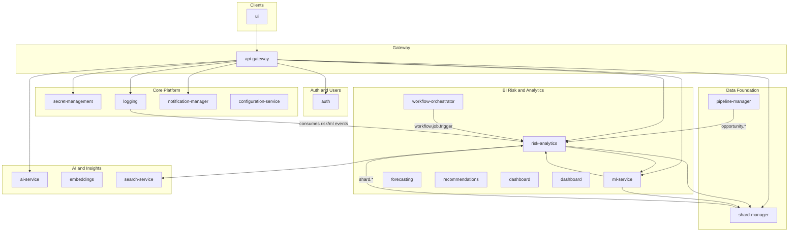

# Container Purpose and System Integration

This document describes the **purpose** of each container in the Castiel system and **how it integrates** with the rest of the platform (APIs, events, configuration, and dependencies).

---

## 1. Integration Overview

- **Entry point:** All client traffic goes through the **API Gateway** (default port 3002). The gateway validates JWT, enforces tenant (X-Tenant-ID), applies rate limiting, and routes requests to backend services using **config-driven URLs** (no hardcoded addresses).
- **Service-to-service:** Containers call each other via HTTP using **ServiceClient** from `@coder/shared`, with URLs from `config/default.yaml` or environment variables. Circuit breakers and retries are used where applicable.
- **Events:** **RabbitMQ** is the only message broker. Containers publish and consume domain events (e.g. `risk.evaluation.completed`, `shard.updated`, `workflow.job.trigger`). Event payloads include `tenantId`, `source`, and `data`.
- **Data:** Azure Cosmos DB (shared database `castiel`) with **tenantId** as partition key for tenant isolation. Redis is used for caching and sessions where configured.
- **Shared library:** All containers use **@coder/shared** for database client, events, auth, middleware, and types. The `containers/shared` package is this library.

---

## 2. Containers by Category

### 2.1 Entry and Gateway

| Container | Purpose | Integration |
|-----------|---------|-------------|
| **api-gateway** | Single entry point: JWT validation, tenant injection (X-Tenant-ID), rate limiting, route proxying to backend services. | **Downstream:** Proxies to auth, user-management, secret-management, logging, notification, ai-service, embeddings, dashboard, risk-analytics, risk-catalog, recommendations, integration-manager, integration-processors, ml-service, configuration-service, adaptive-learning. All URLs from `config/default.yaml` (e.g. `services.auth.url`, `services.risk_analytics.url`). **Upstream:** UI and other clients call the gateway only. |
| **ui** | Next.js 16 web app (App Router, React 19): dashboards, admin, analytics, risk views, auth flows. | **Upstream:** Calls API Gateway only (`NEXT_PUBLIC_API_BASE_URL`). No direct backend URLs. Renders pages for risk, pipelines, forecasts, notifications, etc. |

---

### 2.2 Authentication and User Management

| Container | Purpose | Integration |
|-----------|---------|-------------|
| **auth** | User authentication: email/password, Google/GitHub OAuth, SAML/SSO, JWT issue/refresh, sessions, MFA, password reset. | **Storage:** Cosmos DB (auth_* containers). **Events:** Publishes to RabbitMQ; notification-manager consumes for emails (e.g. password reset, verification). **Config:** JWT secret, Cosmos, RabbitMQ, OAuth credentials. |
| **user-management** | User profiles, tenants, teams, RBAC, invitations, memberships, user analytics. | **Storage:** Cosmos DB (user_* containers). **Events:** Publishes lifecycle events. **Downstream:** Referenced by auth, shard-manager, pipeline-manager, document-manager, collaboration-service, analytics-service for user/tenant context. |

---

### 2.3 Core Platform Services

| Container | Purpose | Integration |
|-----------|---------|-------------|
| **secret-management** | Centralized secrets: encryption, RBAC, rotation, versioning, multi-backend (e.g. Azure Key Vault). | **Storage:** Cosmos DB + backend vaults. **Events:** Notifications via RabbitMQ; **Logging** for audit. **Downstream:** Consumed by other services (e.g. AI, integrations) to resolve API keys and credentials. |
| **logging** | Audit logging: tamper-evident logs, retention, redaction, compliance. **DataLakeCollector** and **MLAuditConsumer** for BI Risk (Parquet + ML audit blobs). | **Storage:** Cosmos DB (audit_*); optional Azure Data Lake (risk_evaluations, ml_audit, ml_inference_logs). **Events:** Consumes `risk.evaluated`, `ml.prediction.completed`, and other ML/risk events for audit and Data Lake. **Downstream:** Many services send audit events or call logging APIs. |
| **notification-manager** | Multi-channel notifications: in-app, email (SendGrid/SMTP/SES). Event-driven from RabbitMQ. | **Storage:** Cosmos DB for notification state. **Events:** Consumes events (e.g. auth emails, **anomaly.detected** for BI Risk alerts). **Config:** Email provider, app URL; gateway routes `/api/notifications/*`. |
| **configuration-service** | Centralized configuration storage and retrieval (tenant-scoped). | **Storage:** Cosmos DB (configuration_settings). **Downstream:** Logging, secret-management; used for feature flags and tenant settings. |
| **cache-service** | Cache administration: stats, clear, warm, metrics, optimize, strategies (includes former cache-management). Uses Redis and Cosmos DB (cache_metrics, cache_strategies). **Events:** RabbitMQ (cache_management.*). | **Downstream:** Redis; logging for audit. Used by dashboard, context-service, etc. |

---

### 2.4 BI Risk and Analytics (Castiel BI Risk Analysis)

| Container | Purpose | Integration |
|-----------|---------|-------------|
| **risk-analytics** | Risk evaluation, revenue-at-risk, quotas, early warning, benchmarking, simulations, data quality, explainability. **BatchJobWorker** runs risk-snapshot-backfill, outcome-sync, industry-benchmarks, risk-clustering, account-health, propagation, model-monitoring. | **Storage:** Cosmos DB (risk_*). **Events:** Publishes `risk.evaluation.completed`, `revenue-at-risk.calculated`, `early-warning.signals-detected`, etc. Consumes `opportunity.updated`, `shard.*`, `risk.catalog.*`, `workflow.job.trigger` (from workflow-orchestrator), `integration.opportunity.updated`, `integration.sync.completed`, `opportunity.outcome.recorded`. **Downstream:** ml-service (features, risk snapshots), search-service (optional, historical pattern matching); **Data Lake** via logging DataLakeCollector when configured. **Config:** search_service.url, data_lake.*, ml_service for model-monitoring. |
| **risk-catalog** | Global, industry, and tenant-specific risk catalog (risk types, definitions). | **Storage:** Cosmos DB. **Events:** Publishes catalog updates; risk-analytics consumes for re-evaluation. **Gateway:** Proxies risk-catalog routes. |
| **ml-service** | ML model management, feature store, training jobs, predictions: win probability, risk scoring, LSTM risk trajectory, anomaly, revenue forecasting, recommendations. Azure ML Managed Endpoints when configured. | **Storage:** Cosmos DB (ml_*). **Events:** Publishes `ml.prediction.completed`; logging consumes for audit/Data Lake. **Downstream:** shard-manager (buildVectorForOpportunity), risk-analytics (risk snapshots, latest evaluation), **forecasting** (getMLForecast). **Config:** shard_manager.url, risk_analytics.url, azure_ml.endpoints, ai_service.url. |
| **forecasting** | Forecast decomposition, consensus, commitment, pipeline health. **Risk-adjusted** and **ML** forecasts (calls risk-analytics and ml-service). | **Storage:** Cosmos DB (forecast_*). **Events:** Publishes `forecast.completed`; recommendations consumes. **Downstream:** risk-analytics (risk-adjusted), ml-service (GET /api/v1/forecasts/:period/ml). **Config:** risk_analytics.url, ml_service.url, industry_seasonality. |
| **recommendations** | Mitigation ranking, remediation workflows, next-best-action. Rebuild aligned with BI Risk. | **Storage:** Cosmos DB (recommendations_data). **Events:** Consumes `opportunity.updated`, `integration.opportunity.updated`, `risk.evaluation.completed`, `forecast.completed`, `shard.updated`, `workflow.recommendation.requested`. Publishes recommendation events. **Downstream:** risk-analytics and forecast complete before recommendation flow. |
| **dashboard** | Dashboard CRUD, widget management, tenant-scoped dashboards; executive/manager/board dashboards, prioritized opportunities, portfolio drill-down (includes former dashboard-analytics). | **Storage:** Cosmos DB (dashboard_dashboards, dashboard_widgets, dashboard_admin_data, dashboard_widget_cache). **Downstream:** risk-analytics, forecasting, shard-manager when configured. **Gateway:** Routes `/api/dashboard/*`, `/api/v1/dashboards/*`, `/api/v1/portfolios/*`, etc. Used by UI for risk/pipeline/executive views. |
| **workflow-orchestrator** | Batch job **scheduler** (node-cron): publishes `workflow.job.trigger` to queue `bi_batch_jobs`. HITL approvals, workflow execution. | **Storage:** Cosmos DB (workflow_*, hitl_approvals). **Events:** Publishes `workflow.job.trigger` (jobs: risk-snapshot-backfill, outcome-sync, industry-benchmarks, risk-clustering, account-health, propagation, model-monitoring). **Downstream:** risk-analytics **BatchJobWorker** consumes and runs jobs. Consumes `shard.updated`, `integration.opportunity.updated` for HITL/workflows. |

---

### 2.5 Data Foundation (Shards and Pipeline)

| Container | Purpose | Integration |
|-----------|---------|-------------|
| **shard-manager** | Core data model: shards (e.g. c_opportunity, c_account, c_contact), shard types, relationships, edges, linking, versioning. | **Storage:** Cosmos DB (shard_*). **Events:** Publishes `shard.created`, `shard.updated`; consumed by risk-analytics, data-enrichment, integration-processors, workflow-orchestrator, recommendations. **Downstream:** ml-service (buildVector), pipeline-manager, document-manager, search-service, ai-insights, analytics-service, collaboration-service, integration-manager. **Gateway:** Proxies shard-manager. |
| **pipeline-manager** | Sales pipeline and opportunity management: pipeline views, opportunity CRUD, pipeline analytics, opportunity auto-linking to shards. | **Storage:** Cosmos DB (pipeline_opportunities, pipeline_views). **Events:** Publishes `opportunity.created`, `opportunity.updated`, `opportunity.deleted`; consumed by risk-analytics, recommendations, workflow. **Downstream:** shard-manager, logging, user-management. **Gateway:** Proxies pipeline routes. |

---

### 2.6 AI and Insights

| Container | Purpose | Integration |
|-----------|---------|-------------|
| **ai-service** | Centralized LLM completions (OpenAI, Anthropic, Ollama), model routing, agents, completion tracking. | **Storage:** Cosmos DB for insights/prompts. **Events:** Publishes for usage tracking. **Downstream:** ai-insights, content-generation, prompt-service, adaptive-learning, reasoning-engine, multi-modal-service, context-service; ml-service for optional AI-backed features. **Gateway:** Proxies `/api/ai/*`. |
| **ai-insights** | AI-powered insights, proactive/collaborative insights, **risk analysis** (evaluate, catalog, revenue-at-risk, early warnings). | **Storage:** Cosmos DB (ai_insights, ai_risk_analysis, etc.). **Downstream:** ai-service, shard-manager, embeddings, logging. Used for risk UI and insight APIs. |
| **embeddings** | Vector embeddings store and semantic search (e.g. code/document-style). For **shard** embeddings see data-enrichment. | **Storage:** PostgreSQL with pgvector (or Cosmos per deployment). **Downstream:** search-service, ai-insights; risk-analytics uses **search-service** for historical pattern matching when configured. **Gateway:** Proxies `/api/embeddings/*`. |
| **search-service** | Vector + keyword hybrid search, advanced search, search analytics. | **Storage:** Cosmos DB (search_queries, search_analytics). **Downstream:** embeddings, shard-manager, logging. **risk-analytics** calls search-service for similar-opportunity search when `services.search_service.url` is set. |
| **adaptive-learning** | CAIS adaptive learning: component weights, model selection, signal weighting, outcome collection, performance tracking, rollout. | **Storage:** Cosmos DB (adaptive_*). **Events:** RabbitMQ. **Downstream:** ai-service, logging; Redis for cache. **Gateway:** Proxies adaptive-learning. |
| **reasoning-engine** | Advanced reasoning: chain-of-thought, tree-of-thought, analogical, counterfactual, causal. | **Storage:** Cosmos DB (reasoning_tasks). **Downstream:** ai-service, prompt-service, knowledge-base (if present). Used for explainability and scenario analysis. |
| **llm-service** | LLM reasoning layer: explain, recommendations, scenarios, summary, playbook (Plan W5). | **Storage:** Cosmos DB (llm_outputs). **Events:** Publishes `llm.reasoning.requested/completed/failed`. **Downstream:** Called by risk/insight flows for natural language explanations. |
| **learning-service** | Feedback loop: record feedback and outcomes, aggregate, satisfaction, trends (Plan W6 Layer 7). | **Storage:** Cosmos DB (user_feedback, outcome). **Events:** Publishes `feedback.recorded`, `outcome.recorded`, `feedback.trend.alert`. Feeds into model improvement and BI/risk quality. |
| **ai-conversation** | AI conversation and context: conversations, messages, context assembly, grounding, intent analysis, citation. | **Storage:** Cosmos DB (conversation_*). **Events:** RabbitMQ. Used by UI and agents for chat and contextual AI. |
| **ai-analytics** | AI usage analytics, chat catalog, AI config, model seeding, proactive insights, feedback learning. | **Storage:** Cosmos DB. **Events:** RabbitMQ. Complements analytics-service for AI-specific metrics. |

---

### 2.7 Integrations and Sync

| Container | Purpose | Integration |
|-----------|---------|-------------|
| **integration-manager** | Third-party integrations and webhooks: CRUD, sync tasks, adapter catalog (e.g. NewsAPI, Alpha Vantage for competitive intel). | **Storage:** Cosmos DB (integration_*). **Events:** Publishes `integration.*`, `webhook.*`, `sync.task.completed`. **Downstream:** shard-manager, logging, user-management, secret-management. **Gateway:** Proxies integration-manager. |
| **integration-sync** | Sync task execution, bidirectional sync, conflict resolution, adapter orchestration. Publishes integration data to RabbitMQ for async processing. | **Storage:** Cosmos DB. **Events:** Publishes integration data; integration-processors and risk-analytics consume (e.g. `integration.opportunity.updated`, `integration.sync.completed`). **Config:** sync_limits, RabbitMQ. |
| **integration-processors** | Multi-modal integration data processing: CRM mapping, documents, emails, messages, meetings, calendar. Consumes `integration.data.raw`, applies mappings, writes shards, entity linking, ML field aggregation. | **Storage:** Writes to shard-manager (Cosmos); Azure Blob for files; optional Azure Cognitive Services (OCR, transcription). **Downstream:** shard-manager, integration-manager. **Config:** CONSUMER_TYPE (light/heavy/all), RABBITMQ_URL, SHARD_MANAGER_URL, etc. **Gateway:** Proxies integration-processors. |

---

### 2.8 Content, Documents, and Collaboration

| Container | Purpose | Integration |
|-----------|---------|-------------|
| **document-manager** | Document and file management: upload/download, Azure Blob Storage, collections, templates, versioning. | **Storage:** Cosmos DB (document_*); Azure Blob. **Events:** RabbitMQ. **Downstream:** shard-manager, logging, user-management. |
| **content-generation** | AI-powered content generation from templates. | **Storage:** Cosmos DB (content_generation_jobs). **Downstream:** ai-service, shard-manager, logging. |
| **template-service** | Template CRUD: context, email, document templates. | **Storage:** Cosmos DB (template_*). **Downstream:** logging; used by notification, content-generation, document-manager. |
| **collaboration-service** | Real-time collaboration: conversations, messages; collaborative insights, memory context (includes former collaboration-intelligence). | **Storage:** Cosmos DB (collaboration_*). **Events:** RabbitMQ. **Downstream:** shard-manager, logging, user-management. |
| **data-enrichment** | Enrichment and vectorization: entity extraction, classification, summarization, **shard embeddings** (template-based; owner of ShardEmbeddingService). | **Storage:** Cosmos DB. **Events:** Consumes `shard.created`, `shard.updated`; publishes `enrichment.job.completed`, `vectorization.completed`. **Downstream:** Embeddings and search can use data-enrichment for shard-level vectors. |

---

### 2.9 Security, Quality, and Validation

| Container | Purpose | Integration |
|-----------|---------|-------------|
| **security-service** | Security analysis: secret scanning, vulnerability, PII, SAST/DAST/SCA, compliance, threat detection, findings. | **Storage:** Cosmos DB (security_scans, security_findings). **Downstream:** context-service, quality-monitoring, workflow (for remediation). |
| **security-scanning** | PII detection/redaction, field-level security, device tracking, password history, rate limiting. | **Storage:** Cosmos DB (security_*). **Events:** RabbitMQ. More operational security than security-service. |
| **quality-monitoring** | Anomaly detection, explanation quality, explainable AI, data quality validation. | **Storage:** Cosmos DB. **Events:** RabbitMQ. Used for ML/risk explanation and data quality. |
| **validation-engine** | Validation: syntax, semantic, architecture, security, performance, consistency; rule management. | **Storage:** Cosmos DB (validation_engine_*). **Downstream:** quality-monitoring, security-service. |

---

### 2.10 Analytics, Signals, and Optimization

| Container | Purpose | Integration |
|-----------|---------|-------------|
| **analytics-service** | Analytics and reporting: general metrics, project analytics, AI analytics, API performance. | **Storage:** Cosmos DB (analytics_*). **Downstream:** shard-manager, logging, user-management. Consumes usage/events for analytics. |
| **signal-intelligence** | Communication analysis, calendar intelligence, social signals, product usage, competitive intelligence, customer success. | **Storage:** Cosmos DB (signal_*). **Events:** RabbitMQ. Feeds competitive and behavioral signals for risk/forecasting. |
| **pattern-recognition** | Codebase pattern learning, style consistency, design/anti-pattern detection, pattern scanning. | **Storage:** Cosmos DB (pattern_recognition_*). **Downstream:** ai-service, context-service. |

---

### 2.11 Utilities and Support

| Container | Purpose | Integration |
|-----------|---------|-------------|
| **utility-services** | Import/export, schema migrations, computed fields, field validation, user onboarding, project activity, service registry. | **Storage:** Cosmos DB (utility_*). **Events:** Publishes `utility.import.completed`, `utility.export.completed`, `utility.migration.completed`. |
| **prompt-service** | Prompt CRUD, A/B testing, prompt analytics. | **Storage:** Cosmos DB (prompt_*). **Downstream:** ai-service, logging. Used by AI and reasoning flows. |
| **context-service** | Context management: storage, AST, dependency trees, call graphs, context assembly, token budgeting. | **Storage:** Cosmos DB (context_service_*). **Downstream:** ai-service; used by security-service, pattern-recognition, multi-modal-service. |
| **web-search** | Web search integration, result caching, context for AI. | **Storage:** Cosmos DB (web_search_*). **Events:** RabbitMQ. Used by AI conversation and search flows. |
| **multi-modal-service** | Multi-modal inputs: image/diagram/audio/video understanding, OCR, code generation from visuals. | **Storage:** Cosmos DB (multimodal_jobs). **Downstream:** ai-service, content-generation, context-service. |

---

### 2.12 Shared and Non-Runtime

| Container | Purpose | Integration |
|-----------|---------|-------------|
| **shared** | **@coder/shared** package: Cosmos DB client, Redis cache, RabbitMQ events, JWT/auth, ServiceClient, tenant middleware, shared types and errors. | **Build-time:** All other containers depend on it. Not a runnable service; provides libraries and types. |

---

## 3. Removed or Merged Containers

The following containers have been **removed** or **merged** per CONTAINER_REORGANIZATION_RECOMMENDATIONS.md:

- **compliance-service** – Removed. Compliance is covered by **logging** (audit trail), **secret-management** (e.g. `/api/secrets/compliance/report`), and **security-service** (compliance_check).
- **migration-service** – Removed. Migration logic and routes live in **configuration-service** (`/api/v1/migration/*`).
- **performance-optimization** – Removed. Can be reintroduced later if wired (e.g. ml-service ONNX/Redis).
- **cache-management** – Merged into **cache-service**.
- **collaboration-intelligence** – Merged into **collaboration-service**.
- **dashboard-analytics** – Merged into **dashboard**.

---

## 4. Summary Diagram (High Level)

---

---

## 5. Quick Reference: All Containers

| Container | One-line purpose |
|-----------|------------------|
| adaptive-learning | CAIS adaptive learning: weights, model selection, outcomes, rollout |
| ai-analytics | AI usage analytics, chat catalog, proactive insights, feedback learning |
| ai-conversation | AI conversation, context assembly, grounding, intent, citations |
| ai-insights | AI insights, risk analysis (evaluate, catalog, revenue-at-risk, early warnings) |
| ai-service | LLM completions, model routing, agents |
| analytics-service | Analytics, project/AI/API metrics, reports |
| api-gateway | Single entry point: JWT, tenant, rate limit, proxy to backends |
| auth | Authentication: email/OAuth/SSO, JWT, sessions, MFA |

| cache-management | Cache monitoring, optimization, semantic/vector caching |
| cache-service | Cache admin: stats, clear, warm (Redis) |
Can those 2 services be merge : cache-management and cache-service

| collaboration-intelligence | Collaborative insights, memory context, sharing |
| collaboration-service | Real-time collaboration, conversations, messages |
can those 2 services be merged : collaboration-intelligence and collaboration-service ?

| compliance-service | (Tests only; no full server in tree) |
I feel this service is not connected to the rest : compliance-service check

| configuration-service | Centralized tenant configuration |
| content-generation | AI content generation from templates |
| context-service | Context storage, AST, dependencies, call graphs, assembly |
is cotnext service connected to the rest ? 
I feel this service is not connected to the rest : compliance-service check
| dashboard | Dashboard CRUD, widgets |
| dashboard-analytics | Executive/manager/board dashboards, risk heatmap, prioritized opportunities |
can those 2 services be merged : dashboard and dashboard-analytics ?

| data-enrichment | Enrichment, shard vectorization, embedding templates |
| document-manager | Documents, upload/download, Blob Storage, collections |
| embeddings | Vector embeddings store and semantic search |
| forecasting | Decomposition, consensus, commitment, risk-adjusted and ML forecast |
| integration-manager | Integrations, webhooks, sync tasks, adapter catalog |
| integration-processors | Process integration data (CRM, docs, email, meetings) into shards |
| integration-sync | Sync execution, bidirectional sync, conflict resolution |
| learning-service | Feedback and outcome recording, trends, satisfaction |
| llm-service | LLM reasoning: explain, recommendations, scenarios, summary, playbook |
can ai service and llm-service be merged ?

| logging | Audit logging, Data Lake collector, ML audit consumer |
| migration-service | (Tests only; migration may live elsewhere) |
migration service must be removed
| ml-service | ML predictions: risk, win probability, LSTM, anomaly, forecast, recommendations |
| multi-modal-service | Image/diagram/audio/video understanding, OCR |
| notification-manager | Multi-channel notifications (in-app, email), event-driven |
| pattern-recognition | Pattern learning, style, design/anti-pattern detection |
| performance-optimization | Code/query optimization, baselines, recommendations |
performance-optimization must be removed 
| pipeline-manager | Pipeline views, opportunity CRUD, analytics |
| prompt-service | Prompt CRUD, A/B tests, analytics |

| quality-monitoring | Anomaly detection, explanation quality, data quality |
What role quality-monitoring plays in Castiel ? is it connected to the rest
| recommendations | Mitigation ranking, remediation workflows |
| risk-analytics | Risk evaluation, revenue-at-risk, early warning, batch jobs (backfill, clustering, etc.) |
| risk-catalog | Risk catalog (global, industry, tenant) |
| search-service | Vector + keyword search, analytics |

| secret-management | Secrets storage, encryption, RBAC, rotation |
| security-scanning | PII detection/redaction, device tracking, rate limiting |
| security-service | Secret/vulnerability/PII scanning, SAST/DAST/SCA |
| shard-manager | Shards, types, relationships (c_opportunity, c_account, etc.) |
| shared | @coder/shared: DB, cache, events, auth, ServiceClient |
| signal-intelligence | Communication, calendar, competitive intelligence |
| template-service | Template CRUD (context, email, document) |
| ui | Next.js 16 web application |
| user-management | Users, orgs, teams, RBAC, invitations |
| utility-services | Import/export, migrations, onboarding, service registry |
| validation-engine | Validation rules: syntax, semantic, security, performance |
| web-search | Web search integration, caching, AI context |
| workflow-orchestrator | Batch job scheduler (workflow.job.trigger), HITL, workflows |

---

*This document is generated from container READMEs and configs. For API details see each container’s `openapi.yaml` and `config/default.yaml`. For BI Sales Risk see `documentation/requirements/BI_SALES_RISK_IMPLEMENTATION_PLAN.md`.*
