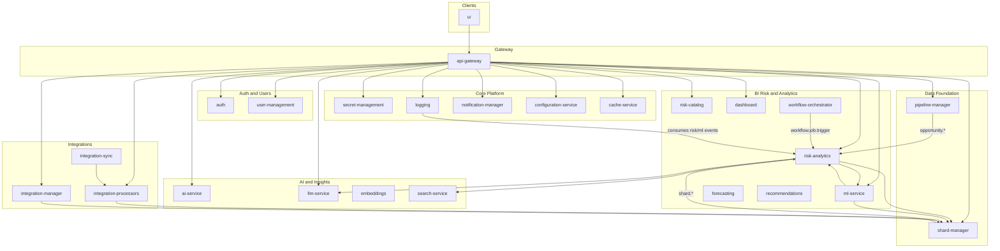

# Container Reorganization: Recommendations and Final Architecture

This document provides **recommendations** for consolidating and cleaning up Castiel containers, the **resulting list of containers**, and the **final target architecture**. It is intended to be applied in phases (documentation first; code and docker-compose changes separately).

---

## 1. Recommendations Summary

| Area | Recommendation | Rationale |
|------|----------------|----------|
| **Merge** | cache-management into cache-service | cache-management already calls cache-service; one "cache" service with basic + advanced capabilities reduces footprint. |
| **Merge** | collaboration-intelligence into collaboration-service | collaboration-service already has merged intelligence routes and CollaborationIntelligenceService; retire the standalone collaboration-intelligence container. |
| **Merge (optional)** | dashboard-analytics into dashboard | dashboard already has some analytics routes; full merge simplifies deployment. Keep separate only if you need independent scaling for heavy analytics. |
| **Keep separate** | ai-service and llm-service | Different roles (generic LLM vs BI reasoning); risk-analytics calls llm-service for reactivation strategy. |
| **Remove** | migration-service container | Logic lives in configuration-service (MIGRATION ROUTES); container has tests only, no server. |
| **Remove** | performance-optimization container | No callers in config; only mentioned in ml-service runbook comments. Remove unless you plan to wire it (e.g. ml-service ONNX/Redis). |
| **Compliance-service** | Implement and wire, or remove | Container has tests only, no server or gateway routes. Either add a minimal compliance service (policy checks, audit hooks) or remove and rely on logging + secret-management + security-service. |
| **quality-monitoring** | Wire from risk/ml or keep via analytics-service only | Role: anomaly, explanation quality, data quality for BI Risk. Currently exposed only via analytics-service merged routes; no direct callers of the standalone container. Option: have risk-analytics or ml-service call analytics-service quality endpoints. |

**Decisions / feedback (incorporated):**

- **security-service, security-scanning, quality-monitoring:** Keep; do not remove. Retain both code and documentation for these containers. They remain part of the final architecture.

---

## 2. Service overview: Name, Purpose, Recommendation, Note

| Service name | Purpose (2 lines) | Recommendation | Note |
|--------------|-------------------|----------------|------|
| api-gateway | Single entry point: JWT, tenant, rate limit, proxy to backends. | Keep | — |
| ui | Next.js 16 web app: dashboards, admin, analytics, risk views. | Keep | — |
| auth | User authentication: email/OAuth/SSO, JWT, sessions, MFA. | Keep | — |
| user-management | User profiles, orgs, teams, RBAC, invitations. | Keep | — |
| secret-management | Centralized secrets: encryption, RBAC, rotation, multi-backend. | Keep | — |
| logging | Audit logging; Data Lake collector and ML audit consumer for BI Risk. | Keep | — |
| notification-manager | Multi-channel notifications (in-app, email); event-driven. | Keep | — |
| configuration-service | Centralized tenant configuration and feature flags. | Keep | Migration routes live here. |
| cache-service | Cache admin: stats, clear, warm (Redis). | Merge in | Absorb cache-management (metrics, optimize, strategy, Cosmos/events). |
| cache-management | Advanced cache: monitoring, semantic/vector caching, warming. | Merge into cache-service | Remove container after merge. |
| risk-analytics | Risk evaluation, revenue-at-risk, early warning, batch jobs. | Keep | Core BI Risk service. |
| risk-catalog | Global, industry, tenant risk catalog. | Keep | — |
| ml-service | ML predictions: risk, win probability, LSTM, anomaly, forecast. | Keep | — |
| forecasting | Decomposition, consensus, risk-adjusted and ML forecast. | Keep | — |
| recommendations | Mitigation ranking, remediation workflows. | Keep | — |
| dashboard | Dashboard CRUD, widgets, tenant-scoped. | Keep or merge | Optionally absorb dashboard-analytics. |
| dashboard-analytics | Executive/manager/board dashboards, risk heatmap, prioritized opportunities. | Optional merge into dashboard | Keep separate if scaling analytics independently. |
| workflow-orchestrator | Batch job scheduler (workflow.job.trigger), HITL, workflows. | Keep | — |
| shard-manager | Shards, types, relationships (c_opportunity, c_account, etc.). | Keep | — |
| pipeline-manager | Pipeline views, opportunity CRUD, analytics. | Keep | — |
| ai-service | LLM completions, model routing, agents. | Keep separate | Do not merge with llm-service. |
| ai-insights | AI insights, risk analysis (evaluate, catalog, revenue-at-risk). | Keep | — |
| ai-conversation | AI conversation, context assembly, grounding, intent. | Keep | — |
| embeddings | Vector embeddings store and semantic search. | Keep | — |
| search-service | Vector + keyword search, search analytics. | Keep | — |
| adaptive-learning | CAIS adaptive learning: weights, model selection, outcomes. | Keep | — |
| reasoning-engine | Advanced reasoning: chain-of-thought, causal, etc. | Keep | — |
| llm-service | LLM reasoning: explain, recommendations, scenarios, playbook. | Keep separate | risk-analytics calls for reactivation strategy. |
| learning-service | Feedback and outcome recording, trends, satisfaction. | Keep | — |
| ai-analytics | AI usage analytics, chat catalog, proactive insights. | Keep | — |
| prompt-service | Prompt CRUD, A/B tests, analytics. | Keep | — |
| context-service | Context storage, AST, dependencies, assembly. | Keep | Connected; used by several services. |
| web-search | Web search integration, caching, AI context. | Keep | — |
| multi-modal-service | Image/diagram/audio/video understanding, OCR. | Keep | — |
| integration-manager | Integrations, webhooks, sync tasks, adapter catalog. | Keep | — |
| integration-sync | Sync execution, bidirectional sync, conflict resolution. | Keep | — |
| integration-processors | Process integration data (CRM, docs, email, meetings) into shards. | Keep | — |
| document-manager | Documents, upload/download, Blob Storage, collections. | Keep | — |
| content-generation | AI content generation from templates. | Keep | — |
| template-service | Template CRUD (context, email, document). | Keep | — |
| collaboration-service | Real-time collaboration, conversations, messages. | Merge in | Absorb collaboration-intelligence; retire its container. |
| collaboration-intelligence | Collaborative insights, memory context, sharing. | Merge into collaboration-service | Remove container; routes already partially in collaboration-service. |
| data-enrichment | Enrichment, shard vectorization, embedding templates. | Keep | — |
| security-service | Secret/vulnerability/PII scanning, SAST/DAST/SCA, findings. | Keep | Do not remove; retain code and documentation. |
| security-scanning | PII detection/redaction, device tracking, rate limiting. | Keep | Do not remove; retain code and documentation. |
| quality-monitoring | Anomaly detection, explanation quality, data quality. | Keep | Do not remove; retain code and documentation. Option: wire from risk/ml. |
| validation-engine | Validation rules: syntax, semantic, security, performance. | Keep | — |
| analytics-service | Analytics, project/AI/API metrics, reports; quality routes merged. | Keep | — |
| signal-intelligence | Communication, calendar, competitive intelligence. | Keep | — |
| pattern-recognition | Pattern learning, style, design/anti-pattern detection. | Keep | — |
| utility-services | Import/export, migrations, onboarding, service registry. | Keep | — |
| migration-service | Migration execution (tests only; no server). | Remove | Logic in configuration-service; delete container. |
| performance-optimization | Code/query optimization, baselines, recommendations. | Remove | No callers; delete unless wiring later (e.g. ml-service). |
| compliance-service | Policy/audit (tests only; no server). | Implement or remove | Either add minimal server and wire, or remove and document coverage elsewhere. |
| shared | @coder/shared: DB, cache, events, auth, ServiceClient. | Keep | Build-time library; not a runtime service. |

---

## 3. Merge and Removal Details

### 3.1 Recommended merges

- **cache-management → cache-service**  
  - Merge: CacheManagementService, CacheManagementEventPublisher, routes (metrics, optimize, strategy), and Cosmos/events config into cache-service.  
  - Update: dashboard, dashboard-analytics, context-service to keep using cache_service.url only.  
  - Remove: cache-management container and its docker-compose service.

- **collaboration-intelligence → collaboration-service**  
  - collaboration-service already contains CollaborationIntelligenceService and collaboration-intelligence routes.  
  - Retire: collaboration-intelligence container; ensure all intelligence routes are exposed under collaboration-service and gateway proxies to collaboration-service only.  
  - Remove: collaboration-intelligence from docker-compose and api-gateway config if present.

- **dashboard-analytics → dashboard (optional)**  
  - Merge: DashboardAnalyticsService, executive/manager/board routes, risk-analytics/forecasting/integration-manager calls into dashboard.  
  - Keep dashboard-analytics as separate service if you want to scale analytics independently.

### 3.2 Recommended removals

- **migration-service**  
  - Delete container folder (or keep as deprecated stub).  
  - Ensure configuration-service owns all migration routes and docs.  
  - Remove from docker-compose and any references.

- **performance-optimization**  
  - Delete container folder and docker-compose service if no planned consumer.  
  - If later needed (e.g. ml-service ONNX/Redis optimization), reintroduce and add a proper caller.

- **compliance-service**  
  - Either: (A) implement a minimal server with policy/audit endpoints and wire from gateway and logging/security, or (B) remove the container and document that compliance is covered by logging, secret-management compliance report, and security-service compliance_check.

**Compliance (after removal of compliance-service):** Compliance is covered by **logging** (audit trail, tamper-evident logs, retention), **secret-management** (e.g. `/api/secrets/compliance/report`), and **security-service** (compliance_check). No dedicated compliance-service container is required.

---

## 4. Current vs Final Container List

### 4.1 Current containers (before reorg)

| Category | Containers |
|----------|------------|
| Entry and gateway | api-gateway, ui |
| Auth and users | auth, user-management |
| Core platform | secret-management, logging, notification-manager, configuration-service, cache-service, cache-management |
| BI Risk and analytics | risk-analytics, risk-catalog, ml-service, forecasting, recommendations, dashboard, dashboard-analytics, workflow-orchestrator |
| Data foundation | shard-manager, pipeline-manager |
| AI and insights | ai-service, ai-insights, ai-conversation, embeddings, search-service, adaptive-learning, reasoning-engine, llm-service, learning-service, ai-analytics, prompt-service, context-service, web-search, multi-modal-service |
| Integrations | integration-manager, integration-sync, integration-processors |
| Content and collaboration | document-manager, content-generation, template-service, collaboration-service, collaboration-intelligence, data-enrichment |
| Security and quality | security-service, security-scanning, quality-monitoring, validation-engine |
| Analytics and optimization | analytics-service, signal-intelligence, pattern-recognition, performance-optimization |
| Utilities | utility-services |
| Shared / other | shared; compliance-service (stub), migration-service (stub) |

**Current count (runtime containers):** 52 (excluding shared). With stubs: 54.

### 4.2 Final container list (after recommended merges and removals)

Assumptions: (1) cache-management merged into cache-service, (2) collaboration-intelligence retired into collaboration-service, (3) migration-service and performance-optimization removed, (4) compliance-service removed (option B). Optional: dashboard-analytics merged into dashboard (if so, subtract 1).

| Category | Containers |
|----------|------------|
| Entry and gateway | api-gateway, ui |
| Auth and users | auth, user-management |
| Core platform | secret-management, logging, notification-manager, configuration-service, **cache-service** (includes former cache-management) |
| BI Risk and analytics | risk-analytics, risk-catalog, ml-service, forecasting, recommendations, **dashboard** (optionally includes dashboard-analytics), workflow-orchestrator |
| Data foundation | shard-manager, pipeline-manager |
| AI and insights | ai-service, ai-insights, ai-conversation, embeddings, search-service, adaptive-learning, reasoning-engine, llm-service, learning-service, ai-analytics, prompt-service, context-service, web-search, multi-modal-service |
| Integrations | integration-manager, integration-sync, integration-processors |
| Content and collaboration | document-manager, content-generation, template-service, **collaboration-service** (includes former collaboration-intelligence), data-enrichment |
| Security and quality | security-service, security-scanning, quality-monitoring, validation-engine |
| Analytics | analytics-service, signal-intelligence, pattern-recognition |
| Utilities | utility-services |
| Shared | shared |

**Final count (recommended):** 48 runtime containers (49 if dashboard-analytics kept separate). Removed: cache-management, collaboration-intelligence, migration-service, performance-optimization, compliance-service.

### 4.3 Are all remaining containers interconnected?

**No.** Aside from the containers to be removed or merged, the rest are **not** all fully interconnected. There are three levels:

1. **Gateway-exposed (client-facing)**  
   These have explicit routes on the API Gateway and are called by the UI or other clients:  
   auth, user_management, secret_management, logging, notification, ai_service, embeddings, dashboard, ml_service, risk_catalog, recommendations, integration_manager, shard_manager, integration_processors, risk_analytics, configuration_service, adaptive_learning.

2. **Backend-only (called by other services via config)**  
   Not in the gateway config but at least one other container has their URL in `config/default.yaml` (or env), so they are used over HTTP:  
   pipeline_manager (forecasting), forecasting (workflow-orchestrator, dashboard-analytics), cache_service (dashboard, dashboard-analytics, context-service), analytics_service (risk-analytics, forecasting, recommendations, dashboard-analytics, quality-monitoring, signal-intelligence, ai-analytics), context_service (validation-engine, configuration-service, security-service, multi-modal, ai-conversation, web-search), quality (validation-engine, configuration-service, security-service), ai_insights (risk-analytics, collaboration-service, ai-analytics), dashboard-analytics (none—only calls others; not currently in gateway).

3. **Weakly or not interconnected (no HTTP callers in config)**  
   No other container references their URL in config, and they are not in the gateway. They may still publish/consume events or be intended for future use:  
   **reasoning-engine**, **pattern-recognition**, **signal-intelligence**, **validation-engine**, **document-manager**, **content-generation**, **template-service**, **security-service**, **security-scanning**, **prompt-service**, **learning-service**, **web-search**, **utility-services**, **workflow-orchestrator** (interconnected only via events: risk-analytics consumes `workflow.job.trigger`; no HTTP callers), **integration-sync** (orchestrates sync; integration-manager shares Cosmos collections but no INTEGRATION_SYNC_URL in config).

**Summary:**  
- **Fully interconnected (gateway or called by others):** auth, user-management, secret-management, logging, notification-manager, ai-service, embeddings, dashboard, ml-service, risk-catalog, recommendations, integration-manager, shard-manager, integration-processors, risk-analytics, configuration-service, adaptive-learning, pipeline-manager, forecasting, cache-service, analytics-service, context-service, quality-monitoring, ai-insights, collaboration-service (and after merge: cache-service includes cache-management; collaboration-service includes collaboration-intelligence).  
- **Event-only or no HTTP callers (weakly interconnected):** workflow-orchestrator (events only), reasoning-engine, pattern-recognition, signal-intelligence, validation-engine, document-manager, content-generation, template-service, security-service, security-scanning, prompt-service, learning-service, web-search, utility-services, integration-sync; and dashboard-analytics (calls others but has no gateway route and no other service URL pointing to it in config).

To make the system fully interconnected, either: (a) add gateway routes and/or service URLs for the weakly connected containers where they should be used, or (b) document them as optional/future and accept event-only or outbound-only integration.

### 4.4 Final container list (flat, by category)

| # | Container | Category | Notes |
|---|-----------|----------|------|
| 1 | api-gateway | Entry and gateway | — |
| 2 | ui | Entry and gateway | — |
| 3 | auth | Auth and users | — |
| 4 | user-management | Auth and users | — |
| 5 | secret-management | Core platform | — |
| 6 | logging | Core platform | — |
| 7 | notification-manager | Core platform | — |
| 8 | configuration-service | Core platform | — |
| 9 | cache-service | Core platform | — |
| 10 | risk-analytics | BI Risk and analytics | — |
| 11 | risk-catalog | BI Risk and analytics | — |
| 12 | ml-service | BI Risk and analytics | — |
| 13 | forecasting | BI Risk and analytics | — |
| 14 | recommendations | BI Risk and analytics | — |
| 15 | dashboard | BI Risk and analytics | — |
| 16 | workflow-orchestrator | BI Risk and analytics | — |
| 17 | shard-manager | Data foundation | — |
| 18 | pipeline-manager | Data foundation | — |
| 19 | ai-service | AI and insights | — |
| 20 | ai-insights | AI and insights | — |
| 21 | ai-conversation | AI and insights | — |
| 22 | embeddings | AI and insights | — |
| 23 | search-service | AI and insights | — |
| 24 | adaptive-learning | AI and insights | — |
| 25 | reasoning-engine | AI and insights | — |
| 26 | llm-service | AI and insights | — |
| 27 | learning-service | AI and insights | — |
| 28 | ai-analytics | AI and insights | — |
| 29 | prompt-service | AI and insights | — |
| 30 | context-service | AI and insights | — |
| 31 | web-search | AI and insights | — |
| 32 | multi-modal-service | AI and insights | — |
| 33 | integration-manager | Integrations | — |
| 34 | integration-sync | Integrations | — |
| 35 | integration-processors | Integrations | — |
| 36 | document-manager | Content and collaboration | — |
| 37 | content-generation | Content and collaboration | — |
| 38 | template-service | Content and collaboration | — |
| 39 | collaboration-service | Content and collaboration | — |
| 40 | data-enrichment | Content and collaboration | — |
| 41 | security-service | Security and quality | **Keep:** do not remove; retain code and documentation. |
| 42 | security-scanning | Security and quality | **Keep:** do not remove; retain code and documentation. |
| 43 | quality-monitoring | Security and quality | **Keep:** do not remove; retain code and documentation. |
| 44 | validation-engine | Security and quality | — |
| 45 | analytics-service | Analytics | — |
| 46 | signal-intelligence | Analytics | — |
| 47 | pattern-recognition | Analytics | — |
| 48 | utility-services | Utilities | — |
| — | shared | Build-time library (not a runtime service) | — |

*If dashboard-analytics is kept separate, add it as #16 and renumber workflow-orchestrator and below.*

---

## 5. Final Architecture

### 5.1 Principles

- **Single entry:** All client traffic via API Gateway (JWT, X-Tenant-ID, rate limit, config-driven proxy).
- **Service-to-service:** HTTP via ServiceClient, URLs from config; no hardcoded ports or hostnames.
- **Events:** RabbitMQ only; domain events include tenantId, source, data.
- **Data:** Cosmos DB (database `castiel`), partition key tenantId; Redis for cache/sessions where used.
- **Shared lib:** All services use @coder/shared (containers/shared).

### 5.2 High-level diagram (final)

### 5.3 BI Risk data flow (unchanged)

- **Triggers:** pipeline-manager (opportunity.*), shard-manager (shard.*), integration-sync (integration.opportunity.updated), workflow-orchestrator (workflow.job.trigger → bi_batch_jobs).
- **Risk pipeline:** risk-analytics evaluates opportunities; calls ml-service (features, predictions) and optionally search-service (historical pattern); publishes risk.evaluation.completed, etc.
- **Downstream:** forecasting (risk-adjusted, ML forecast), recommendations (after risk + forecast), dashboard/dashboard-analytics (prioritized opportunities, heatmaps), notification-manager (anomaly alerts).
- **Audit and Data Lake:** logging consumes risk/ml events; DataLakeCollector and MLAuditConsumer write Parquet and audit blobs when configured.

### 5.4 Service dependency matrix (final, key only)

| Consumer | Depends on (examples) |
|----------|------------------------|
| api-gateway | All backend service URLs from config |
| risk-analytics | ml-service, search-service (optional), shard-manager (via events), logging (Data Lake config) |
| ml-service | shard-manager, risk-analytics, ai-service, Azure ML endpoints |
| forecasting | risk-analytics, ml-service |
| recommendations | risk-analytics, forecasting (events) |
| dashboard | cache-service (optional); if merged, also risk-analytics, forecasting, integration-manager |
| workflow-orchestrator | RabbitMQ (publishes to bi_batch_jobs) |
| shard-manager | Cosmos DB, RabbitMQ, logging (audit) |
| pipeline-manager | shard-manager, logging, user-management |
| collaboration-service | Cosmos DB, RabbitMQ (no separate collaboration-intelligence) |
| cache-service | Redis, Cosmos DB (if advanced features kept), RabbitMQ |
| context-service | Cosmos DB; used by security-service, pattern-recognition, multi-modal, ai-conversation, web-search, validation-engine |
| quality-monitoring | Exposed via analytics-service quality routes; can be called by risk-analytics or ml-service for explanation/data quality |

---

## 6. Implementation checklist (for when you apply changes)

- [x] Merge cache-management into cache-service (code, config, routes); remove cache-management container and compose entry.
- [x] Retire collaboration-intelligence (gateway/config point to collaboration-service only); remove collaboration-intelligence container and compose entry.
- [x] Optionally merge dashboard-analytics into dashboard; or keep both and document. (Done: merged into dashboard.)
- [x] Remove migration-service container and references; confirm configuration-service owns migration.
- [x] Remove performance-optimization container and compose entry; update runbook/docs if any.
- [x] Resolve compliance-service: implement minimal server and wire, or remove container and document. (Done: removed; compliance covered by logging, secret-management, security-service.)
- [x] **Keep** security-service, security-scanning, and quality-monitoring (code and documentation); do not remove.
- [x] Update api-gateway config (and docker-compose env) to drop removed/merged service URLs. (No gateway references to removed services found.)
- [x] Update documentation (e.g. CONTAINER_PURPOSE_AND_INTEGRATION.md, README) with final list and architecture.
- [ ] Wire quality-monitoring for BI Risk (e.g. risk-analytics or ml-service → analytics-service quality endpoints) if desired.

---

*See [CONTAINER_PURPOSE_AND_INTEGRATION.md](./CONTAINER_PURPOSE_AND_INTEGRATION.md) in this folder for per-container purpose and integration details. For BI Sales Risk implementation see `documentation/requirements/BI_SALES_RISK_IMPLEMENTATION_PLAN.md`.*
