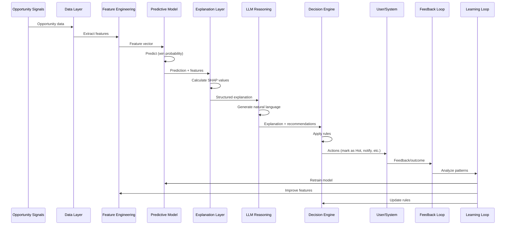
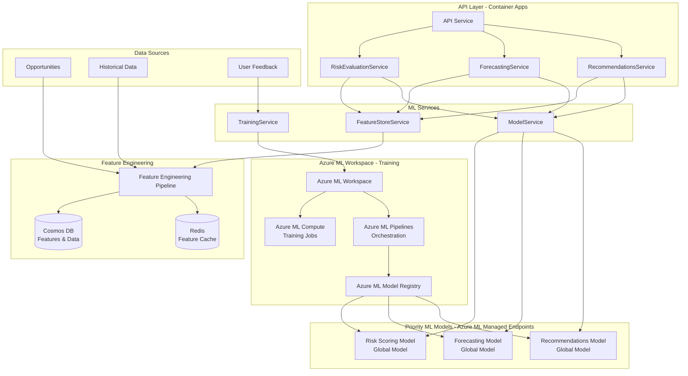
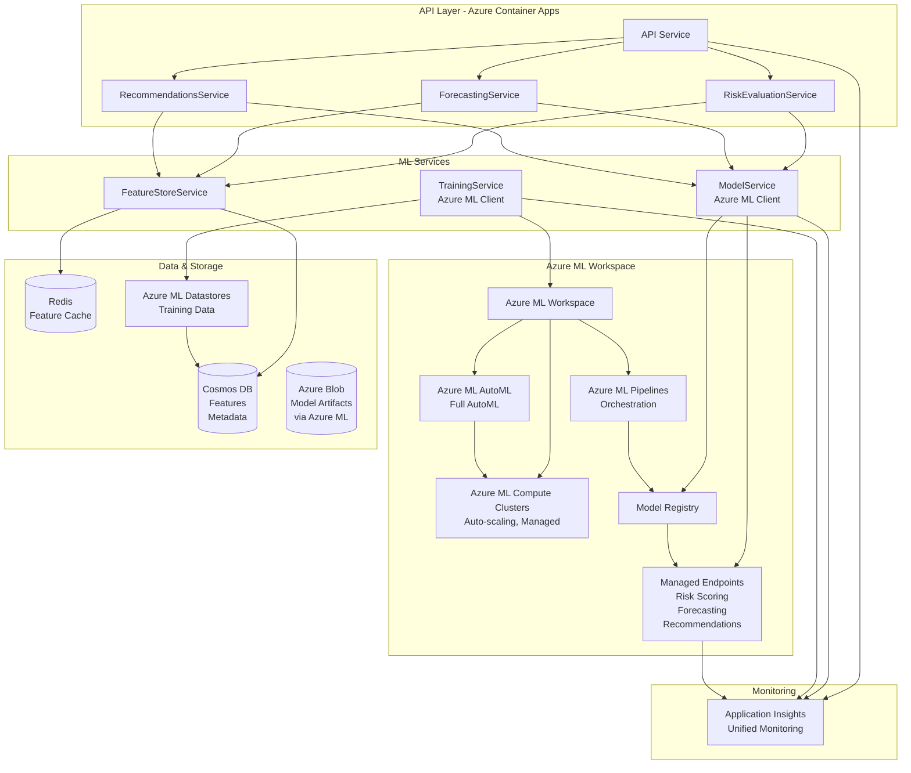
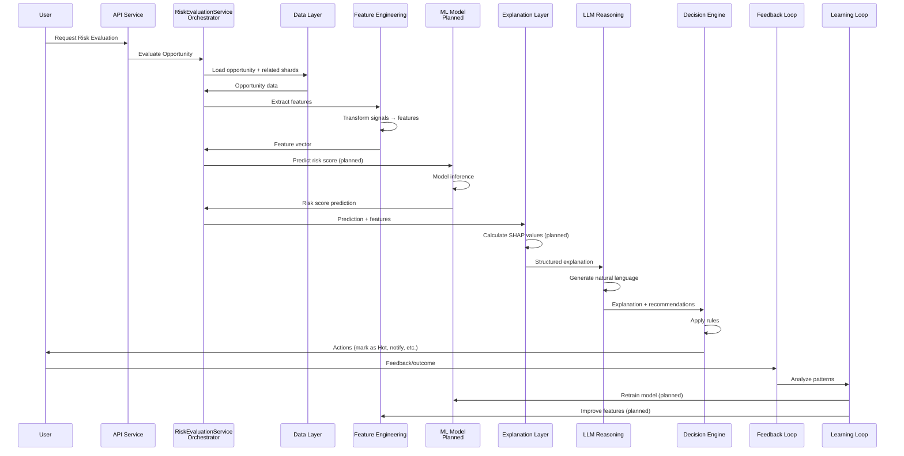
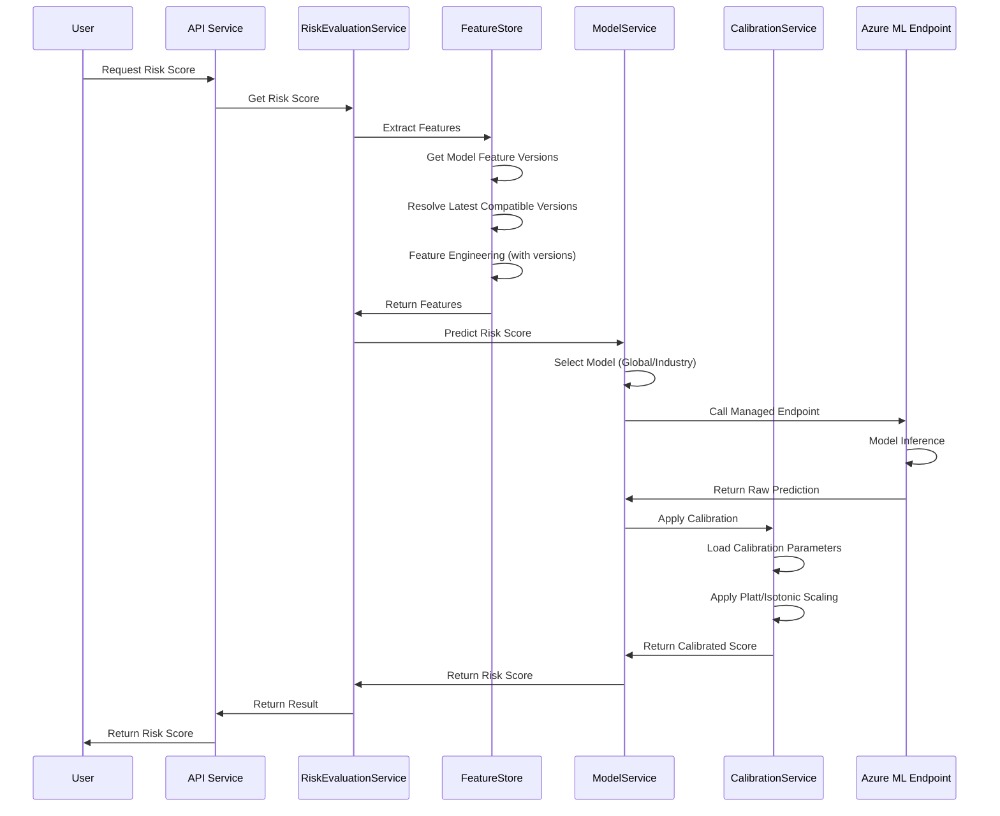
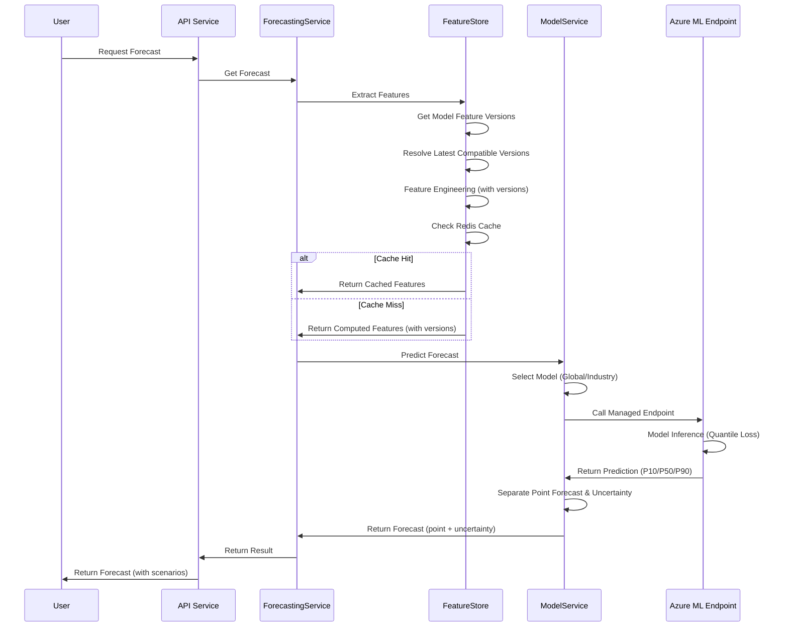
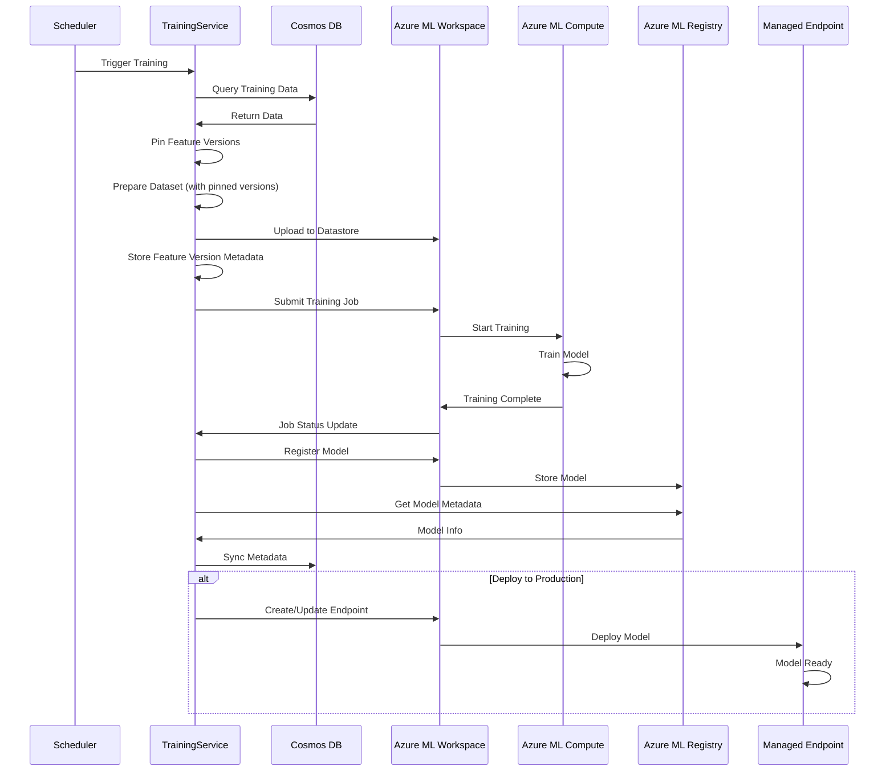

# ML Architecture - Priority Use Cases

**Note:** For operational standards and must-do requirements, see [ML_OPERATIONAL_STANDARDS.md](ML_OPERATIONAL_STANDARDS.md).

## Overview

The ML system focuses on **three priority use cases** that provide the highest business value: **Risk Scoring**, **Revenue Forecasting**, and **Recommendations**. The architecture leverages **Azure ML Workspace** for managed training and **Azure ML Managed Endpoints** for model serving, providing a simple, maintainable solution optimized for a small team while maximizing Azure services usage.

**Key Design Principles:**
- **Azure-First**: Maximize use of Azure managed services
- **Simple Maintenance**: Minimal custom infrastructure, managed services where possible
- **Small Team Friendly**: Easy deployment, monitoring, and operations
- **High Performance**: Optimized for accuracy and latency

**Architecture Benefits for Small Team:**
- ✅ **No Custom Training Infrastructure**: Azure ML Workspace handles all training
- ✅ **Managed Model Serving**: Azure ML Managed Endpoints (auto-scaling, high availability)
- ✅ **Unified Monitoring**: Application Insights for all metrics (no separate ML monitoring)
- ✅ **Simple Deployment**: Models deployed via Azure ML (no custom deployment code)
- ✅ **Cost Effective**: Pay-per-use compute, auto-scale to zero
- ✅ **Easy Operations**: Azure Portal for monitoring and management

**Priority Use Cases:**
1. **Risk Scoring**: Global model, industry-specific fine-tuning when justified
2. **Revenue Forecasting**: Global model with industry seasonality features
3. **Recommendations**: Global model enhancing existing recommendation system

---

## Compound AI System (CAIS) Architecture

The ML system is part of a larger **Compound AI System (CAIS)** that orchestrates ML models, LLMs, rules, and feedback loops. The ML models are **components** within the CAIS, not the CAIS itself.

### CAIS Overview

A Compound AI System orchestrates multiple AI components:
- **ML Models** (this document focuses on these) - Learn patterns, make predictions
- **LLMs** - Explain predictions, generate natural language, suggest actions
- **Rules / Heuristics** - Enforce business logic, provide deterministic decisions
- **Memory / Historical Data** - Past outcomes, patterns, context
- **Feedback Loops** - User feedback, outcome tracking, continuous improvement

**Key Principle**: ML predicts, LLM explains, rules constrain, system learns.

### CAIS Layers

The system is organized into eight CAIS layers:

1. **Data Layer** (Signals + Memory) - Cosmos DB, Redis, Azure ML Datastores
2. **Feature Engineering Layer** - FeatureStoreService - Transforms signals to features
3. **Predictive Model Layer** - Azure ML Managed Endpoints - ML models make predictions
4. **Explanation Layer** - SHAP values, feature importance - Explains ML predictions
5. **LLM Reasoning Layer** - ChainOfThoughtService, IntentAnalyzerService - Natural language reasoning
6. **Decision & Action Engine** - RiskEvaluationService, RecommendationsService - Combines rules + AI, executes actions
7. **Feedback Loop** - FeedbackLearningService - Collects user feedback and outcomes
8. **Learning Loop** - Continuous Learning - Improves system over time

### CAIS Decision Loop

The complete CAIS decision loop:



For detailed CAIS architecture, see [CAIS_ARCHITECTURE.md](CAIS_ARCHITECTURE.md).  
For orchestration patterns, see [CAIS_ORCHESTRATION.md](CAIS_ORCHESTRATION.md).

---

## High-Level Architecture



## Component Architecture



## Core Components

### 1. Feature Store Service

**Location**: `apps/api/src/services/risk-ml/feature-store.service.ts`

**Purpose**: Extract, transform, and store features for ML models

**Responsibilities**:
- Extract features from opportunities, risk snapshots, and related shards
- Perform feature engineering (temporal, categorical, numerical transformations)
- Cache features for performance
- **Feature versioning and lineage** (see [ML_OPERATIONAL_STANDARDS.md](ML_OPERATIONAL_STANDARDS.md))
  - Pin feature versions for training jobs
  - Resolve latest compatible versions for inference
  - Track feature computation logic and source

**Key Methods**:
- `extractFeatures(opportunityId, tenantId, modelVersion?)`: Extract all features for an opportunity (with version resolution)
- `getHistoricalFeatures(opportunityId, tenantId)`: Get historical feature values
- `cacheFeatures(opportunityId, features)`: Cache features for quick access
- `getFeatureSchema()`: Return feature schema and metadata
- `pinFeatureVersions(trainingJobId, featureNames)`: Pin feature versions for training job
- `getFeatureVersionForInference(featureName, modelVersion)`: Get latest compatible feature version
- `isCompatibleVersion(featureVersion, requiredVersion)`: Check feature version compatibility

### 2. Model Service (CAIS Layer 3: Predictive Model)

**Location**: `apps/api/src/services/ml/model.service.ts`

**Purpose**: Manage ML model inference via Azure ML Managed Endpoints

**CAIS Role**: Calls ML models to make predictions. The ML models learn patterns from signals and output numeric predictions (win probability, risk scores, forecasts).

**Responsibilities**:
- Call Azure ML Managed Endpoints for predictions
- Manage model selection (global vs. industry-specific)
- Cache predictions for performance
- Handle model versioning and A/B testing
- Sync model metadata from Azure ML to Cosmos DB
- **Post-model calibration** (see [ML_OPERATIONAL_STANDARDS.md](ML_OPERATIONAL_STANDARDS.md))
  - Apply calibration to risk scoring predictions (Platt Scaling or Isotonic Regression)
  - Load calibration parameters per model version
  - Ensure calibrated probabilities for all production deployments

**Key Methods**:
- `predictRiskScore(features, industryId?)`: Call Risk Scoring endpoint and apply calibration
- `predictForecast(features, industryId?)`: Call Forecasting endpoint
- `getRecommendations(features, industryId?)`: Call Recommendations endpoint
- `getModelMetadata(modelType)`: Get model info from Azure ML Registry
- `selectModel(modelType, industryId)`: Select global or industry model
- `applyCalibration(rawScore, modelVersion)`: Apply calibration to raw model output
- `loadCalibrationParameters(modelVersion)`: Load calibration parameters for model

**Status**: 📋 Planned

### 3. Training Service (CAIS Layer 8: Learning Loop)

**Location**: `apps/api/src/services/ml/training.service.ts`

**Purpose**: Orchestrate model training via Azure ML Workspace

**CAIS Role**: Part of the learning loop that continuously improves the system. Retrains ML models based on new outcomes and feedback.

**Responsibilities**:
- Trigger Azure ML training jobs
- Prepare training datasets (export to Azure ML Datastores)
- Monitor training job status
- Register trained models to Azure ML Registry
- Sync model metadata to Cosmos DB

**Key Methods**:
- `scheduleTraining(modelType, options)`: Trigger Azure ML training job
- `prepareTrainingData(modelType)`: Export data to Azure ML Datastore
- `getTrainingStatus(jobId)`: Check Azure ML job status
- `registerModel(modelId, modelType)`: Register model to Azure ML Registry
- `syncModelMetadata(modelId)`: Sync metadata to Cosmos DB

**Status**: 📋 Planned

### 4. Evaluation Service (CAIS Layer 8: Learning Loop)

**Location**: `apps/api/src/services/ml/evaluation.service.ts`

**Purpose**: Evaluate model performance and trigger retraining

**CAIS Role**: Part of the learning loop that monitors system performance and triggers improvements. Detects when models need retraining based on drift and performance degradation.

**Responsibilities**:
- Calculate model metrics from predictions vs. outcomes
- Track model performance over time
- **Monitor for three distinct drift types** (see [ML_OPERATIONAL_STANDARDS.md](ML_OPERATIONAL_STANDARDS.md)):
  - Feature distribution drift
  - Prediction distribution drift
  - Outcome drift (most critical)
- Trigger retraining when needed
- Log metrics to Application Insights

**Key Methods**:
- `evaluateModel(modelId, predictions, actuals)`: Calculate metrics
- `trackPrediction(modelId, prediction, actual)`: Track prediction outcome
- `detectFeatureDistributionDrift(modelId)`: Check for feature distribution changes
- `detectPredictionDistributionDrift(modelId)`: Check for prediction distribution changes
- `detectOutcomeDrift(modelId)`: Check for outcome drift (most critical)
- `shouldRetrain(modelId)`: Determine if retraining is needed
- `logMetrics(modelId, metrics)`: Log to Application Insights

**Status**: 📋 Planned

### 5. RiskEvaluationService (CAIS Layer 6: Decision & Action Engine)

**Location**: `apps/api/src/services/risk-evaluation.service.ts`

**Purpose**: Orchestrate risk detection and make decisions

**CAIS Role**: Acts as both **orchestrator** (combines rule-based + historical + AI + ML detection methods) and **decision engine** (executes actions based on rules + AI outputs).

**Current Implementation**: ✅ Orchestrates rule-based, historical, and AI risk detection  
**Planned Enhancement**: 📋 Enhanced with ML predictions

**Responsibilities**:
- Orchestrate multiple risk detection methods (rule-based, historical, AI, ML)
- Merge and deduplicate risks from different sources
- Resolve conflicts between detection methods
- Calculate overall risk score
- Generate explanations (structured + LLM)
- Make decisions based on rules + AI outputs
- Execute actions (CRM updates, notifications, task creation)

**Key Methods**:
- `evaluateOpportunity(opportunityId, tenantId, userId, options)`: Full risk evaluation
- `detectRisks(opportunity, relatedShards, tenantId, userId, options)`: Orchestrate risk detection
- `calculateRiskScore(risks)`: Calculate overall risk score
- `generateExplanation(risks, riskScore, opportunity)`: Generate explanations
- `makeDecisions(riskScore, risks, explanation, opportunity)`: Apply decision rules
- `executeActions(decisions, opportunityId, tenantId)`: Execute actions

**Status**: ✅ Current (enhanced with ML planned)

### 6. Explanation Services (CAIS Layer 4: Explanation + Layer 5: LLM Reasoning)

**RiskExplainabilityService** (CAIS Layer 4: Explanation Layer)
- **Location**: `apps/api/src/services/risk-explainability.service.ts`
- **Purpose**: Provides structured explanations for risk detections
- **CAIS Role**: Explains ML predictions using feature importance and SHAP values
- **Status**: ✅ Current (SHAP integration planned)

**ExplainableAIService** (CAIS Layer 4: Explanation Layer)
- **Location**: `apps/api/src/services/explainable-ai.service.ts`
- **Purpose**: General explainability for AI responses
- **CAIS Role**: Bridges between ML explanations and LLM reasoning
- **Status**: ✅ Current

**ChainOfThoughtService** (CAIS Layer 5: LLM Reasoning Layer)
- **Location**: `apps/api/src/services/chain-of-thought.service.ts`
- **Purpose**: Multi-step LLM reasoning for complex queries
- **CAIS Role**: Transforms structured explanations into natural language, generates recommendations
- **Status**: ✅ Current

**IntentAnalyzerService** (CAIS Layer 5: LLM Reasoning Layer)
- **Location**: `apps/api/src/services/intent-analyzer.service.ts`
- **Purpose**: Intent classification and entity extraction
- **CAIS Role**: Understands user queries and extracts relevant context
- **Status**: ✅ Current

### 7. FeedbackLearningService (CAIS Layer 7: Feedback Loop)

**Location**: `apps/api/src/services/feedback-learning.service.ts`

**Purpose**: Collect and analyze user feedback for continuous improvement

**CAIS Role**: Collects user feedback and outcome data to feed the learning loop.

**Responsibilities**:
- Record user feedback on AI responses and predictions
- Track outcomes (won/lost opportunities)
- Analyze feedback patterns
- Link feedback to predictions for learning
- **Planned**: Extended for ML feedback collection

**Status**: ✅ Current (ML feedback extension planned)

## Data Flow

### CAIS Decision Loop Flow - Risk Scoring

The complete CAIS decision loop for risk scoring:



### Inference Flow - Risk Scoring (with Calibration)



### Inference Flow - Forecasting (with Uncertainty Separation)

**Architecture:** Two-output model (point forecast + uncertainty) using quantile loss (P10/P50/P90) by default. See [ML_OPERATIONAL_STANDARDS.md](ML_OPERATIONAL_STANDARDS.md) for details.



### Training Flow - Azure ML Workspace



## Data Models

### Risk Training Example

```typescript
interface RiskTrainingExample {
  id: string;
  opportunityId: string;
  tenantId: string;
  snapshotDate: Date;
  
  // Features
  features: {
    // Opportunity features
    dealValue: number;
    probability: number;
    daysToClose: number;
    daysSinceActivity: number;
    stage: string;
    industry: string;
    
    // Risk features
    detectedRisks: Array<{
      riskId: string;
      category: string;
      confidence: number;
    }>;
    riskScore: number;
    categoryScores: Record<string, number>;
    
    // Historical features
    ownerWinRate: number;
    accountHealth: number;
    similarDealsWinRate: number;
    
    // Relationship features
    stakeholderCount: number;
    activityCount: number;
    documentCount: number;
  };
  
  // Labels (actual outcomes)
  labels: {
    actualRiskScore: number;
    actualOutcome: 'won' | 'lost' | null;
    actualRevenueAtRisk: number;
    actualMitigationEffectiveness?: Record<string, number>;
  };
  
  createdAt: Date;
  outcomeDate?: Date;
}
```

### Model Metadata

**Stored in Azure ML Registry (synced to Cosmos DB):**

```typescript
interface MLModel {
  id: string;                        // Azure ML model ID
  name: string;                      // Model name
  modelType: 'risk_scoring' | 'forecasting' | 'recommendations';
  version: string;                   // Semantic version
  
  // Scope
  scope: 'global' | 'industry';
  industryId?: string;                // For industry-specific models
  
  // Azure ML References
  azureMLModelId: string;             // Azure ML model registry ID
  endpointUrl: string;                // Managed endpoint URL
  endpointName: string;               // Managed endpoint name
  
  // Relationships (for fine-tuned models)
  parentModelId?: string;             // Parent model (for industry models)
  performanceImprovement?: number;    // % improvement over parent
  
  trainingDate: Date;
  
  // Performance metrics
  metrics: {
    // Risk Scoring
    r2Score?: number;
    mse?: number;
    mae?: number;
    
    // Forecasting
    mape?: number;                    // Mean Absolute Percentage Error
    rmse?: number;
    
    // Recommendations
    ndcg?: number;                    // Normalized Discounted Cumulative Gain
    precision?: number;
    recall?: number;
  };
  
  // Training info
  trainingExamples: number;
  validationExamples: number;
  trainingDurationMs: number;
  
  // Status
  status: 'training' | 'evaluating' | 'active' | 'deprecated';
  isDefault: boolean;
  
  // A/B testing
  abTestTraffic: number;              // Percentage (0-100)
  abTestStartDate?: Date;
  
  createdAt: Date;
  updatedAt: Date;
}
```

## Model Architecture Strategy

### Hybrid Approach: Global Models + Industry Fine-Tuning

The ML system uses a **hybrid architecture** that balances performance, maintainability, and scalability:

**Phase 1: Global Models (Initial Implementation)**
- **3 global models** (one per use case):
  - Global Risk Scoring Model
  - Global Forecasting Model
  - Global Recommendations Model
- Each model trained on **all industries** with industry as a feature
- Industry-specific patterns captured through:
  - Industry as categorical/embedding feature
  - Industry-specific baselines (win rates, risk baselines)
  - Industry-specific features (seasonality, patterns)
- Works immediately for all industries, including new ones

**Phase 2: Industry-Specific Models (When Justified)**
- Add industry-specific models only when:
  - **Data Threshold**: >3000 examples with outcomes for that industry
  - **Performance Improvement**: >5% better than global model (validated)
  - **Business Value**: High-value industry or distinct patterns
- Industry models are **fine-tuned from global models** (transfer learning)
- Expected: 3-15 total models (vs. 48+ with pure industry approach)

### Model Selection Logic

```typescript
async function getModelForInference(
  modelType: ModelType,
  industryId?: string,
  tenantId?: string
): Promise<LoadedModel> {
  // 1. Check for industry-specific model
  if (industryId) {
    const industryModel = await getIndustryModel(modelType, industryId);
    if (industryModel && industryModel.isActive) {
      // Check if industry model is better
      if (industryModel.performanceImprovement > 0.05) {
        return await loadModel(industryModel.id);
      }
    }
  }
  
  // 2. Fall back to global model
  const globalModel = await getGlobalModel(modelType);
  return await loadModel(globalModel.id);
}
```

### Benefits of Hybrid Approach

1. **Data Efficiency**: Leverages all available data across industries
2. **Maintenance**: 3-15 models vs. 48+ models (much lower overhead)
3. **Performance**: Good performance for all industries (global model works for all)
4. **Scalability**: New industries work immediately with global model
5. **Cost**: Lower training, deployment, and monitoring costs

### Model Scope Types

- **Global Models** (`scope: 'global'`): Trained on all industries, industry as feature
- **Industry Models** (`scope: 'industry'`): Fine-tuned from global model for specific industry
- **Tenant Models** (`scope: 'tenant'`): Tenant-specific models (future enhancement)

See [MODEL_ARCHITECTURE_RECOMMENDATION.md](MODEL_ARCHITECTURE_RECOMMENDATION.md) for detailed analysis and recommendations.

## Integration with Existing System

### Priority Use Cases Integration

**1. Risk Scoring Integration:**
- Enhances existing `RiskEvaluationService`
- ML model provides risk scores via Azure ML endpoint
- Combines with rule-based and LLM risk detection
- Multi-level aggregation (opportunity → account → team → tenant)

**2. Revenue Forecasting Integration:**
- New `ForecastingService` (or enhances existing forecasting)
- ML model provides forecasts via Azure ML endpoint
- Multi-level forecasting (opportunity → team → tenant)
- Industry seasonality captured in features

**3. Recommendations Integration:**
- Enhances existing `RecommendationsService`
- ML model improves recommendation quality via Azure ML endpoint
- Combines with existing vector search and collaborative filtering
- Better personalization and ranking

### Service Integration Pattern

**API Service → ML Service → Azure ML Endpoint:**
1. API service receives request
2. Calls FeatureStoreService to extract features
3. Calls ModelService with features
4. ModelService calls Azure ML Managed Endpoint
5. Returns prediction to API service
6. API service returns result to user

**Feedback Loop:**
- User feedback stored in Cosmos DB
- Training service exports feedback to Azure ML Datastore
- Used for model retraining and improvement

## Azure Services Architecture

### Azure ML Workspace (Primary Training Platform)

**Components:**
- **Azure ML Compute**: On-demand compute for training jobs
  - Auto-scales based on workload
  - Pay-per-use pricing
  - Supports GPU for deep learning (if needed)
- **Azure ML Pipelines**: Training orchestration
  - Scheduled retraining
  - Data preparation → Training → Evaluation → Deployment
  - Versioned pipeline runs
- **Azure ML Model Registry**: Model versioning and management
  - Semantic versioning
  - Model metadata
  - A/B testing configuration
  - Sync to Cosmos DB for application access
- **Azure ML Managed Endpoints**: Real-time inference
  - Automatic scaling
  - High availability
  - REST API interface
  - Model versioning support
- **Azure ML Datastores**: Training data management
  - Versioned datasets
  - Linked to Cosmos DB and Blob Storage
  - Training data exports

### Cosmos DB (Application Data & Metadata)

**Collections:**
- **Features**: Computed features for training and inference
- **Model Metadata**: Synced from Azure ML Registry (for application queries)
- **Training Jobs**: Job status and results (synced from Azure ML)
- **Feedback**: User feedback and outcomes (for continuous learning)

### Azure Blob Storage (Model Artifacts)

**Managed by Azure ML:**
- Model artifacts stored automatically by Azure ML
- ONNX, pickle, or other formats
- Versioned storage
- Accessible via Azure ML SDK

### Redis (Feature & Prediction Caching)

**Cache Strategy:**
- **Feature Cache**: Cached features with event-based invalidation (cache invalidated when opportunity changes)
- **Prediction Cache**: Recent predictions with event-based invalidation (cache invalidated when opportunity changes)
- Reduces calls to Azure ML endpoints
- Improves latency for repeated requests

### Application Insights (Unified Monitoring)

**Metrics Tracked:**
- Model inference latency
- Prediction accuracy (when outcomes available)
- Endpoint health and availability
- Training job status
- Feature extraction performance
- Custom business metrics

## Azure ML Integration Details

### Model Deployment to Managed Endpoints

**Process:**
1. Train model in Azure ML Workspace
2. Register model to Azure ML Registry
3. Create/update Managed Endpoint
4. Deploy model to endpoint
5. Endpoint automatically scales based on traffic

**Endpoint Configuration:**
- **Real-time inference**: REST API endpoint
- **Auto-scaling**: 0-10 instances (configurable)
- **Cost Control** (see [ML_OPERATIONAL_STANDARDS.md](ML_OPERATIONAL_STANDARDS.md)):
  - **Mandatory Defaults (Phase 1):**
    - Min replicas = 0 (where possible) - scale to zero when idle
    - Autoscale configuration - scale based on traffic
  - **Optional Optimizations (Phase 2):**
    - Scale-down cooldowns - prevent rapid scaling
    - Night/weekend schedules - reduce capacity during low usage
    - ROI-based retraining frequency - tie retraining to business value
- **Authentication**: Managed identity or key-based
- **Versioning**: Support for multiple model versions
- **A/B Testing**: Traffic splitting between versions
- **Cost Logging**: Log cost per model version for monitoring

### Training Job Configuration

**Azure ML Compute:**
- **Instance Type**: Standard_NC6s_v3 (GPU) or Standard_DS3_v2 (CPU)
- **Auto-scaling**: Scale down to 0 when idle
- **Cost Optimization**: Use spot instances for training (optional)

**Pipeline Steps:**
1. Data preparation (export from Cosmos DB to Datastore)
2. Feature engineering (if needed)
3. Model training (XGBoost, etc.)
4. Model evaluation
5. Model registration (if metrics meet threshold)
6. Endpoint deployment (if approved)

### Model Selection Logic (with Shadow Evaluation)

**Shadow Evaluation:** When using industry-specific models, always run global model in background (shadow mode) for safe rollout and continuous validation. Shadow evaluation is **async and non-blocking** to avoid latency impact (see [ML_OPERATIONAL_STANDARDS.md](ML_OPERATIONAL_STANDARDS.md)).

```typescript
async function selectModel(
  modelType: ModelType,
  industryId?: string,
  requestId?: string
): Promise<string> {
  // 1. Check for industry-specific model in Azure ML Registry
  if (industryId) {
    const industryModel = await azureML.registry.models.get(
      modelType,
      { scope: 'industry', industryId }
    );
    if (industryModel && industryModel.isActive) {
      if (industryModel.performanceImprovement > 0.05) {
        // Shadow Evaluation: Trigger async global model evaluation
        const globalModel = await azureML.registry.models.get(
          modelType,
          { scope: 'global' }
        );
        if (globalModel && requestId) {
          // Trigger shadow evaluation (async, non-blocking)
          triggerShadowEvaluation(
            requestId,
            industryModel.id,
            globalModel.id,
            modelType
          ).catch(error => {
            // Log error but don't block inference
            monitoring.trackException(error, {
              operation: 'shadow_evaluation',
              modelType,
              industryId
            });
          });
        }
        
        return industryModel.endpointUrl;
      }
    }
  }
  
  // 2. Use global model endpoint (default)
  const globalModel = await azureML.registry.models.get(
    modelType,
    { scope: 'global' }
  );
  return globalModel.endpointUrl;
}

/**
 * Trigger shadow evaluation (async, non-blocking)
 */
async function triggerShadowEvaluation(
  requestId: string,
  primaryModelId: string,
  shadowModelId: string,
  modelType: ModelType
): Promise<void> {
  // Queue shadow evaluation job (Azure Service Bus or background worker)
  // This runs asynchronously and does not block the primary inference
  await serviceBus.sendMessage('shadow-evaluation-queue', {
    requestId,
    primaryModelId,
    shadowModelId,
    modelType,
    timestamp: new Date()
  });
}
```

## Performance Considerations

### Caching Strategy

- **Features**: Cache in Redis for 15 minutes (opportunities change infrequently)
- **Predictions**: Cache in Redis with event-based invalidation (invalidated when opportunity changes, no fixed TTL)
- **Model Metadata**: Cache in memory, refresh on version change

### Inference Modes (Phase 2)

**Two Inference Modes:**
- **Sync Mode (Phase 1):** UI, user-facing requests (<500ms target)
  - Direct API call → Azure ML endpoint → immediate response
  - Used for real-time user interactions
- **Async Mode (Phase 2):** Batch, dashboards, reports (queue-based)
  - Queue → Azure ML endpoint → store result → UI polls/loads later
  - **Required for batch forecasts and dashboards** (see [ML_OPERATIONAL_STANDARDS.md](ML_OPERATIONAL_STANDARDS.md))
  - Prevents UI blocking and reduces latency pressure

**Async Flow:**
```typescript
// Async inference request
async function requestAsyncInference(
  modelType: ModelType,
  features: FeatureVector,
  requestId: string
): Promise<AsyncInferenceJob> {
  // Queue inference job
  const job = await inferenceQueue.enqueue({
    requestId,
    modelType,
    features,
    status: 'queued',
    createdAt: new Date()
  });
  
  // Trigger background worker
  await triggerInferenceWorker(job.id);
  
  return {
    jobId: job.id,
    status: 'queued',
    estimatedCompletion: new Date(Date.now() + 30000) // 30s estimate
  };
}

// Poll for results
async function getAsyncInferenceResult(
  jobId: string
): Promise<InferenceResult | null> {
  const job = await getInferenceJob(jobId);
  
  if (job.status === 'completed') {
    return await getStoredPrediction(job.requestId);
  } else if (job.status === 'failed') {
    throw new Error(`Inference failed: ${job.error}`);
  }
  
  return null; // Still processing
}
```

### Inference Optimization

- **Azure ML Managed Endpoints**: Automatic scaling and load balancing
- **Batch Predictions**: Use Azure ML batch endpoints for bulk predictions (async mode)
- **Model Quantization**: Use quantized models for faster inference (if needed)
- **Connection Pooling**: Reuse HTTP connections to Azure ML endpoints

### Training Optimization

- **Scheduled Training**: Weekly or monthly retraining (configurable)
- **Incremental Training**: Train on new data only when possible
- **Full AutoML**: Use Azure ML AutoML for complete model selection, feature engineering, and hyperparameter tuning
- **Spot Instances**: Use spot compute for cost savings (optional)

## Security & Compliance

### Data Privacy

- **Tenant Isolation**: Models can be tenant-specific, industry-specific, or global
- **Model Scope**: Global models (all industries), industry models (fine-tuned), tenant models (future)
- **Data Encryption**: Training data encrypted at rest and in transit
- **Access Control**: Role-based access to models and training data

### Model Governance

- **Model Auditing**: Track all model changes and deployments
- **Explainability**: Maintain explainability for regulatory compliance
- **Bias Monitoring**: Monitor for bias in predictions across segments

## Monitoring & Observability

### Application Insights Integration

**Unified Monitoring Dashboard:**
- All ML metrics in Application Insights (unified with existing monitoring)
- Custom dashboards for ML-specific metrics
- Alerts configured in Application Insights

### Key Metrics Tracked

**Model Performance:**
- Prediction accuracy (when outcomes available)
- Model inference latency (from Azure ML endpoints)
- **Three distinct drift types** (see [ML_OPERATIONAL_STANDARDS.md](ML_OPERATIONAL_STANDARDS.md)):
  - Feature distribution drift
  - Prediction distribution drift
  - Outcome drift
- A/B test performance comparison

**System Performance:**
- Azure ML endpoint availability and latency
- Feature extraction performance
- Cache hit rates (Redis)
- Training job duration and success rate

**Business Metrics (Required for Production Promotion):**
- **Risk Scoring:**
  - Calibration Error (<0.05)
  - Brier Score (<0.15)
- **Forecasting:**
  - Bias over 30/60/90 days (<5%/10%/15%)
- **Recommendations:**
  - Incremental CTR vs non-ML baseline (>10% improvement)
  - User engagement (>80%)
- User feedback and satisfaction

See [ML_OPERATIONAL_STANDARDS.md](ML_OPERATIONAL_STANDARDS.md) for details.

### Alerts Configuration

**Application Insights Alerts:**
- **Feature Distribution Drift**: Alert when feature distributions change significantly
- **Prediction Distribution Drift**: Alert when prediction distributions change
- **Outcome Drift**: Alert when prediction accuracy degrades >5% (most critical)
- **Training Failures**: Alert on Azure ML job failures
- **High Latency**: Alert when endpoint latency >1 second
- **Endpoint Downtime**: Alert when endpoint unavailable
- **Data Quality**: Alert on training data issues (missing data, anomalies)

## Deployment & Operations

### Deployment Process

**Initial Setup:**
1. Create Azure ML Workspace (Subscription: `main`, Resource Group: `castiel-ml-dev-rg`, Region: `eastus`)
2. Configure Azure ML Compute Clusters (managed, auto-scaling, small-team friendly)
3. Set up Azure ML Datastores (linked to Cosmos DB/Blob Storage)
4. Configure Full AutoML for automated model selection and training
5. Create Managed Endpoints for 3 priority models (public endpoints initially)
6. Configure Application Insights integration (use existing instance)
7. Set up separate Key Vault for ML secrets

**Model Deployment:**
1. Train model in Azure ML Workspace
2. Register model to Azure ML Registry
3. Deploy to Managed Endpoint (via Azure ML SDK or Portal)
4. Sync model metadata to Cosmos DB
5. Update API service configuration (endpoint URLs)

**Operations:**
- **Training**: Scheduled via Azure ML Pipelines (weekly/monthly)
- **Monitoring**: Application Insights dashboards
- **Alerts**: Application Insights alert rules
- **Updates**: Deploy new model versions via Azure ML Portal or SDK

### Cost Optimization

**Azure ML:**
- Use spot instances for training (optional, 60-90% savings)
- Auto-scale compute to 0 when idle
- Use appropriate instance sizes (CPU for XGBoost, GPU only if needed)

**Managed Endpoints:**
- Scale to 0 during low-traffic periods
- Use appropriate instance sizes
- Monitor and optimize based on actual usage

## Future Enhancements

1. **Industry Model Expansion**: Add industry-specific models as data grows (>3000 examples per industry)
2. **Batch Inference**: Use Azure ML batch endpoints for bulk predictions (Phase 2)
3. **Private Endpoints**: Migrate to private endpoints if security requirements change
4. **Real-time Learning**: Incremental model updates (advanced)
5. **Ensemble Methods**: Combine multiple models for better predictions
6. **Advanced Monitoring**: Azure ML's built-in drift detection (complement Application Insights)
