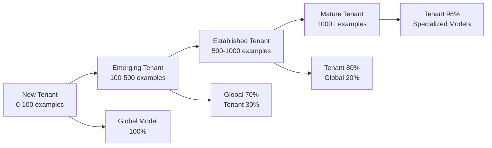

# CAIS Adaptive Learning Architecture

**Date:** January 2025  
**Status:** 📋 **TARGET ARCHITECTURE** - Comprehensive adaptive learning system for CAIS  
**Version:** 1.0

---

## Executive Summary

The CAIS Adaptive Learning Architecture implements a **zero-hardcoding philosophy** where all thresholds, weights, and parameters are learned from data and continuously adapted. This document describes how the system transitions from hardcoded defaults to fully learned parameters, ensuring safety, transparency, and continuous improvement.

**Key Principle**: Start with sensible defaults, learn from usage, validate before applying, always maintain fallback.

---

## Core Philosophy: Zero Hardcoding

### Principles

1. **Learned from Data**: Every threshold, weight, and parameter learned from tenant-specific usage
2. **Automatically Adapted**: System adjusts based on performance feedback
3. **Continuously Optimized**: Active monitoring and improvement
4. **Tenant-Isolated**: Each tenant gets their own learned parameters
5. **Transparent**: Users can see what was learned and why
6. **Safe**: Always have working fallback, validate before applying

---

## Adaptive Learning Progression

### Learning Stages



### Stage 1: New Tenant (0-100 examples)

**Configuration**:
- Use global model (trained on all tenants)
- Collect tenant-specific data
- Learn tenant parameters in background (not applied)

**Weight Distribution**:
- Global model: 100%
- Tenant-specific: 0% (learning only)

**Rationale**: New tenants get value immediately from global model. System collects data to learn tenant-specific patterns.

---

### Stage 2: Emerging Tenant (100-500 examples)

**Configuration**:
- Blend global (70%) + tenant (30%)
- Test if tenant-specific adds value
- Increase tenant weight gradually

**Weight Distribution**:
- Global model: 70%
- Tenant-specific: 30%
- Learning confidence: Medium

**Validation**: Compare tenant-specific vs. global performance. If tenant-specific is significantly better (>5%), increase weight.

---

### Stage 3: Established Tenant (500-1000 examples)

**Configuration**:
- Primarily tenant-specific (80%)
- Global as fallback/regularization (20%)
- Tenant model well-calibrated

**Weight Distribution**:
- Tenant-specific: 80%
- Global model: 20% (fallback/regularization)
- Learning confidence: High

**Specialization**: Can create industry-specific or deal-size-specific sub-models if data sufficient.

---

### Stage 4: Mature Tenant (1000+ examples)

**Configuration**:
- Fully tenant-specific (95%)
- Specialized sub-models (by industry, deal size, stage)
- Global only for rare edge cases (5%)

**Weight Distribution**:
- Tenant-specific: 95%
- Specialized sub-models: Used when applicable
- Global model: 5% (edge cases only)
- Learning confidence: Very High

**Advanced Features**: Can enable advanced adaptive features (episodic learning, counterfactuals, etc.).

---

## Gradual Learning Curve

### Parameter Weight Transition

```typescript
interface LearningProgression {
  examples: number;
  learnedWeight: number;      // 0.0 to 1.0
  defaultWeight: number;       // 1.0 to 0.0
  confidence: 'low' | 'medium' | 'high' | 'very_high';
  validationRequired: boolean;
}

const LEARNING_CURVE: LearningProgression[] = [
  { examples: 0, learnedWeight: 0.0, defaultWeight: 1.0, confidence: 'low', validationRequired: true },
  { examples: 50, learnedWeight: 0.0, defaultWeight: 1.0, confidence: 'low', validationRequired: true },
  { examples: 100, learnedWeight: 0.1, defaultWeight: 0.9, confidence: 'low', validationRequired: true },
  { examples: 250, learnedWeight: 0.3, defaultWeight: 0.7, confidence: 'medium', validationRequired: true },
  { examples: 500, learnedWeight: 0.5, defaultWeight: 0.5, confidence: 'medium', validationRequired: true },
  { examples: 750, learnedWeight: 0.7, defaultWeight: 0.3, confidence: 'high', validationRequired: false },
  { examples: 1000, learnedWeight: 0.8, defaultWeight: 0.2, confidence: 'high', validationRequired: false },
  { examples: 2000, learnedWeight: 0.95, defaultWeight: 0.05, confidence: 'very_high', validationRequired: false },
];
```

### Implementation

```typescript
function getParameterWeight(
  tenantId: string,
  parameterType: string,
  examples: number
): { learned: number; default: number; confidence: string } {
  const stage = LEARNING_CURVE.find(s => examples >= s.examples) || LEARNING_CURVE[LEARNING_CURVE.length - 1];
  
  // Adjust for high-value tenants (learn faster)
  const tenantValue = await getTenantValue(tenantId);
  const adjustment = tenantValue === 'high' ? 0.1 : 0;
  
  return {
    learned: Math.min(1.0, stage.learnedWeight + adjustment),
    default: Math.max(0.0, stage.defaultWeight - adjustment),
    confidence: stage.confidence,
  };
}
```

---

## Phase 1: Foundational Adaptive Learning (Weeks 1-8)

### 1.1 Self-Learning Component Weighting

**Service**: `AdaptiveWeightLearningService`

**Purpose**: Learn optimal weights for AI components (ML, Rules, LLM, Historical) per tenant and context.

**Implementation**:

```typescript
interface ComponentWeightLearning {
  tenantId: string;
  context: {
    industry?: string;
    dealSize?: 'small' | 'medium' | 'large';
    stage?: string;
    timeOfYear?: string;
  };
  
  // Current weights (learned + default blend)
  weights: {
    ml: number;           // 0.0 to 1.0
    rules: number;        // 0.0 to 1.0
    llm: number;          // 0.0 to 1.0
    historical: number;   // 0.0 to 1.0
  };
  
  // Learning state
  examples: number;
  learnedWeights: {
    ml: number;
    rules: number;
    llm: number;
    historical: number;
  };
  defaultWeights: {
    ml: number;      // 0.9 (from Q3.1.2)
    rules: number;   // 1.0
    llm: number;     // 0.8
    historical: number; // 0.9
  };
  
  // Performance tracking
  performance: {
    learnedAccuracy: number;
    defaultAccuracy: number;
    improvement: number;  // % improvement vs. defaults
  };
  
  // Validation
  validated: boolean;
  validationDate?: Date;
  lastUpdated: Date;
}
```

**Learning Algorithm**: Multi-armed bandit

```typescript
class AdaptiveWeightLearningService {
  /**
   * Learn optimal weights from prediction outcomes
   */
  async learnFromOutcome(
    tenantId: string,
    context: Context,
    prediction: {
      mlScore: number;
      rulesScore: number;
      llmScore: number;
      historicalScore: number;
      finalScore: number;
      actualOutcome: 'won' | 'lost' | 'in_progress';
    }
  ): Promise<void> {
    // Track which component was most accurate
    const componentAccuracy = this.calculateComponentAccuracy(prediction);
    
    // Update weight estimates using multi-armed bandit
    const weights = await this.getWeights(tenantId, context);
    const updatedWeights = this.updateWeights(
      weights,
      componentAccuracy,
      this.getLearningRate(weights.examples)
    );
    
    // Store learned weights (not applied until validated)
    await this.storeLearnedWeights(tenantId, context, updatedWeights);
    
    // Validate if enough examples
    if (weights.examples >= 100 && !weights.validated) {
      await this.validateWeights(tenantId, context, updatedWeights);
    }
  }
  
  /**
   * Get current weights (blend of learned + default)
   */
  async getWeights(
    tenantId: string,
    context: Context
  ): Promise<ComponentWeightLearning> {
    const learned = await this.getLearnedWeights(tenantId, context);
    const progression = getParameterWeight(tenantId, 'component_weights', learned.examples);
    
    return {
      ...learned,
      weights: {
        ml: blend(learned.learnedWeights.ml, learned.defaultWeights.ml, progression),
        rules: blend(learned.learnedWeights.rules, learned.defaultWeights.rules, progression),
        llm: blend(learned.learnedWeights.llm, learned.defaultWeights.llm, progression),
        historical: blend(learned.learnedWeights.historical, learned.defaultWeights.historical, progression),
      },
    };
  }
}
```

**Integration Points**:
- `RiskEvaluationService`: Use learned weights for ensemble
- `RecommendationsService`: Use learned weights for multi-factor scoring
- `ForecastingService`: Use learned weights for forecast combination

---

### 1.2 Adaptive Model Selection

**Service**: `AdaptiveModelSelectionService`

**Purpose**: Learn optimal model selection criteria and automatically graduate from global → industry → tenant models.

**Implementation**:

```typescript
interface ModelSelectionLearning {
  tenantId: string;
  modelType: 'risk_scoring' | 'forecasting' | 'recommendations';
  
  // Available models
  models: {
    global: ModelMetadata;
    industry?: ModelMetadata;
    tenant?: ModelMetadata;
    specialized?: ModelMetadata[];  // By deal size, stage, etc.
  };
  
  // Selection criteria (learned)
  selectionCriteria: {
    dataSufficiency: number;        // Learned threshold (not hardcoded 3000)
    performanceImprovement: number;  // Learned threshold (not hardcoded 5%)
    dataQuality: number;            // Learned threshold
    uncertaintyLevel: number;       // Learned threshold
  };
  
  // Performance tracking
  performance: {
    globalModelAccuracy: number;
    industryModelAccuracy?: number;
    tenantModelAccuracy?: number;
    bestModel: 'global' | 'industry' | 'tenant' | 'specialized';
  };
  
  // Auto-graduation state
  graduationState: {
    stage: 'global' | 'industry' | 'tenant' | 'specialized';
    examples: number;
    readyForGraduation: boolean;
    graduationTest?: {
      newModelAccuracy: number;
      currentModelAccuracy: number;
      improvement: number;
      statisticallySignificant: boolean;
    };
  };
}
```

**Learning Algorithm**: Statistical significance testing + performance tracking

```typescript
class AdaptiveModelSelectionService {
  /**
   * Select best model for prediction
   */
  async selectModel(
    tenantId: string,
    modelType: ModelType,
    context: Context
  ): Promise<ModelMetadata> {
    const learning = await this.getModelSelectionLearning(tenantId, modelType);
    
    // Check if specialized model available and better
    if (context.industry && learning.models.industry) {
      const industryBetter = await this.isModelBetter(
        learning.models.industry,
        learning.models.global,
        learning.selectionCriteria
      );
      if (industryBetter) {
        return learning.models.industry;
      }
    }
    
    // Check if tenant model available and better
    if (learning.models.tenant) {
      const tenantBetter = await this.isModelBetter(
        learning.models.tenant,
        learning.models.global,
        learning.selectionCriteria
      );
      if (tenantBetter) {
        return learning.models.tenant;
      }
    }
    
    // Fall back to global
    return learning.models.global;
  }
  
  /**
   * Learn selection criteria from performance
   */
  async learnSelectionCriteria(
    tenantId: string,
    modelType: ModelType,
    performance: {
      globalAccuracy: number;
      specializedAccuracy: number;
      examples: number;
    }
  ): Promise<void> {
    // Learn what data sufficiency threshold works
    // Learn what performance improvement threshold is meaningful
    // Adapt thresholds based on actual outcomes
  }
  
  /**
   * Auto-graduation: Test if specialized model is ready
   */
  async checkGraduation(
    tenantId: string,
    modelType: ModelType,
    specialization: 'industry' | 'tenant' | 'deal_size' | 'stage'
  ): Promise<GraduationDecision> {
    const learning = await this.getModelSelectionLearning(tenantId, modelType);
    
    // Check data sufficiency (learned threshold)
    if (learning.graduationState.examples < learning.selectionCriteria.dataSufficiency) {
      return { ready: false, reason: 'insufficient_data' };
    }
    
    // Train candidate model
    const candidateModel = await this.trainSpecializedModel(tenantId, modelType, specialization);
    
    // Compare performance
    const comparison = await this.compareModels(
      candidateModel,
      learning.models.global,
      learning.selectionCriteria
    );
    
    if (comparison.statisticallySignificant && comparison.improvement > learning.selectionCriteria.performanceImprovement) {
      return {
        ready: true,
        newModel: candidateModel,
        improvement: comparison.improvement,
      };
    }
    
    return { ready: false, reason: 'insufficient_improvement' };
  }
}
```

**Integration Points**:
- `ModelService`: Use adaptive model selection
- `TrainingService`: Trigger auto-graduation checks
- `EvaluationService`: Track model performance for selection learning

---

### 1.3 Multi-Signal Feedback Learning

**Service**: Extended `FeedbackLearningService` + `SignalWeightingService`

**Purpose**: Learn from every user interaction (explicit + implicit signals) and adapt signal weights.

**Implementation**:

```typescript
interface MultiSignalLearning {
  tenantId: string;
  userId?: string;  // Optional: per-user learning
  
  // Signal types
  signals: {
    explicit: {
      userRatings: SignalWeight;
      corrections: SignalWeight;
      approvals: SignalWeight;
      rejections: SignalWeight;
    };
    implicit: {
      timeSpent: SignalWeight;
      actionsTaken: SignalWeight;
      recommendationsFollowed: SignalWeight;
      dismissals: SignalWeight;
      engagementLevel: SignalWeight;
    };
    outcome: {
      actualResults: SignalWeight;
      forecastAccuracy: SignalWeight;
      riskPredictionAccuracy: SignalWeight;
    };
    behavioral: {
      featuresUsed: SignalWeight;
      featuresIgnored: SignalWeight;
      workflowPatterns: SignalWeight;
    };
  };
  
  // User expertise tracking
  userExpertise: {
    [userId: string]: {
      domainKnowledge: number;  // 0.0 to 1.0
      historicalAccuracy: number;
      reliabilityScore: number;
      expertiseLevel: 'novice' | 'intermediate' | 'expert';
    };
  };
  
  // Signal reliability
  signalReliability: {
    [signalType: string]: {
      predictivePower: number;
      consistency: number;
      recency: number;
      overallWeight: number;
    };
  };
}
```

**Learning Algorithm**: Weighted signal combination with reliability scoring

```typescript
class SignalWeightingService {
  /**
   * Learn optimal signal weights from outcomes
   */
  async learnSignalWeights(
    tenantId: string,
    signals: SignalCollection,
    outcome: PredictionOutcome
  ): Promise<void> {
    // Calculate which signals were most predictive
    const signalAccuracy = this.calculateSignalAccuracy(signals, outcome);
    
    // Update signal weights
    const currentWeights = await this.getSignalWeights(tenantId);
    const updatedWeights = this.updateWeights(
      currentWeights,
      signalAccuracy,
      this.getLearningRate(currentWeights.examples)
    );
    
    // Adjust for user expertise
    if (signals.userId) {
      const userExpertise = await this.getUserExpertise(tenantId, signals.userId);
      updatedWeights = this.adjustForExpertise(updatedWeights, userExpertise);
    }
    
    await this.storeSignalWeights(tenantId, updatedWeights);
  }
  
  /**
   * Combine signals with learned weights
   */
  async combineSignals(
    tenantId: string,
    signals: SignalCollection
  ): Promise<CombinedFeedback> {
    const weights = await this.getSignalWeights(tenantId);
    
    // Weight each signal by its learned reliability
    const weightedSignals = Object.entries(signals).map(([type, value]) => ({
      type,
      value,
      weight: weights.signalReliability[type]?.overallWeight || 0.5,
    }));
    
    // Combine weighted signals
    return this.combineWeightedSignals(weightedSignals);
  }
}
```

**Integration Points**:
- `FeedbackLearningService`: Collect implicit signals
- `RecommendationsService`: Use signal weights for feedback learning
- `RiskEvaluationService`: Use signal weights for risk feedback

---

### 1.4 Context-Aware Feature Engineering

**Service**: `AdaptiveFeatureEngineeringService`

**Purpose**: Adapt which features are extracted and how they're computed based on context.

**Implementation**:

```typescript
interface FeatureEngineeringLearning {
  tenantId: string;
  context: {
    industry?: string;
    dealSize?: 'small' | 'medium' | 'large';
    stage?: string;
  };
  
  // Feature sets (learned per context)
  featureSets: {
    [contextKey: string]: {
      features: string[];
      importance: Record<string, number>;
      computationMethods: Record<string, 'mean' | 'median' | 'mode' | 'custom'>;
      timeWindows: Record<string, number>;  // Learned optimal time windows
    };
  };
  
  // Feature discovery
  discoveredFeatures: {
    combinations: Array<{
      features: string[];
      importance: number;
      discoveredAt: Date;
    }>;
    tenantSpecific: Array<{
      name: string;
      computation: string;
      importance: number;
    }>;
  };
}
```

**Learning Algorithm**: Feature importance analysis + automatic feature discovery

```typescript
class AdaptiveFeatureEngineeringService {
  /**
   * Get context-appropriate feature set
   */
  async getFeatures(
    tenantId: string,
    opportunity: Opportunity,
    context: Context
  ): Promise<FeatureVector> {
    const learning = await this.getFeatureLearning(tenantId, context);
    
    // Get feature set for this context
    const contextKey = this.getContextKey(context);
    const featureSet = learning.featureSets[contextKey] || learning.featureSets['default'];
    
    // Extract features with learned methods
    const features: FeatureVector = {};
    for (const featureName of featureSet.features) {
      const method = featureSet.computationMethods[featureName];
      const timeWindow = featureSet.timeWindows[featureName];
      features[featureName] = await this.extractFeature(
        opportunity,
        featureName,
        method,
        timeWindow
      );
    }
    
    // Add discovered tenant-specific features
    for (const discovered of learning.discoveredFeatures.tenantSpecific) {
      if (discovered.importance > 0.1) {  // Learned threshold
        features[discovered.name] = await this.computeDiscoveredFeature(
          opportunity,
          discovered.computation
        );
      }
    }
    
    return features;
  }
  
  /**
   * Learn feature importance from model performance
   */
  async learnFeatureImportance(
    tenantId: string,
    context: Context,
    modelPerformance: {
      features: FeatureVector;
      prediction: number;
      actualOutcome: 'won' | 'lost';
      modelType: ModelType;
    }
  ): Promise<void> {
    // Use SHAP values or feature importance from model
    const importance = await this.calculateFeatureImportance(modelPerformance);
    
    // Update learned importance
    const learning = await this.getFeatureLearning(tenantId, context);
    const contextKey = this.getContextKey(context);
    
    learning.featureSets[contextKey] = {
      ...learning.featureSets[contextKey],
      importance: this.updateImportance(
        learning.featureSets[contextKey]?.importance || {},
        importance
      ),
    };
    
    await this.storeFeatureLearning(tenantId, learning);
  }
  
  /**
   * Discover useful feature combinations
   */
  async discoverFeatureCombinations(
    tenantId: string,
    examples: Array<{
      features: FeatureVector;
      outcome: 'won' | 'lost';
    }>
  ): Promise<DiscoveredFeature[]> {
    // Use feature interaction analysis
    // Discover combinations that improve prediction
    // Learn optimal time windows for temporal features
    // Create tenant-specific derived features
  }
}
```

**Integration Points**:
- `FeatureStoreService`: Use adaptive feature engineering
- `ModelService`: Provide feature importance for learning
- `TrainingService`: Use learned feature sets for training

---

## Phase 2: Adaptive Intelligence (Weeks 9-16)

### 2.1 Meta-Learning

**Service**: `MetaLearningService`

**Purpose**: Learn which component to trust when, based on context and historical performance.

**Implementation**:

```typescript
interface MetaLearning {
  tenantId: string;
  
  // Component trust scores per context
  trustScores: {
    [contextKey: string]: {
      ml: number;
      rules: number;
      llm: number;
      historical: number;
    };
  };
  
  // Uncertainty-based routing
  uncertaintyRouting: {
    lowUncertainty: 'use_best_component';
    mediumUncertainty: 'use_ensemble';
    highUncertainty: 'escalate_to_human';
  };
  
  // Learned thresholds
  uncertaintyThresholds: {
    low: number;    // Learned, not hardcoded
    medium: number;
    high: number;
  };
}
```

---

### 2.2 Active Learning

**Service**: `ActiveLearningService`

**Purpose**: Intelligently request feedback on examples that will most improve the model.

**Implementation**:

```typescript
interface ActiveLearning {
  tenantId: string;
  
  // Query strategies (learned per tenant)
  queryStrategy: 'uncertainty' | 'representative' | 'impact' | 'diversity';
  
  // Sampling configuration
  sampling: {
    rate: number;  // Learned optimal frequency
    priority: 'high_value' | 'diverse' | 'uncertain';
    maxRequestsPerDay: number;  // Learned user tolerance
  };
  
  // Query effectiveness
  effectiveness: {
    responseRate: number;
    qualityScore: number;
    improvementContribution: number;
  };
}
```

---

### 2.3 Feedback Quality Scoring

**Service**: `FeedbackQualityService`

**Purpose**: Assess feedback quality and adjust its influence on model training.

**Implementation**:

```typescript
interface FeedbackQuality {
  feedbackId: string;
  tenantId: string;
  userId: string;
  
  // Quality dimensions
  quality: {
    consistency: number;    // Aligns with similar examples?
    expertise: number;      // User's domain knowledge
    timeliness: number;     // How soon after prediction?
    completeness: number;  // How thorough?
    confidence: number;     // How certain is user?
  };
  
  // Overall quality score
  qualityScore: number;  // 0.0 to 1.0
  
  // Influence on training
  trainingWeight: number;  // Adjusted based on quality
  
  // User reliability
  userReliability: {
    historicalAccuracy: number;
    biasDetected: boolean;
    expertiseLevel: 'novice' | 'intermediate' | 'expert';
  };
}
```

---

### 2.4 Episodic Learning

**Service**: `EpisodicMemoryService`

**Purpose**: Learn from notable past events and apply those lessons to similar future situations.

**Implementation**:

```typescript
interface EpisodicMemory {
  episodeId: string;
  tenantId: string;
  
  // Episode identification
  significance: 'big_win' | 'surprising_loss' | 'near_miss' | 'critical_intervention';
  significanceScore: number;
  
  // Full context capture
  context: {
    opportunity: OpportunitySnapshot;
    stakeholders: StakeholderSnapshot[];
    timeline: EventTimeline;
    interventions: Intervention[];
    outcome: 'won' | 'lost' | 'in_progress';
  };
  
  // Extracted lessons
  lessons: {
    successFactors: string[];
    failureFactors: string[];
    keyDecisions: Array<{
      decision: string;
      impact: 'positive' | 'negative' | 'neutral';
      confidence: number;
    }>;
  };
  
  // Generalization
  applicableContexts: string[];  // When this episode is relevant
  similarityPatterns: string[];  // What makes opportunities similar
}
```

---

### 2.5 Counterfactual Generation

**Service**: `CounterfactualService`

**Purpose**: Generate realistic "what-if" scenarios that are actionable for each tenant.

**Implementation**:

```typescript
interface Counterfactual {
  opportunityId: string;
  tenantId: string;
  
  // Current state
  currentState: OpportunityState;
  currentPrediction: {
    winProbability: number;
    riskScore: number;
    forecast: number;
  };
  
  // Counterfactual scenarios
  scenarios: Array<{
    changes: Array<{
      feature: string;
      currentValue: any;
      proposedValue: any;
      feasibility: number;  // 0.0 to 1.0 (learned)
      effort: 'low' | 'medium' | 'high';
      timeline: number;  // days (learned)
    }>;
    expectedOutcome: {
      winProbability: number;
      riskScore: number;
      forecast: number;
      improvement: number;
    };
    actionPlan: Array<{
      action: string;
      priority: number;
      sequence: number;
      resources: string[];
    }>;
    validation: {
      tested: boolean;
      actualImprovement?: number;
    };
  }>;
}
```

---

### 2.6 Auto-Tuning System

**Service**: `AutoTuningService`

**Purpose**: Continuously optimizes all system parameters without manual intervention.

**Implementation**:

```typescript
interface AutoTuning {
  tenantId: string;
  parameterType: 'hyperparameters' | 'weights' | 'thresholds' | 'cache_ttl';
  
  // Current parameters
  currentParameters: Record<string, any>;
  
  // Optimization state
  optimization: {
    method: 'multi_armed_bandit' | 'bayesian' | 'gradient' | 'grid_search';
    explorationRate: number;  // Learned
    exploitationRate: number;  // Learned
    bestParameters: Record<string, any>;
    bestPerformance: number;
  };
  
  // A/B testing
  abTests: Array<{
    parameterSet: Record<string, any>;
    traffic: number;  // % of requests
    performance: number;
    confidence: number;
  }>;
  
  // Rollback capability
  rollbackHistory: Array<{
    parameters: Record<string, any>;
    performance: number;
    date: Date;
  }>;
}
```

---

## Phase 3: Autonomous Intelligence (Weeks 17+)

### 3.1 Reinforcement Learning

**Service**: `ReinforcementLearningService`

**Purpose**: Learn optimal sequential decision-making (actions over time).

**Implementation**:

```typescript
interface ReinforcementLearning {
  tenantId: string;
  
  // State space
  states: {
    opportunityState: OpportunityState;
    relationshipState: RelationshipState;
    competitiveState: CompetitiveState;
  };
  
  // Action space
  actions: {
    engagement: EngagementAction[];
    content: ContentAction[];
    strategic: StrategicAction[];
  };
  
  // Policy (learned)
  policy: {
    [stateKey: string]: {
      action: string;
      confidence: number;
      expectedReward: number;
    };
  };
  
  // Reward function (learned)
  rewards: {
    win: number;
    riskReduction: number;
    relationshipImprovement: number;
    timeEfficiency: number;
  };
}
```

---

### 3.2 Advanced Multi-Task Learning

**Service**: `MultiTaskLearningService`

**Purpose**: Learn multiple related tasks simultaneously (risk, forecast, recommendations).

**Implementation**:

```typescript
interface MultiTaskLearning {
  tenantId: string;
  
  // Shared representation
  sharedLayers: {
    featureExtraction: NeuralNetwork;
    contextEncoding: NeuralNetwork;
  };
  
  // Task-specific heads
  taskHeads: {
    riskScoring: NeuralNetwork;
    forecasting: NeuralNetwork;
    recommendations: NeuralNetwork;
  };
  
  // Task relationships (learned)
  taskRelationships: {
    riskToForecast: number;  // How much risk affects forecast
    forecastToRecommendations: number;
    riskToRecommendations: number;
  };
}
```

---

## Parameter Storage Architecture

### Hybrid Storage Strategy

```typescript
// System Parameters (Cosmos DB)
interface SystemParameters {
  id: string;
  tenantId: string;
  parameterType: 'weights' | 'thresholds' | 'configurations';
  parameters: {
    componentWeights: {
      ml: number;
      rules: number;
      llm: number;
      historical: number;
    };
    riskThresholds: {
      critical: number;
      high: number;
      medium: number;
    };
    forecastQuantiles: {
      p10: number;
      p50: number;
      p90: number;
    };
  };
  learnedFrom: number;  // How many examples
  lastUpdated: Date;
  performance: {
    accuracy: number;
    vsBaseline: number;  // % improvement
  };
  version: string;
  validated: boolean;
}

// Model Parameters (Azure ML)
interface ModelParameters {
  modelId: string;
  tenantId: string;
  modelType: 'xgboost' | 'lightgbm' | 'neural_net';
  hyperparameters: Record<string, any>;
  weights: BinaryBlob;  // Model weights
  metrics: {
    accuracy: number;
    calibration: number;
    [key: string]: number;
  };
  registeredDate: Date;
  version: string;
}

// Runtime Cache (Redis)
interface RuntimeCache {
  key: `learned_params:${tenantId}:${contextKey}`;
  value: {
    weights: ComponentWeights;
    thresholds: Thresholds;
    lastUpdated: Date;
  };
  ttl: 'until_update_event';  // Event-based invalidation
}

// Learning History (Azure Blob Archive)
interface LearningHistory {
  tenantId: string;
  timestamp: Date;
  parameterSnapshot: SystemParameters;
  performance: {
    metrics: Record<string, number>;
    vsBaseline: number;
  };
  dataVolume: number;
  examples: number;
}
```

---

## User Control & Transparency

### Adaptive Learning Dashboard

```typescript
interface AdaptiveLearningDashboard {
  tenantId: string;
  
  // Component Weights
  componentWeights: {
    ml: {
      current: number;
      learned: number;
      default: number;
      performance: number;
      editable: boolean;
    };
    rules: { /* same */ };
    llm: { /* same */ };
    historical: { /* same */ };
  };
  
  // Performance Comparison
  performance: {
    learnedAccuracy: number;
    defaultAccuracy: number;
    improvement: number;
    confidence: string;
  };
  
  // Learning Status
  learningStatus: {
    examples: number;
    stage: 'new' | 'emerging' | 'established' | 'mature';
    learningRate: number;
    validated: boolean;
  };
  
  // Controls
  controls: {
    resetToDefaults: boolean;
    trustSystem: boolean;
    overrideParameters: boolean;
    approvalMode: boolean;
  };
}
```

---

## Migration Path: Hardcoded → Learned

### Week 1-4: Data Collection Phase

**Actions**:
- Use hardcoded defaults for all parameters
- Collect prediction outcomes and user feedback
- Track component performance
- Build learning datasets

**No Learning Applied**: System collects data but doesn't change parameters.

---

### Week 5-8: Learning & Validation Phase

**Actions**:
- Begin learning parameters in background
- Compare learned vs. default performance
- Validate learned parameters (statistical significance)
- Prepare for gradual rollout

**Learning Applied**: System learns but doesn't use learned parameters yet (validation only).

---

### Week 9+: Gradual Rollout Phase

**Actions**:
- Start applying learned parameters (10% weight)
- Monitor performance closely
- Gradually increase learned weight (10% → 30% → 50% → 80% → 95%)
- Maintain default fallback

**Learning Applied**: System uses learned parameters with default fallback.

---

## Integration with Existing Services

### RiskEvaluationService Integration

```typescript
// Before (hardcoded)
const weights = {
  ml: 0.9,
  rules: 1.0,
  llm: 0.8,
  historical: 0.9,
};

// After (adaptive)
const weights = await adaptiveWeightLearningService.getWeights(
  tenantId,
  { industry, dealSize, stage }
);
```

### RecommendationsService Integration

```typescript
// Before (hardcoded)
const algorithmConfig = {
  vectorSearchWeight: 0.5,
  collaborativeWeight: 0.3,
  temporalWeight: 0.2,
};

// After (adaptive)
const algorithmConfig = await adaptiveWeightLearningService.getRecommendationWeights(
  tenantId,
  { projectId, userId, timeOfDay }
);
```

---

## Success Metrics

### Learning Effectiveness

- **Weight Learning Accuracy**: Learned weights outperform defaults by >5%
- **Model Selection Accuracy**: Adaptive selection improves prediction accuracy by >3%
- **Feature Engineering**: Learned features improve model performance by >2%
- **Signal Quality**: Multi-signal learning improves feedback quality by >10%

### System Performance

- **Prediction Accuracy**: Continuous improvement over time
- **User Satisfaction**: >4.0/5.0 rating
- **Adoption Rate**: >80% of tenants using learned parameters
- **Rollback Rate**: <5% of learned parameters need rollback

---

## Next Steps

1. **Implement Phase 1 Services**: AdaptiveWeightLearningService, AdaptiveModelSelectionService, SignalWeightingService, AdaptiveFeatureEngineeringService
2. **Update Existing Services**: Integrate adaptive learning into RiskEvaluationService, RecommendationsService, ForecastingService
3. **Create Learning Infrastructure**: Parameter storage, validation framework, rollback mechanisms
4. **Build Transparency Dashboard**: User-facing controls and visibility
5. **Implement Phase 2 Services**: Meta-learning, active learning, episodic memory, counterfactuals, auto-tuning

---

**Document Status:** Adaptive Learning Architecture Defined  
**Last Updated:** January 2025  
**Next Review:** After Phase 1 implementation
