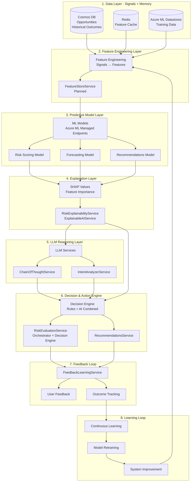
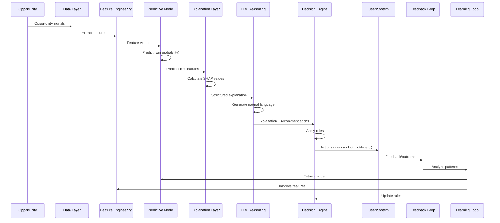

# Compound AI System (CAIS) Architecture

**Date:** January 2025  
**Status:** 📋 **TARGET ARCHITECTURE** - Documenting both current state and planned ML integration  
**Version:** 1.0

---

## Executive Summary

The Castiel AI system is architected as a **Compound AI System (CAIS)**—a system composed of multiple AI components working together in a decision loop. Unlike a single ML model, CAIS orchestrates **predictive ML models**, **LLMs for reasoning**, **rules/heuristics**, **memory/historical data**, **feedback loops**, and **tools** to deliver explainable, actionable, continuously improving decisions for sales opportunity intelligence.

**Key Distinction:**
- **ML Model**: Learns patterns from signals, makes predictions
- **CAIS**: Orchestrates ML + LLM + Rules + Memory + Feedback to turn predictions into explainable, actionable decisions

---

## What is a Compound AI System (CAIS)?

A Compound AI System is **not a single model**. It is a system architecture that orchestrates multiple AI components:

1. **Predictive ML Models** - Learn patterns from historical data (win probability, risk scores)
2. **Rules / Heuristics** - Deterministic business logic and constraints
3. **LLMs** - Reasoning, explanation, natural language generation
4. **Memory / Historical Data** - Past outcomes, patterns, context
5. **Feedback Loops** - User feedback, outcome tracking, continuous improvement
6. **Tools** - CRM integrations, email, calendar, analytics

All working together in a **decision loop**: Prediction → Reasoning → Action → Feedback → Learning

---

## Why CAIS Fits Sales Opportunity Intelligence

Sales opportunity intelligence is particularly well-suited for CAIS because it is:

- **Non-stationary**: Markets change, customer behavior evolves, competitive landscapes shift
- **Partially structured**: Mix of structured data (amount, stage) and unstructured data (emails, notes)
- **Human-in-the-loop**: Sales reps need to understand and act on recommendations
- **Action-oriented**: Not just prediction—the system must recommend actions and take actions

CAIS excels when:
- **ML predicts** (win probability, risk scores)
- **LLM explains** (why the prediction, what to do next)
- **Rules constrain** (business policies, guardrails)
- **Humans decide** (approve actions, provide feedback)
- **System learns** (improves from outcomes)

---

## CAIS Architecture Layers

The Castiel CAIS is organized into eight distinct layers, each with clear responsibilities:



---

## Layer 1: Data Layer (Signals + Memory)

**Purpose**: Store and retrieve opportunity signals, historical outcomes, and training data.

### Current Implementation

- **Cosmos DB**: Primary data store for opportunities, accounts, contacts, and related entities
- **Redis**: Feature caching and prediction caching
- **Azure ML Datastores**: Training data exports (planned)

### Key Data Sources

**Opportunity Signals:**
- Deal attributes: `amount`, `probability`, `stage`, `closeDate`, `type`
- Deal velocity: Stage progression rate, time in each stage
- Owner performance: Historical win rate, average deal size
- Account data: Account health, relationship strength
- Activity metrics: Engagement level, stakeholder involvement, document activity
- Risk indicators: Detected risks, competitor presence, budget confirmation

**Historical Outcomes:**
- Closed won/lost opportunities
- Actual revenue realized
- Time to close
- Risk factors that materialized
- User feedback and corrections

### Storage Strategy

```pseudocode
// Data Layer Storage Pattern
DataLayer {
  // Signals (Current State)
  opportunities: CosmosDB {
    container: "shards"
    partitionKey: "tenantId"
    query: "SELECT * FROM shards WHERE shardTypeId = 'c_opportunity'"
  }
  
  // Memory (Historical)
  historicalOutcomes: CosmosDB {
    container: "shards"
    filter: "status IN ('won', 'lost') OR stage IN ('closed_won', 'closed_lost')"
  }
  
  // Feature Cache
  featureCache: Redis {
    key: "features:{tenantId}:{opportunityId}"
    ttl: 900 // 15 minutes
    invalidation: "on opportunity update"
  }
  
  // Training Data
  trainingData: AzureMLDatastore {
    versioned: true
    format: "parquet"
    sync: "weekly export from Cosmos DB"
  }
}
```

---

## Layer 2: Feature Engineering Layer

**Purpose**: Transform raw opportunity signals into machine-readable features.

**Critical Principle**: Never feed raw CRM objects directly to models. Always store explicit features.

### Current Implementation

- **Current**: Feature extraction in services (RiskEvaluationService, etc.)
- **Planned**: FeatureStoreService for centralized feature engineering

### Feature Categories

**1. Opportunity Features (Direct Signals)**
```pseudocode
OpportunityFeatures {
  // Numerical
  dealValue: number              // amount field
  expectedRevenue: number         // amount × (probability / 100)
  probability: number             // 0-100
  daysToClose: number            // days until closeDate
  daysSinceActivity: number       // days since lastActivityDate
  daysSinceCreated: number        // days since createdDate
  daysInCurrentStage: number      // days in current stage
  dealVelocity: number            // rate of stage progression
  
  // Categorical (encoded)
  stage: string                   // prospecting, qualification, etc.
  type: string                    // new_business, renewal, etc.
  industry: string                // from account
  currency: string                 // USD, EUR, etc.
  
  // Boolean
  hasCloseDate: boolean
  hasCompetitor: boolean          // competitorIds.length > 0
  budgetConfirmed: boolean        // from related shards/activities
  decisionMakerPresent: boolean   // from contact roles
}
```

**2. Risk Features (Derived from Risk Detection)**
```pseudocode
RiskFeatures {
  totalRisks: number
  highConfidenceRisks: number     // confidence > 0.7
  risksByCategory: Record<string, number>
  riskScore: number               // 0-1
  categoryScores: Record<string, number>
  maxCategoryScore: number
}
```

**3. Historical Features (Memory)**
```pseudocode
HistoricalFeatures {
  ownerWinRate: number            // owner's historical win rate
  ownerAvgDealSize: number
  accountWinRate: number          // account's historical win rate
  accountHealth: number           // 0-1
  industryWinRate: number
  stageWinRate: number
  similarDealsWinRate: number     // win rate of similar deals
}
```

**4. Relationship Features**
```pseudocode
RelationshipFeatures {
  stakeholderCount: number       // from contact roles
  activityCount: number          // emails, meetings, calls
  activityCountLast7Days: number
  activityCountLast30Days: number
  documentCount: number
  emailResponseRate: number      // response rate to emails
  meetingCount: number
}
```

**5. Temporal Features**
```pseudocode
TemporalFeatures {
  month: number                   // 1-12
  quarter: number                 // 1-4
  dayOfWeek: number               // 0-6
  isMonthEnd: boolean
  isQuarterEnd: boolean
  isYearEnd: boolean
  daysToCloseRatio: number        // daysToClose / daysSinceCreated
}
```

### Feature Engineering Process

```pseudocode
// Feature Engineering Flow
function extractFeatures(opportunityId, tenantId) {
  // 1. Load opportunity and related shards
  opportunity = loadOpportunity(opportunityId, tenantId)
  relatedShards = loadRelatedShards(opportunityId, tenantId)
  
  // 2. Extract opportunity features
  oppFeatures = extractOpportunityFeatures(opportunity)
  
  // 3. Extract risk features (if risk evaluation exists)
  riskSnapshot = loadRiskSnapshot(opportunityId, tenantId)
  riskFeatures = extractRiskFeatures(riskSnapshot)
  
  // 4. Extract historical features
  historicalData = loadHistoricalData(opportunity, tenantId)
  histFeatures = extractHistoricalFeatures(opportunity, historicalData)
  
  // 5. Extract relationship features
  relFeatures = extractRelationshipFeatures(relatedShards)
  
  // 6. Extract temporal features
  tempFeatures = extractTemporalFeatures(opportunity)
  
  // 7. Compute derived features
  derivedFeatures = computeDerivedFeatures(oppFeatures, riskFeatures)
  
  // 8. Combine all features
  return combineFeatures([
    oppFeatures,
    riskFeatures,
    histFeatures,
    relFeatures,
    tempFeatures,
    derivedFeatures
  ])
}
```

### Feature Versioning

Features are versioned to handle schema changes and prevent training/serving skew:

```pseudocode
Feature {
  featureName: string            // e.g., "dealValue"
  version: string                // e.g., "v1", "v2"
  source: string                 // "opportunity.amount"
  computationLogicHash: string  // hash of computation logic
  createdAt: Date
  deprecatedAt?: Date
}
```

---

## Layer 3: Predictive Model Layer

**Purpose**: ML models that learn patterns from signals and make predictions.

### Current Implementation

- **Current**: Rule-based heuristics for risk detection and probability calculation
- **Planned**: Azure ML Managed Endpoints with three global models:
  1. **Risk Scoring Model** (XGBoost/LightGBM) - Predicts risk scores (0-1)
  2. **Forecasting Model** (XGBoost/LightGBM) - Predicts revenue forecasts
  3. **Recommendations Model** (XGBoost Ranker) - Ranks recommendations

### Model Architecture

**Risk Scoring Model:**
```pseudocode
RiskScoringModel {
  input: FeatureVector {
    dealValue: number
    probability: number
    daysToClose: number
    riskScore: number              // from rule-based detection
    categoryScores: Record<string, number>
    ownerWinRate: number
    accountHealth: number
    // ... more features
  }
  
  output: {
    winProbability: number         // 0-1, predicted probability
    confidence: "high" | "medium" | "low"
  }
  
  modelType: "regression"
  algorithm: "XGBoost" | "LightGBM"
  training: "Azure ML AutoML"
}
```

**Forecasting Model:**
```pseudocode
ForecastingModel {
  input: FeatureVector {
    dealValue: number
    probability: number
    daysToClose: number
    industry: string
    stage: string
    historicalRevenue: number
    seasonality: number
    // ... more features
  }
  
  output: {
    pointForecast: number          // P50 forecast
    uncertainty: {
      p10: number                  // 10th percentile
      p50: number                  // 50th percentile (point forecast)
      p90: number                  // 90th percentile
    }
  }
  
  modelType: "regression" | "time_series"
  algorithm: "XGBoost" | "LightGBM"
  lossFunction: "quantile_loss"    // for uncertainty estimation
}
```

**Recommendations Model:**
```pseudocode
RecommendationsModel {
  input: FeatureVector {
    userId: string
    opportunityId: string
    userFeatures: Record<string, number>
    itemFeatures: Record<string, number>
    userItemInteractions: number
    contextFeatures: Record<string, number>
    // ... more features
  }
  
  output: {
    recommendationScore: number    // ranking score
    confidence: number
  }
  
  modelType: "ranking"
  algorithm: "XGBoost Ranker"
  metric: "NDCG@10"
}
```

### Model Inference Flow

```pseudocode
// Model Inference Pattern
async function predict(modelType, features, industryId) {
  // 1. Select model (global vs. industry-specific)
  model = selectModel(modelType, industryId)
  
  // 2. Call Azure ML Managed Endpoint
  response = await azureMLEndpoint.predict({
    endpointUrl: model.endpointUrl,
    features: features,
    modelVersion: model.version
  })
  
  // 3. Apply post-processing (calibration for risk scoring)
  if (modelType === "risk_scoring") {
    calibratedScore = applyCalibration(response.score, model.version)
    return { score: calibratedScore, confidence: response.confidence }
  }
  
  return response
}
```

---

## Layer 4: Explanation Layer (Model Interpretability)

**Purpose**: Explain ML model predictions using feature importance and SHAP values.

### Current Implementation

- **RiskExplainabilityService**: Provides structured explanations for risk detections
- **ExplainableAIService**: General explainability for AI responses
- **Planned**: SHAP integration for ML model interpretability

### Explanation Process

**Step 1: Calculate Feature Importance**
```pseudocode
// SHAP Value Calculation
function calculateSHAPValues(model, features, prediction) {
  shapValues = calculateSHAP(model, features)
  
  // Extract positive and negative factors
  positiveFactors = []
  negativeFactors = []
  
  for (feature, shapValue in shapValues) {
    if (shapValue > 0) {
      positiveFactors.push({
        feature: feature,
        impact: shapValue,
        contribution: shapValue / prediction
      })
    } else {
      negativeFactors.push({
        feature: feature,
        impact: shapValue,
        contribution: shapValue / prediction
      })
    }
  }
  
  return {
    positiveFactors: sortByImpact(positiveFactors),
    negativeFactors: sortByImpact(negativeFactors),
    overallImportance: calculateOverallImportance(shapValues)
  }
}
```

**Step 2: Structure Explanation**
```pseudocode
// Structured Explanation Output
ExplanationOutput {
  prediction: number              // e.g., 0.82 win probability
  confidence: "high" | "medium" | "low"
  
  positiveFactors: [
    {
      feature: "budgetConfirmed",
      impact: 0.21,               // +21% to prediction
      description: "Budget confirmed increases win probability"
    },
    {
      feature: "decisionMakerPresent",
      impact: 0.18,               // +18% to prediction
      description: "Decision maker involved increases win probability"
    }
  ],
  
  negativeFactors: [
    {
      feature: "competitorPresent",
      impact: -0.07,              // -7% to prediction
      description: "Competitor presence decreases win probability"
    }
  ],
  
  featureImportance: Record<string, number>  // All features ranked
}
```

**Step 3: Bridge to LLM Layer**
```pseudocode
// Explanation → LLM Prompt Construction
function buildLLMPrompt(explanation, opportunity) {
  return `
    You are a sales intelligence assistant.
    
    Prediction: ${explanation.prediction} win probability.
    
    Positive signals:
    ${explanation.positiveFactors.map(f => 
      `- ${f.description} (+${f.impact * 100}%)`
    ).join('\n')}
    
    Negative signals:
    ${explanation.negativeFactors.map(f => 
      `- ${f.description} (${f.impact * 100}%)`
    ).join('\n')}
    
    Opportunity context:
    - Deal value: ${opportunity.amount}
    - Stage: ${opportunity.stage}
    - Days to close: ${opportunity.daysToClose}
    
    Generate:
    1. A plain-language explanation
    2. Recommended next actions
    3. Risks to watch
  `
}
```

---

## Layer 5: LLM Reasoning Layer

**Purpose**: Transform numeric predictions and feature explanations into human-readable explanations, recommendations, and playbooks.

### Current Implementation

- **ChainOfThoughtService**: Multi-step reasoning for complex queries
- **IntentAnalyzerService**: Intent classification and entity extraction
- **Planned**: Enhanced with ML prediction context

### LLM Role in CAIS

**LLMs should NOT:**
- ❌ Replace predictive ML models
- ❌ Learn numeric patterns from scratch
- ❌ Make predictions without ML foundation

**LLMs should:**
- ✅ Interpret ML outputs
- ✅ Explain "why" in natural language
- ✅ Suggest next best actions
- ✅ Generate summaries, emails, playbooks
- ✅ Provide contextual reasoning

### LLM Reasoning Process

**Step 1: Receive ML Output + Explanation**
```pseudocode
// LLM Input
LLMInput {
  prediction: {
    winProbability: 0.82,
    confidence: "high"
  },
  
  explanation: {
    positiveFactors: [...],
    negativeFactors: [...]
  },
  
  context: {
    opportunity: {...},
    industry: "technology",
    dealSize: "large"
  }
}
```

**Step 2: Generate Natural Language Explanation**
```pseudocode
// LLM Reasoning (ChainOfThoughtService)
async function generateExplanation(llmInput) {
  reasoningSteps = []
  
  // Step 1: Analyze prediction
  analysis = await llm.analyze({
    prompt: buildAnalysisPrompt(llmInput),
    model: "gpt-4"
  })
  reasoningSteps.push(analysis)
  
  // Step 2: Generate explanation
  explanation = await llm.explain({
    prompt: buildExplanationPrompt(analysis, llmInput),
    model: "gpt-4"
  })
  reasoningSteps.push(explanation)
  
  // Step 3: Recommend actions
  recommendations = await llm.recommend({
    prompt: buildRecommendationPrompt(explanation, llmInput),
    model: "gpt-4"
  })
  reasoningSteps.push(recommendations)
  
  return {
    summary: explanation.summary,
    reasoning: explanation.detailed,
    recommendations: recommendations.actions,
    risks: recommendations.risks
  }
}
```

**Step 3: Output Human-Readable Result**
```pseudocode
// LLM Output Example
LLMOutput {
  explanation: `
    This opportunity has a high chance of closing (82% probability) because:
    
    1. Budget is confirmed - The buyer has confirmed budget availability,
       which historically increases win probability by 21%.
    
    2. Decision maker is involved - The key decision maker is directly
       engaged in the process, increasing win probability by 18%.
    
    However, there is a risk:
    - Competitor presence detected - A competitor is actively involved,
      which decreases win probability by 7%.
    
    Similar deals in this industry historically close within 20-25 days
    when these signals are present.
  `,
  
  recommendedActions: [
    {
      action: "Send proposal within 48 hours",
      priority: "high",
      reason: "Budget confirmed and decision maker engaged"
    },
    {
      action: "Schedule executive alignment call",
      priority: "medium",
      reason: "Strengthen relationship with decision maker"
    },
    {
      action: "Monitor competitor activity",
      priority: "high",
      reason: "Competitor presence detected"
    }
  ],
  
  risks: [
    {
      risk: "Competitor may undercut pricing",
      mitigation: "Emphasize value proposition and differentiation"
    }
  ]
}
```

---

## Layer 6: Decision & Action Engine

**Purpose**: Combine rules and AI outputs to make decisions and take actions.

### Current Implementation

- **RiskEvaluationService**: Orchestrates risk detection (rule-based + historical + AI) and makes decisions
- **RecommendationsService**: Generates and ranks recommendations
- **Planned**: Enhanced with ML predictions

### Decision Engine Architecture

**RiskEvaluationService as Orchestrator:**
```pseudocode
// Risk Detection Orchestration
async function detectRisks(opportunity, relatedShards, tenantId, userId) {
  detectedRisks = []
  
  // 1. Rule-based detection (fast, deterministic)
  ruleBasedRisks = await detectRisksByRules(opportunity, relatedShards)
  detectedRisks.push(...ruleBasedRisks)
  
  // 2. Historical pattern matching
  historicalRisks = await detectRisksByHistoricalPatterns(opportunity)
  detectedRisks.push(...historicalRisks)
  
  // 3. AI-powered detection (LLM)
  aiRisks = await detectRisksByAI(opportunity, relatedShards)
  detectedRisks.push(...aiRisks)
  
  // 4. ML prediction (planned)
  mlRiskScore = await predictMLRiskScore(opportunity)  // from Layer 3
  if (mlRiskScore > threshold) {
    mlRisks = await convertMLScoreToRisks(mlRiskScore, opportunity)
    detectedRisks.push(...mlRisks)
  }
  
  // 5. Merge and deduplicate risks
  mergedRisks = mergeRisks(detectedRisks)
  
  return mergedRisks
}
```

**Decision Rules:**
```pseudocode
// Decision Rules (Rules + AI Combined)
DecisionRules {
  // Rule 1: High win probability → Mark as Hot
  IF winProbability > 0.8 AND dealValue > threshold THEN
    action: "markAsHot"
    notify: ["salesManager"]
    recommend: "fastTrackPlaybook"
  
  // Rule 2: Low win probability + long duration → Flag for review
  IF winProbability < 0.3 AND daysOpen > 60 THEN
    action: "flagForReview"
    notify: ["opportunityOwner", "salesManager"]
    recommend: "recoveryPlaybook"
  
  // Rule 3: High risk score → Escalate
  IF riskScore > 0.7 THEN
    action: "escalate"
    notify: ["riskManager", "salesManager"]
    recommend: "riskMitigationPlaybook"
  
  // Rule 4: Budget confirmed + decision maker → Fast track
  IF budgetConfirmed AND decisionMakerPresent THEN
    action: "prioritize"
    recommend: "sendProposalWithin48h"
}
```

**Action Execution:**
```pseudocode
// Action Execution
async function executeActions(opportunity, decisions, llmOutput) {
  actions = []
  
  // 1. CRM updates
  if (decisions.markAsHot) {
    await updateOpportunity(opportunity.id, {
      rating: "hot",
      forecastCategory: "commit"
    })
    actions.push("marked_as_hot")
  }
  
  // 2. Notifications
  if (decisions.notify) {
    await sendNotifications(decisions.notify, {
      opportunity: opportunity,
      reason: llmOutput.explanation,
      actions: llmOutput.recommendedActions
    })
    actions.push("notifications_sent")
  }
  
  // 3. Task creation
  for (action in llmOutput.recommendedActions) {
    await createTask({
      opportunityId: opportunity.id,
      title: action.action,
      priority: action.priority,
      dueDate: calculateDueDate(action.priority)
    })
    actions.push(`task_created: ${action.action}`)
  }
  
  // 4. Email draft generation
  if (decisions.generateEmail) {
    emailDraft = await generateEmailDraft({
      opportunity: opportunity,
      context: llmOutput.explanation,
      recommendations: llmOutput.recommendedActions
    })
    actions.push("email_draft_generated")
  }
  
  return actions
}
```

---

## Layer 7: Feedback Loop

**Purpose**: Collect user feedback and outcome data to improve the system.

### Current Implementation

- **FeedbackLearningService**: Collects and analyzes user feedback on AI responses
- **Planned**: Extended for ML feedback collection

### Feedback Collection

**User Feedback Types:**
```pseudocode
FeedbackTypes {
  // Explicit feedback
  rating: number                 // 1-5 rating
  acknowledge: boolean            // User acknowledged prediction
  dismiss: boolean                // User dismissed prediction
  correct: boolean                // User corrected prediction
  
  // Implicit feedback
  actionTaken: string             // Action user took
  outcome: "won" | "lost" | null // Actual outcome (when available)
  
  // Context
  prediction: any                 // What was predicted
  actual: any                     // What actually happened
  modelVersion: string            // Model version that made prediction
}
```

**Feedback Flow:**
```pseudocode
// Feedback Collection Flow
async function collectFeedback(feedback) {
  // 1. Store feedback
  await feedbackLearningService.recordFeedback({
    type: feedback.type,
    rating: feedback.rating,
    prediction: feedback.prediction,
    actual: feedback.actual,
    modelVersion: feedback.modelVersion,
    timestamp: new Date()
  })
  
  // 2. Link to prediction
  await linkFeedbackToPrediction(feedback.predictionId, feedback.id)
  
  // 3. Update feedback statistics
  await updateFeedbackStats(feedback.modelVersion, feedback)
  
  // 4. Check if retraining needed
  if (await shouldTriggerRetraining(feedback.modelVersion)) {
    await triggerRetraining(feedback.modelVersion)
  }
}
```

**Outcome Tracking:**
```pseudocode
// Outcome Tracking
async function trackOutcome(opportunityId, outcome) {
  // 1. Store outcome
  await storeOutcome({
    opportunityId: opportunityId,
    outcome: outcome.status,      // "won" | "lost"
    actualRevenue: outcome.revenue,
    actualCloseDate: outcome.closeDate,
    timestamp: new Date()
  })
  
  // 2. Link to predictions
  predictions = await getPredictionsForOpportunity(opportunityId)
  for (prediction in predictions) {
    await linkPredictionToOutcome(prediction.id, outcome.id)
    
    // 3. Calculate prediction accuracy
    accuracy = calculateAccuracy(prediction, outcome)
    await updatePredictionAccuracy(prediction.id, accuracy)
  }
  
  // 4. Check if retraining needed
  if (await shouldTriggerRetraining()) {
    await triggerRetraining()
  }
}
```

---

## Layer 8: Learning Loop

**Purpose**: Continuously improve the system based on feedback and outcomes.

### Current Implementation

- **Current**: Manual retraining based on feedback analysis
- **Planned**: Automated continuous learning with scheduled retraining

### Learning Process

**Step 1: Analyze Feedback and Outcomes**
```pseudocode
// Learning Analysis
async function analyzeForLearning(modelVersion, period) {
  // 1. Collect feedback and outcomes
  feedback = await getFeedback(modelVersion, period)
  outcomes = await getOutcomes(modelVersion, period)
  
  // 2. Identify patterns
  patterns = {
    incorrectPredictions: filterIncorrect(feedback, outcomes),
    featureDrift: detectFeatureDrift(modelVersion),
    outcomeDrift: detectOutcomeDrift(modelVersion),
    userCorrections: filterCorrections(feedback)
  }
  
  // 3. Calculate improvement opportunities
  improvements = {
    featureEngineering: identifyFeatureImprovements(patterns),
    modelTuning: identifyModelTuning(patterns),
    thresholdAdjustment: identifyThresholdAdjustments(patterns)
  }
  
  return { patterns, improvements }
}
```

**Step 2: Retrain Models**
```pseudocode
// Model Retraining
async function retrainModel(modelType, improvements) {
  // 1. Prepare training data (with new outcomes)
  trainingData = await prepareTrainingData({
    startDate: subDays(new Date(), 90),
    endDate: new Date(),
    includeNewOutcomes: true
  })
  
  // 2. Apply feature improvements
  if (improvements.featureEngineering) {
    trainingData = applyFeatureImprovements(trainingData, improvements)
  }
  
  // 3. Trigger Azure ML training job
  trainingJob = await trainingService.scheduleTraining(modelType, {
    data: trainingData,
    hyperparameters: improvements.modelTuning,
    trigger: "continuous_learning"
  })
  
  // 4. Monitor training
  await monitorTrainingJob(trainingJob.id)
  
  // 5. Evaluate new model
  evaluation = await evaluateModel(trainingJob.modelId)
  
  // 6. Deploy if improved
  if (evaluation.improvement > 0.05) {
    await deployModel(trainingJob.modelId)
  }
}
```

**Step 3: Update System**
```pseudocode
// System Update
async function updateSystem(improvements) {
  // 1. Update feature engineering
  if (improvements.featureEngineering) {
    await updateFeatureEngineering(improvements.featureEngineering)
  }
  
  // 2. Update decision rules
  if (improvements.thresholdAdjustment) {
    await updateDecisionRules(improvements.thresholdAdjustment)
  }
  
  // 3. Update LLM prompts
  if (improvements.llmPrompts) {
    await updateLLMPrompts(improvements.llmPrompts)
  }
  
  // 4. Monitor improvements
  await monitorSystemImprovements(improvements)
}
```

---

## CAIS Decision Loop

The complete CAIS decision loop flows through all layers:



### Concrete Example: Opportunity Analysis

**Step 1: Data Layer - Opportunity Signals**
```pseudocode
Opportunity {
  id: "opp_123"
  name: "Enterprise CRM Implementation"
  amount: 500000
  probability: 75
  stage: "proposal_price_quote"
  closeDate: "2025-03-15"
  accountId: "acc_456"
  ownerId: "user_789"
  competitorIds: ["comp_001"]
  createdDate: "2025-01-10"
  lastActivityDate: "2025-01-25"
}
```

**Step 2: Feature Engineering - Extract Features**
```pseudocode
Features {
  dealValue: 500000
  probability: 75
  daysToClose: 49
  daysSinceActivity: 3
  daysInCurrentStage: 12
  stage: "proposal_price_quote"
  hasCompetitor: true
  budgetConfirmed: true          // from related activities
  decisionMakerPresent: true      // from contact roles
  ownerWinRate: 0.68
  accountHealth: 0.82
  industryWinRate: 0.71
  similarDealsWinRate: 0.78
  activityCountLast30Days: 15
  stakeholderCount: 4
}
```

**Step 3: Predictive Model - ML Prediction**
```pseudocode
MLPrediction {
  winProbability: 0.82
  confidence: "high"
  modelVersion: "risk_scoring_v2.1"
}
```

**Step 4: Explanation Layer - SHAP Values**
```pseudocode
Explanation {
  positiveFactors: [
    { feature: "budgetConfirmed", impact: 0.21 },
    { feature: "decisionMakerPresent", impact: 0.18 },
    { feature: "similarDealsWinRate", impact: 0.15 }
  ],
  negativeFactors: [
    { feature: "hasCompetitor", impact: -0.07 },
    { feature: "daysInCurrentStage", impact: -0.05 }
  ]
}
```

**Step 5: LLM Reasoning - Natural Language**
```pseudocode
LLMOutput {
  explanation: "This opportunity has an 82% win probability. Budget is confirmed (+21%) and decision maker is involved (+18%). Similar deals close within 20-25 days. Risk: Competitor present (-7%).",
  recommendedActions: [
    "Send proposal within 48 hours",
    "Schedule executive alignment call",
    "Monitor competitor activity"
  ],
  risks: ["Competitor may undercut pricing"]
}
```

**Step 6: Decision & Action - Execute**
```pseudocode
Actions {
  markAsHot: true
  notify: ["salesManager"]
  createTasks: [
    "Send proposal within 48 hours",
    "Schedule executive alignment call"
  ],
  generateEmailDraft: true
}
```

**Step 7: Feedback Loop - User Response**
```pseudocode
Feedback {
  acknowledged: true
  actionTaken: "sent_proposal"
  rating: 5
  outcome: null  // Not yet closed
}
```

**Step 8: Learning Loop - System Improvement**
```pseudocode
// When outcome becomes available
Outcome {
  status: "won"
  actualRevenue: 500000
  actualCloseDate: "2025-03-12"
  
  // System learns:
  // - Prediction was accurate (82% → won)
  // - Actions were effective (proposal sent → won)
  // - Feature importance confirmed (budget + decision maker → win)
}
```

---

## Component Responsibilities

### Clear Separation of Responsibilities

| Component | Responsibility | What It Does | What It Doesn't Do |
|-----------|---------------|--------------|-------------------|
| **ML Model** | Predicts | Learns patterns, makes numeric predictions | Explain decisions, take actions, reason in language |
| **LLM** | Explains & Reasons | Interprets ML outputs, generates explanations, suggests actions | Learn numeric patterns, replace ML models |
| **Rules** | Constrains | Enforces business logic, guardrails, deterministic decisions | Learn from data, adapt automatically |
| **Feature Engineering** | Transforms | Converts signals to features, handles versioning | Make predictions, explain decisions |
| **Decision Engine** | Orchestrates | Combines ML + LLM + Rules, executes actions | Learn patterns, generate explanations |
| **Feedback Loop** | Collects | Gathers user feedback and outcomes | Improve models directly |
| **Learning Loop** | Improves | Retrains models, updates features, adjusts rules | Make predictions, take actions |

---

## Integration with Existing System

### Current State (Rule-based + LLM)

The current system already implements CAIS principles:

- **Data Layer**: ✅ Cosmos DB, Redis
- **Feature Engineering**: ✅ Feature extraction in services
- **Predictive Model**: ✅ Rule-based heuristics (stage-based probability)
- **Explanation Layer**: ✅ RiskExplainabilityService, ExplainableAIService
- **LLM Reasoning**: ✅ ChainOfThoughtService, IntentAnalyzerService
- **Decision & Action**: ✅ RiskEvaluationService, RecommendationsService
- **Feedback Loop**: ✅ FeedbackLearningService
- **Learning Loop**: 📋 Manual retraining (planned: automated)

### Target State (Full CAIS with ML)

The target architecture adds ML models to enhance predictions:

- **Predictive Model**: 📋 Azure ML Managed Endpoints (planned)
- **Explanation Layer**: 📋 SHAP integration (planned)
- **Learning Loop**: 📋 Automated continuous learning (planned)

---

## Adaptive Learning Architecture

The CAIS system implements a **zero-hardcoding philosophy** where all thresholds, weights, and parameters are learned from data and continuously adapted. This ensures the system improves over time and adapts to each tenant's unique patterns.

### Adaptive Learning Principles

1. **Learned from Data**: Every threshold, weight, and parameter learned from tenant-specific usage
2. **Automatically Adapted**: System adjusts based on performance feedback
3. **Continuously Optimized**: Active monitoring and improvement
4. **Tenant-Isolated**: Each tenant gets their own learned parameters
5. **Transparent**: Users can see what was learned and why
6. **Safe**: Always have working fallback, validate before applying

### Adaptive Learning Services

**Phase 1 (Weeks 1-8) - Foundational**:
- `AdaptiveWeightLearningService` - Self-learning component weights
- `AdaptiveModelSelectionService` - Context-aware model selection
- `SignalWeightingService` - Multi-signal feedback learning
- `AdaptiveFeatureEngineeringService` - Context-sensitive feature engineering

**Phase 2 (Weeks 9-16) - Adaptive Intelligence**:
- `MetaLearningService` - Learn which component to trust when
- `ActiveLearningService` - Intelligent feedback requests
- `FeedbackQualityService` - Feedback quality assessment
- `EpisodicMemoryService` - Learn from notable events
- `CounterfactualService` - What-if scenario generation
- `AutoTuningService` - Continuous parameter optimization

**Phase 3 (Weeks 17+) - Autonomous Intelligence**:
- `ReinforcementLearningService` - Sequential decision-making
- `MultiTaskLearningService` - Multi-task learning
- Advanced ensemble strategies
- Cross-tenant transfer learning (with privacy)

### Learning Progression

The system progresses through learning stages as data accumulates:

1. **New Tenant (0-100 examples)**: Global model 100%, learning in background
2. **Emerging Tenant (100-500 examples)**: Global 70% + Tenant 30%, gradual increase
3. **Established Tenant (500-1000 examples)**: Tenant 80% + Global 20% fallback
4. **Mature Tenant (1000+ examples)**: Tenant 95% + Specialized sub-models

### Parameter Storage

- **System Parameters**: Cosmos DB (weights, thresholds, configurations)
- **Model Parameters**: Azure ML Registry (hyperparameters, model weights)
- **Runtime Cache**: Redis (quick access parameters)
- **Learning History**: Azure Blob Archive (parameter snapshots, performance)

For detailed adaptive learning architecture, see [CAIS_ADAPTIVE_LEARNING.md](CAIS_ADAPTIVE_LEARNING.md).

---

## Performance Characteristics

### Layer Performance Targets

| Layer | Latency Target | Throughput Target | Notes |
|-------|---------------|-------------------|-------|
| **Data Layer** | <50ms | 1000 req/s | Redis cache for hot data |
| **Feature Engineering** | <200ms | 500 req/s | Cached features reduce latency |
| **Predictive Model** | <500ms | 200 req/s | Azure ML Managed Endpoints |
| **Explanation Layer** | <100ms | 1000 req/s | SHAP calculation (cached) |
| **LLM Reasoning** | <3s | 50 req/s | GPT-4 API calls |
| **Decision & Action** | <100ms | 500 req/s | Rule evaluation (fast) |
| **Feedback Loop** | <50ms | 1000 req/s | Async processing |
| **Learning Loop** | N/A | Weekly | Background retraining |

### End-to-End Performance

- **Real-time inference**: <5 seconds (including LLM)
- **Batch processing**: Async queue-based
- **Training**: Weekly scheduled jobs

---

## Error Handling & Graceful Degradation

### Fallback Strategy

```pseudocode
// Graceful Degradation Pattern
async function evaluateOpportunity(opportunityId) {
  try {
    // Try ML prediction first
    mlPrediction = await predictML(opportunityId)
    return mlPrediction
  } catch (mlError) {
    // Fallback to rule-based
    rulePrediction = await predictRuleBased(opportunityId)
    return rulePrediction
  }
}

// LLM Fallback
async function generateExplanation(prediction) {
  try {
    // Try LLM explanation
    llmExplanation = await llm.explain(prediction)
    return llmExplanation
  } catch (llmError) {
    // Fallback to template-based explanation
    templateExplanation = generateTemplateExplanation(prediction)
    return templateExplanation
  }
}
```

---

## Testing Strategy

### Layer Testing

**1. Data Layer Testing**
- Test data retrieval performance
- Test cache invalidation
- Test data consistency

**2. Feature Engineering Testing**
- Test feature extraction accuracy
- Test feature versioning compatibility
- Test feature caching

**3. Predictive Model Testing**
- Test model inference accuracy
- Test model calibration
- Test model version compatibility

**4. Explanation Layer Testing**
- Test SHAP calculation accuracy
- Test explanation structure
- Test explanation → LLM bridge

**5. LLM Reasoning Testing**
- Test explanation quality
- Test recommendation relevance
- Test prompt construction

**6. Decision Engine Testing**
- Test rule evaluation
- Test action execution
- Test orchestration logic

**7. Feedback Loop Testing**
- Test feedback collection
- Test outcome tracking
- Test feedback → learning connection

**8. Learning Loop Testing**
- Test retraining triggers
- Test model improvement
- Test system updates

### Integration Testing

- Test full CAIS decision loop
- Test graceful degradation
- Test performance under load
- Test error handling

---

## Adaptive Learning Architecture

The CAIS system implements a **zero-hardcoding philosophy** where all thresholds, weights, and parameters are learned from data and continuously adapted. This ensures the system improves over time and adapts to each tenant's unique patterns.

### Adaptive Learning Principles

1. **Learned from Data**: Every threshold, weight, and parameter learned from tenant-specific usage
2. **Automatically Adapted**: System adjusts based on performance feedback
3. **Continuously Optimized**: Active monitoring and improvement
4. **Tenant-Isolated**: Each tenant gets their own learned parameters
5. **Transparent**: Users can see what was learned and why
6. **Safe**: Always have working fallback, validate before applying

### Adaptive Learning Services

**Phase 1 (Weeks 1-8) - Foundational**:
- `AdaptiveWeightLearningService` - Self-learning component weights
- `AdaptiveModelSelectionService` - Context-aware model selection
- `SignalWeightingService` - Multi-signal feedback learning
- `AdaptiveFeatureEngineeringService` - Context-sensitive feature engineering

**Phase 2 (Weeks 9-16) - Adaptive Intelligence**:
- `MetaLearningService` - Learn which component to trust when
- `ActiveLearningService` - Intelligent feedback requests
- `FeedbackQualityService` - Feedback quality assessment
- `EpisodicMemoryService` - Learn from notable events
- `CounterfactualService` - What-if scenario generation
- `AutoTuningService` - Continuous parameter optimization

**Phase 3 (Weeks 17+) - Autonomous Intelligence**:
- `ReinforcementLearningService` - Sequential decision-making
- `MultiTaskLearningService` - Multi-task learning
- Advanced ensemble strategies
- Cross-tenant transfer learning (with privacy)

### Learning Progression

The system progresses through learning stages as data accumulates:

1. **New Tenant (0-100 examples)**: Global model 100%, learning in background
2. **Emerging Tenant (100-500 examples)**: Global 70% + Tenant 30%, gradual increase
3. **Established Tenant (500-1000 examples)**: Tenant 80% + Global 20% fallback
4. **Mature Tenant (1000+ examples)**: Tenant 95% + Specialized sub-models

### Parameter Storage

- **System Parameters**: Cosmos DB (weights, thresholds, configurations)
- **Model Parameters**: Azure ML Registry (hyperparameters, model weights)
- **Runtime Cache**: Redis (quick access parameters)
- **Learning History**: Azure Blob Archive (parameter snapshots, performance)

For detailed adaptive learning architecture, see [CAIS_ADAPTIVE_LEARNING.md](CAIS_ADAPTIVE_LEARNING.md).

---

## Related Documentation

- [CAIS_ORCHESTRATION.md](CAIS_ORCHESTRATION.md) - Detailed orchestration patterns
- [CAIS_ADAPTIVE_LEARNING.md](CAIS_ADAPTIVE_LEARNING.md) - ⭐ **NEW** - Adaptive learning architecture
- [CAIS_PILLAR_ENHANCEMENTS.md](CAIS_PILLAR_ENHANCEMENTS.md) - ⭐ **NEW** - Pillar-specific enhancements
- [CAIS_RECOMMENDATIONS_GAP_ANALYSIS.md](CAIS_RECOMMENDATIONS_GAP_ANALYSIS.md) - ⭐ **NEW** - Gap analysis and recommendations
- [ARCHITECTURE.md](ARCHITECTURE.md) - System architecture details
- [ML_SYSTEM_OVERVIEW.md](ML_SYSTEM_OVERVIEW.md) - ML system overview
- [FEATURE_ENGINEERING.md](FEATURE_ENGINEERING.md) - Feature engineering details
- [CONTINUOUS_LEARNING.md](CONTINUOUS_LEARNING.md) - Learning loop details

---

**Document Status:** Complete with Adaptive Learning  
**Last Updated:** January 2025  
**Next Review:** After Phase 1 adaptive learning implementation
