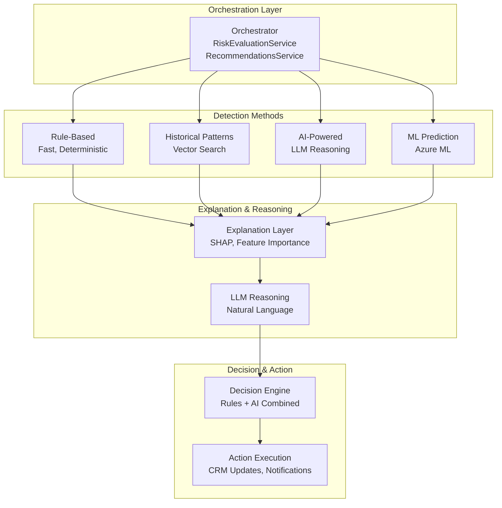
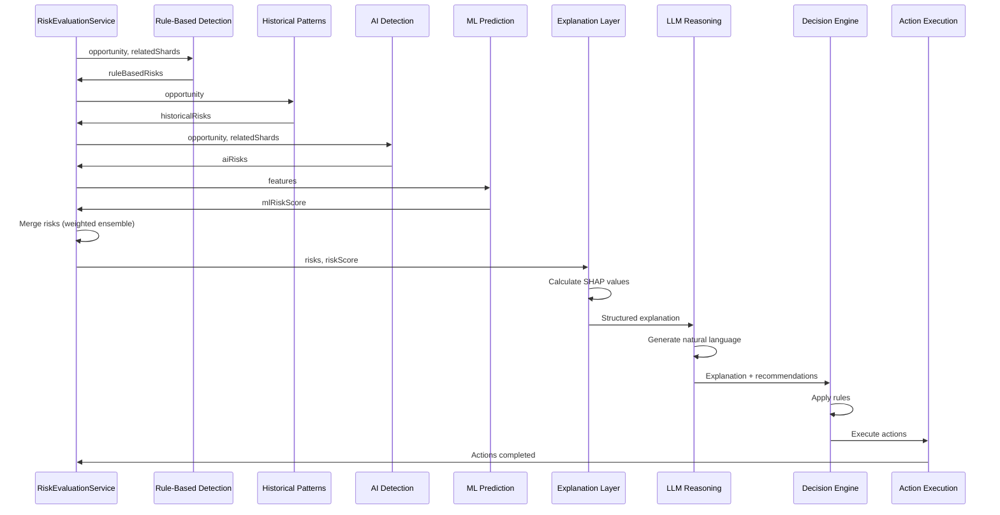
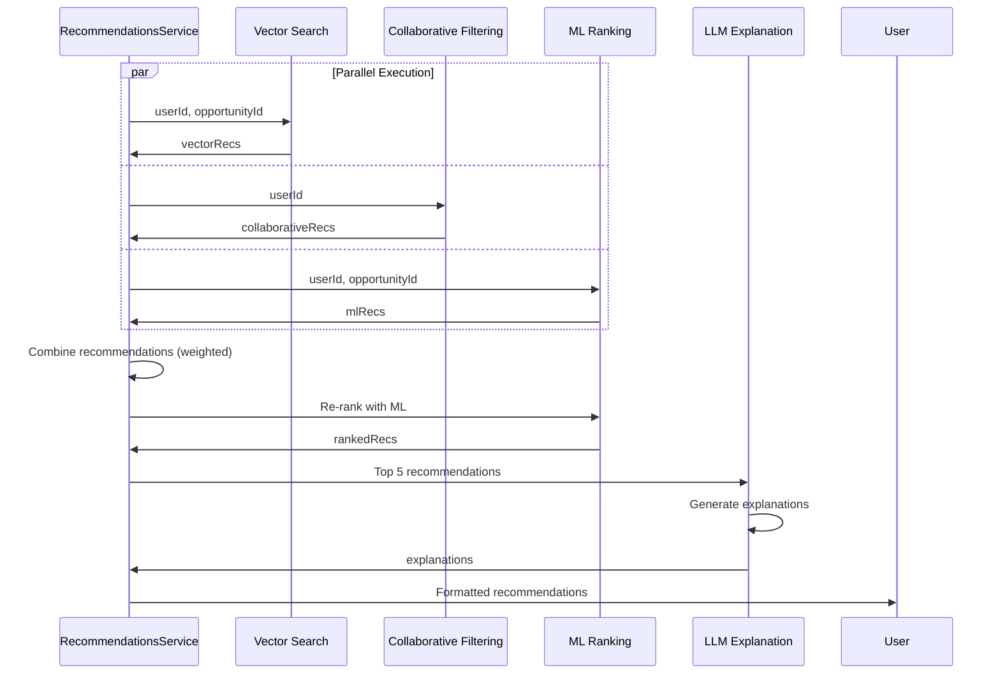

# CAIS Orchestration Patterns

**Date:** January 2025  
**Status:** 📋 **TARGET ARCHITECTURE** - Documenting both current state and planned ML integration  
**Version:** 1.0

---

## Overview

This document describes how the various components of the Compound AI System (CAIS) orchestrate together to deliver end-to-end intelligence for sales opportunities. Orchestration is the coordination of ML models, LLMs, rules, and services to work together in a decision loop.

**Key Principle**: Each component has a clear responsibility, and orchestration combines them to create a system that is more than the sum of its parts.

---

## Orchestration Architecture

### High-Level Orchestration Flow



---

## Orchestration Patterns

### Pattern 1: Weighted Ensemble (Risk Detection)

**Current Implementation**: RiskEvaluationService orchestrates rule-based, historical, and AI detection methods.

**Pattern**: Combine multiple detection methods with weighted confidence scores.

```pseudocode
// Weighted Ensemble Orchestration
async function orchestrateRiskDetection(opportunity, relatedShards, tenantId, userId) {
  detectedRisks = []
  detectionMethods = []
  
  // 1. Rule-based detection (fast, deterministic)
  ruleBasedRisks = await detectRisksByRules(opportunity, relatedShards)
  // Weight: High confidence (0.8-1.0) for deterministic rules
  for (risk in ruleBasedRisks) {
    risk.confidence = risk.confidence * 1.0  // Full weight for rules
    risk.detectionMethod = "rule"
  }
  detectedRisks.push(...ruleBasedRisks)
  detectionMethods.push("rule")
  
  // 2. Historical pattern matching (if enabled)
  if (options.includeHistorical) {
    historicalRisks = await detectRisksByHistoricalPatterns(opportunity)
    // Weight: Medium-high confidence (0.7-0.9) for historical patterns
    for (risk in historicalRisks) {
      risk.confidence = risk.confidence * 0.9  // Slight discount for historical
      risk.detectionMethod = "historical"
    }
    detectedRisks.push(...historicalRisks)
    detectionMethods.push("historical")
  }
  
  // 3. AI-powered detection (LLM reasoning)
  if (options.includeAI) {
    aiRisks = await detectRisksByAI(opportunity, relatedShards)
    // Weight: Medium confidence (0.6-0.8) for AI (can be creative)
    for (risk in aiRisks) {
      risk.confidence = risk.confidence * 0.8  // Discount for AI creativity
      risk.detectionMethod = "ai"
    }
    detectedRisks.push(...aiRisks)
    detectionMethods.push("ai")
  }
  
  // 4. ML prediction (planned)
  if (options.includeML) {
    mlRiskScore = await predictMLRiskScore(opportunity)
    // Weight: High confidence (0.8-0.95) for ML (learned patterns)
    if (mlRiskScore > threshold) {
      mlRisks = await convertMLScoreToRisks(mlRiskScore, opportunity)
      for (risk in mlRisks) {
        risk.confidence = risk.confidence * 0.9  // High weight for ML
        risk.detectionMethod = "ml"
      }
      detectedRisks.push(...mlRisks)
      detectionMethods.push("ml")
    }
  }
  
  // 5. Merge and deduplicate risks
  mergedRisks = mergeRisks(detectedRisks, {
    // Merge strategy: Take highest confidence, combine explanations
    mergeStrategy: "max_confidence",
    deduplicationThreshold: 0.7  // Same risk if similarity > 0.7
  })
  
  // 6. Resolve conflicts
  conflicts = detectConflicts(mergedRisks)
  resolvedRisks = resolveConflicts(mergedRisks, conflicts, {
    // Conflict resolution: Prefer rule-based > ML > historical > AI
    priority: ["rule", "ml", "historical", "ai"]
  })
  
  return {
    risks: resolvedRisks,
    detectionMethods: detectionMethods,
    conflicts: conflicts
  }
}
```

**Conflict Resolution**:
```pseudocode
// Conflict Resolution Strategy
function resolveConflicts(risks, conflicts, priority) {
  resolvedRisks = []
  
  for (conflict in conflicts) {
    // Get risks involved in conflict
    risk1 = conflict.risk1
    risk2 = conflict.risk2
    
    // Determine priority based on detection method
    priority1 = priority.indexOf(risk1.detectionMethod)
    priority2 = priority.indexOf(risk2.detectionMethod)
    
    if (priority1 < priority2) {
      // risk1 has higher priority
      resolvedRisks.push(risk1)
      // Update risk2 explanation to note conflict resolution
      risk2.explanation += "\n\nNote: Conflicting detection resolved in favor of " + risk1.detectionMethod
    } else {
      // risk2 has higher priority
      resolvedRisks.push(risk2)
      risk1.explanation += "\n\nNote: Conflicting detection resolved in favor of " + risk2.detectionMethod
    }
  }
  
  return resolvedRisks
}
```

---

### Pattern 2: Sequential Pipeline (Prediction → Explanation → Action)

**Pattern**: Chain components sequentially, where each layer builds on the previous.

```pseudocode
// Sequential Pipeline Orchestration
async function orchestrateOpportunityAnalysis(opportunityId, tenantId, userId) {
  // Step 1: Extract features (Feature Engineering Layer)
  features = await extractFeatures(opportunityId, tenantId)
  
  // Step 2: ML prediction (Predictive Model Layer)
  mlPrediction = await predictMLRiskScore(features)
  
  // Step 3: Calculate explanations (Explanation Layer)
  explanation = await calculateExplanation(mlPrediction, features)
  
  // Step 4: LLM reasoning (LLM Reasoning Layer)
  llmOutput = await generateLLMExplanation(explanation, opportunityId)
  
  // Step 5: Decision & action (Decision & Action Engine)
  decisions = await makeDecisions(mlPrediction, explanation, llmOutput)
  actions = await executeActions(decisions, opportunityId)
  
  return {
    prediction: mlPrediction,
    explanation: explanation,
    reasoning: llmOutput,
    decisions: decisions,
    actions: actions
  }
}
```

**Error Handling in Pipeline**:
```pseudocode
// Pipeline with Graceful Degradation
async function orchestrateWithFallback(opportunityId, tenantId, userId) {
  try {
    // Try ML prediction first
    features = await extractFeatures(opportunityId, tenantId)
    mlPrediction = await predictMLRiskScore(features)
    explanation = await calculateExplanation(mlPrediction, features)
  } catch (mlError) {
    // Fallback to rule-based prediction
    rulePrediction = await predictRuleBased(opportunityId)
    explanation = await generateRuleBasedExplanation(rulePrediction)
    mlPrediction = null  // Mark as fallback
  }
  
  try {
    // Try LLM explanation
    llmOutput = await generateLLMExplanation(explanation, opportunityId)
  } catch (llmError) {
    // Fallback to template-based explanation
    llmOutput = await generateTemplateExplanation(explanation)
  }
  
  // Decision engine always works (rules-based)
  decisions = await makeDecisions(mlPrediction || rulePrediction, explanation, llmOutput)
  actions = await executeActions(decisions, opportunityId)
  
  return {
    prediction: mlPrediction || rulePrediction,
    explanation: explanation,
    reasoning: llmOutput,
    decisions: decisions,
    actions: actions,
    fallbackUsed: mlPrediction === null
  }
}
```

---

### Pattern 3: Parallel Execution with Aggregation

**Pattern**: Execute multiple methods in parallel, then aggregate results.

```pseudocode
// Parallel Execution Orchestration
async function orchestrateParallelDetection(opportunity, relatedShards, tenantId, userId) {
  // Execute all detection methods in parallel
  [ruleRisks, historicalRisks, aiRisks, mlRisks] = await Promise.all([
    detectRisksByRules(opportunity, relatedShards),
    detectRisksByHistoricalPatterns(opportunity),
    detectRisksByAI(opportunity, relatedShards),
    predictMLRiskScore(opportunity).then(score => convertMLScoreToRisks(score, opportunity))
  ])
  
  // Aggregate results
  allRisks = [
    ...ruleRisks.map(r => ({ ...r, method: "rule", weight: 1.0 })),
    ...historicalRisks.map(r => ({ ...r, method: "historical", weight: 0.9 })),
    ...aiRisks.map(r => ({ ...r, method: "ai", weight: 0.8 })),
    ...mlRisks.map(r => ({ ...r, method: "ml", weight: 0.9 }))
  ]
  
  // Weighted aggregation
  aggregatedRisks = aggregateRisks(allRisks, {
    aggregationMethod: "weighted_average",
    weights: {
      rule: 1.0,
      historical: 0.9,
      ai: 0.8,
      ml: 0.9
    }
  })
  
  return aggregatedRisks
}
```

---

### Pattern 4: Conditional Orchestration

**Pattern**: Choose orchestration path based on conditions (opportunity characteristics, data availability, etc.).

```pseudocode
// Conditional Orchestration
async function orchestrateConditional(opportunity, relatedShards, tenantId, userId) {
  // Determine orchestration strategy based on opportunity characteristics
  strategy = determineStrategy(opportunity, {
    // High-value deals: Use all methods
    if (opportunity.amount > 1000000) {
      return "comprehensive"  // All methods
    }
    
    // Low-value deals: Use fast methods only
    if (opportunity.amount < 50000) {
      return "fast"  // Rule-based only
    }
    
    // Medium-value deals: Use rule-based + ML
    return "balanced"  // Rule-based + ML
  })
  
  // Execute based on strategy
  switch (strategy) {
    case "comprehensive":
      return await orchestrateComprehensive(opportunity, relatedShards, tenantId, userId)
    
    case "balanced":
      return await orchestrateBalanced(opportunity, relatedShards, tenantId, userId)
    
    case "fast":
      return await orchestrateFast(opportunity, relatedShards, tenantId, userId)
  }
}

// Comprehensive orchestration (all methods)
async function orchestrateComprehensive(opportunity, relatedShards, tenantId, userId) {
  // Use all detection methods
  risks = await orchestrateWeightedEnsemble(opportunity, relatedShards, tenantId, userId, {
    includeRules: true,
    includeHistorical: true,
    includeAI: true,
    includeML: true
  })
  
  // Full explanation pipeline
  explanation = await orchestrateSequentialPipeline(opportunity.id, tenantId, userId)
  
  return { risks, explanation }
}

// Balanced orchestration (rule-based + ML)
async function orchestrateBalanced(opportunity, relatedShards, tenantId, userId) {
  // Use rule-based + ML only
  risks = await orchestrateWeightedEnsemble(opportunity, relatedShards, tenantId, userId, {
    includeRules: true,
    includeHistorical: false,
    includeAI: false,
    includeML: true
  })
  
  // Simplified explanation (no LLM)
  explanation = await generateRuleBasedExplanation(risks)
  
  return { risks, explanation }
}

// Fast orchestration (rule-based only)
async function orchestrateFast(opportunity, relatedShards, tenantId, userId) {
  // Use rule-based only
  risks = await detectRisksByRules(opportunity, relatedShards)
  
  // Minimal explanation
  explanation = generateMinimalExplanation(risks)
  
  return { risks, explanation }
}
```

---

## Service Integration Points

### RiskEvaluationService Orchestration

**Current Implementation**: RiskEvaluationService acts as both orchestrator and decision engine.

```pseudocode
// RiskEvaluationService Orchestration Flow
class RiskEvaluationService {
  async evaluateOpportunity(opportunityId, tenantId, userId, options) {
    // 1. Load opportunity and related shards
    opportunity = await loadOpportunity(opportunityId, tenantId)
    relatedShards = await loadRelatedShards(opportunityId, tenantId)
    
    // 2. Orchestrate risk detection (Pattern 1: Weighted Ensemble)
    riskDetection = await this.orchestrateRiskDetection(
      opportunity,
      relatedShards,
      tenantId,
      userId,
      options
    )
    
    // 3. Calculate overall risk score
    riskScore = await this.calculateRiskScore(riskDetection.risks)
    
    // 4. Generate explanations (Pattern 2: Sequential Pipeline)
    explanation = await this.generateExplanation(
      riskDetection.risks,
      riskScore,
      opportunity
    )
    
    // 5. Make decisions (Decision Engine)
    decisions = await this.makeDecisions(
      riskScore,
      riskDetection.risks,
      explanation,
      opportunity
    )
    
    // 6. Execute actions
    actions = await this.executeActions(decisions, opportunityId, tenantId)
    
    return {
      riskScore: riskScore,
      risks: riskDetection.risks,
      explanation: explanation,
      decisions: decisions,
      actions: actions
    }
  }
  
  // Orchestrate risk detection (Weighted Ensemble)
  async orchestrateRiskDetection(opportunity, relatedShards, tenantId, userId, options) {
    // Implementation as shown in Pattern 1
    // ...
  }
  
  // Generate explanation (Sequential Pipeline)
  async generateExplanation(risks, riskScore, opportunity) {
    // 1. Calculate feature importance (if ML used)
    if (options.includeML) {
      featureImportance = await calculateFeatureImportance(risks, opportunity)
    }
    
    // 2. Generate structured explanation
    structuredExplanation = await this.riskExplainabilityService.explain(
      risks,
      riskScore,
      featureImportance
    )
    
    // 3. Generate LLM explanation (if enabled)
    if (options.includeLLM) {
      llmExplanation = await this.chainOfThoughtService.reason({
        query: "Explain the risk factors for this opportunity",
        context: {
          risks: risks,
          riskScore: riskScore,
          opportunity: opportunity,
          structuredExplanation: structuredExplanation
        }
      })
    }
    
    return {
      structured: structuredExplanation,
      llm: llmExplanation
    }
  }
  
  // Make decisions (Decision Engine)
  async makeDecisions(riskScore, risks, explanation, opportunity) {
    decisions = []
    
    // Rule 1: High risk → Escalate
    if (riskScore > 0.7) {
      decisions.push({
        type: "escalate",
        priority: "high",
        action: "notifyRiskManager",
        reason: "High risk score detected"
      })
    }
    
    // Rule 2: Critical risks → Immediate action
    criticalRisks = risks.filter(r => r.severity === "critical")
    if (criticalRisks.length > 0) {
      decisions.push({
        type: "immediate_action",
        priority: "critical",
        action: "createUrgentTask",
        risks: criticalRisks
      })
    }
    
    // Rule 3: Low risk + high value → Prioritize
    if (riskScore < 0.3 && opportunity.amount > 100000) {
      decisions.push({
        type: "prioritize",
        priority: "medium",
        action: "markAsHot",
        reason: "Low risk, high value opportunity"
      })
    }
    
    return decisions
  }
  
  // Execute actions
  async executeActions(decisions, opportunityId, tenantId) {
    actions = []
    
    for (decision in decisions) {
      switch (decision.action) {
        case "notifyRiskManager":
          await this.notificationService.send({
            to: "riskManager",
            subject: "High Risk Opportunity",
            opportunityId: opportunityId
          })
          actions.push("notification_sent")
          break
        
        case "createUrgentTask":
          await this.taskService.create({
            opportunityId: opportunityId,
            title: "Address Critical Risks",
            priority: "urgent",
            dueDate: addDays(new Date(), 1)
          })
          actions.push("task_created")
          break
        
        case "markAsHot":
          await this.opportunityService.update(opportunityId, {
            rating: "hot"
          })
          actions.push("marked_as_hot")
          break
      }
    }
    
    return actions
  }
}
```

---

### RecommendationsService Orchestration

**Current Implementation**: RecommendationsService orchestrates multiple recommendation sources.

```pseudocode
// RecommendationsService Orchestration Flow
class RecommendationsService {
  async getRecommendations(userId, opportunityId, tenantId, options) {
    // 1. Get recommendations from multiple sources (Pattern 3: Parallel)
    [vectorRecs, collaborativeRecs, mlRecs] = await Promise.all([
      this.getVectorBasedRecommendations(userId, opportunityId, tenantId),
      this.getCollaborativeRecommendations(userId, tenantId),
      this.getMLRecommendations(userId, opportunityId, tenantId)  // Planned
    ])
    
    // 2. Combine recommendations (Weighted Ensemble)
    combinedRecs = await this.combineRecommendations([
      ...vectorRecs.map(r => ({ ...r, source: "vector", weight: 0.3 })),
      ...collaborativeRecs.map(r => ({ ...r, source: "collaborative", weight: 0.3 })),
      ...mlRecs.map(r => ({ ...r, source: "ml", weight: 0.4 }))  // ML gets higher weight
    ])
    
    // 3. Re-rank with ML model (if available)
    if (options.useMLRanking) {
      rankedRecs = await this.mlRankingService.rank(combinedRecs, {
        userId: userId,
        opportunityId: opportunityId,
        context: await this.getContext(userId, opportunityId)
      })
    } else {
      rankedRecs = combinedRecs.sort((a, b) => b.score - a.score)
    }
    
    // 4. Generate LLM explanations for top recommendations
    topRecs = rankedRecs.slice(0, 5)
    explanations = await Promise.all(
      topRecs.map(rec => this.generateLLMExplanation(rec, userId, opportunityId))
    )
    
    // 5. Format recommendations
    formattedRecs = topRecs.map((rec, index) => ({
      ...rec,
      explanation: explanations[index],
      rank: index + 1
    }))
    
    return formattedRecs
  }
  
  // Combine recommendations (Weighted Ensemble)
  async combineRecommendations(recommendations) {
    // Group by item
    grouped = groupBy(recommendations, "itemId")
    
    // Aggregate scores
    aggregated = []
    for (itemId, recs in grouped) {
      // Weighted average score
      totalScore = recs.reduce((sum, rec) => sum + (rec.score * rec.weight), 0)
      totalWeight = recs.reduce((sum, rec) => sum + rec.weight, 0)
      avgScore = totalScore / totalWeight
      
      // Combine sources
      sources = recs.map(r => r.source)
      
      aggregated.push({
        itemId: itemId,
        score: avgScore,
        sources: sources,
        confidence: calculateConfidence(recs)  // Higher if multiple sources agree
      })
    }
    
    return aggregated
  }
  
  // Generate LLM explanation for recommendation
  async generateLLMExplanation(recommendation, userId, opportunityId) {
    context = await this.getContext(userId, opportunityId)
    
    explanation = await this.chainOfThoughtService.reason({
      query: `Explain why this recommendation is relevant: ${recommendation.itemId}`,
      context: {
        recommendation: recommendation,
        userContext: context.userContext,
        opportunityContext: context.opportunityContext,
        sources: recommendation.sources
      }
    })
    
    return explanation.output
  }
}
```

---

## Data Flow Between Components

### Risk Detection Data Flow



### Recommendation Data Flow



---

## Error Handling & Fallbacks

### Graceful Degradation Strategy

```pseudocode
// Graceful Degradation Orchestration
async function orchestrateWithFallbacks(opportunityId, tenantId, userId, options) {
  result = {
    prediction: null,
    explanation: null,
    reasoning: null,
    fallbacks: []
  }
  
  // Try ML prediction first
  try {
    features = await extractFeatures(opportunityId, tenantId)
    result.prediction = await predictMLRiskScore(features)
    result.method = "ml"
  } catch (mlError) {
    // Fallback 1: Rule-based prediction
    try {
      result.prediction = await predictRuleBased(opportunityId)
      result.method = "rule"
      result.fallbacks.push("ml -> rule")
    } catch (ruleError) {
      // Fallback 2: Stage-based probability
      result.prediction = await getStageBasedProbability(opportunityId)
      result.method = "stage"
      result.fallbacks.push("ml -> rule -> stage")
    }
  }
  
  // Try explanation calculation
  try {
    result.explanation = await calculateExplanation(result.prediction, features)
  } catch (explainError) {
    // Fallback: Template-based explanation
    result.explanation = await generateTemplateExplanation(result.prediction)
    result.fallbacks.push("shap -> template")
  }
  
  // Try LLM reasoning
  try {
    result.reasoning = await generateLLMExplanation(result.explanation, opportunityId)
  } catch (llmError) {
    // Fallback: Template-based reasoning
    result.reasoning = await generateTemplateReasoning(result.explanation)
    result.fallbacks.push("llm -> template")
  }
  
  // Decision engine always works (rules-based)
  result.decisions = await makeDecisions(result.prediction, result.explanation, result.reasoning)
  result.actions = await executeActions(result.decisions, opportunityId)
  
  return result
}
```

---

## Performance Optimization

### Caching Strategy

```pseudocode
// Orchestration with Caching
async function orchestrateWithCache(opportunityId, tenantId, userId) {
  cacheKey = `cais:${tenantId}:${opportunityId}`
  
  // Check cache
  cached = await redis.get(cacheKey)
  if (cached && !isStale(cached)) {
    return cached.result
  }
  
  // Execute orchestration
  result = await orchestrateOpportunityAnalysis(opportunityId, tenantId, userId)
  
  // Cache result
  await redis.set(cacheKey, {
    result: result,
    timestamp: new Date()
  }, { ttl: 900 })  // 15 minutes
  
  return result
}

// Cache invalidation
async function invalidateCache(opportunityId, tenantId) {
  cacheKey = `cais:${tenantId}:${opportunityId}`
  await redis.del(cacheKey)
  
  // Also invalidate related caches
  await invalidateRelatedCaches(opportunityId, tenantId)
}
```

### Parallel Execution Optimization

```pseudocode
// Optimized Parallel Execution
async function orchestrateOptimized(opportunity, relatedShards, tenantId, userId) {
  // Execute independent operations in parallel
  [features, catalog, historicalData] = await Promise.all([
    extractFeatures(opportunity.id, tenantId),
    getRiskCatalog(tenantId),
    getHistoricalData(opportunity, tenantId)
  ])
  
  // Execute detection methods in parallel (if independent)
  detectionPromises = []
  
  if (options.includeRules) {
    detectionPromises.push(detectRisksByRules(opportunity, relatedShards, catalog))
  }
  
  if (options.includeHistorical) {
    detectionPromises.push(detectRisksByHistoricalPatterns(opportunity, historicalData))
  }
  
  if (options.includeAI) {
    detectionPromises.push(detectRisksByAI(opportunity, relatedShards))
  }
  
  if (options.includeML) {
    detectionPromises.push(predictMLRiskScore(features).then(score => 
      convertMLScoreToRisks(score, opportunity)
    ))
  }
  
  // Wait for all detections
  detectionResults = await Promise.all(detectionPromises)
  
  // Merge results
  risks = mergeRisks(detectionResults.flat())
  
  return risks
}
```

---

## Testing Orchestration

### Unit Testing

```pseudocode
// Test orchestration patterns
describe("CAIS Orchestration", () => {
  test("Weighted Ensemble - merges risks correctly", async () => {
    ruleRisks = [{ riskId: "r1", confidence: 0.9, method: "rule" }]
    mlRisks = [{ riskId: "r1", confidence: 0.85, method: "ml" }]
    
    result = await mergeRisks([...ruleRisks, ...mlRisks])
    
    expect(result).toHaveLength(1)
    expect(result[0].confidence).toBeGreaterThan(0.9)  // Weighted average
    expect(result[0].sources).toContain("rule")
    expect(result[0].sources).toContain("ml")
  })
  
  test("Sequential Pipeline - chains correctly", async () => {
    features = await extractFeatures(opportunityId, tenantId)
    prediction = await predictMLRiskScore(features)
    explanation = await calculateExplanation(prediction, features)
    llmOutput = await generateLLMExplanation(explanation, opportunityId)
    
    expect(prediction).toBeDefined()
    expect(explanation).toBeDefined()
    expect(llmOutput).toBeDefined()
  })
  
  test("Graceful Degradation - falls back correctly", async () => {
    // Simulate ML failure
    mockMLService.predict = jest.fn().mockRejectedValue(new Error("ML service down"))
    
    result = await orchestrateWithFallbacks(opportunityId, tenantId, userId)
    
    expect(result.prediction).toBeDefined()  // Should have fallback
    expect(result.fallbacks).toContain("ml -> rule")
  })
})
```

### Integration Testing

```pseudocode
// Test full orchestration flow
describe("CAIS Integration", () => {
  test("Full decision loop", async () => {
    // Execute full CAIS flow
    result = await riskEvaluationService.evaluateOpportunity(
      opportunityId,
      tenantId,
      userId,
      { includeRules: true, includeHistorical: true, includeAI: true, includeML: true }
    )
    
    // Verify all layers executed
    expect(result.riskScore).toBeDefined()
    expect(result.risks).toBeArray()
    expect(result.explanation).toBeDefined()
    expect(result.decisions).toBeArray()
    expect(result.actions).toBeArray()
  })
})
```

---

## Related Documentation

- [CAIS_ARCHITECTURE.md](CAIS_ARCHITECTURE.md) - CAIS architecture overview
- [ARCHITECTURE.md](ARCHITECTURE.md) - System architecture details
- [ML_SYSTEM_OVERVIEW.md](ML_SYSTEM_OVERVIEW.md) - ML system overview

---

**Document Status:** Complete  
**Last Updated:** January 2025  
**Next Review:** After ML model implementation
