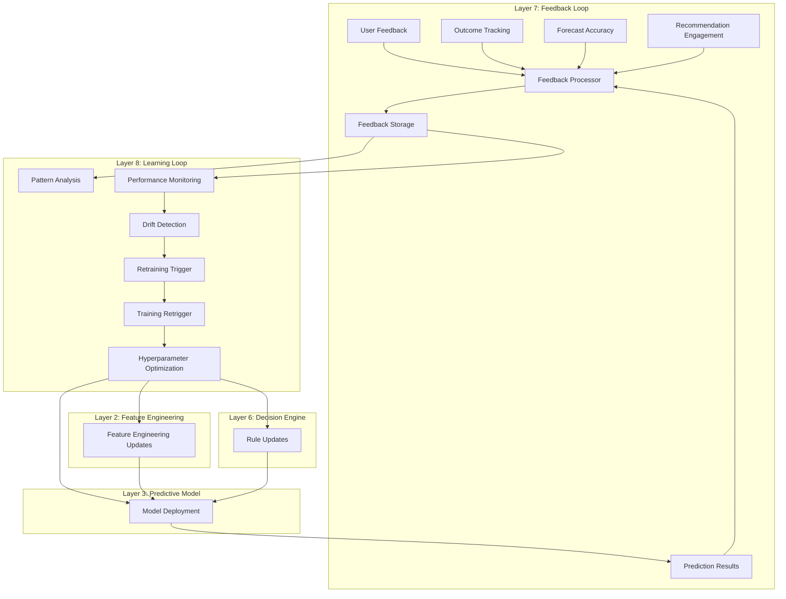

# Continuous Learning

**Note:** For operational standards including drift detection categories, shadow evaluation, and business metrics, see [ML_OPERATIONAL_STANDARDS.md](ML_OPERATIONAL_STANDARDS.md).

## Overview

The continuous learning system enables the ML models for the three priority use cases (**Risk Scoring**, **Revenue Forecasting**, **Recommendations**) to improve over time by collecting feedback, tracking outcomes, and automatically retraining models when performance degrades. This document describes the feedback loops, learning processes, and improvement mechanisms.

## CAIS Context: Learning Loop (CAIS Layer 7-8)

The continuous learning system implements **CAIS Layer 7: Feedback Loop** and **CAIS Layer 8: Learning Loop**. The entire CAIS learns, not just the ML models.

### CAIS Learning Flow

```
User Feedback (Layer 7: Feedback Loop)
    ↓
Outcome Tracking (Layer 7: Feedback Loop)
    ↓
Pattern Analysis (Layer 8: Learning Loop)
    ↓
Model Retraining (Layer 8: Learning Loop)
    ↓
Feature Improvement (Layer 2: Feature Engineering)
    ↓
Rule Updates (Layer 6: Decision Engine)
    ↓
System Improvement
```

**Key Principle**: The entire CAIS learns—ML models improve, features improve, rules improve, orchestration improves.

For detailed CAIS architecture, see [CAIS_ARCHITECTURE.md](CAIS_ARCHITECTURE.md).

## Continuous Learning Architecture (CAIS Learning Loop)

The CAIS learning loop spans multiple layers:



## Feedback Collection

### Shadow Evaluation Tracking

**Shadow Evaluation:** When using industry-specific models, the global model runs in background (shadow mode) for safe rollout and continuous validation. Shadow predictions are logged and compared offline (see [ML_OPERATIONAL_STANDARDS.md](../ML_OPERATIONAL_STANDARDS.md)).

```typescript
interface ShadowEvaluation {
  id: string;
  requestId: string;
  tenantId: string;
  modelType: 'risk_scoring' | 'forecasting' | 'recommendations';
  
  // Model information
  primaryModelId: string;              // Industry model (primary)
  shadowModelId: string;               // Global model (shadow)
  
  // Predictions
  primaryPrediction: any;              // Industry model prediction
  shadowPrediction: any;               // Global model prediction
  
  // Features used (for reproducibility)
  features: Record<string, any>;
  
  // Comparison metrics (calculated offline)
  predictionDifference?: number;      // Difference between predictions
  agreement?: boolean;                 // Do predictions agree?
  
  // Metadata
  timestamp: Date;
  industryId?: string;
}

/**
 * Compare shadow predictions with primary predictions
 */
async function compareShadowPredictions(
  shadowEvaluation: ShadowEvaluation
): Promise<ShadowComparison> {
  // Calculate prediction difference
  const difference = Math.abs(
    shadowEvaluation.primaryPrediction - shadowEvaluation.shadowPrediction
  );
  
  // Determine agreement (within threshold)
  const threshold = 0.1; // 10% difference threshold
  const agreement = difference < threshold;
  
  // Store comparison
  await storeShadowComparison({
    ...shadowEvaluation,
    predictionDifference: difference,
    agreement
  });
  
  return {
    difference,
    agreement,
    primaryModelId: shadowEvaluation.primaryModelId,
    shadowModelId: shadowEvaluation.shadowModelId
  };
}

/**
 * Calculate shadow evaluation metrics (offline)
 */
async function calculateShadowMetrics(
  primaryModelId: string,
  shadowModelId: string,
  period: { startDate: Date; endDate: Date }
): Promise<ShadowMetrics> {
  // Get all shadow evaluations for period
  const evaluations = await getShadowEvaluations(
    primaryModelId,
    shadowModelId,
    period
  );
  
  // Calculate metrics
  const totalComparisons = evaluations.length;
  const agreements = evaluations.filter(e => e.agreement).length;
  const averageDifference = evaluations.reduce(
    (sum, e) => sum + (e.predictionDifference || 0),
    0
  ) / totalComparisons;
  
  // When outcomes are available, compare accuracy
  const withOutcomes = evaluations.filter(e => e.actualOutcome !== undefined);
  const primaryAccuracy = withOutcomes.filter(e => 
    Math.abs(e.primaryPrediction - e.actualOutcome) < 0.1
  ).length / withOutcomes.length;
  
  const shadowAccuracy = withOutcomes.filter(e => 
    Math.abs(e.shadowPrediction - e.actualOutcome) < 0.1
  ).length / withOutcomes.length;
  
  return {
    primaryModelId,
    shadowModelId,
    period,
    totalComparisons,
    agreementRate: agreements / totalComparisons,
    averageDifference,
    primaryAccuracy,
    shadowAccuracy,
    performanceImprovement: primaryAccuracy - shadowAccuracy
  };
}

/**
 * Rollback trigger based on shadow evaluation
 */
async function checkShadowRollbackTriggers(
  primaryModelId: string,
  shadowModelId: string
): Promise<RollbackTrigger | null> {
  // Get recent shadow metrics
  const recentMetrics = await calculateShadowMetrics(
    primaryModelId,
    shadowModelId,
    {
      startDate: new Date(Date.now() - 7 * 24 * 60 * 60 * 1000), // Last 7 days
      endDate: new Date()
    }
  );
  
  // Check if primary model is underperforming
  if (recentMetrics.performanceImprovement < -0.05) {
    // Primary model is 5% worse than shadow
    return {
      type: 'shadow_evaluation',
      reason: `Primary model underperforming shadow by ${Math.abs(recentMetrics.performanceImprovement) * 100}%`,
      primaryModelId,
      shadowModelId,
      metrics: recentMetrics
    };
  }
  
  // Check if agreement rate is too low
  if (recentMetrics.agreementRate < 0.7) {
    return {
      type: 'shadow_evaluation',
      reason: `Low agreement rate: ${recentMetrics.agreementRate * 100}%`,
      primaryModelId,
      shadowModelId,
      metrics: recentMetrics
    };
  }
  
  return null;
}
```

### User Feedback Types

```typescript
interface MLFeedback {
  id: string;
  tenantId: string;
  userId: string;
  modelType: 'risk_scoring' | 'forecasting' | 'recommendations';
  
  // Feedback type
  feedbackType: 'rating' | 'correct' | 'dismiss' | 'engage';
  
  // Feedback data
  rating?: number;                  // 1-5 rating
  comment?: string;
  action?: string;                  // User action taken
  
  // Context
  prediction: any;                  // What was predicted
  actual?: any;                     // What was actual (if available)
  
  // Metadata
  timestamp: Date;
  modelVersion: string;             // Model version that made prediction
}

// Specific feedback types
interface RiskScoringFeedback extends MLFeedback {
  modelType: 'risk_scoring';
  opportunityId: string;
  riskId?: string;
  predictedRiskScore: number;
  actualRiskScore?: number;
}

interface ForecastingFeedback extends MLFeedback {
  modelType: 'forecasting';
  opportunityId?: string;
  teamId?: string;
  tenantId: string;
  predictedForecast: number;
  actualRevenue?: number;
}

interface RecommendationsFeedback extends MLFeedback {
  modelType: 'recommendations';
  itemId: string;
  recommended: boolean;
  clicked?: boolean;
  engaged?: boolean;
}
```

### Outcome Tracking

```typescript
interface MLOutcome {
  id: string;
  tenantId: string;
  modelType: 'risk_scoring' | 'forecasting' | 'recommendations';
  
  // Outcome data
  outcomeDate: Date;
  actual: any;                      // Actual outcome value
  
  // Predictions at different stages
  predictions: Array<{
    predictionDate: Date;
    predicted: any;
    modelVersion: string;
  }>;
  
  createdAt: Date;
}

// Specific outcome types
interface RiskScoringOutcome extends MLOutcome {
  modelType: 'risk_scoring';
  opportunityId: string;
  actualRiskScore: number;
  actualRisks: string[];
}

interface ForecastingOutcome extends MLOutcome {
  modelType: 'forecasting';
  opportunityId?: string;
  teamId?: string;
  actualRevenue: number;
  forecastLevel: 'opportunity' | 'team' | 'tenant';
}

interface RecommendationsOutcome extends MLOutcome {
  modelType: 'recommendations';
  userId: string;
  itemId: string;
  clicked: boolean;
  converted: boolean;
  engagementScore: number;
}
```

### Feedback Collection Service

```typescript
class MLFeedbackService {
  async recordFeedback(feedback: MLFeedback): Promise<void> {
    // Store feedback
    await this.storeFeedback(feedback);
    
    // Update feedback statistics
    await this.updateFeedbackStats(feedback);
    
    // Check if enough feedback collected for learning
    if (await this.shouldTriggerLearning(feedback.modelType)) {
      await this.triggerLearning(feedback.modelType);
    }
  }
  
  async recordOutcome(outcome: MLOutcome): Promise<void> {
    // Store outcome
    await this.storeOutcome(outcome);
    
    // Link to predictions
    await this.linkPredictionsToOutcome(outcome);
    
    // Calculate prediction accuracy
    await this.calculatePredictionAccuracy(outcome);
    
    // Check if retraining needed
    if (await this.shouldRetrain(outcome.modelType)) {
      await this.triggerRetraining(outcome.modelType);
    }
  }
  
  async getFeedbackForTraining(
    modelType: ModelType,
    options: FeedbackTrainingOptions
  ): Promise<TrainingFeedback[]> {
    const feedback = await this.queryFeedback({
      startDate: options.startDate,
      endDate: options.endDate,
      tenantId: options.tenantId,
      minRating: options.minRating
    });
    
    const outcomes = await this.queryOutcomes({
      startDate: options.startDate,
      endDate: options.endDate,
      tenantId: options.tenantId
    });
    
    // Combine feedback and outcomes
    return this.combineFeedbackAndOutcomes(feedback, outcomes);
  }
}
```

## Performance Monitoring

### Business-Level ML Metrics Tracking ⭐

**Critical:** Business metrics are required for promotion to production (see [ML_OPERATIONAL_STANDARDS.md](../ML_OPERATIONAL_STANDARDS.md)). Track business-level KPIs alongside technical metrics.

```typescript
interface BusinessMetrics {
  modelId: string;
  modelType: ModelType;
  period: {
    startDate: Date;
    endDate: Date;
  };
  
  // Risk Scoring Business Metrics
  calibrationError?: number;          // <0.05 required
  brierScore?: number;                // <0.15 required
  
  // Forecasting Business Metrics
  forecastBias30Days?: number;        // <5% required
  forecastBias60Days?: number;        // <10% required
  forecastBias90Days?: number;        // <15% required
  
  // Recommendations Business Metrics
  incrementalCTR?: number;           // >10% improvement required
  userEngagement?: number;            // >80% required
  
  calculatedAt: Date;
}

async function calculateBusinessMetrics(
  modelId: string,
  period: { startDate: Date; endDate: Date }
): Promise<BusinessMetrics> {
  const model = await getModel(modelId);
  const metrics: BusinessMetrics = {
    modelId,
    modelType: model.modelType,
    period,
    calculatedAt: new Date()
  };
  
  if (model.modelType === 'risk_scoring') {
    // Calculate calibration error and Brier score
    const predictions = await getPredictionsWithOutcomes(modelId, period);
    metrics.calibrationError = calculateCalibrationError(predictions);
    metrics.brierScore = calculateBrierScore(predictions);
  } else if (model.modelType === 'forecasting') {
    // Calculate forecast bias over different time horizons
    metrics.forecastBias30Days = await calculateForecastBias(modelId, 30);
    metrics.forecastBias60Days = await calculateForecastBias(modelId, 60);
    metrics.forecastBias90Days = await calculateForecastBias(modelId, 90);
  } else if (model.modelType === 'recommendations') {
    // Calculate incremental CTR and user engagement
    metrics.incrementalCTR = await calculateIncrementalCTR(modelId, period);
    metrics.userEngagement = await calculateUserEngagement(modelId, period);
  }
  
  return metrics;
}

/**
 * Check if business metrics meet production requirements
 */
async function validateBusinessMetricsForProduction(
  modelId: string
): Promise<ValidationResult> {
  const metrics = await calculateBusinessMetrics(modelId, {
    startDate: subDays(new Date(), 30),
    endDate: new Date()
  });
  
  const model = await getModel(modelId);
  const errors: string[] = [];
  
  if (model.modelType === 'risk_scoring') {
    if (metrics.calibrationError && metrics.calibrationError > 0.05) {
      errors.push(`Calibration error ${metrics.calibrationError} exceeds threshold 0.05`);
    }
    if (metrics.brierScore && metrics.brierScore > 0.15) {
      errors.push(`Brier score ${metrics.brierScore} exceeds threshold 0.15`);
    }
  } else if (model.modelType === 'forecasting') {
    if (metrics.forecastBias30Days && Math.abs(metrics.forecastBias30Days) > 0.05) {
      errors.push(`30-day forecast bias ${metrics.forecastBias30Days} exceeds threshold 5%`);
    }
    if (metrics.forecastBias60Days && Math.abs(metrics.forecastBias60Days) > 0.10) {
      errors.push(`60-day forecast bias ${metrics.forecastBias60Days} exceeds threshold 10%`);
    }
    if (metrics.forecastBias90Days && Math.abs(metrics.forecastBias90Days) > 0.15) {
      errors.push(`90-day forecast bias ${metrics.forecastBias90Days} exceeds threshold 15%`);
    }
  } else if (model.modelType === 'recommendations') {
    if (metrics.incrementalCTR && metrics.incrementalCTR < 0.10) {
      errors.push(`Incremental CTR ${metrics.incrementalCTR} below threshold 10%`);
    }
    if (metrics.userEngagement && metrics.userEngagement < 0.80) {
      errors.push(`User engagement ${metrics.userEngagement} below threshold 80%`);
    }
  }
  
  return {
    valid: errors.length === 0,
    errors,
    metrics
  };
}
```

### Model Performance Tracking

```typescript
interface ModelPerformance {
  modelId: string;
  modelType: ModelType;
  period: {
    startDate: Date;
    endDate: Date;
  };
  
  // Prediction metrics
  totalPredictions: number;
  accuratePredictions: number;
  inaccuratePredictions: number;
  
  // Accuracy metrics
  accuracy: number;
  precision: number;
  recall: number;
  f1Score: number;
  
  // Error metrics
  mae: number;                       // Mean absolute error
  rmse: number;                      // Root mean squared error
  
  // Performance metrics
  avgLatency: number;
  p95Latency: number;
  errorRate: number;
  
  // Comparison with baseline
  improvementOverBaseline: number;
  
  calculatedAt: Date;
}

async function calculateModelPerformance(
  modelId: string,
  period: { startDate: Date; endDate: Date }
): Promise<ModelPerformance> {
  // Get predictions in period
  const predictions = await getPredictions(modelId, period);
  
  // Get actual outcomes
  const outcomes = await getOutcomesForPredictions(predictions);
  
  // Calculate metrics
  const metrics = calculateMetrics(predictions, outcomes);
  
  // Compare with baseline
  const baseline = await getBaselineModel(modelId);
  const baselineMetrics = await calculateModelPerformance(
    baseline.id,
    period
  );
  
  return {
    modelId,
    modelType: (await getModel(modelId)).modelType,
    period,
    ...metrics,
    improvementOverBaseline: calculateImprovement(metrics, baselineMetrics),
    calculatedAt: new Date()
  };
}
```

### Performance Degradation Detection

```typescript
async function detectPerformanceDegradation(
  modelId: string
): Promise<DegradationAlert | null> {
  const model = await getModel(modelId);
  
  // Get recent performance
  const recent = await calculateModelPerformance(modelId, {
    startDate: subDays(new Date(), 7),
    endDate: new Date()
  });
  
  // Get historical performance
  const historical = await calculateModelPerformance(modelId, {
    startDate: subDays(new Date(), 30),
    endDate: subDays(new Date(), 7)
  });
  
  // Check for degradation
  const accuracyDrop = historical.accuracy - recent.accuracy;
  const errorIncrease = recent.errorRate - historical.errorRate;
  
  if (accuracyDrop > 0.05 || errorIncrease > 0.1) {
    return {
      modelId,
      severity: accuracyDrop > 0.1 ? 'high' : 'medium',
      metrics: {
        accuracyDrop,
        errorIncrease,
        recent,
        historical
      },
      recommendation: 'Retrain model with recent data',
      detectedAt: new Date()
    };
  }
  
  return null;
}
```

## Model Drift Detection

**Critical:** Track three distinct drift types separately with separate thresholds and alerts (see [ML_OPERATIONAL_STANDARDS.md](../ML_OPERATIONAL_STANDARDS.md)). This prevents false retraining triggers and catches silent failures.

### 1. Feature Distribution Drift

**Definition:** Changes in feature distributions over time (input data changes).

```typescript
interface FeatureDistributionDrift {
  featureName: string;
  driftScore: number;                // 0-1, higher = more drift
  driftType: 'distribution' | 'mean' | 'variance' | 'correlation';
  threshold: number;                  // Separate threshold per feature
  pValue: number;                     // Statistical significance
  detectedAt: Date;
}

async function detectFeatureDistributionDrift(
  modelId: string
): Promise<FeatureDistributionDrift[]> {
  const model = await getModel(modelId);
  
  // Get training data distribution
  const trainingDistribution = await getTrainingDistribution(model);
  
  // Get recent production data
  const recentData = await getRecentProductionData(model, {
    days: 7
  });
  
  // Compare distributions for each feature
  const drifts: FeatureDistributionDrift[] = [];
  
  for (const feature of model.featureList) {
    const trainingDist = trainingDistribution[feature];
    const productionDist = getDistribution(recentData, feature);
    
    // Kolmogorov-Smirnov test for distribution drift
    const ksResult = kolmogorovSmirnovTest(
      trainingDist,
      productionDist
    );
    
    // Population Stability Index (PSI) for categorical features
    const psi = calculatePSI(trainingDist, productionDist);
    
    // Separate threshold per feature type
    const threshold = model.featureThresholds?.[feature] || 0.3;
    
    if (ksResult.statistic > threshold || psi > threshold) {
      drifts.push({
        featureName: feature,
        driftScore: Math.max(ksResult.statistic, psi),
        driftType: 'distribution',
        threshold,
        pValue: ksResult.pValue,
        detectedAt: new Date()
      });
    }
  }
  
  return drifts;
}
```

### 2. Prediction Distribution Drift

**Definition:** Changes in model output distributions over time (model behavior changes).

```typescript
interface PredictionDistributionDrift {
  modelId: string;
  driftScore: number;                // 0-1, higher = more drift
  driftType: 'distribution' | 'mean' | 'variance';
  threshold: number;                  // Separate threshold for predictions
  detectedAt: Date;
}

async function detectPredictionDistributionDrift(
  modelId: string
): Promise<PredictionDistributionDrift | null> {
  const model = await getModel(modelId);
  
  // Get training predictions (from validation set during training)
  const trainingPredictions = await getTrainingPredictions(modelId);
  
  // Get recent predictions
  const recentPredictions = await getRecentPredictions(modelId, {
    days: 7
  });
  
  // Compare distributions
  const ksResult = kolmogorovSmirnovTest(
    trainingPredictions,
    recentPredictions
  );
  
  // Separate threshold for prediction drift
  const threshold = 0.25; // Lower threshold than feature drift
  
  if (ksResult.statistic > threshold) {
    return {
      modelId,
      driftScore: ksResult.statistic,
      driftType: 'distribution',
      threshold,
      detectedAt: new Date()
    };
  }
  
  return null;
}
```

### 3. Outcome Drift

**Definition:** Changes in actual outcomes vs. predictions (when labels arrive). This is the most critical drift type.

```typescript
interface OutcomeDrift {
  modelId: string;
  driftScore: number;                // 0-1, higher = more drift
  performanceDegradation: {
    accuracyDrop: number;
    errorIncrease: number;
    calibrationError?: number;       // For risk scoring
  };
  threshold: number;                  // Separate threshold for outcomes
  detectedAt: Date;
}

async function detectOutcomeDrift(
  modelId: string
): Promise<OutcomeDrift | null> {
  const model = await getModel(modelId);
  
  // Get recent predictions with outcomes
  const recent = await getPredictionsWithOutcomes(modelId, {
    days: 7
  });
  
  // Get historical predictions with outcomes (baseline)
  const historical = await getPredictionsWithOutcomes(modelId, {
    startDate: subDays(new Date(), 30),
    endDate: subDays(new Date(), 7)
  });
  
  // Calculate performance metrics
  const recentMetrics = calculatePerformanceMetrics(recent);
  const historicalMetrics = calculatePerformanceMetrics(historical);
  
  const accuracyDrop = historicalMetrics.accuracy - recentMetrics.accuracy;
  const errorIncrease = recentMetrics.errorRate - historicalMetrics.errorRate;
  
  // Separate threshold for outcome drift (most critical)
  const threshold = 0.05; // 5% accuracy drop triggers alert
  
  if (accuracyDrop > threshold || errorIncrease > 0.1) {
    // Calculate calibration error for risk scoring
    let calibrationError: number | undefined;
    if (model.modelType === 'risk_scoring') {
      calibrationError = calculateCalibrationError(recent);
    }
    
    return {
      modelId,
      driftScore: Math.max(accuracyDrop, errorIncrease),
      performanceDegradation: {
        accuracyDrop,
        errorIncrease,
        calibrationError
      },
      threshold,
      detectedAt: new Date()
    };
  }
  
  return null;
}
```

### Drift Detection Orchestration

```typescript
async function detectAllDriftTypes(
  modelId: string
): Promise<DriftDetectionResult> {
  // Detect all three drift types separately
  const featureDrift = await detectFeatureDistributionDrift(modelId);
  const predictionDrift = await detectPredictionDistributionDrift(modelId);
  const outcomeDrift = await detectOutcomeDrift(modelId);
  
  // Separate alerts for each drift type
  if (featureDrift.length > 0) {
    await sendDriftAlert({
      type: 'feature_distribution_drift',
      modelId,
      drifts: featureDrift,
      severity: featureDrift.some(d => d.driftScore > 0.5) ? 'high' : 'medium'
    });
  }
  
  if (predictionDrift) {
    await sendDriftAlert({
      type: 'prediction_distribution_drift',
      modelId,
      drift: predictionDrift,
      severity: predictionDrift.driftScore > 0.4 ? 'high' : 'medium'
    });
  }
  
  if (outcomeDrift) {
    await sendDriftAlert({
      type: 'outcome_drift',
      modelId,
      drift: outcomeDrift,
      severity: outcomeDrift.performanceDegradation.accuracyDrop > 0.1 ? 'high' : 'medium'
    });
  }
  
  return {
    featureDrift,
    predictionDrift,
    outcomeDrift,
    detectedAt: new Date()
  };
}
```

## Learning from Feedback (CAIS Layer 8: Learning Loop)

The learning loop processes feedback and improves the entire CAIS system:

### Weighted Training Examples

```typescript
function weightTrainingExamples(
  examples: TrainingExample[],
  feedback: RiskFeedback[]
): WeightedTrainingExample[] {
  // Create feedback map
  const feedbackMap = new Map<string, RiskFeedback[]>();
  for (const fb of feedback) {
    const key = `${fb.opportunityId}:${fb.riskId}`;
    if (!feedbackMap.has(key)) {
      feedbackMap.set(key, []);
    }
    feedbackMap.get(key)!.push(fb);
  }
  
  // Weight examples based on feedback
  return examples.map(example => {
    const key = `${example.opportunityId}:${example.riskId}`;
    const exampleFeedback = feedbackMap.get(key) || [];
    
    // Calculate weight
    let weight = 1.0;
    
    for (const fb of exampleFeedback) {
      switch (fb.action) {
        case 'acknowledged':
          // Increase weight for correct predictions
          weight *= 1.2;
          break;
        case 'dismissed':
          // Decrease weight for incorrect predictions
          weight *= 0.8;
          break;
        case 'corrected':
          // Significantly increase weight for corrections
          weight *= 1.5;
          break;
      }
      
      // Adjust based on rating
      if (fb.rating) {
        weight *= fb.rating / 3.0; // Normalize to 1.0
      }
    }
    
    return {
      ...example,
      weight: Math.max(0.1, Math.min(2.0, weight)) // Cap between 0.1 and 2.0
    };
  });
}
```

### Active Learning

```typescript
async function identifyUncertainPredictions(
  modelId: string,
  limit: number = 100
): Promise<UncertainPrediction[]> {
  // Get recent predictions with low confidence
  const predictions = await getRecentPredictions(modelId, {
    days: 7,
    minConfidence: 0,
    maxConfidence: 0.7 // Low confidence threshold
  });
  
  // Sort by uncertainty (distance from decision boundary)
  const uncertain = predictions
    .map(p => ({
      ...p,
      uncertainty: Math.abs(p.confidence - 0.5) // Distance from 0.5
    }))
    .sort((a, b) => a.uncertainty - b.uncertainty)
    .slice(0, limit);
  
  return uncertain;
}

async function requestFeedbackForUncertain(
  predictions: UncertainPrediction[]
): Promise<void> {
  // For each uncertain prediction, request expert feedback
  for (const prediction of predictions) {
    await createFeedbackRequest({
      opportunityId: prediction.opportunityId,
      riskId: prediction.riskId,
      prediction: prediction,
      reason: 'low_confidence',
      priority: 'high'
    });
  }
}
```

## Automatic Retraining (CAIS Layer 8: Learning Loop)

The learning loop automatically retrains models and updates system components:

### Retraining Triggers

```typescript
interface RetrainingTrigger {
  type: 'scheduled' | 'performance_degradation' | 'data_drift' | 'concept_drift' | 'manual';
  modelId: string;
  reason: string;
  severity: 'low' | 'medium' | 'high';
  triggeredAt: Date;
}

async function checkRetrainingTriggers(): Promise<RetrainingTrigger[]> {
  const triggers: RetrainingTrigger[] = [];
  
  // Check all active models
  const models = await getActiveModels();
  
  for (const model of models) {
    // Check performance degradation
    const degradation = await detectPerformanceDegradation(model.id);
    if (degradation) {
      triggers.push({
        type: 'performance_degradation',
        modelId: model.id,
        reason: `Accuracy dropped by ${degradation.metrics.accuracyDrop}`,
        severity: degradation.severity,
        triggeredAt: new Date()
      });
    }
    
    // Check outcome drift (most critical - check first)
    const outcomeDrift = await detectOutcomeDrift(model.id);
    if (outcomeDrift && outcomeDrift.driftScore > outcomeDrift.threshold) {
      triggers.push({
        type: 'outcome_drift',
        modelId: model.id,
        reason: `Outcome drift detected: ${outcomeDrift.performanceDegradation.accuracyDrop} accuracy drop`,
        severity: outcomeDrift.performanceDegradation.accuracyDrop > 0.1 ? 'high' : 'medium',
        triggeredAt: new Date()
      });
    }
    
    // Check prediction distribution drift
    const predictionDrift = await detectPredictionDistributionDrift(model.id);
    if (predictionDrift && predictionDrift.driftScore > predictionDrift.threshold) {
      triggers.push({
        type: 'prediction_distribution_drift',
        modelId: model.id,
        reason: `Prediction distribution drift detected: ${predictionDrift.driftScore}`,
        severity: predictionDrift.driftScore > 0.4 ? 'high' : 'medium',
        triggeredAt: new Date()
      });
    }
    
    // Check feature distribution drift
    const featureDrift = await detectFeatureDistributionDrift(model.id);
    if (featureDrift.length > 0 && featureDrift.some(d => d.driftScore > d.threshold)) {
      triggers.push({
        type: 'feature_distribution_drift',
        modelId: model.id,
        reason: `Feature distribution drift detected in ${featureDrift.length} features`,
        severity: featureDrift.some(d => d.driftScore > 0.5) ? 'high' : 'medium',
        triggeredAt: new Date()
      });
    }
    
    // Check prediction distribution drift
    const predictionDrift = await detectPredictionDistributionDrift(model.id);
    if (predictionDrift && predictionDrift.driftScore > predictionDrift.threshold) {
      triggers.push({
        type: 'prediction_distribution_drift',
        modelId: model.id,
        reason: `Prediction distribution drift detected: ${predictionDrift.driftScore}`,
        severity: predictionDrift.driftScore > 0.4 ? 'high' : 'medium',
        triggeredAt: new Date()
      });
    }
    
    // Check feature distribution drift
    const featureDrift = await detectFeatureDistributionDrift(model.id);
    if (featureDrift.length > 0 && featureDrift.some(d => d.driftScore > d.threshold)) {
      triggers.push({
        type: 'feature_distribution_drift',
        modelId: model.id,
        reason: `Feature distribution drift detected in ${featureDrift.length} features`,
        severity: featureDrift.some(d => d.driftScore > 0.5) ? 'high' : 'medium',
        triggeredAt: new Date()
      });
    }
  }
  
  return triggers;
}
```

### Scheduled Retraining

```typescript
// Weekly retraining schedule
async function scheduleWeeklyRetraining(): Promise<void> {
  const models = await getActiveModels();
  
  for (const model of models) {
    // Check if enough new data
    const newDataCount = await getNewDataCount(model, {
      days: 7
    });
    
    if (newDataCount >= MIN_TRAINING_EXAMPLES) {
      await trainingService.scheduleTraining(model.modelType, {
        startDate: subDays(new Date(), 7),
        endDate: new Date(),
        trigger: 'scheduled',
        incremental: true // Use incremental training if supported
      });
    }
  }
}
```

### Incremental Learning

```typescript
async function incrementalRetrain(
  modelId: string,
  newData: TrainingExample[]
): Promise<TrainedModel> {
  const currentModel = await getModel(modelId);
  
  // Load current model
  const model = await loadModelById(modelId);
  
  // Prepare new data
  const preparedData = await prepareTrainingData(newData);
  
  // Incremental update (if model supports it)
  if (model.supportsIncrementalLearning) {
    await model.partialFit(preparedData.features, preparedData.labels);
  } else {
    // Full retrain with combined data
    const existingData = await getTrainingData(currentModel);
    const combinedData = [...existingData, ...newData];
    return await trainModel(currentModel.modelType, combinedData);
  }
  
  return model;
}
```

## Feedback Loop Metrics

### Learning Metrics

```typescript
interface LearningMetrics {
  period: {
    startDate: Date;
    endDate: Date;
  };
  
  // Feedback collection
  totalFeedback: number;
  feedbackByType: Record<string, number>;
  feedbackQuality: number;           // Average rating
  
  // Model improvement
  modelImprovements: Array<{
    modelId: string;
    improvement: number;
    metric: string;
  }>;
  
  // Retraining
  retrainingCount: number;
  retrainingTriggers: Record<string, number>;
  averageRetrainingTime: number;
  
  // Performance
  averageAccuracy: number;
  accuracyTrend: 'improving' | 'stable' | 'degrading';
  
  calculatedAt: Date;
}

async function calculateLearningMetrics(
  period: { startDate: Date; endDate: Date }
): Promise<LearningMetrics> {
  // Collect feedback statistics
  const feedback = await getFeedback(period);
  const outcomes = await getOutcomes(period);
  
  // Calculate model improvements
  const models = await getActiveModels();
  const improvements = await Promise.all(
    models.map(async model => {
      const improvement = await calculateModelImprovement(
        model.id,
        period
      );
      return {
        modelId: model.id,
        improvement: improvement.accuracyImprovement,
        metric: 'accuracy'
      };
    })
  );
  
  // Calculate retraining statistics
  const retrainingJobs = await getRetrainingJobs(period);
  
  return {
    period,
    totalFeedback: feedback.length,
    feedbackByType: groupBy(feedback, 'feedbackType'),
    feedbackQuality: calculateAverageRating(feedback),
    modelImprovements: improvements,
    retrainingCount: retrainingJobs.length,
    retrainingTriggers: groupBy(retrainingJobs, 'trigger'),
    averageRetrainingTime: calculateAverageTime(retrainingJobs),
    averageAccuracy: calculateAverageAccuracy(models, period),
    accuracyTrend: determineTrend(improvements),
    calculatedAt: new Date()
  };
}
```

## Best Practices

1. **Feedback Quality**: Prioritize high-quality feedback (expert corrections)
2. **Balanced Learning**: Balance new data with historical data
3. **Gradual Updates**: Use incremental learning when possible
4. **Validation**: Always validate improvements before deployment
5. **Monitoring**: Continuously monitor for drift and degradation
6. **Documentation**: Document all learning events and improvements
