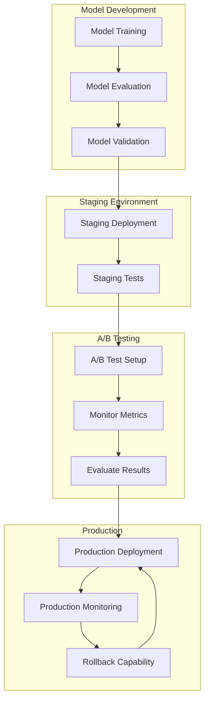

# Model Deployment and A/B Testing

**Note:** For operational standards including cost control and deployment best practices, see [ML_OPERATIONAL_STANDARDS.md](ML_OPERATIONAL_STANDARDS.md).

## Overview

This document describes the procedures for deploying ML models to **Azure ML Managed Endpoints**, managing A/B tests, and handling rollbacks. Models are deployed via Azure ML Workspace, providing auto-scaling, high availability, and simplified operations.

## Deployment Architecture



## Deployment Pipeline

### Stage 1: Model Validation

Before deployment, models must pass validation:

```typescript
interface DeploymentValidation {
  modelId: string;
  checks: {
    metricsThreshold: boolean;
    featureSchemaCompatibility: boolean;
    performanceBenchmark: boolean;
    securityScan: boolean;
    documentationComplete: boolean;
  };
  passed: boolean;
  issues: string[];
}

async function validateModelForDeployment(
  modelId: string
): Promise<DeploymentValidation> {
  const model = await getModel(modelId);
  const checks = {
    metricsThreshold: false,
    featureSchemaCompatibility: false,
    performanceBenchmark: false,
    securityScan: false,
    documentationComplete: false
  };
  const issues: string[] = [];
  
  // Check metrics meet threshold
  const threshold = getDeploymentThreshold(model.modelType);
  if (model.metrics.validationScore >= threshold) {
    checks.metricsThreshold = true;
  } else {
    issues.push(`Validation score ${model.metrics.validationScore} below threshold ${threshold}`);
  }
  
  // Check feature schema compatibility
  const currentSchema = await getCurrentFeatureSchema(model.modelType);
  if (isCompatible(model.featureSchema, currentSchema)) {
    checks.featureSchemaCompatibility = true;
  } else {
    issues.push('Feature schema incompatible with current version');
  }
  
  // Check performance benchmark
  const benchmark = await getPerformanceBenchmark(model.modelType);
  if (model.metrics.avgLatency <= benchmark.maxLatency) {
    checks.performanceBenchmark = true;
  } else {
    issues.push(`Latency ${model.metrics.avgLatency}ms exceeds benchmark ${benchmark.maxLatency}ms`);
  }
  
  // Security scan (check for vulnerabilities)
  const securityScan = await scanModelArtifact(model.artifactPath);
  if (securityScan.passed) {
    checks.securityScan = true;
  } else {
    issues.push(...securityScan.issues);
  }
  
  // Documentation check
  if (model.description && model.featureList.length > 0) {
    checks.documentationComplete = true;
  } else {
    issues.push('Model documentation incomplete');
  }
  
  const passed = Object.values(checks).every(v => v === true);
  
  return {
    modelId,
    checks,
    passed,
    issues
  };
}
```

### Stage 2: Staging Deployment

Deploy to staging environment for testing:

```typescript
async function deployToStaging(
  modelId: string
): Promise<DeploymentResult> {
  // Validate model
  const validation = await validateModelForDeployment(modelId);
  if (!validation.passed) {
    throw new Error(`Model validation failed: ${validation.issues.join(', ')}`);
  }
  
  const model = await getModel(modelId);
  
  // Update model status
  await updateModel(modelId, {
    status: 'staging',
    deploymentEnvironment: 'staging',
    deployedAt: new Date()
  });
  
  // Deploy model artifact
  // Model is already in Azure ML Registry, no need to deploy artifact separately
  
  // Run staging tests
  const testResults = await runStagingTests(modelId);
  
  if (!testResults.passed) {
    // Rollback staging deployment
    await rollbackStaging(modelId);
    throw new Error(`Staging tests failed: ${testResults.errors.join(', ')}`);
  }
  
  return {
    modelId,
    environment: 'staging',
    deployedAt: new Date(),
    testResults
  };
}

async function runStagingTests(modelId: string): Promise<TestResults> {
  const model = await getModel(modelId);
  const testCases = await getStagingTestCases(model.modelType);
  
  const results: TestResult[] = [];
  
  for (const testCase of testCases) {
    try {
      // Load model
      // Test endpoint (models are in Azure ML Managed Endpoints)
      const endpointUrl = await getModelEndpoint(modelId);
      
      // Run inference
      const prediction = await loadedModel.predict(testCase.features);
      
      // Validate prediction
      const valid = validatePrediction(prediction, testCase.expected);
      
      results.push({
        testCaseId: testCase.id,
        passed: valid,
        actual: prediction,
        expected: testCase.expected,
        latency: testCase.latency
      });
    } catch (error) {
      results.push({
        testCaseId: testCase.id,
        passed: false,
        error: error.message
      });
    }
  }
  
  return {
    passed: results.every(r => r.passed),
    results,
    errors: results.filter(r => !r.passed).map(r => r.error || 'Test failed')
  };
}
```

### Stage 3: A/B Testing Setup

Before full production deployment, set up A/B test:

```typescript
async function setupABTestForProduction(
  newModelId: string,
  options: ABTestOptions
): Promise<ABTest> {
  const newModel = await getModel(newModelId);
  const currentModel = await getDefaultModel(newModel.modelType);
  
  if (!currentModel) {
    // No current model, deploy directly
    return await deployToProduction(newModelId, { setAsDefault: true });
  }
  
  // Create A/B test
  const abTest = await abTestService.setupABTest({
    modelType: newModel.modelType,
    newModelId,
    trafficPercentage: options.initialTraffic || 10,
    durationDays: options.durationDays || 7,
    tenantId: options.tenantId
  });
  
  // Start monitoring
  await startABTestMonitoring(abTest.id);
  
  return abTest;
}
```

### Stage 4: Production Deployment (Azure ML Managed Endpoint)

Deploy to production via Azure ML Managed Endpoint:

```typescript
async function deployToProduction(
  modelId: string,
  options: ProductionDeploymentOptions
): Promise<DeploymentResult> {
  const model = await getModel(modelId);
  
  // Final validation
  const validation = await validateModelForDeployment(modelId);
  if (!validation.passed) {
    throw new Error('Model validation failed');
  }
  
  // Get model from Azure ML Registry
  const azureMLModel = await azureML.registry.models.get(model.azureMLModelId);
  
  // Create or update Managed Endpoint
  const endpointName = `${model.modelType}_endpoint`;
  let endpoint = await azureML.endpoints.get(endpointName).catch(() => null);
  
  if (!endpoint) {
    // Create new endpoint
    endpoint = await azureML.endpoints.create({
      name: endpointName,
      type: 'managed',
      authMode: 'key',
      trafficAllocation: {
        [model.version]: 100
      }
    });
  } else {
    // Update existing endpoint with new model version
    await azureML.endpoints.update(endpointName, {
      trafficAllocation: {
        ...endpoint.trafficAllocation,
        [model.version]: options.trafficPercentage || 100
      }
    });
  }
  
  // Deploy model to endpoint with cost-aware configuration
  // See ML_OPERATIONAL_STANDARDS.md for cost control guidelines
  await azureML.endpoints.deploy({
    endpointName: endpointName,
    deploymentName: `${model.modelType}_${model.version}`,
    model: azureMLModel,
    computeType: 'managed',
    instanceCount: options.instanceCount || 1,
    instanceType: options.instanceType || 'Standard_DS2_v2',
    // Cost Control: Mandatory Defaults (Phase 1)
    scaling: {
      minReplicas: 0,  // Scale to zero when idle (mandatory default)
      maxReplicas: options.maxReplicas || 10,
      targetUtilization: 70,  // Scale up at 70% utilization
      scaleDownDelay: 300  // 5 minutes before scaling down
    }
    // Optional Optimizations (Phase 2):
    // - Scale-down cooldowns
    // - Night/weekend schedules (if usage allows)
    // - ROI-based retraining frequency
  });
  
  // Log cost configuration
  await logCostConfiguration(modelId, {
    minReplicas: 0,
    maxReplicas: options.maxReplicas || 10,
    instanceType: options.instanceType || 'Standard_DS2_v2',
    estimatedMonthlyCost: calculateEstimatedCost({
      instanceType: options.instanceType || 'Standard_DS2_v2',
      avgReplicas: 1,  // Estimate based on usage
      hoursPerMonth: 730
    })
  });
  
  // Update model metadata
  await updateModel(modelId, {
    status: 'active',
    deploymentEnvironment: 'production',
    deployedAt: new Date(),
    deployedBy: options.deployedBy || 'system',
    endpointUrl: endpoint.scoringUri,
    endpointName: endpointName
  });
  
  // Sync to Cosmos DB
  await syncModelToCosmos({
    ...model,
    endpointUrl: endpoint.scoringUri,
    endpointName: endpointName
  });
  
  // Set as default if requested
  if (options.setAsDefault) {
    await setAsDefault(modelId);
  }
  
  // Notify monitoring
  await notifyModelDeployment(modelId);
  
  return {
    modelId,
    endpointUrl: endpoint.scoringUri,
    environment: 'production',
    deployedAt: new Date(),
    isDefault: options.setAsDefault || false
  };
}
```

## A/B Testing Procedures

### A/B Test Configuration

```typescript
interface ABTestConfig {
  // Traffic allocation
  initialTraffic: number;            // Percentage for new model (0-100)
  maxTraffic: number;                // Maximum traffic if successful
  trafficRampUp: number;             // Percentage increase per day
  
  // Success criteria
  minSampleSize: number;              // Minimum predictions for statistical significance
  minImprovement: number;             // Minimum improvement to consider success
  significanceLevel: number;         // p-value threshold (default: 0.05)
  
  // Duration
  minDurationDays: number;            // Minimum test duration
  maxDurationDays: number;            // Maximum test duration
  
  // Monitoring
  checkInterval: number;              // Hours between checks
  alertThresholds: {
    errorRate: number;
    latencyIncrease: number;
  };
}

const DEFAULT_AB_TEST_CONFIG: ABTestConfig = {
  initialTraffic: 10,
  maxTraffic: 50,
  trafficRampUp: 10,
  minSampleSize: 1000,
  minImprovement: 0.02,              // 2% improvement
  significanceLevel: 0.05,
  minDurationDays: 3,
  maxDurationDays: 14,
  checkInterval: 24,
  alertThresholds: {
    errorRate: 0.05,
    latencyIncrease: 0.2
  }
};
```

### A/B Test Monitoring

```typescript
async function monitorABTest(abTestId: string): Promise<ABTestStatus> {
  const abTest = await getABTest(abTestId);
  
  // Check if enough data collected
  const sampleSize = abTest.metrics.control.requestCount + 
                     abTest.metrics.treatment.requestCount;
  
  if (sampleSize < abTest.config.minSampleSize) {
    return {
      status: 'collecting_data',
      sampleSize,
      requiredSampleSize: abTest.config.minSampleSize,
      progress: sampleSize / abTest.config.minSampleSize
    };
  }
  
  // Calculate statistical significance
  const significance = await calculateStatisticalSignificance(abTest);
  
  // Check success criteria
  const improvement = calculateImprovement(abTest);
  const isSuccessful = significance.pValue < abTest.config.significanceLevel &&
                       improvement >= abTest.config.minImprovement;
  
  // Check for issues
  const issues = await checkABTestIssues(abTest);
  
  // Determine next action
  let action: 'continue' | 'promote' | 'stop' | 'extend';
  if (isSuccessful && !issues.length) {
    action = 'promote';
  } else if (issues.length > 0) {
    action = 'stop';
  } else if (Date.now() - abTest.startDate.getTime() > 
             abTest.config.maxDurationDays * 24 * 60 * 60 * 1000) {
    action = 'stop'; // Max duration reached
  } else {
    action = 'continue';
  }
  
  return {
    status: action === 'promote' ? 'success' : 
            action === 'stop' ? 'failed' : 'ongoing',
    sampleSize,
    significance,
    improvement,
    issues,
    recommendation: getRecommendation(action, abTest)
  };
}
```

### Gradual Traffic Ramp-Up

```typescript
async function rampUpABTestTraffic(
  abTestId: string
): Promise<void> {
  const abTest = await getABTest(abTestId);
  
  // Check if ready for ramp-up
  const status = await monitorABTest(abTestId);
  if (status.status !== 'ongoing' || status.issues.length > 0) {
    return; // Don't ramp up if issues
  }
  
  // Calculate new traffic percentage
  const currentTraffic = abTest.trafficPercentage;
  const newTraffic = Math.min(
    currentTraffic + abTest.config.trafficRampUp,
    abTest.config.maxTraffic
  );
  
  if (newTraffic > currentTraffic) {
    // Update traffic allocation
    await updateABTestTraffic(abTestId, newTraffic);
    
    // Log ramp-up
    await logABTestEvent(abTestId, {
      type: 'traffic_ramp_up',
      from: currentTraffic,
      to: newTraffic,
      timestamp: new Date()
    });
  }
}
```

## Rollback Procedures

### Automatic Rollback Triggers

```typescript
async function checkRollbackTriggers(
  modelId: string
): Promise<RollbackTrigger | null> {
  const model = await getModel(modelId);
  
  // Check error rate
  const errorRate = await getModelErrorRate(modelId, { hours: 1 });
  if (errorRate > 0.1) { // 10% error rate
    return {
      modelId,
      reason: 'high_error_rate',
      severity: 'critical',
      errorRate,
      threshold: 0.1
    };
  }
  
  // Check latency
  const avgLatency = await getModelLatency(modelId, { hours: 1 });
  const baselineLatency = await getBaselineLatency(model.modelType);
  if (avgLatency > baselineLatency * 1.5) { // 50% increase
    return {
      modelId,
      reason: 'high_latency',
      severity: 'high',
      latency: avgLatency,
      baseline: baselineLatency
    };
  }
  
  // Check prediction quality
  const accuracy = await getModelAccuracy(modelId, { hours: 24 });
  const baselineAccuracy = await getBaselineAccuracy(model.modelType);
  if (accuracy < baselineAccuracy - 0.1) { // 10% drop
    return {
      modelId,
      reason: 'low_accuracy',
      severity: 'high',
      accuracy,
      baseline: baselineAccuracy
    };
  }
  
  return null;
}

async function autoRollbackIfNeeded(modelId: string): Promise<boolean> {
  const trigger = await checkRollbackTriggers(modelId);
  
  if (trigger && trigger.severity === 'critical') {
    // Automatic rollback for critical issues
    await rollbackModel(model.modelType);
    await notifyRollback({
      modelId,
      reason: trigger.reason,
      automatic: true
    });
    return true;
  }
  
  return false;
}
```

### Manual Rollback

```typescript
async function rollbackModel(
  modelType: ModelType,
  tenantId?: string
): Promise<RollbackResult> {
  const currentModel = await getDefaultModel(modelType, tenantId);
  if (!currentModel) {
    throw new Error('No default model to rollback from');
  }
  
  // Get previous model
  const previousModel = await getPreviousModel(currentModel);
  if (!previousModel) {
    throw new Error('No previous model version available');
  }
  
  // Deprecate current model
  await updateModel(currentModel.id, {
    status: 'deprecated',
    isDefault: false,
    deprecatedAt: new Date()
  });
  
  // Set previous as default
  await setAsDefault(previousModel.id);
  
  // Deploy previous model
  // Previous model already in Azure ML Managed Endpoint, just update traffic allocation
  
  // Invalidate cache
  await invalidateModelCache(currentModel.id);
  await invalidateModelCache(previousModel.id);
  
  // Log rollback
  await logRollbackEvent({
    fromModelId: currentModel.id,
    toModelId: previousModel.id,
    reason: 'manual_rollback',
    rolledBackAt: new Date()
  });
  
  return {
    previousModelId: currentModel.id,
    newDefaultModelId: previousModel.id,
    rolledBackAt: new Date()
  };
}
```

## Deployment Checklist

### Pre-Deployment

- [ ] Model validation passed
- [ ] Feature schema compatible
- [ ] Performance benchmarks met
- [ ] Security scan passed
- [ ] Documentation complete
- [ ] Staging tests passed
- [ ] A/B test configured

### Deployment

- [ ] Model artifact uploaded
- [ ] Model metadata updated
- [ ] Cache invalidated
- [ ] Monitoring configured
- [ ] Alerts set up
- [ ] Rollback plan ready

### Post-Deployment

- [ ] Monitor error rates
- [ ] Monitor latency
- [ ] Monitor prediction quality
- [ ] Check A/B test metrics
- [ ] Review user feedback
- [ ] Document deployment

## Best Practices

1. **Always A/B Test**: Never deploy directly to 100% traffic
2. **Gradual Rollout**: Start with small percentage, gradually increase
3. **Monitor Closely**: Watch metrics during first 24-48 hours
4. **Have Rollback Plan**: Always know how to rollback quickly
5. **Document Everything**: Document all deployments and changes
6. **Test in Staging**: Always test thoroughly in staging first
7. **Validate Data**: Ensure production data matches training data distribution

## Monitoring and Alerts

### Key Metrics to Monitor

1. **Error Rate**: Should be < 5%
2. **Latency**: Should be < 500ms (p95)
3. **Prediction Quality**: Accuracy should not drop > 5%
4. **Traffic Distribution**: A/B test traffic should match configuration
5. **Model Performance**: Compare with baseline metrics

### Alert Configuration

```typescript
const ALERT_THRESHOLDS = {
  errorRate: 0.05,                  // 5%
  latencyP95: 500,                  // 500ms
  accuracyDrop: 0.05,               // 5% drop
  trafficMismatch: 0.1               // 10% mismatch
};

async function setupDeploymentAlerts(modelId: string): Promise<void> {
  await createAlert({
    name: `model_${modelId}_error_rate`,
    condition: `error_rate > ${ALERT_THRESHOLDS.errorRate}`,
    severity: 'critical',
    action: 'auto_rollback'
  });
  
  await createAlert({
    name: `model_${modelId}_latency`,
    condition: `p95_latency > ${ALERT_THRESHOLDS.latencyP95}`,
    severity: 'high',
    action: 'notify'
  });
}
```
