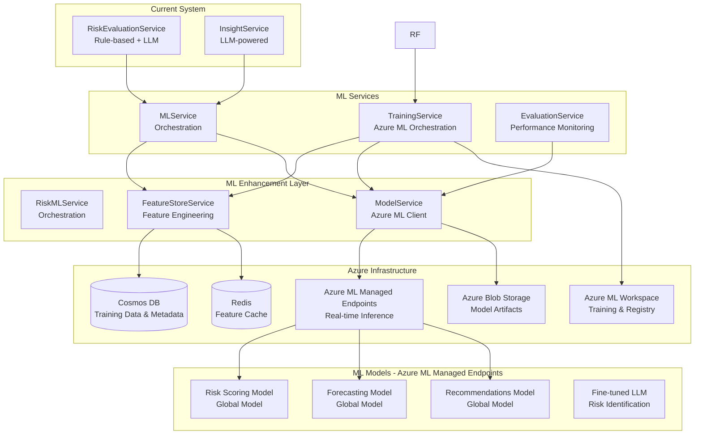

# Castiel Platform: Current Implementation Status & Machine Learning Plan

**Date:** January 2025  
**Status:** Production-Ready Core Platform | ML System - Planned  
**Version:** 1.0

---

## Executive Summary

Castiel is an AI-native business intelligence platform that unifies business data and provides intelligent insights. The core platform is **production-ready** with comprehensive AI capabilities, integrations, and risk analysis features. The **Machine Learning (ML) system** is fully documented and planned, ready for implementation focusing on **three priority use cases**: Risk Scoring, Revenue Forecasting, and Recommendations.

### Key Highlights

- ✅ **Core Platform**: 100% operational, production-ready
- ✅ **AI/LLM System**: Fully implemented with advanced features
- ✅ **Risk Analysis**: Rule-based and LLM-powered risk evaluation operational
- 📋 **ML System**: Comprehensive documentation complete, implementation ready
- 🎯 **ML Focus**: Risk Scoring, Revenue Forecasting, Recommendations (3 priority use cases)

---

## Part 1: Current Application State

### 1.1 Platform Architecture

Castiel is built as a **monorepo microservices architecture** deployed on **Microsoft Azure**:

```
┌─────────────────────────────────────────────────────────────┐
│                    Castiel Platform                         │
├─────────────────────────────────────────────────────────────┤
│                                                              │
│  Frontend (Next.js 16 + React 19)                          │
│  ├── Web Application (apps/web)                              │
│  └── Real-time UI Components                                 │
│                                                              │
│  Backend API (Fastify + TypeScript)                         │
│  ├── REST API (apps/api)                                     │
│  ├── 100+ Services                                           │
│  └── Azure Container Apps                                    │
│                                                              │
│  Workers (Background Processing)                            │
│  ├── Ingestion Workers                                       │
│  ├── Processing Workers                                      │
│  └── Sync Workers                                            │
│                                                              │
│  Infrastructure (Azure)                                      │
│  ├── Cosmos DB (Data Storage)                                │
│  ├── Redis (Caching)                                         │
│  ├── Azure Blob Storage                                      │
│  ├── Service Bus (Message Queuing)                           │
│  └── Application Insights (Monitoring)                       │
└─────────────────────────────────────────────────────────────┘
```

### 1.2 Core Features - Implemented ✅

#### AI & Intelligence Core

**Status:** ✅ **100% Operational**

- **AI Insights Service** - Comprehensive AI-powered insight generation
  - Context-aware responses with RAG (Retrieval-Augmented Generation)
  - Multi-model support (GPT-4, GPT-3.5, Claude, etc.)
  - Function calling for tool integration
  - Web search integration
  - Conversation context management
  
- **Vector Search** - Semantic search across all data
  - Embedding generation with templates
  - Hybrid search (vector + keyword)
  - Field-weighted scoring
  - Template-aware search

- **Prompt Management** - Dynamic prompt system
  - Project-specific prompts
  - Prompt analytics and performance tracking
  - Model selection configuration
  - Cost tracking and optimization

- **Context Assembly** - Intelligent context building
  - Project context resolution
  - Shard-specific Q&A
  - Context quality assessment
  - Context caching

#### Risk Analysis System

**Status:** ✅ **Operational (Rule-based + LLM)**

- **Risk Evaluation Service** - Comprehensive risk analysis
  - Rule-based risk detection
  - Historical pattern matching
  - LLM-powered risk identification
  - Risk scoring (0-1 scale)
  - Category-based risk scores (6 categories)
  - Revenue at risk calculation

- **Risk Categories:**
  - Commercial
  - Technical
  - Legal
  - Financial
  - Competitive
  - Operational

- **Risk Features:**
  - Risk snapshots (historical tracking)
  - Risk explainability
  - Mitigation recommendations
  - Trust level assessment
  - Data quality warnings

#### Data Integration & Management

**Status:** ✅ **Production-Ready**

- **External Integrations:**
  - Salesforce (Opportunities, Accounts, Contacts)
  - Google Drive / SharePoint (Documents)
  - Slack (Messages, Channels)
  - Zoom (Meetings, Recordings)
  - Gong (Sales Calls, Analytics)
  - Microsoft 365 (Email, Calendar)
  - And more...

- **Data Processing:**
  - Automated data ingestion
  - Data normalization
  - Entity extraction (LLM-based)
  - Project auto-attachment
  - Change feed processing

- **Data Management:**
  - Multi-tenant data isolation
  - Shard-based data model
  - Relationship tracking
  - Document management
  - PII detection and redaction

#### Analytics & Reporting

**Status:** ✅ **Operational**

- **Manager Dashboard** - Executive insights
- **Pipeline Analytics** - Sales pipeline analysis
- **Quota Management** - Revenue quota tracking
- **Benchmarking** - Performance comparisons
- **Revenue Forecasting** - Basic forecasting (probability-weighted)
- **Revenue at Risk** - Risk-adjusted revenue calculations

#### Security & Compliance

**Status:** ✅ **Enterprise-Grade**

- **Authentication:**
  - Multi-factor authentication (MFA)
  - SSO (SAML, OIDC)
  - Enterprise SSO (Azure AD, Okta, Google Workspace)
  - Role-based access control (RBAC)

- **Data Security:**
  - PII detection and redaction
  - Field-level security
  - Citation validation
  - Prompt injection defense
  - Comprehensive audit trails

### 1.3 Technical Stack

**Backend:**
- **Runtime:** Node.js 20+, TypeScript 5
- **Framework:** Fastify
- **Database:** Azure Cosmos DB (NoSQL)
- **Cache:** Azure Cache for Redis
- **Storage:** Azure Blob Storage
- **Messaging:** Azure Service Bus
- **Monitoring:** Azure Application Insights

**Frontend:**
- **Framework:** Next.js 16 (App Router)
- **UI Library:** React 19
- **Styling:** Tailwind CSS
- **State Management:** React Hooks + Context

**AI/ML:**
- **LLM Providers:** Azure OpenAI, OpenAI, Anthropic (Claude)
- **Embeddings:** Azure OpenAI, OpenAI
- **Vector Search:** Custom implementation with Azure AI Search integration

**Infrastructure:**
- **Deployment:** Azure Container Apps
- **Orchestration:** Terraform (Infrastructure as Code)
- **CI/CD:** GitHub Actions (assumed)

### 1.4 Service Architecture

The platform uses a **modular service initialization framework** with services organized into logical groups:

1. **Core Services** - Monitoring, configuration, service registry
2. **Authentication Services** - Auth, MFA, SSO, OAuth
3. **AI Services** - Insights, conversations, context assembly
4. **Risk Services** - Risk evaluation, risk catalog, revenue at risk
5. **Data Services** - Shard repository, relationships, caching
6. **Integration Services** - External integrations, sync, adapters
7. **Analytics Services** - Dashboards, quotas, pipeline analytics
8. **Content Services** - Document generation, templates, content
9. **Collaboration Services** - Collaborative insights, sharing

**Total Services:** 100+ production services

### 1.5 Current Limitations & Gaps

While the core platform is production-ready, the following areas are identified for enhancement:

1. **Machine Learning System** - Not yet implemented (documented, ready for implementation)
2. **Advanced Forecasting** - Basic forecasting exists, ML-enhanced forecasting planned
3. **Predictive Analytics** - Limited to rule-based and LLM, ML predictions planned
4. **Anomaly Detection** - Not implemented
5. **Recommendation Systems** - Basic recommendations exist, ML-enhanced planned

---

## Part 2: Machine Learning Implementation Plan

### 2.1 ML System Overview

The Machine Learning system will enhance Castiel's capabilities with **predictive models** for three priority use cases: **Risk Scoring**, **Revenue Forecasting**, and **Recommendations**. Models learn from historical data and improve over time.

**Status:** 📋 **Planned** - Comprehensive documentation complete, ready for implementation

**Architecture:** Azure ML Workspace-based approach:
- **Azure ML Workspace** for managed training (Subscription: `main`, Resource Group: `castiel-ml-dev-rg`, Region: `eastus`)
- **Azure ML Compute Clusters** for training (managed, auto-scaling, small-team friendly)
- **Azure ML AutoML** for full automated model selection, feature engineering, and hyperparameter tuning
- **Azure ML Managed Endpoints** for model serving (auto-scaling, high availability, public endpoints initially)
- **Synthetic Data Augmentation** for initial training (limited historical data)
- **Traditional ML models** (XGBoost/LightGBM via AutoML) for the three priority use cases
- **Fine-tuned LLMs** via Azure ML for risk identification enhancement (Phase 4, only if criteria met - see [ML_OPERATIONAL_STANDARDS.md](ML_OPERATIONAL_STANDARDS.md))

### 2.2 ML System Goals

#### Priority Use Cases (Phase 1)

1. **⭐ Risk Scoring**
   - ML-powered risk score predictions (0-1 scale)
   - Category-specific risk scores
   - Confidence intervals and uncertainty quantification
   - Multi-level aggregation (opportunity → account → team → tenant)
   - Global model with industry fine-tuning when justified

2. **⭐ Revenue Forecasting**
   - **Opportunity Level:** Revenue forecasts with uncertainty
   - **Team Level:** Pipeline, win rate forecasts
   - **Tenant Level:** Total revenue, growth rate forecasts
   - Industry seasonality features
   - Global model with industry fine-tuning when justified

3. **⭐ Recommendations**
   - ML-enhanced recommendation system
   - Better personalization and ranking
   - Improved user engagement
   - Global model with industry fine-tuning when justified

#### Future Enhancements (Phase 2+)

4. **Outcome Prediction** - Won/lost probability predictions
5. **Anomaly Detection** - Unusual patterns in opportunities
6. **Pattern Recognition** - Winning/losing patterns, seasonal trends
7. **Customer Churn** - Account/opportunity churn risk

### 2.3 ML System Architecture

#### High-Level Architecture



#### Component Overview

**1. RiskMLService** - Main orchestration service
- Coordinates ML predictions with existing risk detection
- Combines LLM and ML predictions
- Manages prediction caching

**2. FeatureStoreService** - Feature engineering
- Extracts features from opportunities, risks, related entities
- Performs feature transformations
- Caches features for performance

**3. ModelService** - Model management
- Model versioning and registry
- Model loading and inference
- A/B testing between versions

**4. TrainingService** - Training orchestration
- Prepares training datasets
- Triggers training jobs
- Coordinates hyperparameter optimization

**5. EvaluationService** - Performance monitoring
- Calculates model metrics
- Detects model drift
- Triggers retraining when needed

**6. RiskFeedbackService** - Feedback collection
- Tracks user feedback on predictions
- Links predictions to outcomes
- Collects data for continuous learning

### 2.4 ML Models

#### Model Types

1. **Risk Scoring Model** (Regression)
   - **Type:** XGBoost Regression
   - **Output:** Risk score (0-1)
   - **Features:** Opportunity features, risk features, historical features
   - **Target:** >85% accuracy (R² score)

2. **Outcome Prediction Model** (Binary Classification)
   - **Type:** XGBoost Classification
   - **Output:** Won probability (0-1)
   - **Features:** Opportunity features, risk scores, historical patterns
   - **Target:** >80% accuracy (AUC-ROC)

3. **Mitigation Recommendation Model** (Ranking)
   - **Type:** XGBoost Ranking
   - **Output:** Ranked list of mitigation actions
   - **Features:** Risk categories, opportunity context, historical effectiveness
   - **Target:** >75% NDCG (Normalized Discounted Cumulative Gain)

4. **Fine-tuned LLM** (Risk Identification Enhancement) - **Phase 4, deferred** (see [ML_OPERATIONAL_STANDARDS.md](ML_OPERATIONAL_STANDARDS.md))
   - **Type:** Fine-tuned GPT-4 or GPT-3.5
   - **Purpose:** Enhanced risk identification from unstructured data
   - **Training Data:** Historical risk snapshots with expert annotations

### 2.5 Integration with Existing System

#### LLM-ML Integration Pattern

**Recommended Approach:** Sequential Hybrid Pattern

```
1. LLM analyzes opportunity context → Identifies risks
2. Feature extraction from opportunity + LLM risks
3. ML models score risks and predict outcomes
4. LLM generates explanations using ML predictions
5. Combined result returned to user
```

**Benefits:**
- Leverages strengths of both: LLM for unstructured, ML for structured
- LLM can explain ML predictions
- ML can use LLM risk identifications as features
- Provides explainability through LLM-generated explanations

#### Service Integration Points

1. **RiskEvaluationService Enhancement**
   - Current: Rule-based → Historical → LLM → Risk Evaluation
   - Enhanced: Rule-based → Historical → LLM → **ML Enhancement** → Risk Evaluation
   - ML provides: Risk scores, outcome predictions, mitigation recommendations

2. **InsightService Integration**
   - ML predictions included in AI insights
   - LLM explains ML predictions
   - Feature importance included in explanations

3. **Forecasting Services Enhancement**
   - Current: Basic probability-weighted forecasting
   - Enhanced: ML-powered forecasting with uncertainty quantification
   - Multi-level forecasting (opportunity/team/tenant)

### 2.6 Azure Infrastructure Plan

#### Recommended Architecture

**Training Infrastructure:**
- **Azure ML Workspace** - Managed ML platform for training (Subscription: `main`, Resource Group: `castiel-ml-dev-rg`, Region: `eastus`)
- **Azure ML Compute Clusters** - Managed, auto-scaling compute for training jobs (small-team friendly)
- **Azure ML AutoML** - Full automated model selection, feature engineering, and hyperparameter tuning
- **Azure ML Pipelines** - Training orchestration
- **Azure ML Datastores** - Versioned training datasets
- **Synthetic Data Augmentation** - SMOTE and statistical sampling for initial training (limited historical data)

**Inference Infrastructure:**
- **Azure ML Managed Endpoints** - Real-time model serving (auto-scaling, high availability)
- **Azure Blob Storage** - Model artifacts (managed by Azure ML)
- **Redis** - Feature caching and prediction caching
- **Cosmos DB** - Model metadata sync (from Azure ML Registry) and training data
- **Application Insights** - Unified monitoring for all ML metrics

**Rationale:**
- Consistent with existing Azure-first architecture
- Azure ML provides managed training and serving infrastructure
- Managed Endpoints provide auto-scaling and high availability
- Simple operations (no custom deployment code needed)
- Unified monitoring via Application Insights

### 2.7 Implementation Phases

#### Phase 1: Priority Use Cases (Weeks 1-8)

**Goal:** Implement the three priority use cases with global models, starting with RiskEvaluationService

**Implementation Priority:**
1. **RiskEvaluationService** (Weeks 1-4) - **START HERE** (highest impact, most critical)
2. **RevenueForecastService** (Weeks 5-6)
3. **RecommendationsService** (Weeks 7-8)

**Tasks:**
1. Set up Azure ML Workspace (Subscription: `main`, Resource Group: `castiel-ml-dev-rg`, Region: `eastus`)
2. Configure Azure ML Compute Clusters (managed, auto-scaling)
3. Set up separate Key Vault for ML secrets
4. Configure Full AutoML for automated model selection and training
5. Implement FeatureStoreService with new opportunity schema fields
6. Implement ModelService (Azure ML client)
7. Implement TrainingService (Azure ML orchestration with AutoML)
8. Implement synthetic data augmentation (SMOTE + statistical sampling)
9. Train 3 global models using Full AutoML:
   - **Risk Scoring Model** (Weeks 1-4) - **START HERE**
   - Revenue Forecasting Model (Weeks 5-6)
   - Recommendations Model (Weeks 7-8) - **XGBoost Ranker only** (see [ML_OPERATIONAL_STANDARDS.md](ML_OPERATIONAL_STANDARDS.md))
10. Deploy models to Azure ML Managed Endpoints (public endpoints initially)
11. Integrate with existing services (integrated architecture, not separate microservices):
    - RiskEvaluationService (Risk Scoring) - **Weeks 1-4**
    - RevenueForecastService (Revenue Forecasting) - **Weeks 5-6**
    - RecommendationsService (Recommendations) - **Weeks 7-8**
12. Set up Application Insights monitoring (use existing instance)
13. Implement event-based cache invalidation (cache invalidated when opportunity changes)

**Deliverables:**
- Azure ML Workspace operational with Compute Clusters
- Full AutoML configured and operational
- Synthetic data augmentation pipeline operational
- 3 global models trained and deployed (via AutoML)
- Azure ML Managed Endpoints operational (public endpoints)
- ML predictions integrated into existing services (integrated architecture)
- Event-based cache invalidation implemented
- Unified monitoring via Application Insights

#### Phase 2: Industry Analysis & Fine-Tuning (Weeks 9-12)

**Goal:** Evaluate per-industry performance and add industry-specific models when justified

**Tasks:**
1. Evaluate global model performance per industry
2. Identify industries with >3000 examples
3. Fine-tune industry-specific models (when >5% improvement)
4. Deploy industry models to Managed Endpoints
5. Update model selection logic
6. Monitor and compare performance
7. **Recommendations:** Evaluate NCF only if XGBoost Ranker CTR plateaus (see [ML_OPERATIONAL_STANDARDS.md](ML_OPERATIONAL_STANDARDS.md))
8. **Async Inference:** Add async inference mode for batch forecasts and dashboards (see [ML_OPERATIONAL_STANDARDS.md](ML_OPERATIONAL_STANDARDS.md))

**Deliverables:**
- Industry performance analysis complete
- Industry-specific models added (2-5 models expected)
- Model selection logic operational
- Recommendations: XGBoost Ranker stable, NCF evaluation if needed
- Async inference mode operational (queue-based for batch/dashboards)

#### Phase 3: Continuous Learning (Weeks 13-16)

**Goal:** Implement feedback loops and continuous improvement

**Tasks:**
1. Implement MLFeedbackService (for all 3 use cases)
2. Implement EvaluationService
3. Set up drift detection (via Application Insights)
4. Implement automatic retraining triggers
5. Build feedback collection UI
6. Performance monitoring dashboards (Application Insights)

**Deliverables:**
- Feedback collection operational for all 3 use cases
- Continuous learning enabled
- Model performance monitoring active
- Automated retraining pipeline

#### Phase 4: Advanced Features (Weeks 17-20)

**Goal:** Additional optimizations and future use cases

**Tasks:**
1. Fine-tune LLM for risk identification (via Azure ML)
2. Performance optimizations (model quantization if needed)
3. Advanced explainability features
4. Additional use cases (if needed):
   - Outcome Prediction
   - Anomaly Detection
   - Pattern Recognition
   - Customer Churn

**Deliverables:**
- LLM fine-tuning evaluated (only if criteria met)
- Optimized inference performance
- Advanced features operational (if implemented)

### 2.8 Success Metrics

#### Technical Metrics

- **Model Accuracy:**
  - Risk Scoring: >85% R² score
  - Revenue Forecasting: <15% MAPE
  - Recommendations: >80% user engagement (CTR)

- **Performance:**
  - Inference Latency: <500ms per model (via Azure ML Managed Endpoints)
  - End-to-End Latency: <5 seconds (including feature extraction and ML)
  - Training Time: <2 hours (ML models), <24 hours (LLM fine-tuning)

- **Reliability:**
  - Model Uptime: >99.9% (Azure ML Managed Endpoints SLA)
  - Prediction Error Rate: <1%
  - Training Success Rate: >95%

#### Business Metrics

- **Risk Detection Improvement:**
  - Increase in risk detection accuracy
  - Reduction in false positives
  - Earlier risk identification

- **Forecasting Accuracy:**
  - Improvement in revenue forecast accuracy (<15% MAPE)
  - Better close date predictions
  - More accurate pipeline forecasts (opportunity/team/tenant levels)

- **Recommendations Quality:**
  - Improved user engagement (CTR)
  - Better personalization
  - Higher user satisfaction

- **User Adoption:**
  - User engagement with ML predictions
  - Feedback collection rate
  - Trust in ML recommendations

### 2.9 Risk Mitigation

#### Technical Risks

1. **Model Performance**
   - **Risk:** Models don't meet accuracy targets
   - **Mitigation:** Extensive validation, A/B testing, gradual rollout

2. **Data Quality**
   - **Risk:** Poor training data quality
   - **Mitigation:** Data validation, quality checks, outlier detection

3. **Integration Complexity**
   - **Risk:** Complex integration with existing system
   - **Mitigation:** Phased approach, fallback mechanisms, extensive testing

4. **Performance Impact**
   - **Risk:** ML predictions slow down system
   - **Mitigation:** Caching, async processing, performance optimization

#### Business Risks

1. **User Trust**
   - **Risk:** Users don't trust ML predictions
   - **Mitigation:** Explainability, transparency, gradual introduction

2. **Change Management**
   - **Risk:** Users resist ML-enhanced features
   - **Mitigation:** Training, documentation, gradual rollout

### 2.10 Dependencies & Prerequisites

#### Technical Prerequisites

- ✅ Azure ML Workspace access (Subscription: `main`, Resource Group: `castiel-ml-dev-rg`, Region: `eastus`)
- ✅ Azure ML Compute Clusters configured
- ✅ Azure ML Managed Endpoints capability
- ⚠️ Limited historical data (using synthetic data augmentation for initial training)
- ✅ Model monitoring infrastructure (Application Insights)
- ✅ Feature engineering pipeline
- ✅ New opportunity schema fields added (daysInStage, daysSinceLastActivity, dealVelocity, competitorCount, stakeholderCount, documentCount, emailCount, meetingCount)

#### Data Prerequisites

- ✅ Historical risk snapshots (training data)
- ✅ Outcome data (won/lost opportunities)
- ✅ Feature data (opportunities, related entities)
- ✅ Feedback data (user interactions)

#### Team Prerequisites

- ML Engineer for model development
- Data Engineer for feature engineering
- DevOps Engineer for infrastructure
- Product Manager for prioritization

---

## Part 3: Roadmap Summary

### Current State (Q1 2025)

- ✅ Core platform production-ready
- ✅ AI/LLM system fully operational
- ✅ Risk analysis (rule-based + LLM) operational
- ✅ Basic forecasting available
- 📋 ML system documented and planned

### Near-Term (Q2 2025)

- 🎯 Phase 1: Priority Use Cases (Weeks 1-8)
  - Risk Scoring Model (global)
  - Revenue Forecasting Model (global)
  - Recommendations Model (global)
  - Azure ML Managed Endpoints deployment
  - Integration with existing services

### Mid-Term (Q3 2025)

- 🎯 Phase 2: Industry Analysis & Fine-Tuning (Weeks 9-12)
  - Per-industry performance evaluation
  - Industry-specific models (when justified)
- 🎯 Phase 3: Continuous Learning (Weeks 13-16)
  - Feedback loops operational
  - Automated retraining

### Long-Term (Q4 2025)

- 🎯 Phase 4: Advanced Features (Weeks 17-20)
  - LLM fine-tuning (via Azure ML)
  - Performance optimizations
  - Additional use cases (if needed)

---

## Conclusion

Castiel's core platform is **production-ready** with comprehensive AI capabilities. The **Machine Learning system** is fully documented and ready for implementation, focusing on **three priority use cases**: Risk Scoring, Revenue Forecasting, and Recommendations.

The ML implementation will:
- Enhance existing risk analysis with ML-powered risk scoring
- Provide advanced revenue forecasting at multiple levels (opportunity/team/tenant)
- Enhance recommendations with ML-powered personalization
- Leverage Azure ML Workspace for managed training (simple operations)
- Use Azure ML Managed Endpoints for model serving (auto-scaling, high availability)
- Maintain consistency with existing Azure-first architecture
- Integrate seamlessly with current LLM-powered features

**Next Steps:**
1. Review and approve ML implementation plan
2. Allocate resources (ML Engineer, Data Engineer, DevOps)
3. Set up Azure ML Workspace
4. Begin Phase 1 implementation

---

## Document Status

- ✅ Current state documented
- ✅ ML plan documented
- ✅ Roadmap defined
- ⏳ Awaiting stakeholder approval
- ⏳ Implementation ready to begin

**Last Updated:** January 2025  
**Next Review:** After Phase 1 completion
