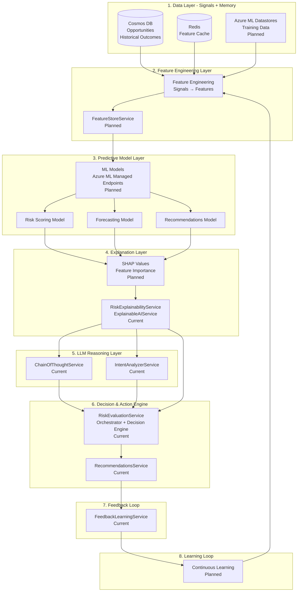
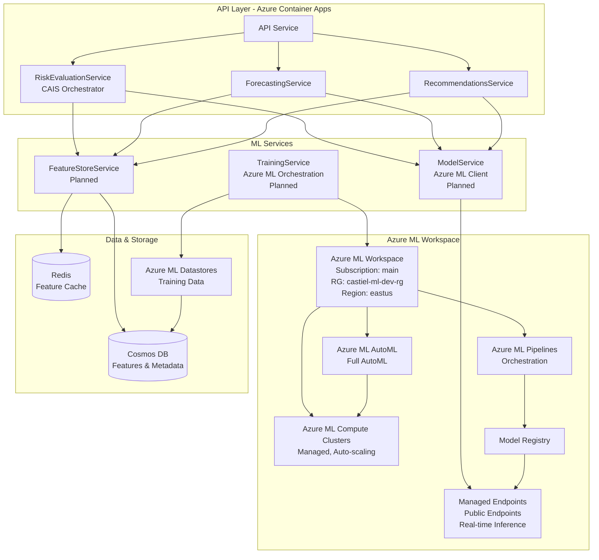
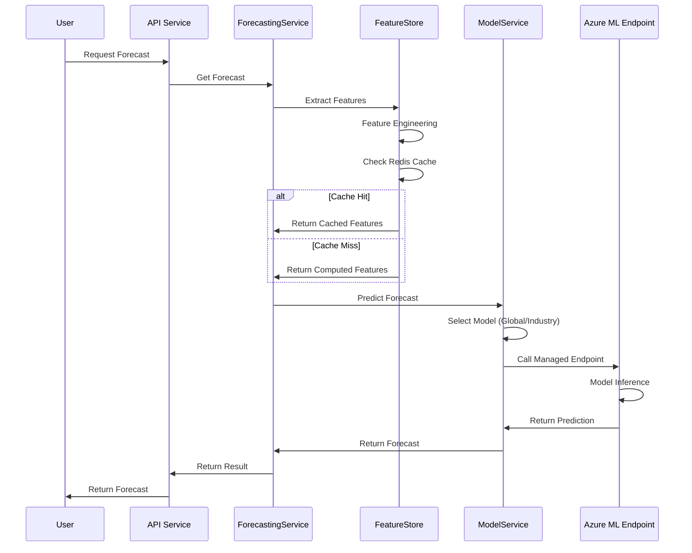
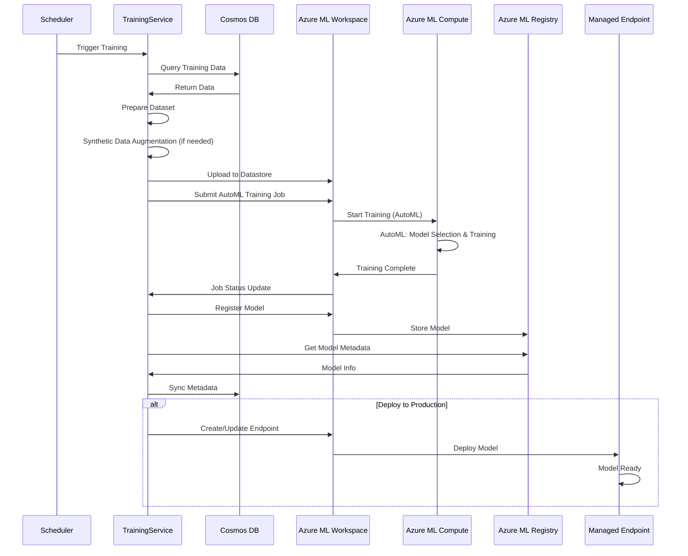

# Machine Learning System - High-Level Overview

**Date:** January 2025  
**Status:** 📋 **PLANNED** - Ready for Implementation  
**Version:** 1.0

---

## Executive Summary

The Castiel Machine Learning System enhances the platform with predictive capabilities for **three priority use cases**: **Risk Scoring**, **Revenue Forecasting**, and **Recommendations**. The system leverages **Azure ML Workspace** for managed training and **Azure ML Managed Endpoints** for model serving, providing a simple, maintainable solution optimized for a small team while maximizing Azure services usage.

**Key Design Principles:**
- **Azure-First**: Maximize use of Azure managed services
- **Simple Maintenance**: Minimal custom infrastructure, managed services where possible
- **Small Team Friendly**: Easy deployment, monitoring, and operations
- **High Performance**: Optimized for accuracy and latency

---

## Compound AI System (CAIS) Architecture

The Castiel ML system is architected as a **Compound AI System (CAIS)**—a system that orchestrates multiple AI components working together in a decision loop. The ML models are **components** within the CAIS, not the CAIS itself.

### What is CAIS?

A Compound AI System is not a single model. It is a system architecture that orchestrates:

- **Predictive ML Models** (this document focuses on these) - Learn patterns, make predictions
- **LLMs** - Explain predictions, generate natural language, suggest actions
- **Rules / Heuristics** - Enforce business logic, provide deterministic decisions
- **Memory / Historical Data** - Past outcomes, patterns, context
- **Feedback Loops** - User feedback, outcome tracking, continuous improvement
- **Tools** - CRM integrations, email, calendar, analytics

**Key Distinction:**
- **ML Model**: Learns patterns from signals, makes numeric predictions (win probability, risk scores)
- **CAIS**: Orchestrates ML + LLM + Rules + Memory + Feedback to turn predictions into explainable, actionable decisions

### CAIS Layers

The system is organized into eight CAIS layers:

1. **Data Layer** (Signals + Memory) - Cosmos DB, Redis, Azure ML Datastores
2. **Feature Engineering Layer** - FeatureStoreService (planned) - Transforms signals to features
3. **Predictive Model Layer** - Azure ML Managed Endpoints - ML models make predictions
4. **Explanation Layer** - SHAP values, feature importance - Explains ML predictions
5. **LLM Reasoning Layer** - ChainOfThoughtService, IntentAnalyzerService - Natural language reasoning
6. **Decision & Action Engine** - RiskEvaluationService, RecommendationsService - Combines rules + AI, executes actions
7. **Feedback Loop** - FeedbackLearningService - Collects user feedback and outcomes
8. **Learning Loop** - Continuous Learning (planned) - Improves system over time

### Current State vs. Target State

**Current State (Rule-based + LLM):**
- ✅ Data Layer: Cosmos DB, Redis
- ✅ Feature Engineering: Feature extraction in services
- ✅ Predictive Model: Rule-based heuristics (stage-based probability)
- ✅ Explanation Layer: RiskExplainabilityService, ExplainableAIService
- ✅ LLM Reasoning: ChainOfThoughtService, IntentAnalyzerService
- ✅ Decision & Action: RiskEvaluationService, RecommendationsService
- ✅ Feedback Loop: FeedbackLearningService
- 📋 Learning Loop: Manual retraining (planned: automated)

**Target State (Full CAIS with ML):**
- ✅ Data Layer: Cosmos DB, Redis, Azure ML Datastores
- 📋 Feature Engineering: FeatureStoreService (planned)
- 📋 Predictive Model: Azure ML Managed Endpoints (planned)
- 📋 Explanation Layer: SHAP integration (planned)
- ✅ LLM Reasoning: Enhanced with ML context (current + planned)
- ✅ Decision & Action: Enhanced with ML predictions (current + planned)
- ✅ Feedback Loop: Extended for ML feedback (current + planned)
- 📋 Learning Loop: Automated continuous learning (planned)

For detailed CAIS architecture, see [CAIS_ARCHITECTURE.md](CAIS_ARCHITECTURE.md).  
For orchestration patterns, see [CAIS_ORCHESTRATION.md](CAIS_ORCHESTRATION.md).

---

## Priority Use Cases

### 1. Risk Scoring ⭐

**Purpose:** ML-powered risk score predictions to enhance existing risk analysis

**Capabilities:**
- Predicts risk scores (0-1 scale) for opportunities
- Category-specific risk scores (Commercial, Technical, Financial, etc.)
- Multi-level aggregation (opportunity → account → team → tenant)
- Confidence intervals and uncertainty quantification
- Integrates with existing RiskEvaluationService

**Model Type:** Regression (XGBoost/LightGBM via AutoML)  
**Target Metric:** >85% R² score, Calibration Error <0.05, Brier Score <0.15  
**Implementation:** Weeks 1-4 (START HERE - highest impact)

---

### 2. Revenue Forecasting ⭐

**Purpose:** ML-powered revenue forecasts at multiple levels

**Capabilities:**
- **Opportunity Level:** Revenue forecasts with uncertainty
- **Team Level:** Pipeline and win rate forecasts
- **Tenant Level:** Total revenue and growth rate forecasts
- Industry seasonality features
- Scenario-based forecasting (best/base/worst case)

**Model Type:** Regression / Time Series (XGBoost/LightGBM via AutoML)  
**Target Metric:** <15% MAPE, Forecast Bias <5%, R² >0.75  
**Implementation:** Weeks 5-6

---

### 3. Recommendations ⭐

**Purpose:** ML-enhanced recommendation system for better personalization

**Capabilities:**
- Improved recommendation ranking and personalization
- Better user engagement and click-through rates
- Context-aware recommendations
- Integrates with existing RecommendationsService

**Model Type:** Ranking (XGBoost Ranker via AutoML, Phase 1)  
**Target Metric:** NDCG@10 >0.75, CTR Uplift >20%, Precision@10 >0.50  
**Implementation:** Weeks 7-8

---

## System Architecture

### CAIS Architecture Overview

The system follows a Compound AI System (CAIS) architecture with eight distinct layers:



**Legend:**
- ✅ **Current**: Implemented and operational
- 📋 **Planned**: Target architecture (ML models not yet implemented)

### High-Level Architecture (ML Services Focus)

This diagram focuses on the ML services and Azure ML infrastructure:



### Key Components

**1. Feature Store Service** (CAIS Layer 2: Feature Engineering)
- Extracts features from opportunities and related entities
- Performs feature engineering (encoding, normalization, temporal)
- Transforms signals (raw opportunity data) into machine-readable features
- Caches features in Redis for performance
- Stores features in Cosmos DB for training
- **Status**: 📋 Planned

**2. Model Service** (CAIS Layer 3: Predictive Model)
- Manages model selection (global vs. industry-specific)
- Calls Azure ML Managed Endpoints for predictions
- Caches predictions in Redis
- Syncs model metadata from Azure ML Registry to Cosmos DB
- **Status**: 📋 Planned

**3. Training Service** (CAIS Layer 8: Learning Loop)
- Orchestrates training via Azure ML Workspace
- Prepares training datasets (exports to Azure ML Datastores)
- Monitors training job status
- Registers trained models to Azure ML Registry
- **Status**: 📋 Planned

**4. Evaluation Service** (CAIS Layer 8: Learning Loop)
- Tracks model performance over time
- Monitors for three distinct drift types:
  - Feature distribution drift (input data changes)
  - Prediction distribution drift (model behavior changes)
  - Outcome drift (performance degradation - most critical)
- Triggers retraining when needed
- Logs metrics to Application Insights
- **Status**: 📋 Planned

**5. RiskEvaluationService** (CAIS Layer 6: Decision & Action Engine)
- **Current**: Orchestrates rule-based, historical, and AI risk detection
- **Planned**: Enhanced with ML predictions
- Acts as both orchestrator (combines detection methods) and decision engine (executes actions)
- **Status**: ✅ Current (enhanced with ML planned)

**6. Explanation Services** (CAIS Layer 4: Explanation + Layer 5: LLM Reasoning)
- **RiskExplainabilityService**: Provides structured explanations for risk detections
- **ExplainableAIService**: General explainability for AI responses
- **ChainOfThoughtService**: Multi-step LLM reasoning
- **IntentAnalyzerService**: Intent classification and entity extraction
- **Status**: ✅ Current (SHAP integration planned)

**7. FeedbackLearningService** (CAIS Layer 7: Feedback Loop)
- Collects user feedback on AI responses
- Tracks outcomes for continuous improvement
- **Status**: ✅ Current (ML feedback extension planned)

---

## Model Architecture Strategy

### Hybrid Approach: Global Models + Industry Fine-Tuning

**Phase 1: Global Models (Initial Implementation)**
- **3 global models** (one per priority use case):
  - Global Risk Scoring Model
  - Global Forecasting Model
  - Global Recommendations Model
- Each model trained on **all industries** with industry as a feature
- Industry-specific patterns captured through:
  - Industry as categorical/embedding feature
  - Industry-specific baselines (win rates, risk baselines)
  - Industry-specific features (seasonality, patterns)
- Works immediately for all industries, including new ones

**Phase 2: Industry-Specific Models (When Justified)**
- Add industry-specific models only when:
  - **Data Threshold**: >3000 examples with outcomes for that industry
  - **Performance Improvement**: >5% better than global model (validated)
  - **Business Value**: High-value industry or distinct patterns
- Industry models are **fine-tuned from global models** (transfer learning)
- Expected: 3-15 total models (vs. 48+ with pure industry approach)

### Model Selection Logic

```typescript
// 1. Check for industry-specific model (if industry provided)
if (industryId) {
  const industryModel = await getIndustryModel(modelType, industryId);
  if (industryModel && industryModel.performanceImprovement > 0.05) {
    return industryModel.endpointUrl; // Use industry model
  }
}

// 2. Fall back to global model
const globalModel = await getGlobalModel(modelType);
return globalModel.endpointUrl; // Use global model
```

### Benefits

1. **Data Efficiency**: Leverages all available data across industries
2. **Maintenance**: 3-15 models vs. 48+ models (much lower overhead)
3. **Performance**: Good performance for all industries (global model works for all)
4. **Scalability**: New industries work immediately with global model
5. **Cost**: Lower training, deployment, and monitoring costs

---

## Azure Services Architecture

### Training Infrastructure

**Azure ML Workspace (Primary Platform)**
- **Subscription**: `main`
- **Resource Group**: `castiel-ml-{environment}-rg` (e.g., `castiel-ml-dev-rg`, `castiel-ml-prod-rg`)
- **Region**: `eastus` (same as Cosmos DB/Redis for latency, matches existing infrastructure)
- **Azure ML Compute Clusters**: Managed, auto-scaling compute for training jobs
  - Small-team friendly (no infrastructure management)
  - Auto-scales based on workload
  - Pay-per-use pricing (scale to zero when idle)
  - Supports GPU for deep learning (Phase 2: NCF if needed)
- **Azure ML AutoML**: Full automated model selection, feature engineering, and hyperparameter tuning
  - Automated model selection (XGBoost, LightGBM, Random Forest, etc.)
  - Automated feature engineering and selection
  - Automated hyperparameter tuning
  - Best model selection based on cross-validation
- **Azure ML Pipelines**: Training orchestration
  - Scheduled retraining (weekly)
  - Data preparation → Synthetic Data Augmentation → Training → Evaluation → Deployment
  - Versioned pipeline runs
- **Azure ML Model Registry**: Model versioning and management
  - Semantic versioning
  - Model metadata
  - A/B testing configuration
  - Sync to Cosmos DB for application access
- **Azure ML Datastores**: Training data management
  - Versioned datasets
  - Linked to Cosmos DB and Blob Storage
  - Training data exports (with synthetic data augmentation)

### Inference Infrastructure

**Azure ML Managed Endpoints**
- **Real-time inference**: REST API endpoints
- **Networking**: Public endpoints initially (can migrate to private VNet endpoints later)
- **Auto-scaling**: 0-10 instances (configurable, min replicas = 0 for cost control)
- **High Availability**: Automatic failover
- **Authentication**: Managed Identity (system-assigned, aligns with existing infrastructure pattern)
- **Versioning**: Support for multiple model versions
- **A/B Testing**: Traffic splitting between versions (canary deployments)

### Data & Storage

**Cosmos DB**
- Feature storage and model metadata sync
- Training data source
- Feedback collection

**Redis**
- Feature caching with event-based invalidation (invalidated when opportunity changes)
- Prediction caching with event-based invalidation (invalidated when opportunity changes)
- No fixed TTL - cache persists until opportunity is updated

**Azure Blob Storage**
- Model artifacts (managed by Azure ML)
- Versioned storage

### Monitoring

**Application Insights (Unified)**
- All ML metrics in Application Insights
- Custom dashboards for ML-specific metrics
- Alerts configured in Application Insights
- No separate ML monitoring needed

---

## Data Flow

### Inference Flow



### Training Flow



---

## Integration with Existing System

### Service Integration

**1. Risk Scoring Integration:**
- Enhances existing `RiskEvaluationService`
- ML model provides risk scores via Azure ML endpoint
- Combines with rule-based and LLM risk detection
- Multi-level aggregation (opportunity → account → team → tenant)

**2. Revenue Forecasting Integration:**
- New or enhanced `ForecastingService`
- ML model provides forecasts via Azure ML endpoint
- Multi-level forecasting (opportunity → team → tenant)
- Industry seasonality captured in features

**3. Recommendations Integration:**
- Enhances existing `RecommendationsService`
- ML model improves recommendation quality via Azure ML endpoint
- Combines with existing vector search and collaborative filtering
- Better personalization and ranking

### Integration Pattern

**API Service → ML Service → Azure ML Endpoint:**
1. API service receives request
2. Calls FeatureStoreService to extract features
3. Calls ModelService with features
4. ModelService calls Azure ML Managed Endpoint
5. Returns prediction to API service
6. API service returns result to user

---

## Model Types & Metrics

### Model Types

```typescript
type ModelType = 
  | 'risk_scoring'      // Risk score prediction (0-1)
  | 'forecasting'       // Revenue forecasting
  | 'recommendations'   // Recommendation ranking
  | 'llm_fine_tuned';   // Fine-tuned LLM for risk identification
```

### Performance Targets

**Risk Scoring:**
- **Target:** >85% R² score, Calibration Error <0.05, Brier Score <0.15, AUC >0.80
- **Metrics:** MSE, MAE, RMSE, R², Calibration Error, Brier Score, AUC

**Revenue Forecasting:**
- **Target:** <15% MAPE, Forecast Bias <5%, R² >0.75
- **Metrics:** MAPE, RMSE, R², Forecast Bias

**Recommendations:**
- **Target:** NDCG@10 >0.75, CTR Uplift >20%, Precision@10 >0.50
- **Metrics:** NDCG, Precision@K, Recall@K, MAP, CTR Uplift

**Inference Performance:**
- **Latency:** <500ms per model (via Azure ML Managed Endpoints)
- **End-to-End:** <5 seconds (including feature extraction)

---

## Implementation Phases

### Phase 1: Priority Use Cases (Weeks 1-8) ⭐

**Goal:** Implement the three priority use cases with global models, starting with RiskEvaluationService

**Implementation Priority:**
1. **RiskEvaluationService** (Weeks 1-4) - **START HERE** (highest impact, most critical)
2. **RevenueForecastService** (Weeks 5-6)
3. **RecommendationsService** (Weeks 7-8)

**Deliverables:**
- Azure ML Workspace operational (Subscription: `main`, RG: `castiel-ml-dev-rg`, Region: `eastus`)
- Azure ML Compute Clusters configured
- Full AutoML operational
- Synthetic data augmentation pipeline operational
- 3 global models trained and deployed (via AutoML)
- Azure ML Managed Endpoints operational (public endpoints)
- ML predictions integrated into existing services (integrated architecture)
- Event-based cache invalidation implemented
- Unified monitoring via Application Insights

**Timeline:**
- **Weeks 1-2:** Foundation (Azure ML setup, FeatureStoreService, synthetic data)
- **Weeks 3-4:** Risk Scoring Model (RiskEvaluationService integration) - **START HERE**
- **Weeks 5-6:** Revenue Forecasting Model (RevenueForecastService integration)
- **Weeks 7-8:** Recommendations Model (RecommendationsService integration)

### Phase 2: Industry Analysis & Fine-Tuning (Weeks 9-12)

**Goal:** Evaluate per-industry performance and add industry-specific models when justified

**Deliverables:**
- Industry performance analysis complete
- Industry-specific models added (2-5 models expected)
- Model selection logic operational

### Phase 3: Continuous Learning (Weeks 13-16)

**Goal:** Implement feedback loops and continuous improvement

**Deliverables:**
- Feedback collection operational for all 3 use cases
- Continuous learning enabled
- Model performance monitoring active
- Automated retraining pipeline

### Phase 4: Advanced Features (Weeks 17-20)

**Goal:** Additional optimizations and future use cases

**Deliverables:**
- LLM fine-tuning evaluated (Phase 4, only if criteria met - see [ML_OPERATIONAL_STANDARDS.md](ML_OPERATIONAL_STANDARDS.md))
- Optimized inference performance
- Advanced features operational (if implemented)

---

## Key Benefits

### For Small Team

✅ **No Custom Training Infrastructure**: Azure ML Workspace handles all training  
✅ **Managed Model Serving**: Azure ML Managed Endpoints (auto-scaling, high availability)  
✅ **Unified Monitoring**: Application Insights for all metrics (no separate ML monitoring)  
✅ **Simple Deployment**: Models deployed via Azure ML (no custom deployment code)  
✅ **Cost Effective**: Pay-per-use compute, auto-scale to zero  
✅ **Easy Operations**: Azure Portal for monitoring and management

### For Business

✅ **High Business Value**: Three priority use cases with immediate impact  
✅ **Scalable**: Works for all industries immediately, fine-tune when justified  
✅ **Maintainable**: 3-15 models vs. 48+ models (much lower overhead)  
✅ **Reliable**: Azure ML Managed Endpoints provide high availability  
✅ **Cost Efficient**: Leverages all data, optimized compute usage

---

## Technology Stack

### Azure Services

- **Azure ML Workspace**: Managed training platform
- **Azure ML Compute**: On-demand training compute
- **Azure ML Pipelines**: Training orchestration
- **Azure ML Model Registry**: Model versioning
- **Azure ML Managed Endpoints**: Real-time inference
- **Azure ML Datastores**: Training data management
- **Cosmos DB**: Feature storage, model metadata sync
- **Redis**: Feature and prediction caching
- **Azure Blob Storage**: Model artifacts (via Azure ML)
- **Application Insights**: Unified monitoring

### ML Libraries

- **XGBoost**: Primary ML algorithm (regression, ranking)
- **Azure ML SDK**: Azure ML integration
- **ONNX**: Model format for cross-platform compatibility

---

## Success Criteria

### Business-Level ML KPIs ⭐

**Critical:** Business metrics are **required for promotion to production** (see [ML_OPERATIONAL_STANDARDS.md](ML_OPERATIONAL_STANDARDS.md)). These metrics tie ML performance to business value and provide political and technical protection.

**Risk Scoring:**
- **Calibration Error:** <0.05 (5% calibration error)
- **Brier Score:** <0.15 (calibration quality)
- **Business Impact:** Risk score accuracy correlates with actual opportunity outcomes

**Revenue Forecasting:**
- **Bias over 30 days:** <5% (forecast vs. actual)
- **Bias over 60 days:** <10%
- **Bias over 90 days:** <15%
- **Business Impact:** Forecast accuracy improves business planning

**Recommendations:**
- **Incremental CTR vs non-ML baseline:** >10% improvement
- **User Engagement:** >80% user engagement with recommendations
- **Business Impact:** Recommendations drive user value

### Technical Success

- **Model Accuracy:**
  - Risk Scoring: >85% R²
  - Revenue Forecasting: <15% MAPE
  - Recommendations: >80% user engagement
- **Performance:**
  - Inference latency: <500ms per model
  - End-to-end latency: <5 seconds
  - System availability: >99.9%
- **Integration:**
  - Seamless LLM-ML integration
  - **Note:** LLM fine-tuning is deferred to Phase 4 and only considered if criteria are met (see [ML_OPERATIONAL_STANDARDS.md](ML_OPERATIONAL_STANDARDS.md)). Current hybrid approach (Rule-based + LLM + ML) is already very strong.
  - Graceful fallbacks
  - Consistent feature pipeline

### Business Success

- **Adoption:**
  - User engagement with ML predictions
  - Trust in ML recommendations
  - Feedback collection rate
- **Impact:**
  - Improved risk detection
  - Better forecasting accuracy
  - Enhanced recommendation quality
  - Cost optimization

---

## Documentation Structure

For detailed information, see:

### CAIS Architecture (New)
1. **[CAIS_ARCHITECTURE.md](CAIS_ARCHITECTURE.md)** - ⭐ **START HERE** - Comprehensive CAIS architecture, layers, and decision loop
2. **[CAIS_ORCHESTRATION.md](CAIS_ORCHESTRATION.md)** - Orchestration patterns, weighted ensemble, component integration

### System Architecture
3. **[ARCHITECTURE.md](ARCHITECTURE.md)** - Detailed system architecture, components, data flows
4. **[MODEL_ARCHITECTURE_RECOMMENDATION.md](MODEL_ARCHITECTURE_RECOMMENDATION.md)** - Model strategy analysis (global vs. industry)

### ML Components
5. **[FEATURE_ENGINEERING.md](FEATURE_ENGINEERING.md)** - Feature extraction and engineering (CAIS Layer 2)
6. **[TRAINING_PIPELINE.md](TRAINING_PIPELINE.md)** - Training workflows and Azure ML integration
7. **[MODEL_REGISTRY.md](MODEL_REGISTRY.md)** - Model versioning and Azure ML Registry
8. **[DEPLOYMENT.md](DEPLOYMENT.md)** - Azure ML Managed Endpoints deployment
9. **[API_REFERENCE.md](API_REFERENCE.md)** - ML service API endpoints
10. **[CONTINUOUS_LEARNING.md](CONTINUOUS_LEARNING.md)** - Feedback loops and continuous improvement (CAIS Layer 7-8)
11. **[USE_CASES_BEST_PRACTICES_AND_RECOMMENDATIONS.md](USE_CASES_BEST_PRACTICES_AND_RECOMMENDATIONS.md)** - Best practices for each use case

### Implementation & Operations
12. **[IMPLEMENTATION_STATUS_AND_PLAN.md](IMPLEMENTATION_STATUS_AND_PLAN.md)** - Implementation roadmap
13. **[IMPLEMENTATION_DECISIONS_SUMMARY.md](IMPLEMENTATION_DECISIONS_SUMMARY.md)** - Summary of all implementation decisions
14. **[ML_OPERATIONAL_STANDARDS.md](ML_OPERATIONAL_STANDARDS.md)** - Operational standards and must-do requirements

---

## Next Steps

1. **Review Architecture**: Ensure alignment with team capabilities
2. **Set Up Azure ML Workspace**: Create workspace and configure compute
3. **Begin Phase 1**: Start with Risk Scoring Model (Weeks 1-4)
4. **Establish Monitoring**: Configure Application Insights dashboards
5. **Iterate and Improve**: Continuous learning and model refinement

---

## Conclusion

The Castiel Machine Learning System is architected as a **Compound AI System (CAIS)** that orchestrates ML models, LLMs, rules, and feedback loops to deliver explainable, actionable, continuously improving decisions for sales opportunity intelligence.

The ML models are **components** within the CAIS—they learn patterns and make predictions. The CAIS orchestrates these predictions with LLM reasoning, rule-based constraints, and human feedback to create a complete decision loop: **Prediction → Reasoning → Action → Feedback → Learning**.

By focusing on **three priority use cases** and leveraging **Azure ML managed services**, the system delivers high business value while remaining easy to operate for a small team. The hybrid model architecture (global models + industry fine-tuning) balances performance, maintainability, and scalability, ensuring the system works well for all industries while allowing specialization when justified.

**Current State**: Rule-based + LLM system already implements CAIS principles  
**Target State**: Full CAIS with ML models enhancing predictions  
**Status:** Ready for ML model implementation  
**Estimated Timeline:** 8 weeks for Phase 1 (priority use cases)  
**Team Requirements:** ML Engineer, Data Engineer, DevOps Engineer

---

**Document Status:** Complete  
**Last Updated:** January 2025  
**Next Review:** After Phase 1 implementation
