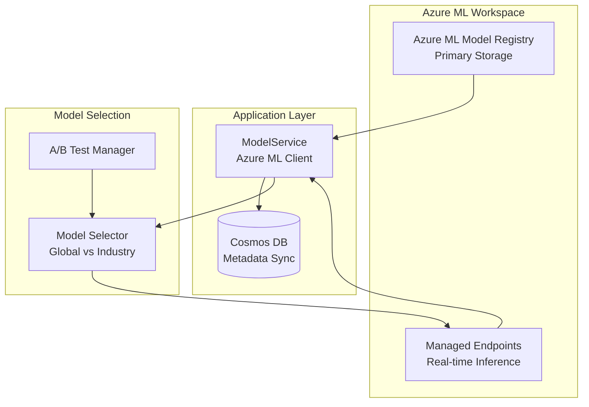

# Model Registry and Versioning

## Overview

The Model Registry manages ML model versions, metadata, deployment status, and A/B testing configurations. This document describes the model versioning system, metadata management, and deployment procedures.

**Model Architecture Strategy**: The system uses a hybrid approach with **global models** (trained on all industries) and **industry-specific models** (fine-tuned from global models when justified). See [MODEL_ARCHITECTURE_RECOMMENDATION.md](MODEL_ARCHITECTURE_RECOMMENDATION.md) for detailed analysis.

## Model Registry Architecture



## Model Metadata Schema

```typescript
interface MLModel {
  // Identity
  id: string;                        // Azure ML model ID
  modelType: ModelType;              // 'risk_scoring' | 'forecasting' | 'recommendations' | 'llm_fine_tuned'
  version: string;                   // Semantic version (e.g., '1.2.3')
  name: string;                      // Human-readable name
  
  // Azure ML References
  azureMLModelId: string;            // Azure ML model registry ID
  endpointUrl: string;               // Managed endpoint URL
  endpointName: string;               // Managed endpoint name
  
  // Scope
  scope: 'global' | 'industry';
  industryId?: string;                // For industry-specific models
  
  // Training Information
  trainingDate: Date;
  trainingJobId: string;
  trainingExamples: number;
  validationExamples: number;
  testExamples: number;
  trainingDurationMs: number;
  
  // Model Artifacts
  artifactPath: string;              // Azure Blob Storage path
  artifactSize: number;               // Size in bytes
  artifactFormat: 'onnx' | 'pickle' | 'h5' | 'pkl' | 'jsonl'; // For LLMs
  checksum: string;                  // SHA-256 checksum
  
  // Performance Metrics
  metrics: {
    // Regression metrics (for risk_scoring)
    mse?: number;
    mae?: number;
    rmse?: number;
    r2Score?: number;
    
    // Classification metrics (for outcome_prediction)
    accuracy?: number;
    precision?: number;
    recall?: number;
    f1Score?: number;
    auc?: number;
    
    // Ranking metrics (for mitigation_recommendation)
    ndcg?: number;
    map?: number;
    
    // LLM metrics
    perplexity?: number;
    bleu?: number;
    
    // Common
    validationScore: number;          // Primary metric for comparison
    testScore: number;
  };
  
  // Feature Information
  featureSchema: FeatureSchema;      // Feature schema version
  featureList: string[];              // List of features used
  featureImportance?: Record<string, number>; // Feature importance scores
  
  // Status
  status: 'training' | 'evaluating' | 'staging' | 'active' | 'deprecated' | 'failed';
  isDefault: boolean;                 // Is this the default model for its type?
  
  // A/B Testing
  abTestTraffic: number;             // Percentage of traffic (0-100)
  abTestStartDate?: Date;
  abTestEndDate?: Date;
  abTestMetrics?: ABTestMetrics;
  
  // Deployment
  deployedAt?: Date;
  deployedBy?: string;
  deploymentEnvironment: 'test' | 'staging' | 'production';
  
  // Metadata
  description?: string;
  tags: string[];
  createdAt: Date;
  updatedAt: Date;
  createdBy: string;
  
  // Relationships
  parentModelId?: string;             // Parent model (for industry models fine-tuned from global)
  baseModel?: string;                 // Base model (for LLM fine-tuning)
  performanceImprovement?: number;    // % improvement over parent model (for industry models)
  
  // Sync Information
  syncedToCosmos: boolean;            // Whether metadata synced to Cosmos DB
  lastSyncDate?: Date;                // Last sync timestamp
}
```

## Model Versioning

### Semantic Versioning

Models use semantic versioning: `MAJOR.MINOR.PATCH`

- **MAJOR**: Breaking changes (incompatible feature schema, major algorithm change)
- **MINOR**: New features (new features added, performance improvements)
- **PATCH**: Bug fixes (bug fixes, minor improvements)

```typescript
function generateVersion(
  previousVersion: string | null,
  changeType: 'major' | 'minor' | 'patch'
): string {
  if (!previousVersion) {
    return '1.0.0';
  }
  
  const [major, minor, patch] = previousVersion.split('.').map(Number);
  
  switch (changeType) {
    case 'major':
      return `${major + 1}.0.0`;
    case 'minor':
      return `${major}.${minor + 1}.0`;
    case 'patch':
      return `${major}.${minor}.${patch + 1}`;
  }
}
```

### Version Comparison

```typescript
function compareVersions(v1: string, v2: string): number {
  const [m1, i1, p1] = v1.split('.').map(Number);
  const [m2, i2, p2] = v2.split('.').map(Number);
  
  if (m1 !== m2) return m1 - m2;
  if (i1 !== i2) return i1 - i2;
  return p1 - p2;
}

function getLatestVersion(models: MLModel[]): MLModel | null {
  if (models.length === 0) return null;
  
  return models.reduce((latest, current) => {
    return compareVersions(current.version, latest.version) > 0
      ? current
      : latest;
  });
}
```

## Model Registration

### Register New Model

```typescript
async function registerModel(
  model: TrainedModel,
  metadata: ModelMetadata
): Promise<MLModel> {
  // Generate version
  const previousModel = await getLatestModel(model.modelType, metadata.industryId);
  const version = generateVersion(
    previousModel?.version || null,
    metadata.changeType || 'minor'
  );
  
  // Register model in Azure ML Registry
  const azureMLModel = await azureML.registry.models.register({
    name: model.modelType,
    version: version,
    modelPath: model.artifactPath, // Already uploaded to Azure ML during training
    description: metadata.description,
    tags: {
      scope: metadata.industryId ? 'industry' : 'global',
      industryId: metadata.industryId || undefined,
      modelType: model.modelType,
      ...metadata.tags
    }
  });
  
  // Create model record for Cosmos DB sync
  const modelRecord: MLModel = {
    id: azureMLModel.id,
    azureMLModelId: azureMLModel.id,
    modelType: model.modelType,
    version,
    name: `${model.modelType}_${version}`,
    endpointUrl: '', // Set when endpoint is created
    endpointName: '',
    scope: metadata.industryId ? 'industry' : 'global',
    industryId: metadata.industryId,
    trainingDate: new Date(),
    trainingJobId: metadata.trainingJobId,
    trainingExamples: metadata.trainingExamples,
    validationExamples: metadata.validationExamples,
    testExamples: metadata.testExamples,
    trainingDurationMs: metadata.trainingDurationMs,
    artifactPath: model.artifactPath,
    artifactSize: model.artifactSize,
    artifactFormat: model.format,
    checksum: model.checksum,
    metrics: model.metrics,
    featureSchema: model.featureSchema,
    featureList: model.featureList,
    featureImportance: model.featureImportance,
    status: 'evaluating',
    isDefault: false,
    abTestTraffic: 0,
    deploymentEnvironment: 'test',
    tags: metadata.tags || [],
    createdAt: new Date(),
    updatedAt: new Date(),
    createdBy: metadata.createdBy || 'system',
    parentModelId: metadata.parentModelId,
    baseModel: metadata.baseModel,
    performanceImprovement: metadata.performanceImprovement,
    syncedToCosmos: false,
    lastSyncDate: undefined
  };
  
  // Sync to Cosmos DB for application access
  await syncModelToCosmos(modelRecord);
  
  // Update default model if this is better
  if (shouldSetAsDefault(modelRecord, previousModel)) {
    await setAsDefault(modelRecord.id);
  }
  
  return modelRecord;
}

async function syncModelToCosmos(model: MLModel): Promise<void> {
  await cosmosService.upsert('c_ml_model', {
    ...model,
    syncedToCosmos: true,
    lastSyncDate: new Date()
  });
}
```

### Model Artifact Storage

**Note:** Model artifacts are automatically stored by Azure ML during training. The artifact path is provided by Azure ML when registering the model.

```typescript
// Artifacts are stored by Azure ML in the workspace's default datastore
// Path format: azureml://datastores/workspaceblobstore/paths/models/{model_name}/{version}/
// Access via Azure ML SDK or REST API
```

## Model Loading

### Model Selection Strategy

The system uses a **hybrid approach** with global models and industry-specific fine-tuned models:

1. **Start with Global Models**: 3 global models (one per use case) trained on all industries
2. **Add Industry Models**: Industry-specific models added only when:
   - >3000 examples available per industry
   - >5% performance improvement over global model
   - Business value justifies additional model

### Select Model for Inference

```typescript
async function selectModelForInference(
  modelType: ModelType,
  industryId?: string,
  tenantId?: string,
  version?: string
): Promise<LoadedModel> {
  // If specific version requested, load that version
  if (version) {
    return await loadModel(modelType, tenantId, version);
  }
  
  // 1. Check for industry-specific model (if industry provided)
  if (industryId) {
    const industryModel = await getIndustryModel(modelType, industryId);
    
    if (industryModel && industryModel.isActive) {
      // Only use industry model if it's significantly better
      if (industryModel.performanceImprovement && 
          industryModel.performanceImprovement > 0.05) {
        // Shadow Evaluation: Always run global model in background
        // See ML_OPERATIONAL_STANDARDS.md
        const globalModel = await getGlobalModel(modelType);
        if (globalModel) {
          // Trigger async shadow evaluation (non-blocking)
          triggerShadowEvaluation(
            modelType,
            industryModel,
            globalModel,
            tenantId
          ).catch(error => {
            // Log error but don't block inference
            monitoring.trackException(error, {
              operation: 'shadow_evaluation',
              modelType,
              industryId
            });
          });
        }
        
        return await loadModel(modelType, tenantId, industryModel.version);
      }
    }
  }
  
  // 2. Fall back to global model (default)
  const globalModel = await getGlobalModel(modelType);
  if (!globalModel) {
    throw new Error(`Global model not found: ${modelType}`);
  }
  
  return await loadModel(modelType, tenantId, globalModel.version);
}

/**
 * Shadow Evaluation: Run global model in background when using industry model
 * 
 * This is strongly recommended for all industry model deployments (see ML_OPERATIONAL_STANDARDS.md).
 * Shadow evaluation is async and non-blocking to avoid latency impact.
 */
async function triggerShadowEvaluation(
  modelType: ModelType,
  primaryModel: MLModel,
  shadowModel: MLModel,
  tenantId?: string
): Promise<void> {
  // This runs asynchronously and does not block the primary inference
  // Queue shadow evaluation job (Azure Service Bus or background worker)
  await shadowEvaluationQueue.enqueue({
    modelType,
    primaryModelId: primaryModel.id,
    shadowModelId: shadowModel.id,
    tenantId,
    timestamp: new Date()
  });
}

/**
 * Process shadow evaluation (background worker)
 */
async function processShadowEvaluation(
  job: ShadowEvaluationJob
): Promise<void> {
  // Get features from the original inference request (stored with job)
  const features = await getStoredFeatures(job.requestId);
  
  // Run shadow model inference
  const shadowPrediction = await callModelEndpoint(
    job.shadowModelId,
    features
  );
  
  // Get primary prediction (stored with job)
  const primaryPrediction = await getStoredPrediction(job.requestId);
  
  // Log both predictions for offline comparison
  await logShadowComparison({
    requestId: job.requestId,
    primaryModelId: job.primaryModelId,
    shadowModelId: job.shadowModelId,
    primaryPrediction,
    shadowPrediction,
    features,
    timestamp: new Date()
  });
  
  // Calculate metrics for comparison (offline)
  await calculateShadowMetrics(job.primaryModelId, job.shadowModelId);
}

async function getIndustryModel(
  modelType: ModelType,
  industryId: string
): Promise<MLModel | null> {
  // Query Cosmos DB (synced from Azure ML Registry)
  const result = await cosmos.query({
    query: `
      SELECT * FROM c 
      WHERE c.modelType = @modelType 
        AND c.scope = 'industry' 
        AND c.industryId = @industryId 
        AND c.status = 'active'
        AND c.isDefault = true
    `,
    parameters: [
      { name: '@modelType', value: modelType },
      { name: '@industryId', value: industryId }
    ]
  });
  
  if (result.items.length === 0) return null;
  
  // Optionally verify with Azure ML Registry
  const model = result.items[0] as MLModel;
  const azureMLModel = await azureML.registry.models.get(model.azureMLModelId);
  if (!azureMLModel) {
    // Model deleted from Azure ML, sync status
    await syncModelStatus(model.id, 'deprecated');
    return null;
  }
  
  return model;
}

async function getGlobalModel(
  modelType: ModelType
): Promise<MLModel | null> {
  // Query Cosmos DB (synced from Azure ML Registry)
  const result = await cosmos.query({
    query: `
      SELECT * FROM c 
      WHERE c.modelType = @modelType 
        AND c.scope = 'global' 
        AND c.status = 'active'
        AND c.isDefault = true
    `,
    parameters: [
      { name: '@modelType', value: modelType }
    ]
  });
  
  if (result.items.length === 0) return null;
  
  return result.items[0] as MLModel;
}
```

### Get Model Endpoint for Inference

**Note:** Models are served via Azure ML Managed Endpoints. We don't load models directly - we call the endpoint.

```typescript
async function getModelEndpoint(
  modelType: ModelType,
  industryId?: string
): Promise<string> {
  // Select model (global or industry-specific)
  const model = await selectModelForInference(modelType, industryId);
  
  if (!model) {
    throw new Error(`Model not found: ${modelType}`);
  }
  
  // Return managed endpoint URL
  if (!model.endpointUrl) {
    throw new Error(`Model endpoint not configured: ${model.id}`);
  }
  
  return model.endpointUrl;
}

async function callModelEndpoint(
  endpointUrl: string,
  features: Record<string, any>
): Promise<any> {
  // Call Azure ML Managed Endpoint
  const response = await fetch(endpointUrl, {
    method: 'POST',
    headers: {
      'Content-Type': 'application/json',
      'Authorization': `Bearer ${await getAzureMLToken()}`
    },
    body: JSON.stringify({
      input_data: {
        columns: Object.keys(features),
        index: [0],
        data: [Object.values(features)]
      }
    })
  });
  
  if (!response.ok) {
    throw new Error(`Model inference failed: ${response.statusText}`);
  }
  
  const result = await response.json();
  return result;
}
```

### Prediction Caching Strategy

```typescript
// Cache predictions (not models - models are in Azure ML Managed Endpoints)
// Event-based cache invalidation (no fixed TTL)
// Cache invalidated when opportunity changes (via Cosmos DB change feed or webhook)
const PREDICTION_CACHE_KEY_PREFIX = 'ml:prediction:';

async function cachePrediction(
  modelType: ModelType,
  featuresHash: string,
  prediction: any
): Promise<void> {
  const key = `prediction:${modelType}:${featuresHash}`;
  // Store prediction without TTL (event-based invalidation)
  // Cache will be invalidated when opportunity changes
  await redis.set(key, JSON.stringify(prediction));
  
  // Set up cache invalidation listener for opportunity changes
  await setupCacheInvalidationListener(opportunityId, tenantId, key);
}

/**
 * Set up cache invalidation listener for opportunity changes
 * Uses Cosmos DB change feed or webhook to invalidate cache when opportunity updates
 */
async function setupCacheInvalidationListener(
  opportunityId: string,
  tenantId: string,
  cacheKey: string
): Promise<void> {
  // Option 1: Use Cosmos DB change feed (recommended)
  // Subscribe to opportunity shard changes
  await cosmosChangeFeed.subscribe({
    container: 'shards',
    filter: {
      shardTypeId: 'c_opportunity',
      id: opportunityId,
      tenantId
    },
    handler: async (change) => {
      if (change.operationType === 'update' || change.operationType === 'replace') {
        // Invalidate all ML predictions for this opportunity
        await invalidateOpportunityCache(opportunityId, tenantId);
      }
    }
  });
  
  // Option 2: Use webhook from opportunity update service
  // Register webhook callback in OpportunityService.updateOpportunity()
  // When opportunity is updated, call: await invalidateOpportunityCache(opportunityId, tenantId);
}

async function invalidateOpportunityCache(
  opportunityId: string,
  tenantId: string
): Promise<void> {
  // Invalidate all ML prediction caches for this opportunity
  const pattern = `prediction:*:${tenantId}:${opportunityId}*`;
  const keys = await redis.keys(pattern);
  if (keys.length > 0) {
    await redis.del(...keys);
  }
  
  // Also invalidate feature cache
  const featurePattern = `features:${tenantId}:${opportunityId}*`;
  const featureKeys = await redis.keys(featurePattern);
  if (featureKeys.length > 0) {
    await redis.del(...featureKeys);
  }
}

async function getCachedPrediction(
  modelType: ModelType,
  featuresHash: string
): Promise<any | null> {
  const cached = await redis.get(`prediction:${modelType}:${featuresHash}`);
  return cached ? JSON.parse(cached) : null;
}

// Cache model metadata (endpoint URLs, etc.)
async function cacheModelMetadata(model: MLModel): Promise<void> {
  const key = `model:meta:${model.modelType}:${model.scope}:${model.industryId || 'global'}`;
  await redis.setex(key, 3600, JSON.stringify(model)); // 1 hour TTL
}
```

## A/B Testing

### Setup A/B Test

```typescript
async function setupABTest(
  newModelId: string,
  trafficPercentage: number,
  options: ABTestOptions
): Promise<ABTest> {
  // Get current default model
  const currentModel = await getDefaultModel(
    options.modelType,
    options.tenantId
  );
  
  if (!currentModel) {
    throw new Error('No default model found');
  }
  
  // Get new model
  const newModel = await getModel(newModelId);
  
  if (newModel.modelType !== currentModel.modelType) {
    throw new Error('Model types must match');
  }
  
  // Create A/B test
  const abTest: ABTest = {
    id: generateId(),
    modelType: options.modelType,
    tenantId: options.tenantId,
    controlModelId: currentModel.id,
    treatmentModelId: newModelId,
    trafficPercentage,
    startDate: new Date(),
    endDate: options.endDate || addDays(new Date(), options.durationDays || 7),
    status: 'active',
    metrics: {
      control: {
        requestCount: 0,
        errorCount: 0,
        avgLatency: 0,
        performance: {}
      },
      treatment: {
        requestCount: 0,
        errorCount: 0,
        avgLatency: 0,
        performance: {}
      }
    },
    createdAt: new Date()
  };
  
  // Update models
  await updateModel(currentModel.id, {
    abTestTraffic: 100 - trafficPercentage,
    abTestStartDate: abTest.startDate
  });
  
  await updateModel(newModelId, {
    abTestTraffic: trafficPercentage,
    abTestStartDate: abTest.startDate,
    status: 'staging'
  });
  
  // Store A/B test
  await cosmosService.create('c_risk_ml_ab_test', abTest);
  
  return abTest;
}
```

### Route Traffic for A/B Test

```typescript
async function getModelForInference(
  modelType: ModelType,
  tenantId?: string,
  userId?: string
): Promise<LoadedModel> {
  // Check for A/B test
  const abTest = await getActiveABTest(modelType, tenantId);
  
  if (abTest) {
    // Use consistent hashing to route traffic
    const hash = hashUserId(userId || 'anonymous');
    const percentage = hash % 100;
    
    if (percentage < abTest.trafficPercentage) {
      // Route to treatment (new model)
      return await loadModelById(abTest.treatmentModelId);
    } else {
      // Route to control (current model)
      return await loadModelById(abTest.controlModelId);
    }
  }
  
  // No A/B test, use default model
  return await loadModel(modelType, tenantId);
}
```

### Track A/B Test Metrics

```typescript
async function trackABTestMetrics(
  abTestId: string,
  modelId: string,
  metrics: {
    latency: number;
    error: boolean;
    prediction?: any;
    actual?: any;
  }
): Promise<void> {
  const abTest = await getABTest(abTestId);
  const isControl = abTest.controlModelId === modelId;
  
  const modelMetrics = isControl ? abTest.metrics.control : abTest.metrics.treatment;
  
  // Update metrics
  modelMetrics.requestCount++;
  if (metrics.error) {
    modelMetrics.errorCount++;
  }
  
  // Update average latency (exponential moving average)
  modelMetrics.avgLatency = modelMetrics.avgLatency * 0.9 + metrics.latency * 0.1;
  
  // Track prediction accuracy if actual value available
  if (metrics.prediction && metrics.actual) {
    const error = Math.abs(metrics.prediction - metrics.actual);
    if (!modelMetrics.performance.errors) {
      modelMetrics.performance.errors = [];
    }
    modelMetrics.performance.errors.push(error);
    modelMetrics.performance.mae = calculateMAE(
      modelMetrics.performance.errors
    );
  }
  
  // Update A/B test
  await updateABTest(abTestId, { metrics: abTest.metrics });
}
```

### Evaluate A/B Test Results

```typescript
async function evaluateABTest(abTestId: string): Promise<ABTestResults> {
  const abTest = await getABTest(abTestId);
  
  // Calculate statistical significance
  const controlMetrics = abTest.metrics.control;
  const treatmentMetrics = abTest.metrics.treatment;
  
  // Perform statistical test (e.g., t-test, chi-square)
  const significance = performStatisticalTest(
    controlMetrics,
    treatmentMetrics
  );
  
  // Determine winner
  let winner: 'control' | 'treatment' | 'inconclusive';
  if (significance.pValue < 0.05) {
    if (treatmentMetrics.performance.mae < controlMetrics.performance.mae) {
      winner = 'treatment';
    } else {
      winner = 'control';
    }
  } else {
    winner = 'inconclusive';
  }
  
  const results: ABTestResults = {
    abTestId,
    winner,
    significance,
    controlMetrics,
    treatmentMetrics,
    recommendation: winner === 'treatment' 
      ? 'Promote treatment model to default'
      : winner === 'control'
      ? 'Keep control model as default'
      : 'Extend test or investigate further',
    evaluatedAt: new Date()
  };
  
  return results;
}
```

## Model Deployment

### Deploy to Production

```typescript
async function deployModel(
  modelId: string,
  environment: 'staging' | 'production'
): Promise<void> {
  const model = await getModel(modelId);
  
  // Validate model
  if (model.status !== 'evaluating' && model.status !== 'staging') {
    throw new Error(`Model status must be evaluating or staging, got ${model.status}`);
  }
  
  // Check metrics meet threshold
  if (!meetsDeploymentThreshold(model)) {
    throw new Error('Model metrics do not meet deployment threshold');
  }
  
  // Update model status
  await updateModel(modelId, {
    status: environment === 'production' ? 'active' : 'staging',
    deploymentEnvironment: environment,
    deployedAt: new Date(),
    deployedBy: 'system' // or current user
  });
  
  // If deploying to production and this is better, set as default
  if (environment === 'production') {
    const currentDefault = await getDefaultModel(model.modelType, model.tenantId);
    if (!currentDefault || isBetterModel(model, currentDefault)) {
      await setAsDefault(modelId);
    }
  }
  
  // Invalidate cache to force reload
  await invalidateModelCache(modelId);
}
```

### Rollback Model

```typescript
async function rollbackModel(
  modelType: ModelType,
  tenantId?: string
): Promise<void> {
  const currentModel = await getDefaultModel(modelType, tenantId);
  if (!currentModel) {
    throw new Error('No default model found');
  }
  
  // Get previous version
  const previousModel = await getPreviousModel(currentModel);
  if (!previousModel) {
    throw new Error('No previous model version found');
  }
  
  // Deprecate current model
  await updateModel(currentModel.id, {
    status: 'deprecated',
    isDefault: false
  });
  
  // Set previous as default
  await setAsDefault(previousModel.id);
  
  // Invalidate cache
  await invalidateModelCache(currentModel.id);
  await invalidateModelCache(previousModel.id);
}
```

## Model Queries

### Query Models

```typescript
async function queryModels(
  filters: {
    modelType?: ModelType;
    tenantId?: string;
    status?: ModelStatus;
    version?: string;
    tags?: string[];
  },
  options: {
    limit?: number;
    offset?: number;
    orderBy?: string;
    orderDirection?: 'asc' | 'desc';
  }
): Promise<MLModel[]> {
  const query = {
    shardTypeId: 'c_risk_ml_model',
    filters: {
      ...(filters.modelType && { modelType: filters.modelType }),
      ...(filters.tenantId && { tenantId: filters.tenantId }),
      ...(filters.status && { status: filters.status }),
      ...(filters.version && { version: filters.version }),
      ...(filters.tags && { tags: { $in: filters.tags } })
    },
    orderBy: options.orderBy || 'createdAt',
    orderDirection: options.orderDirection || 'desc',
    limit: options.limit || 100,
    offset: options.offset || 0
  };
  
  return await shardRepository.query(query);
}
```

### Get Model History

```typescript
async function getModelHistory(
  modelType: ModelType,
  tenantId?: string
): Promise<MLModel[]> {
  return await queryModels(
    { modelType, tenantId },
    { orderBy: 'createdAt', orderDirection: 'desc' }
  );
}
```

## Best Practices

1. **Version Control**: Always use semantic versioning
2. **Artifact Validation**: Verify checksums before deployment
3. **Gradual Rollout**: Use A/B testing before full deployment
4. **Monitoring**: Monitor model performance in production
5. **Rollback Plan**: Always have a rollback strategy
6. **Documentation**: Document model changes and improvements
7. **Testing**: Test models in staging before production
