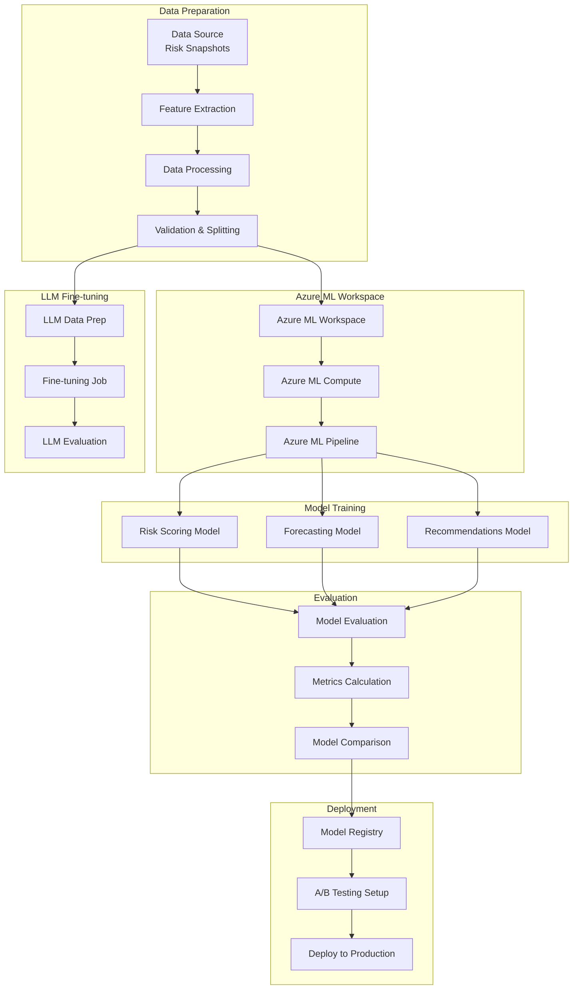

# Training Pipeline

**Note:** For operational standards including feature versioning, calibration, and training best practices, see [ML_OPERATIONAL_STANDARDS.md](ML_OPERATIONAL_STANDARDS.md).

## Overview

The training pipeline orchestrates the end-to-end process of preparing training data, training ML models, fine-tuning LLMs, and evaluating model performance using **Azure ML Workspace**. This document describes the training workflows, data preparation, and job orchestration for the three priority use cases: Risk Scoring, Revenue Forecasting, and Recommendations.

## Training Pipeline Architecture



## Training Data Preparation

### Step 0: Synthetic Data Augmentation (Initial Training)

**Strategy**: Since historical data is limited, we use synthetic data augmentation for initial model training.

```typescript
async function augmentTrainingData(
  realData: RiskSnapshot[],
  targetSize: number = 5000
): Promise<RiskSnapshot[]> {
  // If we have sufficient real data, skip augmentation
  if (realData.length >= targetSize) {
    return realData;
  }
  
  // Generate synthetic data using:
  // 1. SMOTE (Synthetic Minority Oversampling Technique) for imbalanced classes
  // 2. Domain knowledge-based generation (rule-based patterns)
  // 3. Statistical sampling from real data distributions
  
  const syntheticData = await generateSyntheticData({
    realData,
    targetSize,
    method: 'smote', // or 'statistical', 'rule_based'
    preserveDistributions: true
  });
  
  // Combine real + synthetic
  const augmentedData = [...realData, ...syntheticData];
  
  // Validate synthetic data quality
  await validateSyntheticDataQuality(augmentedData, realData);
  
  return augmentedData;
}
```

**Synthetic Data Generation Methods**:
1. **SMOTE**: For imbalanced classes (e.g., more won than lost opportunities)
2. **Statistical Sampling**: Sample from real data distributions while preserving correlations
3. **Rule-Based Generation**: Use domain knowledge to generate realistic scenarios

**Quality Validation**:
- Ensure synthetic data maintains statistical properties of real data
- Validate feature distributions match real data
- Check for unrealistic combinations

### Step 1: Data Collection

```typescript
async function collectTrainingData(
  options: TrainingDataOptions
): Promise<RiskSnapshot[]> {
  const {
    tenantId,
    startDate,
    endDate,
    minSnapshots = 1000,
    includeOutcomes = true
  } = options;
  
  // Query risk snapshots
  const snapshots = await shardRepository.query({
    shardTypeId: 'c_risk_snapshot',
    tenantId,
    filters: {
      createdAt: {
        $gte: startDate,
        $lte: endDate
      }
    },
    orderBy: 'createdAt',
    limit: 10000
  });
  
  // Filter for opportunities with outcomes (if required)
  if (includeOutcomes) {
    const withOutcomes = await filterSnapshotsWithOutcomes(snapshots);
    if (withOutcomes.length < minSnapshots) {
      throw new Error(
        `Insufficient training data: ${withOutcomes.length} < ${minSnapshots}`
      );
    }
    return withOutcomes;
  }
  
  return snapshots;
}
```

### Step 2: Feature Extraction with Version Pinning

**Critical:** Feature versions must be pinned for training jobs to ensure reproducibility and prevent training/serving skew (see [ML_OPERATIONAL_STANDARDS.md](../ML_OPERATIONAL_STANDARDS.md)).

```typescript
async function extractTrainingFeatures(
  snapshots: RiskSnapshot[],
  trainingJobId: string,
  modelType: 'risk_scoring' | 'forecasting' | 'recommendations'
): Promise<TrainingExample[]> {
  // Step 2a: Pin feature versions for this training job
  const featureNames = getFeatureNamesForModel(modelType);
  const pinnedVersions = await featureStore.pinFeatureVersions(
    trainingJobId,
    featureNames
  );
  
  // Store pinned versions in training job metadata
  await storeTrainingJobMetadata(trainingJobId, {
    featureVersions: pinnedVersions,
    pinnedAt: new Date(),
    modelType
  });
  
  // Step 2b: Extract features using pinned versions
  const examples: TrainingExample[] = [];
  
  for (const snapshot of snapshots) {
    try {
      // Extract features at snapshot time using pinned versions
      const features = await featureStore.extractFeaturesAtTime(
        snapshot.opportunityId,
        snapshot.tenantId,
        snapshot.snapshotDate,
        pinnedVersions  // Use pinned versions
      );
      
      // Validate feature version compatibility
      validateFeatureVersions(features, pinnedVersions);
      
      // Get labels from snapshot and outcome
      const outcome = await getOutcome(snapshot.opportunityId);
      const labels = {
        actualRiskScore: snapshot.riskScore,
        actualOutcome: outcome?.result || null,
        actualRevenueAtRisk: snapshot.revenueAtRisk,
        actualMitigationEffectiveness: outcome?.mitigationEffectiveness
      };
      
      examples.push({
        id: snapshot.id,
        opportunityId: snapshot.opportunityId,
        tenantId: snapshot.tenantId,
        snapshotDate: snapshot.snapshotDate,
        features,
        labels,
        featureVersions: pinnedVersions,  // Store versions with example
        createdAt: snapshot.createdAt,
        outcomeDate: outcome?.date
      });
    } catch (error) {
      // Log error but continue processing
      monitoring.trackException(error, {
        operation: 'training.extractFeatures',
        snapshotId: snapshot.id,
        trainingJobId
      });
    }
  }
  
  // Step 2c: Validate training/inference feature parity
  await validateTrainingInferenceParity(trainingJobId, pinnedVersions);
  
  return examples;
}

/**
 * Validate that training and inference use compatible feature versions
 */
async function validateTrainingInferenceParity(
  trainingJobId: string,
  pinnedVersions: Record<string, Feature>
): Promise<void> {
  // Get model version that will be created from this training job
  const modelVersion = await getModelVersionForTrainingJob(trainingJobId);
  
  // Check that all pinned versions are compatible with model requirements
  for (const [featureName, feature] of Object.entries(pinnedVersions)) {
    const modelRequirement = await getModelFeatureRequirement(modelVersion, featureName);
    if (modelRequirement && !isCompatibleVersion(feature.version, modelRequirement)) {
      throw new Error(
        `Feature ${featureName} version ${feature.version} is not compatible with model requirement ${modelRequirement}`
      );
    }
  }
  
  // Store feature version metadata with model
  await storeModelFeatureVersions(modelVersion, pinnedVersions);
}
```

### Step 3: Data Validation & Cleaning

```typescript
function validateAndCleanData(
  examples: TrainingExample[]
): TrainingExample[] {
  return examples
    .filter(example => {
      // Remove examples with missing critical features
      if (!example.features.dealValue || !example.features.probability) {
        return false;
      }
      
      // Remove examples with invalid values
      if (
        example.features.probability < 0 ||
        example.features.probability > 100
      ) {
        return false;
      }
      
      // Remove examples with NaN or Infinity
      for (const value of Object.values(example.features)) {
        if (typeof value === 'number' && (isNaN(value) || !isFinite(value))) {
          return false;
        }
      }
      
      return true;
    })
    .map(example => {
      // Handle missing values
      return {
        ...example,
        features: handleMissingValues(example.features)
      };
    });
}
```

### Step 4: Data Splitting

```typescript
function splitData(
  examples: TrainingExample[],
  splits: { train: number; validation: number; test: number }
): DataSplits {
  // Shuffle data
  const shuffled = shuffleArray([...examples]);
  
  // Calculate split indices
  const total = shuffled.length;
  const trainEnd = Math.floor(total * splits.train);
  const valEnd = trainEnd + Math.floor(total * splits.validation);
  
  return {
    train: shuffled.slice(0, trainEnd),
    validation: shuffled.slice(trainEnd, valEnd),
    test: shuffled.slice(valEnd)
  };
}
```

### Step 5: Data Balancing

```typescript
function balanceData(
  examples: TrainingExample[],
  strategy: 'undersample' | 'oversample' | 'smote'
): TrainingExample[] {
  // For outcome prediction, balance won/lost classes
  const won = examples.filter(e => e.labels.actualOutcome === 'won');
  const lost = examples.filter(e => e.labels.actualOutcome === 'lost');
  
  if (strategy === 'undersample') {
    // Undersample majority class
    const minCount = Math.min(won.length, lost.length);
    return [
      ...shuffleArray(won).slice(0, minCount),
      ...shuffleArray(lost).slice(0, minCount)
    ];
  } else if (strategy === 'oversample') {
    // Oversample minority class
    const maxCount = Math.max(won.length, lost.length);
    const minority = won.length < lost.length ? won : lost;
    const majority = won.length < lost.length ? lost : won;
    
    const oversampled = [];
    for (let i = 0; i < maxCount; i++) {
      oversampled.push(minority[i % minority.length]);
    }
    
    return [...majority, ...oversampled];
  }
  
  // SMOTE or other advanced techniques
  return examples;
}
```

## Model Training

### Training Strategy: Full AutoML

**Decision**: Use Azure ML AutoML for complete model selection, feature engineering, and hyperparameter tuning.

**Benefits**:
- Automated model selection (XGBoost, LightGBM, Random Forest, etc.)
- Automated feature engineering and selection
- Automated hyperparameter tuning
- Best model selection based on cross-validation
- Small team friendly (minimal manual tuning required)

**AutoML Configuration**:

```typescript
async function trainModelWithAutoML(
  trainingData: DataSplits,
  modelType: 'risk_scoring' | 'forecasting' | 'recommendations',
  taskType: 'regression' | 'classification' | 'ranking'
): Promise<AutoMLJob> {
  const automlConfig = {
    task: taskType,
    primaryMetric: getPrimaryMetric(modelType),
    trainingData: trainingData.train,
    validationData: trainingData.validation,
    computeTarget: 'azureml:cpu-cluster', // Azure ML Compute Clusters
    experimentTimeoutMinutes: 120,
    maxTrials: 50, // Number of model configurations to try
    enableEarlyStopping: true,
    enableOnnxCompatibleModels: true, // For faster inference
    
    // Model-specific constraints
    allowedModels: modelType === 'recommendations' 
      ? ['XGBoost', 'LightGBM'] // Phase 1: XGBoost Ranker only
      : ['XGBoost', 'LightGBM', 'RandomForest'], // Risk Scoring & Forecasting
    
    // Feature engineering
    enableFeaturization: true,
    enableDnn: false, // Phase 1: No deep learning (Phase 2: NCF for recommendations)
    
    // Cross-validation
    nCrossValidations: 5,
    
    // Target-specific settings
    ...(modelType === 'risk_scoring' && {
      // Calibration will be applied post-training
      enableCalibration: false // We handle calibration separately
    }),
    ...(modelType === 'forecasting' && {
      // Quantile regression for uncertainty
      quantileLevels: [0.1, 0.5, 0.9] // P10, P50, P90
    })
  };
  
  // Submit AutoML job to Azure ML
  const automlJob = await azureMLClient.submitAutoMLJob({
    experimentName: `automl-${modelType}-${Date.now()}`,
    config: automlConfig
  });
  
  return automlJob;
}
```

**AutoML Job Monitoring**:

```typescript
async function monitorAutoMLJob(jobId: string): Promise<AutoMLResults> {
  const job = await azureMLClient.getJob(jobId);
  
  // Real-time monitoring (as requested)
  while (job.status === 'Running') {
    const metrics = await azureMLClient.getJobMetrics(jobId);
    
    // Stream metrics to Application Insights
    await monitoring.trackMetric('automl.trial_count', metrics.trialCount);
    await monitoring.trackMetric('automl.best_metric', metrics.bestMetric);
    await monitoring.trackMetric('automl.estimated_time_remaining', metrics.estimatedTimeRemaining);
    
    // Log to Application Insights
    await monitoring.trackEvent('automl.trial_completed', {
      jobId,
      trialId: metrics.latestTrialId,
      trialMetric: metrics.latestTrialMetric
    });
    
    await sleep(60000); // Check every minute
  }
  
  // Get best model
  const bestModel = await azureMLClient.getBestModel(jobId);
  
  return {
    jobId,
    bestModel,
    metrics: bestModel.metrics,
    featureImportance: bestModel.featureImportance,
    modelType: bestModel.modelType // e.g., 'XGBoost', 'LightGBM'
  };
}
```

### Risk Scoring Model (AutoML)

**Type**: Regression  
**AutoML Task**: Regression  
**Target**: Risk score (0-1)  
**Primary Metric**: Normalized Root Mean Squared Error (NRMSE)

**Note**: Calibration is applied post-training (see calibration section below).

```typescript
async function trainRiskScoringModel(
  trainingData: DataSplits
): Promise<TrainedModel> {
  const model = new XGBoostRegressor({
    objective: 'reg:squarederror',
    maxDepth: 6,
    learningRate: 0.1,
    nEstimators: 100,
    subsample: 0.8,
    colsampleBytree: 0.8
  });
  
  // Prepare features and labels
  const XTrain = trainingData.train.map(e => e.features);
  const yTrain = trainingData.train.map(e => e.labels.actualRiskScore);
  const XVal = trainingData.validation.map(e => e.features);
  const yVal = trainingData.validation.map(e => e.labels.actualRiskScore);
  
  // Train model
  await model.fit(XTrain, yTrain, {
    evalSet: [[XVal, yVal]],
    earlyStoppingRounds: 10
  });
  
  // Evaluate
  const predictions = await model.predict(XVal);
  const metrics = calculateRegressionMetrics(yVal, predictions);
  
  // Step 6: Train Calibration Model
  // Critical: Calibration is strongly recommended for all production deployments
  // See ML_OPERATIONAL_STANDARDS.md
  const calibrationParams = await trainCalibrationModel(
    predictions,
    yVal,
    modelType: 'platt' | 'isotonic' = 'platt'
  );
  
  // Validate calibration
  const calibrationMetrics = await validateCalibration(
    predictions,
    yVal,
    calibrationParams
  );
  
  return {
    model,
    metrics: {
      ...metrics,
      calibration: calibrationMetrics  // Brier Score, Calibration Error
    },
    featureImportance: await model.getFeatureImportance(),
    calibrationParams  // Store with model metadata
  };
}

/**
 * Train calibration model (Platt Scaling or Isotonic Regression)
 * 
 * Calibration is required for all production risk scoring models to ensure
 * probabilities are interpretable and statistically sound.
 */
async function trainCalibrationModel(
  rawPredictions: number[],
  actualValues: number[],
  method: 'platt' | 'isotonic' = 'platt'
): Promise<CalibrationParameters> {
  if (method === 'platt') {
    // Platt Scaling: Logistic regression on raw predictions
    const plattModel = new LogisticRegression();
    await plattModel.fit(
      rawPredictions.map(p => [p]),  // Reshape for sklearn
      actualValues
    );
    
    return {
      method: 'platt',
      parameters: {
        a: plattModel.coef_[0],
        b: plattModel.intercept_
      },
      trainedAt: new Date()
    };
  } else {
    // Isotonic Regression: Non-parametric calibration
    const isotonicModel = new IsotonicRegression();
    await isotonicModel.fit(rawPredictions, actualValues);
    
    return {
      method: 'isotonic',
      parameters: {
        thresholds: isotonicModel.thresholds_,
        values: isotonicModel.values_
      },
      trainedAt: new Date()
    };
  }
}

/**
 * Validate calibration quality
 */
async function validateCalibration(
  rawPredictions: number[],
  actualValues: number[],
  calibrationParams: CalibrationParameters
): Promise<CalibrationMetrics> {
  // Apply calibration
  const calibrated = applyCalibration(rawPredictions, calibrationParams);
  
  // Calculate Brier Score
  const brierScore = calculateBrierScore(calibrated, actualValues);
  
  // Calculate Calibration Error (ECE - Expected Calibration Error)
  const calibrationError = calculateCalibrationError(calibrated, actualValues);
  
  return {
    brierScore,
    calibrationError,
    method: calibrationParams.method
  };
}
```

### Forecasting Model

**Type**: Regression / Time Series  
**Algorithm**: XGBoost with Quantile Loss (default) or Two-Head Approach  
**Target**: Revenue forecast with separate point forecast and uncertainty

**Approach Selection:**
- **Default (Phase 1):** Quantile loss (P10/P50/P90) - single model with quantile regression
- **Alternative:** Two-head approach (point forecast model + uncertainty model) - only if model interpretability or debugging requires separation

**Critical:** Separate point forecast from uncertainty for cleaner monitoring, better alerting, and easier scenario generation (see [ML_OPERATIONAL_STANDARDS.md](../ML_OPERATIONAL_STANDARDS.md)).

```typescript
async function trainForecastingModel(
  trainingData: DataSplits,
  approach: 'quantile' | 'two_head' = 'quantile'
): Promise<TrainedModel> {
  if (approach === 'quantile') {
    // Default: Quantile Loss Approach (P10/P50/P90)
    // Single model outputs three quantiles
    const model = new XGBoostRegressor({
      objective: 'reg:quantileerror',  // Quantile loss
      quantileAlpha: [0.1, 0.5, 0.9],  // P10, P50 (median), P90
      maxDepth: 8,
      learningRate: 0.05,
      nEstimators: 200,
      subsample: 0.8,
      colsampleBytree: 0.8
    });
    
    // Prepare features and labels
    const XTrain = trainingData.train.map(e => e.features);
    const yTrain = trainingData.train.map(e => e.labels.actualRevenue);
    const XVal = trainingData.validation.map(e => e.features);
    const yVal = trainingData.validation.map(e => e.labels.actualRevenue);
    
    // Train model (outputs P10, P50, P90)
    await model.fit(XTrain, yTrain, {
      evalSet: [[XVal, yVal]],
      earlyStoppingRounds: 20
    });
    
    // Evaluate
    const predictions = await model.predict(XVal);  // Returns {p10, p50, p90}
    const metrics = calculateForecastingMetrics(yVal, predictions.p50, {
      p10: predictions.p10,
      p90: predictions.p90
    });
    
    return {
      model,
      metrics,
      featureImportance: await model.getFeatureImportance(),
      approach: 'quantile',
      quantiles: {
        p10: predictions.p10,
        p50: predictions.p50,
        p90: predictions.p90
      }
    };
  } else {
    // Alternative: Two-Head Approach
    // Model A: Point forecast (mean)
    const pointModel = new XGBoostRegressor({
      objective: 'reg:squarederror',
      maxDepth: 8,
      learningRate: 0.05,
      nEstimators: 200
    });
    
    // Model B: Uncertainty (quantile regression or residual model)
    const uncertaintyModel = new XGBoostRegressor({
      objective: 'reg:quantileerror',
      quantileAlpha: [0.1, 0.9],  // P10, P90
      maxDepth: 6,
      learningRate: 0.05,
      nEstimators: 150
    });
    
    const XTrain = trainingData.train.map(e => e.features);
    const yTrain = trainingData.train.map(e => e.labels.actualRevenue);
    const XVal = trainingData.validation.map(e => e.features);
    const yVal = trainingData.validation.map(e => e.labels.actualRevenue);
    
    // Train both models
    await pointModel.fit(XTrain, yTrain, {
      evalSet: [[XVal, yVal]],
      earlyStoppingRounds: 20
    });
    
    // Train uncertainty model on residuals
    const pointPredictions = await pointModel.predict(XTrain);
    const residuals = yTrain.map((y, i) => Math.abs(y - pointPredictions[i]));
    await uncertaintyModel.fit(XTrain, residuals, {
      evalSet: [[XVal, yVal.map((y, i) => {
        const valPoint = await pointModel.predict([XVal[i]]);
        return Math.abs(y - valPoint[0]);
      })]],
      earlyStoppingRounds: 20
    });
    
    // Evaluate
    const pointPred = await pointModel.predict(XVal);
    const uncertaintyPred = await uncertaintyModel.predict(XVal);
    const metrics = calculateForecastingMetrics(yVal, pointPred, {
      p10: pointPred.map((p, i) => p - uncertaintyPred[i].p10),
      p90: pointPred.map((p, i) => p + uncertaintyPred[i].p90)
    });
    
    return {
      model: { pointModel, uncertaintyModel },
      metrics,
      featureImportance: {
        point: await pointModel.getFeatureImportance(),
        uncertainty: await uncertaintyModel.getFeatureImportance()
      },
      approach: 'two_head'
    };
  }
}
```

### Recommendations Model

**Type**: Ranking  
**Algorithm**: XGBoost Ranker (Phase 1), Neural Collaborative Filtering (Phase 2)  
**Target**: Ranked list of recommendations

**Phase Strategy:**
- **Phase 1:** XGBoost Ranker only (see [ML_OPERATIONAL_STANDARDS.md](../ML_OPERATIONAL_STANDARDS.md))
  - Faster to iterate, easier to debug, cheaper to train
  - Features: user×item interactions, recency, popularity, context signals
- **Phase 2:** Add Neural Collaborative Filtering (NCF) only if CTR plateaus
  - NCF increases: infra complexity, data requirements, monitoring difficulty
  - Evaluate NCF only after XGBoost Ranker is stable and performance plateaus

```typescript
async function trainRecommendationsModel(
  trainingData: DataSplits,
  phase: 'phase1' | 'phase2' = 'phase1'
): Promise<TrainedModel> {
  if (phase === 'phase1') {
    // Phase 1: XGBoost Ranker Only
    // Prepare data with user-item interactions and feedback
    const trainingExamples = trainingData.train.map(example => {
      const interactions = example.labels.userInteractions || [];
      const rankedItems = interactions
        .sort((a, b) => b.rating - a.rating)
        .map(item => item.itemId);
      
      return {
        features: {
          // User features
          ...example.features.userFeatures,
          // Item features
          ...example.features.itemFeatures,
          // Interaction features
          userItemInteractions: example.features.userItemInteractions,
          // Recency features
          recency: example.features.recency,
          // Popularity features
          popularity: example.features.popularity,
          // Context signals
          contextFeatures: example.features.contextFeatures
        },
        targetItems: rankedItems
      };
    });
    
    // Train XGBoost Ranker
    const model = new XGBoostRanker({
      objective: 'rank:pairwise',
      maxDepth: 6,
      learningRate: 0.1,
      nEstimators: 150,
      subsample: 0.8,
      colsampleBytree: 0.8
    });
    
    const XTrain = trainingExamples.map(e => e.features);
    const yTrain = trainingExamples.map(e => e.targetItems);
    const XVal = trainingData.validation.map(e => e.features);
    const yVal = trainingData.validation.map(e => e.targetItems);
    
    await model.fit(XTrain, yTrain, {
      evalSet: [[XVal, yVal]],
      earlyStoppingRounds: 10
    });
    
    // Evaluate
    const predictions = await model.predict(XVal);
    const metrics = calculateRankingMetrics(yVal, predictions);
    
    return {
      model,
      metrics,
      featureImportance: await model.getFeatureImportance(),
      phase: 'phase1',
      algorithm: 'xgboost_ranker'
    };
  } else {
    // Phase 2: Neural Collaborative Filtering (only if CTR plateaus)
    // This is a future enhancement, not implemented in Phase 1
    throw new Error(
      'NCF is Phase 2. Only implement if XGBoost Ranker CTR plateaus. ' +
      'See ML_OPERATIONAL_STANDARDS.md for criteria.'
    );
  }
}
```

## LLM Fine-tuning (Phase 4 - Deferred)

**⚠️ WARNING:** LLM fine-tuning is **deferred to Phase 4** and should only be considered if all of the following are true (see [ML_OPERATIONAL_STANDARDS.md](../ML_OPERATIONAL_STANDARDS.md)):

1. **Prompt + RAG + rules are insufficient** - Current hybrid approach (Rule-based + LLM + ML) is not meeting requirements
2. **You have high-quality labeled data** - Sufficient labeled examples for fine-tuning
3. **Current hybrid approach is insufficient** - Rule-based + LLM + ML combination is not delivering needed results

**Why Defer:**
- Fine-tuning often adds cost with marginal gains
- Current hybrid approach (Rule-based + LLM + ML) is already very strong
- Focus effort on higher-ROI improvements first
- Fine-tuning should be last resort, not first approach

**When to Consider:**
- After core ML models (Risk Scoring, Forecasting, Recommendations) are stable
- After Phase 3 (Continuous Learning) is operational
- Only if clear business case exists for fine-tuning

### Data Preparation for LLM Fine-tuning (Phase 4)

```typescript
async function prepareLLMFineTuningData(
  snapshots: RiskSnapshot[]
): Promise<LLMTrainingExample[]> {
  const examples: LLMTrainingExample[] = [];
  
  for (const snapshot of snapshots) {
    const opportunity = await shardRepository.get(
      snapshot.opportunityId,
      snapshot.tenantId
    );
    
    // Format as prompt-completion pair
    const prompt = formatRiskAnalysisPrompt(opportunity, snapshot);
    const completion = formatRiskAnalysisCompletion(snapshot);
    
    examples.push({
      messages: [
        {
          role: 'system',
          content: 'You are a risk analysis expert. Analyze opportunities for potential risks.'
        },
        {
          role: 'user',
          content: prompt
        },
        {
          role: 'assistant',
          content: completion
        }
      ]
    });
  }
  
  return examples;
}

function formatRiskAnalysisPrompt(
  opportunity: Shard,
  snapshot: RiskSnapshot
): string {
  const data = opportunity.structuredData;
  return `Analyze this opportunity for potential risks.

Key data:
- Deal Value: ${data.value} ${data.currency}
- Probability: ${data.probability}%
- Stage: ${data.stage}
- Days to Close: ${calculateDaysToClose(data.closeDate)}
- Days Since Activity: ${calculateDaysSinceActivity(data.lastActivityAt)}

Related entities:
${formatRelatedEntities(opportunity)}

Identify risks and provide:
1. Risk IDs and categories
2. Confidence levels (0-1)
3. Explanations with evidence
4. Recommended mitigation actions`;
}

function formatRiskAnalysisCompletion(
  snapshot: RiskSnapshot
): string {
  const risks = snapshot.risks.map(risk => ({
    riskId: risk.riskId,
    riskName: risk.riskName,
    category: risk.category,
    confidence: risk.confidence,
    explanation: risk.explainability,
    mitigationActions: risk.mitigationActions || []
  }));
  
  return JSON.stringify({
    risks,
    overallRiskScore: snapshot.riskScore,
    categoryScores: snapshot.categoryScores
  }, null, 2);
}
```

### Fine-tuning Job (Azure ML)

```typescript
async function startLLMFineTuning(
  trainingData: LLMTrainingExample[],
  options: FineTuningOptions
): Promise<FineTuningJob> {
  // Upload training data to Azure ML Datastore
  const dataset = await azureML.data.upload({
    name: `llm_fine_tuning_${Date.now()}`,
    path: trainingData,
    datastore: 'workspaceblobstore'
  });
  
  // Create fine-tuning job via Azure ML
  const job = await azureML.jobs.create({
    type: 'command',
    code: './src/training/llm-fine-tuning',
    command: 'python fine_tune_llm.py',
    environment: 'azureml:llm-fine-tuning:1',
    compute: 'azureml:gpu-cluster',
    inputs: {
      training_data: dataset.asInput()
    },
    parameters: {
      base_model: options.baseModel, // e.g., 'gpt-4', 'gpt-3.5-turbo'
      epochs: options.epochs || 3,
      batch_size: options.batchSize || 4,
      learning_rate: options.learningRate || 1.0
    }
  });
  
  // Track job status
  await modelService.trackFineTuningJob({
    jobId: job.id,
    status: 'running',
    startedAt: new Date(),
    trainingDataSize: trainingData.length
  });
  
  return job;
}

async function monitorFineTuningJob(jobId: string): Promise<void> {
  const job = await azureML.jobs.get(jobId);
  
  if (job.status === 'Completed') {
    // Register fine-tuned model to Azure ML Registry
    const model = await azureML.registry.models.register({
      name: 'llm_fine_tuned',
      version: generateVersion(),
      modelPath: job.outputs.model,
      description: 'Fine-tuned LLM for risk identification'
    });
    
    // Sync to Cosmos DB
    await modelService.syncModelToCosmos({
      azureMLModelId: model.id,
      modelType: 'llm_fine_tuned',
      version: model.version,
      status: 'active',
      trainingDate: new Date()
    });
  } else if (job.status === 'Failed') {
    // Log failure and alert
    monitoring.trackException(
      new Error(`Fine-tuning failed: ${job.error}`),
      { jobId }
    );
  }
}
```

## Hyperparameter Optimization

```typescript
async function optimizeHyperparameters(
  modelType: ModelType,
  trainingData: DataSplits
): Promise<OptimalHyperparameters> {
  const searchSpace = getSearchSpace(modelType);
  
  // Use Optuna or similar for hyperparameter optimization
  const study = optuna.createStudy({
    direction: 'maximize', // Maximize validation score
    studyName: `risk_ml_${modelType}_optimization`
  });
  
  for (let trial = 0; trial < 50; trial++) {
    const params = study.suggestParams(searchSpace);
    const model = await trainModelWithParams(modelType, trainingData, params);
    const score = model.metrics.validationScore;
    study.reportTrial(trial, score, params);
  }
  
  return study.getBestParams();
}

function getSearchSpace(modelType: ModelType): SearchSpace {
  if (modelType === 'risk_scoring') {
    return {
      maxDepth: { type: 'int', low: 3, high: 10 },
      learningRate: { type: 'float', low: 0.01, high: 0.3 },
      nEstimators: { type: 'int', low: 50, high: 200 },
      subsample: { type: 'float', low: 0.6, high: 1.0 }
    };
  }
  // ... other model types
}
```

## Model Evaluation

```typescript
async function evaluateModel(
  model: TrainedModel,
  testData: TrainingExample[]
): Promise<EvaluationResults> {
  const XTest = testData.map(e => e.features);
  const yTest = testData.map(e => e.labels);
  
  // Get predictions
  const predictions = await model.predict(XTest);
  
  // Calculate metrics
  const metrics = calculateMetrics(yTest, predictions, model.type);
  
  // Calculate feature importance
  const featureImportance = await model.getFeatureImportance();
  
  // Analyze errors
  const errorAnalysis = analyzeErrors(yTest, predictions);
  
  return {
    metrics,
    featureImportance,
    errorAnalysis,
    predictions: predictions.map((p, i) => ({
      actual: yTest[i],
      predicted: p,
      error: Math.abs(yTest[i] - p)
    }))
  };
}

function calculateMetrics(
  actual: number[],
  predicted: number[],
  modelType: ModelType
): Metrics {
  if (modelType === 'risk_scoring') {
    // Regression metrics
    return {
      mse: meanSquaredError(actual, predicted),
      mae: meanAbsoluteError(actual, predicted),
      r2Score: r2Score(actual, predicted),
      rmse: Math.sqrt(meanSquaredError(actual, predicted))
    };
  } else if (modelType === 'forecasting') {
    // Forecasting metrics
    return {
      mape: meanAbsolutePercentageError(actual, predicted),
      mae: meanAbsoluteError(actual, predicted),
      rmse: Math.sqrt(meanSquaredError(actual, predicted)),
      r2Score: r2Score(actual, predicted)
    };
  } else if (modelType === 'recommendations') {
    // Ranking metrics
    return {
      ndcg: normalizedDiscountedCumulativeGain(actual, predicted),
      precision: precisionAtK(actual, predicted, 10),
      recall: recallAtK(actual, predicted, 10),
      map: meanAveragePrecision(actual, predicted)
    };
  }
}
```

## Training Orchestration (Azure ML Workspace)

### Training Service

```typescript
class TrainingService {
  async scheduleTraining(
    modelType: ModelType,
    options: TrainingOptions
  ): Promise<TrainingJob> {
    // Step 1: Prepare training data
    const snapshots = await this.collectTrainingData(options);
    const examples = await this.extractTrainingFeatures(snapshots);
    const cleaned = this.validateAndCleanData(examples);
    
    // Step 2: Upload to Azure ML Datastore
    const dataset = await azureML.data.upload({
      name: `${modelType}_training_${Date.now()}`,
      path: cleaned,
      datastore: 'workspaceblobstore'
    });
    
    // Step 3: Create Azure ML Pipeline
    const pipeline = await azureML.pipelines.create({
      name: `train_${modelType}`,
      steps: [
        {
          name: 'prepare_data',
          type: 'python',
          script: './src/training/prepare_data.py',
          inputs: { dataset }
        },
        {
          name: 'train_model',
          type: 'python',
          script: `./src/training/train_${modelType}.py`,
          inputs: { prepared_data: 'prepare_data.output' },
          compute: 'azureml:cpu-cluster'
        },
        {
          name: 'evaluate_model',
          type: 'python',
          script: './src/training/evaluate.py',
          inputs: { model: 'train_model.output' }
        }
      ]
    });
    
    // Step 4: Submit pipeline run
    const run = await pipeline.submit({
      experiment_name: `train_${modelType}_${Date.now()}`
    });
    
    // Step 5: Track job
    const job: TrainingJob = {
      id: run.id,
      modelType,
      status: 'running',
      createdAt: new Date(),
      azureMLRunId: run.id,
      options
    };
    
    await this.storeJob(job);
    return job;
  }
  
  async monitorTraining(jobId: string): Promise<void> {
    const job = await this.getJob(jobId);
    const run = await azureML.runs.get(job.azureMLRunId);
    
    if (run.status === 'Completed') {
      // Check if metrics meet threshold
      const metrics = run.metrics;
      if (this.meetsThreshold(metrics, job.modelType)) {
        // Register model to Azure ML Registry
        const model = await azureML.registry.models.register({
          name: job.modelType,
          version: generateVersion(),
          modelPath: run.outputs.model,
          description: `Trained ${job.modelType} model`
        });
        
        // Sync to Cosmos DB
        await this.modelService.syncModelToCosmos({
          azureMLModelId: model.id,
          modelType: job.modelType,
          version: model.version,
          metrics,
          status: 'active',
          trainingDate: new Date()
        });
        
        await this.updateJobStatus(jobId, 'completed');
      } else {
        await this.updateJobStatus(jobId, 'failed', {
          reason: 'Metrics below threshold',
          metrics
        });
      }
    } else if (run.status === 'Failed') {
      await this.updateJobStatus(jobId, 'failed', { error: run.error });
    }
  }
}
```

## Scheduled Training

```typescript
// Weekly training schedule
async function scheduleWeeklyTraining(): Promise<void> {
  const lastWeek = new Date();
  lastWeek.setDate(lastWeek.getDate() - 7);
  
  // Schedule training for all priority model types
  for (const modelType of ['risk_scoring', 'forecasting', 'recommendations']) {
    await trainingService.scheduleTraining(modelType, {
      startDate: lastWeek,
      endDate: new Date(),
      minSnapshots: 100
    });
  }
  
  // Schedule LLM fine-tuning monthly
  if (isFirstWeekOfMonth()) {
    await trainingService.scheduleTraining('llm_fine_tuned', {
      startDate: getLastMonth(),
      endDate: new Date(),
      minSnapshots: 500
    });
  }
}
```

## Training Workers

Background workers execute training jobs:

```typescript
// Azure Function or dedicated worker
export async function riskMLTrainingWorker(
  context: ExecutionContext,
  jobMessage: TrainingJobMessage
): Promise<void> {
  const trainingService = new TrainingService(/* dependencies */);
  
  try {
    await trainingService.executeTraining(jobMessage.jobId);
  } catch (error) {
    // Log and retry
    context.log.error('Training failed', error);
    throw error; // Trigger retry
  }
}
```

## Best Practices

1. **Data Quality**: Always validate and clean training data
2. **Reproducibility**: Use fixed random seeds, version control training code
3. **Monitoring**: Track training metrics, data quality, and model performance
4. **Incremental Training**: Use incremental training when possible for efficiency
5. **A/B Testing**: Always A/B test new models before full deployment
6. **Rollback Plan**: Maintain ability to rollback to previous model versions
