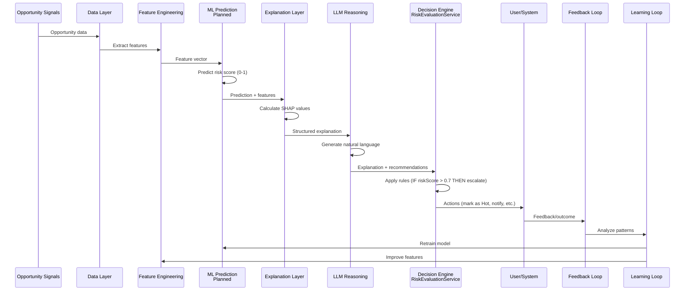
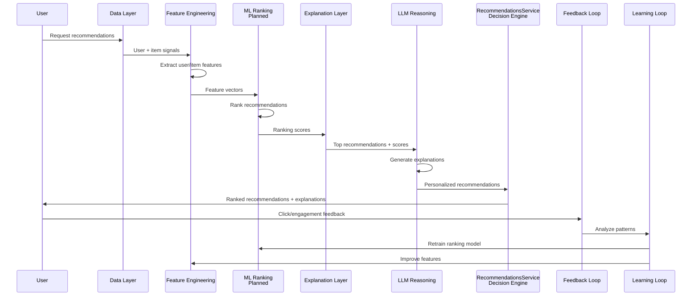
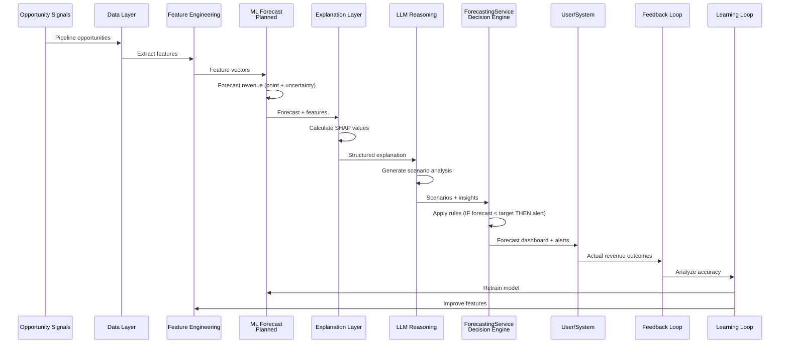

# ML Use Cases: Best Practices & Recommendations

**Date:** January 2025  
**Purpose:** Comprehensive best practices and recommendations for all ML use cases, based on system analysis and industry research

---

## Executive Summary

This document provides best practices, recommendations, and implementation guidance for all ML use cases in the Castiel platform. Each use case includes:

- Current system capabilities analysis
- Industry best practices
- **CAIS flow documentation** - How each use case flows through the Compound AI System layers
- LLM-ML integration recommendations
- Technical implementation guidance
- Success metrics and evaluation criteria

## CAIS Context

All ML use cases are part of the **Compound AI System (CAIS)** architecture. The ML models are **components** within the CAIS—they learn patterns and make predictions. The CAIS orchestrates these predictions with LLM reasoning, rule-based constraints, and human feedback to create a complete decision loop: **Prediction → Reasoning → Action → Feedback → Learning**.

For detailed CAIS architecture, see [CAIS_ARCHITECTURE.md](CAIS_ARCHITECTURE.md).  
For orchestration patterns, see [CAIS_ORCHESTRATION.md](CAIS_ORCHESTRATION.md).
- **CAIS flow** - How the use case flows through the Compound AI System layers

---

## CAIS Architecture Context

All ML use cases are part of a **Compound AI System (CAIS)** that orchestrates ML models, LLMs, rules, and feedback loops. Each use case flows through the CAIS decision loop:

**CAIS Decision Loop:**
1. **Data Layer** (Signals + Memory) - Opportunity data, historical outcomes
2. **Feature Engineering Layer** - Transform signals to features
3. **Predictive Model Layer** - ML models make predictions
4. **Explanation Layer** - SHAP values, feature importance
5. **LLM Reasoning Layer** - Natural language explanations and recommendations
6. **Decision & Action Engine** - Rules + AI combined, execute actions
7. **Feedback Loop** - Collect user feedback and outcomes
8. **Learning Loop** - Improve system over time

For detailed CAIS architecture, see [CAIS_ARCHITECTURE.md](CAIS_ARCHITECTURE.md).  
For orchestration patterns, see [CAIS_ORCHESTRATION.md](CAIS_ORCHESTRATION.md).

---

## Priority Use Cases ⭐

**The following three use cases are the highest priority for initial ML implementation:**

1. **⭐ Risk Scoring (Integrated)** - Section 6
   - Core functionality that feeds into other models
   - Highest business impact
   - Existing system to enhance
   - **Implementation:** Phase 1 (Weeks 1-4)

2. **⭐ Revenue Forecasting** - Section 8
   - Critical business value
   - Multi-level forecasting (opportunity/team/tenant)
   - Builds on outcome prediction
   - **Implementation:** Phase 1-2 (Weeks 1-8)

3. **⭐ Recommendations** - Section 7
   - High user engagement value
   - Enhances existing recommendation system
   - Improves personalization and user experience
   - **Implementation:** Phase 1-2 (Weeks 1-8)

**Rationale:**
- These three use cases provide the highest business value and user impact
- Risk Scoring is foundational and feeds into other models
- Forecasting and Recommendations directly impact revenue and user satisfaction
- All three can be implemented with the hybrid model architecture (3 global models initially)

**Model Architecture:**
- Start with **3 global models** (one per priority use case)
- Industry-specific fine-tuning added later when justified
- See [MODEL_ARCHITECTURE_RECOMMENDATION.md](MODEL_ARCHITECTURE_RECOMMENDATION.md) for details

---

## Part 1: Customer Use Cases

### 1. Outcome Prediction (Won/Lost Probability)

#### Current System Analysis

**Existing Capabilities:**
- Basic outcome tracking in `PipelineAnalyticsService` (closed won/lost metrics)
- Win rate calculations available
- Historical pattern matching in `RiskEvaluationService`
- No ML-based outcome prediction currently implemented

**Data Available:**
- Opportunity data (value, probability, stage, close date)
- Historical won/lost outcomes
- Owner performance metrics
- Account performance metrics
- Risk snapshots with outcomes

#### Best Practices (Industry Research)

**Model Selection:**
- **XGBoost Classification** is industry standard for CRM outcome prediction
- Binary classification with probabilistic output (won = 1, lost = 0)
- Target: >80% AUC-ROC, well-calibrated probabilities

**Feature Engineering:**
- **Critical Features:**
  - Opportunity stage, deal size, probability (current)
  - Time in stage, days to close, days since activity
  - Owner win rate, owner deal count, owner avg deal size
  - Account win rate, account health
  - Risk scores (from risk evaluation)
  - Activity counts (calls, emails, meetings)
  - Industry, region, product type
- **Temporal Features:**
  - Time since creation, time in current stage
  - Proximity to quarter end, seasonality
  - Lag features (previous stage duration)
- **Behavioral Features:**
  - Last contact date, activity frequency
  - Stakeholder changes, document activity

**Data Quality:**
- Remove duplicate opportunities
- Filter low-quality opportunities (insufficient discovery)
- Handle missing values (XGBoost handles internally, but assess patterns)
- Use time-based splits (train on past, test on future) to avoid leakage

**Model Training:**
- Handle class imbalance (won opportunities often <20%):
  - Use cost-sensitive learning (weight churners higher)
  - Consider SMOTE for oversampling
  - Adjust decision threshold (not always 0.5)
- Hyperparameter tuning:
  - maxDepth: 6-10
  - learningRate: 0.01-0.3
  - nEstimators: 50-200
  - subsample: 0.6-1.0
  - colsample_bytree: 0.6-1.0

**Evaluation:**
- **Metrics:**
  - AUC-ROC (discrimination ability)
  - Log Loss / Cross-Entropy (probability calibration)
  - Brier Score (calibration quality)
  - Precision, Recall, F1 (at specific thresholds)
- **Calibration:** Use Platt scaling or isotonic regression to calibrate probabilities
- **Time-based validation:** Use rolling-origin or leave-one-period-out CV

**Deployment:**
- Retrain monthly or quarterly
- Update probabilities in real-time as opportunity data changes
- Monitor calibration over time
- Track business KPIs: conversion rate among top-scoring opportunities

#### LLM-ML Integration Pattern

**Recommended: Sequential Hybrid with Explanation**

```
1. LLM analyzes opportunity context
   - Extracts unstructured insights from documents, communications
   - Identifies qualitative risk factors
   - Provides context about opportunity health

2. Feature extraction (shared pipeline)
   - Extract structured features from opportunity
   - Include LLM risk identifications as categorical features
   - Include LLM-generated context embeddings as features

3. ML predicts outcome probability
   - XGBoost model uses all features (including LLM outputs)
   - Outputs: won probability (0-1), confidence interval

4. LLM explains prediction
   - Uses ML feature importance (SHAP values)
   - Explains why opportunity is likely to win/lose
   - Provides actionable insights based on prediction
   - Highlights key risk factors from LLM analysis

5. Combined result returned
   - ML probability + confidence
   - LLM explanation + insights
   - Feature importance breakdown
```

**Data Flow:**
- LLM outputs → ML features: Risk identifications, context embeddings, qualitative assessments
- ML outputs → LLM context: Probability, feature importance, confidence intervals
- Shared features: Opportunity data, historical patterns, behavioral metrics

**Feature Sharing:**
- LLM risk identifications → Categorical features (risk IDs, categories, confidence scores)
- LLM context embeddings → Numerical features (embedding vectors)
- LLM qualitative assessments → Text features (sentiment, urgency indicators)

**Explanation Generation:**
- LLM receives:
  - ML prediction (probability, confidence)
  - Feature importance (SHAP values, top 10 features)
  - LLM's own risk analysis
- LLM generates:
  - Natural language explanation of prediction
  - Key factors driving the prediction
  - Actionable recommendations
  - Risk factors to address

**Fallback Strategy:**
- If ML fails: Use LLM-only probability estimate (less accurate but available)
- If LLM fails: Return ML prediction with feature importance only (no explanation)
- If both fail: Use rule-based probability (current probability field or historical win rate)

#### Recommendations

1. **Start with XGBoost Classification**
   - Proven for CRM outcome prediction
   - Handles structured data well
   - Provides feature importance for explainability

2. **Use Risk Scores as Key Features**
   - Risk scores are highly predictive of outcomes
   - Integrate with existing RiskEvaluationService
   - Use both global and category-specific risk scores

3. **Implement Probability Calibration** ⭐
   - **Strongly recommended for all production deployments** (see [ML_OPERATIONAL_STANDARDS.md](../ML_OPERATIONAL_STANDARDS.md))
   - Critical for user trust and statistical soundness
   - XGBoost outputs are not naturally calibrated probabilities
   - Use Platt scaling or isotonic regression as post-processing step
   - Calibration parameters stored per model version
   - Monitor calibration over time (Brier Score, Calibration Error)
   - **Why it matters:**
     - Risk scores become interpretable (0.7 means 70% risk, not just "high")
     - Aggregations make statistical sense
     - Stakeholder trust increases dramatically

4. **Handle Class Imbalance**
   - Use cost-sensitive learning
   - Adjust decision threshold based on business needs
   - Focus on recall for high-value opportunities

5. **Time-Based Validation**
   - Always use time-based splits
   - Avoid data leakage from future information
   - Test on most recent data

6. **Real-Time Updates**
   - Update probabilities when opportunity data changes
   - Cache predictions with appropriate TTL
   - Batch update for bulk operations

---

### 2. Anomaly Detection

#### Current System Analysis

**Existing Capabilities:**
- Basic anomaly detection in `PerformanceMonitoringService` (statistical threshold-based)
- Uses standard deviation thresholds (2-3 std dev)
- Detects anomalies in recommendation latency
- Simple rule-based detection in `AnalyticsService` (trend analysis)
- No ML-based anomaly detection for opportunities/data quality

**Data Available:**
- Opportunity metrics (value, probability, stage transitions)
- Activity patterns (frequency, timing)
- Performance metrics (latency, errors)
- User behavior data

#### Best Practices (Industry Research)

**Model Selection:**
- **Hybrid Approach Recommended:**
  - **Isolation Forest** for point anomalies (fast, interpretable)
  - **LSTM-Autoencoder** for sequential/contextual anomalies (captures temporal patterns)
  - **Ensemble** of both for comprehensive detection

**Anomaly Types to Detect:**
1. **Point Anomalies:**
   - Unusual deal sizes (outliers)
   - Abnormal probability values
   - Extreme risk scores
2. **Contextual Anomalies:**
   - Unusual stage transitions
   - Abnormal activity patterns
   - Unexpected probability changes
3. **Collective Anomalies:**
   - Unusual sequences of events
   - Pattern breaks in time series
   - Data quality issues

**Feature Engineering:**
- **Time Series Features:**
  - Sliding windows (lag features)
  - Rolling statistics (mean, variance, skewness)
  - Frequency-domain features (Fourier transforms)
  - Differences and rates of change
- **Statistical Features:**
  - Z-scores, percentiles
  - Deviation from historical patterns
  - Seasonal adjustments
- **Behavioral Features:**
  - Activity frequency changes
  - Stage transition patterns
  - User behavior deviations

**Isolation Forest Best Practices:**
- Feature engineering: Transform time series into features (windows, statistics)
- Window selection: Balance sensitivity vs noise
- Contamination parameter: Tune based on expected anomaly rate
- Handle seasonality: Preprocess (detrend, deseasonalize) or include time features
- Evaluate with time-aware CV: Train on past, test on future

**LSTM-Autoencoder Best Practices:**
- Train only on normal data (semi-supervised)
- Architecture: 2-3 LSTM layers, dropout for regularization
- Sequence length: Cover periodicity/trends (7-30 days)
- Loss function: MSE for reconstruction error
- Threshold: 95-99th percentile of validation error
- Handle missing values: Impute before training
- Multivariate input: Joint modeling of related time series

**Hybrid Approach:**
- Isolation Forest catches gross outliers quickly
- LSTM-Autoencoder catches subtle sequential patterns
- Combine via voting or weighted scoring
- Use domain constraints to reduce false positives

**Evaluation:**
- Metrics: Precision, Recall, F1, False Positive Rate
- Time-based validation: Train on past, test on future
- Use realistic anomaly rates in testing
- Measure detection delay (how quickly anomalies detected)

#### LLM-ML Integration Pattern

**Recommended: Parallel Detection with LLM Explanation**

```
1. ML detects anomalies (parallel)
   - Isolation Forest: Point anomalies
   - LSTM-Autoencoder: Sequential anomalies
   - Ensemble: Combined anomaly score

2. LLM analyzes anomaly context
   - Reviews opportunity data around anomaly
   - Identifies potential causes
   - Provides business context

3. LLM explains anomaly
   - Why it's anomalous (statistical explanation)
   - What might have caused it (business explanation)
   - Whether it's a concern (risk assessment)
   - Recommended actions

4. Combined result
   - Anomaly score + type
   - LLM explanation + context
   - Severity assessment
   - Recommended actions
```

**Data Flow:**
- ML outputs → LLM context: Anomaly score, type, affected features, time window
- LLM outputs → User: Explanation, context, recommendations
- Shared features: Opportunity data, historical patterns, time series

**Feature Sharing:**
- ML anomaly scores → Features for other models (risk scoring, forecasting)
- LLM context analysis → Text features for anomaly classification

**Explanation Generation:**
- LLM receives:
  - Anomaly type and score
  - Affected features and values
  - Historical context
  - Related opportunities
- LLM generates:
  - Natural language explanation
  - Business context
  - Potential causes
  - Risk assessment
  - Recommended actions

**Fallback Strategy:**
- If ML fails: Use rule-based detection (statistical thresholds)
- If LLM fails: Return ML detection with feature importance only
- If both fail: Use simple threshold-based alerts

#### Recommendations

1. **Start with Isolation Forest**
   - Fast, interpretable
   - Works with smaller datasets
   - Good for point anomalies

2. **Add LSTM-Autoencoder for Sequential Patterns**
   - Captures temporal dependencies
   - Better for contextual anomalies
   - Requires more data

3. **Use Hybrid Ensemble**
   - Combines strengths of both
   - Reduces false positives
   - More comprehensive detection

4. **Focus on Data Quality Anomalies**
   - Missing critical fields
   - Inconsistent data
   - Unusual patterns that indicate data issues

5. **Surface as Proactive Insights**
   - Integrate with existing insight system
   - Provide actionable recommendations
   - Track anomaly resolution

---

### 3. Pattern Recognition

#### Current System Analysis

**Existing Capabilities:**
- Intent pattern recognition in `IntentPatternService` (regex-based)
- Trend analysis in `AnalyticsService` (simple statistical)
- Historical pattern matching in `RiskEvaluationService` (vector search)
- No ML-based pattern recognition for opportunities

**Data Available:**
- Historical opportunities (won/lost)
- Risk snapshots over time
- Activity patterns
- Seasonal data
- Industry/region patterns

#### Best Practices (Industry Research)

**Pattern Types to Identify:**
1. **Winning Patterns:**
   - Characteristics of successful deals
   - Optimal stage progression
   - Effective activity patterns
   - Successful owner behaviors
2. **Losing Patterns:**
   - Early warning signs
   - Common failure modes
   - Risk escalation patterns
3. **Seasonal Patterns:**
   - Quarterly trends
   - Monthly variations
   - Industry-specific cycles
4. **Behavioral Patterns:**
   - Activity patterns that lead to wins
   - Communication patterns
   - Stakeholder engagement patterns

**Model Selection:**
- **Clustering (K-Means, DBSCAN):** Identify opportunity segments
- **Association Rules (Apriori, FP-Growth):** Find frequent patterns
- **Time Series Analysis (Prophet, ARIMA):** Seasonal/trend patterns
- **Sequence Mining:** Stage progression patterns
- **Ensemble:** Combine multiple approaches

**Feature Engineering:**
- **Temporal Patterns:**
  - Stage progression sequences
  - Time between stages
  - Activity frequency over time
- **Behavioral Patterns:**
  - Activity types and sequences
  - Communication patterns
  - Stakeholder engagement
- **Outcome Patterns:**
  - Features correlated with wins
  - Features correlated with losses
  - Risk patterns that lead to outcomes

**Clustering Best Practices:**
- Use K-Means for well-separated clusters
- Use DBSCAN for irregular shapes
- Normalize features before clustering
- Determine optimal number of clusters (elbow method, silhouette score)
- Interpret clusters with business context

**Association Rules Best Practices:**
- Find frequent itemsets (stage sequences, activity combinations)
- Generate rules with confidence and support thresholds
- Filter by lift (statistical significance)
- Focus on actionable patterns

**Time Series Pattern Recognition:**
- Use Prophet for seasonal patterns
- Decompose into trend, seasonality, residuals
- Identify recurring patterns (weekly, monthly, quarterly)
- Detect changepoints (when patterns shift)

#### LLM-ML Integration Pattern

**Recommended: ML Discovery with LLM Interpretation**

```
1. ML identifies patterns
   - Clustering: Opportunity segments
   - Association rules: Frequent patterns
   - Time series: Seasonal trends
   - Sequence mining: Stage progressions

2. LLM interprets patterns
   - Explains what patterns mean
   - Provides business context
   - Identifies actionable insights

3. LLM generates recommendations
   - How to leverage winning patterns
   - How to avoid losing patterns
   - How to adapt to seasonal patterns

4. Combined result
   - Pattern identification (ML)
   - Pattern interpretation (LLM)
   - Business insights (LLM)
   - Recommendations (LLM)
```

**Data Flow:**
- ML outputs → LLM context: Pattern clusters, rules, trends, sequences
- LLM outputs → Features: Pattern-based features for other models
- Shared features: Historical data, opportunity characteristics

**Feature Sharing:**
- ML pattern clusters → Features for outcome prediction, risk scoring
- LLM pattern interpretations → Context for recommendations

**Explanation Generation:**
- LLM receives:
  - Pattern clusters and characteristics
  - Association rules and frequencies
  - Time series trends
  - Sequence patterns
- LLM generates:
  - Business interpretation of patterns
  - Why patterns matter
  - How to use patterns
  - Actionable recommendations

**Fallback Strategy:**
- If ML fails: Use rule-based pattern matching (existing approach)
- If LLM fails: Return ML patterns with statistical summaries
- If both fail: Use simple statistical analysis

#### Recommendations

1. **Start with Clustering**
   - Identify opportunity segments
   - Find winning/losing patterns
   - Use for feature engineering

2. **Add Association Rules**
   - Find frequent stage sequences
   - Identify activity patterns
   - Discover behavioral patterns

3. **Use Time Series Analysis**
   - Identify seasonal trends
   - Detect pattern changes
   - Forecast pattern evolution

4. **Integrate with Other Models**
   - Use patterns as features for outcome prediction
   - Inform risk scoring
   - Enhance recommendations

5. **Continuous Pattern Updates**
   - Patterns change over time
   - Retrain periodically
   - Monitor pattern stability

---

### 4. Mitigation Recommendations

#### Current System Analysis

**Existing Capabilities:**
- Risk mitigation actions in risk catalog
- Basic recommendation system in `RecommendationsService` (vector search, collaborative filtering, temporal)
- No ML-based ranking of mitigation actions
- No effectiveness prediction for mitigations

**Data Available:**
- Risk catalog with mitigation actions
- Historical risk snapshots
- Outcome data (won/lost)
- User feedback on mitigations (if collected)

#### Best Practices (Industry Research)

**Model Selection:**
- **XGBoost Ranking (Learning to Rank):**
  - Rank mitigation actions by effectiveness
  - Use pairwise or listwise ranking
  - Target: >75% NDCG (Normalized Discounted Cumulative Gain)

**Feature Engineering:**
- **Risk Context:**
  - Risk category, severity, confidence
  - Opportunity characteristics
  - Historical risk patterns
- **Mitigation Features:**
  - Action type, complexity, cost
  - Historical effectiveness
  - Applicability to risk type
- **Context Features:**
  - Opportunity stage, value, probability
  - Owner experience, account health
  - Time constraints, urgency

**Training Data:**
- Use historical outcomes (won/lost) as labels
- Link mitigations to outcomes
- Measure effectiveness: Did risk decrease? Did opportunity win?
- Handle missing data (not all risks have mitigations applied)

**Ranking Approach:**
- **Pairwise Ranking:** Compare pairs of actions
- **Listwise Ranking:** Rank entire lists
- **Pointwise:** Predict effectiveness score, then rank

**Evaluation:**
- **NDCG:** Normalized Discounted Cumulative Gain (primary metric)
- **MAP:** Mean Average Precision
- **MRR:** Mean Reciprocal Rank
- **Business Metrics:** Actual risk reduction, outcome improvement

#### LLM-ML Integration Pattern

**Recommended: ML Ranking with LLM Guidance**

```
1. ML ranks mitigation actions
   - XGBoost ranking model
   - Scores actions by predicted effectiveness
   - Ranks top N actions

2. LLM provides context and guidance
   - Explains why actions are recommended
   - Provides implementation guidance
   - Identifies dependencies between actions
   - Suggests timing and sequencing

3. LLM personalizes recommendations
   - Adapts to opportunity context
   - Considers owner capabilities
   - Accounts for resource constraints

4. Combined result
   - Ranked action list (ML)
   - Effectiveness scores (ML)
   - Explanations and guidance (LLM)
   - Implementation plan (LLM)
```

**Data Flow:**
- ML outputs → LLM context: Ranked actions, effectiveness scores, feature importance
- LLM outputs → User: Explanations, guidance, implementation steps
- Shared features: Risk context, opportunity data, historical patterns

**Feature Sharing:**
- ML effectiveness scores → Features for risk scoring updates
- LLM guidance quality → Feedback for model improvement

**Explanation Generation:**
- LLM receives:
  - Ranked mitigation actions
  - Effectiveness scores and confidence
  - Risk context and opportunity data
  - Historical patterns
- LLM generates:
  - Why each action is recommended
  - Expected impact and timeline
  - Implementation steps
  - Dependencies and sequencing
  - Resource requirements

**Fallback Strategy:**
- If ML fails: Use rule-based ranking (risk catalog default order)
- If LLM fails: Return ML rankings with effectiveness scores only
- If both fail: Return risk catalog actions in default order

#### Recommendations

1. **Use Learning to Rank**
   - XGBoost ranking for effectiveness prediction
   - Pairwise or listwise approach
   - Focus on top-k recommendations

2. **Measure Effectiveness**
   - Track risk reduction after mitigation
   - Link to outcome improvements
   - Collect user feedback

3. **Personalize Recommendations**
   - Consider opportunity context
   - Account for owner capabilities
   - Adapt to resource constraints

4. **Provide Implementation Guidance**
   - LLM explains how to implement
   - Identifies dependencies
   - Suggests sequencing

5. **Continuous Learning**
   - Track actual effectiveness
   - Update model with feedback
   - Improve over time

---

### 5. Time Series Forecasting

#### Current System Analysis

**Existing Capabilities:**
- Basic forecasting in `RevenueForecastService` (probability-weighted)
- Scenario-based forecasting (best/base/worst case)
- Period-based grouping (monthly, quarterly)
- No ML-based time series forecasting

**Data Available:**
- Historical revenue data
- Pipeline data over time
- Activity patterns
- Opportunity close dates
- Seasonal patterns

#### Best Practices (Industry Research)

**Model Selection:**
- **Hybrid Approach:**
  - **Prophet** for seasonal patterns, holidays, interpretability
  - **XGBoost** for complex patterns, exogenous features
  - **ARIMA/SARIMA** for univariate series with clear trends
  - **Ensemble** of multiple models for robustness

**Forecasting Levels:**
1. **Opportunity Level:**
   - Revenue forecast
   - Close date forecast
   - Probability forecast
2. **Team Level:**
   - Pipeline forecast
   - Win rate forecast
   - Quota attainment
3. **Tenant Level:**
   - Total revenue forecast
   - Growth rate forecast
   - Churn risk forecast

**Feature Engineering:**
- **Time Features:**
  - Day of week, month, quarter
  - Holidays, events
  - Cyclic encoding (sine/cosine)
- **Lag Features:**
  - Previous period values
  - Moving averages
  - Rolling statistics
- **Exogenous Features:**
  - Marketing spend
  - Economic indicators
  - Product launches
  - Risk scores

**Prophet Best Practices:**
- Handles missing data and irregular patterns
- Built-in holiday/regressor support
- Adjust changepoint_prior_scale for trend flexibility
- Set seasonality type (additive vs multiplicative)
- Use logistic growth with cap for saturation

**XGBoost Best Practices:**
- Use lag features and rolling statistics
- Include exogenous variables
- Use recursive vs direct forecasting (direct often better)
- Regularization to avoid overfitting
- Feature importance for interpretability

**ARIMA Best Practices:**
- Check for stationarity (differencing if needed)
- Grid search (p, d, q) parameters
- Use information criteria (AIC, BIC)
- Handle seasonality with SARIMA

**Evaluation:**
- **Metrics:**
  - MAPE (Mean Absolute Percentage Error)
  - MAE, RMSE
  - sMAPE, MASE (scaled metrics)
- **Time-based validation:** Rolling-origin or sliding window CV
- **Residual diagnostics:** Check for autocorrelation, white noise

**Uncertainty Quantification:**
- Provide confidence intervals
- Use quantile regression
- Bootstrap or ensemble spread
- Communicate uncertainty to users

#### LLM-ML Integration Pattern

**Recommended: ML Forecast with LLM Interpretation**

```
1. ML generates forecasts
   - Time series models (Prophet, XGBoost, ARIMA)
   - Multiple scenarios (best/base/worst)
   - Confidence intervals

2. LLM interprets forecasts
   - Explains trends and patterns
   - Identifies drivers and factors
   - Provides business context

3. LLM generates insights
   - What the forecast means
   - Key assumptions
   - Risks and opportunities
   - Recommended actions

4. Combined result
   - Forecast values and intervals (ML)
   - Trend explanations (LLM)
   - Business insights (LLM)
   - Actionable recommendations (LLM)
```

**Data Flow:**
- ML outputs → LLM context: Forecast values, trends, confidence intervals, feature importance
- LLM outputs → User: Explanations, insights, recommendations
- Shared features: Historical data, exogenous variables, risk scores

**Feature Sharing:**
- ML forecast trends → Features for risk scoring
- LLM trend interpretations → Context for other models

**Explanation Generation:**
- LLM receives:
  - Forecast values and scenarios
  - Trend components (trend, seasonality, residuals)
  - Confidence intervals
  - Feature importance
- LLM generates:
  - Natural language explanation of forecast
  - Key drivers and factors
  - Business implications
  - Risk factors and assumptions
  - Recommended actions

**Fallback Strategy:**
- If ML fails: Use simple moving average or trend extrapolation
- If LLM fails: Return ML forecast with statistical summaries
- If both fail: Use rule-based forecasting (current approach)

#### Recommendations

1. **Use Prophet for Seasonal Patterns**
   - Handles holidays and events
   - Interpretable components
   - Good for business communication

2. **Use XGBoost for Complex Patterns**
   - Handles many features
   - Captures non-linearities
   - Good for short-to-medium horizons

3. **Provide Uncertainty Quantification**
   - Confidence intervals essential
   - Multiple scenarios (best/base/worst)
   - Communicate uncertainty clearly

4. **Multi-Level Forecasting**
   - Opportunity → Team → Tenant
   - Aggregate appropriately
   - Maintain consistency

5. **Regular Retraining**
   - Patterns change over time
   - Retrain monthly or quarterly
   - Monitor forecast accuracy

---

### 6. ⭐ Risk Scoring (Integrated) [PRIORITY]

> **Priority Use Case:** This is one of the three highest-priority ML use cases for initial implementation (Phase 1, Weeks 1-4). See [Implementation Priority](#implementation-priority) section for details.

#### Current System Analysis

**Existing Capabilities:**
- Comprehensive risk scoring in `RiskEvaluationService`
- Rule-based, LLM-based, and historical pattern matching
- Category-specific risk scores (6 categories)
- Global risk score calculation
- Risk snapshots for historical tracking

**Data Available:**
- Risk snapshots with scores
- Detected risks with confidence
- Category scores
- Historical risk patterns
- Outcome data (for validation)

#### CAIS Flow: Risk Scoring

The Risk Scoring use case flows through all CAIS layers in a complete decision loop:



**Step-by-Step CAIS Flow:**

1. **Data Layer (Signals + Memory)**
   - Load opportunity and related shards
   - Load historical risk snapshots
   - Load outcome data for validation

2. **Feature Engineering Layer**
   - Extract opportunity features (deal value, probability, stage, etc.)
   - Extract risk features (detected risks, category scores)
   - Extract historical features (owner win rate, account health)
   - Extract relationship features (stakeholder count, activity count)

3. **Predictive Model Layer**
   - ML model predicts risk score (0-1) and category scores
   - Output: `{ riskScore: 0.72, categoryScores: { commercial: 0.65, technical: 0.58, ... } }`

4. **Explanation Layer**
   - Calculate SHAP values for feature importance
   - Identify positive factors (budget confirmed: +0.15)
   - Identify negative factors (competitor present: -0.08)

5. **LLM Reasoning Layer**
   - Generate natural language explanation: "This opportunity has a 72% risk score. Budget is confirmed (+15%), but competitor presence detected (-8%)."
   - Generate recommendations: "Monitor competitor activity closely, emphasize value proposition"

6. **Decision & Action Engine**
   - Apply rules: IF riskScore > 0.7 THEN escalate, notify risk manager
   - Execute actions: Mark as high risk, create urgent task, send notification

7. **Feedback Loop**
   - User acknowledges/dismisses risk
   - Track outcome (did risk materialize?)

8. **Learning Loop**
   - Analyze feedback patterns
   - Retrain model with new outcomes
   - Improve feature engineering
   - Update decision rules

**Orchestration**: RiskEvaluationService orchestrates rule-based + historical + AI + ML detection methods, then combines them using weighted ensemble. See [CAIS_ORCHESTRATION.md](CAIS_ORCHESTRATION.md) for detailed orchestration patterns.

**Concrete Example:**
```pseudocode
// Opportunity: Enterprise CRM Implementation
Opportunity {
  amount: 500000
  probability: 75
  stage: "proposal_price_quote"
  closeDate: "2025-03-15"
  competitorIds: ["comp_001"]
  budgetConfirmed: true  // from activities
  decisionMakerPresent: true  // from contact roles
}

// Step 1: Feature Engineering
Features {
  dealValue: 500000
  probability: 75
  daysToClose: 49
  hasCompetitor: true
  budgetConfirmed: true
  decisionMakerPresent: true
  ownerWinRate: 0.68
  accountHealth: 0.82
}

// Step 2: ML Prediction (planned)
MLPrediction {
  riskScore: 0.72
  categoryScores: { commercial: 0.65, competitive: 0.58 }
  confidence: "high"
}

// Step 3: Explanation (SHAP values)
Explanation {
  positiveFactors: [
    { feature: "budgetConfirmed", impact: 0.15 },
    { feature: "decisionMakerPresent", impact: 0.12 }
  ],
  negativeFactors: [
    { feature: "hasCompetitor", impact: -0.08 }
  ]
}

// Step 4: LLM Reasoning
LLMOutput {
  explanation: "This opportunity has a 72% risk score. Budget is confirmed (+15%) and decision maker is involved (+12%), but competitor presence detected (-8%).",
  recommendations: [
    "Monitor competitor activity closely",
    "Emphasize value proposition",
    "Schedule executive alignment call"
  ]
}

// Step 5: Decision & Action
Decisions {
  IF riskScore > 0.7 THEN {
    markAsHot: true
    notify: ["riskManager", "salesManager"]
    createTask: "Address competitive risk"
  }
}
```

#### Best Practices (Industry Research)

**Model Selection:**
- **XGBoost Regression** for risk score prediction (0-1 scale)
- **Multi-output Regression** for category scores
- **Ensemble** with existing rule-based scores

**Feature Engineering:**
- **Risk Features:**
  - Detected risks (counts, categories, confidence)
  - Risk velocity (change over time)
  - Risk acceleration (rate of change)
- **Opportunity Features:**
  - Deal value, probability, stage
  - Days to close, days since activity
  - Owner, account, industry
- **Historical Features:**
  - Owner win rate, account health
  - Similar deal risk patterns
  - Industry risk baselines

**Integration Approach:**
- Risk scoring feeds into:
  - Outcome prediction (key feature)
  - Revenue forecasting (risk-adjusted)
  - Churn prediction (risk indicator)
  - Recommendations (risk context)

**Multi-Level Aggregation:**
- **Opportunity Level:** Direct ML prediction
- **Account Level:** Aggregate opportunity risks
- **Team Level:** Aggregate account/opportunity risks
- **Tenant Level:** Aggregate all risks

**Category Scores:**
- Train separate models per category OR
- Multi-output regression for all categories
- Ensure category scores sum appropriately

#### LLM-ML Integration Pattern

**Recommended: LLM Risk Identification → ML Risk Scoring → LLM Explanation**

```
1. LLM identifies risks
   - Analyzes opportunity context
   - Identifies risk factors
   - Provides qualitative assessment

2. ML scores risks
   - Uses LLM risk identifications as features
   - Predicts risk scores (global + categories)
   - Provides confidence intervals

3. LLM explains scores
   - Interprets ML predictions
   - Explains risk drivers
   - Provides mitigation context

4. Combined result
   - Risk identifications (LLM)
   - Risk scores (ML)
   - Explanations (LLM)
   - Mitigation recommendations (LLM + ML)
```

**Data Flow:**
- LLM outputs → ML features: Risk identifications, categories, confidence, context
- ML outputs → LLM context: Risk scores, category breakdowns, feature importance
- Shared features: Opportunity data, historical patterns, behavioral metrics

**Feature Sharing:**
- LLM risk IDs → Categorical features for ML
- LLM risk context → Text embeddings for ML
- ML risk scores → Features for other models (outcome, forecasting, churn)

**Explanation Generation:**
- LLM receives:
  - ML risk scores (global + categories)
  - Feature importance (top risk drivers)
  - LLM's own risk identifications
- LLM generates:
  - Natural language explanation of scores
  - Key risk drivers
  - Category-specific insights
  - Risk trends and changes
  - Mitigation priorities

**Fallback Strategy:**
- If ML fails: Use existing rule-based risk scoring
- If LLM fails: Use ML scores with statistical summaries
- If both fail: Use rule-based scoring only

#### Recommendations

1. **Integrate with Existing Risk System**
   - Enhance, don't replace
   - Use rule-based as baseline
   - ML provides refinement

2. **Multi-Level Scoring**
   - Opportunity → Account → Team → Tenant
   - Consistent aggregation methodology
   - Category-specific scores

3. **Use as Feature for Other Models**
   - Risk scores are highly predictive
   - Feed into outcome prediction
   - Inform forecasting and churn

4. **Continuous Calibration**
   - Validate against outcomes
   - Adjust weights over time
   - Monitor score distributions

5. **Explainability Critical**
   - Users need to understand scores
   - LLM provides natural language explanations
   - Feature importance for transparency

---

### 7. ⭐ Recommendations [PRIORITY]

> **Priority Use Case:** This is one of the three highest-priority ML use cases for initial implementation (Phase 1, Weeks 5-8). See [Implementation Priority](#implementation-priority) section for details.

#### Current System Analysis

**Existing Capabilities:**
- Comprehensive recommendation system in `RecommendationsService`
- Multi-factor approach:
  - Vector search (50% weight)
  - Collaborative filtering (30% weight)
  - Temporal/recency (20% weight)
- Caching and performance optimization
- Feedback learning support

**Data Available:**
- User behavior data
- Content similarity data
- Collaborative patterns
- Temporal patterns
- User feedback

#### Best Practices (Industry Research)

**Model Selection:**
- **Hybrid Recommendation System:**
  - **Content-Based (Vector Search):** Semantic similarity
  - **Collaborative Filtering:** User-user and item-item similarity
  - **ML Ranking:** XGBoost Ranker for final ordering (Phase 1) ⭐
  - **Neural Collaborative Filtering (NCF):** Phase 2 only if CTR plateaus (see [ML_OPERATIONAL_STANDARDS.md](../ML_OPERATIONAL_STANDARDS.md))
  - **Contextual Bandits:** For exploration vs exploitation (future)
  
**Phase Strategy:**
- **Phase 1:** Start with XGBoost Ranker only
  - Features: user×item interactions, recency, popularity, context signals
  - Benefits: Faster to iterate, easier to debug, cheaper to train
  - Matches small-team principle
- **Phase 2:** Add NCF only if CTR plateaus
  - NCF increases: infra complexity, data requirements, monitoring difficulty
  - Evaluate NCF only after XGBoost Ranker is stable and performance plateaus

**Feature Engineering:**
- **User Features:**
  - Historical preferences
  - Behavior patterns
  - Role, permissions
  - Activity history
- **Item Features:**
  - Content characteristics
  - Popularity, recency
  - Quality metrics
- **Context Features:**
  - Current task, project
  - Time of day, day of week
  - Recent actions

**Ranking Approach:**
- **Learning to Rank:**
  - Pointwise: Predict relevance score
  - Pairwise: Compare item pairs
  - Listwise: Rank entire lists
- **Multi-Objective Optimization:**
  - Relevance
  - Diversity
  - Novelty
  - Business value

**Cold Start Problem:**
- **New Users:**
  - Use content-based recommendations
  - Leverage role/permission data
  - Use popular items
- **New Items:**
  - Use content similarity
  - Leverage metadata
  - Use initial user feedback

**Evaluation:**
- **Offline Metrics:**
  - Precision@K, Recall@K
  - NDCG, MAP, MRR
  - Coverage, Diversity
- **Online Metrics:**
  - Click-through rate
  - Conversion rate
  - User engagement
  - Business impact

#### CAIS Flow: Recommendations

The Recommendations use case flows through all CAIS layers:



**Step-by-Step CAIS Flow:**

1. **Data Layer (Signals + Memory)**
   - Load user profile and behavior history
   - Load item catalog and metadata
   - Load collaborative patterns (similar users, similar items)
   - Load temporal patterns (recency, trends)

2. **Feature Engineering Layer**
   - Extract user features (preferences, behavior, role)
   - Extract item features (content, popularity, recency)
   - Extract context features (current task, time of day)
   - Extract interaction features (user-item interactions)

3. **Predictive Model Layer**
   - ML model ranks recommendations (XGBoost Ranker)
   - Output: `{ recommendations: [{ itemId: "item_123", score: 0.85, rank: 1 }, ...] }`

4. **Explanation Layer**
   - Calculate feature importance for ranking
   - Identify key factors (similarity: +0.3, recency: +0.2, popularity: +0.15)

5. **LLM Reasoning Layer**
   - Generate personalized explanations: "This is recommended because it's similar to items you've engaged with and is relevant to your current project."
   - Provide implementation guidance: "Use this template for your upcoming proposal."

6. **Decision & Action Engine**
   - Apply diversity rules (ensure variety in recommendations)
   - Execute actions: Display recommendations, track impressions

7. **Feedback Loop**
   - Track user clicks, engagement, conversions
   - Collect explicit feedback (thumbs up/down)

8. **Learning Loop**
   - Analyze engagement patterns
   - Retrain ranking model with new feedback
   - Improve personalization features

**Orchestration**: RecommendationsService orchestrates vector search + collaborative filtering + ML ranking, then uses LLM for personalization and explanation.

#### LLM-ML Integration Pattern

**Recommended: ML Ranking with LLM Personalization**

```
1. ML generates candidate recommendations
   - Vector search: Semantic similarity
   - Collaborative filtering: User patterns
   - Temporal: Recency boost
   - ML ranking: Final ordering

2. LLM personalizes and explains
   - Adapts to user context
   - Explains why recommended
   - Provides implementation guidance
   - Identifies related items

3. LLM generates natural language
   - Human-readable explanations
   - Personalized messaging
   - Action-oriented descriptions

4. Combined result
   - Ranked recommendations (ML)
   - Relevance scores (ML)
   - Personalized explanations (LLM)
   - Implementation guidance (LLM)
```

**Data Flow:**
- ML outputs → LLM context: Ranked items, scores, user patterns, context
- LLM outputs → User: Explanations, personalization, guidance
- Shared features: User data, item data, context, historical patterns

**Feature Sharing:**
- LLM user understanding → Features for personalization
- ML recommendation scores → Context for LLM explanation

**Explanation Generation:**
- LLM receives:
  - Ranked recommendations
  - Relevance scores and reasons
  - User context and history
  - Current task/project
- LLM generates:
  - Why each item is recommended
  - How it relates to user's work
  - When/how to use it
  - Related recommendations

**Fallback Strategy:**
- If ML fails: Use simple popularity-based recommendations
- If LLM fails: Return ML recommendations with scores only
- If both fail: Use rule-based recommendations (default items)

#### Recommendations

1. **Enhance Existing System**
   - Add ML ranking layer
   - Improve personalization
   - Better explanation generation

2. **Multi-Objective Optimization**
   - Balance relevance, diversity, novelty
   - Consider business value
   - Optimize for user goals

3. **Handle Cold Start**
   - Content-based for new users
   - Metadata for new items
   - Gradual learning

4. **Continuous Learning**
   - Track user feedback
   - Update models regularly
   - Adapt to changing preferences

5. **Explainability**
   - Users need to understand recommendations
   - LLM provides natural language
   - Builds trust and adoption

---

### 8. ⭐ Revenue Forecasting [PRIORITY]

> **Priority Use Case:** This is one of the three highest-priority ML use cases for initial implementation (Phase 1, Weeks 1-8). See [Implementation Priority](#implementation-priority) section for details.

#### Current System Analysis

**Existing Capabilities:**
- Basic revenue forecasting in `RevenueForecastService`
- Probability-weighted calculations
- Scenario-based (best/base/worst case)
- Period-based grouping
- Risk-adjusted forecasts (basic)

**Data Available:**
- Historical revenue data
- Opportunity pipeline
- Close dates and probabilities
- Risk scores
- Seasonal patterns

#### CAIS Flow: Revenue Forecasting

The Revenue Forecasting use case flows through all CAIS layers:



**Step-by-Step CAIS Flow:**

1. **Data Layer (Signals + Memory)**
   - Load opportunities in pipeline
   - Load historical revenue data
   - Load seasonal patterns and trends

2. **Feature Engineering Layer**
   - Extract opportunity features (deal value, probability, close date)
   - Extract temporal features (month, quarter, seasonality)
   - Extract risk features (risk scores for risk-adjusted forecasts)
   - Extract historical features (industry win rates, seasonal patterns)

3. **Predictive Model Layer**
   - ML model forecasts revenue (point forecast + uncertainty)
   - Output: `{ pointForecast: 500000, uncertainty: { p10: 400000, p50: 500000, p90: 600000 } }`

4. **Explanation Layer**
   - Calculate SHAP values for forecast drivers
   - Identify key factors (seasonality: +15%, risk adjustment: -8%)

5. **LLM Reasoning Layer**
   - Generate scenario analysis: "Base case forecast is $500K. Best case ($600K) assumes all opportunities close on time. Worst case ($400K) accounts for 20% risk-adjusted discount."
   - Generate insights: "Forecast is 15% above target. Key driver: Strong Q4 pipeline. Risk: 3 high-value deals have competitors."

6. **Decision & Action Engine**
   - Apply rules: IF forecast < target THEN alert sales manager, recommend actions
   - Execute actions: Update forecast dashboard, send alerts, create forecast review tasks

7. **Feedback Loop**
   - Track actual revenue vs. forecast
   - User feedback on forecast accuracy
   - Scenario validation (did best/base/worst case materialize?)

8. **Learning Loop**
   - Analyze forecast accuracy over time
   - Retrain model with new revenue data
   - Improve seasonal pattern detection
   - Update scenario assumptions

**Orchestration**: ForecastingService orchestrates ML forecasts with LLM scenario analysis, then combines with rule-based scenarios for comprehensive forecasting. See [CAIS_ORCHESTRATION.md](CAIS_ORCHESTRATION.md) for detailed orchestration patterns.

**Concrete Example:**
```pseudocode
// Pipeline: Q1 2025 Opportunities
Opportunities = [
  { amount: 500000, probability: 75, closeDate: "2025-03-15" },
  { amount: 300000, probability: 60, closeDate: "2025-03-20" },
  { amount: 200000, probability: 80, closeDate: "2025-03-10" }
]

// Step 1: Feature Engineering
Features {
  totalPipelineValue: 1000000
  weightedPipelineValue: 710000  // probability-weighted
  avgProbability: 71.67
  daysToClose: 45
  seasonality: 1.15  // Q1 boost
  riskAdjustedValue: 680000  // risk discount applied
}

// Step 2: ML Forecast (planned)
MLForecast {
  pointForecast: 650000  // P50
  uncertainty: {
    p10: 500000,  // Worst case
    p50: 650000,  // Base case
    p90: 800000   // Best case
  }
}

// Step 3: Explanation (SHAP values)
Explanation {
  drivers: [
    { feature: "seasonality", impact: 0.15 },
    { feature: "riskAdjustment", impact: -0.08 },
    { feature: "weightedPipeline", impact: 0.12 }
  ]
}

// Step 4: LLM Scenario Analysis
LLMOutput {
  scenarioAnalysis: "Base case forecast is $650K. Best case ($800K) assumes all opportunities close on time with full value. Worst case ($500K) accounts for 20% risk-adjusted discount and potential delays.",
  insights: "Forecast is 8% above target. Key driver: Strong Q1 pipeline with high-probability deals. Risk: 2 deals have competitors."
}

// Step 5: Decision & Action
Decisions {
  IF forecast > target THEN {
    updateDashboard: true
    notify: ["salesManager"]
  }
  IF forecast < target THEN {
    alert: "Forecast below target"
    recommendActions: ["Focus on high-probability deals", "Accelerate pipeline"]
  }
}
```

#### Best Practices (Industry Research)

**Model Selection:**
- **Time Series Models:**
  - **Prophet:** Seasonal patterns, holidays, interpretability
  - **ARIMA/SARIMA:** Univariate trends, seasonality
  - **XGBoost:** Complex patterns, exogenous features
- **Ensemble:** Combine multiple models

**Forecasting Approach:**
- **Bottom-Up:** Forecast opportunities, aggregate
- **Top-Down:** Forecast total, allocate
- **Hybrid:** Combine both approaches

**Feature Engineering:**
- **Time Features:**
  - Seasonality (monthly, quarterly, yearly)
  - Holidays, events
  - Cyclic encoding
- **Opportunity Features:**
  - Deal value, probability
  - Stage, close date
  - Risk scores
- **Exogenous Features:**
  - Marketing spend
  - Economic indicators
  - Product launches

**Multi-Level Forecasting:**
1. **Opportunity Level:**
   - Revenue forecast
   - Close date forecast
   - Risk-adjusted revenue
2. **Team Level:**
   - Pipeline forecast
   - Win rate forecast
   - Quota attainment
3. **Tenant Level:**
   - Total revenue forecast
   - Growth rate forecast
   - Market share

**Scenario Analysis:**
- **Best Case:** Optimistic assumptions
- **Base Case:** Most likely scenario
- **Worst Case:** Pessimistic assumptions
- **Risk-Adjusted:** Incorporate risk scores

**Uncertainty Quantification:** ⭐
- **Separate point forecast from uncertainty** (see [ML_OPERATIONAL_STANDARDS.md](../ML_OPERATIONAL_STANDARDS.md))
- **Default Approach:** Quantile loss (P10/P50/P90) - single model with quantile regression
  - P10 (pessimistic), P50 (median/base case), P90 (optimistic)
  - Aligns with "best/base/worst case" scenarios
- **Alternative:** Two-head approach (point forecast model + uncertainty model)
  - Only if model interpretability or debugging requires separation
  - Model A: Point forecast (mean)
  - Model B: Uncertainty (quantile regression or residual model)
- **Why it matters:**
  - Cleaner monitoring (uncertainty drift ≠ mean drift)
  - Better alerting (can detect uncertainty issues separately)
  - Easier scenario generation
  - Statistical soundness

#### LLM-ML Integration Pattern

**Recommended: ML Forecast with LLM Scenario Analysis**

```
1. ML generates base forecasts
   - Time series models
   - Multiple scenarios
   - Confidence intervals

2. LLM analyzes scenarios
   - Explains assumptions
   - Identifies drivers
   - Assesses likelihood

3. LLM provides insights
   - What forecast means
   - Key risks and opportunities
   - Recommended actions
   - Strategic implications

4. Combined result
   - Forecast values (ML)
   - Scenarios and intervals (ML)
   - Scenario analysis (LLM)
   - Business insights (LLM)
   - Recommendations (LLM)
```

**Data Flow:**
- ML outputs → LLM context: Forecasts, scenarios, confidence intervals, feature importance
- LLM outputs → User: Scenario analysis, insights, recommendations
- Shared features: Historical data, opportunity pipeline, risk scores, exogenous variables

**Feature Sharing:**
- ML forecast trends → Features for risk scoring
- LLM scenario insights → Context for decision-making

**Explanation Generation:**
- LLM receives:
  - Forecast values and scenarios
  - Confidence intervals
  - Key assumptions
  - Risk factors
- LLM generates:
  - Natural language explanation
  - Scenario analysis
  - Key drivers
  - Risks and opportunities
  - Strategic recommendations

**Fallback Strategy:**
- If ML fails: Use simple trend extrapolation
- If LLM fails: Return ML forecast with statistical summaries
- If both fail: Use probability-weighted calculation (current approach)

#### Recommendations

1. **Multi-Level Forecasting**
   - Opportunity → Team → Tenant
   - Consistent methodology
   - Appropriate aggregation

2. **Scenario-Based Approach**
   - Best/base/worst cases
   - Risk-adjusted scenarios
   - Clear assumptions

3. **Uncertainty Communication**
   - Confidence intervals
   - Probability distributions
   - Clear visualization

4. **Regular Updates**
   - Update as opportunities change
   - Reforecast monthly/quarterly
   - Monitor accuracy

5. **Business Context**
   - LLM provides strategic insights
   - Explains assumptions
   - Recommends actions

---

### 9. Customer Churn

#### Current System Analysis

**Existing Capabilities:**
- Basic churn risk in `AnalyticsService` (days since active)
- Simple rule-based: >30 days = high, >14 days = medium
- Churn risk template in `InsightTemplatesService`
- Early warning signals in `EarlyWarningService`
- No ML-based churn prediction

**Data Available:**
- Account activity data
- Opportunity outcomes
- Engagement metrics
- Support interactions
- Contract/renewal data

#### Best Practices (Industry Research)

**Model Selection:**
- **XGBoost Classification** for churn probability
- **Survival Analysis** for time-to-churn
- **Ensemble** for robustness

**Churn Definition:**
- **Account Churn:** Account cancellation, non-renewal
- **Opportunity Churn:** Opportunity lost, stalled
- **Engagement Churn:** Inactivity, reduced usage
- Clear definition critical for model performance

**Feature Engineering:**
- **RFM Features (Recency, Frequency, Monetary):**
  - Days since last activity
  - Activity frequency
  - Revenue/spend trends
- **Behavioral Features:**
  - Usage patterns
  - Feature adoption
  - Support ticket trends
- **Relationship Features:**
  - Opportunity outcomes
  - Risk scores
  - Account health
- **Temporal Features:**
  - Tenure
  - Contract renewal dates
  - Seasonal patterns

**Handling Imbalanced Data:**
- Churn is typically rare (<20%)
- **Resampling:**
  - SMOTE for oversampling
  - Undersampling majority class
  - Hybrid approaches
- **Cost-Sensitive Learning:**
  - Weight churners higher
  - Adjust decision threshold
  - Focus on recall

**Evaluation:**
- **Metrics:**
  - Precision, Recall, F1
  - PR-AUC (better for imbalanced data)
  - ROC-AUC
  - Business metrics (retention rate, CLV)
- **Time-based validation:** Train on past, test on future
- **Business alignment:** Map to dollars (CLV, retention cost)

#### LLM-ML Integration Pattern

**Recommended: ML Prediction with LLM Intervention Planning**

```
1. ML predicts churn risk
   - XGBoost classification
   - Churn probability (0-1)
   - Time-to-churn estimate

2. LLM analyzes churn factors
   - Identifies risk drivers
   - Explains why at risk
   - Assesses severity

3. LLM generates intervention plan
   - Recommended actions
   - Prioritization
   - Resource requirements
   - Expected impact

4. Combined result
   - Churn probability (ML)
   - Risk factors (LLM)
   - Intervention plan (LLM)
   - Expected outcomes (LLM)
```

**Data Flow:**
- ML outputs → LLM context: Churn probability, time-to-churn, feature importance
- LLM outputs → User: Risk analysis, intervention plan, recommendations
- Shared features: Account data, activity patterns, opportunity outcomes, risk scores

**Feature Sharing:**
- ML churn probability → Features for other models
- LLM risk analysis → Context for intervention prioritization

**Explanation Generation:**
- LLM receives:
  - Churn probability and confidence
  - Feature importance (top risk drivers)
  - Account context and history
- LLM generates:
  - Why account is at risk
  - Key risk factors
  - Intervention recommendations
  - Expected outcomes
  - Resource requirements

**Fallback Strategy:**
- If ML fails: Use rule-based churn detection (current approach)
- If LLM fails: Return ML prediction with feature importance
- If both fail: Use simple inactivity threshold

#### Recommendations

1. **Clear Churn Definition**
   - Define what counts as churn
   - Consistent labeling
   - Business-aligned definition

2. **Handle Imbalanced Data**
   - Use SMOTE or cost-sensitive learning
   - Focus on recall for high-value accounts
   - Adjust threshold based on business cost

3. **Early Warning System**
   - Predict churn before it happens
   - Provide intervention window
   - Prioritize high-value accounts

4. **Intervention Planning**
   - LLM generates actionable plans
   - Prioritizes interventions
   - Estimates impact

5. **Continuous Monitoring**
   - Track prediction accuracy
   - Monitor intervention effectiveness
   - Update model regularly

---

## Part 2: Internal Use Cases

### 10. Application Usage Forecasting

#### Current System Analysis

**Existing Capabilities:**
- Usage tracking in `AIConfigService` (tokens, costs, requests)
- Daily usage tracking in Redis
- Monthly aggregation
- Cost alerts
- No forecasting for application usage

**Data Available:**
- Daily usage metrics (requests, tokens, costs)
- Feature usage breakdown
- User activity patterns
- Historical trends

#### Best Practices (Industry Research)

**Model Selection:**
- **Time Series Models:**
  - **Prophet:** Seasonal patterns, growth trends
  - **XGBoost:** Complex patterns, exogenous features
  - **ARIMA:** Simple trends

**Forecasting Metrics:**
- **Request Volume:** API calls, feature usage
- **Token Usage:** LLM token consumption
- **Cost:** Estimated costs from usage
- **User Activity:** Active users, sessions

**Feature Engineering:**
- **Time Features:**
  - Day of week, month, quarter
  - Holidays, events
  - Growth trends
- **Exogenous Features:**
  - Product launches
  - Marketing campaigns
  - User growth
  - Feature adoption

**Capacity Planning:**
- Forecast compute needs
- Storage requirements
- Bandwidth needs
- Cost projections

#### LLM-ML Integration Pattern

**Recommended: ML Forecast with LLM Optimization Insights**

```
1. ML forecasts usage
   - Time series models
   - Multiple metrics
   - Confidence intervals

2. LLM analyzes patterns
   - Identifies growth trends
   - Explains seasonal patterns
   - Highlights anomalies

3. LLM provides optimization
   - Cost optimization recommendations
   - Capacity planning insights
   - Resource allocation suggestions

4. Combined result
   - Usage forecasts (ML)
   - Trend analysis (LLM)
   - Optimization recommendations (LLM)
   - Capacity planning (LLM)
```

**Data Flow:**
- ML outputs → LLM context: Forecasts, trends, confidence intervals
- LLM outputs → Operations: Insights, recommendations, optimizations
- Shared features: Historical usage, events, growth patterns

**Feature Sharing:**
- ML usage forecasts → Input for capacity planning
- LLM optimization insights → Features for cost models

**Explanation Generation:**
- LLM receives:
  - Usage forecasts
  - Trend components
  - Historical patterns
- LLM generates:
  - Growth trend explanation
  - Seasonal pattern analysis
  - Cost optimization recommendations
  - Capacity planning insights

**Fallback Strategy:**
- If ML fails: Use simple trend extrapolation
- If LLM fails: Return ML forecast with statistical summaries
- If both fail: Use moving average

#### Recommendations

1. **Forecast Multiple Metrics**
   - Request volume
   - Token usage
   - Costs
   - User activity

2. **Capacity Planning Integration**
   - Forecast infrastructure needs
   - Plan scaling
   - Optimize costs

3. **Anomaly Detection**
   - Identify unusual usage patterns
   - Detect cost spikes
   - Alert on anomalies

4. **Optimization Recommendations**
   - LLM suggests cost optimizations
   - Identifies inefficiencies
   - Recommends resource allocation

---

### 11. LLM Usage Forecasting

#### Current System Analysis

**Existing Capabilities:**
- Comprehensive LLM usage tracking in `AIConfigService`
- Token tracking (prompt, completion, total)
- Cost estimation and tracking
- Model-level usage breakdown
- Daily and monthly aggregation

**Data Available:**
- Token usage by model
- Cost by model and feature
- Request patterns
- Model performance metrics

#### Best Practices (Industry Research)

**Model Selection:**
- **Time Series Models:**
  - **Prophet:** Seasonal patterns, growth
  - **XGBoost:** Complex patterns, model mix
- **Separate Models:**
  - Per model type (GPT-4, GPT-3.5, etc.)
  - Per feature (insights, chat, etc.)
  - Aggregate forecasts

**Forecasting Metrics:**
- **Token Usage:**
  - Total tokens
  - Prompt vs completion
  - By model
  - By feature
- **Cost:**
  - Total cost
  - By model
  - By feature
  - By tenant
- **Request Volume:**
  - Total requests
  - By model
  - By feature

**Feature Engineering:**
- **Time Features:**
  - Day of week, month
  - Growth trends
  - Seasonal patterns
- **Model Features:**
  - Model mix changes
  - Feature adoption
  - User growth
- **Cost Features:**
  - Model pricing changes
  - Usage efficiency
  - Feature cost per request

**Cost Optimization:**
- Forecast costs
- Identify optimization opportunities
- Recommend model selection
- Suggest usage patterns

#### LLM-ML Integration Pattern

**Recommended: ML Forecast with LLM Cost Optimization**

```
1. ML forecasts LLM usage
   - Token usage by model
   - Cost projections
   - Request volume

2. LLM analyzes cost patterns
   - Identifies cost drivers
   - Explains usage trends
   - Highlights inefficiencies

3. LLM provides optimization
   - Model selection recommendations
   - Usage pattern suggestions
   - Cost reduction strategies

4. Combined result
   - Usage forecasts (ML)
   - Cost projections (ML)
   - Optimization recommendations (LLM)
   - Action plan (LLM)
```

**Data Flow:**
- ML outputs → LLM context: Forecasts, trends, cost projections
- LLM outputs → Operations: Optimization recommendations, action plans
- Shared features: Historical usage, model mix, feature adoption

**Feature Sharing:**
- ML cost forecasts → Input for budgeting
- LLM optimization insights → Features for cost models

**Explanation Generation:**
- LLM receives:
  - Usage and cost forecasts
  - Model mix trends
  - Feature usage patterns
- LLM generates:
  - Cost trend explanation
  - Optimization opportunities
  - Model selection recommendations
  - Usage pattern suggestions
  - Expected savings

**Fallback Strategy:**
- If ML fails: Use simple trend extrapolation
- If LLM fails: Return ML forecast with statistical summaries
- If both fail: Use moving average

#### Recommendations

1. **Forecast by Model and Feature**
   - Granular forecasts
   - Model mix optimization
   - Feature-level insights

2. **Cost Optimization Focus**
   - Identify cost drivers
   - Recommend model selection
   - Suggest usage patterns

3. **Budget Planning**
   - Forecast costs for budgeting
   - Identify cost risks
   - Plan optimizations

4. **Efficiency Monitoring**
   - Track cost per request
   - Monitor model efficiency
   - Identify waste

---

### 12. Capacity Planning

#### Current System Analysis

**Existing Capabilities:**
- Infrastructure monitoring (assumed)
- No ML-based capacity planning
- No forecasting for infrastructure needs

**Data Available:**
- Application usage data
- LLM usage data
- Infrastructure metrics (if available)
- Growth trends

#### Best Practices (Industry Research)

**Model Selection:**
- **Time Series Models:**
  - Forecast usage (from usage forecasting)
  - Convert to infrastructure needs
  - Account for scaling patterns
- **Regression Models:**
  - Usage → Compute needs
  - Usage → Storage needs
  - Usage → Bandwidth needs

**Capacity Dimensions:**
- **Compute:**
  - CPU requirements
  - Memory needs
  - GPU needs (if applicable)
- **Storage:**
  - Data storage
  - Model storage
  - Cache storage
- **Network:**
  - Bandwidth
  - Latency requirements
- **Cost:**
  - Infrastructure costs
  - Scaling costs

**Scaling Patterns:**
- **Horizontal Scaling:** More instances
- **Vertical Scaling:** Larger instances
- **Auto-scaling:** Dynamic adjustment
- **Predictive Scaling:** Proactive scaling

#### LLM-ML Integration Pattern

**Recommended: ML Forecast with LLM Planning**

```
1. ML forecasts capacity needs
   - Compute requirements
   - Storage needs
   - Bandwidth needs
   - Cost projections

2. LLM analyzes scaling options
   - Evaluates scaling strategies
   - Identifies optimization opportunities
   - Recommends scaling approach

3. LLM generates capacity plan
   - Scaling recommendations
   - Timeline and milestones
   - Cost optimization
   - Risk assessment

4. Combined result
   - Capacity forecasts (ML)
   - Scaling recommendations (LLM)
   - Implementation plan (LLM)
   - Cost analysis (LLM)
```

**Data Flow:**
- ML outputs → LLM context: Capacity forecasts, trends, cost projections
- LLM outputs → Operations: Scaling plans, optimizations, recommendations
- Shared features: Usage forecasts, infrastructure metrics, growth patterns

**Feature Sharing:**
- ML capacity forecasts → Input for scaling decisions
- LLM optimization insights → Features for cost models

**Explanation Generation:**
- LLM receives:
  - Capacity forecasts
  - Usage trends
  - Current infrastructure
- LLM generates:
  - Scaling recommendations
  - Timeline and milestones
  - Cost optimization strategies
  - Risk assessment
  - Implementation plan

**Fallback Strategy:**
- If ML fails: Use simple rule-based scaling
- If LLM fails: Return ML forecasts with statistical summaries
- If both fail: Use reactive scaling only

#### Recommendations

1. **Integrate with Usage Forecasts**
   - Use application and LLM usage forecasts
   - Convert to infrastructure needs
   - Account for scaling patterns

2. **Multi-Dimensional Planning**
   - Compute, storage, network
   - Cost optimization
   - Performance requirements

3. **Proactive Scaling**
   - Forecast-driven scaling
   - Avoid reactive scaling
   - Optimize costs

4. **Risk Assessment**
   - Identify capacity risks
   - Plan for growth
   - Prepare for spikes

---

## Cross-Cutting Recommendations

### LLM-ML Integration Best Practices

#### 1. Sequential Hybrid Pattern (Primary)

**When to Use:**
- Outcome Prediction
- Risk Scoring
- Revenue Forecasting
- Most customer use cases

**Pattern:**
```
LLM Analysis → Feature Extraction → ML Prediction → LLM Explanation
```

**Benefits:**
- Leverages strengths of both
- LLM provides context, ML provides accuracy
- Natural explainability

#### 2. Parallel Detection Pattern

**When to Use:**
- Anomaly Detection
- Pattern Recognition

**Pattern:**
```
ML Detection + LLM Analysis → Combined Result
```

**Benefits:**
- Independent validation
- Comprehensive coverage
- Reduced false positives

#### 3. ML Discovery with LLM Interpretation

**When to Use:**
- Pattern Recognition
- Recommendations

**Pattern:**
```
ML Discovery → LLM Interpretation → LLM Recommendations
```

**Benefits:**
- ML finds patterns, LLM explains
- Business context
- Actionable insights

### Feature Sharing Strategy

#### Shared Feature Pipeline

**Recommendation:** Single feature extraction pipeline shared by LLM and ML

**Benefits:**
- Consistency
- Reduced duplication
- Lower latency
- Easier maintenance

**Implementation:**
- Extract features once
- Cache for both systems
- Version features
- Document feature schema

#### LLM Outputs as ML Features

**Recommendation:** Use LLM outputs as features for ML models

**Examples:**
- Risk identifications → Categorical features
- Context embeddings → Numerical features
- Qualitative assessments → Text features

**Benefits:**
- Richer feature set
- Better predictions
- Leverages LLM strengths

#### ML Outputs as LLM Context

**Recommendation:** Use ML predictions as context for LLM explanations

**Examples:**
- Risk scores → Context for explanations
- Probabilities → Context for recommendations
- Forecasts → Context for insights

**Benefits:**
- Better explanations
- More accurate insights
- Improved recommendations

### Explanation Generation

#### LLM Explanation Template

**Structure:**
1. **Summary:** What the prediction/result means
2. **Key Drivers:** Top factors influencing the result
3. **Context:** Business context and implications
4. **Recommendations:** Actionable next steps
5. **Confidence:** Uncertainty and limitations

#### Feature Importance Integration

**Recommendation:** Always include ML feature importance in LLM prompts

**Benefits:**
- More accurate explanations
- Focus on important factors
- Better user trust

### Fallback Strategies

#### Graceful Degradation

**Priority Order:**
1. ML + LLM (full functionality)
2. ML only (predictions without explanations)
3. LLM only (less accurate but available)
4. Rule-based (baseline functionality)

**Implementation:**
- Circuit breakers for each system
- Timeout handling
- Error recovery
- Monitoring and alerting

### Monitoring and Evaluation

#### Metrics to Track

**Technical Metrics:**
- Prediction accuracy
- Latency
- Error rates
- System availability

**Business Metrics:**
- User adoption
- Prediction impact
- Business value
- User satisfaction

#### Continuous Improvement

**Recommendation:** Regular model updates and evaluation

**Frequency:**
- Weekly: Monitor performance
- Monthly: Evaluate and retrain if needed
- Quarterly: Comprehensive review

---

## Implementation Priority

### Phase 1: Priority Use Cases (Weeks 1-8) ⭐

**Focus: Implement the three highest-priority use cases with global models**

1. **⭐ Risk Scoring (Integrated)** - Weeks 1-4
   - **Priority:** Highest
   - **Impact:** Feeds into other models, core functionality
   - **Model:** Global Risk Scoring Model
   - **Deliverables:**
     - Global risk scoring model (all industries)
     - Integration with existing RiskEvaluationService
     - Multi-level aggregation (opportunity/account/team/tenant)
     - Category-specific risk scores
   - **Success Criteria:** >85% R², <500ms inference

2. **⭐ Revenue Forecasting** - Weeks 1-8
   - **Priority:** Highest
   - **Impact:** Critical business value, multi-level forecasting
   - **Model:** Global Forecasting Model
   - **Deliverables:**
     - Global forecasting model (all industries)
     - Opportunity-level forecasting
     - Team-level aggregation
     - Tenant-level aggregation
     - Industry seasonality features
   - **Success Criteria:** <15% MAPE, multi-level accuracy

3. **⭐ Recommendations** - Weeks 5-8
   - **Priority:** Highest
   - **Impact:** High user engagement, personalization
   - **Model:** Global Recommendations Model
   - **Deliverables:**
     - Global recommendations model (all industries)
     - Enhanced existing RecommendationsService
     - Better personalization
     - LLM-enhanced explanations
   - **Success Criteria:** >80% user engagement, improved CTR

**Phase 1 Model Architecture:**
- **3 Global Models** (one per priority use case)
- Industry as a feature in each model
- Industry-specific baselines and patterns
- Works for all industries immediately

### Phase 2: Supporting Models (Weeks 9-12)

4. **Outcome Prediction**
   - High business value
   - Clear use case
   - Good data availability
   - Builds on risk scoring

5. **Anomaly Detection**
   - Data quality benefits
   - Proactive insights
   - Foundation for other features

6. **Application Usage Forecasting**
   - Internal operational need
   - Simpler implementation
   - Immediate value

### Phase 3: Advanced Features (Weeks 13-16)

7. **Pattern Recognition**
   - Informs other models
   - Strategic insights
   - Continuous learning

8. **Mitigation Recommendations**
   - Actionable value
   - Risk management
   - User engagement

9. **Customer Churn**
   - Retention value
   - Early warning
   - Intervention planning

10. **LLM Usage Forecasting**
    - Cost optimization
    - Budget planning
    - Operational efficiency

### Phase 4: Optimization & Expansion (Weeks 17-20)

11. **Time Series Forecasting**
    - Advanced forecasting capabilities
    - Seasonal patterns
    - Trend analysis

12. **Capacity Planning**
    - Infrastructure optimization
    - Cost management
    - Scaling efficiency

13. **Continuous Learning**
    - Feedback loops
    - Model improvements
    - Performance optimization
    - Industry-specific fine-tuning (when justified)

### Industry-Specific Model Expansion (Ongoing)

**Add industry-specific models only when:**
- >3000 examples available per industry
- >5% performance improvement validated
- Business value justifies additional model

**Expected Timeline:**
- Weeks 9-12: Evaluate per-industry performance
- Weeks 13+: Add industry-specific models selectively
- Ongoing: Monitor and add models as data grows

---

## Success Criteria

### Technical Success

- **Model Accuracy:**
  - Outcome Prediction: >80% AUC-ROC
  - Risk Scoring: >85% R²
  - Revenue Forecasting: <15% MAPE
  - Churn Prediction: >75% Precision, >70% Recall

- **Performance:**
  - Inference latency: <500ms per model
  - End-to-end latency: <5 seconds
  - System availability: >99.9%

- **Integration:**
  - Seamless LLM-ML integration
  - Graceful fallbacks
  - Consistent feature pipeline

### Business Success

- **Adoption:**
  - User engagement with ML predictions
  - Trust in ML recommendations
  - Feedback collection rate

- **Impact:**
  - Improved risk detection
  - Better forecasting accuracy
  - Reduced churn
  - Cost optimization

- **Value:**
  - Revenue impact
  - Risk reduction
  - Operational efficiency
  - User satisfaction

---

## Conclusion

This document provides comprehensive best practices and recommendations for all ML use cases in the Castiel platform. Each use case includes:

- Current system analysis
- Industry best practices
- LLM-ML integration patterns
- Technical recommendations
- Success criteria

The recommendations emphasize:

1. **LLM-ML Collaboration:** Each use case leverages both systems for best results
2. **Integration Patterns:** Optimized patterns per use case
3. **Feature Sharing:** Shared pipeline with LLM outputs as ML features
4. **Explainability:** LLM provides natural language explanations
5. **Graceful Degradation:** Fallback strategies for reliability

**Next Steps:**
1. **Immediate:** Begin Phase 1 implementation with 3 priority use cases
   - Risk Scoring (Weeks 1-4)
   - Revenue Forecasting (Weeks 1-8)
   - Recommendations (Weeks 5-8)
2. **Week 1:** Train 3 global models (one per priority use case)
3. **Weeks 2-4:** Deploy and integrate Risk Scoring
4. **Weeks 5-8:** Deploy Revenue Forecasting and Recommendations
5. **Weeks 9-12:** Evaluate per-industry performance, plan industry-specific models
6. Establish monitoring and evaluation
7. Iterate and improve

---

**Document Status:** Complete  
**Last Updated:** January 2025  
**Next Review:** After Phase 1 implementation
